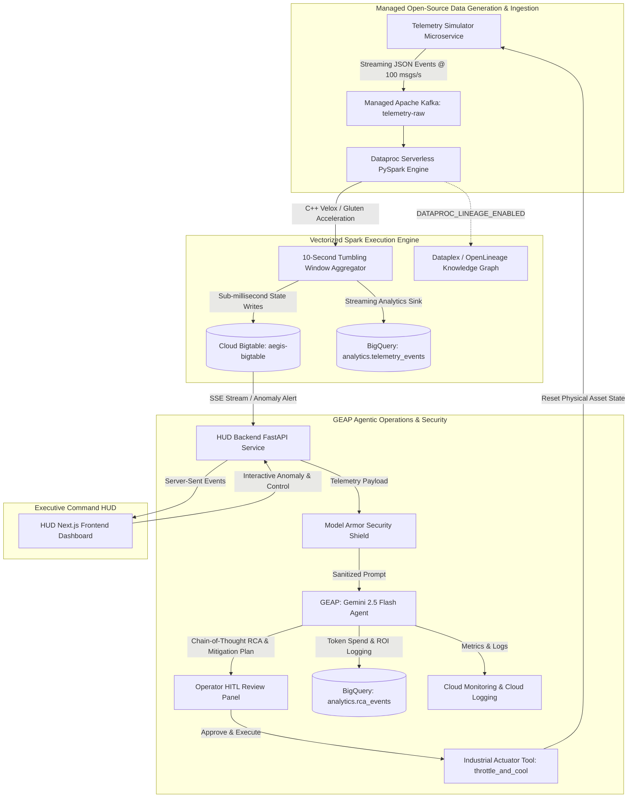

# Project Aegis: Enterprise Streaming & Agentic Operations Platform

<!-- markdownlint-disable MD024 -->

## Customer Engineering (CE) Go-To-Market (GTM) Walkthrough & Interactive Demo Guide

> **Target Audience:** Chief Technology Officers (CTOs), VPs of Data
> Infrastructure, Enterprise Architects, Chief Security Officers (CSOs), AI &
> Operations Leads **Duration:** 10 Minutes (Interactive 4-Stage Presentation &
> Walkthrough) **Key Google Cloud Products:** Google Cloud Managed Apache Kafka,
> Dataproc Serverless (C++ Lightning Engine / Velox & Gluten), Cloud Bigtable,
> Cloud BigQuery (Agent Analytics & Continuous Streaming), Cloud Run
> Microservices, Gemini Enterprise Agent Platform (GEAP) & Gemini 2.5 Flash,
> Model Armor Security Guardrails, Google Cloud Dataplex / Knowledge Graph
> (OpenLineage Integration).

---

## 🧭 Executive Command HUD Tour (5 Interactive Modules)

The Project Aegis Command HUD is organized into 5 dedicated, sequential modules
accessible via the top navigation bar:

| Module                         | Route        | Purpose & Key Features                                                                                                                                                                                                        |
| :----------------------------- | :----------- | :---------------------------------------------------------------------------------------------------------------------------------------------------------------------------------------------------------------------------- |
| **1. Executive Deck**          | `/slides`    | Interactive 10-slide architectural and C-level pitch deck embedded directly in the canvas (`aegis_autonomous_streaming.pdf`), covering business ROI, 2026 streaming architecture shifts, and C++ Velox benchmarks.            |
| **2. Stream Simulator**        | `/simulator` | Real-time telemetry generator control center. Start/stop stream, configure dynamic backpressure rates (15 to 500 msgs/sec), monitor live Kafka throughput, and trigger/monitor Dataproc Serverless streaming jobs.            |
| **3. Demo Guide**              | `/guide`     | Interactive 7-step presentation blueprint with presenter talk tracks, technical capability deep-dives, and direct Google Cloud Console deep links for all provisioned resources.                                              |
| **4. Live Grid & AI Co-Pilot** | `/grid`      | Real-time 15-asset operational Bigtable grid with sub-second SSE updates, one-click chaos anomaly injection (blind random fault), Gemini 2.5 Flash Co-Pilot RCA, and Human-in-the-Loop "Approve & Execute Mitigation" button. |
| **5. Batch Analytics**         | `/analytics` | Interactive BigQuery analytics workspace with pre-populated SQL queries for fleet-wide thermal stress, anomaly window detection, and AI tokenomics / financial ROI auditing.                                                  |

---

## 🚀 Quick Start & Single-Command Deployment

Customer Engineers can provision the entire Aegis infrastructure stack,
container repositories, build pipelines, and Cloud Run microservices with
standard Terraform.

### 1. Provision Infrastructure via Terraform

```bash
# Navigate to the terraform directory
cd terraform

# Initialize provider and state
terraform init

# Review and apply infrastructure setup
terraform apply -auto-approve
```

### 2. Verify Output Endpoints

Upon successful deployment, Terraform outputs all live service endpoints and
resource identifiers:

```bash
Outputs:

agent_service_url       = "projects/YOUR_PROJECT_ID/locations/us-central1/reasoningEngines/YOUR_AGENT_ID"
artifact_registry_repo  = "aegis-containers"
bigquery_dataset_id     = "analytics"
bigtable_instance_id    = "aegis-bigtable"
geap_agent_id           = "YOUR_AGENT_ID"
hud_backend_url         = "https://hud-backend-xxxx-uc.a.run.app"
hud_frontend_url        = "https://hud-frontend-xxxx-uc.a.run.app"
kafka_cluster_id        = "aegis-kafka-cluster"
kafka_topic_id          = "telemetry-raw"
project_id              = "YOUR_PROJECT_ID"
region                  = "us-central1"
service_account_email   = "aegis-sa@YOUR_PROJECT_ID.iam.gserviceaccount.com"
telemetry_simulator_url = "https://telemetry-simulator-xxxx-uc.a.run.app"
```

### 3. Launch Authenticated HUD Browser Proxy

To open the interactive HUD frontend in your browser with automatic Google Cloud
IAM credential proxying, run the helper script from the root directory:

```bash
./RUN_PROXY.sh
```

> **First-Time Run Note:** If `cloud-run-proxy` is not yet installed in your
> gcloud SDK, `gcloud` will prompt to install it. Type **`Y`** and press
> **Enter**. The script detects when the local proxy becomes active on
> `http://localhost:8080` before automatically launching your default browser.

---

## 📐 End-to-End Architecture Overview



---

## 🎬 Stage 1: Real-Time Ingestion & Vectorized Processing (2.5 Minutes)

### 🎯 Stage Objective

Demonstrate how Google Cloud ingests high-throughput Industrial IoT (IIoT)
telemetry with ultra-low latency using **Google Cloud Managed Apache Kafka** and
**Dataproc Serverless with C++ Lightning Engine (Velox/Gluten native
vectorization)**, writing streaming state to **Cloud Bigtable** in
sub-milliseconds.

---

### 🎙️ CE Delivery Script & Talk Track

| Action                              | CE Script / What to Say                                                                                                                                                                                                                                                                                                                                                                                                                             | System Action / What to Show                                                                                                                                                   |
| :---------------------------------- | :-------------------------------------------------------------------------------------------------------------------------------------------------------------------------------------------------------------------------------------------------------------------------------------------------------------------------------------------------------------------------------------------------------------------------------------------------- | :----------------------------------------------------------------------------------------------------------------------------------------------------------------------------- |
| **Opening & Executive Pitch**       | _"Welcome, team. Today we are demonstrating **Project Aegis**, Google Cloud's reference architecture for real-time streaming analytics and autonomous cognitive operations. Modern manufacturing and IoT applications process millions of sensor events per second. Traditional architectures struggle with high JVM garbage collection overhead, brittle stream scaling, and delayed incident mitigation. Let's look at how Aegis resolves this."_ | Open **Module 1: Executive Deck** (`/slides`) on the HUD or start at **Module 2: Stream Simulator** (`/simulator`).                                                            |
| **Managed Kafka Ingestion**         | _"Notice how telemetry data streams directly into **Google Cloud Managed Apache Kafka** at topic `telemetry-raw`. We are running an enterprise-grade message broker without managing broker VMs or Zookeeper/KRaft clusters. Telemetry spans 15 industrial machines broadcasting temperature, CPU utilization, pressure, and memory metrics."_                                                                                                      | Navigate to **Module 2: Stream Simulator** (`/simulator`). Click **Start Stream** (or adjust message rate to 100 msgs/s). Show the live Kafka throughput counter incrementing. |
| **C++ Lightning Engine (Velox)**    | _"Under the hood, Dataproc Serverless executes our PySpark Structured Streaming job using the **C++ Lightning Engine (Velox/Gluten native vectorization)**. By compiling Spark execution plans into vectorized native C++, CPU efficiency improves up to 4x, eliminating JVM garbage collection latency entirely."_                                                                                                                                 | Point to the **Managed Spark Pipeline** status card showing `RUNNING` with Velox C++ acceleration enabled.                                                                     |
| **Bigtable Dual-Sink Architecture** | _"Aggregated metrics are written instantly to **Cloud Bigtable** (`aegis-bigtable`, table `telemetry_metrics`). Bigtable guarantees single-digit millisecond latency for operational writes, allowing plant operators to monitor real-time asset health without placing query load on analytical data warehouses."_                                                                                                                                 | Navigate to **Module 4: Live Grid & AI Co-Pilot** (`/grid`). Show all 15 industrial asset tiles updating live every 2 seconds in nominal green status.                         |

---

### 🖥️ Live Demonstration Commands (Stage 1)

**1. Start Telemetry Stream via API (or via UI in Module 2):**

```bash
# Start synthetic telemetry stream across 15 assets at 100 msgs/sec
curl -X POST "https://hud-backend-xxxx-uc.a.run.app/api/start-stream" \
  -H "Content-Type: application/json" \
  -d '{"rate_msgs_per_sec": 100}'
```

**2. Operate Spark Streaming Pipeline via HUD (or Backend API):**

The Dataproc Serverless PySpark batch job is operated and monitored directly
from the HUD Command Center (via **Module 2: Stream Simulator** `/simulator` or
backend API):

```bash
# Start Dataproc Serverless PySpark streaming pipeline via HUD Backend API
curl -X POST "https://hud-backend-xxxx-uc.a.run.app/api/pipeline/start" \
  -H "Content-Type: application/json"

# Check pipeline execution status
curl -X GET "https://hud-backend-xxxx-uc.a.run.app/api/pipeline/status"
```

> [!NOTE]
>
> In production enterprise environments, Dataproc Serverless jobs require
> orchestration tools like Managed Apache Airflow to orchestrate workflows,
> manage dependencies, and monitor execution pipelines correctly.

**3. Inspect Live Bigtable Operational State:**

```bash
# Read live row key metrics for Asset-04 from Cloud Bigtable
cbt -project YOUR_PROJECT_ID -instance aegis-bigtable lookup telemetry_metrics Asset-04
```

---

### 💡 Key Technical Takeaways for Customer CTOs

1.  **Fully Managed Open-Source Backbone:** Managed Apache Kafka and Dataproc
    Serverless provide native open-source APIs without operational overhead.
1.  **C++ Native Acceleration:** Up to 300-400% performance boost over
    traditional Spark JVM, substantially driving down infrastructure costs.
1.  **Sub-Millisecond Operational Storage:** Bigtable handles continuous
    high-concurrency writes with guaranteed low latency.

---

## 🛡️ Stage 2: Chaos Injection, Model Armor & Gemini 2.5 Flash RCA (3 Minutes)

### 🎯 Stage Objective

Demonstrate how Aegis detects thermal and compute anomalies on industrial
equipment, passes alert payloads through **Model Armor** security shields to
prevent prompt injection and PII leakage, and executes **Gemini 2.5 Flash
Chain-of-Thought Root Cause Analysis (RCA)** in under 800ms.

---

### 🎙️ CE Delivery Script & Talk Track

| Action                        | CE Script / What to Say                                                                                                                                                                                                                                                                                               | System Action / What to Show                                                                                                                                                             |
| :---------------------------- | :-------------------------------------------------------------------------------------------------------------------------------------------------------------------------------------------------------------------------------------------------------------------------------------------------------------------- | :--------------------------------------------------------------------------------------------------------------------------------------------------------------------------------------- |
| **Chaos Anomaly Injection**   | _"In industrial streaming, immediate failure detection prevents millions in equipment damage. Let's trigger an unexpected mechanical failure across the fleet. Notice that our simulator injects chaos into a random asset without the frontend knowing beforehand."_                                                 | Click **Inject Anomaly** on **Module 4: Live Grid** (`/grid`). Observe the grid detect the spike and highlight the affected asset (e.g. Asset-04 or Asset-07) in **CRITICAL** red alert. |
| **Model Armor Guardrail**     | _"Before sending alert payloads to our AI Agent, enterprise security requires strict guardrails. Aegis routes every telemetry prompt through **Model Armor Security Shield** (`security.py`). Model Armor scrubs sensitive internal PII and neutralizes adversarial prompt injection vectors before LLM invocation."_ | Point to the security guardrail status badge in the Co-Pilot panel showing clean sanitization.                                                                                           |
| **Gemini 2.5 Flash Co-Pilot** | _"Once sanitized, the alert is analyzed by our **AnomalyMitigationAgent** built on the Google Agent Development Kit (ADK) pattern and deployed on **Gemini Enterprise Agent Platform (GEAP)**. Powered by **Gemini 2.5 Flash** (`gemini-2.5-flash`), the agent conducts multi-step Chain-of-Thought reasoning."_      | Click **Summon AI Co-Pilot / Analyze Anomaly**. Show the live RCA card populate with structured root cause analysis and a 4-step remediation plan in under 800ms.                        |

---

### 🖥️ Live Demonstration Commands (Stage 2)

**Inject Chaos Anomaly via API (or via HUD UI button):**

```bash
# Triggers thermal/CPU anomaly on a random fleet asset
curl -X POST "https://hud-backend-xxxx-uc.a.run.app/api/simulator/inject-anomaly" \
  -H "Content-Type: application/json"
```

**Trigger Direct Agent Root Cause Analysis:**

```bash
# Test Agent Service Root Cause Analysis directly
curl -X POST "https://hud-backend-xxxx-uc.a.run.app/api/agent/mitigate" \
  -H "Content-Type: application/json" \
  -d '{
    "asset_id": "Asset-04",
    "cpu_utilization": 96.2,
    "temperature_c": 94.5,
    "pressure_psi": 165.0,
    "memory_utilization_pct": 89.0,
    "status": "CRITICAL",
    "additional_context": "Thermal sensor T-102 reporting rapid temp climb."
  }'
```

---

### 💡 Key Technical Takeaways for Chief Security Officers & AI Leads

1.  **Model Armor Defense-in-Depth:** Protects LLM agents against adversarial
    prompt injections and sensitive data leaks before model execution.
1.  **Sub-Second Gemini 2.5 Flash Latency:** Delivers rich multi-step
    Chain-of-Thought reasoning in under 800ms.
1.  **Deterministic Schema Enforcement:** Guarantees strict Pydantic JSON
    structure for programmatic downstream triggers.

---

## ⚡ Stage 3: Human-in-the-Loop Approval & Autonomous Closed-Loop Recovery (2 Minutes)

### 🎯 Stage Objective

Demonstrate **Human-in-the-Loop (HITL) operational governance** where the plant
operator reviews the AI recommendations and clicks **Approve & Execute
Mitigation**, triggering the agent's **`IndustrialActuatorTool`** to dispatch
hardware control signals, reset the asset to safe baseline, resume clean Kafka
streaming, and restore the operational grid to nominal green in real time.

---

### 🎙️ CE Delivery Script & Talk Track

| Action                              | CE Script / What to Say                                                                                                                                                                                                                                                                                      | System Action / What to Show                                                                                           |
| :---------------------------------- | :----------------------------------------------------------------------------------------------------------------------------------------------------------------------------------------------------------------------------------------------------------------------------------------------------------- | :--------------------------------------------------------------------------------------------------------------------- |
| **Human-in-the-Loop Governance**    | _"Enterprise safety standards require human verification before altering physical factory equipment. Our operator reviews the 4-step remediation plan formulated by Gemini 2.5 Flash: throttle CPU clock speed, engage auxiliary coolant pumps, and rebalance streaming partitions."_                        | Show the operator approval interface and remediation steps in the **Agent Co-Pilot** panel.                            |
| **Closed-Loop Actuation Execution** | _"The operator clicks **Approve & Execute Mitigation**. The agent invokes its connected `IndustrialActuatorTool.throttle_and_cool`. The actuation control plane dispatches hardware commands to the physical machine."_                                                                                      | Click **Approve & Execute Mitigation** in the Co-Pilot panel. Watch the 6-step diagnostic trace light up in real time. |
| **Real-Time Fleet Recovery**        | _"Watch the live operational grid: within 2 seconds, the asset's CPU drops from 95% to 32%, core temperature falls from 94°C to 50°C, clean Kafka streaming resumes, and the asset status returns to **NOMINAL (Green)**. The incident is resolved without human manual intervention on the factory floor."_ | Point to the affected asset tile on the Live Grid transitioning back to green (OK/NOMINAL).                            |

---

### 🖥️ Live Demonstration Commands (Stage 3)

**Approve & Execute Closed-Loop Mitigation via API:**

```bash
# Execute Human-in-the-Loop approval and trigger IndustrialActuatorTool
curl -X POST "https://hud-backend-xxxx-uc.a.run.app/api/agent/approve" \
  -H "Content-Type: application/json" \
  -d '{
    "asset_id": "Asset-04",
    "approved_by": "Plant Lead Engineer",
    "incident_id": "INC-20260824-001"
  }'
```

---

### 💡 Key Technical Takeaways for Plant Managers & Operations Leads

1.  **Safe Human-in-the-Loop Control:** Balances autonomous AI speed with human
    authority over critical physical machinery.
1.  **True Closed-Loop Self-Healing:** Moves beyond passive dashboard alerting
    to automated physical system actuation.
1.  **Near-Zero MTTR:** Reduces Mean Time to Resolution from hours of manual
    troubleshooting to seconds.

---

## 📊 Stage 4: Tokenomics, Financial ROI & Data Governance (2.5 Minutes)

### 🎯 Stage Objective

Demonstrate enterprise financial governance with **BigQuery Agent Analytics
token spend tracking**, calculating **Token ROI** (Prevented Downtime value vs.
Gemini inference cost), and executing interactive SQL analytics via **Module 5:
Batch Analytics (`/analytics`)**.

---

### 🎙️ CE Delivery Script & Talk Track

| Action                            | CE Script / What to Say                                                                                                                                                                                                                                                                                               | System Action / What to Show                                                                                                                             |
| :-------------------------------- | :-------------------------------------------------------------------------------------------------------------------------------------------------------------------------------------------------------------------------------------------------------------------------------------------------------------------- | :------------------------------------------------------------------------------------------------------------------------------------------------------- |
| **Tokenomics & Cost Governance**  | _"Deploying enterprise AI requires strict financial auditing. Aegis implements the **bq-agent-sdk Tokenomics pattern** (`tokenomics.py`). Every agent invocation logs exact prompt tokens, completion tokens, latency, and USD inference cost directly to BigQuery table `analytics.rca_events`."_                    | Highlight the Tokenomics summary card in the Co-Pilot panel (Total tokens: ~450, Cost: ~$0.00018 USD).                                                   |
| **Unquestionable Financial ROI**  | _"Let's examine the financial return. A single unmitigated thermal failure on an industrial asset costs an estimated **$5,000 in lost factory output**. Gemini 2.5 Flash analyzed and remediated the anomaly for **$0.00018 USD**. That represents an ROI multiplier exceeding **27,000x to 50,000x** per incident."_ | Navigate to **Module 5: Batch Analytics** (`/analytics`) and select query **3. AI Co-Pilot Mitigation ROI & Token Accounting**. Click **Run SQL Query**. |
| **Data Provenance & OpenLineage** | _"Finally, regulatory compliance demands end-to-end data provenance. By setting `DATAPROC_LINEAGE_ENABLED=true`, Dataproc Serverless automatically publishes OpenLineage metadata to **Google Cloud Dataplex / Knowledge Graph**."_                                                                                   | Open BigQuery / Dataplex console links from Module 3 (`/guide`).                                                                                         |

---

### 🖥️ Live Demonstration Commands (Stage 4)

**Query BigQuery Token Spend & Incident Audit Logs:**

```sql
-- Run in Module 5: Batch Analytics (/analytics) or BigQuery Console
SELECT
  event_id,
  asset_id,
  timestamp,
  tokens_used,
  cost_usd,
  status,
  root_cause
FROM
  `YOUR_PROJECT_ID.analytics.rca_events`
ORDER BY
  timestamp DESC
LIMIT 10;
```

**Calculate Fleet-Wide Prevented Downtime ROI:**

```sql
SELECT
  COUNT(*) AS total_incidents_mitigated,
  SUM(tokens_used) AS total_tokens_consumed,
  ROUND(SUM(cost_usd), 6) AS total_gemini_cost_usd,
  ROUND(SUM(5000.0), 2) AS total_downtime_saved_usd,
  ROUND(SUM(5000.0) / NULLIF(SUM(cost_usd), 0), 1) AS roi_multiplier
FROM
  `YOUR_PROJECT_ID.analytics.rca_events`;
```

---

### 💡 Key Technical Takeaways for CFOs & Data Governance Leads

1.  **Granular Cost Tracking:** Every LLM token and dollar fraction is recorded
    in BigQuery for enterprise auditability.
1.  **Quantifiable ROI Proof:** Proves the immediate economic return of
    autonomous AI mitigation over manual troubleshooting.
1.  **Automated Lineage Traceability:** OpenLineage integration satisfies
    compliance and audit requirements out of the box.

---

## ❓ Frequently Asked Questions & Objection Handling (CE Playbook)

### Q1: "Why use Cloud Bigtable instead of storing streaming telemetry directly in BigQuery?"

> **CE Answer:** Bigtable provides sub-millisecond point reads and writes at
> high concurrency, making it ideal for live operational HUD displays, real-time
> alerting, and sub-second control loops. BigQuery is our analytical warehouse
> for partitioned ad-hoc SQL, multi-day trend analysis, and historical LLM
> tokenomics. Aegis uses both in a high-efficiency dual-sink architecture.

### Q2: "How does the C++ Lightning Engine (Velox/Gluten) differ from standard PySpark?"

> **CE Answer:** Standard PySpark executes inside JVM executors with significant
> object serialization and garbage collection pauses. Velox converts Spark
> execution plans into vectorized C++ native code operating directly on columnar
> memory, delivering 2-4x speedups and predictable low-latency window
> aggregations without JVM GC overhead.

### Q3: "Is Model Armor custom-built or integrated with Google Cloud Security services?"

> **CE Answer:** Model Armor in Aegis provides lightweight inline sanitization
> for payload PII redaction and prompt injection neutralization (`security.py`),
> designed to integrate directly with Google Cloud Armor and Sensitive Data
> Protection (Cloud DLP).

### Q4: "How does closed-loop actuation work safely with human-in-the-loop controls?"

> **CE Answer:** Aegis enforces a two-tier actuation plane: the AI Agent
> performs cognitive diagnosis and generates structured remediation steps, but
> physical tool actuation (`IndustrialActuatorTool.throttle_and_cool`) requires
> explicit human approval via the authenticated HUD command center.

---

## 🏁 Summary Checklist for Demo Success

- [ ] Run `terraform apply` to ensure all Cloud Run services, Bigtable
      instances, and Kafka topics are provisioned.
- [ ] Launch `./RUN_PROXY.sh` to open the authenticated HUD on
      `http://localhost:8080`.
- [ ] Confirm **Module 2: Stream Simulator** (`/simulator`) is streaming events
      to Managed Apache Kafka (`telemetry-raw`).
- [ ] Verify **Module 4: Live Grid** (`/grid`) displays all 15 assets updating
      live in green nominal state.
- [ ] Test the **Inject Anomaly** and **Approve & Execute Mitigation** workflow
      before executive presentation.
- [ ] Check **Module 5: Batch Analytics** (`/analytics`) to verify interactive
      BigQuery SQL query execution.
