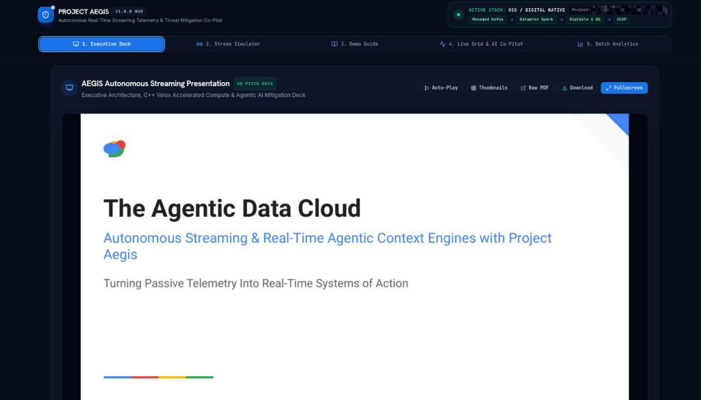
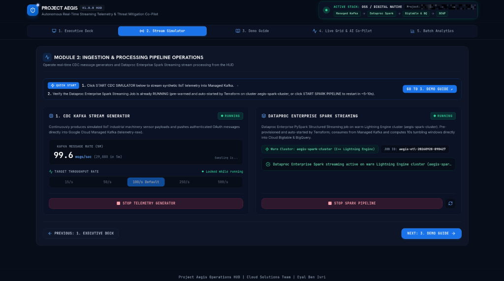
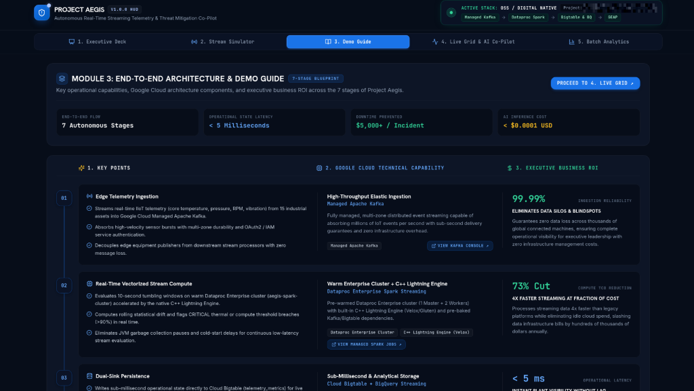
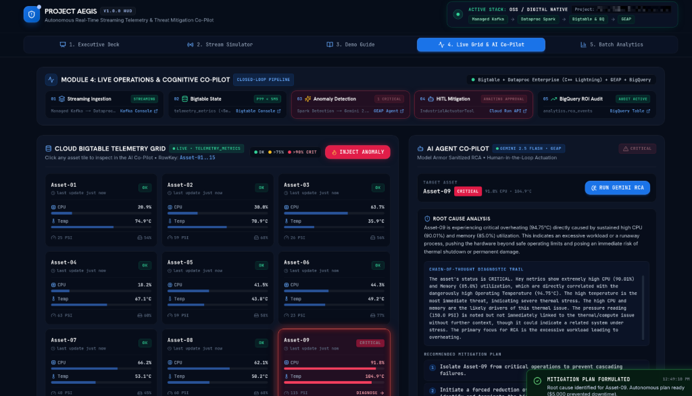
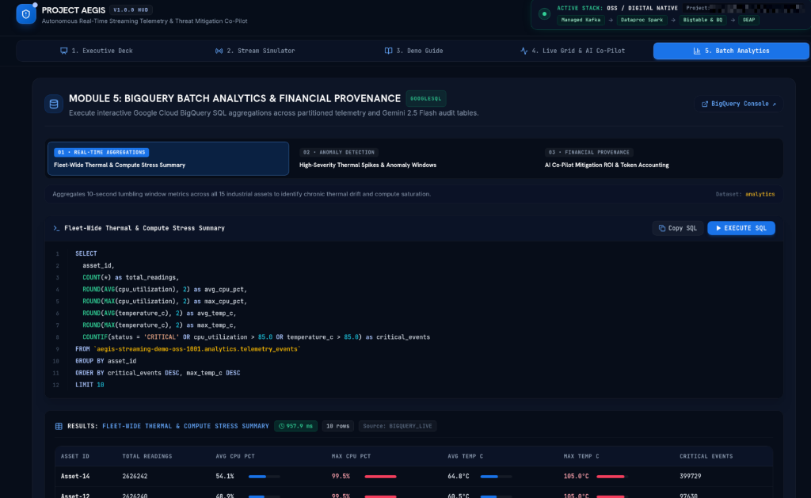
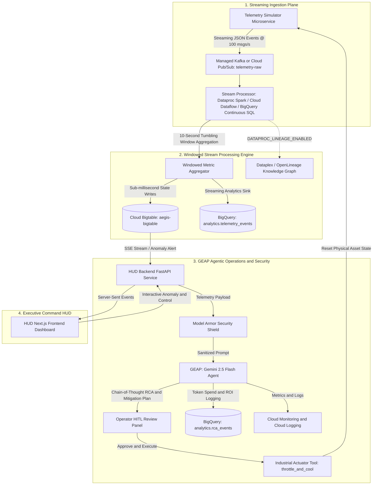

# Project Aegis: Enterprise streaming and agentic operations platform

<!--
    Disabling markdownlint MD024 because stage subsections (Stage objective,
    CE delivery script and talk track) intentionally repeat across Stages 1-4.
-->
<!-- markdownlint-disable MD024 -->

## Customer Engineering (CE) go-to-market walkthrough and interactive demo guide

- **Target Audience:** Chief Technology Officers (CTOs), Vice Presidents (VPs)
  of Data Infrastructure, Enterprise Architects, Chief Security Officers (CSOs),
  and Artificial Intelligence (AI) and Operations Leads
- **Duration:** 10 Minutes (Interactive 4-Stage Presentation and Walkthrough)
- **Key Google Cloud Products:** Google Cloud Managed Apache Kafka, Google Cloud
  Pub/Sub, Dataproc cluster `aegis-spark-cluster` on `CLUSTER_TIER_STANDARD`
  with vectorized Spark execution and optional `CLUSTER_TIER_PREMIUM` C++
  Lightning Engine (Velox and Gluten), Cloud Dataflow with Apache Beam Streaming
  Engine, BigQuery Continuous Queries, Cloud Bigtable, BigQuery Agent Analytics,
  Cloud Run microservices, Gemini Enterprise Agent Platform (GEAP) with Gemini
  2.5 Flash, Model Armor security guardrails, and Google Cloud Dataplex
  Knowledge Graph with OpenLineage integration.

## Multi-stack reference architecture (3 deployable stacks)

Project Aegis supports three modular streaming technology stacks that share a
common dual-sink persistence layer using Cloud Bigtable and BigQuery, Model
Armor security guardrails, and the Gemini 2.5 Flash reasoning engine on GEAP.

The Heads-Up Display (HUD) header displays a persistent **Active Stack**
indicator badge on every page showing the active architecture name
(`ACTIVE STACK: <STACK_NAME>`), the target Google Cloud project
(`Project: <project_id>`), and the 4-stage pipeline topology chips:

| Architecture Stack                              | Header Badge Title            | Ingestion Bus               | Stream Compute Engine                                                                             | Operational and Analytical Sinks      | Terraform Directory            |
| :---------------------------------------------- | :---------------------------- | :-------------------------- | :------------------------------------------------------------------------------------------------ | :------------------------------------ | :----------------------------- |
| **Open-Source Software (OSS) / Digital Native** | `OSS / DIGITAL NATIVE`        | Managed Apache Kafka        | Warm Dataproc cluster `aegis-spark-cluster` (`CLUSTER_TIER_STANDARD` vectorized or C++ Lightning) | Cloud Bigtable (`<5 ms`) and BigQuery | `terraform/stacks/oss`         |
| **1st-Party Managed**                           | `1ST-PARTY MANAGED STREAMING` | Google Cloud Pub/Sub        | Cloud Dataflow with Apache Beam 10s fixed windows and 1s early trigger                            | Cloud Bigtable (`<5 ms`) and BigQuery | `terraform/stacks/first-party` |
| **Low-Code Serverless**                         | `LOW-CODE SERVERLESS`         | Google Cloud Pub/Sub Direct | BigQuery Continuous Queries with serverless 10s tumbling window Structured Query Language (SQL)   | Cloud Bigtable (`<5 ms`) and BigQuery | `terraform/stacks/low-code`    |

## Executive command HUD tour (5 interactive modules)

The Project Aegis Command HUD organizes operations into 5 sequential modules
accessible from the top segmented navigation bar:

| Module                           | Route        | Purpose and Key Features                                                                                                                                                                                                                                     |
| :------------------------------- | :----------- | :----------------------------------------------------------------------------------------------------------------------------------------------------------------------------------------------------------------------------------------------------------- |
| **1. Executive Deck**            | `/slides`    | 16:9 presentation canvas (`aegis_autonomous_streaming.pdf`) with a unified toolbar featuring `Auto-Play`, `Thumbnails`, `Raw PDF`, `Download`, and `Fullscreen` controls, covering business Return on Investment (ROI), streaming patterns, and benchmarks.  |
| **2. Stream Simulator**          | `/simulator` | Real-time ingestion and pipeline control center. Includes a single-row `Quick Start` readiness bar, 5-minute message rate readout, segmented throughput selector from `15/s` to `500/s`, and stream processor start and stop controls.                       |
| **3. Demo Guide**                | `/guide`     | 7-stage end-to-end architecture blueprint with 4 top Key Performance Indicator (KPI) summary cards and a 3-column stage breakdown covering `1. Key Points`, `2. Google Cloud Technical Capability` with Console deep links, and `3. Executive Business ROI`. |
| **4. Live Grid and AI Co-Pilot** | `/grid`      | 5-step closed-loop pipeline status bar and a side-by-side 12-column split workspace combining the 15-asset Cloud Bigtable telemetry grid, featuring `INJECT ANOMALY` and `DIAGNOSE` controls, with the sticky Gemini 2.5 Flash Co-Pilot and ROI Hero Strip.  |
| **5. Batch Analytics**           | `/analytics` | Interactive BigQuery GoogleSQL workspace with a 3-tab query selector covering `01 Real-Time Aggregations`, `02 Anomaly Detection`, and `03 Financial Provenance`, a SQL editor, and live query results with inline visual progress bars.                     |

### Module 1: Executive deck (`/slides`)



Module 1 embeds the 16:9 executive presentation deck with interactive playback,
slide thumbnails, and fullscreen presentation controls.

### Module 2: Stream simulator (`/simulator`)



Module 2 provides real-time telemetry rate selectors, a 5-minute throughput
readout, and lifecycle controls for the active streaming compute pipeline.

### Module 3: End-to-end architecture and demo guide (`/guide`)



Module 3 presents the 7-stage architectural blueprint alongside executive KPI
cards and direct deep links to live Google Cloud Console resources.

### Module 4: Live operations and cognitive co-pilot (`/grid`)



Module 4 pairs the 15-asset Cloud Bigtable operational grid with the Gemini 2.5
Flash Co-Pilot panel for root cause diagnosis and Human-in-the-Loop (HITL)
mitigation approval.

### Module 5: BigQuery batch analytics and financial provenance (`/analytics`)



Module 5 delivers an interactive BigQuery GoogleSQL workspace for auditing fleet
stress aggregations, anomaly spikes, and AI tokenomics ROI.

## Quick start and single-command deployment

CEs can provision any of the three Aegis infrastructure stacks, container
repositories, streaming engines, and Cloud Run microservices with Terraform.

### 1. Provision infrastructure with Terraform

```bash
# Navigate to the desired stack directory, such as oss, first-party, or low-code
cd terraform/stacks/oss

# Initialize provider and state
terraform init

# Apply infrastructure setup
terraform apply -auto-approve
```

> [!NOTE]
>
> During `terraform apply` on the `oss` stack, Terraform provisions the warm
> **Dataproc cluster (`aegis-spark-cluster`)** on image `2.2-debian12` using
> `CLUSTER_TIER_STANDARD` with vectorized Spark reader properties enabled (or
> optional `CLUSTER_TIER_PREMIUM` with the C++ Lightning Engine for allowlisted
> projects), pre-installs the Kafka OAuth and Bigtable dependencies, and
> **submits the initial PySpark Structured Streaming job**. When you open the
> HUD, the Spark streaming job is already `RUNNING`.

### 2. Verify output endpoints and stack health

Upon deployment completion, Terraform outputs all live service endpoints and
resource identifiers:

```bash
Outputs:

agent_service_url       = "projects/YOUR_PROJECT_ID/locations/us-central1/reasoningEngines/YOUR_AGENT_ID"
artifact_registry_repo  = "aegis-containers"
bigquery_dataset_id     = "analytics"
bigtable_instance_id    = "aegis-bigtable"
dataproc_cluster_name   = "aegis-spark-cluster"
dataproc_deps_bucket    = "YOUR_PROJECT_ID-dataproc-deps"
geap_agent_id           = "YOUR_AGENT_ID"
hud_backend_url         = "https://hud-backend-xxxx-uc.a.run.app"
hud_frontend_url        = "https://hud-frontend-xxxx-uc.a.run.app"
kafka_cluster_id        = "aegis-kafka-cluster"
kafka_topic_id          = "telemetry-raw"
project_id              = "YOUR_PROJECT_ID"
region                  = "us-central1"
service_account_email   = "aegis-sa@YOUR_PROJECT_ID.iam.gserviceaccount.com"
telemetry_simulator_url = "https://telemetry-simulator-xxxx-uc.a.run.app"
```

Run the unified multi-stack verification Command-Line Interface (CLI) from the
project root to verify Cloud Run services, streaming pipelines, Cloud Bigtable
freshness, and BigQuery tables:

```bash
# Verify all deployed stacks, or pass --stack oss, first-party, or low-code
python3 _agents/scripts/verify_all.py --stack all
```

### 3. Launch authenticated HUD browser proxy

To open the interactive HUD frontend in your browser with Google Cloud Identity
and Access Management (IAM) credential proxying, run the helper script from the
root directory:

```bash
./RUN_PROXY.sh
```

> [!NOTE]
>
> If your Google Cloud CLI installation does not yet include `cloud-run-proxy`,
> `gcloud` prompts you to install it. Type **`Y`** and press **Enter**. The
> script detects when the local proxy becomes active on `http://localhost:8080`
> before launching your default browser.

## End-to-end architecture overview


```mermaid
flowchart TD
    subgraph Ingestion ["1. Streaming Ingestion Plane"]
        A[Telemetry Simulator Microservice] -->|Streaming JSON Events @ 100 msgs/s| B[Managed Kafka or Cloud Pub/Sub: telemetry-raw]
        B --> C[Stream Processor: Dataproc Spark / Cloud Dataflow / BigQuery Continuous SQL]
    end

    subgraph Compute ["2. Windowed Stream Processing Engine"]
        C -->|10-Second Tumbling Window Aggregation| D[Windowed Metric Aggregator]
        D -->|Sub-millisecond State Writes| E[(Cloud Bigtable: aegis-bigtable)]
        D -->|Streaming Analytics Sink| F[(BigQuery: analytics.telemetry_events)]
        C -.->|DATAPROC_LINEAGE_ENABLED| G[Dataplex / OpenLineage Knowledge Graph]
    end

    subgraph Agentic ["3. GEAP Agentic Operations and Security"]
        E -->|SSE Stream / Anomaly Alert| H[HUD Backend FastAPI Service]
        H -->|Telemetry Payload| I[Model Armor Security Shield]
        I -->|Sanitized Prompt| J[GEAP: Gemini 2.5 Flash Agent]
        J -->|Chain-of-Thought RCA and Mitigation Plan| K[Operator HITL Review Panel]
        K -->|Approve and Execute| L[Industrial Actuator Tool: throttle_and_cool]
        L -->|Reset Physical Asset State| A
        J -->|Token Spend and ROI Logging| M[(BigQuery: analytics.rca_events)]
        J -->|Metrics and Logs| N[Cloud Monitoring and Cloud Logging]
    end

    subgraph Experience ["4. Executive Command HUD"]
        H -->|Server-Sent Events| O[HUD Next.js Frontend Dashboard]
        O -->|Interactive Anomaly and Control| H
    end
```

## Stage 1: Real-time ingestion and vectorized processing (2.5 minutes)

### Stage objective

Demonstrate how Google Cloud ingests high-throughput Industrial Internet of
Things (IIoT) telemetry with low latency using **Google Cloud Managed Apache
Kafka** or **Cloud Pub/Sub** and processes 10-second tumbling windows using a
warm **Dataproc cluster (`aegis-spark-cluster`) on `CLUSTER_TIER_STANDARD` with
vectorized Spark execution** (or optional `CLUSTER_TIER_PREMIUM` C++ Lightning
Engine with Velox and Gluten vectorization), **Cloud Dataflow**, or **BigQuery
Continuous Queries**, writing operational state to **Cloud Bigtable** in
sub-milliseconds.

### CE delivery script and talk track

| Action                                  | CE Script / What to Say                                                                                                                                                                                                                                                                                                                                                                                                                            | System Action / What to Show                                                                                                                                                                                                   |
| :-------------------------------------- | :------------------------------------------------------------------------------------------------------------------------------------------------------------------------------------------------------------------------------------------------------------------------------------------------------------------------------------------------------------------------------------------------------------------------------------------------- | :----------------------------------------------------------------------------------------------------------------------------------------------------------------------------------------------------------------------------- |
| **Opening and Active Stack Header**     | _"Welcome, team. Today we are demonstrating **Project Aegis**, Google Cloud's reference architecture for real-time streaming analytics and autonomous cognitive operations. Notice the **Active Stack** indicator in the top-right header, which confirms our live deployment architecture, Google Cloud project ID, and 4-stage data pipeline."_                                                                                                  | Open **Module 1: Executive Deck** (`/slides`) on the HUD and point out the **Active Stack** badge in the top header.                                                                                                           |
| **Managed Ingestion and Rate Control**  | _"In **Module 2: Stream Simulator**, telemetry data streams directly into **Google Cloud Managed Apache Kafka** at topic `telemetry-raw` across 15 industrial machines broadcasting temperature, Central Processing Unit (CPU) utilization, pressure, and memory metrics. Operators can adjust target throughput from 15 to 500 messages per second."_                                                                                             | Navigate to **Module 2: Stream Simulator** (`/simulator`). Point to the `Quick Start` bar, the live 5-minute message rate (`99.6 msgs/sec`), and the segmented throughput rate selector from `15/s` to `500/s`.                |
| **Stream Compute Engine**               | _"On the right card, Terraform has pre-provisioned a warm **Dataproc cluster (`aegis-spark-cluster`)** on `2.2-debian12` (`CLUSTER_TIER_STANDARD`) with vectorized Spark execution enabled, and started our PySpark Structured Streaming job. On allowlisted projects, enabling `CLUSTER_TIER_PREMIUM` with the C++ Lightning Engine compiles Spark plans into vectorized C++, eliminating Java Virtual Machine (JVM) garbage collection pauses."_ | Point to the **Dataproc Spark Streaming** card showing `RUNNING`, the warm cluster `aegis-spark-cluster` badge, and the active job ID.                                                                                         |
| **7-Stage Architecture and Key Points** | _"In **Module 3: Demo Guide**, customers can explore all 7 autonomous stages of the platform side by side: **1. Key Points**, **2. Google Cloud Technical Capability** with direct Google Cloud Console deep links, and **3. Executive Business ROI**."_                                                                                                                                                                                           | Navigate to **Module 3: Demo Guide** (`/guide`). Highlight the 4 top KPI summary cards covering `7 Autonomous Stages`, `< 5 Milliseconds`, `$5,000+ / Incident`, and `< $0.0001 USD`, along with the 3-column stage breakdown. |

### Live demonstration commands (Stage 1)

#### 1. Start the telemetry stream through the API or Module 2 UI

```bash
# Start synthetic telemetry stream across 15 assets at 100 msgs/sec
curl -X POST "https://hud-backend-xxxx-uc.a.run.app/api/start-stream" \
  -H "Content-Type: application/json" \
  -d '{"rate_msgs_per_sec": 100}'
```

#### 2. Operate the streaming pipeline through the HUD or backend API

Terraform starts the streaming pipeline during `terraform apply`, and operators
can also check status, stop, or restart the pipeline directly from **Module 2:
Stream Simulator** (`/simulator`) or the backend Application Programming
Interface (API):

```bash
# Check active streaming pipeline status
curl -X GET "https://hud-backend-xxxx-uc.a.run.app/api/pipeline/status"

# Start or restart the streaming pipeline
curl -X POST "https://hud-backend-xxxx-uc.a.run.app/api/pipeline/start" \
  -H "Content-Type: application/json"
```

#### 3. Inspect live Cloud Bigtable operational state

```bash
# Read live row key metrics for Asset-04 from Cloud Bigtable
cbt -project YOUR_PROJECT_ID -instance aegis-bigtable lookup telemetry_metrics Asset-04
```

#### 4. Inspect end-to-end millisecond latency metrics through the HUD backend API

Every asset payload returned by `/api/telemetry/assets` and `/api/stream`
includes millisecond-resolution timestamps, specifically
`ingestion_timestamp_ms`, `db_insert_timestamp_ms`, and `pipeline_latency_ms`:

```bash
# Query live asset states with millisecond ingestion and Bigtable insert timestamps
curl -s "https://hud-backend-xxxx-uc.a.run.app/api/telemetry/assets" | jq '.assets[0] | {asset_id, status, ingestion_timestamp_ms, db_insert_timestamp_ms, pipeline_latency_ms}'
```

> [!TIP]
>
> **Spark Shuffle Partitioning and Cluster Scaling:** Stateful 10-second
> tumbling windows in `aegis_etl.py` commit one state-store delta file to Cloud
> Storage per shuffle partition on every micro-batch. Keep
> `spark.sql.shuffle.partitions` (`--shuffle-partitions` in `aegis_etl.py` and
> `override_properties` in `terraform/modules/stack_oss/dataproc_cluster.tf`)
> aligned with total Dataproc worker virtual CPUs (vCPUs), calculated as
> `num_workers * vcpus_per_worker`, such as `8` for the default
> `2x n2-standard-4` workers (8 vCPUs total) or `4` for `2x e2-standard-2`
> workers, so scaling the cluster scales state checkpoint parallelism
> proportionally.

### Key technical takeaways for customer CTOs

1.  **Flexible Multi-Stack Ingestion and Compute:** Choose between Managed
    Apache Kafka with Dataproc Spark (`oss`), Cloud Pub/Sub with Cloud Dataflow
    (`first-party`), or Cloud Pub/Sub Direct with BigQuery Continuous Queries
    (`low-code`).
1.  **Vectorized Spark Acceleration:** Achieve high-throughput columnar
    execution using vectorized Spark reader properties on
    `CLUSTER_TIER_STANDARD` (`2.2-debian12`), with up to 300-400% performance
    improvements over standard Spark JVM execution when enabling optional
    `CLUSTER_TIER_PREMIUM` C++ Lightning Engine (Velox and Gluten) on
    allowlisted projects.
1.  **Sub-Millisecond Operational Storage:** Cloud Bigtable handles continuous
    high-concurrency writes with single-digit millisecond latency and tracks
    end-to-end `pipeline_latency_ms`.

## Stage 2: Chaos injection, Model Armor, and Gemini 2.5 Flash RCA (3 minutes)

### Stage objective

Demonstrate how Aegis detects thermal and compute anomalies on industrial
equipment in **Module 4: Live Grid and AI Co-Pilot** (`/grid`), passes alert
payloads through **Model Armor** security shields to prevent prompt injection
and Personally Identifiable Information (PII) leakage, and executes **Gemini 2.5
Flash Chain-of-Thought Root Cause Analysis (RCA)** in the sticky right-hand
Co-Pilot panel.

### CE delivery script and talk track

| Action                        | CE Script / What to Say                                                                                                                                                                                                                                                                                                           | System Action / What to Show                                                                                                                                                                                                                      |
| :---------------------------- | :-------------------------------------------------------------------------------------------------------------------------------------------------------------------------------------------------------------------------------------------------------------------------------------------------------------------------------- | :------------------------------------------------------------------------------------------------------------------------------------------------------------------------------------------------------------------------------------------------ |
| **Closed-Loop Pipeline Bar**  | _"In **Module 4: Live Grid and AI Co-Pilot**, the top 5-step **Closed-Loop Pipeline** status bar tracks our end-to-end operational flow across `01 Streaming Ingestion`, `02 Bigtable State`, `03 Anomaly Detection`, `04 HITL Mitigation`, and `05 BigQuery ROI Audit`, with direct Google Cloud Console links on every stage."_ | Navigate to **Module 4: Live Grid and AI Co-Pilot** (`/grid`). Point to the 5-step pipeline bar at the top of the workspace and the 15 nominal asset tiles on the left.                                                                           |
| **Chaos Anomaly Injection**   | _"Let's trigger an unexpected mechanical failure across the fleet by clicking **Inject Anomaly**. The simulator injects a thermal and CPU fault into a random asset without the frontend knowing beforehand. Only after the streaming window writes the anomaly to Cloud Bigtable does the tile illuminate in crimson alert."_    | Click **Inject Anomaly** in the Cloud Bigtable Telemetry Grid header. Watch the affected asset tile, such as `Asset-09`, glow in crimson (`CRITICAL`) with a `DIAGNOSE` action prompt, while pipeline stages `03` and `04` illuminate in crimson. |
| **Model Armor Guardrail**     | _"Before sending alert payloads to our AI Agent, Aegis routes every telemetry prompt through **Model Armor Security Shield** (`security.py`) to scrub internal PII and neutralize adversarial prompt injection vectors before Large Language Model (LLM) invocation."_                                                            | Select the critical asset tile or click **Run Gemini RCA** in the sticky right-hand **AI Agent Co-Pilot** panel.                                                                                                                                  |
| **Gemini 2.5 Flash Co-Pilot** | _"Once sanitized, our **AnomalyMitigationAgent** on **GEAP** analyzes the incident using **Gemini 2.5 Flash**. Within a second, the Co-Pilot panel populates the **Root Cause Analysis**, the **Chain-of-Thought Diagnostic Trail**, and a numbered **Recommended Mitigation Plan**."_                                            | Show the sticky right-hand **AI Agent Co-Pilot** panel displaying `ROOT CAUSE ANALYSIS`, `CHAIN-OF-THOUGHT DIAGNOSTIC TRAIL`, and `RECOMMENDED MITIGATION PLAN`.                                                                                  |

### Live demonstration commands (Stage 2)

#### 1. Inject a chaos anomaly through the API or HUD UI

```bash
# Triggers thermal/CPU anomaly on a random fleet asset
curl -X POST "https://hud-backend-xxxx-uc.a.run.app/api/simulator/inject-anomaly" \
  -H "Content-Type: application/json"
```

#### 2. Trigger direct agent root cause analysis

```bash
# Test Agent Service Root Cause Analysis directly
curl -X POST "https://hud-backend-xxxx-uc.a.run.app/api/agent/mitigate" \
  -H "Content-Type: application/json" \
  -d '{
    "asset_id": "Asset-09",
    "cpu_utilization": 91.8,
    "temperature_c": 104.9,
    "pressure_psi": 115.0,
    "memory_utilization_pct": 85.0,
    "status": "CRITICAL",
    "additional_context": "Thermal sensor T-102 reporting rapid temp climb."
  }'
```

### Key technical takeaways for CSOs and AI leads

1.  **Model Armor Defense-in-Depth:** Protects LLM agents against adversarial
    prompt injections and sensitive data leaks before model execution.
1.  **Sub-Second Gemini 2.5 Flash Latency:** Delivers multi-step
    Chain-of-Thought reasoning and structured remediation plans in under 800ms.
1.  **Side-by-Side Operational Ergonomics:** Keeps the 15-asset Cloud Bigtable
    grid and the AI Agent Co-Pilot visible simultaneously without page
    scrolling.

## Stage 3: Human-in-the-loop approval and autonomous closed-loop recovery (2 minutes)

### Stage objective

Demonstrate **HITL operational governance** where the plant operator reviews the
AI recommendations and the **ROI Hero Strip** metrics for `AI Cost`, `Saved`,
and `Net ROI`, then clicks **Approve and Execute Mitigation** to trigger the
agent's **`IndustrialActuatorTool`**, normalize the physical machine state, and
watch the recovery flow back through the streaming pipeline into Cloud Bigtable.

### CE delivery script and talk track

| Action                              | CE Script / What to Say                                                                                                                                                                                                                                                                                           | System Action / What to Show                                                                                                                                 |
| :---------------------------------- | :---------------------------------------------------------------------------------------------------------------------------------------------------------------------------------------------------------------------------------------------------------------------------------------------------------------- | :----------------------------------------------------------------------------------------------------------------------------------------------------------- |
| **Human-in-the-Loop Governance**    | _"Enterprise safety standards require human verification before altering physical factory equipment. Beneath the mitigation steps, the **ROI Hero Strip** summarizes the inference cost (`~$0.00018`), prevented downtime (`$5,000`), and net ROI (`>27,000x`) alongside exact token and latency metrics."_       | Point to the 3-column **ROI Hero Strip** displaying `AI Cost`, `Saved`, and `Net ROI`, and the full-width emerald **Approve and Execute Mitigation** button. |
| **Closed-Loop Actuation Execution** | _"When the operator clicks **Approve and Execute Mitigation**, the HUD does not optimistically fake a green state. Instead, the GEAP agent invokes `IndustrialActuatorTool.throttle_and_cool`, which calls the simulator's `/api/fix-anomoly` endpoint using Google Cloud OpenID Connect (OIDC) authentication."_ | Click **Approve and Execute Mitigation** in the Co-Pilot panel. Watch the closed-loop execution timeline step through each stage.                            |
| **Real-Time Fleet Recovery**        | _"Healthy sensor readings now flow through our message bus and 10-second tumbling window back into Cloud Bigtable. As soon as Bigtable updates, the Server-Sent Events (SSE) stream transitions the asset tile back to nominal blue/green and clears the alert."_                                                 | Point to the affected asset tile on the Cloud Bigtable Telemetry Grid returning to `OK` status as the new window lands in Cloud Bigtable.                    |

### Live demonstration commands (Stage 3)

#### 1. Approve and execute closed-loop mitigation through the API

```bash
# Execute Human-in-the-Loop approval and trigger IndustrialActuatorTool
curl -X POST "https://hud-backend-xxxx-uc.a.run.app/api/agent/approve" \
  -H "Content-Type: application/json" \
  -d '{
    "asset_id": "Asset-09",
    "approved_by": "Plant Lead Engineer",
    "incident_id": "INC-20260928-001"
  }'
```

### Key technical takeaways for plant managers and operations leads

1.  **Safe Human-in-the-Loop Control:** Balances autonomous AI speed with human
    authority over critical physical machinery.
1.  **Genuine Closed-Loop Verification:** Neither the frontend nor the backend
    mutates Cloud Bigtable directly during remediation. The live streaming
    pipeline verifies recovery end to end.
1.  **Low Mean Time to Resolution (MTTR):** Reduces MTTR from hours of manual
    troubleshooting to seconds.

## Stage 4: Tokenomics, financial ROI, and data governance (2.5 minutes)

### Stage objective

Demonstrate enterprise financial governance with **BigQuery Agent Analytics
token spend tracking**, calculating **Token ROI** by comparing prevented
downtime value to Gemini inference cost, and executing interactive GoogleSQL
queries in **Module 5: Batch Analytics (`/analytics`)**.

### CE delivery script and talk track

| Action                             | CE Script / What to Say                                                                                                                                                                                                                                                                        | System Action / What to Show                                                                                                                                                    |
| :--------------------------------- | :--------------------------------------------------------------------------------------------------------------------------------------------------------------------------------------------------------------------------------------------------------------------------------------------- | :------------------------------------------------------------------------------------------------------------------------------------------------------------------------------ |
| **3-Tab BigQuery Workspace**       | _"In **Module 5: Batch Analytics**, data architects and financial auditors can run live GoogleSQL queries against our partitioned BigQuery tables, `analytics.telemetry_events` and `analytics.rca_events`, using the 3-tab query selector."_                                                  | Navigate to **Module 5: Batch Analytics** (`/analytics`). Show the 3 horizontal query tabs: `01 Real-Time Aggregations`, `02 Anomaly Detection`, and `03 Financial Provenance`. |
| **Visual Stress and Spike Audits** | _"Running tab **01: Fleet-Wide Thermal and Compute Stress Summary** aggregates millions of streaming telemetry readings in under a second and renders inline visual progress bars for average and maximum CPU and temperature right inside the results table."_                                | Click **Execute SQL** on tab `01` and highlight the query execution latency badge (`~950 ms`), row count, and inline blue/crimson progress bars in the results table.           |
| **Financial ROI and Tokenomics**   | _"Selecting tab **03: AI Co-Pilot Mitigation ROI and Token Accounting** audits every Gemini 2.5 Flash invocation in `analytics.rca_events`. Comparing **$5,000 in prevented downtime** per incident against **~$0.00018 USD** in token spend proves an ROI multiplier exceeding **27,000x**."_ | Select tab **03 • Financial Provenance: AI Co-Pilot Mitigation ROI and Token Accounting** and click **Execute SQL**.                                                            |

### Live demonstration commands (Stage 4)

#### 1. Query BigQuery token spend and incident audit logs

```sql
-- Run in Module 5: Batch Analytics (/analytics) or BigQuery Console
SELECT
  event_id,
  asset_id,
  timestamp,
  tokens_used,
  cost_usd,
  status,
  root_cause
FROM
  `YOUR_PROJECT_ID.analytics.rca_events`
ORDER BY
  timestamp DESC
LIMIT 10;
```

#### 2. Calculate fleet-wide prevented downtime ROI

```sql
SELECT
  COUNT(*) AS total_incidents_mitigated,
  SUM(tokens_used) AS total_tokens_consumed,
  ROUND(SUM(cost_usd), 6) AS total_gemini_cost_usd,
  ROUND(SUM(5000.0), 2) AS total_downtime_saved_usd,
  ROUND(SUM(5000.0) / NULLIF(SUM(cost_usd), 0), 0) AS roi_multiplier
FROM
  `YOUR_PROJECT_ID.analytics.rca_events`;
```

### Key technical takeaways for Chief Financial Officers (CFOs) and data governance leads

1.  **Granular Cost Tracking:** BigQuery records every LLM token and dollar
    fraction in `analytics.rca_events` for enterprise auditability.
1.  **Quantifiable ROI Proof:** Proves the immediate economic return of
    autonomous AI mitigation over manual troubleshooting.
1.  **Automated Lineage Traceability:** OpenLineage integration maps end-to-end
    data provenance into Google Cloud Dataplex Knowledge Graph.

## Frequently asked questions and objection handling (CE playbook)

### Q1: "Why use Cloud Bigtable instead of storing streaming telemetry directly in BigQuery?"

**CE Answer:** Bigtable provides sub-millisecond point reads and writes at high
concurrency, making it ideal for live operational HUD displays, real-time
alerting, and sub-second control loops. BigQuery serves as the analytical
warehouse for partitioned ad-hoc SQL, multi-day trend analysis, and historical
LLM tokenomics. Aegis uses both in a dual-sink architecture.

### Q2: "How does vectorized Spark and the C++ Lightning Engine differ from standard PySpark?"

**CE Answer:** Standard PySpark executes inside JVM executors with object
serialization and garbage collection pauses. Project Aegis enables vectorized
columnar reader properties on `CLUSTER_TIER_STANDARD` (`2.2-debian12`) by
default, and supports optional `CLUSTER_TIER_PREMIUM` C++ Lightning Engine
(Velox and Gluten) on allowlisted projects to compile Spark execution plans into
vectorized C++ code operating on columnar memory, delivering 2-4x speedups
without JVM garbage collection overhead.

### Q3: "How do I choose between the OSS, 1st-Party, and Low-Code stacks?"

**CE Answer:** Use the **OSS stack** (`Managed Kafka + Dataproc Spark`) when
customers have existing Apache Kafka and PySpark investments they want to run on
managed Google Cloud services. Use the **1st-Party stack**
(`Pub/Sub + Cloud Dataflow`) for serverless autoscaling Apache Beam pipelines
with sub-second early window triggers. Use the **Low-Code stack**
(`Pub/Sub Direct + BigQuery Continuous Queries`) when data teams prefer writing
continuous streaming pipelines entirely in standard GoogleSQL.

### Q4: "How does closed-loop actuation work safely with human-in-the-loop controls?"

**CE Answer:** Aegis enforces a strict two-tier actuation plane: the AI Agent
performs cognitive diagnosis and generates structured remediation steps, while
physical tool actuation (`IndustrialActuatorTool.throttle_and_cool`) requires
explicit human approval through the authenticated HUD command center.

## Summary checklist for demo success

- [ ] Run `terraform apply` in `terraform/stacks/oss`,
      `terraform/stacks/first-party`, or `terraform/stacks/low-code` to
      provision all Cloud Run services, Cloud Bigtable instances, and streaming
      resources.
- [ ] Run `python3 _agents/scripts/verify_all.py --stack all` to confirm
      endpoints, pipelines, Bigtable cells, and BigQuery tables pass health
      checks.
- [ ] Launch `./RUN_PROXY.sh` to open the authenticated HUD on
      `http://localhost:8080` and confirm the **Active Stack** badge in the
      top-right header.
- [ ] Confirm **Module 2: Stream Simulator** (`/simulator`) shows both the
      telemetry generator and stream processing pipeline in `RUNNING` state.
- [ ] Verify **Module 4: Live Grid and AI Co-Pilot** (`/grid`) displays all 15
      assets updating live in nominal state.
- [ ] Test the **Inject Anomaly**, **Run Gemini RCA**, and **Approve and Execute
      Mitigation** closed-loop workflow before executive presentation.
- [ ] Check **Module 5: Batch Analytics** (`/analytics`) across all 3 SQL tabs
      to verify interactive BigQuery query execution.
