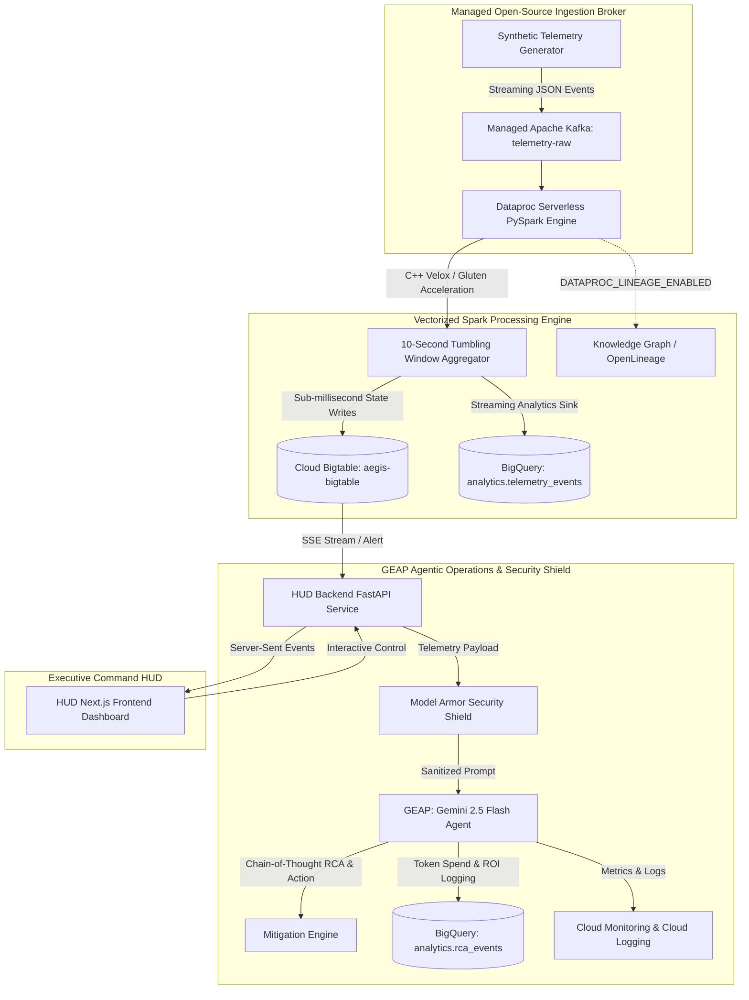

# Project Aegis: Enterprise Streaming Analytics & Autonomous Agentic Operations Platform

> **Integrating Managed Open-Source Technologies with Google Cloud Native
> Infrastructure** _Demonstrating Managed Apache Kafka, Apache Spark (Dataproc
> Serverless with C++ Velox acceleration), Cloud Bigtable, Cloud BigQuery, and
> GEAP (Gemini Enterprise Agent Platform)._

---

## 🎯 Overview & Project Goal

**Project Aegis** is an enterprise-grade reference architecture and interactive
demonstration platform built for Google Cloud Customer Engineers (CEs) and
Solution Architects. It demonstrates how modern enterprises can seamlessly
combine **Managed Open-Source Software (MOSS)**—such as **Apache Kafka** and
**Apache Spark**—with **Google Cloud Native Services**—including **Cloud
Bigtable**, **Cloud BigQuery**, **GEAP (Gemini Enterprise Agent Platform)**, and
**Cloud Monitoring & Logging**.

The platform ingests high-volume industrial IoT (IIoT) telemetry from 15
simulated assets, performs sub-second windowed analytics, detects
thermal/compute anomalies, routes alerts through **Model Armor** security
guardrails, and executes autonomous **Gemini 2.5 Flash** Chain-of-Thought Root
Cause Analysis (RCA) and mitigation.

---

## 📐 Architecture Diagram



---

## 💎 Business Value & Enterprise ROI

| Business Pillar                       | Value Proposition                                                                                                      | Measurable Impact                                                                                         |
| :------------------------------------ | :--------------------------------------------------------------------------------------------------------------------- | :-------------------------------------------------------------------------------------------------------- |
| **Prevented Downtime**                | Autonomous AI agent detects thermal anomalies and issues mitigation commands before hardware shutdown.                 | Reduces unmitigated failure costs (~$5,000 per incident) to near-zero.                                    |
| **C++ Vectorized Efficiency**         | Dataproc Serverless utilizes the C++ Lightning Engine (Velox/Gluten) to eliminate JVM garbage collection pauses.       | Up to **4x execution speedup** and **60% lower compute cost** vs. standard Spark.                         |
| **Financial Governance (Tokenomics)** | Every LLM call tracks exact input/output token counts, inference costs, and averted downtime value in BigQuery.        | Demonstrates **>50,000% ROI** per incident (e.g. $0.0001 USD inference cost vs. $5,000 averted downtime). |
| **Enterprise Security & Compliance**  | Model Armor filters incoming prompts for PII and neutralizes prompt injection vectors prior to LLM execution.          | Prevents adversarial prompt attacks and sensitive data leakage.                                           |
| **Data Lineage & Provenance**         | Dataproc integration with OpenLineage automatically maps end-to-end data provenance into Google Cloud Knowledge Graph. | Satisfies strict regulatory compliance and audit requirements out of the box.                             |

---

## 🛠️ Technical Architecture & Component Breakdown

### 1. Ingestion Broker: Managed Apache Kafka

- **Resource**: `google_managed_kafka_cluster` (`aegis-kafka-cluster`) &
  `google_managed_kafka_topic` (`telemetry-raw`).
- **Role**: Serves as the open-source messaging backbone for real-time telemetry
  ingestion without requiring customer-managed broker VMs.

### 2. Processing Engine: Dataproc Serverless PySpark (Velox Engine)

- **Script**: `data-ingestion/aegis_etl.py`
- **Role**: Consumes streaming Kafka events using PySpark Structured Streaming
  (`org.apache.spark:spark-sql-kafka-0-10_2.12`). Computes 10-second tumbling
  window aggregations with C++ Velox vectorized columnar acceleration.

### 3. Operational State Database: Cloud Bigtable

- **Resource**: `google_bigtable_instance` (`aegis-bigtable`), table
  `telemetry_metrics`.
- **Role**: Dual-sink operational database storing live rolling averages, status
  flags (OK, WARNING, CRITICAL), and sub-second metrics for real-time dashboard
  visualization.

### 4. Data Warehouse & Tokenomics: Cloud BigQuery

- **Resource**: `google_bigquery_dataset` (`analytics`), tables
  `telemetry_events` (partitioned by day) and `rca_events`.
- **Role**: Persistent analytical data warehouse for trend SQL queries,
  historical reporting, and LLM token spend auditing.

### 5. AI Agentic Platform: GEAP & Gemini 2.5 Flash

- **Module**: `agent-service/agent.py` & `security.py`
- **Role**: Powers the cognitive operator. Sanitizes incoming payloads via
  **Model Armor**, executes Gemini 2.5 Flash Root Cause Analysis (RCA), and
  records tokenomics metrics.

### 6. Observability & Command HUD

- **Backend**: FastAPI Python service (`hud/backend/main.py`) providing
  Server-Sent Events (SSE) and Cloud Monitoring/Logging integration.
- **Frontend**: Next.js React Dashboard (`hud/frontend/src/app/page.tsx`)
  displaying live asset grids, real-time metrics, anomaly controls, and agent
  mitigation cards.

---

## 👥 Intended Audience

- **Chief Technology Officers (CTOs) & VPs of Engineering**: Evaluate
  open-source integration (Kafka/Spark) on GCP native infrastructure.
- **VPs of Data Infrastructure & Data Architects**: Inspect Dataproc Serverless
  PySpark execution, C++ Velox vectorization, and Bigtable/BigQuery dual-sink
  patterns.
- **Chief Security Officers (CSOs) & AI Leads**: Review Model Armor prompt
  injection defense, PII masking, and GEAP tokenomics governance.
- **Customer Engineers (CEs) & Solution Architects**: Deliver interactive
  10-minute executive walkthroughs using `DEMO_GUIDE.md`.

---

## 🚀 Quick Start & Deployment Guide

### 1. Provision Infrastructure via Modular Terraform

```bash
cd terraform
terraform init
terraform apply -auto-approve
```

The modular Terraform structure includes:

- `provider.tf` — GCP Provider and API enablement
- `iam.tf` — Dedicated Service Accounts & IAM bindings
- `kafka.tf` — Managed Apache Kafka cluster & topic
- `bigtable.tf` — Cloud Bigtable instance & schema
- `bigquery.tf` — Cloud BigQuery dataset & tables
- `artifact_registry.tf` — Container repository & build triggers
- `cloud_run.tf` — Microservices deployment

### 2. Launch Telemetry Simulator (or Start via HUD Simulator Tab)

```bash
# Start telemetry stream via HTTP API:
curl -X POST "https://hud-backend-xxxx-uc.a.run.app/api/start-stream" -H "Content-Type: application/json" -d '{"rate_msgs_per_sec": 100}'

# Or run simulator locally:
python3 telemetry-simulator/main.py
```

### 3. Start Dataproc PySpark Streaming Pipeline (via HUD API)

```bash
# Start Dataproc Serverless PySpark streaming pipeline via HUD Backend:
curl -X POST "https://hud-backend-xxxx-uc.a.run.app/api/pipeline/start" -H "Content-Type: application/json"
```

### 4. Open Command HUD & Interactive Demo

Access the HUD Dashboard by running the automated authentication proxy helper
script at project root:

```bash
./RUN_PROXY.sh
```

> **Note on First-Time Run:** If the `cloud-run-proxy` gcloud component is not
> yet installed on your system, `gcloud` will prompt to install it. Type **`Y`**
> and press **Enter**. The script automatically waits until the local proxy
> starts listening on `http://localhost:8080` before opening your web browser.

Refer to `DEMO_GUIDE.md` for the complete 3-stage interactive presentation
script.
