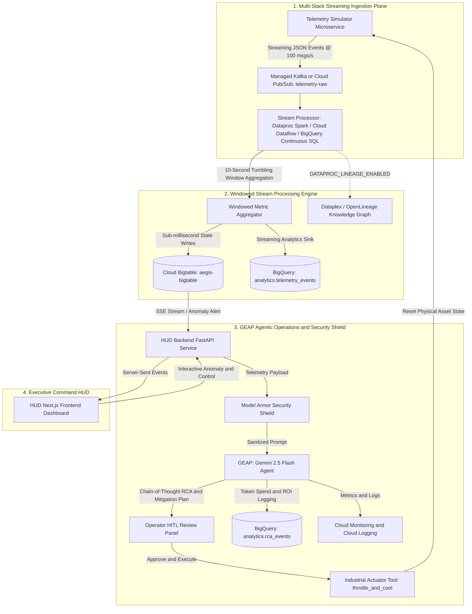

# Project Aegis: Enterprise streaming analytics and autonomous agentic operations platform

**Integrating Managed Open-Source Technologies and Google Cloud Streaming
Services:** _Demonstrating Google Cloud Managed Apache Kafka, Google Cloud
Pub/Sub, Apache Spark on Dataproc, Cloud Dataflow, BigQuery Continuous Queries,
Cloud Bigtable, BigQuery, and Gemini Enterprise Agent Platform (GEAP)._

## Overview and project goal

**Project Aegis** is an enterprise-grade reference architecture and interactive
demonstration platform built for Google Cloud Customer Engineers (CEs) and
Solution Architects. It demonstrates how modern enterprises combine **Managed
Open-Source Software (MOSS)**, such as **Apache Kafka** and **Apache Spark**,
and **Google Cloud streaming engines**, including **Cloud Pub/Sub**, **Cloud
Dataflow**, and **BigQuery Continuous Queries**, with **Cloud Bigtable**,
**BigQuery**, **GEAP**, and **Cloud Monitoring and Cloud Logging**.

The platform supports three modular streaming technology stacks that share a
common dual-sink persistence layer, security shield, and cognitive agent plane:

1.  **Open-Source Software (OSS) / Digital Native (`terraform/stacks/oss`):**
    Google Cloud Managed Apache Kafka and a warm Dataproc cluster
    (`aegis-spark-cluster`) running PySpark Structured Streaming.
1.  **1st-Party Managed Streaming (`terraform/stacks/first-party`):** Google
    Cloud Pub/Sub and Cloud Dataflow running Apache Beam 10-second fixed windows
    with a 1-second early trigger.
1.  **Low-Code Serverless (`terraform/stacks/low-code`):** Google Cloud Pub/Sub
    BigQuery Direct Subscription and BigQuery Continuous Queries executing
    serverless 10-second tumbling window Structured Query Language (SQL).

Across all three stacks, Project Aegis ingests high-volume Industrial Internet
of Things (IIoT) telemetry from 15 simulated assets, computes 10-second windowed
aggregations, detects thermal and Central Processing Unit (CPU) anomalies,
routes alerts through **Model Armor** security guardrails, and executes **Gemini
2.5 Flash** Chain-of-Thought Root Cause Analysis (RCA) with Human-in-the-Loop
(HITL) physical actuation.

## Architecture diagram


```mermaid
flowchart TD
    subgraph Ingestion ["1. Multi-Stack Streaming Ingestion Plane"]
        A[Telemetry Simulator Microservice] -->|Streaming JSON Events @ 100 msgs/s| B[Managed Kafka or Cloud Pub/Sub: telemetry-raw]
        B --> C[Stream Processor: Dataproc Spark / Cloud Dataflow / BigQuery Continuous SQL]
    end

    subgraph Processing ["2. Windowed Stream Processing Engine"]
        C -->|10-Second Tumbling Window Aggregation| D[Windowed Metric Aggregator]
        D -->|Sub-millisecond State Writes| E[(Cloud Bigtable: aegis-bigtable)]
        D -->|Streaming Analytics Sink| F[(BigQuery: analytics.telemetry_events)]
        C -.->|DATAPROC_LINEAGE_ENABLED| G[Dataplex / OpenLineage Knowledge Graph]
    end

    subgraph Agentic ["3. GEAP Agentic Operations and Security Shield"]
        E -->|SSE Stream / Anomaly Alert| H[HUD Backend FastAPI Service]
        H -->|Telemetry Payload| I[Model Armor Security Shield]
        I -->|Sanitized Prompt| J[GEAP: Gemini 2.5 Flash Agent]
        J -->|Chain-of-Thought RCA and Mitigation Plan| K[Operator HITL Review Panel]
        K -->|Approve and Execute| L[Industrial Actuator Tool: throttle_and_cool]
        L -->|Reset Physical Asset State| A
        J -->|Token Spend and ROI Logging| M[(BigQuery: analytics.rca_events)]
        J -->|Metrics and Logs| N[Cloud Monitoring and Cloud Logging]
    end

    subgraph Dashboard ["4. Executive Command HUD"]
        H -->|Server-Sent Events| O[HUD Next.js Frontend Dashboard]
        O -->|Interactive Anomaly and Control| H
    end
```

## Business value and enterprise Return on Investment (ROI)

| Business Pillar                        | Value Proposition                                                                                                                                 | Measurable Impact                                                                                                        |
| :------------------------------------- | :------------------------------------------------------------------------------------------------------------------------------------------------ | :----------------------------------------------------------------------------------------------------------------------- |
| **Prevented Downtime**                 | Autonomous Artificial Intelligence (AI) agent detects thermal anomalies and issues mitigation commands after operator approval.                   | Reduces unmitigated failure costs of ~$5,000 per incident to near-zero.                                                  |
| **Vectorized Compute Efficiency**      | Dataproc enables vectorized Spark execution (and optional C++ Lightning Engine with Velox and Gluten) to avoid Java Virtual Machine (JVM) pauses. | Up to **4x execution speedup** and **60% lower compute cost** compared to standard Spark.                                |
| **Financial Governance (Tokenomics)**  | Every Large Language Model (LLM) call tracks exact input and output token counts, inference costs, and prevented downtime value in BigQuery.      | Demonstrates **>27,000x ROI** per incident, comparing ~$0.00018 USD inference cost against $5,000 in prevented downtime. |
| **Enterprise Security and Compliance** | Model Armor filters incoming prompts for Personally Identifiable Information (PII) and neutralizes prompt injection vectors before LLM execution. | Prevents adversarial prompt attacks and sensitive data leakage.                                                          |
| **Data Lineage and Provenance**        | Dataproc integration with OpenLineage maps end-to-end data provenance into Google Cloud Dataplex Knowledge Graph.                                 | Satisfies regulatory compliance and enterprise audit requirements.                                                       |

## Technical architecture and component breakdown

### 1. Pluggable ingestion bus: Managed Apache Kafka or Cloud Pub/Sub

- **Resources**: `google_managed_kafka_cluster` (`aegis-kafka-cluster`) and
  `google_managed_kafka_topic` (`telemetry-raw`) in the `oss` stack, or
  `google_pubsub_topic` (`telemetry-raw`) in the `first-party` and `low-code`
  stacks.
- **Role**: Serves as the messaging backbone for real-time telemetry ingestion
  from `telemetry-simulator` without requiring customer-managed broker Virtual
  Machines (VMs).

### 2. Stream processing engine: Dataproc, Cloud Dataflow, or BigQuery Continuous Queries

- **OSS Stack (`terraform/stacks/oss`)**: `google_dataproc_cluster`
  (`aegis-spark-cluster`, 1 `n2-standard-4` master and 2 `n2-standard-4` workers
  on image `2.2-debian12` using `CLUSTER_TIER_STANDARD` with vectorized Spark
  reader properties enabled by default, and optional `CLUSTER_TIER_PREMIUM` with
  `spark.dataproc.engine = "lightningEngine"` for allowlisted projects).
  Executes `data-ingestion/src/aegis_etl.py` with pre-installed Kafka OAuth JARs
  (`init_spark_deps.sh`) and `google-cloud-bigtable` packages. Terraform submits
  the initial PySpark Structured Streaming job
  (`null_resource.start_initial_spark_job`) during deployment so the streaming
  pipeline starts in the `RUNNING` state.
- **1st-Party Stack (`terraform/stacks/first-party`)**: Cloud Dataflow Flex
  Template (`pipelines/firstparty-dataflow/src/pipeline.py`) running on
  Streaming Engine with private-IP `n2-standard-2` workers, computing 10-second
  fixed windows with a 1-second early processing-time trigger.
- **Low-Code Stack (`terraform/stacks/low-code`)**: Cloud Pub/Sub BigQuery
  Direct Subscription paired with `ContinuousQueryPipelineClient`, executing
  serverless 10-second tumbling window aggregations defined in
  `hud/backend/src/sql/continuous_window_aggregation.sql`.

### 3. Operational state database: Cloud Bigtable

- **Resource**: `google_bigtable_instance` (`aegis-bigtable`), table
  `telemetry_metrics` with a 24-hour garbage collection policy.
- **Role**: Dual-sink operational database storing live rolling averages, status
  flags covering `OK`, `WARNING`, and `CRITICAL`, and millisecond latency
  metrics for real-time Heads-Up Display (HUD) visualization.

### 4. Data warehouse and tokenomics: BigQuery

- **Resource**: `google_bigquery_dataset` (`analytics`), tables
  `telemetry_events` (partitioned by day) and `rca_events`.
- **Role**: Persistent analytical data warehouse for ad-hoc SQL queries,
  historical reporting, and LLM token spend auditing.

### 5. AI agentic platform: GEAP and Gemini 2.5 Flash

- **Module**: `agent-service/src/agent.py`, `agent-service/src/deploy_geap.py`,
  and `agent-service/src/security.py`
- **Role**: Powers the cognitive operator. Sanitizes incoming payloads using
  **Model Armor**, executes Gemini 2.5 Flash RCA, dispatches
  `IndustrialActuatorTool.throttle_and_cool` upon HITL operator approval, and
  records tokenomics metrics to BigQuery.

> [!IMPORTANT]
>
> **Vertex AI Reasoning Engine `cloudpickle` Serialization**: When
> `agent-service/src/deploy_geap.py` deploys `AegisAnomalyMitigationAgent` to
> Vertex AI Reasoning Engine (`ReasoningEngine.create`), `cloudpickle`
> serializes the class defined in `__main__` by value into
> `reasoning_engine.pkl`. Keep external SDK imports (`google.genai`,
> `google.cloud.bigquery`, `google.auth`, `vertexai`) and `urllib` scoped inside
> the methods (`# pylint: disable=import-outside-toplevel`) rather than at the
> module top level so `cloudpickle` does not serialize global library references
> into the deployment pickle. Similarly, do not import sibling local modules,
> such as `from security import ModelArmorGuard` or
> `from tokenomics import TokenomicsTracker`, anywhere in `deploy_geap.py`.
> Python adds `agent-service/src` to `sys.path[0]` when executing the script,
> causing `cloudpickle` to record local modules by reference rather than by
> value, which fails with `ModuleNotFoundError` when the remote Reasoning Engine
> container starts up.

### 6. Observability and 5-module Command HUD

- **Backend**: FastAPI Python service (`hud/backend/src/main.py`) providing
  Server-Sent Events (SSE), multi-stack pipeline management, and Cloud
  Monitoring and Cloud Logging integration.
- **Frontend**: Next.js 14 React dashboard (`hud/frontend/src/app/`) featuring a
  persistent **Active Stack** header badge and 5 interactive modules (with full
  screenshots available in `images/` and documented in `DEMO_GUIDE.md`):
    - **Module 1: Executive Deck (`/slides`)** — 16:9 presentation player
      (`images/hud-module-1-executive-deck.png`).
    - **Module 2: Stream Simulator (`/simulator`)** — Real-time ingestion rate
      selector and pipeline start/stop controls
      (`images/hud-module-2-stream-simulator.png`).
    - **Module 3: Demo Guide (`/guide`)** — 7-stage architectural blueprint with
      Google Cloud Console deep links (`images/hud-module-3-demo-guide.png`).
    - **Module 4: Live Grid and AI Co-Pilot (`/grid`)** — 15-asset Cloud
      Bigtable operational grid, chaos anomaly injection, Gemini 2.5 Flash
      Co-Pilot, and HITL mitigation approval
      (`images/hud-module-4-live-grid-copilot.png`).
    - **Module 5: Batch Analytics (`/analytics`)** — Interactive 3-tab BigQuery
      GoogleSQL workspace (`images/hud-module-5-batch-analytics.png`).

## Intended audience

- **Chief Technology Officers (CTOs) and Vice Presidents (VPs) of Engineering**:
  Evaluate open-source and Google Cloud streaming integration across Kafka,
  Spark, Pub/Sub, Dataflow, and BigQuery.
- **VPs of Data Infrastructure and Data Architects**: Inspect Dataproc PySpark
  execution, vectorized columnar processing, Cloud Dataflow Streaming Engine,
  and Bigtable/BigQuery dual-sink patterns.
- **Chief Security Officers (CSOs) and AI Leads**: Review Model Armor prompt
  injection defense, PII masking, and GEAP tokenomics governance.
- **CEs and Solution Architects**: Deliver interactive 10-minute executive
  walkthroughs using `DEMO_GUIDE.md`.

## Quick start and deployment guide

### 1. Provision infrastructure with modular Terraform

```bash
# Choose any stack directory: oss, first-party, or low-code
cd terraform/stacks/oss
terraform init
terraform apply -auto-approve
```

The modular Terraform structure includes:

- `terraform/modules/base_platform` — Shared Virtual Private Cloud (VPC),
  Identity and Access Management (IAM), Cloud Bigtable, BigQuery, Model Armor,
  GEAP, and Cloud Run services.
- `terraform/stacks/oss` — Managed Apache Kafka and warm Dataproc cluster
  (`aegis-spark-cluster`) stack. During `terraform apply`, Terraform provisions
  the warm cluster, installs Kafka OAuth and Bigtable dependencies, and starts
  the initial PySpark Structured Streaming job.
- `terraform/stacks/first-party` — Cloud Pub/Sub and Cloud Dataflow Apache Beam
  Streaming Engine stack.
- `terraform/stacks/low-code` — Cloud Pub/Sub BigQuery Direct Subscription and
  BigQuery Continuous Queries stack.

### 2. Verify deployed stacks with the automated CLI toolkit

Run the unified verification Command-Line Interface (CLI) from the repository
root to verify Cloud Run endpoints, streaming pipelines, Cloud Bigtable cell
freshness, and BigQuery tables across one or all deployed stacks:

```bash
# Verify all deployed stacks, or pass --stack oss, first-party, or low-code
python3 _agents/scripts/verify_all.py --stack all
```

### 3. Launch telemetry simulator and operate the streaming pipeline

```bash
# Start telemetry stream through the HUD Backend Application Programming Interface (API):
curl -X POST "https://hud-backend-xxxx-uc.a.run.app/api/start-stream" -H "Content-Type: application/json" -d '{"rate_msgs_per_sec": 100}'

# Check or restart the active streaming pipeline through the HUD Backend API:
curl -X GET "https://hud-backend-xxxx-uc.a.run.app/api/pipeline/status"
curl -X POST "https://hud-backend-xxxx-uc.a.run.app/api/pipeline/start" -H "Content-Type: application/json"
```

#### Spark shuffle partitioning and cluster scaling

In Spark Structured Streaming, stateful operations such as the 10-second
tumbling window `groupBy` in `aegis_etl.py` persist state-store checkpoint files
to Cloud Storage for every shuffle partition on every micro-batch. Leaving
`spark.sql.shuffle.partitions` at the Spark default of `200` forces 200 Cloud
Storage state commits per batch, creating multi-minute micro-batch backpressure
on compact clusters.

Scale `spark.sql.shuffle.partitions` and the `--shuffle-partitions` CLI flag in
`data-ingestion/src/aegis_etl.py` proportionally with total Dataproc worker
virtual CPUs (vCPUs), calculated as `dataproc_num_workers * vcpus_per_worker`,
in `terraform/modules/stack_oss/dataproc_cluster.tf`:

- **2x `n2-standard-4` workers (8 vCPUs total, default cluster size)**:
  `spark.sql.shuffle.partitions = 8`
- **2x `e2-standard-2` workers (4 vCPUs total)**:
  `spark.sql.shuffle.partitions = 4`
- **4x `n2-standard-4` workers (16 vCPUs total)**:
  `spark.sql.shuffle.partitions = 16`

#### End-to-end millisecond latency tracking

Every asset record returned by the HUD Backend API endpoints
`/api/telemetry/assets`, `/api/stream`, and `/api/telemetry/bigtable` exposes
millisecond-resolution pipeline timestamps stored in Cloud Bigtable
(`telemetry_metrics`):

- `ingestion_timestamp_ms`: Epoch timestamp in milliseconds generated by
  `telemetry-simulator` when the sensor event publishes to Kafka or Pub/Sub.
- `db_insert_timestamp_ms`: Epoch timestamp in milliseconds recorded by the
  streaming pipeline right before mutating the aggregated row in Cloud Bigtable.
- `pipeline_latency_ms`: Computed end-to-end ingestion-to-database latency in
  milliseconds (`db_insert_timestamp_ms - ingestion_timestamp_ms`).

### 4. Open Command HUD and interactive demo

Access the HUD dashboard by running the authenticated proxy helper script from
the project root:

```bash
./RUN_PROXY.sh
```

> [!NOTE]
>
> If your Google Cloud CLI installation does not yet include the
> `cloud-run-proxy` component, `gcloud` prompts you to install it. Type **`Y`**
> and press **Enter**. The script waits until the local proxy starts listening
> on `http://localhost:8080` before opening your web browser.

Refer to `DEMO_GUIDE.md` for the complete interactive presentation script.
