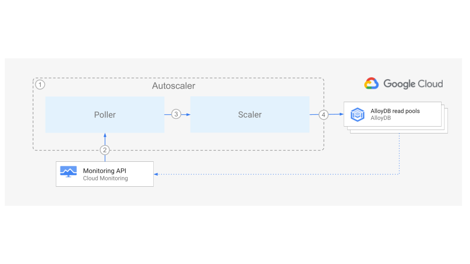

# AlloyDB Autoscaler


An open source tool to autoscale AlloyDB read pool instances.

**Home** · [Scaler component](./src/alloydb-autoscaler/scaler/README.md) ·
[Poller component](./src/alloydb-autoscaler/poller/README.md) ·
[Forwarder component](./src/alloydb-autoscaler/forwarder/README.md) ·
[Terraform configuration](./terraform/README.md)

## Table of Contents

-   [Table of Contents](#table-of-contents)
-   [Overview](#overview)
-   [Architecture](#architecture)
-   [Deployment](#deployment)
-   [Configuration](#configuration)
-   [Licensing](#licensing)
-   [Contributing](#contributing)

## Overview

The AlloyDB Autoscaler is a companion tool that allows you to automatically
increase or reduce the number of nodes in one or more AlloyDB read pool
instances, based on their utilization.

When you create an [AlloyDB read pool instance][alloydb-instance], you choose
the number of [nodes][compute-capacity] that provide compute resources for the
instance.

The Autoscaler monitors your instances and automatically adds or removes
capacity to ensure that the CPU utilization, number of connections and other
metrics remain within recommend limits.

If you would like to get started quickly with a test deployment of the
Autoscaler, you can deploy to [Cloud Run functions in a single
project][single-project-deployment].

## Architecture



The diagram above shows the high level components of the Autoscaler and the
interaction flow:

1.  The Autoscaler consists of two main decoupled components:

    -   [The Poller component][autoscaler-poller]
    -   [The Scaler component][autoscaler-scaler]

    These can be deployed to [Cloud Run functions][cloud-functions] and
    configured so that the Autoscaler runs according to a user-defined schedule.

1.  At the specified time and frequency, the Poller component queries the
    [Cloud Monitoring][cloud-monitoring] API to retrieve the utilization metrics
    for each AlloyDB instance.

1.  For each instance, the Poller component pushes one message to the Scaler
    component. The payload contains the utilization metrics for the specific
    AlloyDB instance, and some of its corresponding configuration parameters.

1.  Using the chosen
    [scaling method](src/alloydb-autoscaler/scaler/README.md#scaling-methods),
    the Scaler compares the cluster instance metrics against the recommended
    thresholds, and determines if the instance should be scaled, and the number
    of nodes to which it should be scaled. If the configured cooldown period has
    passed, then the Scaler component requests the read pool to scale out or in.

Throughout the flow, the Autoscaler writes a step by step summary of its
recommendations and actions to [Cloud Logging][cloud-logging] for tracking and
auditing.

## Deployment

To deploy the Autoscaler, decide which of the following strategies is best
adjusted to fulfill your technical and operational needs:

-   [Deployment to Cloud Run functions](terraform/alloydb-autoscaler/cloud-functions/README.md)
-   [Deployment to Google Kubernetes Engine (GKE)](terraform/alloydb-autoscaler/gke/README.md)

In both of the above cases, the Google Cloud Platform resources are deployed
using Terraform. Please see the [Terraform instructions](terraform/README.md)
for more information on the deployment options available.

You can find some recommendations for productionizing deployment of the
Autoscaler in the
[Productionization section](terraform/README.md#productionization) of the
Terraform documentation.

## Configuration

The parameters for configuring the Autoscaler are identical regardless of the
chosen deployment type, but the mechanism for configuration differs slightly:

In the case of the
[Cloud Run functions](terraform/alloydb-autoscaler/cloud-functions/README.md#configuration)
deployment, the parameters are defined using the JSON payload of the PubSub
message that is published by the Cloud Scheduler job.

In the case of the
[Kubernetes deployment](terraform/alloydb-autoscaler/gke/README.md#configuration),
the parameters are defined using a [Kubernetes ConfigMap][configmap] that is
loaded by the Cron job.

You can find the details about the parameters and their default values in the
[Poller component page][autoscaler-poller].

## Licensing

```lang-none
Copyright 2024 Google LLC

Licensed under the Apache License, Version 2.0 (the "License");
you may not use this file except in compliance with the License.
You may obtain a copy of the License at

    https://www.apache.org/licenses/LICENSE-2.0

Unless required by applicable law or agreed to in writing, software
distributed under the License is distributed on an "AS IS" BASIS,
WITHOUT WARRANTIES OR CONDITIONS OF ANY KIND, either express or implied.
See the License for the specific language governing permissions and
limitations under the License.
```

## Getting Support

The Autoscaler project is based on open source contributions (see
[Contributing](README.md#contributing)).

Please note that this is not an officially supported Google product.

## Contributing

-   [Contributing guidelines][contributing-guidelines]
-   [Code of conduct][code-of-conduct]

<!-- LINKS: https://www.markdownguide.org/basic-syntax/#reference-style-links -->

[autoscaler-poller]: ./src/alloydb-autoscaler/poller/README.md
[autoscaler-scaler]: ./src/alloydb-autoscaler/scaler/README.md
[cloud-functions]: https://cloud.google.com/functions
[cloud-logging]: https://cloud.google.com/logging
[cloud-monitoring]: https://cloud.google.com/monitoring
[code-of-conduct]: ./code-of-conduct.md
[configmap]: https://kubernetes.io/docs/concepts/configuration/configmap
[compute-capacity]:
    https://cloud.google.com/alloydb/docs/instance-read-pool-create
[contributing-guidelines]: ./contributing.md
[alloydb-instance]: https://cloud.google.com/alloydb/docs/overview
[single-project-deployment]: ./terraform/alloydb-autoscaler/cloud-functions/per-project/README.md
