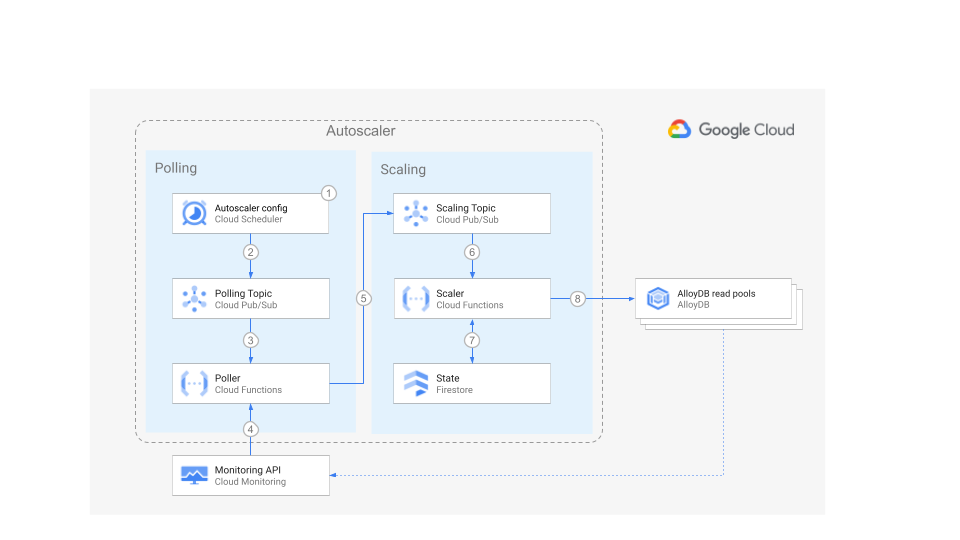

# AlloyDB Autoscaler


Set up the Autoscaler using Terraform configuration files

[Home](../../../README.md) ·
[Scaler component](../../../src/alloydb-autoscaler/scaler/README.md) ·
[Poller component](../../../src/alloydb-autoscaler/poller/README.md) ·
[Forwarder component](../../../src/alloydb-autoscaler/forwarder/README.md) ·
**Terraform configuration**

**Cloud Run functions** · [Google Kubernetes Engine](../gke/README.md)

[Per-Project](./per-project/README.md) · Centralized · Distributed

## Table of Contents

-   [Table of Contents](#table-of-contents)
-   [Overview](#overview)
-   [Architecture](#architecture)
-   [Deployment](#deployment)
-   [Monitoring](#monitoring)

## Overview

This directory contains Terraform configuration files to quickly set up the
infrastructure of your Autoscaler on Cloud Run functions.

## Architecture



The diagram above shows the components of the Autoscaler and the interaction
flow:

1.  Using [Cloud Scheduler][cloud-scheduler] you define how often one or more
    AlloyDB read pool instances should be verified. You can define separate
    Cloud Scheduler jobs to check several AlloyDB read pool instances with
    different schedules, or you can group many instances under a single
    schedule.

1.  At the specified time and frequency, Cloud Scheduler pushes a message into
    the Polling [Cloud Pub/Sub][cloud-pub-sub] topic. The message contains a
    JSON payload with the Autoscaler [configuration parameters](#configuration)
    that you defined for each AlloyDB instance.

1.  When Cloud Scheduler pushes a message into the Poller topic, an instance of
    the [Poller Cloud Function][autoscaler-poller] is created to handle the
    message.

1.  The Poller function reads the message payload and queries the [Cloud
    Monitoring][cloud-monitoring] API to retrieve the utilization metrics for
    each AlloyDB instance.

1.  For each instance, the Poller function pushes one message into the Scaling
    Pub/Sub topic. The message payload contains the utilization metrics for the
    specific AlloyDB instance, and some of its corresponding configuration
    parameters.

1.  For each message pushed into the Scaler topic, an instance of the [Scaler
    Cloud Function][autoscaler-scaler] is created to handle it. Using the chosen
    [scaling method][scaling-methods] the Scaler function compares the AlloyDB
    instance metrics against the recommended thresholds, and determines if the
    instance should be scaled, and the number of nodes to which it should be
    scaled.

1.  The Scaler function retrieves the time when the instance was last scaled
    from the state data stored in [Cloud Firestore][cloud-firestore] and
    compares it with the current database time.

1.  If the configured cooldown period has passed, then the Scaler function
    requests the AlloyDB read pool instance to scale out or in.

Throughout the flow, the Autoscaler writes a step by step summary of its
recommendations and actions to [Cloud Logging][cloud-logging] for tracking and
auditing.

## Deployment

The Autoscaler can be deployed following three different strategies. Choose the
one that is best adjusted to fulfill your technical and operational needs.

-   [Per-Project deployment](./per-project/README.md): all the components of the
    Autoscaler reside in the same project as your AlloyDB instances.
    This deployment is ideal for independent teams who want to self manage the
    configuration and infrastructure of their own Autoscalers. It is also a good
    entry point for testing the Autoscaler capabilities.

-   [Centralized deployment](./centralized/README.md): a slight departure from
    the pre-project deployment, where all the components of the AlloyDB
    Autoscaler reside in the same project, but the AlloyDB instances may be
    located in different projects. This deployment is suited for a team managing
    the configuration and infrastructure of several Autoscalers in a central
    place.

-   [Distributed deployment](./distributed/README.md): all the components of the
    Autoscaler reside in a single project, with the exception of Cloud
    Scheduler. This deployment is a hybrid where teams who own the AlloyDB
    instances want to manage only the Autoscaler configuration parameters for
    their instances, but the rest of the Autoscaler infrastructure is managed by
    a central team.

## Configuration

After deploying the Autoscaler, you are ready to configure its parameters.

1.  Open the [Cloud Scheduler console page][cloud-scheduler-console].

1.  Select the checkbox next to the name of the job created by the Autoscaler
    deployment: `poll-cluster-metrics`

1.  Click on **Edit** on the top bar.

1.  Click on **Configure the execution**.

1.  Modify the Autoscaler parameters shown in the job payload, in the field
    **Message body**. The following is an example:

    ```json
    [
      {
        "projectId": "autoscaler-project-id",
        "regionId": "us-central1",
        "clusterId": "autoscaler-target-alloydb-cluster",
        "instanceId": "autoscaler-target-alloydb-read-pool",
        "scalerPubSubTopic": "projects/autoscaler-project-id/topics/scaler-topic",
        "scalingMethod": "STEPWISE",
        "minSize": 3,
        "maxSize": 10,
        "stateProjectId": "autoscaler-project-id",
        "stateDatabase": {
            "name": "firestore"
        }
      }
    ]
    ```

    The payload is defined using a [JSON][json] array. Each element in the array
    represents an AlloyDB instance that will share the same Autoscaler job
    schedule.

    Additionally, a single instance can have multiple Autoscaler configurations
    in different job schedules. This is useful for example if you want to have
    an instance configured with the linear method for normal operations, but
    also have another Autoscaler configuration with the direct method for
    planned batch workloads.

    You can find the details about the parameters and their default values in
    the [Poller component page][autoscaler-poller].

1.  Click on **Update** at the bottom to save the changes.

The Autoscaler is now configured and will start monitoring and scaling your
instances in the next scheduled job run.

Note that in the default configuration, any changes made to the Cloud Scheduler
configuration as described above will be reset by a subsequent Terraform run. If
you would prefer to manage the Cloud Scheduler configuration manually following
its initial creation, i.e. using the Google Cloud Web Console, the `gcloud` CLI,
or any other non-Terraform mechanism, please [see this
link][cloud-scheduler-lifecycle]. Without this change, the Terraform
configuration will remain the source of truth, and any direct modifications to
the Cloud Scheduler configuration will be reset on the next Terraform run.

## Monitoring

The monitoring module is an optional module for monitoring, which includes the
creation of a dashboard to show relevant AlloyDB metrics.

[autoscaler-poller]: ../../../src/alloydb-autoscaler/poller/README.md
[autoscaler-scaler]: ../../../src/alloydb-autoscaler/scaler/README.md
[cloud-firestore]: https://firebase.google.com/docs/firestore
[cloud-logging]: https://cloud.google.com/logging
[cloud-pub-sub]: https://cloud.google.com/pubsub
[cloud-monitoring]: https://cloud.google.com/monitoring
[cloud-scheduler]: https://cloud.google.com/scheduler
[cloud-scheduler-console]: https://console.cloud.google.com/cloudscheduler
[cloud-scheduler-lifecycle]: ../../../terraform/autoscaler-core/modules/autoscaler-scheduler/main.tf
[json]: https://www.json.org/
[scaling-methods]: ../../../src/alloydb-autoscaler/scaler/README.md#scaling-methods
