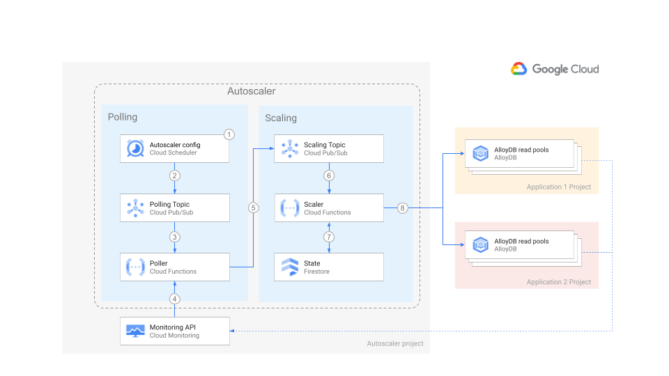

# AlloyDB Autoscaler


Set up the Autoscaler in Cloud Run functions in a centralized deployment using
Terraform.

[Home](../../../../README.md) ·
[Scaler component](../../../../src/alloydb-autoscaler/scaler/README.md) ·
[Poller component](../../../../src/alloydb-autoscaler/poller/README.md) ·
[Forwarder component](../../../../src/alloydb-autoscaler/forwarder/README.md) ·
**Terraform configuration**

**Cloud Run functions** ·
[Google Kubernetes Engine](../../gke/README.md)

[Per-Project](../per-project/README.md) · **Centralized** ·
[Distributed](../distributed/README.md)

## Table of Contents

-   [Table of Contents](#table-of-contents)
-   [Overview](#overview)
-   [Architecture](#architecture)
    -   [Pros](#pros)
    -   [Cons](#cons)
-   [Before you begin](#before-you-begin)
-   [Configuring your Application project](#configuring-your-application-project)

## Overview

This document shows the centralized deployment of the Autoscaler.

In the centralized deployment all the components of the Autoscaler reside in the
same project, but the AlloyDB instances may be located in different projects.

This deployment is suited for a team managing the configuration and
infrastructure of one or more Autoscalers in a central place. The AlloyDB
instances reside in other projects, called Application projects, which are owned
by the same or other teams.

## Architecture



For an explanation of the components of the Autoscaler and the interaction flow,
please read the [main Architecture section](../README.md#architecture).

The centralized deployment has the following pros and cons:

### Pros

-   **Configuration and infrastructure**: The scheduler parameters and the
    Autoscaler infrastructure is controlled by a single team. This may desirable
    on highly regulated industries.
-   **Maintenance**: Maintenance and setup is expected to require less effort
    overall when compared to single project deployment.
-   **Policies and audit**: Best practices across teams might be easier to
    specify and enact. Audits might be easier to execute.

### Cons

-   **Configuration**: any change to the Autoscaler parameters needs to go
    through the centralized team, even though the team requesting the change
    owns the AlloyDB instance.
-   **Risk**: the centralized team itself may become a single point of failure
    even if the infrastructure is designed with high availability in mind.

## Before you begin

The centralized deployment is a slight departure from the per-project option
where the AlloyDB instances and the Autoscaler reside in different projects.
Therefore, most of the instructions to set it up are the same.

Follow the instructions for the per-project option starting with the
[Before you begin section](../per-project/README.md#before-you-begin) and stop
before the
[Deploying the Autoscaler section](../per-project/README.md#deploying-the-autoscaler)

## Configuring your Application project

In this section you configure the project where your AlloyDB cluster resides.
This project is called an "Application project" because the AlloyDB Cluster
serves one or more specific applications. The teams responsible for those
applications are assumed to be separate from the team responsible for the
Autoscaler infrastructure and configuration.

1.  Go to the [project selector page][project-selector] in the Cloud Console.
    Select or create a Cloud project.

1.  Make sure that billing is enabled for your Google Cloud project. [Learn how
    to confirm billing is enabled for your project][enable-billing].

1.  In Cloud Shell, set environment variables with the ID of your
    **application** project. Replace the `<INSERT_YOUR_APP_PROJECT_ID>`
    placeholder and run the following command:

    ```sh
    export APP_PROJECT_ID=<INSERT_YOUR_APP_PROJECT_ID>
    ```

1.  Set the Application project ID in the corresponding Terraform environment
    variable

    ```sh
    export TF_VAR_app_project_id="${APP_PROJECT_ID}"
    ```

You have configured your Application project. Please continue from the
[Deploying the Autoscaler section](../per-project/README.md#deploying-the-autoscaler)
in the per-project deployment documentation.

<!-- LINKS: https://www.markdownguide.org/basic-syntax/#reference-style-links -->

[enable-billing]: https://cloud.google.com/billing/docs/how-to/modify-project
[project-selector]:
    https://console.cloud.google.com/projectselector2/home/dashboard
