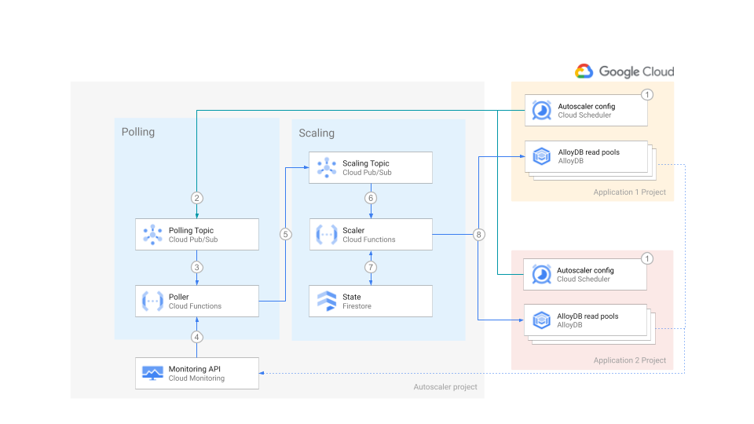

# AlloyDB Autoscaler


Set up the Autoscaler in Cloud Run functions in a distributed deployment using
Terraform.

[Home](../../../../README.md) ·
[Scaler component](../../../../src/alloydb-autoscaler/scaler/README.md) ·
[Poller component](../../../../src/alloydb-autoscaler/poller/README.md) ·
[Forwarder component](../../../../src/alloydb-autoscaler/forwarder/README.md) ·
**Terraform configuration**

**Cloud Run functions** ·
[Google Kubernetes Engine](../../gke/README.md)

[Per-Project](../per-project/README.md) ·
[Centralized](../centralized/README.md) · **Distributed**

## Table of Contents

-   [Table of Contents](#table-of-contents)
-   [Overview](#overview)
-   [Architecture](#architecture)
    -   [Pros](#pros)
    -   [Cons](#cons)
-   [Before you begin](#before-you-begin)
-   [Preparing the Autoscaler Project](#preparing-the-autoscaler-project)
    -   [Using Firestore for Autoscaler state](#using-firestore-for-autoscaler-state)
    -   [Using Spanner for Autoscaler state](#using-spanner-for-autoscaler-state)
    -   [Deploying the Autoscaler](#deploying-the-autoscaler)
-   [Preparing the Application Project](#preparing-the-application-project)
    -   [Deploying the Autoscaler](#deploying-the-autoscaler)
    -   [Authorize the Forwarder function to publish to the Poller topic](#authorize-the-forwarder-function-to-publish-to-the-poller-topic)
-   [Verifying your deployment](#verifying-your-deployment)

## Overview

This directory contains Terraform configuration files to quickly set up the
infrastructure for your Autoscaler with a distributed deployment.

In this deployment option all the components of the Autoscaler reside in a
single project, with the exception of Cloud Scheduler (step 1) and the Forwarder
topic and function.

This deployment is the best of both worlds between the per-project and the
centralized deployments: _Teams who own the AlloyDB Cluster instances, called
Application teams, are able to manage the Autoscaler configuration parameters
for their instances with their own Cloud Scheduler jobs._ On the other hand, the
rest of the Autoscaler infrastructure is managed by a central team.

## Architecture



For an explanation of the components of the Autoscaler and the interaction flow,
please read the [main Architecture section](../README.md#architecture).

Cloud Scheduler can only publish messages to topics in the same project.
Therefore in step 2, we transparently introduce an intermediate component to
make this architecture possible. For more information, see the Forwarder
function.

The distributed deployment has the following pros and cons:

### Pros

-   **Configuration and infrastructure**: application teams are in control of
    their config and schedules
-   **Maintenance**: Scaler infrastructure is centralized, reducing up-keep
    overhead
-   **Policies and audit**: Best practices across teams might be easier to
    specify and enact. Audits might be easier to execute.

### Cons

-   **Configuration**: application teams need to provide service accounts to
    write to the polling topic.
-   **Risk**: the centralized team itself may become a single point of failure
    even if the infrastructure is designed with high availability in mind.

## Before you begin

1.  Open the [Cloud Console][cloud-console]
1.  Activate [Cloud Shell][cloud-shell] \
    At the bottom of the Cloud Console, a
    [Cloud Shell](https://cloud.google.com/shell/docs/features) session starts
    and displays a command-line prompt. Cloud Shell is a shell environment with
    the Cloud SDK already installed, including the `gcloud` command-line tool,
    and with values already set for your current project. It can take a few
    seconds for the session to initialize.

1.  In Cloud Shell, clone this repository:

    ```sh
    # TODO: add steps for cloning repository
    ```

1.  Change into the directory of the cloned repository, and check out the `main`
    branch:

    ```sh
    # TODO: add steps for cloning repository
    ```

1.  Compile the project:

    ```sh
    npm install && npm run compile
    ```

1.  Export variables for the working directories:

    ```sh
    export AUTOSCALER_DIR="$(pwd)/terraform/alloydb-autoscaler/cloud-functions/distributed/autoscaler-project"
    export APP_DIR="$(pwd)/terraform/alloydb-autoscaler/cloud-functions/distributed/app-project"
    ```

## Preparing the Autoscaler Project

In this section you prepare the deployment of the project where the centralized
Autoscaler infrastructure, with the exception of Cloud Scheduler, lives.

1.  Go to the [project selector page][project-selector] in the Cloud Console.
    Select or create a Cloud project.

1.  Make sure that billing is enabled for your Google Cloud project.

    [Learn how to confirm billing is enabled for your project][enable-billing].

1.  In Cloud Shell, set environment variables with the ID of your **autoscaler**
    project:

    ```sh
    export AUTOSCALER_PROJECT_ID=<YOUR_PROJECT_ID>
    gcloud config set project "${AUTOSCALER_PROJECT_ID}"
    ```

1.  Choose the [region][region-and-zone] where the Autoscaler infrastructure
    will be located.

    ```sh
    export AUTOSCALER_REGION=us-central1
    ```

1.  Enable the required Cloud APIs :

    ```sh
    gcloud services enable \
      artifactregistry.googleapis.com \
      cloudbuild.googleapis.com \
      cloudfunctions.googleapis.com \
      cloudresourcemanager.googleapis.com \
      compute.googleapis.com \
      eventarc.googleapis.com \
      iam.googleapis.com \
      networkconnectivity.googleapis.com \
      pubsub.googleapis.com \
      logging.googleapis.com \
      monitoring.googleapis.com \
      run.googleapis.com \
      serviceconsumermanagement.googleapis.com
    ```

1.  There are two options for deploying the state store for the Autoscaler:

    1.  Store the state in [Firestore][cloud-firestore]
    1.  Store the state in [Spanner][cloud-spanner]

    For Firestore, follow the steps in
    [Using Firestore for Autoscaler State](#using-firestore-for-autoscaler-state).

    For Spanner, follow the steps in
    [Using Spanner for Autoscaler state](#using-spanner-for-autoscaler-state).

### Using Firestore for Autoscaler state

1.  To use Firestore for the Autoscaler state, enable the additional API:

    ```sh
    gcloud services enable firestore.googleapis.com
    ```

1.  If you want to choose the name for your Firestore database, set the
    following variable:

    ```sh
    export TF_VAR_firestore_state_database=<DATABASE_NAME>
    ```

    If you do not set this variable, the default database will be used
    (`(default)`).

1.  Next, continue to [Deploying the Autoscaler](#deploying-the-autoscaler).

### Using Spanner for Autoscaler state

1.  To use Spanner for the Autoscaler state, enable the additional API:

    ```sh
    gcloud services enable spanner.googleapis.com
    ```

1.  If you want Terraform to create a Spanner instance (named
    `alloydb-autoscaler-state` by default) to store the state, set the following
    variable:

    ```sh
    export TF_VAR_terraform_spanner_state=true
    ```

    If you already have a Spanner instance where state must be stored, set the
    the name of your instance:

    ```sh
    export TF_VAR_spanner_state_name=<SPANNER_INSTANCE_NAME>
    ```

    If you want to manage the state of the Autoscaler in your own Cloud Spanner
    instance, please create the following table in advance:

    ```sql
    CREATE TABLE alloyDbAutoscaler (
      id STRING(MAX),
      lastScalingTimestamp TIMESTAMP,
      createdOn TIMESTAMP,
      updatedOn TIMESTAMP,
      lastScalingCompleteTimestamp TIMESTAMP,
      scalingOperationId STRING(MAX),
      scalingRequestedSize INT64,
      scalingPreviousSize INT64,
      scalingMethod STRING(MAX),
    ) PRIMARY KEY (id)
    ```

1.  Next, continue to [Deploying the Autoscaler](#deploying-the-autoscaler).

### Deploying the Autoscaler

1.  Set the project ID and region in the corresponding Terraform environment
    variables:

    ```sh
    export TF_VAR_project_id="${AUTOSCALER_PROJECT_ID}"
    export TF_VAR_region="${AUTOSCALER_REGION}"
    ```

1.  Change directory into the Terraform scaler-project directory and initialize
    it.

    ```sh
    cd "${AUTOSCALER_DIR}"
    terraform init
    ```

1.  Create the Autoscaler infrastructure. Answer `yes` when prompted, after
    reviewing the resources that Terraform intends to create.

    ```sh
    terraform apply -parallelism=2
    ```

    -   If you are running this command in Cloud Shell and encounter errors of
        the form "`Error: cannot assign requested address`", this is a [known
        issue][provider-issue] in the Terraform Google provider, please retry
        with -parallelism=1.

## Preparing the Application Project

In this section you prepare the deployment of the Cloud Scheduler, Forwarder
topic and function in the project where the AlloyDB instances live.

1.  Go to the [project selector page][project-selector] in the Cloud Console.
    Select or create a Cloud project.

1.  Make sure that billing is enabled for your Google Cloud project.

    [Learn how to confirm billing is enabled for your project][enable-billing].

1.  In Cloud Shell, set the environment variables with the ID of your
    **application** project:

    ```sh
    export APP_PROJECT_ID=<INSERT_YOUR_APP_PROJECT_ID>
    gcloud config set project "${APP_PROJECT_ID}"
    ```

1.  Choose the [region][region-and-zone] where the Application project will be
    located:

    ```sh
    export APP_REGION=us-central1
    ```

1.  Use the following command to enable the Cloud APIs:

    ```sh
    gcloud services enable \
      alloydb.googleapis.com \
      appengine.googleapis.com \
      artifactregistry.googleapis.com \
      cloudbuild.googleapis.com \
      cloudfunctions.googleapis.com \
      cloudresourcemanager.googleapis.com \
      cloudscheduler.googleapis.com \
      compute.googleapis.com \
      eventarc.googleapis.com \
      iam.googleapis.com \
      networkconnectivity.googleapis.com \
      pubsub.googleapis.com \
      logging.googleapis.com \
      monitoring.googleapis.com \
      run.googleapis.com \
      serviceconsumermanagement.googleapis.com \
      servicenetworking.googleapis.com
    ```

### Deploy the Application infrastructure

1.  Set the project ID and region in the corresponding Terraform environment
    variables

    ```sh
    export TF_VAR_project_id="${APP_PROJECT_ID}"
    export TF_VAR_region="${APP_REGION}"
    ```

1.  By default, a new AlloyDB cluster and instances will be created for testing.
    If you want to scale an existing AlloyDB read pool instance, set the
    following variable:

    ```sh
    export TF_VAR_terraform_alloydb_instance=false
    ```

    Set the following variable to choose the name of a new or existing cluster
    to scale:

    ```sh
    export TF_VAR_alloydb_cluster_name=<alloydb-cluster-name>
    export TF_VAR_alloydb_primary_instance_name=<alloydb-primary-instance>
    export TF_VAR_alloydb_read_pool_instance_name=<alloydb-read-pool-instance>
    ```

    If you do not set these variables, they will be set to
    `autoscaler-target-alloydb-cluster`, `autoscaler-target-alloydb-primary` and
    `autoscaler-target-alloydb-read-pool` respectively.

    If you are creating a new instance, set up username and password for the
    AlloydB database:

    ```sh
    export TF_VAR_alloydb_username=<username>
    export TF_VAR_alloydb_password=<password>
    ```

1.  Set the project ID where the State (Firestore/Spanner) instance resides.

    ```sh
    export TF_VAR_state_project_id="${AUTOSCALER_PROJECT_ID}"
    ```

1.  Change directory into the Terraform app-project directory and initialize it.

    ```sh
    cd "${APP_DIR}"
    terraform init
    ```

1.  Import the existing App Engine application into Terraform state:

    ```sh
    terraform import module.autoscaler-scheduler.google_app_engine_application.app "${APP_PROJECT_ID}"
    ```

1.  Create the infrastructure in the application project. Answer `yes` when
    prompted, after reviewing the resources that Terraform intends to create.

    ```sh
    terraform apply -parallelism=2
    ```

    -   If you are running this command in Cloud Shell and encounter errors of
        the form "`Error: cannot assign requested address`", this is a [known
        issue][provider-issue] in the Terraform Google provider, please retry
        with -parallelism=1

### Authorize the Forwarder function to publish to the Poller topic

1.  Switch back to the Autoscaler project and ensure that Terraform variables
    are correctly set.

    ```sh
    cd "${AUTOSCALER_DIR}"

    export TF_VAR_project_id="${AUTOSCALER_PROJECT_ID}"
    export TF_VAR_region="${AUTOSCALER_REGION}"
    ```

1.  Set the Terraform variables for your Forwarder service accounts, updating
    and adding your service accounts as needed. Answer `yes` when prompted,
    after reviewing the resources that Terraform intends to create.

    ```sh
    export TF_VAR_forwarder_sa_emails='["serviceAccount:forwarder-sa@'"${APP_PROJECT_ID}"'.iam.gserviceaccount.com"]'
    terraform apply -parallelism=2
    ```

If you are running this command in Cloud Shell and encounter errors of the form
"`Error: cannot assign requested address`", this is a [known
issue][provider-issue] in the Terraform Google provider, please retry with
`-parallelism=1`

## Verifying your deployment

Your Autoscaler infrastructure is ready, follow the instructions in the main
page to [configure your Autoscaler](../README.md#configuration). Please take in
account that in a distributed deployment: _Logs from the Poller and Scaler
functions will appear in the [Logs Viewer][logs-viewer] for the Autoscaler
project_. Logs about syntax errors in the JSON configuration of the Cloud
Scheduler payload will appear in the Logs viewer of each Application project, so
that the team responsible for a specific Cloud Spanner instance can troubleshoot
its configuration issues independently.

<!-- LINKS: https://www.markdownguide.org/basic-syntax/#reference-style-links -->

[cloud-console]: https://console.cloud.google.com
[cloud-firestore]: https://cloud.google.com/firestore
[cloud-shell]: https://console.cloud.google.com/?cloudshell=true
[cloud-spanner]: https://cloud.google.com/spanner
[enable-billing]: https://cloud.google.com/billing/docs/how-to/modify-project
[logs-viewer]: https://console.cloud.google.com/logs/query
[project-selector]:
    https://console.cloud.google.com/projectselector2/home/dashboard
[provider-issue]:
    https://github.com/hashicorp/terraform-provider-google/issues/6782
[region-and-zone]: https://cloud.google.com/compute/docs/regions-zones#locations
