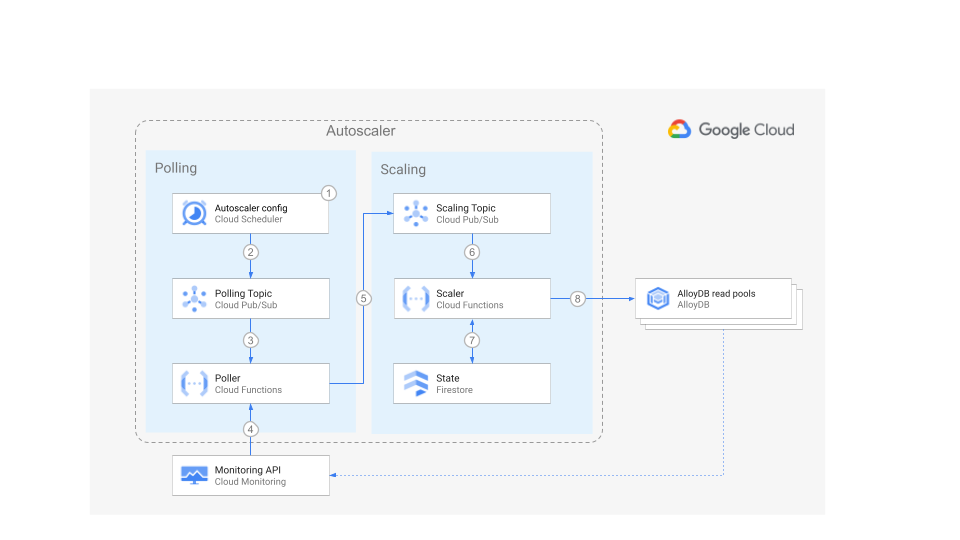

# AlloyDB Autoscaler


Set up the Autoscaler in Cloud Run functions in a per-project deployment using
Terraform

[Home](../../../../README.md) ·
[Scaler component](../../../../src/alloydb-autoscaler/scaler/README.md) ·
[Poller component](../../../../src/alloydb-autoscaler/poller/README.md) ·
[Forwarder component](../../../../src/alloydb-autoscaler/forwarder/README.md) ·
**Terraform configuration**

**Cloud Run functions** ·
[Google Kubernetes Engine](../../gke/README.md)

**Per-Project** · [Centralized](../centralized/README.md) ·
[Distributed](../distributed/README.md)

## Table of Contents

-   [Table of Contents](#table-of-contents)
-   [Overview](#overview)
-   [Architecture](#architecture)
    -   [Pros](#pros)
    -   [Cons](#cons)
-   [Before you begin](#before-you-begin)
-   [Preparing the Autoscaler Project](#preparing-the-autoscaler-project)
    -   [Using Firestore for Autoscaler state](#using-firestore-for-autoscaler-state)
    -   [Using Spanner for Autoscaler state](#using-spanner-for-autoscaler-state)
-   [Deploying the Autoscaler](#deploying-the-autoscaler)
-   [Next steps](#next-steps)

## Overview

This directory contains Terraform configuration files to quickly set up the
infrastructure for your Autoscaler with a per-project deployment.

In this deployment option, all the components of the Autoscaler reside in the
same project as your AlloyDB instances.

This deployment is ideal for independent teams who want to self-manage the
infrastructure and configuration of their own Autoscalers. It is also a good
entry point for testing the Autoscaler capabilities.

## Architecture



For an explanation of the components of the Autoscaler and the interaction flow,
please read the [main Architecture section](../README.md#architecture).

The per-project deployment has the following pros and cons:

### Pros

-   **Design**: This option has the simplest design.
-   **Configuration**: The control over scheduler parameters belongs to the team
    that owns the AlloyDB cluster(s), therefore the team has the highest
    degree of freedom to adapt the Autoscaler to its needs.
-   **Infrastructure**: This design establishes a clear boundary of
    responsibility and security over the Autoscaler infrastructure because the
    team that owns the AlloyDB cluster(s) is also the owner of the Autoscaler
    infrastructure.

### Cons

-   **Maintenance**: With each team being responsible for the Autoscaler
    configuration and infrastructure it may become difficult to make sure that
    all Autoscalers across the organization follow the same update guidelines.
-   **Audit**: Because of the high level of control by each team, a centralized
    audit may become more complex.

## Before you begin

In this section you prepare your project for deployment.

1.  Open the [Cloud Console][cloud-console]
1.  Activate [Cloud Shell][cloud-shell]

    At the bottom of the Cloud Console, a
    [Cloud Shell](https://cloud.google.com/shell/docs/features) session starts
    and displays a command-line prompt. Cloud Shell is a shell environment with
    the Cloud SDK already installed, including the `gcloud` command-line tool,
    and with values already set for your current project. It can take a few
    seconds for the session to initialize.

1.  In Cloud Shell, clone this repository:

    ```sh
    # TODO: add steps for cloning repository
    ```

1.  Change into the directory of the cloned repository, and check out the `main`
    branch:

    ```sh
    # TODO: add command for cloning repository
    ```

1.  Compile the project:

    ```sh
    npm install && npm run compile
    ```

1.  Export a variable for the working directory:

    ```sh
    export AUTOSCALER_DIR="$(pwd)/terraform/alloydb-autoscaler/cloud-functions/per-project"
    ```

## Preparing the Autoscaler Project

In this section you prepare your project for deployment.

1.  Go to the [project selector page][project-selector] in the Cloud Console.
    Select or create a Cloud project.

1.  Make sure that billing is enabled for your Google Cloud project. [Learn how
    to confirm billing is enabled for your project][enable-billing].

1.  In Cloud Shell, set environment variables with the ID of your **autoscaler**
    project:

    ```sh
    export PROJECT_ID=<INSERT_YOUR_PROJECT_ID>
    gcloud config set project "${PROJECT_ID}"
    ```

1.  Choose the [region][region-and-zone] and [App Engine
    Location][app-engine-location] where the Autoscaler infrastructure will be
    located.

    ```sh
    export REGION=us-central1
    ```

1.  Enable the required Cloud APIs

    ```sh
    gcloud services enable \
      alloydb.googleapis.com \
      appengine.googleapis.com \
      cloudbuild.googleapis.com \
      cloudfunctions.googleapis.com \
      cloudresourcemanager.googleapis.com \
      cloudscheduler.googleapis.com \
      compute.googleapis.com \
      eventarc.googleapis.com \
      iam.googleapis.com \
      logging.googleapis.com \
      monitoring.googleapis.com \
      networkconnectivity.googleapis.com \
      pubsub.googleapis.com \
      run.googleapis.com \
      serviceconsumermanagement.googleapis.com \
      servicenetworking.googleapis.com
    ```

1.  There are two options for deploying the state store for the Autoscaler:

    1.  Store the state in [Firestore][cloud-firestore]
    1.  Store the state in [Spanner][cloud-spanner]

    For Firestore, follow the steps in
    [Using Firestore for Autoscaler State](#using-firestore-for-autoscaler-state).
    For Spanner, follow the steps in
    [Using Spanner for Autoscaler state](#using-spanner-for-autoscaler-state).

### Using Firestore for Autoscaler state

1.  To use Firestore for the Autoscaler state, enable the additional APIs:

    ```sh
    gcloud services enable firestore.googleapis.com
    ```

1.  Create a Google App Engine app to enable the API for Firestore:

    ```sh
    gcloud app create --region="${REGION}"
    ```

1.  To store the state of the Autoscaler, update the database created with the
    Google App Engine app to use [Firestore native mode][firestore-native].

    ```sh
    gcloud firestore databases update --type=firestore-native
    ```

1.  Next, continue to [Deploying the Autoscaler](#deploying-the-autoscaler).

### Using Spanner for Autoscaler state

1.  To use Spanner for the Autoscaler state, enable the additional API:

    ```sh
    gcloud services enable spanner.googleapis.com
    ```

1.  If you want Terraform to create a Spanner instance (named
    `alloydb-autoscaler-state` by default) to store the state, set the following
    variable:

    ```sh
    export TF_VAR_terraform_spanner_state=true
    ```

    If you already have a Spanner instance where state must be stored, set the
    the name of your instance:

    ```sh
    export TF_VAR_spanner_state_name=<INSERT_YOUR_STATE_SPANNER_INSTANCE_NAME>
    export TF_VAR_spanner_state_database=<INSERT_YOUR_STATE_SPANNER_DATABASE_NAME>
    ```

    If you want to manage the state of the Autoscaler in your own Cloud Spanner
    instance, please create the following table in advance:

    ```sql
    CREATE TABLE alloyDbAutoscaler (
      id STRING(MAX),
      lastScalingTimestamp TIMESTAMP,
      createdOn TIMESTAMP,
      updatedOn TIMESTAMP,
      lastScalingCompleteTimestamp TIMESTAMP,
      scalingOperationId STRING(MAX),
      scalingRequestedSize INT64,
      scalingPreviousSize INT64,
      scalingMethod STRING(MAX),
    ) PRIMARY KEY (id)
    ```

1.  Next, continue to [Deploying the Autoscaler](#deploying-the-autoscaler).

## Deploying the Autoscaler

1.  Set the project ID and region in the corresponding Terraform environment
    variables:

    ```sh
    export TF_VAR_project_id="${PROJECT_ID}"
    export TF_VAR_region="${REGION}"
    ```

1.  By default, a new AlloyDB cluster and instances will be created for testing.
    If you want to scale an existing AlloyDB read pool instance, set the
    following variable:

    ```sh
    export TF_VAR_terraform_alloydb_instance=false
    ```

    Set the following variable to choose the name of a new or existing cluster
    to scale:

    ```sh
    export TF_VAR_alloydb_cluster_name=<alloydb-cluster-name>
    export TF_VAR_alloydb_primary_instance_name=<alloydb-primary-instance>
    export TF_VAR_alloydb_read_pool_instance_name=<alloydb-read-pool-instance>
    ```

    If you do not set these variables, they will be set to
    `autoscaler-target-alloydb-cluster`, `autoscaler-target-alloydb-primary` and
    `autoscaler-target-alloydb-read-pool` respectively.

    If you are creating a new instance, set up username and password for the
    AlloydB database:

    ```sh
    export TF_VAR_alloydb_username=<username>
    export TF_VAR_alloydb_password=<password>
    ```

1.  Change directory into the Terraform per-project directory and initialize it.

    ```sh
    cd "${AUTOSCALER_DIR}"
    terraform init
    ```

1.  Import the existing App Engine application into Terraform state:

    ```sh
    terraform import module.autoscaler-scheduler.google_app_engine_application.app "${PROJECT_ID}"
    ```

1.  Create the Autoscaler infrastructure. Answer `yes` when prompted, after
    reviewing the resources that Terraform intends to create.

    ```sh
    terraform apply -parallelism=2
    ```

    -   If you are running this command in Cloud Shell and encounter errors of
        the form "`Error: cannot assign requested address`", this is a [known
        issue][provider-issue] in the Terraform Google provider, please retry
        the command above and include the flag `-parallelism=1`.

## Next steps

Your Autoscaler infrastructure is ready, follow the instructions in the main
page to [configure your Autoscaler](../README.md#configuration).

<!-- LINKS: https://www.markdownguide.org/basic-syntax/#reference-style-links -->

[app-engine-location]: https://cloud.google.com/appengine/docs/locations
[cloud-console]: https://console.cloud.google.com
[cloud-firestore]: https://cloud.google.com/firestore
[cloud-shell]: https://console.cloud.google.com/?cloudshell=true
[cloud-spanner]: https://cloud.google.com/spanner
[enable-billing]: https://cloud.google.com/billing/docs/how-to/modify-project
[firestore-native]:
    https://cloud.google.com/datastore/docs/firestore-or-datastore#in_native_mode
[project-selector]:
    https://console.cloud.google.com/projectselector2/home/dashboard
[provider-issue]:
    https://github.com/hashicorp/terraform-provider-google/issues/6782
[region-and-zone]: https://cloud.google.com/compute/docs/regions-zones#locations
