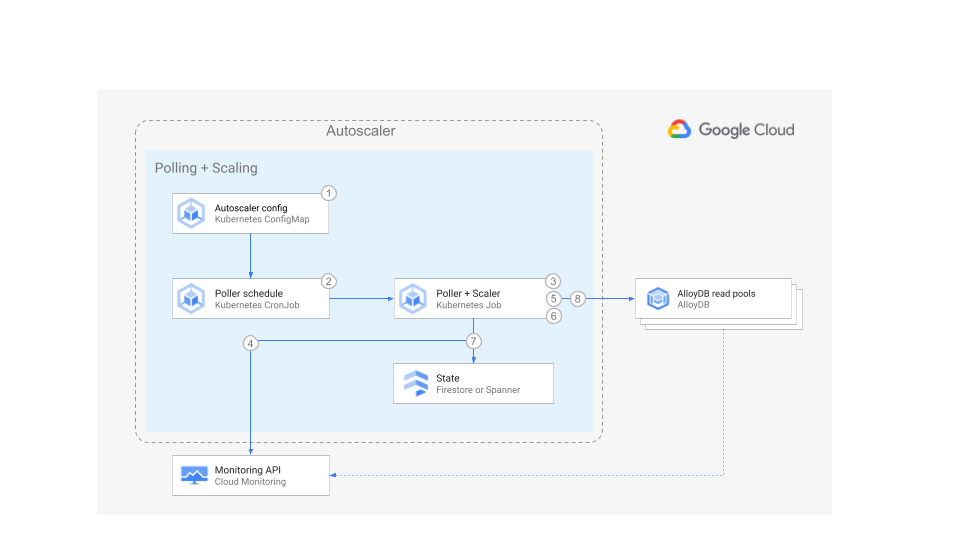

# AlloyDB Autoscaler


Set up the Autoscaler using Google Kubernetes Engine and Terraform

[Home](../../../README.md) ·
[Scaler component](../../../src/alloydb-autoscaler/scaler/README.md) ·
[Poller component](../../../src/alloydb-autoscaler/poller/README.md) ·
[Forwarder component](../../../src/alloydb-autoscaler/forwarder/README.md) ·
**Terraform configuration**

[Cloud Run functions](../cloud-functions/README.md) ·
**Google Kubernetes Engine**

## Table of Contents

-   [Table of Contents](#table-of-contents)
-   [Overview](#overview)
-   [Architecture](#architecture)
    -   [Pros](#pros)
    -   [Cons](#cons)
-   [Before you begin](#before-you-begin)
-   [Preparing the Autoscaler Project](#preparing-the-autoscaler-project)
    -   [Using Firestore for Autoscaler state](#using-firestore-for-autoscaler-state)
    -   [Using Spanner for Autoscaler state](#using-spanner-for-autoscaler-state)
-   [Creating Autoscaler infrastructure](#creating-autoscaler-infrastructure)
-   [Building the Autoscaler](#building-the-autoscaler)
-   [Deploying the Autoscaler](#deploying-the-autoscaler)
-   [Metrics in GKE deployment](#metrics-in-gke-deployment)
-   [Troubleshooting](#troubleshooting)

## Overview

This directory contains Terraform configuration files to quickly set up the
infrastructure for your Autoscaler for a deployment to [Google Kubernetes Engine
(GKE)][gke].

This deployment is ideal for independent teams who want to self-manage the
infrastructure and configuration of their own Autoscalers on Kubernetes.

## Architecture



1.  Using a [Kubernetes ConfigMap][kubernetes-configmap] you define which
    AlloyDB instances you would like to be managed by the autoscaler.

1.  Using a [Kubernetes CronJob][kubernetes-cronjob], the autoscaler is
    configured to run on a schedule. By default this is every two minutes,
    though this is configurable.

1.  When scheduled, an instance of the Poller is created as a [Kubernetes
    Job][kubernetes-job].

1.  The Poller queries the [Cloud Monitoring][cloud-monitoring] API to retrieve
    the utilization metrics for each AlloyDB instance.

1.  For each AlloyDB instance, the Poller makes a call to the Scaler via its
    API. The request payload contains the utilization metrics for the specific
    AlloyDB instance, and some of its corresponding configuration parameters.

1.  Using the chosen scaling method the Scaler compares the AlloyDB instance
    metrics against the recommended thresholds, plus or minus an allowed margin
    and determines if the instance should be scaled, and the number of nodes
    that it should be scaled to.

1.  The Scaler retrieves the time when the instance was last scaled from the
    state data stored in [Cloud Firestore][cloud-firestore] (or alternatively
    [Spanner][spanner]) and compares it with the current time.

1.  If the configured cooldown period has passed, then the Scaler requests the
    AlloyDB instance to scale out or in.

1.  Autoscaler components publish counters to an [OpenTelemetry
    Collector][otel-collector], also running in Kubernetes, which is configured
    to forward these counters to [Google Cloud Monitoring][gcm-docs]. See
    section [Metrics in GKE deployment](#metrics-in-gke-deployment)

The GKE deployment has the following pros and cons:

### Pros

-   **Kubernetes-based**: For teams that may not be able to use Google Cloud
    services such as [Cloud Run functions][cloud-functions], this design enables
    the use of the Autoscaler.
-   **Configuration**: The control over scheduler parameters belongs to the team
    that owns the AlloyDB instance, therefore the team has the highest degree of
    freedom to adapt the Autoscaler to its needs.
-   **Infrastructure**: This design establishes a clear boundary of
    responsibility and security over the Autoscaler infrastructure because the
    Autoscaler infrastructure.

### Cons

-   **Infrastructure**: In contrast to the [Cloud Run
    functions][cloud-functions] design, some long-lived infrastructure and
    services are required.
-   **Maintenance**: with each team being responsible for the Autoscaler
    configuration and infrastructure it may become difficult to make sure that
    all Autoscalers across the company follow the same update guidelines.
-   **Audit**: because of the high level of control by each team, a centralized
    audit may become more complex.

The Poller and Scaler components are be deployed as a single pod, which runs as
a Kubernetes cron job. This means there are no long-running components.

## Before you begin

In this section you prepare your environment.

1.  Open the [Cloud Console][cloud-console]

1.  Activate [Cloud Shell][cloud-shell]

    At the bottom of the Cloud Console, a [Cloud Shell][cloud-shell] session
    starts and displays a command-line prompt. Cloud Shell is a shell
    environment with the Cloud SDK already installed, including the `gcloud`
    command-line tool, and with values already set for your current project. It
    can take a few seconds for the session to initialize.

1.  In Cloud Shell, clone this repository:

    ```sh
    # TODO: add command for cloning repository
    ```

1.  Change into the directory of the cloned repository, and check out the `main`
    branch:

    ```sh
    # TODO: add command for cloning repository
    ```

1.  Compile the project:

    ```sh
    npm install && npm run compile
    ```

1.  Export a variable for the Autoscaler working directory:

    ```sh
    export AUTOSCALER_ROOT="$(pwd)"
    ```

## Preparing the Autoscaler Project

In this section you prepare your project for deployment.

1.  Go to the [project selector page][project-selector] in the Cloud Console.
    Select or create a Cloud project.

1.  Make sure that billing is enabled for your Google Cloud project. [Learn how
    to confirm billing is enabled for your project][enable-billing].

1.  In Cloud Shell, configure the environment with the ID of your **autoscaler**
    project:

    ```sh
    export PROJECT_ID=<YOUR_PROJECT_ID>
    gcloud config set project ${PROJECT_ID}
    ```

1.  Set the region where the Autoscaler resources will be created:

    ```sh
    export REGION=us-central1
    ```

1.  Enable the required Cloud APIs:

    ```sh
    gcloud services enable \
      alloydb.googleapis.com \
      artifactregistry.googleapis.com \
      cloudbuild.googleapis.com \
      cloudresourcemanager.googleapis.com \
      compute.googleapis.com \
      container.googleapis.com \
      iam.googleapis.com \
      networkconnectivity.googleapis.com \
      pubsub.googleapis.com \
      logging.googleapis.com \
      monitoring.googleapis.com \
      serviceconsumermanagement.googleapis.com \
      servicenetworking.googleapis.com
    ```

1.  There are two options for deploying the state store for the Autoscaler:

    1.  Store the state in [Firestore][cloud-firestore]
    1.  Store the state in [Spanner][spanner]

    For Firestore, follow the steps in
    [Using Firestore for Autoscaler State](#using-firestore-for-autoscaler-state).
    For Spanner, follow the steps in
    [Using Spanner for Autoscaler state](#using-spanner-for-autoscaler-state).

### Using Firestore for Autoscaler state

1.  To use Firestore for the Autoscaler state, enable the additional API:

    ```sh
    gcloud services enable firestore.googleapis.com
    ```

1.  If you want to choose the name for your Firestore database, set the
    following variable:

    ```sh
    export TF_VAR_firestore_state_database=<DATABASE_NAME>
    ```

    If you do not set this variable, the default database will be used
    (`(default)`).

    You will also need to make a minor modification to the Autoscaler
    configuration. The required steps to do this are later in these
    instructions.

1.  Next, continue to
    [Creating Autoscaler infrastructure](#creating-autoscaler-infrastructure).

### Using Spanner for Autoscaler state

1.  To use Spanner for the Autoscaler state, enable the additional API:

    ```sh
    gcloud services enable spanner.googleapis.com
    ```

1.  If you want Terraform to create a Spanner instance (named
    `alloydb-autoscaler-state` by default) to store the state, set the following
    variable:

    ```sh
    export TF_VAR_terraform_spanner_state=true
    ```

    If you already have a Spanner instance where state must be stored, set the
    the name of your instance:

    If you already have a Spanner instance where state must be stored, set the
    the name of your instance:

    ```sh
    export TF_VAR_spanner_state_name=<INSERT_YOUR_STATE_SPANNER_INSTANCE_NAME>
    export TF_VAR_spanner_state_database=<INSERT_YOUR_STATE_SPANNER_DATABASE_NAME>
    ```

    If you want to manage the state of the Autoscaler in your own Cloud Spanner
    instance, please create the following table in advance:

    ```sql
    CREATE TABLE alloyDbAutoscaler (
      id STRING(MAX),
      lastScalingTimestamp TIMESTAMP,
      createdOn TIMESTAMP,
      updatedOn TIMESTAMP,
      lastScalingCompleteTimestamp TIMESTAMP,
      scalingOperationId STRING(MAX),
      scalingRequestedSize INT64,
      scalingPreviousSize INT64,
      scalingMethod STRING(MAX),
    ) PRIMARY KEY (id)
    ```

1.  Next, continue to
    [Creating Autoscaler infrastructure](#creating-autoscaler-infrastructure).

## Creating Autoscaler infrastructure

In this section you deploy the Autoscaler infrastructure.

1.  Set the project ID and region in the corresponding Terraform environment
    variables:

    ```sh
    export TF_VAR_project_id=${PROJECT_ID}
    export TF_VAR_region=${REGION}
    ```

1.  By default, a new AlloyDB cluster and instances will be created for testing.
    If you want to scale an existing AlloyDB read pool instance, set the
    following variable:

    ```sh
    export TF_VAR_terraform_alloydb_instance=false
    ```

    Set the following variable to choose the name of a new or existing cluster
    to scale:

    ```sh
    export TF_VAR_alloydb_cluster_name=<alloydb-cluster-name>
    export TF_VAR_alloydb_primary_instance_name=<alloydb-primary-instance>
    export TF_VAR_alloydb_read_pool_instance_name=<alloydb-read-pool-instance>
    ```

    If you do not set these variables, they will be set to
    `autoscaler-target-alloydb-cluster`, `autoscaler-target-alloydb-primary` and
    `autoscaler-target-alloydb-read-pool` respectively.

    If you are creating a new instance, set up username and password for the
    AlloydB database:

    ```sh
    export TF_VAR_alloydb_username=<username>
    export TF_VAR_alloydb_password=<password>
    ```

1.  Change directory into the Terraform directory and initialize it:

    ```sh
    cd "${AUTOSCALER_ROOT}/terraform/alloydb-autoscaler/gke/unified"
    terraform init
    ```

1.  Create the Autoscaler infrastructure. Answer `yes` when prompted, after
    reviewing the resources that Terraform intends to create.

    ```sh
    terraform apply
    ```

If you are running this command in Cloud Shell and encounter errors of the form
"`Error: cannot assign requested address`", this is a [known
issue][provider-issue] in the Terraform Google provider, please retry with
`-parallelism=1`.

## Building the Autoscaler

1.  Change to the directory that contains the Autoscaler source code:

    ```sh
    cd ${AUTOSCALER_ROOT}
    ```

1.  Build the Autoscaler:

    ```sh
    gcloud beta builds submit . --config=cloudbuild-unified.yaml --region=${REGION} --service-account="projects/${PROJECT_ID}/serviceAccounts/build-sa@${PROJECT_ID}.iam.gserviceaccount.com"
    ```

1.  Construct the path to the image:

    ```sh
    SCALER_PATH="${REGION}-docker.pkg.dev/${PROJECT_ID}/alloydb-autoscaler/scaler"
    ```

1.  Retrieve the SHA256 hash of the image:

    ```sh
    SCALER_SHA=$(gcloud artifacts docker images describe ${SCALER_PATH}:latest --format='value(image_summary.digest)')
    ```

1.  Construct the full path to the image, including the SHA256 hash:

    ```sh
    SCALER_IMAGE="${SCALER_PATH}@${SCALER_SHA}"
    ```

## Deploying the Autoscaler

1.  Retrieve the credentials for the cluster where the Autoscaler will be
    deployed:

    ```sh
    gcloud container clusters get-credentials alloydb-autoscaler --region=${REGION}
    ```

1.  Prepare the Autoscaler YAML configuration files from their templates by
    running the following command:

    ```sh
    cd ${AUTOSCALER_ROOT}/kubernetes/unified && \
    for template in $(ls autoscaler-config/*.template) ; do envsubst < ${template} > ${template%.*} ; done
    ```

1.  Deploy the `otel-collector` service so that it is ready to collect metrics:

    ```sh
    cd ${AUTOSCALER_ROOT}/kubernetes/unified && \
    kubectl apply -f autoscaler-config/otel-collector.yaml && \
    kubectl apply -f autoscaler-pkg/networkpolicy.yaml && \
    kubectl apply -f autoscaler-pkg/otel-collector/otel-collector.yaml
    ```

1.  Next configure the Kubernetes manifests and deploy the Autoscaler to the
    cluster using the following commands:

    ```sh
    cd ${AUTOSCALER_ROOT}/kubernetes/unified && \
    kpt fn eval --image gcr.io/kpt-fn/apply-setters:v0.1.1 autoscaler-pkg -- \
       scaler_image=${SCALER_IMAGE} && kubectl apply -f autoscaler-pkg/ --recursive
    ```

1.  Next, to see how the Autoscaler is configured, run the following command to
    output the example configuration:

    ```sh
    cat autoscaler-config/autoscaler-config.yaml
    ```

    This file configures the instance of the autoscaler that you scheduled in
    the previous step.

    You can autoscale multiple Spanner instances on a single schedule by
    including multiple YAML stanzas in any of the scheduled configurations. For
    the schema of the configuration, see the Poller configuration section.

1.  If you have chosen to use Firestore to hold the Autoscaler state as
    described above, edit the above file, and remove the following lines:

    ```yaml
     stateDatabase:
       name: spanner
       instanceId: alloydb-autoscaler-state
       databaseId: alloydb-autoscaler-state
    ```

    Replace it with:

    ```yaml
    stateDatabase:
      name: firestore
    ```

    **Note:** If you do not remove these lines, the Autoscaler will attempt to
    use the above non-existent Spanner database for its state store, which will
    result in errors. Please see the [Troubleshooting](#troubleshooting) section
    for more details.

    If you have chosen to use your own Spanner instance, please edit the above
    configuration file accordingly.

1.  To configure the Autoscaler and begin scaling operations, run the following
    command:

    ```sh
    kubectl apply -f autoscaler-config/
    ```

1.  Any changes made to the configuration files and applied with
    `kubectl  apply` will update the Autoscaler configuration.

1.  You can view logs for the Autoscaler components via `kubectl` or the [Cloud
    Logging][cloud-console-logging] interface in the Google Cloud console.

## Configuration

After deploying the Autoscaler, you can configure its parameters by editing the
[Kubernetes ConfigMap][kubernetes-configmap].

The configuration is defined as a YAML array. Each element in the array
represents a AlloyDB instance that will managed by the Autoscaler cron job that
specifies this ConfigMap.

You can create multiple autoscaler cron jobs specifying different ConfigMaps.
This is useful for example if you want to have an instance configured with the
linear method for normal operations, but also have another Autoscaler
configuration with the direct method for planned batch workloads.

You can find the details about the configuration parameters and their default
values in the Poller component page.

Modifying the ConfigMap can either be done by editing it in the Cloud Console,
or by modifying the YAML source file and applying the changes using the
`kubectl` tool:

### Using Cloud Console

1.  Open the
    [Kubernetes Secrets and ConfigMaps page](https://console.cloud.google.com/kubernetes/config)
    in the Cloud Console.

1.  Select the `autoscaler-config` Config Map.

1.  Click **Edit** on the top bar.

1.  The configuration is stored in the `data/autoscaler-config.yaml` literal
    block scaler value as a YAML array.

    Each element in the array represents the configuration parameters for an
    AlloyDB instance that will be managed by the Kubernetes cron job referencing
    this ConfigMap.

1.  Modify the configuration and click **Save**

    The ConfigMap is updated and the new configuration will be used next time
    the job runs.

### Using the ConfigMap definition file

1.  Go to the directory specifying the Autoscaler Kubernetes configuration:

    ```shell
    cd ${AUTOSCALER_ROOT}/kubernetes/unified
    ```

1.  Edit the file `autoscaler-config/autoscaler-config.yaml`

1.  The configuration is stored in the `data/autoscaler-config.yaml` literal
    block scaler value as a YAML array.

    Each element in the array represents a AlloyDB instance that will be managed
    by the Kubernetes cron job referencing this ConfigMap.

1.  Modify and save this file.

1.  Apply the changes to the ConfigMap using the command:

    ```shell
    kubectl apply -f autoscaler-config/autoscaler-config.yaml
    ```

    The ConfigMap is updated and the configuration will be used next time the
    job runs.

## Metrics in GKE deployment

Unlike in a Cloud Run functions deployment, in a GKE deployment, the counters
generated by the `poller` and `scaler` components are forwarded to the
[OpenTelemetry Collector (`otel-collector`)][otel-collector] service. This
service is specified by an the environmental variable `OTEL_COLLECTOR_URL`
passed to the poller and scaler workloads.

This collector is run as a
[service](../../../kubernetes/unified/autoscaler-pkg/otel-collector/otel-collector.yaml)
to receive metrics as gRPC messages on port 4317, then export them to Google
Cloud Monitoring. This configuration is defined in a
[ConfigMap](../../../kubernetes/unified/autoscaler-config/otel-collector.yaml.template).

Metrics can be sent to other exporters by modifying the Collector ConfigMap.

A
[NetworkPolicy rule](../../../kubernetes/unified/autoscaler-pkg/networkpolicy.yaml)
is also configured to allow traffic from the Autoscaler workloads (labelled with
`otel-submitter:true`) to the `otel-collector` service.

If the environment variable `OTEL_COLLECTOR_URL` is not specified, the metrics
will be sent directly to Google Cloud Monitoring.

To allow Google Cloud Monitoring to distinguish metrics from different instances
of the Autosaler components, the Kubernetes Pod name is passed to the poller and
scaler componnents via the environmental variable `K8S_POD_NAME`. If this
variable is not specified, and if the Pod name attribute is not appended to the
metrics by configuring the
[Kubernetes Attributes Processor](https://opentelemetry.io/docs/kubernetes/collector/components/#kubernetes-attributes-processor)
in the OpenTelemetry Collector, then there will be Send TimeSeries errors
reported when the Collector exports the metrics to Gogole Cloud Monitoring.

## Troubleshooting

This section contains guidance on what to do if you encounter issues when
following the instructions above.

### If the GKE cluster is not successfully created

1.  Check there are no [Organizational Policy][organizational-policy] rules that
    may conflict with cluster creation.

### If you do not see scaling operations as expected

1.  The first step if you are encountering scaling issues is to check the logs
    for the Autoscaler in [Cloud Logging][cloud-console-logging]. To retrieve
    the logs for the Autoscaler components, use the following query:

    ```terminal
    resource.type="k8s_container"
    resource.labels.namespace_name="alloydb-autoscaler"
    resource.labels.container_name="scaler"
    ```

    If you do not see any log entries, check that you have selected the correct
    time period to display in the Cloud Logging console, and that the GKE
    cluster nodes have the correct permissions to write logs to the Cloud
    Logging API ([roles/logging.logWriter][logging-iam-role]).

### If the Poller fails to run successfully

1.  If you have chosen to use Firestore for Autoscaler state and you see the
    following error in the logs:

    ```sh
     Error: 5 NOT_FOUND: Database not found: projects/<YOUR_PROJECT>/instances/alloydb-autoscaler-state/databases/alloydb-autoscaler-state
    ```

    Edit the file `${AUTOSCALER_ROOT}/autoscaler-config/autoscaler-config.yaml`
    and remove the following stanza:

    ```yaml
     stateDatabase:
       name: spanner
       instanceId: alloydb-autoscaler-state
       databaseId: alloydb-autoscaler-state
    ```

    Replace it with:

    ```yaml
    stateDatabase:
      name: firestore
    ```

1.  Check the formatting of the YAML configration file:

    ```sh
    cat ${AUTOSCALER_ROOT}/autoscaler-config/autoscaler-config.yaml
    ```

1.  Validate the contents of the YAML configuration file:

    ```sh
    npm install
    npm run validate-config-file -- ${AUTOSCALER_ROOT}/autoscaler-config/autoscaler-config.yaml
    ```

<!-- LINKS: https://www.markdownguide.org/basic-syntax/#reference-style-links -->

[cloud-console-logging]: https://console.cloud.google.com/logs/query
[cloud-console]: https://console.cloud.google.com
[cloud-firestore]: https://cloud.google.com/firestore
[cloud-functions]: https://cloud.google.com/functions
[cloud-monitoring]: https://cloud.google.com/monitoring
[cloud-shell]: https://console.cloud.google.com/?cloudshell=true
[enable-billing]: https://cloud.google.com/billing/docs/how-to/modify-project
[gcm-docs]: https://cloud.google.com/monitoring/docs
[gke]: https://cloud.google.com/kubernetes-engine
[kubernetes-configmap]:
    https://kubernetes.io/docs/concepts/configuration/configmap/
[kubernetes-cronjob]:
    https://kubernetes.io/docs/concepts/workloads/controllers/cron-jobs/
[kubernetes-job]: https://kubernetes.io/docs/concepts/workloads/controllers/job/
[logging-iam-role]:
    https://cloud.google.com/logging/docs/access-control#logging.logWriter
[organizational-policy]:
    https://cloud.google.com/resource-manager/docs/organization-policy/overview
[otel-collector]: https://opentelemetry.io/docs/collector/
[project-selector]:
    https://console.cloud.google.com/projectselector2/home/dashboard
[provider-issue]:
    https://github.com/hashicorp/terraform-provider-google/issues/6782
[spanner]: https://cloud.google.com/spanner
