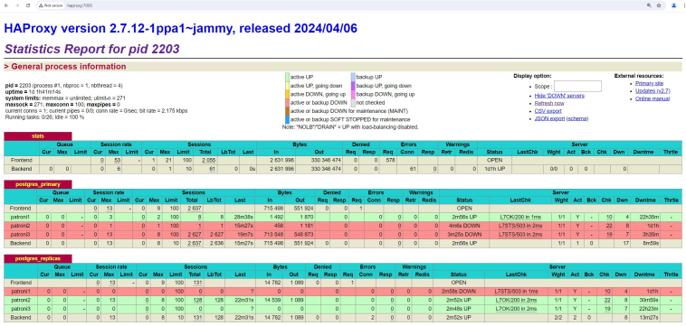
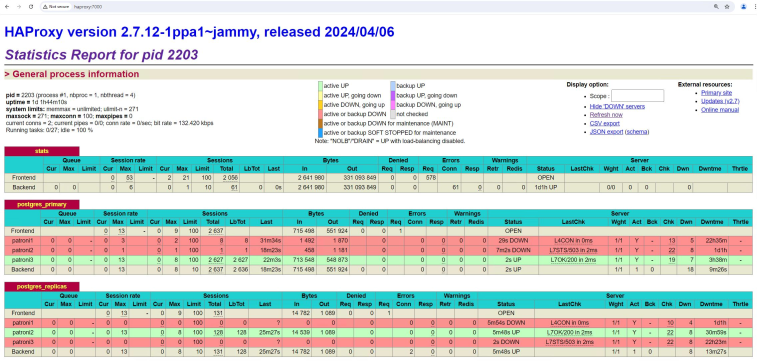
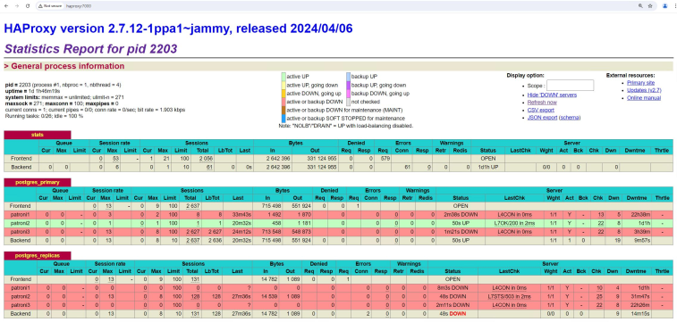
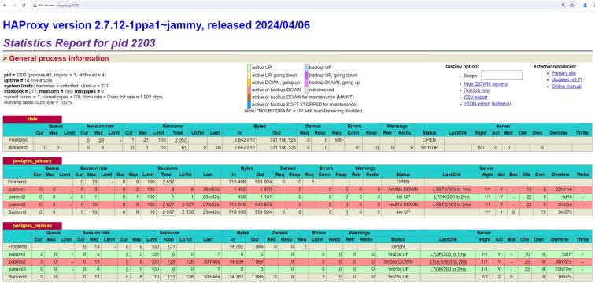

# High Availability architecture for AlloyDB Omni for PostgreSQL

This document describes an architecture that provides high availability (HA) for
AlloyDB Omni for PostgreSQL deployments on Google Cloud using Patroni and
HAProxy.

This document is intended for database administrators, cloud architects, and
DevOps engineers who want to learn how to increase their AlloyDB Omni data-tier
reliability by improving overall system uptime.

Depending on the service level objectives (SLOs) of your system, you might
require an architecture that provides a high level of availability. HA
architectures provide increased protection against data-tier downtime when
compared to single node database setups. If your environment tolerates some
amount of downtime, an HA architecture might introduce unnecessary cost and
complexity.

This document focuses on setting up an HA solution for AlloyDB Omni using the
Patroni, etcd and HAProxy open source tools.

## HA with Patroni, etcd and HAProxy

Patroni is an open-source cluster management tool for PostgreSQL databases
designed to manage and automate high availability (HA) for PostgreSQL clusters.
It uses various distributed consensus systems such as etcd, Consul, or Zookeeper
to coordinate and manage the cluster state.

Some key features and components of Patroni include HA with automatic failover,
leader election, replication and recovery. Patroni is co-located with PostgreSQL
server instances as it directly manages and monitors their health and performs
necessary operations such as failovers and replication to maintain database
cluster high availability and reliability.

Patroni uses a distributed consensus system to store metadata and manage the
cluster. In this guide, we use a distributed configuration store (DCS) called
etcd. One of the most common uses of etcd is to store and retrieve distributed
systems information such as configuration, health, and current status, ensuring
consistent configuration across all nodes.

HAProxy (High Availability Proxy) is an open-source software used for load
balancing and proxying TCP and HTTP-based applications, widely used to improve
the performance and reliability of web applications by distributing incoming
requests across multiple servers.

HAProxy offers load balancing by distributing network traffic across multiple
servers. It maintains the health state of the backend servers it connects to by
performing health checks. If a server fails a health check, HAProxy stops
sending traffic to it until it passes the health checks again.

### Installation

In this guide, we deploy a three-node Patroni cluster with AlloyDB Omni and a
three-node cluster etcd as the configuration store. In front of the cluster, we
use HAProxy in a managed instance group for the floating IP address so that the
failover is transparent to clients.

The initial configuration of the cluster:


The configuration after a zone outage and a failover:


### Costs

This tutorial uses billable components of Google Cloud, including:

1.  [Compute Engine](https://cloud.google.com/compute/vm-instance-pricing)
1.  [Cloud Storage](https://cloud.google.com/storage/pricing)

You can clean up the resources that you created so that they stop using quota
and incurring charges by using the
[terraform destroy](https://developer.hashicorp.com/terraform/cli/commands/destroy)
command.

### Before you begin

1.  [Create a Google Cloud project](https://cloud.google.com/resource-manager/docs/creating-managing-projects#creating_a_project).

1.  [Make sure that billing is enabled](https://cloud.google.com/billing/docs/how-to/modify-project#confirm_billing_is_enabled_on_a_project)
    for your Google Cloud project.

1.  [Open Cloud Shell](https://cloud.google.com/shell/docs/using-cloud-shell#start_a_new_session).
    A Cloud Shell session opens and displays a command-line prompt. Cloud Shell
    is a shell environment with the Cloud SDK already installed. It can take a
    few seconds for the session to initialize.

1.  In Cloud Shell, clone the source repository and go to the directory for this
    tutorial:

    ```bash
    git clone https://github.com/GoogleCloudPlatform/cloud-solutions.git
    ```

In this tutorial, we use
[psql](https://www.postgresql.org/docs/current/app-psql.html) to interact with
the database cluster. The psql client is already installed on the HAProxy node
instance.

One alternative is pgAdmin. pgAdmin is a popular,open-source administration and
development platform for PostgreSQL that provides a graphical interface which
simplifies the process of managing PostgreSQL databases.

### Deploy the solution

In Cloud Shell, go to the terraform directory of this tutorial:

```bash
cd cloud-solutions/projects/alloydbomni-ha-patroni-etcd-creation/terraform && \
terraform init
```

Run the Terraform script to create all resources: The Terraform script creates
and configures:

- three nodes for your etcd cluster
- three nodes for your Patroni cluster
- one node for HAProxy

You can set values for your project_id, region, zones, and some settings for
your Patroni cluster such as cluster name, Postgres superuser, replication
usernames, and passwords. Except for the project_id, all other variables have
default values, and the passwords for the Postgres superuser and replication
user are randomly generated. You can either change default values in the
variables.tf file or add the variable values in the terraform command line by
using the -var option for each variable:

```bash
terraform apply \
-var='region=us-central1' \
-var='zones=["us-central1-a","us-central1-b", "us-central1-c"]'
```

### (Optional) Connection Pooling with PGBouncer

If the number of clients that connect to the database becomes an issue and you
have performance issues due to the high number of simultaneous database
connections, you might add an additional connection pooling component such as
PgBouncer.

PgBouncer is a lightweight connection pooler for PostgreSQL databases. It allows
multiple client connections to share a smaller number of PostgreSQL connections.
This helps reduce overhead and improve the performance of the database by
limiting the number of active database connections.

You can optionally create one more compute engine instance and install PgBouncer
on it. It stays between the clients and the HAProxy node. For guidance on how to
install PgBouncer, see
[PgBouncer Installation, Configuration and Use Cases for Better Performance](https://medium.com/swlh/pgbouncer-installation-configuration-and-use-cases-for-better-performance-1806316f3a22).

### Synchronous vs Asynchronous replication

In a Patroni-managed PostgreSQL cluster, replication can be configured in both
synchronous and asynchronous modes. By default, Patroni uses asynchronous
streaming replication. Although each replication type offers distinct advantages
and trade-offs, some business use cases might require synchronous replication.

Asynchronous replication allows transactions to be committed on the primary
without waiting for acknowledgments from standbys. The primary sends write-ahead
log (WAL) records to standbys, which apply them asynchronously.

This approach reduces write latency and improves performance but comes with the
risk of data loss if the primary fails before the standby has caught up.
Standbys might be behind the primary, leading to potential inconsistencies
during failover.

Synchronous replication in PostgreSQL ensures data consistency by waiting for
transactions to be written to both the primary and at least one synchronous
standby before committing. This guarantees that data is not lost in the event of
a primary failure, providing strong data durability and consistency.

The primary waits for acknowledgments from the synchronous standby, which can
lead to higher latency and potentially lower throughput due to the added
round-trip time. This can reduce overall system throughput, especially under
high load.

The choice between synchronous and asynchronous replication in a Patroni cluster
depends on the specific requirements for data durability, consistency, and
performance. Synchronous replication is preferable in scenarios where data
integrity and minimal data loss are critical, while asynchronous replication
suits environments where performance and lower latency are prioritized.

You can configure a mixed solution that involves having a three node cluster
with a synchronous standby in the same region but a different nearby zone or
datacenter, and a second asynchronous standby in a different region or a more
distant datacenter to protect against potential regional outages.

To make Patroni use only synchronous replication in your three nodes cluster,
add configuration items such as `synchronous_mode`, `synchronous_node_count`,
`synchronous_commit` and `synchronous_standby_names` in the bootstrap section in
your Patroni configuration files. Go to the bootstrap section of the
`patroni_startup.tftpl` file. It should look like this:

```yaml
    bootstrap:
      dcs:
        # Follow the rule loop_wait + 2 * retry_timeout <= ttl
        ttl: 30
        loop_wait: 10
        retry_timeout: 10
        # The maximum bytes a follower may lag to be valid for failover.
        # Influences the RPO. 1MB by default.
        maximum_lag_on_failover: 1048576
        postgresql:
          use_pg_rewind: true
          use_slots: true
          parameters:
            hot_standby: "on"
            wal_keep_segments: 20
            max_wal_senders: 8
            max_replication_slots: 8
```

Perform the following changes to enable synchronous replication and define the
number of syncrhonously replicated nodes in the cluster:

```yaml
    bootstrap:
      dcs:
        # Follow the rule loop_wait + 2 * retry_timeout <= ttl
        ttl: 30
        loop_wait: 10
        retry_timeout: 10
        # The maximum bytes a follower may lag to be valid for failover.
        # Influences the RPO. 1MB by default.
        maximum_lag_on_failover: 1048576
        # Turns on synchronous replication
        synchronous_mode: true
        # Defines how many nodes in the cluster use syncrhonous replication.
        synchronous_node_count: 2
        postgresql:
          use_pg_rewind: true
          use_slots: true
          parameters:
            hot_standby: "on"
            wal_keep_segments: 20
            max_wal_senders: 8
            max_replication_slots: 8
            # Can also be on, remote_write or local. Influences the RPO.
            synchronous_commit: remote_apply
            synchronous_standby_names: '*'
```

When `synchronous_mode` is turned on, Patroni will use synchronous replication
between its primary and the other replicas. The parameter
`synchronous_node_count` is used by Patroni to manage the number of synchronous
standby databases. Patroni manages a precise number of synchronous standby
databases based on the `synchronous_node_count` parameter and adjusts the state
in the configuration store and in the `synchronous_standby_names` as members
join and leave.

For more information about synchronous replication, see the
[Replication modes](https://patroni.readthedocs.io/en/latest/replication_modes.html)
section in Patroni's documentation.

## Test your HA setup

Ensuring the reliability and robustness of your HA Patroni setup is crucial for
maintaining continuous database operations and minimizing downtime. This section
provides a comprehensive guide to testing your Patroni cluster, covering various
failure scenarios, replication consistency, and failover mechanisms.

Follow the steps outlined below to validate the integrity and performance of
your HA Patroni configuration.

### Test your Patroni setup

Connect to any of your patroni instances (patroni1, patroni2 or patroni3) and
navigate to the AlloyDB Omni patroni folder:

```bash
cd /alloydb/
```

Run the docker compose logs command to inspect the patroni logs:

```bash
docker compose logs alloydbomni-patroni
```

Notice the last entries, they should reflect information about the patroni node.
You should see something similar to:

```text
alloydb-patroni        | 2024-06-12 15:10:29,020 INFO: no action. I am (patroni1), the leader with the lock
alloydb-patroni        | 2024-06-12 15:10:39,010 INFO: no action. I am (patroni1), the leader with the lock
alloydb-patroni        | 2024-06-12 15:10:49,007 INFO: no action. I am (patroni1), the leader with the lock
```

Connect to any instance of the patroni cluster or to your HAProxy node and run:

```bash
curl -s http://alloydb-patroni1:8008/patroni | jq .
```

This command will give you information about the alloydb-patroni1 instance. You
should see something similar to what is displayed below, assuming that
alloydb-patroni1 is the leader of the cluster:

```json
{
  "state": "running",
  "postmaster_start_time": "2024-05-16 14:12:30.031673+00:00",
  "role": "master",
  "server_version": 150005,
  "xlog": {
    "location": 83886408
  },
  "timeline": 1,
  "replication": [
    {
      "usename": "alloydbreplica",
      "application_name": "patroni2",
      "client_addr": "10.172.0.40",
      "state": "streaming",
      "sync_state": "async",
      "sync_priority": 0
    },
    {
      "usename": "alloydbreplica",
      "application_name": "patroni3",
      "client_addr": "10.172.0.41",
      "state": "streaming",
      "sync_state": "async",
      "sync_priority": 0
    }
  ],
  "dcs_last_seen": 1715870011,
  "database_system_identifier": "7369600155531440151",
  "patroni": {
    "version": "3.3.0",
    "scope": "my-patroni-cluster",
    "name": "patroni1"
  }
}
```

> Note: You might need to install the jq tool by running:
> `sudo apt-get install jq -y`

Calling the Patroni HTTP API endpoint on a Patroni node exposes various details
about the state and configuration of that particular PostgreSQL instance managed
by Patroni, including cluster state information, timeline and WAL information,
and health checks indicating whether the nodes and cluster are up and running
correctly.

### Test your HAProxy setup

Connect to the HAProxy node and run the following command:

```bash
sudo watch 'echo "show stat" | socat unix-connect:/var/run/haproxy/admin.sock stdio | cut -d "," -f 1,2,6-10,18,50,56,37 | column -s, -t'
```

You should see something resembling the below table:

| pxname            | svname   | smax | slim | stot | bin   | bout    | status | rate_max | check_status | cli_abrt | lastsess |
| ----------------- | -------- | ---- | ---- | ---- | ----- | ------- | ------ | -------- | ------------ | -------- | -------- |
| stats             | FRONTEND | 4    | 100  | 6    | 16618 | 1178088 | OPEN   | 2        |              |          |          |
| stats             | BACKEND  | 0    | 10   | 0    | 16618 | 1178088 | UP     | 0        |              | 0        | 7753     |
| postgres_primary  | FRONTEND | 4    | 100  | 5    | 842   | 0       | OPEN   | 3        |              |          |          |
| postgres_primary  | patroni1 | 2    | 100  | 4    | 589   | 0       | UP     | 3        | L7OK         | 0        | 9771     |
| postgres_primary  | patroni2 | 0    | 100  | 0    | 0     | 0       | DOWN   | 0        | L7STS        | 0        | -1       |
| postgres_primary  | patroni3 | 1    | 100  | 1    | 253   | 0       | DOWN   | 1        | L7STS        | 0        | 9979     |
| postgres_primary  | BACKEND  | 2    | 10   | 5    | 842   | 0       | UP     | 3        |              | 0        | 9771     |
| postgres_replicas | FRONTEND | 0    | 100  | 0    | 0     | 0       | OPEN   | 0        |              |          |          |
| postgres_replicas | patroni1 | 0    | 100  | 0    | 0     | 0       | DOWN   | 0        | L7STS        | 0        | -1       |
| postgres_replicas | patroni2 | 0    | 100  | 0    | 0     | 0       | UP     | 0        | L7OK         | 0        | -1       |
| postgres_replicas | patroni3 | 0    | 100  | 0    | 0     | 0       | UP     | 0        | L7OK         | 0        | -1       |
| postgres_replicas | BACKEND  | 0    | 10   | 0    | 0     | 0       | UP     | 0        |              | 0        | -1       |

Alternatively, on any machine with a working browser and network connectivity to
your HAProxy node, go to the following address using the browser:

```text
http://<haproxy-node>:7000
```

You should see something resembling the below screenshot:



The HAProxy dashboard provides real-time information about load balancing and
server status. For example, the LastChk column shows the result of the most
recent health check for each server (e.g., L7OK/200, L7STS/503).

The `postgres_primary` section lists different possible AlloyDB Omni primary
servers (patroni1, patroni2, patroni3). The table in this section has columns
showing the queue, session rate, bytes in/out, denied requests, errors,
warnings, and server status. The only primary server UP (green) is patroni1.

Similar to the `postgres_primary` section, the `postgres_replicas` table lists
all the potential replica servers (patroni1, patroni2, patroni3) with their
respective stats. Notice how patroni1 is down in this section as it's a primary
server, indicated by a red background, while patroni2 and patroni3 are UP
because they are replica servers.

Go to your HAProxy node and use the psql client to connect to your cluster:

```bash
psql -h localhost -p 5000 -U postgres
```

Provide the password for the postgres super user. If it was self-generated, you
can find it in the `patroni.yml` config file, located on any Patroni node in the
`/alloydb/config/patroni.yml` file.

Optionally, you can connect to the HAProxy server from a pgAdmin client and
perform some queries to check the replication stats in your cluster. From the
pgAdmin client,
[connect to your HAProxy node](https://www.pgadmin.org/docs/pgadmin4/development/connect_to_server.html).

Use the hostname of your HAProxy node and 5000 for the port.

Run the following query in psql or pgAdmin:

```sql
SELECT
    pid, usename, application_name, client_addr, state, sync_state
FROM
    pg_stat_replication;
```

You should see something similar:

| pid | usename        | application_name | client_addr | state     | sync_state |
| --- | -------------- | ---------------- | ----------- | --------- | ---------- |
| 188 | alloydbreplica | patroni2         | 10.0.1.4    | streaming | sync       |
| 684 | alloydbreplica | patroni3         | 10.0.1.7    | streaming | sync       |

The results show that patroni2 and patroni3 nodes are replicating syncrhonously
from patroni1.

### Test the automatic failover operation

In your three-node cluster, simulate an outage on the primary node. You can
either stop the Patroni service on the primary node to simulate an outage or
enforce some firewall rules to stop communication to that node. In this guide,
we will simulate an outage by stopping the attached-running Patroni container.

Navigate to the alloydb folder on your primary node:

```bash
cd /alloydb/
```

Stop the container:

```bash
sudo docker compose down
```

You should see something similar to this:

```text
root@patroni1:/alloydbomni-patroni# docker compose down
[+] Running 2/2
 ✔ Container alloydb-patroni            Removed
 ✔ Network alloydbomni-patroni_default  Removed
```

Notice how failover takes place:

| pxname            | svname   | smax | slim | stot | bin   | bout    | status | rate_max | check_status | cli_abrt | lastsess |
| ----------------- | -------- | ---- | ---- | ---- | ----- | ------- | ------ | -------- | ------------ | -------- | -------- |
| stats             | FRONTEND | 4    | 100  | 6    | 16618 | 1178088 | OPEN   | 2        |              |          |          |
| stats             | BACKEND  | 0    | 10   | 0    | 16618 | 1178088 | UP     | 0        |              | 0        | 8058     |
| postgres_primary  | FRONTEND | 4    | 100  | 5    | 842   | 0       | OPEN   | 3        |              |          |          |
| postgres_primary  | patroni1 | 2    | 100  | 4    | 589   | 0       | DOWN   | 3        | L4CON        | 0        | 10076    |
| postgres_primary  | patroni2 | 0    | 100  | 0    | 0     | 0       | DOWN   | 0        | L7STS        | 0        | -1       |
| postgres_primary  | patroni3 | 1    | 100  | 1    | 253   | 0       | UP     | 1        | L7OK         | 0        | 10284    |
| postgres_primary  | BACKEND  | 2    | 10   | 5    | 842   | 0       | UP     | 3        |              | 0        | 10076    |
| postgres_replicas | FRONTEND | 0    | 100  | 0    | 0     | 0       | OPEN   | 0        |              |          |          |
| postgres_replicas | patroni1 | 0    | 100  | 0    | 0     | 0       | DOWN   | 0        | L4CON        | 0        | -1       |
| postgres_replicas | patroni2 | 0    | 100  | 0    | 0     | 0       | UP     | 0        | L7OK         | 0        | -1       |
| postgres_replicas | patroni3 | 0    | 100  | 0    | 0     | 0       | DOWN   | 0        | L7STS        | 0        | -1       |
| postgres_replicas | BACKEND  | 0    | 10   | 0    | 0     | 0       | UP     | 0        |              | 0        | -1       |

Alternatively, refresh the HAProxy dashboard in the browser:



Notice how the patroni3 instance in the `postgres_primary` is now UP because it
became the new primary and patroni2 is the only remaining replica from the
`postgres_replicas` section. The previous primary, patroni1, is down in both
sections and as expected, the health checks for it are failing.

Patroni performs and manages the failover through a combination of monitoring,
consensus, and automated orchestration. As soon as the primary node fails to
renew its lease within a specified timeout, or if it reports a failure, the
other nodes in the cluster recognize this condition through the consensus
system.

The remaining nodes coordinate to select the most suitable replica to promote as
the new primary. Once a candidate replica is selected, Patroni promotes this
node to primary by applying the necessary changes, such as updating the
PostgreSQL configuration and replaying any outstanding WAL records.

Then, the new primary node updates the consensus system with its status and the
other replicas reconfigure themselves to follow the new primary, including
switching their replication source and potentially catching up with any new
transactions. HAProxy detects the new primary and redirects client connections
accordingly, ensuring minimal disruption.

Run the following query in the psql client on the HAProxy node to check the
replication stats in your cluster after failover:

```sql
SELECT
    pid, usename, application_name, client_addr, state, sync_state
FROM
    pg_stat_replication;
```

You should see something similar:

| pid | usename        | application_name | client_addr | state     | sync_state |
| --- | -------------- | ---------------- | ----------- | --------- | ---------- |
| 234 | alloydbreplica | patroni2         | 10.0.1.4    | streaming | sync       |

Notice how patroni2 is now the only replica remaining, following the new primary
patroni3.

Your three node cluster can survive one more outage. If you stop the current
primary node (patroni3), another failover will take place:

| pxname            | svname   | smax | slim | stot | bin   | bout    | status | rate_max | check_status | cli_abrt | lastsess |
| ----------------- | -------- | ---- | ---- | ---- | ----- | ------- | ------ | -------- | ------------ | -------- | -------- |
| stats             | FRONTEND | 4    | 100  | 8    | 21610 | 1533915 | OPEN   | 2        |              |          |          |
| stats             | BACKEND  | 0    | 10   | 0    | 21610 | 1533915 | UP     | 0        |              | 0        | 5        |
| postgres_primary  | FRONTEND | 4    | 100  | 5    | 842   | 0       | OPEN   | 3        |              |          |          |
| postgres_primary  | patroni1 | 2    | 100  | 4    | 589   | 0       | DOWN   | 3        | L4CON        | 0        | 10243    |
| postgres_primary  | patroni2 | 0    | 100  | 0    | 0     | 0       | UP     | 0        | L7OK         | 0        | -1       |
| postgres_primary  | patroni3 | 1    | 100  | 1    | 253   | 0       | DOWN   | 1        | L4CON        | 0        | 10451    |
| postgres_primary  | BACKEND  | 2    | 10   | 5    | 842   | 0       | UP     | 3        |              | 0        | 10243    |
| postgres_replicas | FRONTEND | 0    | 100  | 0    | 0     | 0       | OPEN   | 0        |              |          |          |
| postgres_replicas | patroni1 | 0    | 100  | 0    | 0     | 0       | DOWN   | 0        | L4CON        | 0        | -1       |
| postgres_replicas | patroni2 | 0    | 100  | 0    | 0     | 0       | DOWN   | 0        | L7STS        | 0        | -1       |
| postgres_replicas | patroni3 | 0    | 100  | 0    | 0     | 0       | DOWN   | 0        | L4CON        | 0        | -1       |
| postgres_replicas | BACKEND  | 0    | 10   | 0    | 0     | 0       | DOWN   | 0        |              | 0        | -1       |

Alternatively, refresh the HAProxy dashboard in the browser:



Notice how the patroni2 instance in the `postgres_primary` is now UP as it
became the only primary server. In the `postgres_replicas` section, all nodes
are down and all the health checks for them are failing, showing that the
current primary in the cluster has no replicas.

## Fallback considerations

Fallback is the process to reinstate the former source node after a failover has
occurred. Automatic fallback is generally not recommended in a HA database
cluster due to several critical concerns. For example: incomplete recovery, risk
of split-brain scenarios, and replication lag.

In your Patroni cluster, if you bring up the two nodes for which you simulated
an outage, they will rejoin the cluster as standby replicas:

```bash
cd /alloydb/
sudo docker compose up -d
```



Notice how now patroni1 and patroni3 are replicating from the current primary
patroni2.

| pid | usename        | application_name | client_addr | state     | sync_state |
| --- | -------------- | ---------------- | ----------- | --------- | ---------- |
| 268 | alloydbreplica | patroni1         | 10.0.1.2    | streaming | sync       |
| 279 | alloydbreplica | patroni3         | 10.0.1.7    | streaming | sync       |

If you want to manually fall back to your initial primary patroni1 from the
current patroni2 leader, you can do that by using the
[Patroni REST API](https://patroni.readthedocs.io/en/latest/rest_api.html). To
fall back to patroni1, you perform a
[switchover](https://patroni.readthedocs.io/en/latest/rest_api.html#switchover)
request from any machine that has network connectivity to the cluster to the
current leader (patroni2):

```bash
curl -s http://alloydb-patroni2:8008/switchover -XPOST -d '{"leader":"patroni2", "candidate":"patroni1"}'
```

You should see the confirmation message:

```bash
Successfully switched over to "patroni1"
```

By opting for manual fallback, you can ensure a more reliable, consistent, and
thoroughly verified recovery process, maintaining the integrity and availability
of your database systems.
