# Beyond the Chatbot: The Enterprise Architecture for Systems of Action

> _From Probabilistic Vector RAG to Deterministic Graph Intelligence on Google
> Cloud_

## Navigation

- **[Introduction](index.md)**
- **[Phase 1: Breaking the Probabilistic
  Wall](phase1_breaking_the_probabilistic_wall.md)**
- **[Phase 2: Anchoring Agents in Structured Business
  Reality](phase2_anchoring_agents_in_structured_business_reality.md)**
- **[Phase 3: Regulator-Grade System of
  Action](phase3_regulator_grade_system_of_action.md)**

---

## Introduction

The enterprise AI paradigm is shifting from **systems of intelligence** (passive
assistants that read, summarize, and answer questions) to **systems of
action**[^1] (autonomous agents that execute multi-step transactions, modify
database states, and reallocate financial budgets).

For software engineers and data architects, the core mental model for
understanding this transition is **"The Overconfident Intern."** Giving a
standard Large Language Model (LLM) direct API access or raw SQL database access
is like handing an untrained, overconfident intern administrative access to your
production network:

- **High linguistic fluency, zero institutional knowledge:** The model reads
  natural language and generates fluent text, but lacks a verified understanding
  of internal company rules, metric definitions, and regulatory constraints.
- **Catastrophic guessing:** When confronted with ambiguous column names or
  multi-table relational schemas, the ungrounded model guesses foreign-key joins
  across production tables, causing corrupted database states and unauthorized
  actions.
- **The critical constraint is trust, not intelligence:** The primary bottleneck
  in enterprise agentic AI is no longer foundation model capability—it is **data
  architecture, deterministic grounding, and auditable governance**.[^2]

As academic research demonstrates, standard vector similarity retrieval operates
strictly on localized semantic proximity, failing on multi-hop relational
queries and holistic database summarization.[^3] To build a trusted,
regulator-grade agentic platform, organizations must transition from
probabilistic guesses to deterministic reasoning. This three-phase reference
architecture on Google Cloud provides the blueprint to achieve this, using
Google Cloud's public e-commerce reference dataset (**thelook**) as the
foundational operational database throughout.[^4]

---

### Systems of Intelligence vs. Systems of Action

For software engineers and data practitioners, understanding the architectural
requirements of an AI agent starts by contrasting these two paradigms:

| Architectural Dimension | Systems of Intelligence (Gen-1 AI)                                   | Systems of Action (Gen-2 / Agentic AI)                                                           |
| :---------------------- | :------------------------------------------------------------------- | :----------------------------------------------------------------------------------------------- |
| **Primary Role**        | Reading, summarizing, drafting, and answering questions              | Executing API calls, reallocating budgets, and modifying database records                        |
| **Operational Mode**    | **Read-Only**: Generates text for human review                       | **Read & Write**: Executes autonomous actions with real-world state changes                      |
| **Reasoning Engine**    | **Probabilistic**: Predicts next tokens based on statistical weights | **Deterministic**: Grounded in strict business contracts, mathematical formulas, and graph paths |
| **Data Source**         | Raw text chunks, PDF snippets, and vector embedding stores           | Connected operational databases, live property graphs, and governed metadata catalogs            |
| **Cost of Failure**     | **Low**: A poorly phrased email summary or minor search discrepancy  | **Critical**: Unauthorized discounts, compliance breaches, financial fraud, and data corruption  |
| **Target SLA**          | Best-effort informational assistance                                 | **Regulator-Grade 100% precision and complete auditability**                                     |

---

### Phase 1: The Probabilistic Baseline — High-Performance Relational-AI & Standard RAG

_[Read full paper: Phase 1: Breaking the Probabilistic
Wall](phase1_breaking_the_probabilistic_wall.md)_

This foundational architecture focuses on unstructured text retrieval and
relational grounding over `thelook` e-commerce database (`users`, `order_items`,
`products`, and `distribution_centers`) to expand the LLM's context window with
private domain knowledge and high-performance transactional data.

#### Phase 1 Google Cloud Products & Core Features

- **Vertex AI (Gemini Models):** Hosts multimodal foundation models with large
  context windows to ingest parsed documents and reason over technical text.
- **AlloyDB AI:** Powers PostgreSQL-compatible operational workloads over
  `thelook` tables with built-in AI functions and native `pgvector` support.[^5]
  It provides native, in-database embedding generation and prediction,
  delivering low-latency vector operations for AI-driven operational databases.
- **Vertex AI Vector Search / BigQuery Vector Search (using `ML.PREDICT`):**
  Generates and indexes high-dimensional text embeddings, enabling the agent to
  execute semantic similarity searches across product catalogs and policy
  chunks.
- **Cloud Storage (GCS):** Acts as the scalable repository for unstructured
  PDFs, shipping terms, and product documentation.

#### Problems Solved by Phase 1

- **Supplements Static LLM Knowledge:** Ingests private, up-to-date business
  files into the context window without requiring fine-tuning.
- **Removes PostgreSQL Search Limitations:** Overcomes traditional PostgreSQL
  indexing limits to deliver high-performance multilingual text search across
  `thelook` products (`item_name`, `brand`, and `product_category`).
- **Accelerates Operational Grounding:** Deploys optimized Retrieval-Augmented
  Generation (RAG) pipelines with transactional consistency and low-latency
  vector indexing.

#### Architectural Gaps Requiring Phase 2

- **The Structured Data Blind Spot:** Standard relational tables cannot easily
  traverse deep, multi-tiered relationships in `thelook` (e.g.,
`(Customer)-[:places]->(Order)-[:contains_item]->(InventoryItem)-[:product_is]->(Product)-[:supplied_by]->(DistributionCenter)`).
  Relational databases require complex, expensive multi-table SQL JOIN
  operations that confuse LLMs, resulting in high query error rates.
- **Context Fragmentation:** Segmenting documents into isolated vector chunks
  severs the causal relationships and structural hierarchies between concepts.
- **Semantic Drift:** Ambiguous terms (such as _"VIP Customer"_) cannot be
  resolved natively because the system lacks a centralized business glossary to
  map natural language to exact, executable SQL filter rules (such as
  `user_order_facts.lifetime_revenue >= 500`).

---

### Phase 2: The Relational-to-Graph (R2G) & Active Metadata Grounding Layer

_[Read full paper: Phase 2: Anchoring Agents in Structured Business
Reality](phase2_anchoring_agents_in_structured_business_reality.md)_

This architecture introduces structured relationship mapping by transforming
`thelook` relational tables into property graphs and binding them to a
centralized Knowledge Catalog (formerly Dataplex) semantic contract.

#### Phase 2 Google Cloud Products & Core Features

- **Cloud Spanner Graph (Operational Property Graph):** Defines logical property
  graphs directly over existing `thelook` relational tables (`users`,
  `products`, `orders`, and `distribution_centers`) using standard Data
  Definition Language (**DDL**: `CREATE PROPERTY GRAPH R2G`). It supports hybrid
  SQL and Graph Query Language (**GQL**) queries, enabling low-latency,
  multi-hop relationship traversals within a single transaction engine.
- **BigQuery Graph (Analytical Property Graph):** Executes property graph
  queries across enterprise data warehouses without moving underlying data.
- **Knowledge Catalog:**[^6] Serves as an active context registry. It
  establishes a standardized **Business Glossary** (Terms, Categories) and
  attaches custom **Aspects** (metadata templates) to physical datasets, mapping
  business terms to executable GQL/SQL filter formulas.

#### Problems Solved by Phase 2

- **Enforces Semantic Alignment:** When a user queries "VIP Customers," the
  agent retrieves the verified **SQL Mapping Ruleset Aspect** from the Knowledge
  Catalog and embeds the exact formula
  (`user_order_facts.lifetime_revenue >= 500`) into the query, preventing
  retrieval drift and graph hallucination through constraint-checked query
  planning.[^7]
- **Executes Deterministic Multi-Hop Traversals:** The GQL engine executes
  multi-tier graph traversals directly (e.g.,
`(u:users)-[:places]->(o:orders)-[:contains_item]->(p:products)-[:supplied_by]->(dc:distribution_centers)`),
  replacing fragile, resource-intensive SQL JOINs.
- **Enables Zero-Impact Analytical Traversals:** With **Spanner Data Boost**,
  analytical queries traverse real-time database nodes and historical warehouse
  logs simultaneously with zero performance impact on transactional workloads.

#### Architectural Gaps Requiring Phase 3

- **Ingesting Unstructured Policy Rules:** Standard R2G only maps structured
  database records. It cannot extract or integrate unstructured policy manuals
  (such as PDF documentation detailing `thelook` global refund and exchange
  rules).
- **Auditing Autonomous Action Cycles:** When agents make multi-step decisions
  or execute transactions, they lack a dedicated context store to audit why
  specific choices were made.
- **Proactive Graph Intelligence:** The system remains limited to reactive
  queries and cannot natively execute parallel graph mining algorithms (such as
  clustering or centrality) to detect hidden network patterns.

---

### Phase 3: The Complete Semantic Ontology & Dual-Graph Architecture

_[Read full paper: Phase 3: The Regulator-Grade System of
Action](phase3_regulator_grade_system_of_action.md)_

This advanced architecture realizes a **System of Action**. It establishes a
full semantic ontology spanning unstructured policies (U2G - Unstructured to
Graph) and `thelook` structured data, utilizing a dual-graph engine for
low-latency execution and auditable memory.

#### Phase 3 Google Cloud Products & Core Features

- **Cloud Spanner Graph with Native Graph Algorithms & GraphRAG:**[^8] Executes
  parallel graph mining algorithms (PageRank, Modularity Clustering, and
  Similarity calculations) that scale to billions of nodes. It unifies entity
  embeddings and graph topology within a single database to support GraphRAG.
- **BigQuery Graph with BigQuery Agent Analytics SDK & Plugin:** Automatically
  logs every intermediate reasoning step, constraint evaluation, and final
  action into an immutable **Context Graph** (using Yahoo's decision-trace
  ontology) in BigQuery.
- **Document AI (Layout Parser):** Parses multi-page business PDFs (such as
  terms of service and standard operating procedures) and extracts structural
  hierarchies into clean JSON schemas.
- **Open Knowledge Format (OKF):**[^9] Defines a lightweight specification using
  Markdown files and YAML frontmatter to version-control corporate definitions,
  metrics, and implicit domain knowledge inside Git pipelines.

#### Problems Solved by Phase 3

- **Harmonizes Unstructured Policies (U2G Architecture Pattern):** The
  customer-implemented Unstructured-to-Graph (U2G) pipeline pattern combines
  Document AI Layout Parser and Vertex AI Gemini to parse unstructured PDFs into
  structured semantic triples (Entity-Relation-Entity), materializing them into
  Spanner Graph for deterministic, real-time policy evaluation.
- **Delivers Regulator-Grade Auditability:** Dividing responsibilities across a
  **Dual-Graph foundation** guarantees complete explainability:
    - **Knowledge Graph (Spanner Graph):** Grounds real-time transactional
      execution (**Acting**) over `thelook` data.
    - **Context Graph (BigQuery Graph):** Preserves immutable decision lineages
      (**Remembering**). Auditors can run standard GQL queries to trace an
      automated refund or approval back to its originating policy text.
- **Closes the Learning Loop:** Joins real-world outcome metrics back to the
  context graph, generating proprietary datasets to fine-tune downstream
  enterprise models.
- **Enables Google-Grade Network Analytics:** Executes parallel graph algorithms
  in GQL to detect fraudulent return rings, identify supply chain bottlenecks,
  and spot anomalous entity behaviors across `thelook` network.

---

### Architectural & Implementation Reference Guide

To help engineers, database administrators, and cloud architects navigate this
multi-phase evolution, the table below summarizes the key technological
transitions across all three phases:

| Dimension                      | Phase 1: Probabilistic Baseline                               | Phase 2: Structured Graph Grounding                    | Phase 3: Regulator-Grade System of Action                           |
| :----------------------------- | :------------------------------------------------------------ | :----------------------------------------------------- | :------------------------------------------------------------------ |
| **Primary Architectural Role** | Information Retrieval & Relational Querying                   | Relationship Traversal & Semantic Alignment            | Deterministic Execution & Decision Lineage                          |
| **Google Cloud Core Engine**   | **AlloyDB AI** + Vertex AI Vector Search                      | **Cloud Spanner Graph** + Knowledge Catalog            | **Cloud Spanner Graph** + **BigQuery Graph** + Document AI          |
| **Primary Query Interface**    | SQL (`SELECT ... WHERE ...`) & Vector Cosine Distance (`<=>`) | ISO GQL (`MATCH (u)-[:places]->(o)`) & SQL Hybrid      | GQL + Native Parallel Graph Algorithms (PageRank, Modularity)       |
| **Data Representation**        | Flat Relational Tables & 768-dim Vector Float Arrays          | Property Graph (`Node Tables` & `Edge Tables`)         | Dual-Graph (Knowledge Graph + Context Graph)                        |
| **Governance & Semantics**     | Unstructured Prompt Context & Text Chunks                     | Governed Business Glossaries & SQL/GQL Aspect Rules    | Open Knowledge Format (OKF) in Git + Immutable Execution Lineage    |
| **Failure Mode Addressed**     | Static LLM Knowledge Cutoffs                                  | Hallucinations on Relational Joins & Ambiguous Metrics | Opaque Agent Decisions & Unstructured Policy Constraints            |
| **Target Workload**            | Interactive Search, Product Recommendations                   | Customer 360, Multi-tier Supply Chain Traversal        | Autonomous Claims Processing, Fraud Ring Detection, Audited Actions |

---

### Core Concept Primers for Engineers

#### Concept 1: Probabilistic vs. Deterministic Reasoning

- **Probabilistic (LLMs & Vectors):** Operates on statistical likelihoods. Given
  a prompt, an LLM predicts the next most probable token
  ().
  Similarly, vector search identifies text chunks with high cosine similarity.
  While effective for conversational interactions, probabilistic methods cannot
  guarantee the strict, repeatable Boolean outcomes required for business logic.
- **Deterministic (Databases, Schemas, and Graphs):** Operates on verifiable
  facts and exact Boolean logic
  ( or
  ). An order status is
  either `Cancelled` or `Shipped`; an account has either met a threshold or has
  not. Graph paths either connect or do not. A System of Action requires
  deterministic foundations to guarantee 100% precision.

#### Concept 2: Ontology vs. Database Schema

- **Database Schema (Physical Storage):** Defines how data is stored in tables,
  columns, and data types (e.g., `users` table with `id INT64`, `email STRING`,
  and `created_at TIMESTAMP`).

- **Taxonomy (Hierarchical Classification):** Organizes categories into trees
  (e.g., _Apparel
   Men's
   Outerwear
   Jackets_).

- **Ontology (Conceptual Business Model):** Defines the comprehensive web of
  entities (**Nodes**) and typed relationships (**Edges**) that govern business
  operations:

    

    In an ontology, relationships are first-class citizens, enabling agents to
    navigate business rules without relying on ungrounded SQL joins.

#### Concept 3: Relational SQL JOINs vs. Property Graph Traversals

- **Relational `JOIN`
  (
  Scanning):** Finding products ordered by a customer requires scanning the
  `users` table, matching foreign keys in `orders`, joining with `order_items`,
  and joining again with `products`. As table sizes reach millions of rows,
  multi-table joins consume substantial CPU and memory.
- **Property Graph Traversal
  ( per Hop):** In
  **Spanner Graph**, edges are stored as direct pointers between nodes
  (`Node-Edge-Node` triples). Traversing 5 hops takes constant time per node,
  delivering sub-10ms queries across complex networks.

---

### Frequently Asked Questions

- **Why is fine-tuning an LLM on internal documentation insufficient for
  operational data?** Fine-tuning adjusts a model's style, tone, and vocabulary,
  but cannot reliably store dynamic operational data. Fine-tuned models cannot
  reflect real-time inventory updates that occurred seconds ago, cost thousands
  of dollars per retraining cycle, and remain prone to hallucinating facts when
  prompted outside their training data.

- **Why does direct Text-to-SQL translation fail for complex enterprise
  databases?** Text-to-SQL works for simple queries over 1 or 2 clean tables.
  However, when an enterprise schema spans dozens of tables with subtle business
  definitions (such as distinguishing between `sale_price` and `cost`) and
  complex foreign keys, LLM-generated SQL suffers from high syntax error rates,
  incorrect join conditions, and runaway Cartesian joins.

- **Why do we need Spanner Graph if we already use PostgreSQL / AlloyDB?**
  AlloyDB AI is an optimal relational database for transactional SQL and
  localized vector search. However, when queries require 4 or more hops of
  relationship depth (such as tracing a product from raw materials to delivery
  center to customer to return claim), relational JOINs create performance
  bottlenecks. Spanner Graph provides native ISO GQL graph querying while
  maintaining global transactional consistency
  ( SLA).

- **Why do we need two separate graphs (Spanner Graph + BigQuery Graph) instead
  of one?** Operational systems (**Online Transaction Processing / OLTP**) and
  analytical audit systems (**Online Analytical Processing / OLAP**) have
  opposing performance requirements. Spanner Graph is optimized for sub-10ms
  real-time transactional reads and writes (**Acting**). BigQuery Graph is
  optimized for petabyte-scale historical log analysis, forensic auditing, and
  agent trajectory mining (**Remembering**) without competing for transactional
  database resources.

---

## Conclusion and Next Phases

Building autonomous, regulator-grade Systems of Action requires evolving
enterprise data architecture from probabilistic, unstructured vector retrieval
to deterministic, relationship-centric property graphs and active semantic
metadata.

Begin your architectural journey with **Phase 1**, exploring the mechanics of
in-database vector search with AlloyDB AI and discovering where traditional
relational-AI boundaries require graph-grounded evolution.

**Next Step:** Proceed to
**[Phase 1: Breaking the Probabilistic
Wall](phase1_breaking_the_probabilistic_wall.md)**
to examine the high- performance relational baseline and analyze the three
structural failure modes of standard Vector RAG.

---

_Document Reference: Beyond the Chatbot: The Enterprise Architecture for Systems
of Action — Google Cloud._

[^1]:
    Mikul Bhatt and Bei Li, "Architecting a trusted agentic platform with graph
    technologies: A Yahoo case study," _Google Cloud Blog_, June 15, 2026.
    \[Online\]. Available:
    <https://cloud.google.com/blog/products/databases/graph-technologies-underpin-yahoo-system-of-action>

[^2]:
    B. Peng et al., "Graph Retrieval-Augmented Generation: A Survey," _arXiv
    preprint arXiv:2408.08921_, 2024. \[Online\]. Available:
    <https://arxiv.org/abs/2408.08921>

[^3]:
    D. Edge et al., "From Local to Global: A Graph RAG Approach to Query-
    Focused Summarization," _arXiv preprint arXiv:2404.16130_, 2024. \[Online\].
    Available: <https://arxiv.org/abs/2404.16130>

[^4]:
    H. Han et al., "Retrieval-Augmented Generation with Graphs (GraphRAG),"
    _arXiv preprint arXiv:2501.00309_, 2025. \[Online\]. Available:
    <https://arxiv.org/abs/2501.00309>

[^5]:
    Tabatha Lewis-Simo and Alan Li, "AlloyDB accelerates AI with automated
    vector indexing and embedding," _Google Cloud Blog_, November 8, 2025.
    \[Online\]. Available:
    <https://cloud.google.com/blog/products/databases/alloydb-ai-auto-vector-embeddings-and-auto-vector-index>

[^6]:
    Chai Pydimukkala and Sam McVeety, "Introducing the Google Cloud Knowledge
    Catalog," _Google Cloud Blog_, April 22, 2026. \[Online\]. Available:
    <https://cloud.google.com/blog/products/data-analytics/introducing-the-google-cloud-knowledge-catalog>

[^7]:
    "Toward Robust GraphRAG: Mitigating Retrieval Drift and Hallucination from
    Imperfect Knowledge Graphs," _arXiv preprint arXiv:2603.14828_, 2026.
    \[Online\]. Available: <https://arxiv.org/abs/2603.14828>

[^8]:
    Bei Li and Vahab Mirrokni, "Announcing Spanner Graph algorithms: Google-
    grade intelligence for connected data," _Google Cloud Blog_, June 2, 2026.
    \[Online\]. Available:
    <https://cloud.google.com/blog/products/databases/introducing-spanner-graph-algorithms>

[^9]:
    Sam McVeety and Amir Hormati, "Introducing the Open Knowledge Format,"
    _Google Cloud Blog_, June 12, 2026. \[Online\]. Available:
    <https://cloud.google.com/blog/products/data-analytics/how-the-open-knowledge-format-can-improve-data-sharing>
