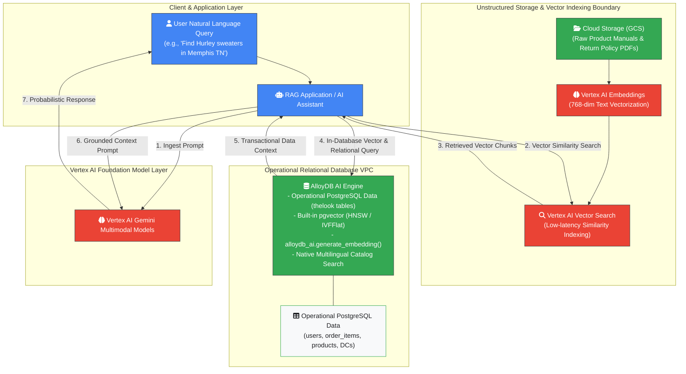
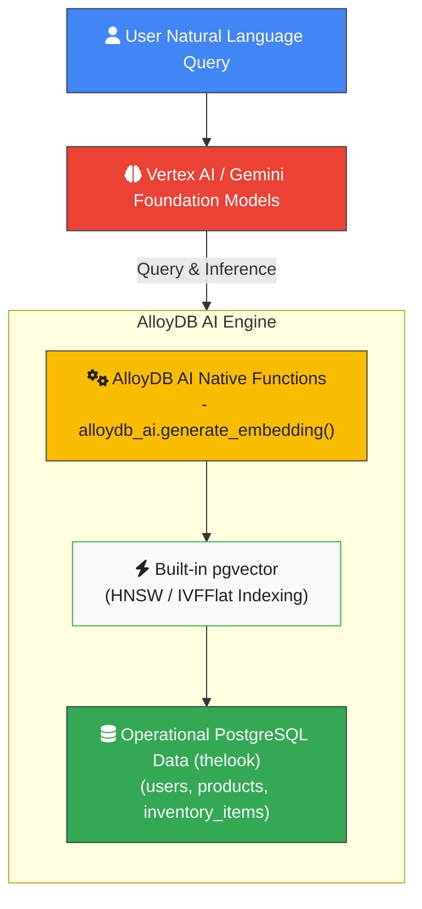
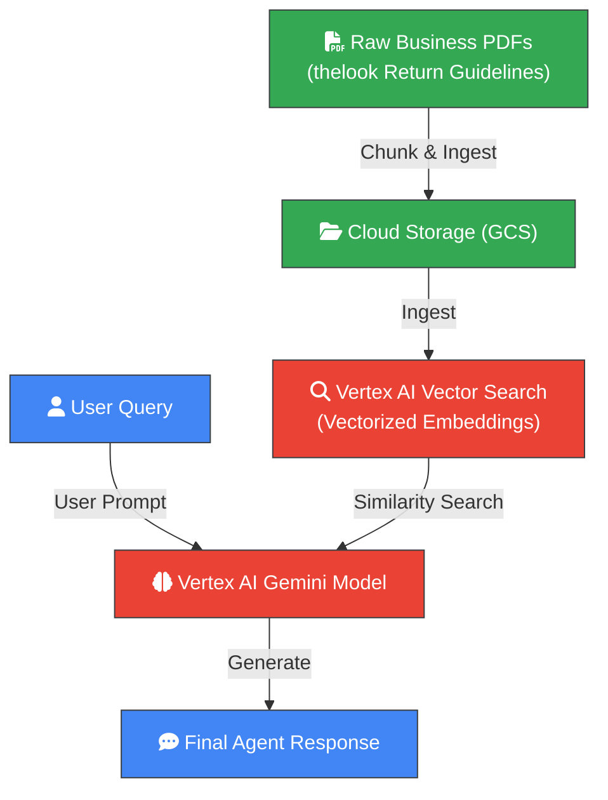
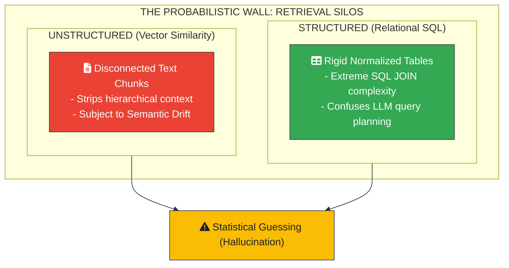

# Phase 1: Breaking the Probabilistic Wall

> _Enterprise Vector RAG, the Peak of Relational AI Databases, and the Limits of
> Probabilistic Retrieval_ **Series:** Beyond the Chatbot: The Enterprise
> Architecture for Systems of Action

## Navigation

- **[Introduction](index.md)**
- **[Phase 1: Breaking the Probabilistic Wall](phase1_breaking_the_probabilistic_wall.md)**
- **[Phase 2: Anchoring Agents in Structured Business Reality](phase2_anchoring_agents_in_structured_business_reality.md)**
- **[Phase 3: Regulator-Grade System of Action](phase3_regulator_grade_system_of_action.md)**

---

## Introduction

The transition from **systems of intelligence** (AI assistants that read and
summarize) to autonomous **systems of action** (agents that execute real-world
business transactions) is the defining challenge of enterprise AI. While
first-generation agent architectures leverage Retrieval-Augmented Generation
(**RAG**) to handle unstructured text, they struggle to reason over complex,
connected relational database schemas.

This white paper establishes the architectural baseline for enterprise RAG using
Google Cloud's public e-commerce reference dataset (**thelook**). We demonstrate
how **AlloyDB AI** represents the peak of relational-AI database capability by
solving traditional PostgreSQL limitations, executing high-performance
in-database embedding generation over `thelook` product catalogs, and
accelerating operational threat detection. However, we also expose the
**"probabilistic wall"**—the fundamental limitation of similarity-based
retrieval and the structural boundaries of Text-to-SQL translation across
normalized tabular schemas. This architectural constraint demonstrates why
enterprises must graduate to graph-grounded architectures to achieve
deterministic, zero-hallucination agentic action.

---

### Phase 1 System & Network Architecture

The diagram below illustrates the component topology, system boundaries, and
data flow of the foundational relational-AI and vector RAG architecture on
Google Cloud:



---

## 1. The Promise and Pitfalls of First-Generation Enterprise Agents

First-generation Generative AI agents rely heavily on standard vector RAG. When
a user submits a query, the application converts the prompt into a vector
embedding, performs a similarity search against a document store, and injects
the retrieved text snippets into the Large Language Model (**LLM**) context
window.

### The Foundational Moat

Standard RAG solves the static knowledge cutoff of foundation models without
requiring model fine-tuning. On Google Cloud, architectures implement this
pattern using **Cloud Storage (GCS)** as the document repository, **Vertex AI
Embeddings** to vectorize text chunks, and **Vertex AI Vector Search** to
provide low-latency, scalable similarity indexes.

### The Emerging Gaps

As enterprise workloads mature from simple informational question-answering to
operational automation (such as validating refund requests, determining
creditworthiness, or navigating multi-tiered contracts), this
unstructured-text-only approach fractures:

- **The Unstructured-Structured Divide:** Corporate return policies reside in
  PDFs, but customer purchase histories, inventory levels, and order statuses
  reside in relational databases like `thelook` (`users`, `orders`,
  `order_items`, `inventory_items`, `products`, and `distribution_centers`).
  Standard RAG has no native mechanism to bridge these data stores in real time.
- **The Relational Hallucination Risk:** Forcing LLMs to write complex SQL
  queries directly over normalized relational tables results in high error
  rates. For example, if an agent processes the following request:

    > _"Find all users (such as Casey Lyons or Kurt Rucker) who bought 'Hurley
    > Men's One and Only Sweater' supplied by distribution center 'Memphis TN'
    > who then initiated returns"_

    The LLM must infer foreign key relationships across five normalized tables
    (`users` $\rightarrow$ `orders` $\rightarrow$ `order_items` $\rightarrow$
    `inventory_items` $\rightarrow$ `products` $\rightarrow$
    `distribution_centers`), leading to hallucinations, invalid joins, and
    failed query executions.

---

## 2. Peak Relational-AI: Grounding Agents in AlloyDB AI

For enterprises standardizing on PostgreSQL, **AlloyDB AI** serves as an
optimized database engine designed to maximize relational-AI performance.

### 2.1 The AlloyDB AI Reference Architecture

The architecture below illustrates how AlloyDB AI unifies PostgreSQL-compatible
transaction processing with native, low-latency machine learning functions
directly inside the database engine:



### 2.2 Overcoming PostgreSQL AI Limitations

Standard PostgreSQL configurations encounter performance degradation when
processing heavy vector workloads and complex text searches over large
operational tables. AlloyDB AI resolves these constraints through native
database capabilities:

1.  **In-Database Embedding Generation:** With built-in AlloyDB AI Functions
    (`alloydb_ai.generate_embedding()`), the database engine generates
    embeddings in-place directly within SQL queries over `thelook.products`
    (`product_name`, `product_brand`, and `product_category`).[^1] This
    eliminates network round-trips to external model endpoints, significantly
    reducing query latency and infrastructure costs.
1.  **Multilingual Full-Text Search Integration:** Standard PostgreSQL struggles
    to scale multilingual full-text search across global product listings.
    AlloyDB AI bridges this gap, allowing enterprises to run fast, semantic
    multilingual searches directly alongside active transactional columns (e.g.,
    matching `"Hurley Sweaters"` or `"Patty Long Sleeve Blouse"`) in a single
    unified index.

---

### 2.3 Implementation Walkthrough: In-Database Embeddings with AlloyDB AI

The following SQL and Data Definition Language (**DDL**) statements demonstrate
how to configure in-database vector indexing on the `thelook.products` table:

```sql
-- Step 1: Enable the pgvector and alloydb_ai extensions
CREATE EXTENSION IF NOT EXISTS vector;
CREATE EXTENSION IF NOT EXISTS alloydb_ai;

-- Step 2: Add a 768-dimensional vector column to the products table
ALTER TABLE products
ADD COLUMN IF NOT EXISTS product_embedding vector(768);

-- Step 3: Populate embeddings in-place using the built-in Vertex AI integration
UPDATE products
SET product_embedding = alloydb_ai.generate_embedding(
    'text-embedding-004',
    name || ' ' || brand || ' ' || category
)
WHERE product_embedding IS NULL;

-- Step 4: Create a Hierarchical Navigable Small World (HNSW) vector index
-- HNSW builds a multi-layer graph index for fast Approximate Nearest Neighbor (ANN) search
CREATE INDEX product_hnsw_cosine_idx
ON products
USING hnsw (product_embedding vector_cosine_ops)
WITH (m = 16, ef_construction = 64);

-- Step 5: Query nearest neighbors using Cosine Distance (<=>)
SELECT
    id,
    name,
    brand,
    category,
    retail_price,
    1 - (product_embedding <=> alloydb_ai.generate_embedding('text-embedding-004', 'warm winter fleece jacket')) AS cosine_similarity
FROM products
ORDER BY product_embedding <=> alloydb_ai.generate_embedding('text-embedding-004', 'warm winter fleece jacket')
LIMIT 5;

```

> [!NOTE]
>
> **Technical Mechanics & Parameter Breakdown**
>
> - **`vector(768)`:** A fixed-length array of 768 floating-point numbers
>   representing the semantic position of the text in high-dimensional vector
>   space.
> - **`vector_cosine_ops` & `<=>`:** The `<=>` operator computes the **Cosine
>   Distance** ($1 - \text{Cosine Similarity}$). A distance of `0.0` represents
>   identical semantic meaning, while `1.0` represents completely unrelated
>   text.
> - **HNSW Parameters (`m = 16`, `ef_construction = 64`):** `m` sets the maximum
>   bidirectional links per node in the index graph (higher values improve
>   recall), while `ef_construction` controls the dynamic candidate list size
>   evaluated during index construction (higher values improve index quality).

---

### 2.4 Real-World Blueprint: Rapid Threat Detection (SOCRadar Case Study)

Because AlloyDB AI executes real-time vector queries alongside high-throughput
relational transactions, it powers security operations and fraud prevention
systems. A prominent enterprise implementation is **SOCRadar**, which combines
AlloyDB AI and Gemini Enterprise to power real-time threat intelligence
pipelines.[^5] By ingesting and vectorizing telemetry logs (`thelook` web event
logs, user session IDs, IP addresses like `70.190.162.208`, and user IDs),
SOCRadar performs instantaneous similarity matching against threat databases
while maintaining strict transactional consistency.

---

## 3. Standard RAG Mechanics on Google Cloud

To understand why relational databases eventually reach architectural limits
during complex reasoning tasks, we evaluate the data flow and mathematical
mechanics of standard vector retrieval on Google Cloud against standardized
retrieval-augmented frameworks:[^2]



### 3.1 Vector Similarity Mathematical Framework

When converting text into embeddings, the embedding model projects semantic
meaning into a 768-dimensional mathematical vector space ($\mathbb{R}^{768}$).
To evaluate relevance, the search engine computes the **Cosine Similarity**
between the query vector $\vec{Q}$ and each stored document chunk vector
$\vec{D}$:

$$
\begin{aligned}
\text{Cosine Sim}(\vec{Q}, \vec{D}) &= \frac{\vec{Q} \cdot \vec{D}}{\|\vec{Q}\|
\|\vec{D}\|} \\
&= \frac{\sum_{i=1}^{768} Q_i D_i}{\sqrt{\sum_{i=1}^{768} Q_i^2}
\sqrt{\sum_{i=1}^{768} D_i^2}}
\end{aligned}
$$

The end-to-end vector pipeline executes four sequential steps:

1.  **Ingest Documents:** Store raw business policy documents, manuals, and
    guidelines in Cloud Storage (GCS).
1.  **Generate Embeddings:** Parse and project text into 768-dimensional
    coordinates using Vertex AI Embeddings.
1.  **Index Coordinates:** Build Approximate Nearest Neighbor (ANN) index graphs
    in Vertex AI Vector Search for sub-millisecond retrieval.
1.  **Augment Context:** Inject top-ranked document chunks into the Gemini
    prompt to construct the grounded context window.

---

## 4. The Probabilistic Wall: Operational Limits of Relational-AI and Vector Retrieval

Despite the high-speed execution of AlloyDB AI and Vertex AI Vector Search, a
purely relational or vector-only architecture reaches an operational ceiling
when handling multi-step reasoning. We define this as the **Probabilistic
Retrieval Wall**.



### 4.1 The Three Structural Failures of Standard RAG

#### 1. Context Fragmentation and Severed Hierarchies

Standard vector databases segment documents based on token counts (e.g., 500
tokens) or arbitrary page breaks. As demonstrated in foundational GraphRAG
research, vector embeddings only capture localized semantic proximity and cannot
synthesize holistic or multi-hop cross-document relationships.[^3] When a return
policy depends on preconditions stated multiple pages earlier (such as
wardrobing restrictions on formal apparel) or in separate addenda, vector search
retrieves isolated fragments. The structural hierarchy connecting rules to their
conditional constraints is lost, causing semantic drift and erroneous agent
decisions.

#### 2. The Text-to-SQL Relational JOIN Bottleneck

When an agent queries connected, multi-hop operational data across `thelook`
relational schema, standard SQL requires deep nested JOINs across `users`,
`orders`, `order_items`, `inventory_items`, `products`, and
`distribution_centers`.

To answer: _"Find all users who bought 'Hurley Men's One and Only Sweater'
supplied by distribution center 'Memphis TN' who then initiated returns:"_, the
agent must construct a six-table join:

```sql
-- Relational Text-to-SQL Multi-Table JOIN
SELECT
    u.id AS user_id,
    u.first_name,
    u.last_name,
    p.name AS product_name,
    dc.name AS distribution_center_name,
    oi.status AS order_item_status,
    oi.created_at AS purchase_date
FROM users u
JOIN orders o ON u.id = o.user_id
JOIN order_items oi ON o.order_id = oi.order_id
JOIN inventory_items ii ON oi.inventory_item_id = ii.id
JOIN products p ON ii.product_id = p.id
JOIN distribution_centers dc ON p.distribution_center_id = dc.id
WHERE p.name ILIKE '%Hurley%Sweater%'
  AND dc.name = 'Memphis TN'
  AND oi.status = 'Returned';

```

> [!WARNING]
>
> **Why LLMs Consistently Fail at Complex Text-to-SQL**
>
> 1.  **Bridge Table Amnesia:** LLMs frequently attempt to join `orders`
>     directly to `products`, omitting intermediate junction tables like
>     `order_items` and `inventory_items`.
> 1.  **Foreign Key Inversion:** LLMs often invert join directions (e.g.,
>     generating `ON u.id = oi.user_id` when `order_items` only contains
>     `order_id`).
> 1.  **Ambiguous Enumerations:** Business terms like "returned" may map to
>     `'Returned'`, `'Return'`, `'refunded'`, or numeric codes (`4`). Without an
>     active semantic layer, the model guesses.
> 1.  **Cartesian Product Explosions:** Omitting a single `ON` join condition
>     triggers an unindexed Cartesian product ($O(N \times M)$) that saturates
>     database memory and locks production threads.

#### 3. Absence of Governed Business Semantics

Relational databases contain physical schemas but lack business semantic
definitions. If a user asks for "VIP Customers" in `thelook`, an ungrounded LLM
agent has no centralized business glossary to resolve the definition:

- Sales defines a VIP customer as `lifetime_revenue >= 1000`.
- Marketing defines a VIP customer as `orders_in_last_30_days >= 3`.
- Customer Support defines a VIP customer as `loyalty_tier = 'Gold'`.

Without a unified semantic contract, the agent generates arbitrary SQL filters
based on prompt phrasing. A production System of Action requires a deterministic
semantic contract that translates "VIP Customer" into a verified, executable
formula (`user_order_facts.lifetime_revenue >= 500`).

---

### 4.2 Architectural Checklist: 4 Signs You Have Hit the "Probabilistic Wall"

If an engineering team encounters any of the following symptoms, the
architecture has exceeded standard vector RAG capabilities and requires graph
grounding:

1.  **Flaky Agent SQL:** The model generates executable SQL for simple
    single-table queries, but fails with syntax errors or incorrect join
    conditions when queries span three or more tables.
1.  **Context Window Saturation:** Inserting complete Data Definition Language
    (**DDL**) schemas (50+ tables) into LLM system prompts exhausts token
    budgets and degrades reasoning accuracy.
1.  **Inauditable Decision Logic:** When an agent denies a refund or authorizes
    a high-risk transaction, engineers cannot audit or explain which specific
    policy clause or SQL record triggered the decision.
1.  **Semantic Metric Drift:** Users receive contradictory answers for identical
    business metrics (such as disparate "total revenue" figures) due to minor
    variations in prompt phrasing.

---

## 5. Architectural Comparison Matrix

The table below contrasts the technical limitations of peak relational and
vector approaches against the deterministic graph-grounded solutions introduced
in subsequent phases, mapped across empirical GraphRAG benchmark dimensions:[^4]

| Architectural Dimension | Phase 1: Relational & Vector Peak (AlloyDB AI + Standard RAG)   | Phase 2 & 3: Deterministic Graph Grounding (Spanner Graph & Active Catalog)                |
| :---------------------- | :-------------------------------------------------------------- | :----------------------------------------------------------------------------------------- |
| **Data Model**          | Tabular Rows & Columns / Isolated Vector Chunks                 | Connected Property Graphs (Nodes & Edges)                                                  |
| **Retrieval Method**    | Probabilistic Vector Similarity Matching                        | Deterministic Structural Traversal (Graph Query Language / **GQL** Match)                  |
| **Multi-Hop Reasoning** | Nested multi-table relational SQL JOINs                         | Native GQL Path Traversals (`-[:places]->`)                                                |
| **Factual Accuracy**    | **Variable**; subject to schema hallucination and drift         | **100% Deterministic**; grounded in semantic business contracts                            |
| **Policy Ingestion**    | Plain text snippet retrieval; cannot evaluate conditional rules | Materializes text policies into structured graph triples via customer U2G pipeline pattern |
| **Auditability**        | Opaque; logs raw prompt strings and cosine distance scores      | Transparent; writes full decision lineages to Context Graphs                               |

> [!NOTE]
>
> **Managed Infrastructure vs. Customer Architecture Patterns**
>
> In this architecture series, **Cloud Spanner Graph**, **BigQuery Graph**,
> **AlloyDB AI**, **Document AI Layout Parser**, and **Vertex AI Gemini** are
> managed Google Cloud products. In contrast, **Unstructured-to-Graph (U2G)** is
> a customer-implemented reference architecture pattern (orchestrated via Cloud
> Run, Cloud Functions, or Dataflow) that uses Document AI and Gemini to compile
> unstructured document rules into native Spanner Graph schemas.

---

## Conclusion and Next Phases

AlloyDB AI delivers maximum performance within relational architectures,
providing high-throughput transactional execution and in-database vector
indexing over `thelook` operational data. However, when an enterprise AI
architecture transitions from informational reading to **autonomous action**,
the probabilistic limitations of vector similarity and the join complexity of
relational schemas introduce critical operational risks.

To achieve regulator-grade safety, explainability, and multi-hop precision,
systems must transition to relationship-centric data modeling.

**Next Step:** In
**[Phase 2: Anchoring Agents in Structured Business Reality](phase2_anchoring_agents_in_structured_business_reality.md)**,
we demonstrate how to break through the probabilistic wall. We introduce Google
Cloud's **Relational-to-Graph (R2G)** architecture, deploying **Cloud Spanner
Graph** to define logical property graphs over existing `thelook` databases, and
utilizing **Knowledge Catalog (formerly Dataplex)** to build an Active
Semantic Layer that guarantees 100% precision in conversational database
queries.

---

_Document Reference: Beyond the Chatbot: The Enterprise Architecture for Systems
of Action — Google Cloud._

[^1]:
    Tabatha Lewis-Simo and Alan Li, "AlloyDB accelerates AI with automated
    vector indexing and embedding," _Google Cloud Blog_, November 8, 2025.
    [Online]. Available:
    https://cloud.google.com/blog/products/databases/alloydb-ai-auto-vector-embeddings-and-auto-vector-index

[^2]:
    H. Han et al., "Retrieval-Augmented Generation with Graphs (GraphRAG),"
    _arXiv preprint arXiv:2501.00309_, 2025. [Online]. Available:
    https://arxiv.org/abs/2501.00309

[^3]:
    D. Edge et al., "From Local to Global: A Graph RAG Approach to Query-Focused
    Summarization," _arXiv preprint arXiv:2404.16130_, 2024. [Online].
    Available: https://arxiv.org/abs/2404.16130

[^4]:
    B. Peng et al., "Graph Retrieval-Augmented Generation: A Survey," _arXiv
    preprint arXiv:2408.08921_, 2024. [Online]. Available:
    https://arxiv.org/abs/2408.08921

[^5]:
    Ahmet Kuruköse and Sailesh Krishnamurthy, "SOCRadar powers rapid threat
    detection with AlloyDB and Gemini Enterprise," _Google Cloud Blog_, July 2,
    2026. [Online]. Available:
    https://cloud.google.com/blog/products/databases/socradar-powers-rapid-threat-detection-with-alloydb-and-gemini-enterprise
