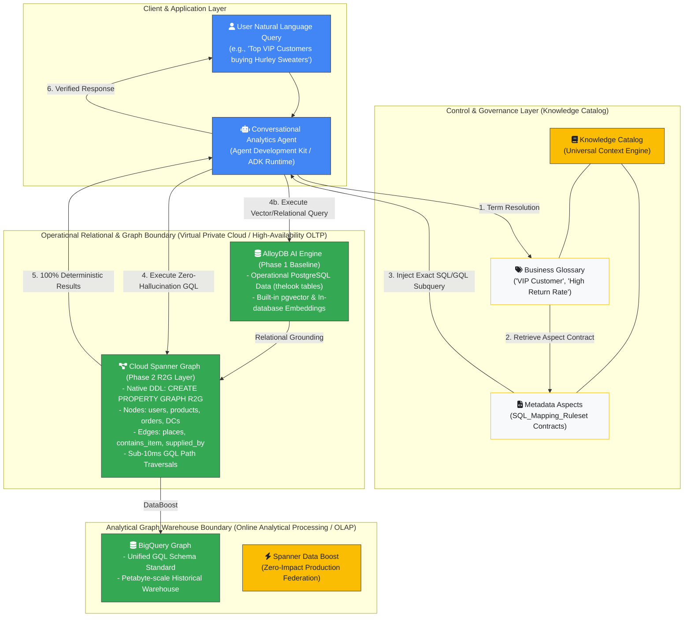
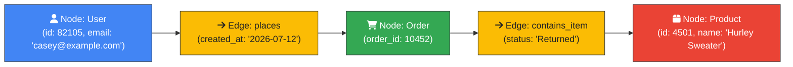
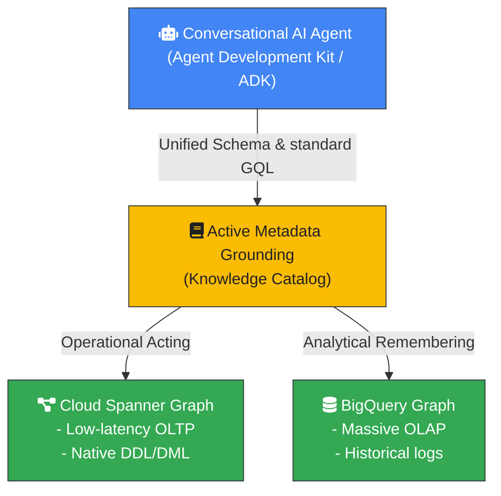
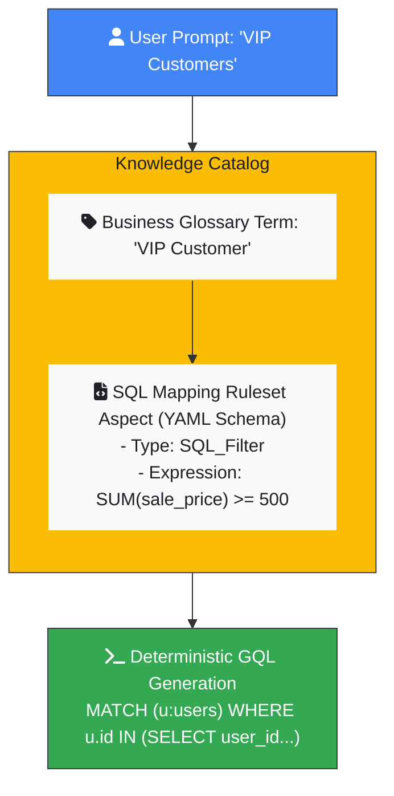
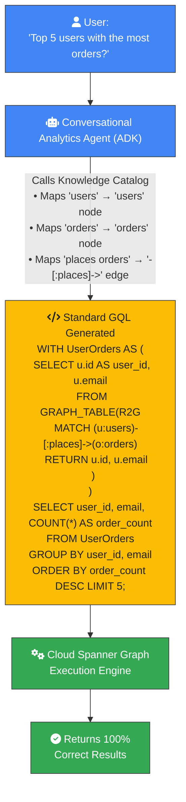

# Phase 2: Anchoring Agents in Structured Business Reality

> _Mapping Relational Data to Property Graphs with Active Cataloging_
> **Series:** Beyond the Chatbot: The Enterprise Architecture for Systems of
> Action

## Navigation

- **[Introduction](index.md)**
- **[Phase 1: Breaking the Probabilistic
  Wall](phase1_breaking_the_probabilistic_wall.md)**
- **[Phase 2: Anchoring Agents in Structured Business
  Reality](phase2_anchoring_agents_in_structured_business_reality.md)**
- **[Phase 3: Regulator-Grade System of
  Action](phase3_regulator_grade_system_of_action.md)**

---

## Introduction

In
[Phase 1: Breaking the Probabilistic
Wall](phase1_breaking_the_probabilistic_wall.md),
we exposed the **"probabilistic wall"**—the inherent reasoning limits of
standard vector Retrieval-Augmented Generation (**RAG**) and the fragility of
raw natural language-to-SQL translation over relational schemas. While
state-of-the-art PostgreSQL systems like **AlloyDB AI** push transactional
vector workloads to their absolute peak, an autonomous AI agent cannot reliably
execute multi-step transactions when forced to guess relational schemas, foreign
keys, or complex join patterns. To transition from simple systems of
intelligence to trusted, autonomous **systems of action**, enterprises must
ground their agents in a deterministic model of business reality.

This white paper outlines **Phase 2** of the Google Cloud Agentic Data Cloud
journey: the **Relational-to-Graph (R2G)** and **Active Metadata Grounding
Layer**. We detail how organizations can model their structured operational
databases as rich property graphs natively using **Cloud Spanner Graph** and
**BigQuery Graph**. Crucially, we demonstrate how to evolve static data catalogs
into an **Active Knowledge Catalog (formerly Dataplex)**. By establishing a
unified **Business Glossary** and defining semantic schema contracts via custom
**Metadata Aspects**, we ensure 100% precision in translating conversational
intent to database actions, eliminating hallucination risks entirely.

---

### Phase 2 System & Network Architecture

The diagram below outlines the component topology, network boundaries, and data
flow sequence for Relational-to-Graph (R2G) mapping and Knowledge Catalog
Active Catalog grounding:



---

## 1. The Paradigm Shift: Relationships as First-Class Citizens

Enterprise data architectures have historically normalized operational data
across hundreds of disconnected, rigid relational tables. For classical
applications, executing multi-layered operations requires writing long, complex
SQL queries filled with nested `JOIN` clauses. For AI agents, however,
multi-table relational sprawl creates schema complexity that degrades agent
query planning.

### 1.1 The Relational Join Bottleneck ($O(N \times M)$ Computational Overhead)

When an LLM attempts to generate SQL queries over raw normalized tables, the
wide search space of possible table combinations, ambiguous foreign keys, and
missing semantic context substantially degrades query accuracy. If a user asks a
multi-hop relational question:

> _"Find all users who bought items supplied by a specific distribution center
> who then initiated refunds"_

The LLM must infer foreign key connections across normalized tables (`users`,
`orders`, `order_items`, `products`, and `distribution_centers`) without
verified semantic context. If the database engine evaluates this in relational
algebra, it must compute Cartesian products and nested loop joins across
millions of rows, consuming substantial CPU and memory resources.

### 1.2 Architectural Primer: Property Graph Fundamentals

To eliminate join complexity, we transform tabular databases into a **Property
Graph**, following the formal Enterprise Knowledge Graph (EKG) engineering
methodology:[^3]



- **Node (Vertex):** Represents an entity or object (e.g., a specific Customer,
  Order, or Product). Equivalent to a row in a database table.
- **Edge (Relationship / Directed Link):** Represents a connection between two
  nodes (e.g., `places`, `contains_item`, and `supplied_by`). In a graph
  database, edges are **first-class citizens** physically stored as direct
  pointers connecting nodes.
- **Properties (Attributes):** Key-value pairs stored directly on nodes _or_
  edges (e.g., `user.city = 'Chicago'`, `places.timestamp = '2026-07-12'`).
- **Labels (Types):** Categories assigned to nodes and edges to filter them
  during queries (e.g., `:users`, `:orders`, and `:places`).

> [!TIP]
>
> **Why GQL Traversal is $O(1)$ per Hop**
>
> In traditional SQL, finding an order's products requires scanning the
> `order_items` table index. In a Property Graph, each `Order` node holds direct
> memory/storage pointers to its connected `Product` nodes. Moving across an
> edge is a simple pointer dereference ($O(1)$), allowing 4-hop queries to
> execute in milliseconds regardless of table size.

---

## 2. Google Cloud's Unified Graph Solution

Google Cloud offers a unified graph database and analytics platform spanning
**Online Transaction Processing (OLTP)** workloads on **Cloud Spanner Graph**
and **Online Analytical Processing (OLAP)** data warehousing on **BigQuery
Graph**.



### 2.1 Spanner Graph: Native Operational Property Graphs

**Cloud Spanner Graph**[^1] unifies relational, graph, vector search, and
full-text search capabilities into a single globally distributed, strongly
consistent database engine. Developers can define an operational property graph
directly over existing relational tables without replicating data or creating
complex Extract, Transform, Load (**ETL**) pipelines.

By running Spanner Graph, organizations can execute deep, multi-hop traversals
(up to 3-4 hops) in **less than 10ms (with P50 latencies averaging ~4ms)**,
scaling horizontally to meet global operational demands.

#### Real-World Case Study: Palo Alto Networks (Unified Single Schema)

Cybersecurity leader **Palo Alto Networks** adopted Cloud Spanner Graph to
eliminate data silos between their relational threat logs and graph-based attack
paths.[^5] By creating a unified schema on Spanner Graph, they achieved:

- Real-time malware propagation tracing across millions of network endpoints in
  milliseconds.
- Zero data shuttling between separate relational and dedicated graph databases.
- Sub-second incident response times for live cybersecurity threats.

#### Real-World Case Study: Fastweb & Vodafone Italy Merger (Customer 360)

During the major telecom merger between Fastweb and Vodafone Italy, engineering
teams faced disparate billing systems, legacy CRM schemas, and conflicting
subscriber definitions.[^6] By deploying **Spanner Graph + BigQuery + Gemini**,
they mapped legacy data equivalences into a unified Customer 360 property graph,
resolving disparate subscriber records across systems without requiring legacy
database refactoring.

---

### 2.2 TheLook R2G Schema Implementation (DDL)

The following native Spanner GQL Data Definition Language (**DDL**) statement
maps a relational e-commerce schema into an operational property graph:

```sql
CREATE PROPERTY GRAPH R2G
  NODE TABLES (
    users,
    products,
    orders,
    distribution_centers,
    inventory_items,
    events
  )
  EDGE TABLES (
    -- User creates an order
    orders AS places
      SOURCE KEY (user_id) REFERENCES users
      DESTINATION KEY (order_id) REFERENCES orders,

    -- Order contains specific inventory item
    order_items AS contains_item
      SOURCE KEY (order_id) REFERENCES orders
      DESTINATION KEY (inventory_item_id) REFERENCES inventory_items,

    -- Inventory item belongs to a product catalog
    inventory_items AS is_product
      SOURCE KEY (id) REFERENCES inventory_items
      DESTINATION KEY (product_id) REFERENCES products,

    -- Inventory item is stored in a warehouse
    inventory_items AS stocked_at
      SOURCE KEY (id) REFERENCES inventory_items
      DESTINATION KEY (product_distribution_center_id) REFERENCES distribution_centers,

    -- Product is supplied by a specific distribution center
    products AS supplied_by
      SOURCE KEY (id) REFERENCES products
      DESTINATION KEY (distribution_center_id) REFERENCES distribution_centers,

    -- User performs web/app activities
    events AS performed_event
      SOURCE KEY (user_id) REFERENCES users
      DESTINATION KEY (id) REFERENCES events
  );

```

> [!NOTE]
>
> **Schema & DDL Technical Breakdown**
>
> - **`NODE TABLES (users, products, ...)`:** Informs Spanner Graph that rows in
>   these tables represent graph nodes. Primary keys automatically serve as
>   unique node identifiers.
> - **`EDGE TABLES (orders AS places ...)`:** Defines a directed relationship.
>   The `SOURCE KEY` specifies where the edge starts (`users.id`), and
>   `DESTINATION KEY` specifies where it ends (`orders.order_id`).
> - **No Data Duplication:** Spanner Graph does not copy table data; it creates
>   a logical graph view over the underlying relational storage engine.

---

### 2.3 BigQuery Graph: Analytical Graph Warehouse

For exploring relationships across petabytes of historical datasets, **BigQuery
Graph** brings standard Graph Query Language (**GQL**) capabilities directly
into the data warehouse without moving data. Because both Spanner Graph and
BigQuery Graph share the **exact same GQL syntax and unified schema standard**,
context-switching costs are eliminated, and query structures port cleanly from
transactional engines to analytics.

---

### 2.4 Federated Queries with Spanner Data Boost

With **Spanner Data Boost**, BigQuery Graph executes analytical traversals over
operational databases on dedicated, isolated compute resources with **near-zero
impact on live production traffic**. Below is the DDL configuration for
federating real-time Spanner nodes with historical BigQuery edges:

```sql
-- 1. Create external schema linking BigQuery to Cloud Spanner
CREATE EXTERNAL SCHEMA spanner
OPTIONS (
  external_source = 'google-cloudspanner:/projects/PROJECT_ID/instances/INSTANCE/databases/DATABASE',
  location = 'LOCATION'
);

-- 2. Define a federated Property Graph over Spanner and BigQuery tables
CREATE OR REPLACE PROPERTY GRAPH bigquery.FinGraph
  NODE TABLES (
    spanner.Account KEY (account_id),
    spanner.Person KEY (person_id),
    bigquery.Media KEY (media_id)
  )
  EDGE TABLES (
    spanner.Transfers AS Transfers
      KEY (transfer_id)
      SOURCE KEY(account_id) REFERENCES Account
      DESTINATION KEY(target_account_id) REFERENCES Account,
    bigquery.LogIn AS LogIn
      KEY (login_id)
      SOURCE KEY(media_id) REFERENCES Media
      DESTINATION KEY(account_id) REFERENCES Account
  );

```

---

## 3. Knowledge Catalog: The Active Semantic Layer

A high-performance graph database alone is not sufficient to prevent agent
hallucinations. AI agents require **business context**. They need to understand
what technical columns represent and how corporate metrics are calculated.

Google Cloud solves this through **Knowledge Catalog**,[^2] which
functions as an **"Active" universal context engine** for grounding AI agents.



### 3.1 Constructing the Business Glossary

Rather than forcing agents to guess column names, Knowledge Catalog houses a
standardized **Business Glossary** of categories and terms. Synonyms,
abbreviations, and related terms (e.g., mapping `"VIP"`, `"Preferred Customer"`,
`"High-Value Account"`, and `"Top Tier Member"` to the same canonical
definition) are centrally registered.

### 3.2 Metadata Aspects: String Contracts for Deterministic Filtering

Knowledge Catalog introduces **Aspects**—reusable metadata schema templates that
attach custom attributes, ownership structures, and strict execution logic
directly to catalog entries.

To prevent Text-to-SQL hallucination, we design a custom **SQL Mapping Ruleset
Aspect**. This aspect defines the exact mathematical calculation for a business
term as a "String Contract":

- **Aspect Type:** `SQL_Mapping_Ruleset`
- **Field:** `SQL_Filter`
- **Logical Condition:**

    ```sql
    id IN (
      SELECT user_id
      FROM thelook_ecommerce.order_items
      GROUP BY user_id
      HAVING SUM(sale_price) >= 500 OR COUNT(DISTINCT order_id) >= 5
    )
    ```

- **Associated Table:** `thelook_ecommerce.users`

When a user asks: _"How many VIP Customers made purchases last month?"_, the
agent:

1.  Detects `"VIP Customers"` (or synonyms) in the user's natural language.
1.  Resolves the term in the **Business Glossary** to its canonical record.
1.  Retrieves the attached **SQL Mapping Ruleset Aspect**.
1.  Dynamically injects the _exact pre-validated SQL subquery block_ into the
   query plan.

This ensures that the calculation for "VIP Customer" is executed with **100%
deterministic precision**, avoiding typical LLM guessing errors. Grounding agent
reasoning in explicit constraint contracts aligns with the
Constraint-Satisfaction GraphRAG (CS-RAG) framework, which proves that ordering
queries into verifiable relational constraints prevents retrieval drift and path
hallucinations across enterprise graphs.[^4] If the glossary or aspects are
missing, the agent safely returns a request for clarification rather than
hallucinating a false formula.

---

## 4. Zero-Hallucination Query Translation: Step-by-Step Flow

To appreciate the power of the R2G and Active Metadata Grounding layer, we trace
a complete natural language request to execution:



### 4.1 ISO GQL Syntax & Query Reference

ISO Graph Query Language (**GQL**) is the international standard for querying
property graphs. Unlike SQL, which describes tabular sets and joins, GQL
describes **visual paths**:

| GQL Pattern               | Meaning                                             | SQL Equivalent                                |
| :------------------------ | :-------------------------------------------------- | :-------------------------------------------- |
| `(u:users)`               | Match any node with label `users`, alias as `u`     | `FROM users u`                                |
| `-[:places]->`            | Traverse an outgoing directed edge labeled `places` | `JOIN orders o ON u.id = o.user_id`           |
| `<-[:stocked_at]-`        | Traverse an incoming directed edge                  | `JOIN inventory_items ii ON dc.id = ii.dc_id` |
| `(u)-[:places]->(o)`      | Match a user connected to an order                  | `users JOIN orders ON ...`                    |
| `WHERE u.country = 'USA'` | Filter node properties                              | `WHERE u.country = 'USA'`                     |
| `RETURN u.email, o.id`    | Project node/edge properties                        | `SELECT u.email, o.id`                        |

---

### 4.2 Side-by-Side Comparison: Relational SQL vs. Spanner GQL

To evaluate why GQL reduces LLM code generation errors, compare how both
languages answer the five-table e-commerce query:

> _"Find all users who bought 'Hurley Sweaters' supplied by distribution center
> 'Memphis TN' who then initiated returns:"_

```sql
-- Relational SQL (14 lines, multi-table nested JOINs)
SELECT u.id, u.first_name, u.last_name, p.name, oi.status
FROM users u
JOIN orders o ON u.id = o.user_id
JOIN order_items oi ON o.order_id = oi.order_id
JOIN inventory_items ii ON oi.inventory_item_id = ii.id
JOIN products p ON ii.product_id = p.id
JOIN distribution_centers dc ON p.distribution_center_id = dc.id
WHERE p.name ILIKE '%Hurley%Sweater%'
  AND dc.name = 'Memphis TN'
  AND oi.status = 'Returned';

-- Spanner ISO GQL (6 lines, intuitive visual path matching)
SELECT * FROM GRAPH_TABLE(R2G
  MATCH (u:users)-[:places]->(o:orders)-[:contains_item]->(ii:inventory_items)-[:is_product]->(p:products)-[:supplied_by]->(dc:distribution_centers)
  WHERE p.name LIKE '%Hurley%Sweater%'
    AND dc.name = 'Memphis TN'
    AND ii.status = 'Returned'
  RETURN u.id, u.first_name, u.last_name, p.name, ii.status
);

```

> [!TIP]
>
> **Why GQL Outperforms SQL for LLM Code Generation**
>
> 1.  **Visual Path Syntax:** The GQL path
> `(u)-[:places]->(o)-[:contains_item]->(ii)` mirrors intuitive natural
> language descriptions of relationships.
> 1.  **Zero Join Key Guessing:** The LLM does not need to deduce whether the
> foreign key column is `user_id`, `id_user`, or `customer_fk`. The edge
> `places` encapsulates the relational join logic automatically.
> 1.  **Significant Error Reduction:** Because schema topology is explicitly
> declared in DDL, LLM-generated GQL syntax error rates drop significantly
> compared to multi-table relational SQL.

---

### 4.3 Concrete GQL Query Example: Multi-Hop Retrieval in Spanner

Using standard GQL within Cloud Spanner, multi-hop traversals execute inside
standard SQL statements using the `GRAPH_TABLE` operator:

```sql
-- GQL query to trace 3-hop relationships: User -> Order -> InventoryItem
SELECT * FROM GRAPH_TABLE(R2G
  MATCH (u:users {id: 82105})-[:places]->(o:orders)-[:contains_item]->(ii:inventory_items)
  RETURN u.first_name, o.created_at, ii.product_name
);

```

---

## 5. Architectural Gaps Remaining (The Need for Phase 3)

While the R2G Active Grounding architecture provides a deterministic framework
for structured tables, it leaves three key operational gaps that require the
capabilities of **Phase 3**:

1.  **Unstructured Document Ingestion:** R2G only maps data already organized in
    relational tables. It cannot parse complex conditional rules or regulatory
    clauses embedded in unstructured PDF policy manuals.
1.  **Decision Trace Lineage:** The architecture lacks an immutable context
    graph to record why multi-step agent decisions were made or which
    intermediate constraints were evaluated.
1.  **Proactive Graph Mining:** The system relies on reactive query execution
    and cannot natively compute parallel graph algorithms (such as PageRank,
    centrality metrics, and community clustering) to detect fraud rings or
    supply chain bottlenecks.

To resolve these challenges, organizations must progress to **Phase 3: The
Complete Semantic Ontology & Dual-Graph Architecture**.

---

## Conclusion

By mapping relational tables to property graphs with **Spanner Graph** and
**BigQuery Graph**, and anchoring those schemas within **Knowledge Catalog**,
enterprises establish a zero-hallucination structured grounding layer. The
Agentic Data Cloud turns database tables into a deterministic semantic fabric,
giving AI agents the context and precision required for autonomous execution.

**Next Step:** In
**[Phase 3: Regulator-Grade System of
Action](phase3_regulator_grade_system_of_action.md)**,
we conclude the reference architecture series by introducing
**Unstructured-to-Graph (U2G)** parsing via Document AI Layout Parser, deploying
a **Dual-Graph architecture** for auditable trace lineage, and running native
parallel graph mining algorithms to achieve Google-grade intelligence.

---

_Document Reference: Beyond the Chatbot: The Enterprise Architecture for Systems
of Action — Google Cloud._

[^1]:
    Bei Li and Vahab Mirrokni, "Announcing Spanner Graph algorithms:
    Google-grade intelligence for connected data," _Google Cloud Blog_, June
    2, 2026. [Online]. Available:
    https://cloud.google.com/blog/products/databases/introducing-spanner-graph-algorithms

[^2]:
    Chai Pydimukkala and Sam McVeety, "Introducing the Google Cloud Knowledge
    Catalog," _Google Cloud Blog_, April 22, 2026. [Online]. Available:
    https://cloud.google.com/blog/products/data-analytics/introducing-the-google-cloud-knowledge-catalog

[^3]:
    "An LLM-Aided Enterprise Knowledge Graph (EKG) Engineering Process," in
    _AAAI Spring Symposium Series_, vol. 3, no. 1, 2024. [Online]. Available:
    https://ojs.aaai.org/index.php/AAAI-SS/article/view/31194

[^4]:
    "Toward Robust GraphRAG: Mitigating Retrieval Drift and Hallucination from
    Imperfect Knowledge Graphs," _arXiv preprint arXiv:2603.14828_, 2026.
    [Online]. Available: https://arxiv.org/abs/2603.14828

[^5]:
    Sailesh Krishnamurthy and Vaibhav Govil, "The power of multi-model Spanner
    for the agentic era," _Google Cloud Blog_, June 30, 2026. [Online].
    Available:
    https://cloud.google.com/blog/products/databases/the-power-of-multi-model-spanner-for-the-agentic-era

[^6]:
    Vincenzo Forciniti, "How Fastweb + Vodafone reimagined data workflows with
    Spanner & BigQuery," _Google Cloud Blog_, January 23, 2026. [Online].
    Available:
    https://cloud.google.com/blog/products/databases/how-fastweb-vodafone-reimagined-data-workflows-with-spanner-bigquery
