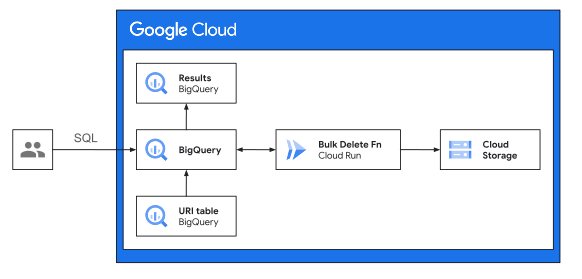

# Bulk delete Cloud Storage objects using BigQuery remote functions

A common way to remove objects from Cloud Storage is to use
[object lifecycle management](https://cloud.google.com/storage/docs/lifecycle),
which allows Time to live (TTL) driven automatic changes, like moving objects
storage class and delete objects.

When your Cloud Storage bucket does not have life-cycle management enabled, you
can use the [`gsutil`](https://cloud.google.com/storage/docs/gsutil/commands/rm)
command.

A limitation of this approach is the complexity that arises when you need to
delete a very large number of files:

- You might need to spread the operation across multiple machines
- You might need to retry on failures

In cases when there are hundreds of thousands or more objects to delete, if you
have the list of URIs (or some logic) to remove in a database, BigQuery remote
functions provide an easy mechanism to scale out the operation through
micro-batching, with resilience and retries.

This article shows you how to deploy a BigQuery remote function that
bulk-deletes objects and gives the option to stores the results in a table.

## Google Cloud services

Brief introduction to a few of the Google Cloud services that are referenced
here:

- [Cloud Storage](https://cloud.google.com/storage) is a managed service for
  Object storage that can be used for storing unstructured data.
- [BigQuery](https://cloud.google.com/bigquery) is a fully managed, data
  analytics platform that enables multi-engine, multi-format SQL driven data
  processing. BigQuery supports
  [remote functions](https://cloud.google.com/bigquery/docs/remote-functions)
  that allow writing a user-defined processing logic as Cloud Run or Cloud
  Function services.
- [Cloud Run](https://cloud.google.com/run)

## Architecture

A Cloud Run service runs a [Spring boot](https://spring.io/projects/spring-boot)
application that receives a list of object URIs to be deleted as an HTTP request
body. The application splits the list into
[supported batch sized](https://cloud.google.com/storage/docs/batch#overview)
sub-lists and makes batch calls to Cloud Storage API to delete the objects. The
status of the deletion request for each URI from the Storage API is then relayed
back as the HTTP response.

BigQuery invokes The Cloud Run application as a remote function with a list of
URIs by reading an existing table or through other SQL-based logic. The
responses are shown on screen or can be stored to a result table if required.
BigQuery handles the job of splitting the original list into smaller batches
before calling the remote functions and stitches the responses back.



## Objectives

- Deploy the Bulk delete remote function to Cloud Run
- Run a Demo SQL query in BigQuery to delete a small list of object URIs from
  Cloud Storage
- Verify that the files are deleted from the Cloud Storage bucket.

## Costs

This tutorial uses billable components of Google Cloud, including the following:

- [Cloud Build](https://cloud.google.com/build/pricing)
- [BigQuery](https://cloud.google.com/bigquery/pricing)
- [Cloud Storage](https://cloud.google.com/storage/pricing)
- [Cloud Run](https://cloud.google.com/run/pricing)

Use the [pricing calculator](https://cloud.google.com/products/calculator) to
generate a cost estimate based on your projected usage.

## Before you begin

For this tutorial, you need a Google Cloud
[project](https://cloud.google.com/resource-manager/docs/cloud-platform-resource-hierarchy#projects).
To make cleanup easiest at the end of the tutorial, we recommend that you create
a new project for this tutorial.

1.  [Create a Google Cloud project](https://console.cloud.google.com/projectselector2/home/dashboard)
1.  Make sure that
    [billing is enabled](https://support.google.com/cloud/answer/6293499#enable-billing)
    for your Google Cloud project
1.  [Open Cloud Shell](https://console.cloud.google.com/?cloudshell=true) At the
    bottom of the Cloud Console, a
    [Cloud Shell](https://cloud.google.com/shell/docs/features) session opens
    and displays a command-line prompt. Cloud Shell is a shell environment with
    the Cloud SDK already installed, including the
    [gcloud](https://cloud.google.com/sdk/gcloud/) command-line tool, and with
    values already set for your current project. It can take a few seconds for
    the session to initialize.

1.  In Cloud Shell, clone the source repository and go to the directory for this
    tutorial:

    ```bash
    git clone https://github.com/GoogleCloudPlatform/cloud-solutions.git
    cd cloud-solutions/projects/bulk-delete-gcs-files-fn
    ```

1.  Enable the required APIs for the services required for this tutorial:

    ```bash
    gcloud services enable \
      artifactregistry.googleapis.com \
      bigquery.googleapis.com \
      bigqueryconnection.googleapis.com \
      cloudbuild.googleapis.com \
      run.googleapis.com
    ```

## Deploy the remote function

1.  Authenticate using User
    [Application Default Credentials (ADC)](https://cloud.google.com/sdk/gcloud/reference/auth/application-default).

    ```bash
    gcloud auth application-default login
    ```

1.  Edit the `project_id` and other fields in `example.tfvars` file using a text
    editor of your choice.

1.  Run the Terraform script to create all resources:

    The Terraform script creates:

    - A BigQuery remote function that accepts a list of Cloud Storage Object
      URIs to delete. You can call the remote function as follows:
    - Cloud Run service that hosts the remote function
    - Cloud Storage bucket with a single file named `file1`

    ```bash
    terraform init && terraform apply -var-file="example.tfvars"
    ```

## Use the remote function from BigQuery

Open BigQuery console and issue following SQL command:

```sql
WITH
  filenames AS (
    SELECT filename
    FROM
    (SELECT 'file1' AS filename)
    UNION ALL (SELECT 'file2' AS filename)
  )
  SELECT
    filename,
    `fns_del`.gcs_del('gs://<project-id>-bulk-delete-test/' + filename) AS delete_status
  FROM
    filenames
```

The command should produce following output:

| filename | delete_status |
| -------- | ------------- |
| file1    | Completed     |
| file2    | Not Found     |

## Troubleshooting

If you are seeing many errors with message like: **Unauthorized**, ensure that
the Service Account used by the delete function's Cloud Run service has
appropriate IAM permissions to the GCS buckets to be used through the BigQuery
function.

## Cleaning up

**Caution:** Deleting a project has the following effects:

- Everything in the project is deleted. If you used an existing project for this
  tutorial, when you delete it, you also delete any other work you've done in
  the project.
- Custom project IDs are lost. When you created this project, you might have
  created a custom project ID that you want to use in the future. To preserve
  the URLs that use the project ID, such as an appspot.com URL, delete selected
  resources inside the project instead of deleting the whole project.

If you plan to explore multiple tutorials and quickstarts, reusing projects can
help you avoid exceeding project quota limits.

To avoid incurring charges to your Google Cloud account for the resources used
in this tutorial, you can delete the project:

1.  In the Cloud Console, go to the
    [**Manage resources** page](https://console.cloud.google.com/iam-admin/projects).
1.  In the project list, select the project that you want to delete and then
    click **Delete**
1.  In the dialog, type the project ID and then click **Shut down** to delete
    the project.

## Disclaimer

This is not an official Google product.
