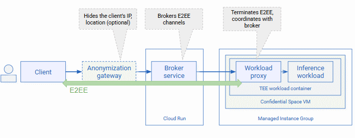
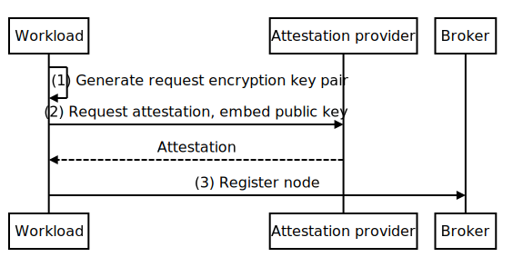
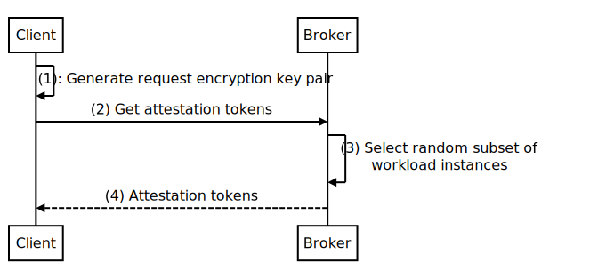
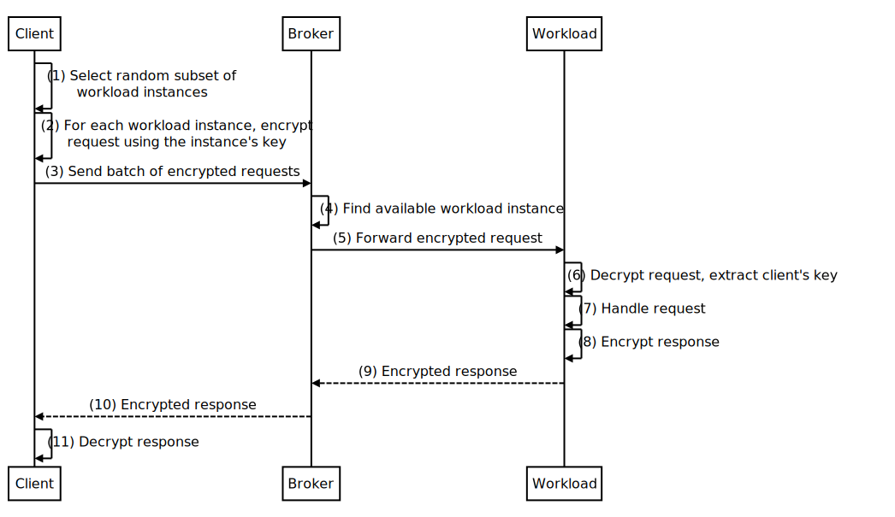

# Overview

The resource requirements of modern AI models often exceed the capabilities of
end-user devices such as smartphones. Offloading computation to cloud
infrastructure helps overcome these resource constraints, but can introduce
privacy challenges as users might not have sufficient trust in cloud systems and
their operators to keep their data safe.

This project describes an example architecture that intends to address some of
these privacy challenges by taking advantage of Google Cloud's confidential
computing and networking capabilities.

## Architecture

The following diagram illustrates the solution architecture:



This solution architecture takes advantage of Google Cloud's confidential
computing and networking capabilities:

-   The workload that processes end-user data is deployed on
    [Confidential VMs](https://cloud.google.com/confidential-computing/confidential-vm/docs/confidential-vm-overview)
    in a
    [Confidential Space trusted execution environment.](https://cloud.google.com/confidential-computing/confidential-space/docs/confidential-space-overview)

    Running the workload on Confidential VMs helps ensure that the user's data
    can not only be encrypted at rest or in transit, but also during processing.

    Confidential Space adds the protection of using a
    [COS image that's hardened to prevent operator access](https://cloud.google.com/docs/security/confidential-space#hardened-image)
    and enables
    [remote attestation](https://cloud.google.com/docs/security/confidential-space#attestation-process).

    Before interacting with a workload, the user's device uses remote
    attestation to verify the identity and authenticity of the workload and
    infrastructure it's about to share user data with. The attestation
    statements used for that purpose include precise versioning information
    about the workload's container image, the infrastructure it's deployed on,
    and its integrity.

    When the container image is made available for public inspection, the
    information provided in the attestation statements also lets advanced users
    find and inspect the precise version of the workload, and determine for
    themselves whether they deem the workload trustworthy to handle their data.

-   All communication between the end user's device and the workload is
    end-to-end encrypted, using key material that is bound to the workload
    attestation statement, and thus to a specific workload version and
    infrastructure.

    Going beyond the protections provided by TLS, binding the key material to
    the workload's attestation statement helps ensure that only the workload
    whose identity and integrity was previously verified by the user's device
    can decrypt the user's data.

    The broker service, which can be deployed on
    [Cloud Run](https://cloud.google.com/run), helps facilitate the setup of
    end-to-end encrypted communication channels by letting clients discover
    available VMs and forwarding messages.

-   The messages exchanged between the user's device and the workload are routed
    in a way that lets the client introduce randomness and obfuscate their
    identity while making it difficult for operators to determine whether
    messages originated from the same or different clients.
-   Optionally, connections between the client and the broker service can be
    routed through a third-party operated HTTP gateway that hides the client's
    network location and address from the broker service, further obscuring the
    user's identity.

The example solution architecture helps you develop applications that might need
to satisfy privacy requirements such as the following:

-   User data is only used for the purpose of fulfilling the user's request and
    not retained, copied, or used for other purposes.
-   User data is not accessible to Google staff.
-   User data is not accessible to the operator, i.e. the party that runs the
    workload.
-   Inference requests can't be trivially linked to a user's identity, their
    device, or location.
-   The operator can't trivially determine whether two inference requests
    originated from the same user.

## Implementation

This repository contains example code for the following components:

-   A workload proxy, intended to run alongside the data-processing workload in
    the trusted execution environment. Implemented using Java and
    [Tink](https://developers.google.com/tink), the workload proxy manages the
    coordination with the broker.
-   A broker service, intended to run on Cloud Run. Also implemented using Java
    and Tink, the broker coordinates the communication between clients and
    workload instances.
-   An example command line client.
-   A Terraform module to deploy all components in a single Google Cloud
    project.

The code is intended as an example and doesn't address certain requirements that
you might need to consider for a production application, including the
following:

-   Access control: You might need to restrict the users and devices that are
    allowed to use the system to offload data processing.
-   Quota charging: To manage costs, you might need to impose a quota on how
    many requests each user or device is allowed to issue per unit of time.

The following sections describe how the components of this solution architecture
interact, and how they help enable end-to-end encrypted communication.

### VM registration

The workload is deployed as Confidential Space containers on a managed instance
group of Confidential VMs. At any point in time, there can e multiple workload
instances, and the instance group manager can adjust the number of workload
instances as needed.

When a new workload is started, it performs the following initialization
procedure:



1.  The workload generates a _request encryption key pair_, which is an
    asymmetric key pair for
    [Hybrid Public Key Encryption](https://datatracker.ietf.org/doc/rfc9180/)
    (HPKE). The private key doesn't leave the container, and is lost when the
    container terminates.
1.  The workload
    [requests an attestation](https://cloud.google.com/confidential-computing/confidential-space/docs/connect-external-resources#retrieve_attestation_tokens)
    about itself, weaving in the public key component of its request encryption
    key pair as a nonce.
1.  The workload then registers itself with the broker by publishing its
    attestation token as a
    [Compute Engine guest attribute](https://cloud.google.com/compute/docs/metadata/manage-guest-attributes#set_guest_attributes).

A decoded attestation token looks similar to the following:

```json
{
  "alg": "RS256",
  "kid": "21ce...",
  "typ": "JWT"
}.{
  "aud": "https://broker-PROJECT.asia-southeast1.run.app/",
  "iss": "https://confidentialcomputing.googleapis.com",
  "sub": "https://www.googleapis.com/compute/v1/projects/PROJECT-ID/zones/ZONE/instances/workload-r3lq",
  "eat_nonce": [
    "COzYtNEHEt0BCtABCj10eXBlLmdvb2dsZWFwaXMuY29tL2dvb2dsZS5jcnlwdG8udGluay5FY2",
    "llc0FlYWRIa2RmUHVibGljS2V5EowBEkQKBAgCEAMSOhI4CjB0eXBlLmdvb2dsZWFwaXMuY29t",
    "L2dvb2dsZS5jcnlwdG8udGluay5BZXNHY21LZXkSAhAQGAEYARohAEawsfS+FrvlacuxCznjEG",
    "MRZ9bma+sUVBtktenzJ4moIiEAST6vn9ZNxizrZ2IvHWske2GH+liOtP0xz4TFLkgT6UAYAxAB",
    "GOzYtNEHIAE="
  ],
  "secboot": true,
  "oemid": 11129,
  "hwmodel": "GCP_AMD_SEV",
  "swname": "CONFIDENTIAL_SPACE",
  "swversion": [
    "250301"
  ],
  "dbgstat": "disabled-since-boot",
  "submods": {
    ...
    "container": {
      "image_reference": "asia-southeast1-docker.pkg.dev/PROJECT-ID/caims/workload:bb2...",
      "image_digest": "sha256:904c6cb...",
      "restart_policy": "Never",
      "image_id": "sha256:9718a6...",
      "env": {
        "HOSTNAME": "workload-r3lq",
        "JAVA_VERSION": "17.0.12",
        "LANG": "C.UTF-8",
        "PATH": "/usr/local/sbin:/usr/local/bin:/usr/sbin:/usr/bin:/sbin:/bin",
        "SSL_CERT_FILE": "/etc/ssl/certs/ca-certificates.crt"
      },
      "args": [
        "/usr/bin/java",
        "-jar",
        "app.jar",
        "workload"
      ]
    },
    "gce": {
      ...
    }
  },
  ...
}.[Signature]
```

The attestation token plays a crucial role in the communication between the
client, the broker, and the workload:

-   The token's signature and `aud` claim let clients verify the authenticity of
    a token. A successful signature check confirms that the token is running in
    Confidential Space.
-   The `dbgstat` claim lets the client verify that the workload is not running
    in
    [Debug mode](https://cloud.google.com/confidential-computing/confidential-space/docs/confidential-space-images#types_of_images).
-   `secboot`, `submods` and
    [other claims](https://cloud.google.com/confidential-computing/confidential-space/docs/reference/token-claims)
    let clients verify that the workload is running a known the container image
    version on a confidential VM.
-   The `eat_nonce` claim provides the request encryption key that lets clients
    encrypt messages that only the workload can decrypt.

Because attestation tokens expire after 1 hour, the workload periodically
refreshes its guest attribute by repeating steps 2-3.

### Client request

All messages exchanged between a client and a workload are end-to-end encrypted
using HPKE:

-   Request messages sent from the client to the workload use the workload's
    request encryption key as the recipient public key. The client obtains
    workload's request encryption key from the respective workload's attestation
    token.
-   Response messages sent from the workload back to the client use the client's
    public key as recipient public key. Clients embed their public key in the
    encrypted request message.

Each workload instance uses a different request encryption key pair. When
encrypting a request message, a client therefore needs to target a specific
workload instance. This creates two challenges:

1.  The client needs to know in advance which workload instances are available,
    and the public keys they use.
1.  As workload instances can be started and stopped at any time, a client might
    find itself in a situation where it prepares a message for a workload
    instance that's no longer available.

To address these challenges, the architecture uses a broker to coordinate
between clients and workload instances, and requires the client to follow a
two-stage process:

1.  In the first stage, the client obtains a list of available workload
    instances and their attestation tokens from the broker. The client then
    verifies the attestation tokens and caches the results.
1.  In the second stage, the client performs one or more requests, encrypted
    using the public keys obtained in the first stage.

The following diagram describes the first stage in more detail:



1.  The client generates a _request encryption key pair_, which is an asymmetric
    key pair for
    [Hybrid Public Key Encryption](https://datatracker.ietf.org/doc/rfc9180/)
    (HPKE). The private key doesn't leave the client, and is lost when the
    client terminates.
1.  The client sends a request to the broker, requesting a list of available
    workload instances and their attestations.
1.  Depending on the number of available confidential VMs, the broker might
    decide to return information about all available workload instances, or only
    a subset thereof.
1.  The broker returns the attestation tokens of the workload instance it
    selected.

The client can cache the received attestation tokens, but has to repeat the
steps above periodically as attestation tokens have a finite lifetime.



1.  The client, preparing to send a request, selects a random subset of the
    available workload instances it discovered during the first stage.
1.  For each selected workload instance, the client encrypts the request with
    HPKE, using the workload instance's public key as recipient key. In each
    encrypted request, the client includes its public key that it expects the
    response to be encrypted with.
1.  The client takes the individually encrypted requests and sends them to the
    broker as a batch. Alongside each encrypted request, it includes the
    attestation token of the workload instance that a request is suitable for.
1.  The broker finds a workload instance that is available, and for which the
    client included an encrypted request in the request batch. To determine
    available workload instances, the broker periodically scans the guest
    attributes of the Confidential VMs that run the workload.
1.  The broker forwards the encrypted request to the selected workload nstance.
1.  The workload instance decrypts the request using HPKE and its private
    request encryption key and extracts the client's public key.
1.  The workload instance handles the request, which might involve performing AI
    inference.
1.  The workload instance encrypts the response using HPKE and the client's
    public key as the recipient key.
1.  The workload instance returns the encrypted response to the broker.
1.  The broker returns the encrypted response to the client.
1.  The client decrypts the response using HPKE and its private request
    encryption key

By randomly selecting a workload instance, the client can actively prevent a
situation where all its requests are sent to a single workload, which could
undermine the user's anonymity. By selecting more than one workload instance,
the client reduces the risk that the message can't be processed because a
selected workload instance is no longer available.

## Next steps

-   [Deploy the solution on Google Cloud by using Terraform](terraform/README.md).
-   Take a look at the code.
-   Learn more about
    [Confidential Space](https://cloud.google.com/confidential-computing/confidential-space/docs/confidential-space-overview).
