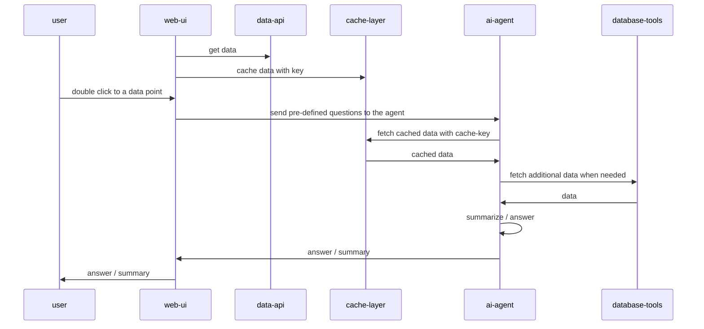

# Application Flow

This document discuss application flow.

## Flow diagram

```mermaid
sequenceDiagram

participant user
participant web-ui
participant data-api
participant cache-layer
participant ai-agent
participant database-tools

web-ui ->> data-api: get data
web-ui ->> cache-layer: cache data with key
user ->> web-ui: double click to a data point
web-ui ->> ai-agent: send pre-defined questions to the agent
ai-agent ->> cache-layer: fetch cached data with cache-key
cache-layer ->> ai-agent: cached data
ai-agent ->> database-tools: fetch additional data when needed
database-tools ->> ai-agent: data
ai-agent ->> ai-agent: summarize / answer
ai-agent ->> web-ui: answer / summary
web-ui ->> user: answer / summary
```
