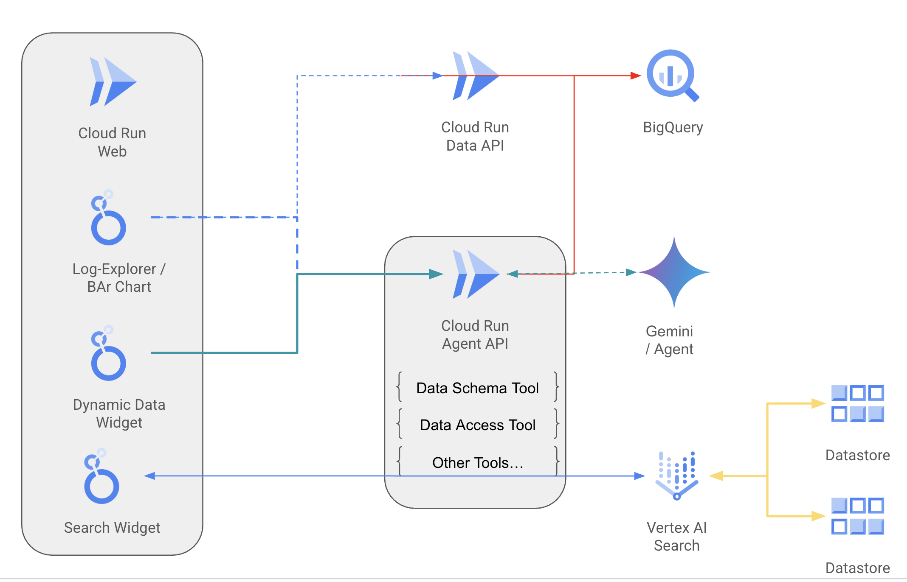

# Overview

This document discuss the architecture of the solution.

## Architecture

The following diagram illustrates current architecture.

### Widgets that with derterminstic SQL query

- Widget calls to Data Access API to fetch data.

    1.1 (**Optional**) Data Access API calls to Gemini to generate follow up
    questions, based on the user's profile and dataset.

- Widget renders the dataset and questions.

- User double click into the data point.

- Widget sends the specific data point and the question to Agent API.

- Agent use tools to fetch relevant data when required, and generate an answer
  to the question.

- Agent API repond with the final results.

- Widget renders the results.

### Widgets requires dynamic SQL query (for example, Natural Language to SQL)

- Widget calls to Agent API with a pre-defined question.

- Agent API generates a SQL query based on the user's profile and the question.

- Agent Use tools to fetch relevant data when required, and generate follow up
  questions.

- Agent API repond with the final results.

- Widget renders the dataset and follow up questions..

- User double click into the data point.

- Widget sends the specific data point and the question to Agent API.

- Agent use tools to fetch relevant data when required, and generate an answer
  to the question.

- Agent API repond with the final results.

- Widget renders the results.

## Search Widget

- User inputs search query.

- Widget sends the search query to Vertex AI Search App.

- Widget display the search results and summary.

## Considerations

### Natural Langauge to SQL or pre-scripted SQL

|             |                                           NL to SQL                                            |                          Pre-scripted SQL / Data API                          |
| :---------: | :--------------------------------------------------------------------------------------------: | :---------------------------------------------------------------------------: |
| Use when... |                   You want to provide your user a free-form query experience                   | You already have an API or SQL for you report, and you will use it as a start |
|             | The task is expected to be time-consuming, for example, the task is to analyze a large dataset |                     The task requires fast data retrival.                     |

### Language Model Selection

|          |                      Large model                      |                 Small Model                  |
| :------: | :---------------------------------------------------: | :------------------------------------------: |
| Example  |                    Gemini-2.5-Pro                     |               Gemini-2.0-Flash               |
| Use when |         The task requires complex reasoning.          | The task does not requires complex reasoning |
| Example  | Analyze a given dataset and provide follow up actions |  Generate questions based on user's profile  |
