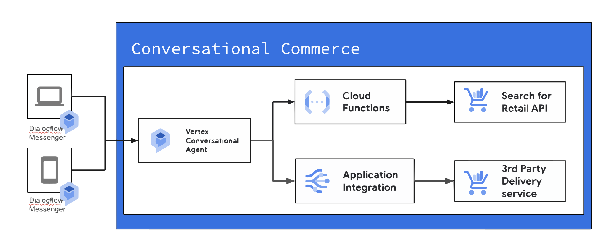

# Overview

The Conversational Agent \- Apparel deployment guide provides step-by-step instructions
on how to set up and deploy cloud resources for the
Conversational Agent \- Apparel application.

This guide will guide you through enabling necessary services,
configuring Dialogflow, Retail Search, and DHL integration.

By following the instructions in this guide, you will be able to set up the required
infrastructure and configure the application components,
allowing you to experience the power of conversational AI in the retail domain.

## Reference Architecture

The following diagram illustrates the solution architecture.

*   A web application with Dialogflow Messenger embedded as the frontend user interface.
*   The Agent uses Open API tools to search and recommend products to the end customer.
*   The Agent uses Application Integration tools to fetch delivery status.



## Deploy the solution

### Before you start

*   Create a billing enabled Google Cloud project.
*   Update your **constraints/iam.allowedPolicyMemberDomains** organization policy:
  To allow external domain members if not already.
*   Go to Cloud shell and clone this repository.

```shell
git clone https://github.com/googlecloudplatform/cloud-solutions && \
cd cloud-solutions/projects/conversational-commerce-agent
```

### Enable Services

```shell
gcloud auth application-default login

export PROJECT_ID=<PROJECT_ID>
gcloud config set project $PROJECT_ID
gcloud auth application-default set-quota-project $PROJECT_ID
gcloud services enable cloudresourcemanager.googleapis.com \
    cloudfunctions.googleapis.com \
    serviceusage.googleapis.com \
    firestore.googleapis.com \
    compute.googleapis.com \
    cloudbuild.googleapis.com \
    storage.googleapis.com \
    run.googleapis.com \
    retail.googleapis.com \
    dialogflow.googleapis.com \
    connectors.googleapis.com \
    secretmanager.googleapis.com \
    iam.googleapis.com \
    iamcredentials.googleapis.com

```

### Provision Cloud Resources

You will use the provided terraform script to provision the following resources：

*   the Conversational Agent,
*   a Cloud Run that hosts a demo web page
*   a Cloud Functions
*   Application Integration.

Here are the steps:

*   Change to application folder.

```shell
cd conversational-agent-examples
```

*   Apply Terraform

```shell
terraform init
terraform apply -var project_id="$PROJECT_ID"
```

When instructed, answer "yes".

You should see output like below:

```text
agent_gs_bucket = "gs://<project-id>-dialogflowcx-assets"
app_integraion = "./app-integration.json"
ui_cloudrun_url = "https://<cloudrun-service-id>.<region>.run.app"
```

Take note of the following:

*   `agent_gs_bucket` you will use this bucket later
*   `app_integration` the json file you will use to create the application integration
*   `ui_cloudrun_url` the url of the ui,
you will use this ui to interact with the Conversational Agent

### Create Application Integration

*   Find the Application Integration json file
in the working directory when you run
`terraform apply`.
The filename is in the terraform output `app_integration`
*   Use the file to
[Create an integration](https://cloud.google.com/application-integration/docs/upload-download-integrations#upload-an-integration)

    *   Choosing **apparel-search-prod** as the name.

    *   Set the region to **us-central1**.
*   Click the **Publish** button to publish integrations.

### Enable Unauthenticated API in Conversational Agent

*   Go to the [Conversational Agent console](https://dialogflow.cloud.google.com/v2/).
*   In the project selection page, choose your project.
*   In the Agents selection page, select the Conversational Commerce Agent.
*   In the left panel, select Integrations, then select **Conversational Messenger**,
click Connect.
    *   Make sure “**Unauthenticated API (anonymous access)**” is checked.
    *   Scroll down and click the “**Enable unauthorized API**” button.
    *   Wait for the API to enable, then click **Done** to close the dialog.

### Retail Search Data Import

In this demo, we are using the public
[Flipkart dataset](https://www.kaggle.com/datasets/PromptCloudHQ/flipkart-products)
for products.
This section introduces the steps to convert the public dataset to
Google Cloud Search for Retails data format,
and import the converted data into Search for Retail.

#### Enable Search for Retail service

*   Goto [Search for Retail Console](https://console.cloud.google.com/ai/retail/start).
    *   Follow the instructions to turn on the APIs,
  agree to data use terms and turn on search & browse features.
*   Goto [Vertex AI Search for Retail API Manage console]
(https://console.cloud.google.com/apis/api/retail.googleapis.com/).
    *   Wait several seconds until the `Create Credentials` button shows up.
    *   Click the `Create Credentials` button on the top right to
    create a service account
  and associate it with the Search for Retail service
        *   In the **Which API are you using? page.** Leave **Select an API**
    field default, and choose **Application Data**
        *   In the **Service account details** page. Name the service account `retail-service`
        *   in the **Grant this service account access to project** page.
    Grant `Retail Admin, Storage Object Viewer` and `Storage Admin` role to
    the service account.
        *   Click Done to create the service account.

#### Import data to Search for Retail

These scripts report errors if the Search for Retail service is not ready for use,
if you see errors when running the following scripts.
Please wait 5 minutes and try again.

This demo solution consists of three different use cases -
Apparel, Cosmetic and Food.

*   Create Python Virtual environment.

```shell
cd data-ingestion
python3 -m venv .venv
source .venv/bin/activate

pip install -r requirements.txt --require-hashes
```

*   Setup environment variables.

```shell
export PROJECT_ID=<YOUR PROJECT ID>
gcloud config set project $PROJECT_ID

export PROJECT_NUMBER=$(gcloud projects describe $PROJECT_ID \
  --format="value(projectNumber)")
echo $PROJECT_NUMBER
```

*   Convert data file and import data to Search for Retail.

Note that in this demo, we use **Branch** **1** as the default branch.

For more information about Search for Retail Branches,
please see the [documentation](https://cloud.google.com/retail/docs/catalog#branch).

*   Choose one of the following use cases.

[Apparel](#to-setup-apparel-use-case-demo)

[Cosmetic](#to-setup-cosmetic-use-case-demo)

[Food](#to-setup-food-use-case-demo)

##### To setup Apparel use case demo

Switch to the data-ingestion folder and download
[Flipkart dataset](https://www.kaggle.com/datasets/PromptCloudHQ/flipkart-products).

```shell
cd ../data-ingestion
mkdir -p dataset

# Download dataset
curl -L -o \
dataset/archive.zip https://www.kaggle.com/api/v1/datasets/download/PromptCloudHQ/flipkart-products
unzip dataset/archive.zip -d dataset

# Convert data format
python3 flipkart_to_retail_search.py \
   -i dataset/flipkart_com-ecommerce_sample.csv \
   -o dataset/flipkart-all.jsonl -p $PROJECT_NUMBER -b 1
```

*   Go to [Next Step](#import-data-and-set-the-default-branch)

##### To setup Cosmetic use case demo

Switch to the data-ingestion folder and download
[Flipkart cosmetic dataset](https://www.kaggle.com/datasets/shivd24coder/cosmetic-brand-products-dataset).

```shell
cd ../data-ingestion
mkdir -p dataset

# Download dataset
curl -L -o \
dataset/archive.zip https://www.kaggle.com/api/v1/datasets/download/shivd24coder/cosmetic-brand-products-dataset
unzip dataset/archive.zip -d dataset

# Convert data format
python3 cosmetics_to_retail_search.py \
   -i dataset/makeup_data.json \
   -o dataset/flipkart-all.jsonl -p $PROJECT_NUMBER -b 1

```

*   Go to [Next Step](#import-data-and-set-the-default-branch)

##### To setup Food use case demo

Switch to the data-ingestion folder and download
[Flipkart cosmetic dataset](https://www.kaggle.com/datasets/shivd24coder/cosmetic-brand-products-dataset)

```shell
cd ../data-ingestion
mkdir -p dataset

# Download dataset
curl -L -o \
dataset/archive.zip https://www.kaggle.com/api/v1/datasets/download/graphquest/restaurant-menu-items
unzip dataset/archive.zip -d dataset

# Convert data format
python3 food_to_retail_search.py \
   -i dataset/restaurantmenuchanges.csv \
   -o dataset/flipkart-all.jsonl -p $PROJECT_NUMBER -b 1
```

*   Go to [Next Step](#import-data-and-set-the-default-branch)

##### Import data and set the default branch

*   Update Search for Retail catalog level attribute controls.

```shell
python3 update_controls.py -n $PROJECT_NUMBER
```

*   Note that large catalog imports can take hours to fully propagate.
Before the data is fully propagated your conversation with the agent may
end up with no search results.

*   For demo purposes, you may want to reduce the size of the final dataset
to reduce the time of import.

*   Catalog and product information is imported to **Branch 1**,
which is set as the default branch.

```shell
export BUCKET_NAME=${PROJECT_ID}-dialogflowcx-assets

python3 import_to_retail_search.py -i dataset/flipkart-all.jsonl -g $BUCKET_NAME \
   -n $PROJECT_NUMBER -b 1 --set-default-branch
```

You may see errors below, which indicates this product has invalid data.
The problematic product will be ignored and not imported to Search for Retail.

```text
INFO:root:error_samples {
  code: 3
  message: "The string in \"product.attributes.value.text\" must be with a length limit of 256 Unicode characters, but 1447 Unicode characters found."
  details {
    type_url: "type.googleapis.com/google.rpc.ResourceInfo"
    value: "\022Fgs://kalschi-conv-commerce-11-dialogflowcx-assets/flipkart-all.jsonl:2"
  }
}
```

## Verify the deployment

*   Navigate to `ui_cloudrun_url` you noted down in the previous step.
*   Follow the [demo guide](demo.md) to verify the deployment.

## Troubleshooting

### Agent returns no product but asks which product I want

*   Go to Cloud Run, apparel-search-cf, Logs
    *   Check the latest Cloud Run calls.
    If you see products in the response payload like below where some
    products do not have details. The dataset is not fully propagated,
    please wait a moment and try again.

| Log |
| :---- |
| RAW RESULT: [{'id': 'a0f262830d970a2921ca58ce6177fdbc', 'product': {'name': 'projects/646255812645/locations/global/catalogs/default\_catalog/branches/1/products/a0f262830d970a2921ca58ce6177fdbc'}}, ... |
| Retail Search Exception: 'title' |
