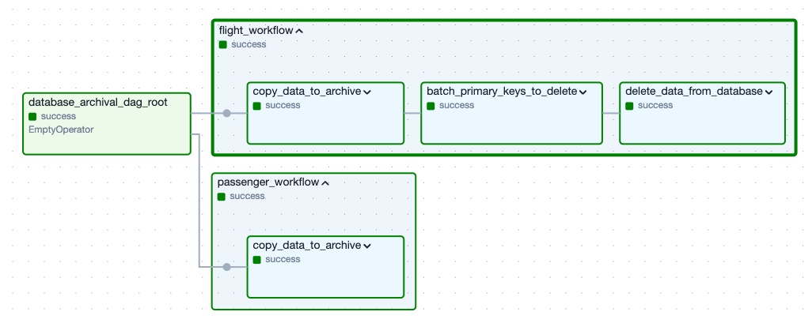
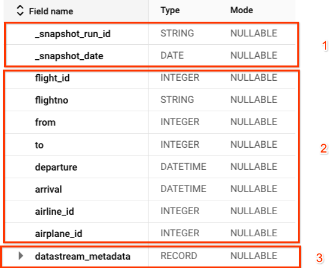
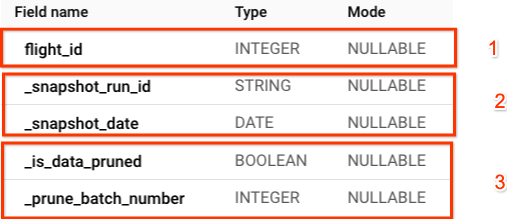
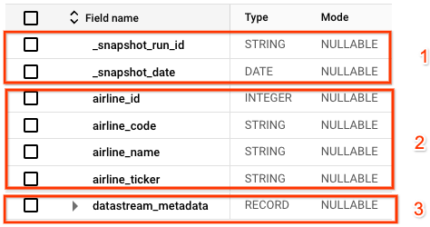

# Architecture Design of Database Archival and Pruning

## Overview

*   **Datastream** continuous replication creates a copy of the database in a
    BigQuery dataset. This is a live replica which reflects the same data as the
    database.

*   **Composer** coordinates the process of creating table snapshost (archiving)
    and deleting from the database. Composer creates new BigQuery jobs to copy
    (archive) the data and create a metadata table with the pruning status.
    Composer calls a Cloud Run Function to perform the data deletion (pruning).

*   **Cloud Run Function** is used as ephemeral compute to connect to the
    database and delete the data in small batches.

*   **BigQuery** is used as the target data destination for the archived data
    and the metadata for these tables.

### Flow of data

*   Datastream runs independently of this pipeline, continuously copying data to
    BigQuery.

*   Composer runs periodically (configurable), reads a configuration file stored
    in Google Cloud Storage and sets up the pipeline.

    *   One workflow is created for each table configuration.

    *   For Historical Data:

        *   A BigQuery job is created to copy the data from the BigQuery table
            created as a live replica from Datastream (e.g. `transactions`) into
            a table called snapshot (e.g. `transactions_snapshot`). Only the
            data that is older than the specified retention period is copied.
            Each row is marked with the execution date (`_snapshot_date`) and
            the run id (`_snapshot_run_id`) of the Composer pipeline. The
            table is partitioned by date (`_snapshot_date`). A partition
            expiration time (configurable) will be set.

        *   A BigQuery job is created to copy and batch (`_prune_batch_number`)
            the primary keys from the snapshot table (e.g.
            `transactions_snapshot`) into a metadata table (e.g.
            `transactions_snapshot_prune_progress`) which contains whether the
            primary keys have been deleted from the database (`is_data_pruned`).
            The batch size is configurable, and recommended to keep between 100
            and 10,000. The execution date (`_snapshot_date`) and the run id
            (`_snapshot_run_id`) of the Composer pipeline are also stored. The
            table is partitioned by date (`_snapshot_date`). A partition
            expiration time (configurable) will be set.

        *   A Cloud Run Function is run to delete one batch of data from the
            database. Each batch is deleted as a transaction. Only one batch
            per table is deleted at a time. A waiting time (configurable) is
            done in between batches.

        *   A BigQuery job is created to update the metadata table (e.g.
            `transactions_snapshot_prune_progress`) and confirm that the given
            data batch has been pruned successfully.

    *   For Main Data:

        *   A BigQuery job is created to copy the data from the BigQuery table
            created as a live replica from Datastream (e.g. `users`) into a
            table called snapshots (e.g. `users_snapshot`). All the data in the
            Main Data table (e.g. `users`) is copied regardless of date or
            usage. Each row is marked with the execution date (`_snapshot_date`)
            and the run id (`_snapshot_run_id`) of the Composer pipeline. The
            table is partitioned by date (`_snapshot_date`). A partition
            expiration time (configurable) will be set.

*   BigQuery will be pruning (removing) partitions that are older than their
    expiration date automatically and indepdently of this pipeline.

### Sample tables

#### Historical Data: Flights

This table contains records of all the flights of the company. We may no longer
be interested in the flights that are older than 3 years in our operational
database.

##### Snapshot table for Historical Data

This table reflects the archived (copied) data. In this case, it will contain
a full copy of the data older than 3 years.

1.  Contains metadata from the Composer run including date and run_id to be able
    to identify the source of the data.

1.  Contains the original data. In this case, only the data that is older than
    the desired database expiration date will be copied.

1.  Contains the metadata created by datastream, which was used to create the
    initial data movement to BigQuery.

##### Metadata table for Historical Data

This table reflects the archived (copied) data primary keys that need to be
deleted from the database. The pruning (deletion) status is tracked.

1.  Contains the primary keys of the source table.

1.  Contains the metadata from Composer, which is the same as in the
    table_snapshot where the archived data is.

1.  Contains whether these primary keys have been deleted from the database, and
    to which batch they belong.

#### Main Data: Airlines

Flights contain some foreign primary keys like `airline_id` or `airplane_id`. As
a result, we may want to archive airlines Main Data together with Flights. We do
not want to delete the data in airlines.

##### Snapshot table for Main Data

This table reflects the archived (copied) data. In this case, it will contain
a full copy of the original data.

1.  Contains metadata from the Composer run including date and run_id to be able
    to identify the source of the data.

1.  Contains the original data. In this case, the whole table is copied on every
    run to allow point in time queries with the Historical Data.

1.  Contains the metadata created by datastream, which was used to create the
    initial data movement to BigQuery.

##### Metadata table for Main Data

There is no metadata table for airlines since no data will be pruned.

## Design Decisions

### Design Principles

**Principle: Keep design simple and robust.**

*   Leverage the optimal number of components in the pipeline.
*   Leverage existing features and functionality, where available.
*   Log and validate actions taken by the system.

**Principle: Flexible and customizable at table level.**

*   Allow customization and flexibility at table level.
*   Support adding additional tables at later stages.

**Principle: Minimize the impact on the application performance.**

*   Leverage database's (e.g. Cloud SQL) read replicas to run Datastream to
    minimize pressure on the database when moving data to BigQuery.
*   Leverage BigQuery data, migrated by Datastream, to create the data archive
    to minimize queries to the database.
*   Batch data for deletion into small batches to minimize pressure on the
    database when deleting data.

**Principle: Take a conservative approach towards data pruning.**

*   Sequence pruning to start if and only if the archiving step has succeeded.
*   Prune data from the database when the data is confirmed to be archived.
*   Batch deletion of data into small sets.

### Architecture design choices

**Datastream** is a ready to use solution to replicate the data from databases
(e.g. Cloud SQL as a source) to BigQuery. Datastream supports all Cloud SQL
databases, and AlloyDB. Datastream provides continuous replication while
minimizing one-off spikes in reads when performing data movement. The archival
is then performed over BigQuery, minimizing the costs and performance hit of
reads during the archival.

Either another database equivalent (e.g. Cloud SQL) or BigQuery could have been
used to achieve the goals of archiving from the main instance and provide
queryable access. However, since the goal is to reduce costs and there are
limits on the total size of data that can be stored in databases like Cloud SQL,
**BigQuery** has been chosen for this goal. BigQuery is optimized for analytical
workloads, which is ideal for the common needs for this data (e.g. run AI
models), in addition to just storing the data. BigQuery also has native
mechanisms to prune using partitions and expiration dates for those partitions.
By leveraging partitions, we gain a few capabilities. We are able to:

  1.  Query data more efficiently without having to go through all the
      Historical Data.

  1.  Drop a full partition or overwrite it if the process fails during
      archival.

  1.  Auto-delete the data after the retention period has passed using
      expiration dates.

  1.  Efficient access and query of the data without having to access data older
      than necessary, leading to lower query costs.

**Cloud Composer** is recommended as these are multi step pipelines with
dependencies. Composer is ideal to coordinate and to ensure steps are completed
sequentially or in parallel as needed. Cloud Composer provides observability
(e.g. alerting) and capacity to resume failed nodes (i.e. retriability), which
is critical to minimize risks during the archiving and pruning. Given the
critical nature of archiving data, these are important goals.
