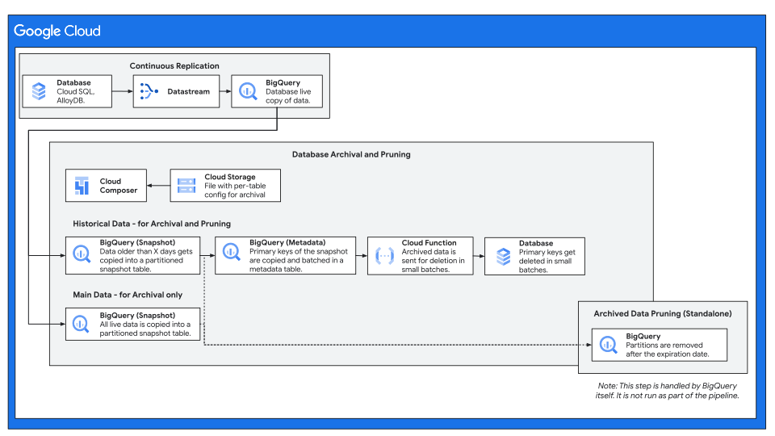

# Database Archival and Pruning

## Overview

Database Archival and Pruning (or "Database Archival" for short) is a solution
which allows you to archive and prune data from Google Cloud database products
(such as Cloud SQL, AlloyDB, Spanner) into BigQuery. This solution archives and
prunes data from Historical Data tables.

Historical Data tables are usually large tables, with a date or timestamp
column, which stores transactions, facts, log or raw data which are useful for
various long-term storage and analytics needs. These tables are copied from the
operational Database to BigQuery - after which, the data can be removed from the
database.

The solution supports multiple tables - across multiple databases and
instances - with customizable configuration and retention periods for each
table.

This concept is similar to BigTable's age-based
[Garbage Collection](https://cloud.google.com/bigtable/docs/garbage-collection).

## Goals of this solution

*   Reduce the size of tables in an operational (relational) database by
    deleting data from Historical Data tables - which, when managed properly may
    lead to some of the following:

    *   Improved query performance.

    *   Storage cost savings.

    *   Reduced risk of hitting
        [table limits](https://cloud.google.com/sql/docs/quotas#table_limit).

*   Provide access to the archived Historical Data after its deletion from the
    operational databases - which may be critical for business needs, regulatory
    or compliance requirements and/or data analytics and AI.

*   Provide configuration at table level, which allows more single and multi
    tenant scenarios with various requirements and retentions per table.

## Target use case

This solution is for you if you have large Historical Data tables and you want
to remove rows that are older than a certain period from your operational
database because:

1.  the records are no longer needed for operational queries, but they may be
    needed for analytical or regulatory purposes,

1.  you want to improve the query performance of those tables,

1.  you are reaching the maximum size limit of the database disk or instance
    (for example,
    [3-64TB for Cloud SQL](https://cloud.google.com/sql/docs/quotas#storage_limits)),
    or its tables (for example,
    [16TB for Cloud SQL](https://cloud.google.com/sql/docs/quotas#table_limit)),
    and/or

1.  you want to explore ways to potentially reduce storage costs on your
    database instance.

Historical Data tables are usually indicated by a date (date, datetime or
timestamp) column which indicates when each row was created. Common use cases
for these tables are transactions, orders, purchases, logs, bookings,
appointments, sensor and IoT data collections, social media, user interaction
data or sale analytics.

The data on these tables is usually helpful in an operational context in the
short-term. However, some of this data may no longer be useful from an
operational point of view after some time have passed. As the data accumulates,
the storage size of the tables increases, potentially impacting performance
of table scans and increasing the storage and compute cost of running the
database.

<!--
    Disabling markdownlint MD046 since it interpets this note as a code block,
    and flags it for using indentation instead of code fences.
-->
<!-- markdownlint-disable MD046 -->

!!! abstract "Example"

    You may want to provide access for the transactions of the
    last 2 years, but not data before then. However, you may want to keep 5-10
    years of data to train AI models or for meeting regulatory requirements. As
    a result, there would be no reason to keep more than two years of data
    readily accessible in the operational database.

    Database Archival and Pruning would solve this use case. The data older
    than 2 years would be copied periodically to BigQuery. After this, the data
    would be removed from the database - allowing the transactions table to run
    faster and at a lower storage, provided the right database optimizations
    are applied. The data archived in BigQuery would be accessible for queries
    as needed for business needs, analytical purposes or AI models. The data
    on BigQuery could be retained for the additional required 8 years (to a
    total of 10 years). The retention periods are configurable.

Since this Historical Data may need to be queried together with other tables,
the solution also provides a way to archive Main Data. Main Data is defined as
any table that you may need to join with the Historical Data and which should
not be pruned. The solution will create a copy of all the data into the snapshot
table in BigQuery so you can join the archived Historical Data with a point in
time copy of Main Data.

!!! abstract "Example"

    If your Transactions table has a user_id, you may want to join Transactions
    with Users to retrieve user information like name, gender or location.
    However, the data in the Users table today may not be the same as 4 years
    ago when the transactions snapshot was taken. In order to provide a view as
    consistent as possible, Database Archival process would also require taking
    a snapshot of the users table, so both transactions and users can be queried
    as the data was at that point in time as determined by the snapshot date.

<!-- markdownlint-disable MD046 -->

## What Database Archival and Pruning does

This Database Archival and Pruning solution, as its name indicates performs the
following actions:

*   Archives (copies) data from operational database into BigQuery snapshot
    tables that is older than the given retention period.

*   Prunes (deletes) the already archived data from the database.

The archived data remains queriable through BigQuery after deletion from the
database - which may be helpful for analytical and/or regulatory purposes. A
different retention date can be set for the BigQuery data.

*   For the Historical Data, only the data older than the desired retention
    period is archived (copied) and, once copied, pruned (deleted) from the
    database.

*   For the Main Data, the whole table is archived (copied), but none of the
    data is pruned (deleted) from the database.

The tool is designed to be run periodically (e.g. monthly, quarterly or yearly)
to keep archiving and deleting configurable chunks (recommended up to ~1M
records) of the data from the database.

The solution is designed to minimize the load on the database instance by
offloading the archival process to BigQuery, and by deleting the data from the
database in batches (~1k records) with waiting periods in between batches.

To learn more about how the solution works, read the
[Architecture Details](./architecture.md).

## Database support

This tool is mostly concerned with historical and transactional tables on
operational / relational databases. To benefit from this solution, you would
need to meet the following requirements:

### Databases

*   MySQL: full support. Includes:

    *   Cloud SQL for MySQL
    *   Self-Hosted MySQL (e.g. on GKE or Compute)

*   Postgres. Includes:

    *   Cloud SQL for Postgres
    *   Self-Hosted Postgres

*   SQL Server. Includes:

    *   Cloud SQL for SQL Server
    *   Self-Hosted SQL Server

*   AlloyDB: full support.

*   Spanner: not yet supported.

### Schemas

*   Historical Data tables must:

    *   Have a date column (DATE, DATETIME or TIMESTAMP) which determines which
        data is old and needs to be deleted.

    *   Have a primary key or at least one candidate key to uniquely identify
        each row. Heap tables are not supported.

    *   Have no child table dependencies (tables which have foreign key
        relations to the table that is being pruned).

*   All Main Data tables are supported.

## Disclaimers

*   This is not an official Google product.

*   Database Archival and Pruning is destructive in nature. As a result, there
    is a risk of data loss. When the data on the database is pruned and it may
    not be possible to restore it unless you took precautions like backups or
    point in time recovery. The solution is designed to only delete data that
    has been confirmed to be already located in BigQuery, but you should take
    the necessary precuations to comply with your business and regulatory
    objectives.

*   Database Archiving is not intended for Disaster Recovery (DR). Methods other
    than this project should be used for DR. The data archived by this project
    remains queryable through BigQuery, but it may not be possible to restore it
    to Cloud SQL. Moreover, you should take messures to ensure the data is
    preserved once archived to BigQuery.

*   Cost reduction or performance improvements are not guaranteed. While
    reducing table and database size can lead to both, it depends on the overall
    context and situation. Ensure you run the proper database optimizations
    (such as vacuuming, shrinks, statistics updates, index rebuilds) to reclaim
    space and/or optimize your tables after the deletions. While the cost of the
    database instance(s) may be reduced due to the smaller data size, other
    costs are introduced for the archival and pruning processes in terms of
    pipeline coordination, data processing and data storage. Do your own tests
    and calculations to determine the best path forward from a cost perspective.

Read our [Best Practices and Considerations](./best_practices.md) to maximize
the value of this solution.
