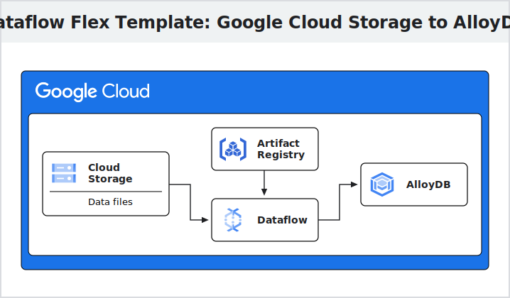

# Dataflow Flex Template to upload batch data from Google Cloud Storage to AlloyDB (and Postgres)

Dataflow Flex Template template that reads data from files in Google Cloud
Storage (in Avro or CSV format) and uploads it to a PostgreSQL compatible
databases, including: AlloyDB, AlloyDB Omni and Cloud SQL for PosgreSQL.

## Architecture

The Dataflow Flex template reads file(s) from Google Cloud Storage (GCS) or a
local path. The data is parsed into a pandas DataFrame to provide the correct
schema.

After parsing the file, the data is inserted into AlloyDB or a PostgreSQL
compatible database.

The pipeline is built in Python, but leverages the
[JDBC SQL Connector](https://nightlies.apache.org/flink/flink-docs-master/docs/connectors/table/jdbc/)
to connect to PosgtreSQL databases - which requires Java.

Dataflow Flex pipeline is provided that creates a container image in
[Artifact Registry](https://cloud.google.com/artifact-registry). When the Flex
Template is run, the container deploys a Dataflow pipeline that loads data from
Cloud Storage to AlloyDB or PostgreSQL server in Cloud SQL.

## Quickstart

1.  [Configure](./configuration.md) the pipeline parameters.
2.  [Build and run](./build_and_run_pipeline.md) the Dataflow Flex pipeline.
