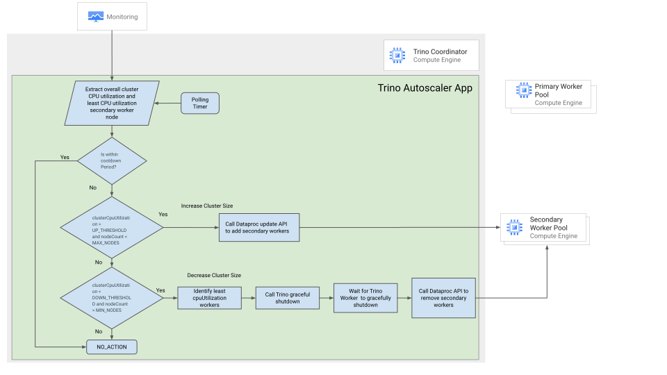

# Autoscaler for Trino on Dataproc

[Objectives](#objectives)

[Costs](#costs)

[Architecture](#architecture)

[Before you begin](#before-you-begin)

[Setting up your environment](#setting-up-your-environment)

[How to use](#how-to-use)

[Configuration Details](#configuration-details)

[Demo Deployment](#demo-deployment)

[Run Trino job](#run-trino-job)

[Manual demo deployment](#manual-demo-deployment)

[Limitations](#limitations)

[Cleaning up](#cleaning-up)

[What's next](#whats-next)

*Summary: Autoscaler for Trino on Dataproc*

[Apache Hadoop](https://hadoop.apache.org/) is an open-source software framework for distributed storage and processing of large datasets on clusters of commodity hardware. It provides a reliable, scalable, and distributed computing platform for big data processing. Hadoop utilizes a centralized resource manager component called YARN (Yet Another Resource Negotiator) for allocating resources, monitoring, and managing the cluster.

[Trino](https://trino.io/) is an open-source, distributed SQL query engine for big data. It can run on top of Hadoop, Hive and other data lakes and warehouses. In Trino, resource allocation and management are driven by the Trino Coordinator, which is responsible for query coordination, planning, and resource allocation. Trino dynamically allocates resources (CPU and memory) on a fine-grained level for each query. Trino clusters often rely on external cluster management systems like Kubernetes for resource allocation and scaling. These systems handle cluster resource provisioning and scaling dynamically.

[Dataproc](https://cloud.google.com/dataproc?hl=en) is a managed Hadoop and Spark service that makes it easy to run big data workloads in the cloud. Dataproc currently supports autoscaling for yarn-based applications such as Hive and Spark, but not for non-yarn applications such as Trino. This has led some enterprises to migrate from Trino on Dataproc to Trino on GKE in order to use autoscaling. However, Trino on GKE can be more complex and costly to manage than Trino on Dataproc. This solution provides a reliable and scalable auto scaling solution for Trino on Dataproc.

Trino deployment on Dataproc uses the embedded discovery service. Every Trino node connects with the discovery service on startup and periodically sends a heartbeat signal.

When adding an extra worker to the cluster, the worker registers with the discovery service, allowing the Trino coordinator to start scheduling new tasks for the fresh workers. Removing a worker from the cluster is slightly difficult if a worker suddenly shuts down, which can result in complete query failure.

Trino has a [graceful shutdown API](https://trino.io/docs/current/admin/graceful-shutdown.html) that can be used exclusively on workers in order to ensure they terminate without affecting running queries. The shutdown API puts the worker in a `SHUTTING_DOWN` state when the coordinator stops sending new tasks, though the currently executing tasks will continue, after which the Trino worker will exit.

This Trino worker behavior requires the solution to monitor workers to gracefully exit before removing the VM from the cluster.

This solution provides the following benefits.

-   Improved performance and scalability: By automatically scaling the Trino cluster up and down based on demand this solution can help to improve the performance and scalability of Trino workloads.

-   Improved reliability: By automatically scaling the Trino cluster up and down, this solution can help to improve the reliability of Trino workloads by ensuring that there are always enough resources available to execute queries.

This document is intended for audiences that need to run Trino on Dataproc and want to take advantage of autoscaling to improve performance and optimize costs. This guide assumes that you're familiar with Trino and Dataproc, without the need to be an expert and run simple shell and terraform scripts.

## Objectives

-   Deploy autoscaler application

-   Run a Demo job for autoscaling Dataproc workers for the Trino workloads

-   Verify autoscaling of worker nodes in the monitoring and Trino dashboard

## Costs

This tutorial uses billable components of Google Cloud, including the following:

-   [Dataproc](https://cloud.google.com/dataproc/pricing)

-   [Cloud Build](https://cloud.google.com/build/pricing)

-   [Bigquery](https://cloud.google.com/bigquery/pricing)

-   [Cloud Storage](https://cloud.google.com/storage/pricing)

-   [Cloud Monitoring](https://cloud.google.com/stackdriver/pricing)

Use the [pricing calculator](https://cloud.google.com/products/calculator) to generate a cost estimate based on your projected usage.

## Architecture

The solution uses [Cloud Monitoring]( http://cloud.google.com/monitoring) to collect the overall cluster CPU utilization and the details of the least CPU-utilizing secondary worker nodes. It then uses this information to make decisions about scaling the cluster up or down.

The system adds secondary worker nodes when the CPU utilization goes higher than the configured threshold upto the configured max_nodes. Trino coordinator automatically detecta the new nodes through its discovery service. When the cluster utilization falls below the configured threshold, the system will reduce the least busy workers. The system will wait for the Trino worker to gracefully shut down before the node is removed. In all other cases, no action will be taken.

## Before you begin

For this tutorial, you need a Google Cloud [project](https://cloud.google.com/resource-manager/docs/cloud-platform-resource-hierarchy#projects). To make cleanup easiest at the end of the tutorial, we recommend that you create a new project for this tutorial.

1.  [Create a Google Cloud project](https://console.cloud.google.com/projectselector2/home/dashboard)

2.  Make sure that [billing is enabled](https://support.google.com/cloud/answer/6293499#enable-billing) for your Google Cloud project

3.  [Open Cloud Shell](https://console.cloud.google.com/?cloudshell=true)

-   At the bottom of the Cloud Console, a [Cloud Shell](https://cloud.google.com/shell/docs/features) session opens and displays a command-line prompt. Cloud Shell is a shell environment with the Cloud SDK already installed, including the [gcloud](https://cloud.google.com/sdk/gcloud/) command-line tool, and with values already set for your current project. It can take a few seconds for the session to initialize.

4.  In Cloud Shell, clone the source repository and go to the directory for this tutorial:

        git clone https://github.com/GoogleCloudPlatform/dataproc-trino-autoscaler.git\
        cd dataproc-trino-autoscaler

### Setting up your environment

1.  Enable APIs for Compute Engine, Cloud Storage, Dataproc, Bigquery, Monitoring and Cloud Build services:

            gcloud services enable \
            compute.googleapis.com \
            bigquery.googleapis.com \
            bigqueryconnection.googleapis.com \
            cloudbuild.googleapis.com \
            dataproc.googleapis.com \
            storage.googleapis.com \
            monitoring.googleapis.com

2.  In Cloud Shell, set the [Cloud Region](https://cloud.google.com/compute/docs/regions-zones#available) that you want to create your Dataproc resources in:

            PROJECT_ID="<PROJECT_ID>"
            REGION="<YOUR_REGION>"
            SERVICE_ACCOUNT="<SERVICE_ACCOUNT>"

3. Make sure that the Service Account used by Dataproc cluster, should have the following roles:

        gcloud projects add-iam-policy-binding ${PROJECT_ID} --member=serviceAccount:${SERVICE_ACCOUNT} --role=roles/compute.admin \

        gcloud projects add-iam-policy-binding ${PROJECT_ID} --member=serviceAccount:${SERVICE_ACCOUNT} --role=roles/bigquery.dataViewer \

        gcloud projects add-iam-policy-binding ${PROJECT_ID} --member=serviceAccount:${SERVICE_ACCOUNT} --role=roles/bigquery.user \

        gcloud projects add-iam-policy-binding ${PROJECT_ID} --member=serviceAccount:${SERVICE_ACCOUNT} --role=roles/dataproc.editor \

        gcloud projects add-iam-policy-binding ${PROJECT_ID} --member=serviceAccount:${SERVICE_ACCOUNT} --role=roles/dataproc.worker \

        gcloud projects add-iam-policy-binding ${PROJECT_ID} --member=serviceAccount:${SERVICE_ACCOUNT} --role=roles/monitoring.viewer \

        gcloud projects add-iam-policy-binding ${PROJECT_ID} --member=serviceAccount:${SERVICE_ACCOUNT} --role=roles/storage.objectViewer

## How to use

The solution is packaged as a JAR file that needs to be executed on the Trino master node as a daemon process.

1.  Build the JAR file

        ./gradlew clean build shadowJar

2.  Write your configuration by making a copy of the demo/sample_config.textproto file and update it.

3.  Copy the JAR and config file to the master node of the Dataproc cluster running Trino using gcloud compute scp command.

        gcloud compute scp [JAR_FILE_PATH] [CONFIG_FILE_PATH] [MASTER_NODE_NAME]:~/.

        -[JAR_FILE_PATH] is the full path to the JAR file on your local machine.

        -[CONFIG_FILE_PATH] is the full path to the config file on your local machine.

        -[MASTER_NODE_NAME] is the name of the master node in the Dataproc cluster.

4.  Invoke the autoscaler application using:

        java -jar <path/to/jarFile> <path/to/configfile>

    It is recommended that the autoscaler be installed as a systemd daemon.

    To install autoscaler as a systemd daemon follow the steps:

* Create the variable TRINO_AUTO_SCALER_SERVICE_FOLDER if it does not already exist.
* Create the variable and directory TRINO_AUTOSCALE_FOLDER if it does not already exist.
* Copy the autoscaler jar to TRINO_AUTOSCALE_FOLDER.
* Create a log file called trino_autoscaler.log in the directory TRINO_AUTOSCALE_FOLDER.
* Create a systemd service file called trino_autoscaler.service in the directory TRINO_AUTO_SCALER_SERVICE_FOLDER.
* The service file contains the following configuration:
  * The description of the service: Trino Autoscaler Service
  * The dependencies of the service: trino.service
  * The command to start the service: `java -jar ${TRINO_AUTOSCALE_FOLDER}/trino_autoscaler.jar ${TRINO_AUTOSCALE_FOLDER/config.textproto`
  * The command to stop the service: `/bin/kill -15 \$MAINPID` The restart policy for the service: `always`. The standard output and standard error logs for the service: `/var/log/trino_autoscaler.log`. Changes the permissions of the service file `trino_autoscaler.service` to allow read, write, and execute permissions for all users.
  * The code `if [[ "{ROLE}" == 'Master' ]];` then checks the value of the environment variable ROLE. If the value of the variable is Master, then the `setup_trino_autoscaler()` function is executed. This ensures that the Trino autoscaler is only set up on the master node.
  * The code systemctl daemon-reload reloads the systemd daemon configuration. This ensures that the systemd daemon is aware of the new service file trino_autoscaler.service.

        TRINO_AUTO_SCALER_SERVICE_FOLDER="/usr/lib/systemd/system/"
        TRINO_AUTO_SCALER_SERVICE="/usr/lib/systemd/system/trino_autoscaler.service"
        TRINO_AUTOSCALE_FOLDER="/opt/trino_autoscaler"
        function setup_trino_autoscaler {

        cat <<EOF >"${TRINO_AUTO_SCALER_SERVICE}"

        [Unit]

        Description=Trino autoscaler Service
        After=trino.service

        [Service]

        Type=simple
        ExecStart=java -jar ${TRINO_AUTOSCALE_FOLDER}/trino_autoscaler.jar
        ${TRINO_AUTOSCALE_FOLDER}/config.textproto
        ExecStop=/bin/kill -15 \$MAINPID
        Restart=always
        StandardOutput=append:/var/log/trino_autoscaler.log
        StandardError=append:/var/log/trino_autoscaler.log

        [Install]

        WantedBy=multi-user.target
        EOF
        chmod a+rx ${TRINO_AUTO_SCALER_SERVICE}
        }

        if [[ "${ROLE}" == 'Master' ]]; then
        # Run only on Master
        setup_trino_autoscaler
        systemctl daemon-reload
        systemctl enable trino_autoscaler
        systemctl start trino_autoscaler
        fi

## Configuration Details

Set the config.textproto parameters for the autoscaler :

| Parameter                        | Description                                                                                    | Sample Value  |
|----------------------------------|------------------------------------------------------------------------------------------------|---------------|
| cpu_threshold_high               | The CPU utilization threshold above which the cluster will be scaled up                        | 0.4           |
| cpu_threshold_low                | The CPU utilization threshold below which the cluster will be scaled down                      | 0.2           |
| max_instances                    | The maximum number of secondary nodes in the cluster                                           | 10            |
| min_instances                    | The minimum number of secondary nodes in the cluster                                           | 0             |
| cluster_expand_logic             | The number of nodes to add when the cluster is scaled up                                       | 5             |
| cluster_shrink_logic             | The number of nodes to remove when the cluster is scaled down                                  | 2             |
| trino_graceful_shutdown_duration | The time to wait for Trino workers to gracefully shut down before a node is removed            | [2m,60m] PT2M |
| polling_duration                 | The interval at which Dataproc polls the Monitoring API to collect cluster utilization metrics | PT2M          |
| cooldown_duration                | The time to wait after a cluster action of expand/shrink has been executed                     | PT5M          |

Set the parameters to be passed to the terraform script:

| Parameter                        | Sample Value                      |
|----------------------------------|-----------------------------------|
| project_id                       | E.g. dataproc_trino12232          |
| region                           | default: "us-central1"            |
| zone                             | default: "us-central1-a"          |
| dataproc_staging_gcs_bucket_name | default: "null"                   |
| dataproc_cluster_name            | default: "trino-dataproc-cluster" |
| autoscaler_folder                | default: "trino-autoscaler"       |

## Demo Deployment

To deploy the autoscaler for Trino workloads, you need to initialize and execute a Terraform script. This script will create the necessary infrastructure and configuration for the autoscaler to work.
Once the autoscaler is deployed, you can run a Trino query on the BigQuery public dataset. The autoscaler will monitor the cluster CPU utilization and scale the cluster up or down as needed to ensure that the query can run efficiently.
You can monitor the job through the autoscaler job dashboard. By monitoring the cluster CPU utilization and the autoscaler actions, you can verify that the autoscaler is working correctly and that the cluster is being scaled appropriately.

A demo deployment script is in the `/demo` folder.

Do the modifications based on your requirements like using private VPC and firewall rules etc.

Run below commands to execute terraform :

        cd demo

        terraform init

        terraform apply -var project_id=<project-id> -var region=<region> -var zone=<zone> -var  dataproc_staging_gcs_bucket_name=<bucket-name> -var dataproc_cluster_name=<dataproc_cluster_name> -var autoscaler_folder=<folder-name>

You can view the autoscaler job monitoring dashboard url printed at the end of terraform execution.

Example as below:

        Apply complete! Resources: xx added, 0 changed, 0 destroyed.

        Outputs:

        dashboard_url = https://console.cloud.google.com/monitoring/dashboards/builder/<dashboard-id>;duration=PT30M?project=<your-project-id>

        trino-master-ssh-command = gcloud compute ssh --zone "<zone-id>" "<cluster-id>" --project "<project-id>"

### Run Trino job

Establish an SSH connection to Dataproc master node, that runs the Trino coordinator:

        gcloud compute ssh --zone '${var.zone}' '{var.dataproc_cluster_name}-m' --project '${var.project_id}' -- -L 8060:localhost:8060

Download Trino CLI to work on local machine : https://trino.io/docs/current/client/cli.html

Use the below command to run the Trino command pointing to the public bigquery dataset

        trino --catalog=bigquery_public_data --schema=worldpop --server=localhost:8060

Execute below Trino query to run a job:

        select country_name, sum(population) from population_grid_1km group by 1 order by 2 desc;

You can monitor the Trino job on Trino UI as well.

### Manual demo deployment

-   1\. Set Variables

        GCS_BUCKET_NAME="gs://trino-staging"

        JAR_LOCATION_FOLDER="gs://${GCS_BUCKET_NAME}/trino_scaler"

        INIT_SCRIPT_LOCATION="gs://${GCS_BUCKET_NAME}/trino_scaler/init-script.sh"

-   2\. Build using Cloud Build

        gcloud builds submit . \

        --config=./cloudbuild.yaml \

        --machine-type=e2-highcpu-8 \

        --substitutions=\_JAR_LOCATION=\"${JAR_LOCATION_FOLDER}"

-   3\. Make a copy of the configuration file `demo/sample_config.textproto`, edit its values and rename it as myconfig.textproto

-   4\. Copy the config to GCS

        gsutil cp demo/myconfig.textproto gs://${GCS_BUCKET_NAME}/trino_scaler/config.textproto

-   5\. Update Init Script: Use your preferred text editor edit following lines in the `demo/trino-autoscaler-init.sh` file:

        CONFIG_JAR_FILE_GCS_URI="gs://<your-bucket>/trino_scaler/trino-autoscaler-on-dataproc-all.jar";

        CONFIG_PROTO_FILE_GCS_URI="gs://<your-bucket>/trino_scaler/config.textproto";

-   6\. Copy the dataproc init script to GCS

        gsutil cp demo/trino-autoscaler-init.sh gs://${GCS_BUCKET_NAME}/trino_scaler/trino-autoscaler-init.sh

-   7\. Use the Trino autoscaler init script as one of the Dataproc init scripts.

## Limitations

-   Autoscaling is achieved solely through secondary worker pool resizing.\
    (Secondary worker pool is you configured in Dataproc cluster)

-   Autoscaling of Dataproc for Trino workloads occurs based on overall cluster CPU utilization metrics collected from Cloud Monitoring.

-   Cloud Monitoring metrics may not be current and can have latencies.

-   Trino Coordinator does not redistribute existing jobs when adding new workers, existing jobs continue to run on bound workers.

-   Autoscaling application runs on the coordinator node and autoscaling needs to be disabled in Dataproc.

## Cleaning up

**Caution**: Deleting a project has the following effects:

-   **Everything in the project is deleted.** If you used an existing project for this tutorial, when you delete it, you also delete any other work you\'ve done in the project.

-   **Custom project IDs are lost.** When you created this project, you might have created a custom project ID that you want to use in the future. To preserve the URLs that use the project ID, such as an **appspot.com** URL, delete selected resources inside the project instead of deleting the whole project.

If you plan to explore multiple tutorials and quickstarts, reusing projects can help you avoid exceeding project quota limits.

To avoid incurring charges to your Google Cloud account for the resources used in this tutorial, you can delete the project:

1.  In the Cloud Console, go to the [**Manage resources** page](https://console.cloud.google.com/iam-admin/projects).

2.  In the project list, select the project that you want to delete and then click **Delete**.

3.  In the dialog, type the project ID and then click **Shut down** to delete the project.

## What's next

-   Learn more about [Dataproc](https://cloud.google.com/dataproc)

-   Learn more about [Trino](https://trino.io)

## Disclaimer

License: Apache 2.0

This is not an official Google product.
