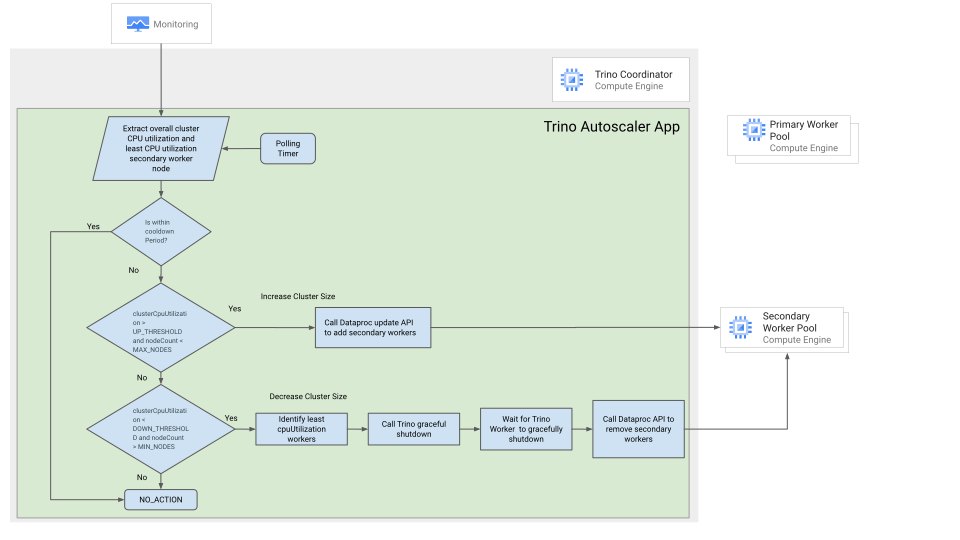

# Autoscaler for Trino on Dataproc

[Apache Hadoop](https://hadoop.apache.org/) is an open-source software framework
for distributed storage and processing of large datasets on clusters of
commodity hardware. It provides a reliable, scalable, and distributed computing
platform for big data processing. Hadoop utilizes a centralized resource manager
component called YARN (Yet Another Resource Negotiator) for allocating
resources, monitoring, and managing the cluster.

[Trino](https://trino.io/) is an open-source, distributed SQL query engine for
big data. It can run on top of Hadoop, Hive and other data lakes and warehouses.
In Trino, resource allocation and management are driven by the Trino
Coordinator, which is responsible for query coordination, planning, and resource
allocation. Trino dynamically allocates resources (CPU and memory) on a
fine-grained level for each query. Trino clusters often rely on external cluster
management systems like Kubernetes for resource allocation and scaling. These
systems handle cluster resource provisioning and scaling dynamically.

[Dataproc](https://cloud.google.com/dataproc?hl=en) is a managed Hadoop and
Spark service that makes it easy to run big data workloads in the cloud.
Dataproc currently supports autoscaling for yarn-based applications such as Hive
and Spark, but not for non-yarn applications such as Trino. This has led some
enterprises to migrate from Trino on Dataproc to Trino on GKE in order to use
autoscaling. However, Trino on GKE can be more complex and costly to manage than
Trino on Dataproc. This solution provides a reliable and scalable auto scaling
solution for Trino on Dataproc.

Trino deployment on Dataproc uses the embedded discovery service. Every Trino
node connects with the discovery service on startup and periodically sends a
heartbeat signal.

When adding an extra worker to the cluster, the worker registers with the
discovery service, allowing the Trino coordinator to start scheduling new tasks
for the fresh workers. Removing a worker from the cluster is slightly difficult
if a worker suddenly shuts down, which can result in complete query failure.

Trino has a
[graceful shutdown API](https://trino.io/docs/current/admin/graceful-shutdown.html)
that can be used exclusively on workers in order to ensure they terminate
without affecting running queries. The shutdown API puts the worker in a
`SHUTTING_DOWN` state when the coordinator stops sending new tasks, though the
currently executing tasks will continue, after which the Trino worker will exit.

This Trino worker behavior requires the solution to monitor workers to
gracefully exit before removing the VM from the cluster.

## Benefits

This solution provides the following benefits.

-   Improved performance and scalability: By automatically scaling the Trino
    cluster up and down based on demand this solution can help to improve the
    performance and scalability of Trino workloads.

-   Improved reliability: By automatically scaling the Trino cluster up and
    down, this solution can help to improve the reliability of Trino workloads
    by ensuring that there are always enough resources available to execute
    queries.

This document is intended for audiences that need to run Trino on Dataproc and
want to take advantage of autoscaling to improve performance and optimize costs.
This guide assumes that you're familiar with Trino and Dataproc, without the
need to be an expert and run simple shell and terraform scripts.

## Architecture

The solution uses [Cloud Monitoring](http://cloud.google.com/monitoring) to
collect the overall cluster CPU utilization and the details of the least
CPU-utilizing secondary worker nodes. It then uses this information to make
decisions about scaling the cluster up or down.

The system adds secondary worker nodes when the CPU utilization goes higher than
the configured threshold upto the configured max_nodes. Trino coordinator
automatically detecta the new nodes through its discovery service. When the
cluster utilization falls below the configured threshold, the system will reduce
the least busy workers. The system will wait for the Trino worker to gracefully
shut down before the node is removed. In all other cases, no action will be
taken.

## Limitations

-   Autoscaling is achieved solely through secondary worker pool resizing. \
    (Secondary worker pool is you configured in Dataproc cluster)

-   Autoscaling of Dataproc for Trino workloads occurs based on overall cluster
    CPU utilization metrics collected from Cloud Monitoring.

-   Cloud Monitoring metrics may not be current and can have latencies.

-   Trino Coordinator does not redistribute existing jobs when adding new
    workers, existing jobs continue to run on bound workers.

-   Autoscaling application runs on the coordinator node and autoscaling needs
    to be disabled in Dataproc.

## Configuration Details

Set the `config.textproto` parameters for the autoscaler:

Parameter                          | Description                                                                                    | Sample Value
---------------------------------- | ---------------------------------------------------------------------------------------------- | ------------
`cpu_threshold_high`               | The CPU utilization threshold above which the cluster will be scaled up                        | `0.4`
`cpu_threshold_low`                | The CPU utilization threshold below which the cluster will be scaled down                      | `0.2`
`max_instances`                    | The maximum number of secondary nodes in the cluster                                           | `10`
`min_instances`                    | The minimum number of secondary nodes in the cluster                                           | `0`
`cluster_expand_logic`             | The number of nodes to add when the cluster is scaled up                                       | `5`
`cluster_shrink_logic`             | The number of nodes to remove when the cluster is scaled down                                  | `2`
`trino_graceful_shutdown_duration` | The time to wait for Trino workers to gracefully shut down before a node is removed            | `[2m,60m] PT2M`
`polling_duration`                 | The interval at which Dataproc polls the Monitoring API to collect cluster utilization metrics | `PT2M`
`cooldown_duration`                | The time to wait after a cluster action of expand/shrink has been executed                     | `PT5M`

Set the parameters to be passed to the terraform script:

`Parameter`                        | Sample Value
---------------------------------- | -----------------------------------
`project_id`                       | E.g. `dataproc_trino12232`
`region`                           | default: `"us-central1"`
`zone`                             | default: `"us-central1-a"`
`dataproc_staging_gcs_bucket_name` | default: `"null"`
`dataproc_cluster_name`            | default: `"trino-dataproc-cluster"`
`autoscaler_folder`                | default: `"trino-autoscaler"`

## Deployment

Follow the instructions for [deployment](deployment.md)

## Demo

You can run a demo of the tool using the [demo deployment](demo.md)
instructions.

Please follow the YouTube video for a demo and explaination:

<!-- markdownlint-disable-next-line MD013 -->

## What's next

-   Learn more about [Dataproc](https://cloud.google.com/dataproc)
-   Learn more about [Trino](https://trino.io)

## Disclaimer

License: Apache 2.0

This is not an official Google product.
