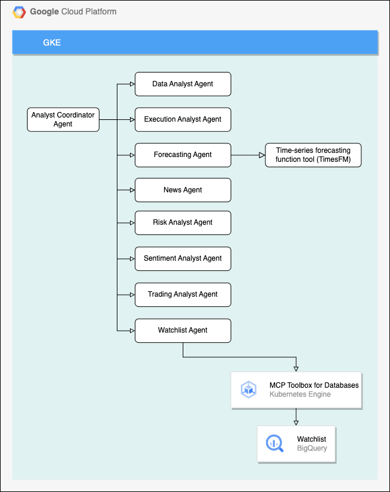

# FSI Quant Assistant

This demo showcases how customers can make natural language requests for
sophisticated financial analysis. By combining real-time market data from open
financial APIs with stored portfolio information, the system delivers AI-powered
insights, identifies market relationships, and generates future predictions
using the TimesFM forecasting model.

Here are the core functionalities that the repo provides:

- **AI/Infrastructure**: Illustrating the use of AI and GKE infrastructure.

- **Deploying** and illustrating the performance and flexibility of open models
  on GKE: Secure mechanisms for user login and access control.

- **ADK**: Showing the ease of using Agent Development Kit (ADK) to build
  powerful financial solutions.

## Solution Diagram



## Prerequisites

- A Google Cloud Project:
    - Project ID of a new or existing Google Cloud Project, preferably with no
      APIs enabled.
    - You must have roles/owner or equivalent IAM permissions on the project.
- Development environment with:
    - [Google Cloud SDK](https://cloud.google.com/sdk) (gcloud CLI)
    - [Terraform](https://www.terraform.io/) (version 1.0+)
    - [kubectl](https://kubernetes.io/docs/tasks/tools/)
    - [git](https://git-scm.com/)
- You can also use [Cloud Shell](https://shell.cloud.google.com) which comes
  preinstalled with all required tools.
- Familiarity with:
    - [Google Kubernetes Engine](https://cloud.google.com/kubernetes-engine)
    - [Terraform](https://www.terraform.io/)
    - [Kubernetes](https://kubernetes.io/)

## Getting Started

```bash
# Log in with Application Default Credentials (ADC)
gcloud auth application-default login

# Set the specified project as the active project in your configuration
GCP_PROJECT_ID=[YOUR_PROJECT_ID]
gcloud config set project $GCP_PROJECT_ID

# Create Terraform state bucket
BUCKET_NAME="${GCP_PROJECT_ID}-tf-state"
LOCATION="us"

gcloud storage buckets create "gs://${BUCKET_NAME}" --location="${LOCATION}" --uniform-bucket-level-access

cd ./deployment/terraform

# Create tfbackend file
TF_BACKEND=${BUCKET_NAME}.tfbackend
echo -n 'bucket = "'${BUCKET_NAME}'"' > environment/${TF_BACKEND}

# Create TF vars file
echo -n 'project_id = "'${GCP_PROJECT_ID}'"' > terraform.tfvars

# Open up terraform.tfvars and add an entry for your hugging face api key and finnhub api key.
project_id = "[YOUR_PROJECT_ID]"
hugging_face_api_token = "[YOUR_HUGGING_FACE_API_TOKEN]"
finnhub_api_key = "[YOUR_FINNHUB_API_KEY]"

gcloud services enable \
    compute.googleapis.com \
    cloudresourcemanager.googleapis.com

terraform init -backend-config=./environment/${TF_BACKEND}
terraform plan -var-file ./terraform.tfvars -out=tfplan
terraform apply tfplan

REGION=$(terraform output -raw region)
ADK_BUILDER_SERVICE_ACCOUNT_ID=$(terraform output -raw adk_builder_service_account_id)

# Build and push the image for the adk agent application to artifact registry
cd ../../adk-agent/

gcloud builds submit \
    --config=cloudbuild.yaml \
    --substitutions=_REGION=${REGION},_PROJECT_ID=${GCP_PROJECT_ID} \
    --project=${GCP_PROJECT_ID} \
    --service-account=${ADK_BUILDER_SERVICE_ACCOUNT_ID} \
    --region=${REGION} \
    .

cd ../deployment/gke/cloud_build

# Create kube service account for adk agent
gcloud builds submit \
    --config="create-service-account.yaml" \
    --substitutions=_REGION=${REGION},_GCP_SERVICE_ACCOUNT=adk-agent,_KSA_SERVICE_ACCOUNT=adk-agent-ksa,_NAMESPACE=adk-agent-demo \
    --project=${GCP_PROJECT_ID} \
    --service-account=${ADK_BUILDER_SERVICE_ACCOUNT_ID} \
    --region=${REGION} \
    --no-source

# Create kube service account for mcp toolbox for databases
gcloud builds submit \
    --config="create-service-account.yaml" \
    --substitutions=_REGION=${REGION},_GCP_SERVICE_ACCOUNT=toolbox-identity,_KSA_SERVICE_ACCOUNT=toolbox-identity-ksa,_NAMESPACE=mcp-toolbox-demo \
    --project=${GCP_PROJECT_ID} \
    --service-account=${ADK_BUILDER_SERVICE_ACCOUNT_ID} \
    --region=${REGION} \
    --no-source

# Create kube service account for gemma agent
gcloud builds submit \
    --config="create-service-account.yaml" \
    --substitutions=_REGION=${REGION},_GCP_SERVICE_ACCOUNT=gemma-agent,_KSA_SERVICE_ACCOUNT=gemma-agent-ksa,_NAMESPACE=gemma-gke-demo \
    --project=${GCP_PROJECT_ID} \
    --service-account=${ADK_BUILDER_SERVICE_ACCOUNT_ID} \
    --region=${REGION} \
    --no-source

cd ../mcp-tools-for-databases/

# Apply manifest for mcp toolbox for databases deployment
gcloud builds submit \
    --config=../cloud_build/deploy.yaml \
    --substitutions=_REGION=${REGION} \
    --project=${GCP_PROJECT_ID} \
    --service-account=${ADK_BUILDER_SERVICE_ACCOUNT_ID} \
    --region=${REGION} \
    .

cd ../adk-agent/

# Apply manifest for adk agent deployment
gcloud builds submit \
    --config=../cloud_build/deploy.yaml \
    --substitutions=_REGION=${REGION} \
    --project=${GCP_PROJECT_ID} \
    --service-account=${ADK_BUILDER_SERVICE_ACCOUNT_ID} \
    --region=${REGION} \
    .

cd ../gemma/

# Apply manifest for gemma deployment
gcloud builds submit \
    --config=../cloud_build/deploy.yaml \
    --substitutions=_REGION=${REGION} \
    --project=${GCP_PROJECT_ID} \
    --service-account=${ADK_BUILDER_SERVICE_ACCOUNT_ID} \
    --region=${REGION} \
    .
```

To update and roll the image used by the adk agent:

```bash
gcloud builds submit \
    --config=../cloud_build/rolling-deployment.yaml \
    --substitutions=_REGION=${REGION} \
    --project=${GCP_PROJECT_ID} \
    --service-account=${ADK_BUILDER_SERVICE_ACCOUNT_ID} \
    --region=${REGION} \
    --no-source
```

To further configure, use the bastion host:

```bash
# SSH to compute instance
gcloud compute ssh --zone "us-central1-c" "adk-agent-vpc-jump-instance" --tunnel-through-iap --project ${GCP_PROJECT_ID}
```

To install the dependencies required for managing the deployments using the
compute instance see the install_tools script at
/deployment/terraform/scripts/install_tools.sh.
