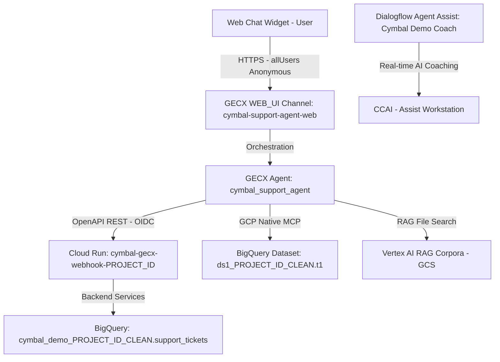

# Cymbal Support Agent — AI Agent Automated Deployment & Cloud Setup Guide (`DEPLOYMENT_INSTRUCTION.md`)

> [!IMPORTANT] **Target Audience**: AI Agents (e.g., Antigravity, Gemini CLI,
> Claude Code) and Google Cloud Solutions Architects. **Scope**: This document
> covers 100% of required dependencies, GCP API enablement, SCRAPI installation,
> infrastructure provisioning, container builds, and agent deployment for a
> brand new GCP project. **Primary Agent**:
> `src/gecx_agent/cymbal_support_agent` (Legacy agents `cymbal-support-agent`
> and `cymbal_ccaas_agent` are strictly excluded).

---

## 0. Mandatory Proactive AI Agent Intake & Configuration Protocol

> [!IMPORTANT] **MANDATE FOR ALL AI AGENTS (Antigravity / Gemini CLI / Claude
> Code)**: When a user says _"I want to deploy this solution"_ or invokes
> deployment, DO NOT passively fail if `.env` or `terraform.tfvars` is missing
> or empty. You MUST proactively execute this 3-step Intake Protocol FIRST:

### Step 1: Proactive Interactive Interview

Ask the user the following 4 key deployment questions (presenting defaults where
applicable):

1.  **Target GCP Project ID**: _"Which Google Cloud Project ID would you like to
    deploy this solution to? (e.g., `<your-project-id>`)"_
1.  **Target Region**: _"Which GCP region should we use? (default:
    `us-central1`)"_
1.  **Agent Assist Conversation Profile**: _"Do you have an existing Dialogflow
    Agent Assist Conversation Profile ID, or should Terraform automatically
    create and deploy the `Cymbal Demo` AI Coach for you? (default: Auto-create
    / leave empty)"_
1.  **Secret Key**: _"Do you want to use the default cryptographic secret key
    (`cymbal-secure-secret-999`) or provide a custom key?"_

### Step 2: Automated Configuration Generation

Once the user answers (or confirms defaults), automatically generate or update
both configuration files:

1.  Create/update the root `.env` file:

```ini
GCP_PROJECT_ID="<USER_TARGET_PROJECT_ID>"
GCP_REGION="<USER_REGION>"
CONVERSATION_PROFILE_ID="<USER_PROFILE_ID_OR_EMPTY>"
SECRET_KEY="<USER_SECRET_KEY>"
```

1.  Automatically synchronize `terraform/terraform.tfvars`:

```ini
project_id              = "<USER_TARGET_PROJECT_ID>"
region                  = "<USER_REGION>"
conversation_profile_id = "<USER_PROFILE_ID_OR_EMPTY>"
ces_service_agent       = "service-508593438664@gcp-sa-ces.iam.gserviceaccount.com"
```

### Step 3: Pre-Flight Confirmation Table

Display a clear summary table of the configured parameters to the user and
request explicit confirmation (_"Proceed to deploy?"_) before initiating
Terraform provisioning or build scripts.

> [!TIP] **Autonomous / Sub-Agent Execution Mode**: If a Target GCP Project ID
> (e.g., `<your-project-id>`) is already specified in your prompt or task
> description when you are invoked as an autonomous agent or sub-agent, you MUST
> bypass interactive prompting, apply that Target Project ID directly to `.env`
> and `terraform.tfvars`, and proceed immediately through all 7 Phases below
> without waiting for user input.

---

## 1. Architectural Overview & Prerequisite Verification

This repository deploys an enterprise-grade Google Customer Engagement Suite
(GECX / CXAS) virtual agent (`cymbal_support_agent`) integrated with Google
Cloud Run, BigQuery, Dialogflow CX Agent Assist, and Vertex AI.



---

## 2. Zero-to-Hero Clean Environment Runbook (New GCP Project)

To clone this repository and deploy to a brand new GCP project from scratch,
follow these 7 chronological phases:

### Phase 0: System & CLI Prerequisite Installation

> [!IMPORTANT] **Mandatory Billing & Quota Setup**: To prevent quota exhaustion
> or permission errors (e.g., `403 Forbidden` on service usage APIs) during
> deployment, you MUST complete these steps **before** initializing Terraform:
>
> 1.  **Link a Billing Account**: Confirm that the target GCP project has a
>     valid billing account linked.
> 1.  **Configure ADC Quota Project**: Force your Application Default
>     Credentials (ADC) to bill quota to the target project:
>
> ```bash
> gcloud auth application-default set-quota-project "${GCP_PROJECT_ID}"
> ```
>
> 1.  **Assign IAM Roles**: The deploying identity requires the **`Owner`** or
>     **`Editor`** role, PLUS **`roles/resourcemanager.projectIamAdmin`** to
>     configure resource-level IAM policies for service accounts.

Ensure the local workstation or AI Agent container has the following system
dependencies installed:

1.  **Google Cloud SDK (`gcloud` CLI)** with beta components:

```bash
gcloud --version
gcloud components install beta --quiet
gcloud auth login
gcloud auth application-default login --quiet
gcloud auth application-default set-quota-project "${GCP_PROJECT_ID}" --quiet
gcloud config set billing/quota_project "${GCP_PROJECT_ID}" --quiet
```

1.  **HashiCorp Terraform CLI** (v1.3+ / v1.5+):

```bash
terraform -version
```

1.  **Python 3.10+ & Virtual Environment**:

```bash
python3 --version
```

1.  **Git**:

```bash
git --version
```

### Phase 1: New GCP Project Mandatory API Enablement

Execute the following command to enable 100% of required Google Cloud API
services on the target project:

```bash
gcloud services enable \
    cloudresourcemanager.googleapis.com \
    serviceusage.googleapis.com \
    orgpolicy.googleapis.com \
    iam.googleapis.com \
    aiplatform.googleapis.com \
    run.googleapis.com \
    bigquery.googleapis.com \
    cloudbuild.googleapis.com \
    artifactregistry.googleapis.com \
    dialogflow.googleapis.com \
    discoveryengine.googleapis.com \
    compute.googleapis.com \
    iap.googleapis.com --project="${GCP_PROJECT_ID}" --quiet
```

### Phase 1.2: Disable `requireInvokerIam` Organization Policy (for Public Cloud Run Access)

By default, enterprise Google Cloud organizations enforce
`constraints/run.managed.requireInvokerIam`, which blocks binding `allUsers`
(`roles/run.invoker`) on Cloud Run services.

> [!TIP] **Automated in `./scripts/setup.sh`**: Our deployment script
> (`./scripts/setup.sh`) automatically checks and resets both
> `constraints/run.managed.requireInvokerIam` and
> `constraints/iam.allowedPolicyMemberDomains` (`allowAll: true`) via Org Policy
> V2 before running Terraform! You do not need to run manual org-policy commands
> if you use `./scripts/setup.sh`.

### Phase 2: Environment Variable Configuration (`.env`)

Create a `.env` file in the repository root containing your target project
settings:

```ini
GCP_PROJECT_ID="YOUR_NEW_GCP_PROJECT_ID"
GCP_REGION="us-central1"
CONVERSATION_PROFILE_ID=""
SECRET_KEY="cymbal-secure-secret-999"
```

_(Note: Leave `CONVERSATION_PROFILE_ID` empty so Terraform automatically creates
and deploys the `Cymbal Demo` AI Coach Conversation Profile)._

### Phase 3: SCRAPI (`cxas-scrapi`) & Python Package Installation

This project relies on **SCRAPI (`cxas-scrapi`)** — the canonical Google
Customer Experience Agent Studio CLI and Python SDK (`cxas`). To install SCRAPI
and all required backend dependencies (`FastAPI`, `uvicorn`,
`google-cloud-bigquery`, `google-cloud-dialogflow`):

```bash
# 1. Create and activate a clean Python virtual environment
python3 -m venv venv
source venv/bin/activate

# 2. Upgrade pip and install all required packages from requirements.txt
# Note: If your local pip mirror lacks cxas-scrapi, pass --index-url=https://pypi.org/simple/
pip install --upgrade pip
pip install --index-url=https://pypi.org/simple/ --require-hashes -r scripts/requirements.txt

# 3. Verify SCRAPI (cxas CLI) installation
./venv/bin/cxas --help
```

_Why this matters: `scripts/requirements.txt` includes `cxas-scrapi`, which
provides both the terminal command `./venv/bin/cxas` and the `cxas_scrapi`
Python API imported by our deployment scripts._

---

## 3. Infrastructure as Code (Terraform Provisioning)

> [!CAUTION] **Zero-Mock Policy & Safe IaC Mandate**: Never execute
> `terraform destroy` without explicit human authorization. Always review
> `terraform plan` before applying.

### Step-by-Step Execution

```bash
cd terraform
terraform init
terraform validate
terraform plan -out=tfplan
terraform apply tfplan
cd ..
```

### What This Terraform Provisions

1.  **BigQuery Datasets & Tables**:

- `cymbal_demo_${GCP_PROJECT_ID_UNDERLINE}.support_tickets`: Primary CRM
  ticketing database. (Where `GCP_PROJECT_ID_UNDERLINE` is the project ID with
  hyphens replaced with underscores).
- `ds1_${GCP_PROJECT_ID_UNDERLINE}.t1`: Operational metrics table (`c1` STRING,
  `c2` STRING, `c3` INTEGER) queried directly by `cymbal_support_agent`.

1.  **Dialogflow Agent Assist Conversation Profile**:

- Automatically deploys `terraform/assets/coaches/ai-coach.json` (`Cymbal Demo`
  AI Coach, version `2.5`, `en-US`, `END_OF_UTTERANCE` trigger) when
  `CONVERSATION_PROFILE_ID` is empty.

1.  **Cloud Run Microservices**:

- `cymbal-gecx-webhook-${GCP_PROJECT_ID}`: OpenAPI tool execution backend.
- `cymbal-bff-web-${GCP_PROJECT_ID}`: Customer-facing Web portal and WebRTC
  intake interface.

1.  **IAM Role Bindings**:

- Grants `roles/bigquery.dataViewer` and `roles/bigquery.jobUser` to the
  GECX/CES service agent (`service-NUMBER@gcp-sa-ces.iam.gserviceaccount.com`).
- Grants `roles/run.invoker` to `allUsers` (anonymous access) on both Cloud Run
  services so external users and chat widgets can connect without 403 errors.

---

## 4. Container Build & Cloud Run Service Configuration

Rebuild and deploy all application containers using the canonical setup script:

```bash
./scripts/setup.sh
```

- **Why `./scripts/setup.sh`?** It checks and resets Org Policy constraints
  (`requireInvokerIam` and `allowedPolicyMemberDomains`), computes a SHA-256
  content hash of `src/`, pushes immutable container tags (`:sha-xxxx`) to
  Artifact Registry, applies Terraform, and automatically deploys and links the
  `Cymbal Demo` AI Coach Generator to your Conversation Profile!

---

## 5. Deploying the Agent (`cymbal_support_agent`)

To deploy the GECX agent and configure the web widget channel, execute:

```bash
source venv/bin/activate
python3 scripts/deploy_agent.py --widget-title "Cymbal Support"
```

### Automatic Actions Performed by `deploy_agent.py`

1.  **Webhook URL Auto-Resolution**: Queries
    `gcloud run services describe cymbal-gecx-webhook-${GCP_PROJECT_ID}` to
    obtain the live HTTPS URL.
1.  **OpenAPI Schema Generation**: Reads `open_api_schema.template.yaml`,
    substitutes `${webhook_cloud_run_url}`, and generates production-ready
    `.yaml` files.
1.  **GECX App Bootstrapping & SCRAPI Push (`cxas push`)**: Automatically checks
    if `cymbal-support-agent` exists; if not, executes `cxas create` first to
    prevent 500 API errors, then synchronizes
    `src/gecx_agent/cymbal_support_agent` with Google Customer Engagement Suite
    using `cxas_scrapi`.
1.  **Channel Creation & Public Access Enablement**: Creates the `WEB_UI`
    channel (`cymbal-support-agent-web`) and updates its security settings to
    enable public access.

### 5.3 Deploy and Link Dialogflow AI Coach Generator (`manage_agent_assist_coaches.py`)

To provision the real-time generative AI Coach (`Cymbal Demo`, version `2.5`)
and attach it to your Dialogflow Conversation Profile:

```bash
# 1. Deploy the AI Coach Generator brain from JSON
python3 scripts/manage_agent_assist_coaches.py deploy \
    --project="${GCP_PROJECT_ID}" \
    --config="terraform/assets/coaches/ai-coach.json" \
    --id="generator-ai-coach"

# 2. Link the Generator to the Conversation Profile
python3 scripts/manage_agent_assist_coaches.py link \
    --project="${GCP_PROJECT_ID}" \
    --profile="Cymbal Coach - Cymbal Demo" \
    --generator="projects/${GCP_PROJECT_ID}/locations/global/generators/generator-ai-coach"
```

> [!TIP] **Automated in `./scripts/setup.sh`**: Our deployment script
> (`./scripts/setup.sh`) automatically executes
> `manage_agent_assist_coaches.py deploy` and `link` after Terraform finishes!
> You only need to run these commands manually if you skipped `setup.sh` or want
> to re-link your coach.

---

## 6. Critical Tricks & Traps (Lessons Learned)

The AI Agent MUST observe these 14 critical architectural rules and workarounds:

### Trick 1: The `.template.yaml` OpenAPI Webhook URL Resolution Trick

- **The Trap**: GECX OpenAPI tool schemas require an absolute URL in
  `servers[].url`. Hardcoding URLs causes failures across different GCP projects
  or Cloud Run deployments.
- **The Trick**: Keep `*.template.yaml` files in Git containing
  `- url: ${webhook_cloud_run_url}`. In `scripts/deploy_agent.py`, the
  `update_openapi_schema_urls()` function dynamically fetches the live Cloud Run
  webhook URL via `gcloud` and generates `open_api_schema.yaml` before running
  `cxas push`.

### Trick 2: Public Access Security FieldMask Trap on `WEB_UI` Channels

- **The Trap**: Calling `deployments_client.create_deployment(...)` creates a
  Web UI channel with public access disabled by default, resulting in
  `400 FAILED_PRECONDITION: Public access is not enabled for the deployment`
  when users open the chat widget.
- **The Trick**: Immediately after channel creation, invoke
  `deployments_client.update_deployment(...)` with
  `FieldMask(paths=["channel_profile.web_widget_config.security_settings.enable_public_access"])`
  and set `enable_public_access = True`.

### Trick 3: Dynamic GCP Project ID Lookup in Python Tools

- **The Trap**: Python tool functions (e.g., `query_bigquery_metrics`) copied
  from demo repos often have hardcoded project IDs (`"robertortega-ai-demo"`).
- **The Trick**: Use runtime detection via the Google Cloud Metadata Server
  Bridge
  (`http://metadata.google.internal/computeMetadata/v1/project/project-id` with
  `Metadata-Flavor: Google`) with a fallback to `os.getenv("GCP_PROJECT_ID")`.

### Trick 4: BigQuery MCP Toolset IAM Authorization

- **The Trap**: `toolsets/bigquery_mcp/bigquery_mcp.json` authenticates via
  `serviceAgentIdTokenAuthConfig`. If the GECX service account lacks IAM
  permissions, BigQuery tool calls fail silently.
- **The Trick**: Ensure `terraform/main.tf` explicitly grants
  `roles/bigquery.dataViewer` and `roles/bigquery.jobUser` to
  `serviceAccount:${var.ces_service_agent}`.

### Trick 5: Anonymous Public Access (`allUsers`) on Cloud Run Services

- **The Trap**: If Cloud Run IAM invokers are restricted to a specific user
  email or service account, external visitors or developers testing via browser
  or curl encounter `403 Forbidden`.
- **The Trick**: In `terraform/main.tf`, configure `member = "allUsers"` on
  `google_cloud_run_v2_service_iam_member.gecx_invoker` and `web_invoker` to
  permit anonymous public HTTP access.

### Trick 6: Dialogflow Conversation Profile Auto-Creation vs Override & Dynamic Environment Variable Fallback

- **The Trap**: If `var.conversation_profile_id` is non-empty, Terraform should
  not attempt to re-create or collide with an existing manual profile.
  Conversely, if `var.conversation_profile_id` is empty (`""`), setting
  `CONVERSATION_PROFILE_ID = var.conversation_profile_id` on the Cloud Run web
  service results in an empty string at runtime, causing
  `Configuration error: CONVERSATION_PROFILE_ID environment variable is missing`
  when human agents answer Agent Assist calls.
- **The Trick**: In `terraform/conversation_profiles.tf`, use
  `for_each = var.conversation_profile_id == "" ? local.coaches : {}` to
  auto-provision the AI Coach profile only when omitted. In `terraform/main.tf`,
  configure the Cloud Run environment variable using a ternary fallback:
  `value = var.conversation_profile_id != "" ? var.conversation_profile_id : google_dialogflow_conversation_profile.coach_profiles["ai-coach"].id`.

### Trick 7: Terraform `null_resource` Build Triggering

- **The Trap**: Editing Python code in `src/` does not automatically trigger
  Cloud Run container rebuilds in Terraform if the Docker tag is unchanged.
- **The Trick**: In `terraform/main.tf`, compute `local.image_tag` from a SHA256
  content hash of `src/` and include `image_tag = local.image_tag` in
  `resource "null_resource" "build_image"` triggers.

### Trick 8: Python Virtual Environment Isolation for SCRAPI (`cxas`)

- **The Trap**: Calling global `cxas` or running scripts without activating
  `venv` can cause package import failures.
- **The Trick**: Always activate `./venv/bin/activate` or use
  `./venv/bin/python3`. The deployment script imports `cxas_scrapi` directly
  from the virtual environment.

### Trick 9: Organization Policy `run.managed.requireInvokerIam` Blocking `allUsers`

- **The Trap**: When Terraform attempts to bind `member = "allUsers"` to Cloud
  Run services (`gecx_invoker` and `web_invoker`), GCP may throw an Organization
  Policy violation if `constraints/run.managed.requireInvokerIam` is enforced by
  the parent organization.
- **The Trick**: Before running `terraform apply`, `./scripts/setup.sh`
  automatically resets `constraints/run.managed.requireInvokerIam` and
  `constraints/iam.allowedPolicyMemberDomains` via Org Policy V2 on the target
  project.

### Trick 10: Terraform Provider Limitation on AI Coach Generators

- **The Trap**: Terraform `google_dialogflow_conversation_profile` and
  `google_dialogflow_generator` in the `google-beta` provider do not support
  `agent_coaching_context` or AI Coach generator attachments in HCL syntax.
  Relying solely on Terraform creates an empty Conversation Profile without AI
  coaching enabled.
- **The Trick**: `./scripts/setup.sh` automatically executes
  `scripts/manage_agent_assist_coaches.py deploy` and `link` post-Terraform to
  programmatically provision the AI Coach Generator via the Dialogflow v2beta1
  Python SDK and bind it to `human_agent_assistant_config`.

### Trick 11: Brand New Project GECX App Bootstrapping (`cxas create` before `cxas push`)

- **The Trap**: On a brand new GCP project, calling
  `cxas push --to projects/.../apps/cymbal-support-agent` fails with HTTP 500
  (`internal error 13`) if the app resource does not exist yet.
- **The Trick**: In `scripts/deploy_agent.py`, the `ensure_gecx_app_exists()`
  function checks for app existence via `cxas apps get` before pushing; if not
  found, it automatically executes `cxas create` to initialize the app skeleton.

### Trick 12: Dialogflow Conversation Profile Display Name vs Resource ID Resolution in `manage_agent_assist_coaches.py link`

- **The Trap**: When running
  `manage_agent_assist_coaches.py link --profile="Cymbal Coach - Cymbal Demo"`,
  the command can fail with
  `404 NOT_FOUND: Session Profile [Cymbal Coach - Cymbal Demo] not found in project`
  if the script treats `--profile` as an alphanumeric resource ID rather than a
  display name. Furthermore, in `scripts/setup.sh`, appending `|| true` to the
  `link` command masks this failure and silently leaves the Conversation Profile
  without AI coaching enabled.
- **The Trick**: In `scripts/manage_agent_assist_coaches.py`,
  `link_generator_to_profile()` must resolve display names by querying
  `ConversationProfilesClient.list_conversation_profiles(parent=parent)` when
  `--profile` does not contain a slash (`/`), matching against `p.display_name`
  (or `p.name`), and using the canonical resource `.name`
  (`projects/<project_id>/locations/global/conversationProfiles/<id>`).

### Trick 13: SCRAPI (`cxas`) CLI Syntax for `apps get` and IAM Propagation Delay / 409 Resource Already Exists Handling

- **The Trap**: Calling `cxas get --app <app_id>` fails with exit code 2 because
  `'get'` is not a valid top-level command in SCRAPI (`cxas`), and `--app` is an
  invalid option for checking apps. This causes `ensure_gecx_app_exists()` to
  falsely assume the app does not exist and call `cxas create`, which then
  crashes with `HTTP 409 Resource already exists`. On a brand new project,
  calling `cxas create` immediately after API enablement can also fail with
  `HTTP 500 internal error 13` due to GCP regional IAM/identity propagation
  latency.
- **The Trick**: In `scripts/deploy_agent.py`, write
  `check_cmd = ["apps", "get", f"projects/{project_id}/locations/{location}/apps/{app_id}"]`
  (using positional app resource name). In the `cxas create` exception block,
  implement a 3-attempt retry loop with 15-second backoff for GCP IAM
  propagation delay, and explicitly catch `'already exists'` in `res.stderr` so
  the script can proceed without crashing.

### Trick 14: Application Default Credentials (ADC) Quota Project Ordering on Brand New Projects

- **The Trap**: When running `scripts/manage_agent_assist_coaches.py deploy` and
  `link` via `scripts/setup.sh`, the Dialogflow API calls may fail with:

    ```text
    403 Your application is authenticating by using local Application
    Default Credentials. The dialogflow.googleapis.com API requires a
    quota project, which is not set by default.
    ```

    If `gcloud auth application-default set-quota-project "${GCP_PROJECT_ID}"`
    is executed before Phase 1 (API Enablement), it fails with
    `SERVICE_DISABLED` for `cloudresourcemanager.googleapis.com`.

- **The Trick**: Execute
  `gcloud auth application-default set-quota-project "${GCP_PROJECT_ID}" --quiet`
  _after_ Phase 1 (`gcloud services enable ...`) has enabled the Cloud Resource
  Manager API on the target project, or ensure `scripts/setup.sh` sets the ADC
  quota project immediately after enabling APIs.

---

## 7. Post-Deployment Functional Verification

After deployment completes, perform the following end-to-end functional
verifications on your newly provisioned environment:

1.  **Retrieve the Live Web Application URL**:

```bash
gcloud run services describe cymbal-bff-web-${GCP_PROJECT_ID} --region=us-central1 --format='value(status.url)'
```

1.  **End-to-End Customer Engagement & Voice Coaching Verification**:

- **Web Chat Agent Interaction**: Open the retrieved HTTPS URL in a browser,
  click the bottom-right chat bubble (`Cymbal Support`), and verify
  conversational responses from `cymbal_support_agent`.
- **BigQuery Tool Invocation (`ds1_${GCP_PROJECT_ID_UNDERLINE}.t1`)**: Ask the
  agent for live operational metrics or ticket intake to verify real-time SQL
  execution against `ds1_${GCP_PROJECT_ID_UNDERLINE}.t1` and
  `cymbal_demo_${GCP_PROJECT_ID_UNDERLINE}.support_tickets`.
- **Agent Assist Real-Time Coaching**: Initiate a WebRTC voice call and open the
  agent assist workstation to confirm Dialogflow CX Agent Assist streams live
  suggestions from the `Cymbal Demo` AI Coach as the customer speaks.

---

## 8. Restrictive Environment Troubleshooting & State Hygiene

### 1. Quota & Billing Project Override Failures (403 Forbidden)

- **The Issue**: In some restrictive GCP folders or organizations, using target
  project billing quota override (`user_project_override = true`) is prohibited
  for the deploying identity. This will cause Terraform init or plan to fail
  with quota configuration errors.
- **The Fix**: If you are blocked by organization policies, you must manually
  edit `terraform/main.tf` to set `user_project_override = false` and remove
  `billing_project` from the provider blocks:

    ```tf
    provider "google" {
      project = var.project_id
      region  = var.region
      # Comment out or set to false:
      user_project_override = false
      # billing_project       = var.project_id
    }
    ```

### 2. Terraform State Contamination & Access Errors

- **The Issue**: If you previously ran Terraform against a different project and
  then changed `project_id` in `terraform.tfvars`, Terraform will attempt to
  read/refresh resources from the old project, failing with 403 Forbidden
  because you may no longer have permissions (or are using a different context).
- **The Fix**: Reset your local state environment to start fresh:

    ```bash
    # Run from the root projects/gecx-ticketing-creation directory
    rm -rf terraform/.terraform \
      terraform/terraform.tfstate \
      terraform/terraform.tfstate.backup
    cd terraform && terraform init
    ```
