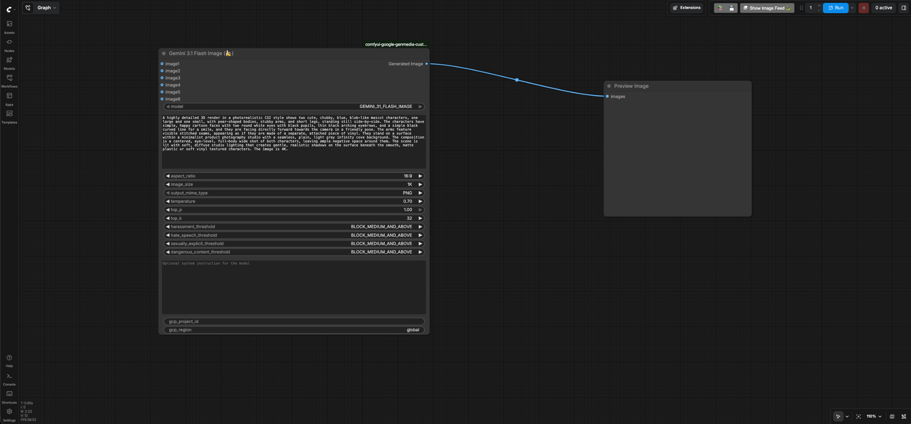
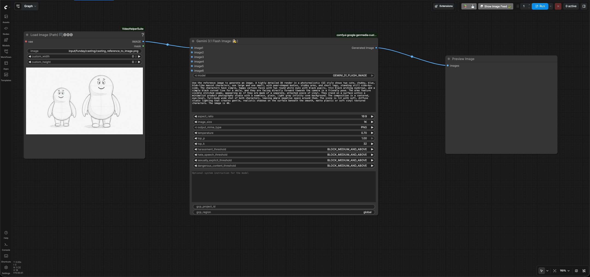

# Casting

## Generate casting characters using Text To Image feature

- Go to ComfyUI. Click the `Workflows` menu on the left and select `casting` >
  `casting_text_to_image.json`.
- It will open the workflow in ComfyUI which will look like the following image:
  
- Enter your GCP project id in the `gcp_project_id` input field of the
  `Gemini 3.1 Flash Image`(Nano Banana) node and leave the `region` input as
  "global"
- Review the text prompt which follows the formula [Subject] + [Action] +
  [Location/context] + [Composition] + [Style] based on the
  [prompting best practices for Nano Banana](https://cloud.google.com/blog/products/ai-machine-learning/ultimate-prompting-guide-for-nano-banana?e=48754805).

    ```text
    A highly detailed 3D render in a photorealistic CGI style shows two cute,
    chubby, blue, blob-like mascot characters, one large and one small, with
    pear-shaped bodies, stubby arms, and short legs, standing still
    side-by-side. The characters have simple, happy cartoon faces with two round
    white eyes with black pupils, thin black arching eyebrows, and a simple
    black curved line for a smile, and they are facing directly forward towards
    the camera in a friendly pose. The arms feature visible stitched seams,
    appearing as if they are made of a separate, attached piece of vinyl. They
    stand on a surface within a minimalist product photography studio with a
    seamless, plain, light gray infinity cove background. The composition is a
    centered, eye-level, full-body wide shot of both characters, leaving ample
    negative space around them. The scene is lit with soft, diffuse studio
    lighting that creates gentle, realistic shadows on the surface beneath the
    smooth, matte plastic or soft vinyl textured characters. The image is 4K.
    ```

- Run the workflow. You will get an image similar to the
  [casting text to image output](./output/casting/casting_text_to_image_output.png).

## Generate casting characters from the sketch using Reference To Image feature

Let's say you iterate over the previous steps and generate different images by
tweaking the inputs and prompts of the Nano Banana ComfyUI custom node. But, in
the end you want more fine grained control and get a sketch artist create a
sketch for your characters. Once , you have the sketch based on your
requirements, you can use the Reference-to-Image feature in Nano Banana to
create the image from the sketch. We will use
[this sketch](./input/funday/casting/casting_reference_to_image.png) for the
demo.

- Go to ComfyUI. Click the `Workflows` menu on the left and select `casting` >
  `casting_reference_to_image.json`.
- It will open the workflow in ComfyUI which will look like the following image:
  
- Enter your GCP project id in the `gcp_project_id` input field of the
  `Gemini 3.1 Flash Image`(Nano Banana) node and leave the `region` input as
  "global"
- Review the text prompt. It is the same text prompt that you used earlier in
  Text-to-Image workflow but with a slight modification that tells Nano Banana
  to use the reference image in addition to the text.

You will get an image similar to the
[casting reference to image output](./output/casting/casting_reference_to_image_output.png).

Go back to the [user guide](./USER_GUIDE.md) to run the next phases.
