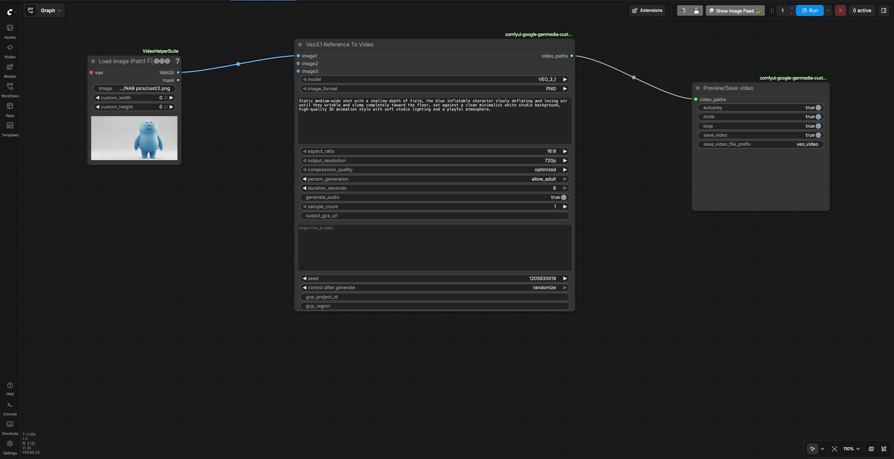
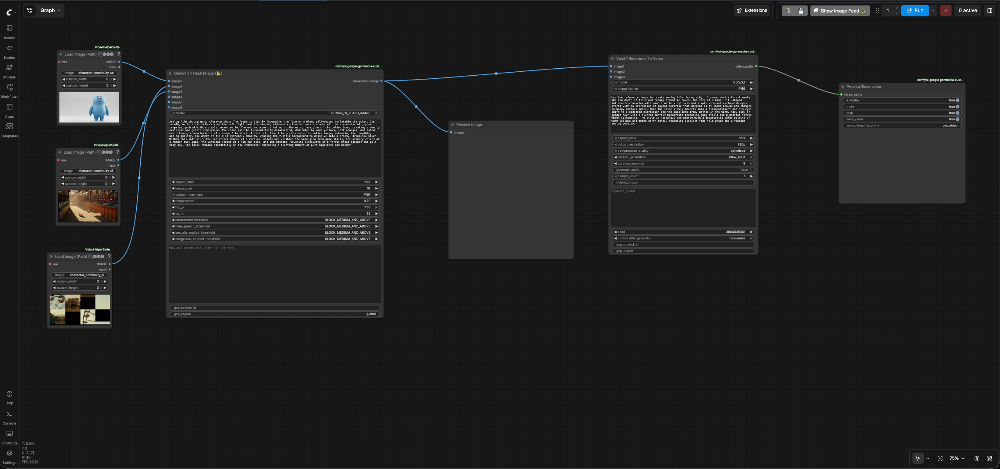

# Character Continuity

Let's check out how our characters look in different settings.

## Check how the character looks when deflating

- Go to ComfyUI. Click the `Workflows` menu on the left and select
  `character_continuity` > `character_continuity_deflation.json`.
- It will open the workflow in ComfyUI which will look like the following image:
  
- Enter your GCP project id in the `gcp_project_id` and region in `region` input
  fields of the `Veo 3.1` node.
- Review the text prompt which follows the formula [Cinematography] +
  [Subject] + [Action] + [Context] + [Style & Ambiance] based on the
  [prompting best practices for Veo](https://cloud.google.com/blog/products/ai-machine-learning/ultimate-prompting-guide-for-veo-3-1?e=48754805).

    ```text
    Static medium-wide shot with a shallow depth of field, the blue inflatable character
    slowly deflating and losing air until they wrinkle and slump toward the floor,
    set against a clean minimalist white studio background, high-quality 3D animation style
    with soft studio lighting and a playful atmosphere.
    ```

- Run the workflow. You will get an video similar to the
  [character continutiy deflation video output](./output/character_continuity/character_continuity_deflation_output.mp4).

## Check how the character looks while walking in the fair

- Go to ComfyUI. Click the `Workflows` menu on the left and select
  `character_continuity` > `character_continuity_scene1.json`.
- It will open the workflow in ComfyUI which will look like the following image:
  
- Enter your GCP project id in the `gcp_project_id` input field of both
  `Gemini 3.1 Flash Image` and `Veo 3.1` nodes.
- Leave the `region` input as "global" in `Gemini 3.1 Flash Image`(Nano Banana)
  node.
- Enter the region in `region` input field of the `Veo 3.1` node.
- Review the text prompt in `Gemini 3.1 Flash Image` node which follows the
  formula [Subject] + [Action] + [Location/context] + [Composition] + [Style]
  based on the
  [prompting best practices for Nano Banana](https://cloud.google.com/blog/products/ai-machine-learning/ultimate-prompting-guide-for-nano-banana?e=48754805).

    ```text
    Analog film photography, close-up shot: The frame is tightly focused on the face of a blue,
    pill-shaped inflatable character. Its smooth, matte vinyl skin catches the soft light, and
    its simple, wide-set cartoonish eyes are open with an expression of joyous surprise, paired
    with a simple curved smile. The entire scene is bathed in the warm, hazy glow of the golden
    hour, creating a deeply nostalgic and gentle atmosphere. The color palette is beautifully
    desaturated, dominated by warm yellows, soft oranges, and muted earth tones, characteristic
    of vintage film stock. A distinct, fine film grain covers the entire image, enhancing the
    tangible, analog quality. The depth of field is extremely shallow, causing the funfair
    background to dissolve into a creamy, dreamlike bokeh. Within this soft blur, the
    indistinct shapes of a carnival midway are visible: the warm glow from game stalls,
    the primary colors of a rubber duck game, the vertical stacks of a tin can toss, and
    the distant, towering silhouette of a ferris wheel against the pale, hazy sky.
    The focus remains steadfastly on the character, capturing a fleeting moment of pure
    happiness and wonder
    ```

- Review the text prompt in `Veo 3.1` node which follows the formula
  [Cinematography] + [Subject] + [Action] + [Context] + [Style & Ambiance] based
  on the
  [prompting best practices for Veo](https://cloud.google.com/blog/products/ai-machine-learning/ultimate-prompting-guide-for-veo-3-1?e=48754805).

    ```text
    Use the reference image to create analog film photography, close-up shot with extremely
    shallow depth of field and creamy dreamlike bokeh. The face of a blue, pill-shaped inflatable
    character with smooth matte vinyl skin and simple wide-set cartoonish eyes starts with an
    expression of joyous surprise that deepens as it looks around and changes to happy cartoon
    smile, then the smile slowly inverts into a disaapointment and its eyes shift to a saddened
    expression and the shoulders drop. Bathed in the warm, hazy glow of golden hour with a
    blurred funfair background featuring game stalls and a distant ferris wheel silhouette.
    The style is nostalgic and gentle with a desaturated color palette of warm yellows and muted
    earth tones, featuring distinct fine film grain and a vintage analog quality.
    ```

- Run the workflow. You will get an video similar to the
  [character continutiy scene1 video output](./output/character_continuity/character_continuity_scene1_output.mp4).

Go back to the [user guide](./USER_GUIDE.md) to run the next phases.
