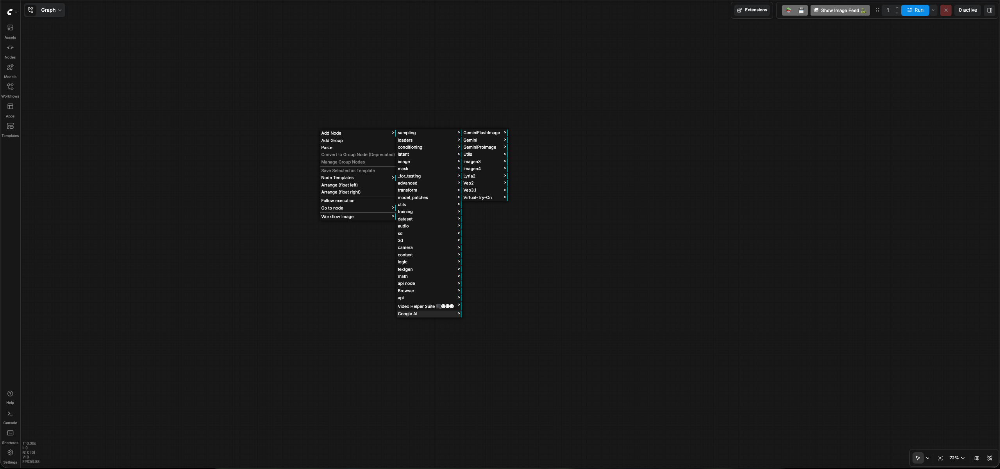
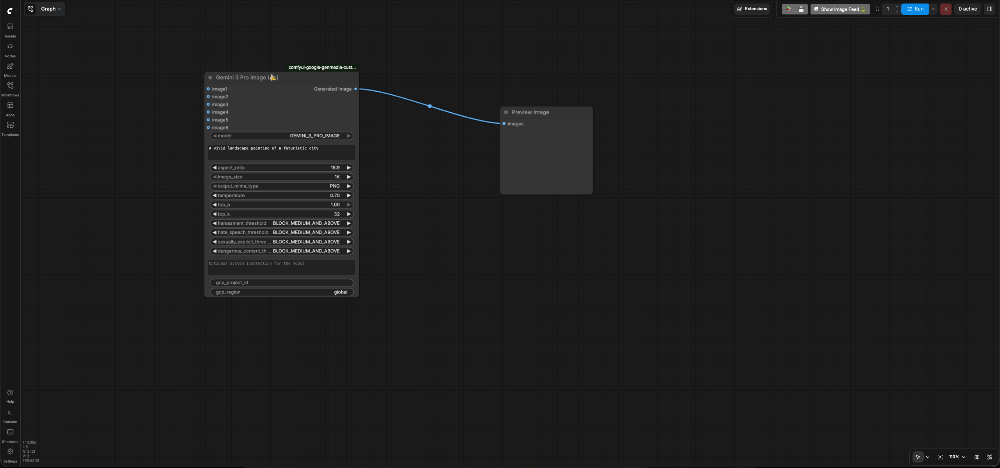

# Deployment of the custom nodes, input files and workflows

**Note**: If you are running ComfyUI on GKE via
[ComfyUI on GKE](https://github.com/GoogleCloudPlatform/accelerated-platforms/tree/main/platforms/gke/base/use-cases/inference-ref-arch/examples/comfyui)
guide, you can skip this guide and directly move to the
[User Guide](./USER_GUIDE.md).

## ComfyUI custom nodes for Google Generative Media Models

ComfyUI custom node is an user-created extension that adds new functionality to
the software's visual, node-based workflow.

Think of it like a plugin or a module. While ComfyUI comes with many built-in
nodes, custom nodes allow users to implement new features, integrate external
services, or combine existing functions into a single, more efficient node.

A custom node is typically a Python class that defines its inputs, outputs, and
the function it performs. It can be as simple as a node that combines multiple
images or as complex as a node that connects to an external API (like the Google
Gemini API for image captioning) to process an input and return a new result.

In this guide we will use Google Generative Media custom codes named
[comfyui-google-genmedia-custom-nodes](https://github.com/GoogleCloudPlatform/comfyui-google-genmedia-custom-nodes)

## Download Google Generative Media ComfyUI and other custom nodes

The demo contains workflows that uses
[Google Generative Media custom nodes](https://github.com/GoogleCloudPlatform/comfyui-google-genmedia-custom-nodes).
In addition to that, some of the workflows use custom nodes provided by
[ComfyUI-VideoHelperSuite](https://github.com/kosinkadink/ComfyUI-VideoHelperSuite)
for example to upload an input file from a given path. In this section, you will
download the required custom nodes.

### If you are running ComfyUI locally, perform the following steps to install the custom nodes

1.  Download these custom nodes in one of the following ways:
    - **Using the ComfyUI Manager**
        - Go to ComfyUI Manager --> Custom Node Manager --> search for
          `comfyui-google-genmedia-custom-nodes`. Click Install.
        - Go to ComfyUI Manager --> Custom Node Manager --> search for
          `ComfyUI-VideoHelperSuite`. Click Install.

    - **Manual installation using git**
        - Open the terminal on the machine that is running ComfyUI and change to
          the directory where ComfyUI is running from.

            ```sh
            cd <PATH_TO_COMFYUI_INSTALLATION>

            E.g if your ComfyUI is running from "/home/user/username/ComfyUI", replace <PATH_TO_COMFYUI_INSTALLATION> with "/home/user/username/"
            ```

        - Change to the custom_nodes folder.

            ```sh
             cd ComfyUI/custom_nodes
            ```

        - Make sure git is installed on your machine.

            ```sh
            git -v
            ```

            If you get the error `command not found`, install git based on your
            machine's operating system.

        - Clone the Google Generative Media custom node repository in the
          custom_nodes folder:

            ```sh
            git clone https://github.com/GoogleCloudPlatform/comfyui-google-genmedia-custom-nodes
            ```

        - Clone the VHSHelper Suite custom node repository in the custom_nodes
          folder:

            ```sh
            git clone https://github.com/kosinkadink/ComfyUI-VideoHelperSuite
            ```

        - Install python packages:
            1.  If you are running ComfyUI in a python virtual environment,
                activate it before installing the dependencies.

                ```sh
                  source <PATH_TO_PYTHON_VIRTUAL_ENVIRONMENT>/bin/activate
                ```

            1.  Install python packages

                ```sh
                pip install -r comfyui-google-genmedia-custom-nodes/requirements.txt
                pip install -r ComfyUI-VideoHelperSuite/requirements.txt
                ```

## Authentication to Google Cloud

### Authenticate local ComfyUI instance with Google Cloud user

If you want to make the API calls to Google models with your Google Cloud user.

- On the machine where you are running ComfyUI, install gcloud cli using the
  documentation https://docs.cloud.google.com/sdk/docs/install
- Open the terminal.
- Authenticate with the following command. Enter your Google Cloud credentials
  when prompted:

    ```sh
      gcloud auth application-default login
    ```

### Authenticate local ComfyUI with Google Cloud Service Account

If you do not want to make the API calls to Google models with your Google Cloud
user and want to use a service account instead.

- On the machine where you are running ComfyUI, open the terminal.
- Install gcloud cli using the documentation
  https://docs.cloud.google.com/sdk/docs/install
- Authenticate with the following command. Enter your Google Cloud user
  credentials when prompted:

    ```sh
     gcloud auth login
    ```

- Set shell variables

    ```sh
    export PROJECT_ID="<YOUR_PROJECT_ID>"
    export SERVICE_ACCOUNT_ID="<YOUR_SERVICE_ACCOUNT_ID>"
    export USER_EMAIL=`gcloud auth list --filter=status:ACTIVE --format="value(account)"`

    Replace <YOUR_PROJECT_ID> with the GCP project id you plan to use
    Replace <YOUR_SERVICE_ACCOUNT_ID> with the name of the service account you will use to access Google Cloud with ComfyUI. It will be created in the next step.
    ```

- Set Google Cloud project.

    ```sh
    gcloud config set project $PROJECT_ID
    ```

- Create a new service account:

    ```sh
    gcloud iam service-accounts create $SERVICE_ACCOUNT_ID \
    --display-name="ComfyUI Service Account" \
    --description="Service Account to use ComfyUI"
    ```

- Grant permissions to the service account:

    Note: You need `resourcemanager.projects.setIamPolicy` permissions in order
    to run the following step. This permissions is included in `owner` ,
    `resourcemanager.projectIamAdmin` and `iam.securityAdmin` roles.

    ```sh
    gcloud projects add-iam-policy-binding $PROJECT_ID \
    --member="serviceAccount:${SERVICE_ACCOUNT_ID}@${PROJECT_ID}.iam.gserviceaccount.com" \
    --role="roles/storage.objectUser" --condition=None

    gcloud projects add-iam-policy-binding $PROJECT_ID \
    --member="serviceAccount:${SERVICE_ACCOUNT_ID}@${PROJECT_ID}.iam.gserviceaccount.com" \
    --role="roles/aiplatform.user" --condition=None
    ```

- Grant the Service Account Token Creator role to your user on the service
  account. This role lets your user account to impersonate the Service Account
  created in previous steps.

    ```sh
    gcloud iam service-accounts add-iam-policy-binding \
    ${SERVICE_ACCOUNT_ID}@${PROJECT_ID}.iam.gserviceaccount.com \
    --member="user:${USER_EMAIL}" \
    --role="roles/iam.serviceAccountTokenCreator"
    ```

- Now, set yourself to impersonate the service account.

    ```sh
    gcloud auth application-default login --impersonate-service-account=${SERVICE_ACCOUNT_ID}@${PROJECT_ID}.iam.gserviceaccount.com
    ```

### Copy the input images and workflows required for the demo

The input images and workflows are provided with this repo in the `input` and
`workflows` directories respectively. You need to copy these in your ComfyUI
instance in order to be able to run through this guide.

- Open the terminal on the machine running ComfyUI.
- Clone the git repository

    ```sh
    git clone https://github.com/GoogleCloudPlatform/cloud-solutions /tmp/cloud-solutions
    ```

- Set shell environment variables:

    ```sh
    export YOUR_COMFYUI_INPUT_PATH="<YOUR_COMFYUI_INPUT_PATH>"
    export YOUR_COMFYUI_WORKFLOW_PATH="<YOUR_COMFYUI_WORKFLOW_PATH>"
    ```

    **Note:** Replace <YOUR_COMFYUI_INPUT_PATH> with the input folder of your
    ComfyUI instance e.g ComfyUI/input. Replace <YOUR_COMFYUI_WORKFLOW_PATH>
    with the workflow folder of your ComfyUI instance e.g
    ComfyUI/user/default/workflows

- Copy the input files

    ```sh
    cp -r /tmp/cloud-solutions/projects/generative-media-shot-production/input/funday ${YOUR_COMFYUI_INPUT_PATH}
    ```

- Verify that the input files have been copied over

    ```sh
    ls -1d ${YOUR_COMFYUI_INPUT_PATH}/funday/*/*
    ```

    You will see the following files. Note, that the path to the workflow
    directories could be different but you should see the same input files

    ```sh
    /XXXXXX/ComfyUI/input/funday/casting/casting_reference_to_image.png
    /XXXXXX/ComfyUI/input/funday/character_continuity/character_continuity_deflation.png
    /XXXXXX/ComfyUI/input/funday/character_continuity/character_continuity_scene1.png
    /XXXXXX/ComfyUI/input/funday/character_continuity/character_continuity_single_character_env.png
    /XXXXXX/ComfyUI/input/funday/character_continuity/character_continuity_single_character_prop.png
    /XXXXXX/ComfyUI/input/funday/environment_and_props/environment_and_props_reference_to_image.png
    /XXXXXX/ComfyUI/input/funday/shot_production/shot_production1_cast.png
    /XXXXXX/ComfyUI/input/funday/shot_production/shot_production1_environment.png
    /XXXXXX/ComfyUI/input/funday/shot_production/shot_production1_prop.png
    /XXXXXX/ComfyUI/input/funday/shot_production/shot_production2_cast.png
    /XXXXXX/ComfyUI/input/funday/shot_production/shot_production2_environment.png
    /XXXXXX/ComfyUI/input/funday/shot_production/shot_production2_prop.png
    /XXXXXX/ComfyUI/input/funday/shot_production/shot_production3_1.png
    /XXXXXX/ComfyUI/input/funday/shot_production/shot_production3_2.png
    /XXXXXX/ComfyUI/input/funday/storyboard/storyboard_cast1.png
    /XXXXXX/ComfyUI/input/funday/storyboard/storyboard_cast2.png
    /XXXXXX/ComfyUI/input/funday/storyboard/storyboard_environment1.png
    /XXXXXX/ComfyUI/input/funday/storyboard/storyboard_environment2.png
    /XXXXXX/ComfyUI/input/funday/storyboard/storyboard_final.png
    /XXXXXX/ComfyUI/input/funday/storyboard/storyboard_prop1.png
    /XXXXXX/ComfyUI/input/funday/storyboard/storyboard_prop2.png

    ```

- Copy the workflow files

    ```sh
    cp -r /tmp/cloud-solutions/projects/generative-media-shot-production/workflows/* ${YOUR_COMFYUI_WORKFLOW_PATH}
    ```

- Verify that the workflow files have been copied over

    ```sh
    ls -1 "${YOUR_COMFYUI_WORKFLOW_PATH}"/{casting,character_continuity,environment_and_props,storyboard,shot_production}/*
    ```

    You will see the following files. Note, that the path to the workflow
    directories could be different but you should see the same json files.

    ```sh
    /XXXXXX/ComfyUI/user/default/workflows/casting/casting_reference_to_image.json
    /XXXXXX/ComfyUI/user/default/workflows/casting/casting_text_to_image.json
    /XXXXXX/ComfyUI/user/default/workflows/character_continuity/character_continuity_deflation.json
    /XXXXXX/ComfyUI/user/default/workflows/character_continuity/character_continuity_scene1.json
    /XXXXXX/ComfyUI/user/default/workflows/environment_and_props/environment_and_props_reference_to_image.json
    /XXXXXX/ComfyUI/user/default/workflows/environment_and_props/environment_and_props_text_to_image.json
    /XXXXXX/ComfyUI/user/default/workflows/shot_production/shot_production1.json
    /XXXXXX/ComfyUI/user/default/workflows/shot_production/shot_production2.json
    /XXXXXX/ComfyUI/user/default/workflows/shot_production/shot_production3.json
    /XXXXXX/ComfyUI/user/default/workflows/storyboard/reference_to_image_scene1.son
    /XXXXXX/ComfyUI/user/default/workflows/storyboard/reference_to_image_scene2.json

    ```

### Validate that the custom nodes are downloaded successfully

- Re-start ComfyUI via ComfyUI manager or manually. Verify there are no failures
  in the logs and the log says that comfyui-google-genmedia-custom-nodes custom
  nodes have been loaded successfully, similar to the following message:

    ```sh
    Import times for custom nodes:
     .....
       .....
       .....
       2.8 seconds: /XXX/XXXX/ComfyUI/custom_nodes/comfyui-google-genmedia-custom-nodes
    ```

- Right click on ComfyUI, Click the 'Add node' menu and you should see a
  category named `Google AI` with custom nodes for Google’s genmedia models as
  shown in the image below.
  

### Test a node to verify the connectivity with your GCP project

- Open ComfyUI and right click on ComfyUI screen, follow the menu path by
  clicking `Add node` > `Google AI` > `GeminiFLashImage` >
  `Gemini 3.1 Flash Image (🍌)`
- This will add a `Gemini 3.1 FLash Image`(Nano Bananan) node on the ComfyUI
  workflow screen. Enter your GCP project id in the `gcp_project_id` input field
  of the node and leave the `region` input as "global"
- Write a prompt in the `prompt` input field of the node to generate an image.
- Add your GCP project id and region to the node's respective input fields.
- Right click on the ComfyUI screen and follow the menu path by clicking
  `Add node` > `images` > `Preview Image`
- This will add a `Preview Image` node on the ComfyUI screen.
- Now Connect the output of `Gemini 3.1 FLash Image` node to the input of
  `Preview Image` node. You should see something this the following imge:
  
- Click the `Run` button on ComfyUI to run the workflow. It should generate an
  image and display it on the `Preview Image` node.

**Note**: You will need to pass a GCP project id and GCP region as input
parameters to every custom node that is a part of
`google-comfyui-genmedia-custom-nodes` suite.

### Troubleshooting

- If you see failures while testing a node, an error message will be displayed
  showing why the request failed.
- If the error message displayed is not helpful, check the logs to see the
  errors.
- If you are running the latest version of ComfyUI, click the `Console` menu on
  the bottom left of ComfyUI screen to see the logs.
- Look for API errors. An example of a common error is

    ```text
    RuntimeError: Image generation API error: The project ID either doesn't exist or you don't have permissions to access it.
    ```

    To fix it, verify that you are passing the correct GCP Project Id and you
    have permission to access it.
