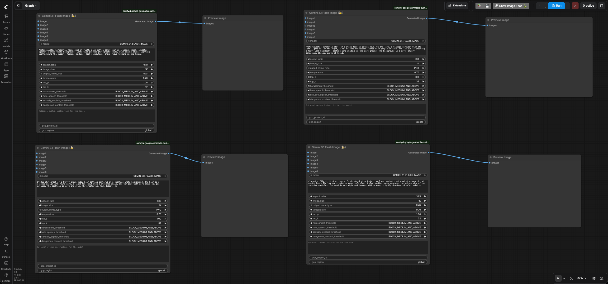
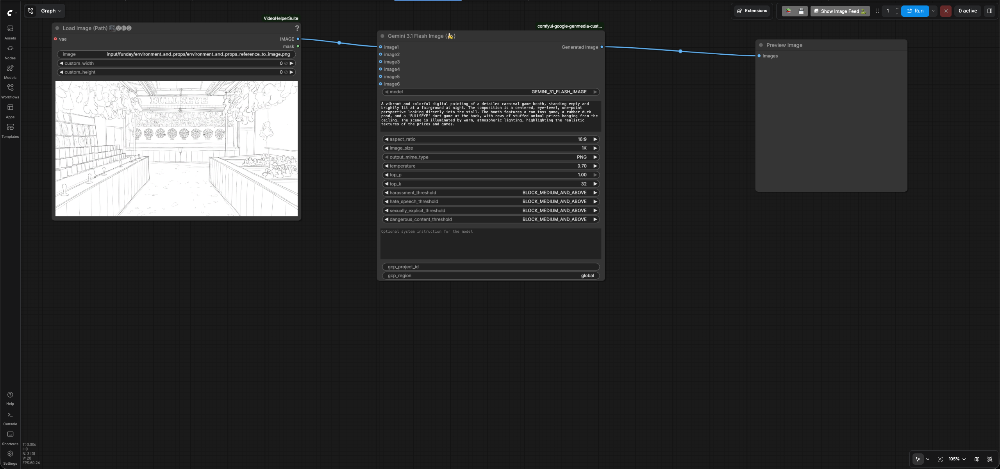

# Environment and Props

## Generate environment and props using Text To Image feature

- Go to ComfyUI. Click the `Workflows` menu on the left and select
  `environment_and_props` > `environment_and_props_text_to_image.json`.
- It will open the workflow in ComfyUI which will look like the following image:
  
- Enter your GCP project id in the `gcp_project_id` input field of all four
  `Gemini 3.1 Flash Image`(Nano Banana) node and leave the `region` input as
  "global"
- Review the text prompts of all the four nodes which follows the formula
  [Subject] + [Action] + [Location/context] + [Composition] + [Style] based on
  the
  [prompting best practices for Nano Banana](https://cloud.google.com/blog/products/ai-machine-learning/ultimate-prompting-guide-for-nano-banana?e=48754805).

    Node 1

    ```text
    Photorealistic horizontal macro shot of fluffy pink cotton candy spun on a wooden stick,
    isolated against a clean white background. Commercial product photography style,
    with bright studio lighting highlighting the sugary, fibrous texture.
    High resolution, sharp focus fitting in the frame.
    ```

    Node 2

    ```text
    Studio photograph of a fluffy brown teddy bear sitting centered on a seamless white background.
    The bear is a classic design with round ears, a light tan snout with a stitched smile, and tan
    paws with dark brown paw pad details. The lighting is soft and even. Photorealistic, high detail,
    4k
    ```

    Node 3

    ```text
    Photorealistic cinematic still of a state fair at golden hour.
    On the left, a vintage carousel with its warm lights on. On the right,
    a row of food concession stands with people in line. The low sun is creating a hazy,
    warm backlight, casting long shadows on the dirt ground. The background is a soft,
    blurry landscape. Shallow depth of field.
    ```

    Node4

    ```text
    Cinematic film still of a classic Ferris wheel at a dusty traveling carnival, set against a
    hazy sky at golden hour. The low sun creates a warm, soft glow. A slow shutter speed
    captures the motion blur of the spinning gondolas. The mood is nostalgic and dreamy, with a
    warm, slightly desaturated color palette.
    ```

- Run the workflow. You will get an image per node similar to the
  [Node1 result](./output/environment_and_props/environment_and_props_text_to_image_cotton_candy_output.png)
  ,
  [Node2 result](./output/environment_and_props/environment_and_props_text_to_image_toy_output.png)
  ,
  [Node3 result](./output/environment_and_props/environment_and_props_text_to_image_fair_output.png)
  ,
  [Node4 result](./output/environment_and_props/environment_and_props_text_to_image_ferris_wheel_output.png).

## Generate environment from the sketch using Reference To Image feature

Just like you did in the casting phase, you can iterate over the previous steps
and generate different images by tweaking the inputs and prompts of the Nano
Banana ComfyUI custom node. If needed, you can get a sketch created for your
environment and props and use then use it to generate images using
Reference-to-Image feature in Nano Banana. We will use
[this sketch](./input/funday/environment_and_props/environment_and_props_reference_to_image.png)
for the demo.

- Go to ComfyUI. Click the `Workflows` menu on the left and select
  `environment_and_props` > `environment_and_props_reference_to_image.json`.
- It will open the workflow in ComfyUI which will look like the following image:
  
- Enter your GCP project id in the `gcp_project_id` input field of the
  `Gemini 3.1 Flash Image`(Nano Banana) node and leave the `region` input as
  "global"
- Review the text prompt which follows the formula [Subject] + [Action] +
  [Location/context] + [Composition] + [Style] based on the
  [prompting best practices for Nano Banana](https://cloud.google.com/blog/products/ai-machine-learning/ultimate-prompting-guide-for-nano-banana?e=48754805).

    ```text
    A vibrant and colorful digital painting of a detailed carnival game booth,
    standing empty and brightly lit at a fairground at night. The composition is a centered,
    eye-level, one-point perspective looking directly into the stall. The booth features a can
    toss game, a rubber duck pond, and a 'BULLSEYE' dart game at the back, with rows of stuffed
    animal prizes hanging from the ceiling. The scene is illuminated by warm, atmospheric lighting,
    highlighting the realistic textures of the prizes and games.
    ```

- Run the workflow. You will get an image similar to the
  [environment and props reference to image output](./output/environment_and_props/environment_and_props_reference_to_image_output.png).

Go back to the [user guide](./USER_GUIDE.md) to run the next phases.
