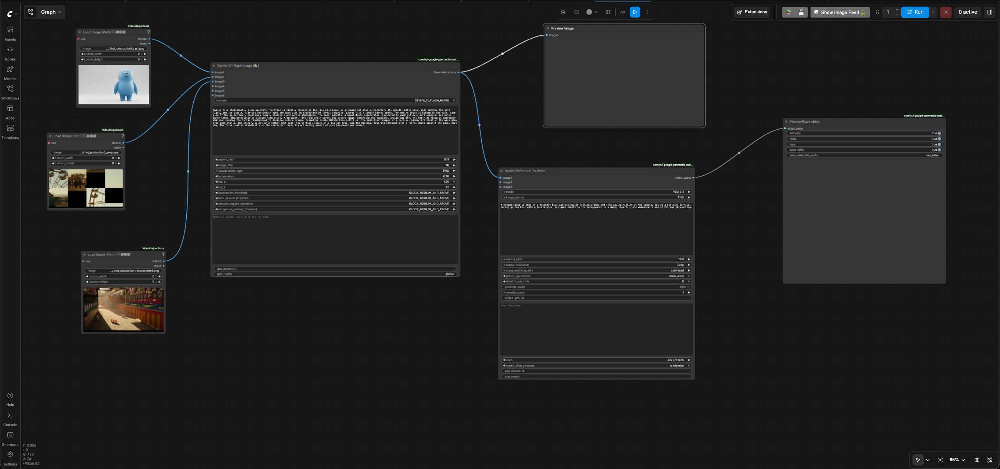
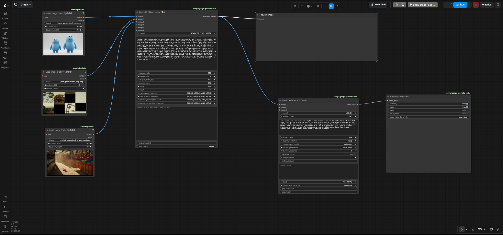
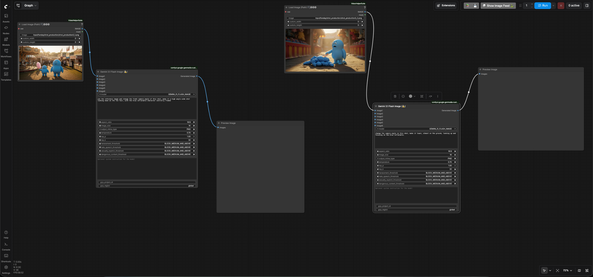

# Shot Production

## Create your first shot

In this section, you will produce your first shot. While you can directly
convert an existing storyboard frame into a video using Veo's Image-to-Video
feature, you will instead explore a more holistic, end-to-end workflow. You’ll
see how to first generate a high-fidelity reference image from your source
assets, filling a gap in your storyboard and then translate that static frame
into a dynamic, cinematic video.

- Go to ComfyUI. Click the `Workflows` menu on the left and select
  `shot_production` > `shot_production1.json`.
- It will open the workflow in ComfyUI which will look like the following image:
  
- Enter your GCP project id in the `gcp_project_id` input field of both
  `Gemini 3.1 Flash Image` and `Veo 3.1` nodes.
- Leave the `region` input as "global" in `Gemini 3.1 Flash Image`(Nano Banana)
  node.
- Enter the region in `region` input field of the `Veo 3.1` node.
- Review the text prompt in `Gemini 3.1 Flash Image` node which follows the
  formula [Subject] + [Action] + [Location/context] + [Composition] + [Style]
  based on the
  [prompting best practices for Nano Banana](https://cloud.google.com/blog/products/ai-machine-learning/ultimate-prompting-guide-for-nano-banana?e=48754805).

    ```text
    Analog film photography, close-up shot: The frame is tightly focused on the face
    of a blue, pill-shaped inflatable character. Its smooth, matte vinyl skin
    catches the soft light, and its simple, wide-set cartoonish eyes are open with
    an expression of joyous surprise, paired with a simple curved smile. The entire
    scene is bathed in the warm, hazy glow of the golden hour, creating a deeply
    nostalgic and gentle atmosphere. The color palette is beautifully desaturated,
    dominated by warm yellows, soft oranges, and muted earth tones, characteristic
    of vintage film stock. A distinct, fine film grain covers the entire image,
    enhancing the tangible, analog quality. The depth of field is extremely shallow,
    causing the funfair background to dissolve into a creamy, dreamlike bokeh.
    Within this soft blur, the indistinct shapes of a carnival midway are visible:
    the warm glow from game stalls, the primary colors of a rubber duck game, the
    vertical stacks of a tin can toss, and the distant, towering silhouette of a
    ferris wheel against the pale, hazy sky. The focus remains steadfastly on the
    character, capturing a fleeting moment of pure happiness and wonder.
    ```

- Review the text prompt in `Veo 3.1` node which follows the formula
  [Cinematography] + [Subject] + [Action] + [Context] + [Style & Ambiance] based
  on the
  [prompting best practices for Veo](https://cloud.google.com/blog/products/ai-machine-learning/ultimate-prompting-guide-for-veo-3-1?e=48754805).

    ```text
    A medium close-up shot of a friendly blue cartoon mascot looking around and then waving happily
    at the camera, set at a bustling carnival during golden hour with a Ferris wheel and game stalls
    in the background, in a warm, cheerful, and whimsical blend of CGI and live-action.
    ```

- Run the workflow. You will get an image and video similar to the
  [resulting image](./output/shot_production/shot_production1_reference_to_image_output.png)
  and
  [resulting video](./output/shot_production/shot_production1_image_to_video_output.mp4).

## Create another shot

- Go to ComfyUI. Click the `Workflows` menu on the left and select
  `shot_production` > `shot_production2.json`.
- It will open the workflow in ComfyUI which will look like the following image:
  
- Enter your GCP project id in the `gcp_project_id` input field of both
  `Gemini 3.1 Flash Image` and `Veo 3.1` nodes.
- Leave the `region` input as "global" in `Gemini 3.1 Flash Image`(Nano Banana)
  node.
- Enter the region in `region` input field of the `Veo 3.1` node.
- Review the text prompt in `Gemini 3.1 Flash Image` node which follows the
  formula [Subject] + [Action] + [Location/context] + [Composition] + [Style]
  based on the
  [prompting best practices for Nano Banana](https://cloud.google.com/blog/products/ai-machine-learning/ultimate-prompting-guide-for-nano-banana?e=48754805).

    ```text
    Vintage film photograph, low angle wide shot: In the foreground, two friendly,
    inflatable-like characters, rendered in a soft, matte blue plastic, stand on a
    dusty fairground path. They both have simple, happy cartoon faces with black
    eyes and a gentle smile. The taller character on the right and the shorter one
    on the left are captured mid-action, excitedly giving each other a high-five
    with their short, rounded arms. Their joyful pose is the central focus. In the
    slightly out-of-focus background, a classic funfair alley unfolds. Booths with
    red and yellow striped awnings are lined with prizes like plush toys and
    dartboards. Another booth features stacked tin cans for a throwing game. The
    dusty ground is littered with discarded popcorn boxes and stray tickets, telling
    a story of the day's festivities. The entire scene is drenched in the warm, hazy
    glow of late afternoon sun, creating a nostalgic and dreamlike atmosphere. Long,
    soft shadows stretch across the ground, and the color palette is beautifully
    muted with desaturated tones, enhancing the vintage film aesthetic. A fine layer
    of grain gives the image a tangible, analog texture, capturing a perfect,
    fleeting moment of happiness at the carnival.
    ```

- Review the text prompt in `Veo 3.1` node which follows the formula
  [Cinematography] + [Subject] + [Action] + [Context] + [Style & Ambiance] based
  on the
  [prompting best practices for Veo](https://cloud.google.com/blog/products/ai-machine-learning/ultimate-prompting-guide-for-veo-3-1?e=48754805).

    ```text
    A low-angle shot with a shallow depth of field focuses on two friendly,
    blue, 3D animated characters, one large and one small. The characters
    interact playfully, giving each other a high-five and pointing at the
    attractions as they stand in the middle of a bustling carnival midway
    littered with popcorn. The scene is filled with the warm, hazy light of a
    sunny afternoon, creating a cheerful, heartwarming, and nostalgic atmosphere
    that blends photorealistic environments with charming cartoon animation.
    ```

- Run the workflow. You will get an image and video similar to the
  [resulting image](./output/shot_production/shot_production2_reference_to_image_output.png)
  and
  [resulting video](./output/shot_production/shot_production2_image_to_video_output.mp4).

## Change the camera angle of the shot

You can also change your storyboard frames to look more realistic by changing
the aesthetics like camera angles, lighting etc. In this section, we will change
the camera angle of a couple of shots.

- Go to ComfyUI. Click the `Workflows` menu on the left and select
  `shot_prodcution` > `shot_production3.json`.
- It will open the workflow in ComfyUI which will look like the following image:
  
- Enter your GCP project id in the `gcp_project_id` input field of the
  `Gemini 3.1 Flash Image`(Nano Banana) node and leave the `region` input as
  "global"
- Review the text prompt in the nodes which follows the formula [Subject] +
  [Action] + [Location/context] + [Composition] + [Style] based on the
  [prompting best practices for Nano Banana](https://cloud.google.com/blog/products/ai-machine-learning/ultimate-prompting-guide-for-nano-banana?e=48754805).

    Node1

    ```text
    use the reference image and change the front camera angle of this shot, make it a
    high angle wide shot looking down on the fun fair, with the blue inflatable
    character centrally framed
    ```

    Node2

    ```text
    change the camera angle in this shot, make it lower, almost on the ground,
    looking up and focusing on the blue inflatable.
    ```

- Run the workflow. You will get an images similar to the
  [Node1 result](./output/shot_production/shot_production3_reference_to_image1_output.png)
  and
  [Node2 result](./output/shot_production/shot_production3_reference_to_image2_output.png).
