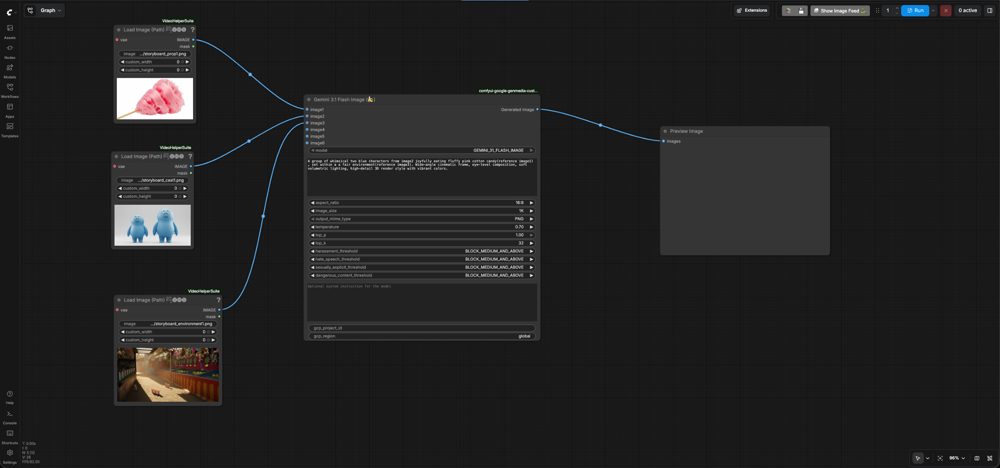
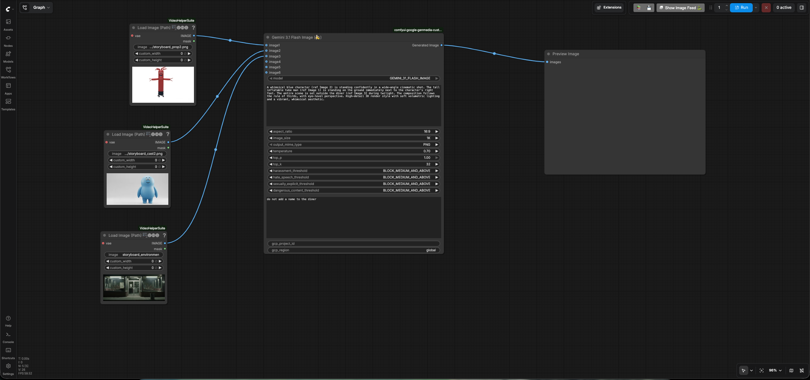
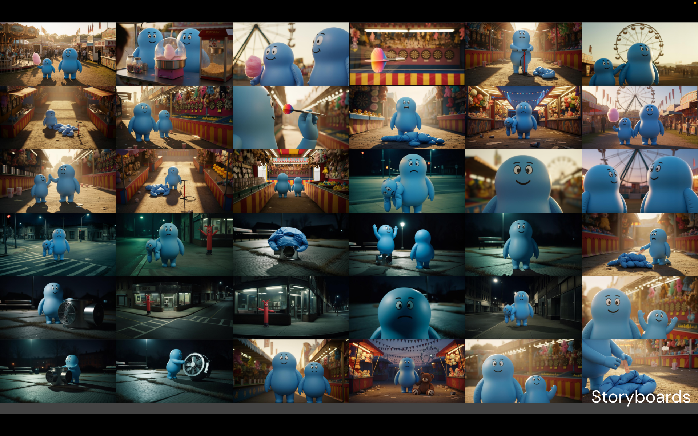

# Storyboard

## Create a scene with Reference to Image feature in Nano Banana

- Go to ComfyUI. Click the `Workflows` menu on the left and select
  `storyboard` > `storyboard_reference_to_image_scene1.json`.
- It will open the workflow in ComfyUI which will look like the following image:
  
- Enter your GCP project id in the `gcp_project_id` input field of the
  `Gemini 3.1 Flash Image`(Nano Banana) node and leave the `region` input as
  "global"
- Review the text prompt which follows the formula [Subject] + [Action] +
  [Location/context] + [Composition] + [Style] based on the
  [prompting best practices for Nano Banana](https://cloud.google.com/blog/products/ai-machine-learning/ultimate-prompting-guide-for-nano-banana?e=48754805).

    ```text
    A group of whimsical two blue characters from image2 joyfully eating fluffy
    pink cotton candy(reference image1) , set within a a fair
    environment(reference image3). Wide-angle cinematic frame, eye-level
    composition, soft volumetric lighting, high-detail 3D render style with
    vibrant colors.
    ```

- Run the workflow. You will get an image similar to the
  [storyboard scene1 reference to image output](./output/storyboard/storyboard_scene1_output.png).

You have created your first scnene.

## Create another scene with Reference to Image feature in Nano Banana

- Go to ComfyUI. Click the `Workflows` menu on the left and select
  `storyboard` > `storyboard_reference_to_image_scene2.json`.
- It will open the workflow in ComfyUI which will look like the following image:
  
- Enter your GCP project id in the `gcp_project_id` input field of the
  `Gemini 3.1 Flash Image`(Nano Banana) node and leave the `region` input as
  "global"
- Review the text prompt which follows the formula [Subject] + [Action] +
  [Location/context] + [Composition] + [Style] based on the
  [prompting best practices for Nano Banana](https://cloud.google.com/blog/products/ai-machine-learning/ultimate-prompting-guide-for-nano-banana?e=48754805).

    ```text
    A whimsical blue character (ref Image 2) is standing confidently in a
    wide-angle cinematic shot. The tall inflatable tube man (ref Image 1) is
    standing on the ground immediately next to the character's right foot. The
    entire scene is set outside the diner (ref Image 3] during twilight. The
    composition follows the rule of thirds, with eye-level perspective.
    High-detail 3D render style with soft volumetric lighting and a vibrant,
    whimsical aesthetic.
    ```

- Run the workflow. You will get an image similar to the
  [storyboard scene2 reference to image output](./output/storyboard/storyboard_scene2_output.png).

You can follow the same process to build the entire storyboard that will serve
the base for your video. It could look something like this:



Go back to the [user guide](./USER_GUIDE.md) to run the next phases.
