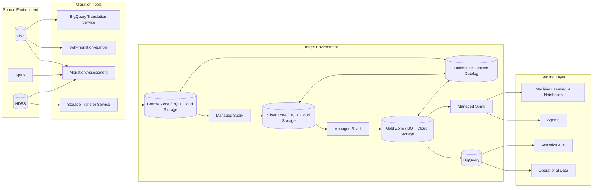

# Reference Architecture: Hadoop to Google Cloud Data Lakehouse Migration

This document presents the reference architecture for migrating from a legacy
Hadoop environment to a modern Data Lakehouse on Google Cloud, as implemented in
this demo.

## Architecture Diagram

## Component Descriptions

### Source Environment

- **Hadoop Cluster**: Simulated by a standalone cluster of "Managed Service for
  Apache Spark" (formally Dataproc)
    - **HDFS**: Distributed file system storing the raw data.
    - **Hive Metastore**: Manages metadata for Hive tables.

### Migration Tools

- **migration-assesment-tool**: Tool for assessing usage in hadoop, and predict
  usage on Google Cloud services.
- **dwh-migration-dumper**: Extracts DDL and metadata from the source Hive
  system for assessment.
- **Storage Transfer Service (STS)**: Cloud-native service used to transfer data
  from HDFS to Google Cloud Storage.
- **BigQuery Translation Service**: Translates legacy HiveQL queries to modern
  GoogleSQL for BigQuery.

### Target Environment

Divided into the classic 3 tier "Medallion" architecture:

- **Bronze Zone**: Used for storing raw data, as is.
- **Silver Zone**: Used for storing processed data, cleaned and verified.
- **Gold Zone**: Used for storing enriched data, ready for analytics and
  serving.

Each zone is comprised of:

- **Cloud Storage**: Serves as the storage layer, from CSVs and binary files, to
  Parquet files with Apache Iceberg format.
- **Lakehouse Runtime Iceberg Catalog**: Managed service for managing datasets
  in the Apache Iceberg format.
- **Managed Service for Apache Spark Serverless**: Runs Spark jobs to convert
  process data from one zone to the next.
- **BigQuery**: Enables querying Iceberg tables directly in Cloud Storage with
  BigQuery performance and security.

### Serving Layer

The serving layer is responsible for serving data to end users. It is comprised
of:

- **BI & Analytics**: Tools for data visualization and analysis.
- **Machine Learning processes and Notebook**: Tools for data scientists to
  develop ML models.
- **Agents**: Agents deployed that need grounding in enterprise data.
- **Operational Data**: Data that is being used by operational, user facing
  systems.
