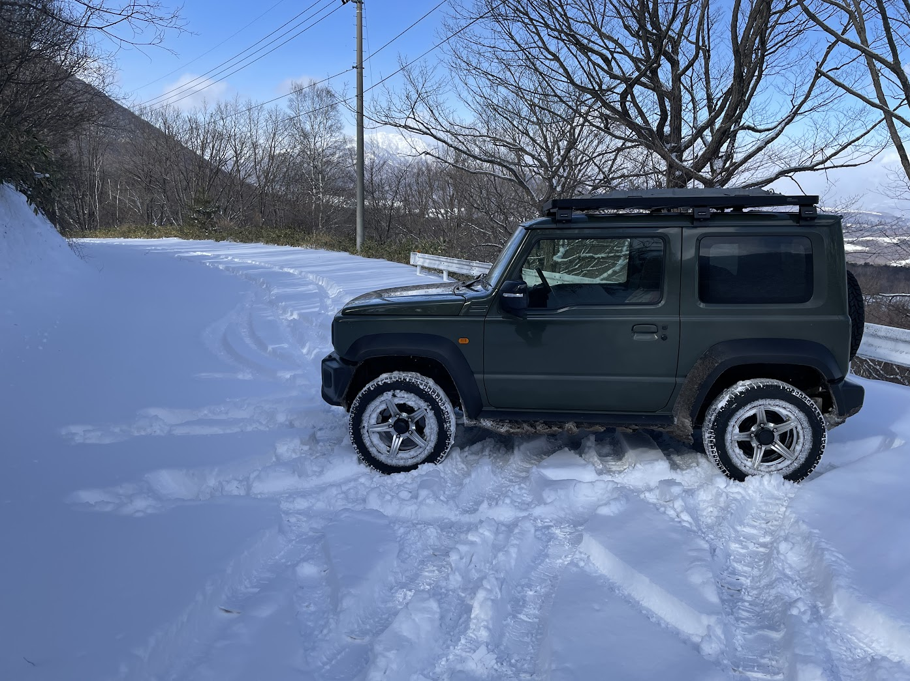
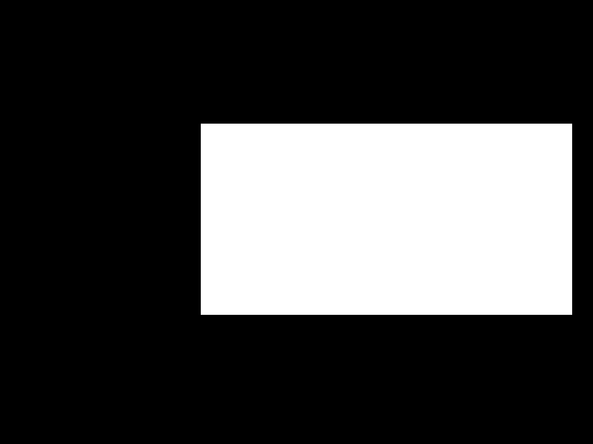
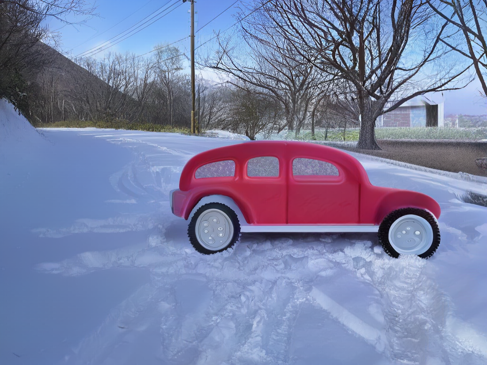
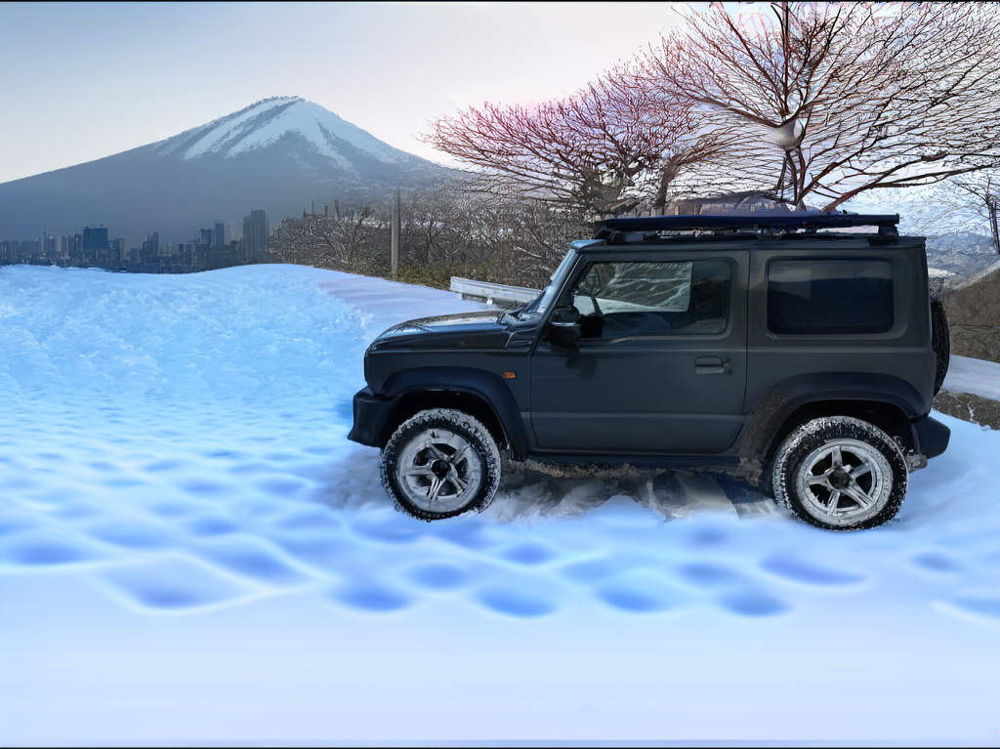
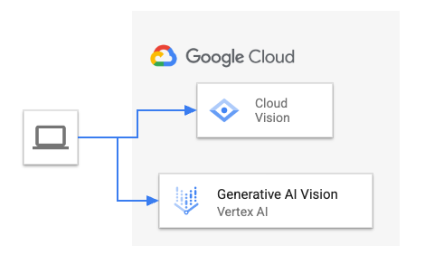
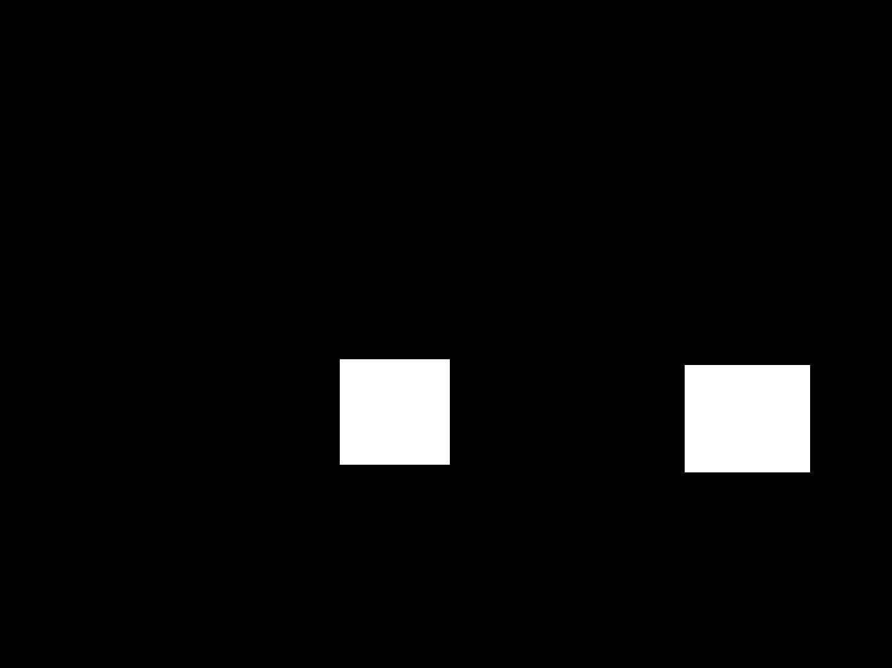
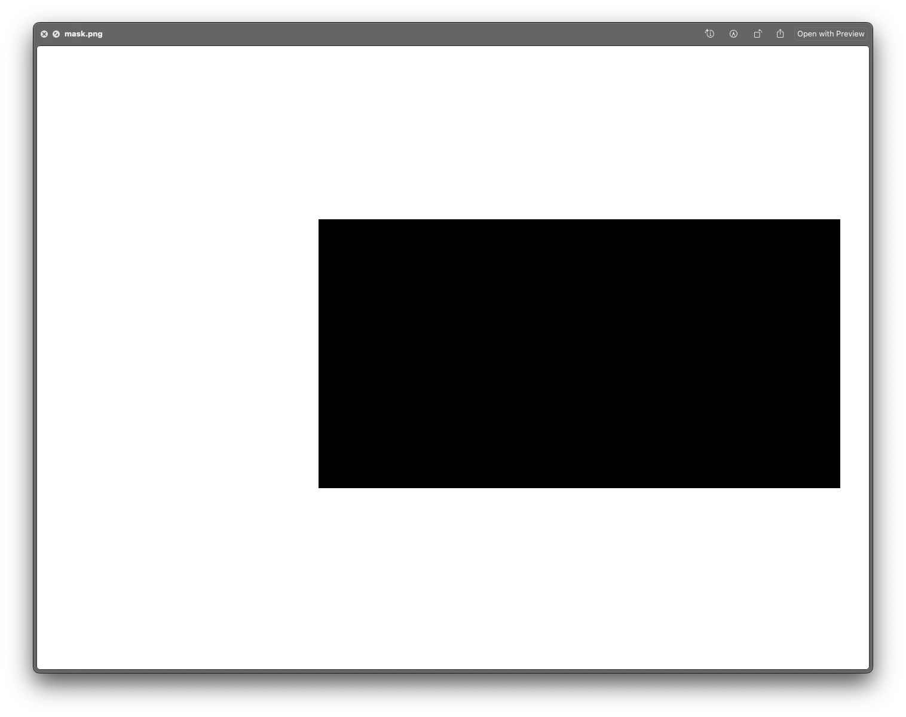

# Imagen Object Changer

## Summary

This solution shows how to automate mask-based image editing with Google Cloud
[Vertex AI Generative AI Vision](https://console.cloud.google.com/vertex-ai/generative/vision),
a.k.a. Imagen. Imagen has a console UI for drawing masks over objects in source
images, and then applying mask-based editing, to replace the object with
generated imagery, or with an inverted mask, to replace the background around
the objects. This solution automates the mask generation, using Cloud Vision
API’s [object detection](https://cloud.google.com/vision/docs/object-localizer).

The solution works as follows:

1.  The user provides an object label such as ‘car’, the source image file, and
    a GenAI Imagen prompt such as ‘red plastic toy car’. In this case, to
    replace cars with toy cars
2.  Query Vision API with the source image and object label
3.  Present list of found labels
4.  If the user’s label was found in the list of detected labels, generate a
    mask image based on the bounding boxes for the objects
5.  Query Imagen with the original image, mask image, and GenAI prompt
6.  Save the resulting generated images

## Example

Based on the above summary example, with this input image:



and label ‘car’, the solution first generates a mask image corresponding to the
car’s object detection bounding box result:



The original image and mask are then sent to Imagen, along with the edit prompt
“red toy car”, and e.g the following generated images are received:



By inverting the mask with an option, and a prompt such as “urban cityscape with
snow-capped Mount Fuji in the background”, we can ask Imagen to keep the car and
replace the background instead:



## Architecture



## Installing the Solution

### Prerequisites

*   A Google Cloud Platform project, which has access to
    [Generative AI Studio Vision](https://console.cloud.google.com/vertex-ai/generative/vision)
*   A Linux or Mac computer with
    *   Python 3 installed (tested with Python 3.9)
    *   [Gcloud tool](https://cloud.google.com/sdk/docs/install) installed

### Enabling the Services

1.  With your browser, navigate to the
    [Google Cloud Console](https://console.cloud.google.com/home/dashboard) and
    select the right Project
2.  Use the Console to Enable the
    [Cloud Vision API in the API Library](https://console.cloud.google.com/apis/library/vision.googleapis.com)
3.  Check that you can access
    [Generative AI Studio Vision](https://console.cloud.google.com/vertex-ai/generative/vision)

### Installing the Application

1.  Clone the repository and change to its directory:

    ```shell
    cd imagen-object-changer
    ```

    Note: it is recommended to use
    [venv](https://docs.python.org/3/library/venv.html) or
    [pyenv virtualenv](https://github.com/pyenv/pyenv-virtualenv) to create an
    isolated environment for this application and its imported modules. Please
    refer to the links in this step for more information on virtual environment

2.  Open a terminal on your computer, and execute the following gcloud command
    to authenticate the application for Google Cloud Platform:

    ```shell
    gcloud auth application-default login
    ```

3.  Install the Python dependencies with:

    ```shell
    pip3 install -r requirements.txt --require-hashes
    ```

4.  Test that the application can start without errors, by executing the
    following:

    ```shell
    python3 imagen_object_changer.py --help
    ```

    If everything is ok, you should see the following output:

    ```text
    usage: imagen_object_changer.py [-h] [--input INPUT] [--label LABEL] [--prompt PROMPT] [--mask MASK] [--invert_mask INVERT_MASK]
                                [--output_json OUTPUT_JSON] [--credentials CREDENTIALS] [--project_id PROJECT_ID]

    optional arguments:
        -h, --help            show this help message and exit
        --input INPUT         Original image file
        --label LABEL         Object to detect e.g car | cat | tree
        --prompt PROMPT       GenAI Imagen prompt for image generation
        --mask MASK           Output mask file
        --invert_mask INVERT_MASK
                            Invert mask. If True, replace the image background, not the object
        --output_json OUTPUT_JSON
                            Output JSON file name for GenAI response content
        --credentials CREDENTIALS
                            Google Cloud Service account JSON key. Default: ./credentials.json
        --project_id PROJECT_ID
                            Google Cloud Project ID string
    ```

## Using the solution

### Replacing objects with generated imagery

To replace ‘car’ with ‘red toy car’ in the source image: input.jpg, execute the
following:

```shell
python3 imagen_object_changer.py \
  --input input.jpg \
  --label car --prompt "red toy car. Photorealistic HDR" \
  --project_id [your-project-id]
```

You should see the following output:

```text
Target label: car source image: input.jpg project_id: edgeai-testing-2
Number of objects found: 3
Tire (confidence: 0.9487918019294739)
Tire (confidence: 0.9454217553138733)
Car (confidence: 0.7962799668312073)
car found! drawing mask
Wrote mask to: mask.png
Querying Imagen...
Wrote Imagen response to: output.json
Wrote 4 output images
```

Here you can see that Vision API detected 2 types of objects in the source
image: Tire, and Car. You can use either of those 2 detected labels with this
solution, to create masks for them. Note: this solution can generate multiple
masks, one for each found object. Since the car has 2 tyres, using `--label
tire` will generate the following mask image `mask.png`with a box per tire:



The output images are named: `image[0..4].png`

### Replacing the background of objects

If we invert the mask, we can ask Imagen to replace the background of the
object, not the object itself. You can do this by simply adding the argument:
`--invert_mask True`

1.  Execute the following, to replace the background of the car, with a city and
    a mountain:

    ```shell
    python3 imagen_object_changer.py \
    --label car \
    --prompt "urban cityscape with snow-capped Mount Fuji in the background. Photorealistic HDR" \
    --invert_mask True \
    --project_id [your-project-id]
    ```

    Note that this creates the following inverted mask for Imagen:



### Storing default values in the configuration file

The application reads both the configuration file `config.ini`, as well as the
command line arguments such as `--prompt`. You can edit the file `config.ini`
and replace the default values therein. Note that the *command line arguments
override the configuration file*, So if you have one value in `config.ini`, and
specify another value for the same parameter as a command line argument, the
command line argument’s value will be used.

## Known Limitations

*   Bounding boxes produce rectangular masks for the objects. If the object’s
    real shape is quite different, this can mask out undesirably large areas in
    addition to the object’s pixels. In other words, this may work best with
    objects that nicely fill the bounding box. In general, the current solution
    works best with objects that cover a close-to-rectangular area of the image.
    However, the Imagen service does a good job of filling in the gaps or edges
    with generated pixels, so the results are case-by-case
*   Replacing Vision API / object detection, with an image semantic segmentation
    model, such as
    [Google’s DeepLabv3+](https://console.cloud.google.com/vertex-ai/publishers/google/model-garden/imagesegmentation-deeplabv3),
    may produce better results. Segmentation models can return a mask that
    matches the more exact shape of the target object

## License

This is not an Official Google Product.

Licensed under the Apache License, Version 2.0 (the "License")
