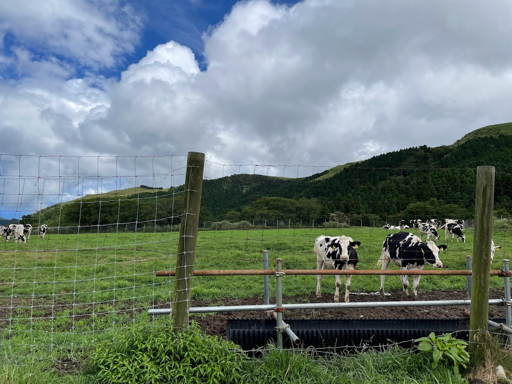

# Imagen Voice Captioning

## Summary

This solution shows how to take a picture with a camera, and hear a spoken description of the scene in the image. The solution leverages Google Cloud’s [Vertex AI Generative AI Vision](https://console.cloud.google.com/vertex-ai/generative/vision) and [Text-to-Speech AI](https://cloud.google.com/text-to-speech).

The solution works as follows:

1. The user runs the application and selects a connected camera as the input
2. The applications shows a live view of the camera
3. The user triggers captioning
4. The camera’s image is sent to Imagen image captioning, which returns a textual description of the scene
5. The text is sent to Text-to-Speech AI, which returns an audio file containing the caption synthesized as speech
6. The application plays back the audio, describing the scene verbally

## Example

Based on the above summary example, with this input image:



The solution will speak out e.g the following caption: “_a herd of cows standing in a grassy field behind a fence_”

## Architecture


## Installing the Solution

### Prerequisites

* A Google Cloud Platform project, which has access to [Generative AI Studio Vision](https://console.cloud.google.com/vertex-ai/generative/vision)
* A Linux or Mac computer with
  * Python 3 installed (tested with Python 3.9)
  * [Gcloud tool](https://cloud.google.com/sdk/docs/install) installed

### Enabling the Services

1. With your browser, navigate to the [Google Cloud Console](https://console.cloud.google.com/home/dashboard) and select the right Project
2. Use the Console to Enable the [Cloud Vision Text to Speech API](https://console.cloud.google.com/apis/library/texttospeech.googleapis.com)
3. Use the Console to Enable the [Cloud Vision API in the API Library](https://console.cloud.google.com/apis/library/vision.googleapis.com)
4. Check that you can access [Generative AI Studio Vision](https://console.cloud.google.com/vertex-ai/generative/vision)

### Creating the Service Account and Key

1. Open a terminal on your computer, and execute the following gcloud commands, to:
    1. create a new service account in your GCP Project
    2. create and download a JSON key for it
    3. Bind the Cloud Storage object viewer role to it

    This service account will be used to access Cloud Vision API. Execute the following, replacing `[your-gcp-project]` with your project ID:

    ```shell
    export PROJECT_ID=[your-gcp-project]

    gcloud config set project $PROJECT_ID

    gcloud auth login

    gcloud iam service-accounts create ml-dev --description="ML APIs developer access" --display-name="ML Developer Service Account"

    gcloud iam service-accounts keys create ./credentials.json --iam-account ml-dev@$PROJECT_ID.iam.gserviceaccount.com

    gcloud projects add-iam-policy-binding $PROJECT_ID --member serviceAccount:ml-dev@$PROJECT_ID.iam.gserviceaccount.com --role roles/storage.objectViewer

    gcloud services enable vision.googleapis.com
    ```

2. The service account key was downloaded as a file called `credentials.json` in your current working directory. Note the location of the file, as you will need it later.

### Installing the Application

1. Clone the repository and change to its directory:

    ```shell
    git clone https://github.com/GoogleCloudPlatform/cloud-solutions.git

    cd cloud-solutions/projects/imagen-voice-captioning
    ```

    Note: you may wish to use [venv](https://docs.python.org/3/library/venv.html) or [pyenv virtualenv](https://github.com/pyenv/pyenv-virtualenv) to create an isolated environment for this application and its imported modules. Please refer to the links in this step for more information on virtual environment

2. Install the Python dependencies with:

    ```shell
    pip3 install -r requirements.txt
    ```

3. Copy the service account key credentials.json that you downloaded earlier to this same directory with e.g:

    ```shell
    cp ~/credentials.json .
    ```

4. Test that the application can start without errors, by executing the following:

    ```shell
    python3 imagen-voice-captioning.py --help
    ```

    If everything is ok, you should see the following output:

    ```text
    usage: imagen-voice-captioning.py [-h] [--input INPUT] [--credentials CREDENTIALS] [--project_id PROJECT_ID]

    optional arguments:
      -h, --help            show this help message and exit
      --input INPUT         Camera device number
      --credentials CREDENTIALS
                            Google Cloud Service account JSON key. Default: ./credentials.json
      --project_id PROJECT_ID
                            Google Cloud Project ID string
    ```

## Using the solution

1. Connect a camera such as a USB webcam to your computer. Test that the camera works on your computer
2. Start the application and provide the following parameter values:
    1. `--input`: &lt;the device number of the connected cameras>. Start with 0 and increase the number until you see the correct camera’s output on the screen
    2. `--credentials`: &lt;path to the credentials.json you prepared earlier>
    3. `--project_id`: &lt;your GCP project ID>

    Example command:

    ```shell
    python3 imagen-voice-captioning.py --input 1 --credentials credentials.json --project_id myproject
    ```

3. If successful, the application will output the following on the console:

    ```text
    {'input': '1', 'credentials': 'credentials.json', 'project_id': 'myproject''}
    Opening camera: 1
    Select the camera view window by clicking it
    Press <space> to caption the camera view. Press q to quit
    ```

    And open a window where it displays the camera’s live view on your desktop.

4. To caption the camera view, select the camera display window and press &lt;SPACE>
5. If successful, the application will output:

    ```text
    Querying Imagen captioning...OK
    Querying Cloud Text-to-Speech...OK
    Input #0, wav, from '/var/folders/k_/4zfn88c510l37h6q_l37z6r400dvj5/T/tmpynvh_rb1.wav':
    Duration: 00:00:04.68, bitrate: 384 kb/s
    Stream #0:0: Audio: pcm_s16le ([1][0][0][0] / 0x0001), 24000 Hz, 1 channels, s16, 384 kb/s
        4.57 M-A:  0.000 fd=   0 aq=    0KB vq=    0KB sq=    0B f=0/0
    ```

    And you should hear the description played back through your computer’s speakers.

### Storing default values in the configuration file

The application reads both the configuration file `config.ini`,
as well as the command line arguments such as `--input`.
You can copy the example configuration file `config.ini.example`to your own file: `config.ini` and replace the default values therein.
Note that the _command line arguments override the configuration file_.
So if you have one value in `config.ini`, and specify another value for the same parameter as a command line argument, the command line argument value is used.
