# Use cases

`k8s-hybrid-neg-controller` enables endpoints of workloads running in Kubernetes
clusters on-prem and on other clouds to be added to backend services of
[Cloud Load Balancing](https://cloud.google.com/load-balancing/docs/load-balancing-overview)
and the
[Cloud Service Mesh](https://cloud.google.com/service-mesh/docs/overview)
managed xDS control plane (the Traffic Director implementation), with traffic
routed directly to the Pod endpoints.

Cloud Load Balancing use cases:

- [Global external load balancing](#global-external-load-balancing) across
  workloads deployed to multiple regions on Google Cloud and on-prem or on other
  clouds.

- [Regional external load balancing](#regional-external-load-balancing) across
  workloads deployed to multiple Kubernetes clusters in the same region on
  Google Cloud and on-prem or on other clouds.

- [Cross-region internal load balancing](#cross-region-internal-load-balancing)
  across workloads deployed to multiple regions on Google Cloud and on-prem or
  on other clouds.

- [Regional internal load balancing](#regional-internal-load-balancing) across
  workloads deployed to multiple Kubernetes clusters in the same region on
  Google Cloud and on-prem or on other clouds.

Cloud Service Mesh use cases:

- [Traffic routing](#cloud-service-mesh-traffic-routing) by header/metadata
  matching, or percentage-based traffic splitting, across workloads deployed to
  multiple regions or multiple Kubernetes clusters on Google Cloud and on-prem
  or on other clouds.

- [Locality-aware load balancing](#cloud-service-mesh-locality-aware-load-balancing)
  across workloads deployed to multiple regions or multiple Kubernetes clusters
  on Google Cloud and on-prem or on other clouds.

- Traffic routing, traffic splitting, and locality-aware load balancing across
  [workloads deployed to multiple Kubernetes clusters running outside Google Cloud](#cloud-service-mesh-off-google-cloud).
  The workloads can span on-prem and other clouds, multiple regions, and
  multiple Kubernetes clusters.

## Global external load balancing

The
[global external Application Load Balancer](https://cloud.google.com/load-balancing/docs/https)
and
[global external proxy Network Load Balancer](https://cloud.google.com/load-balancing/docs/tcp)
enable internet traffic to reach your backends that span multiple regions. The
[Application Load Balancer](https://cloud.google.com/load-balancing/docs/application-load-balancer)
enables Layer-7 load balancing, while the
[proxy Network Load Balancer](https://cloud.google.com/load-balancing/docs/proxy-network-load-balancer)
enables Layer-4 load balancing.

Using `k8s-hybrid-neg-controller`, you can load balance across backends on both
GKE clusters on Google Cloud and Kubernetes clusters running on-prem or on other
clouds. See the diagram below for an architecture overview.

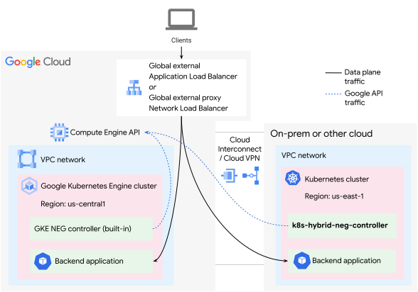

The diagram below shows the Google Cloud resources you provision for this
architecture.

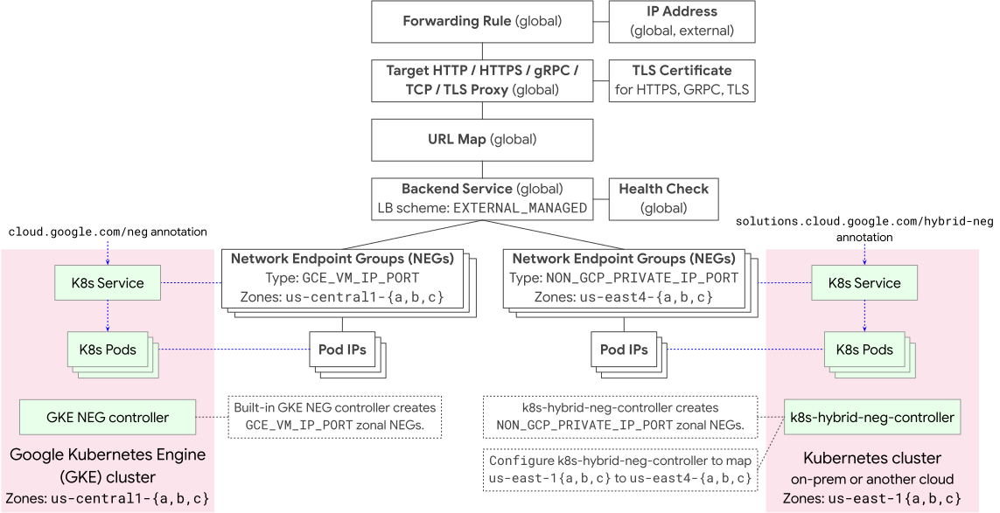

To provision the Google Cloud resources used in this architecture, follow the
steps in the document
[Set up a global external Application Load Balancer with hybrid connectivity](https://cloud.google.com/load-balancing/docs/https/setting-up-ext-global-https-hybrid).

For the environment outside Google Cloud, deploy `k8s-hybrid-neg-controller` to
your Kubernetes cluster, by following the steps in
[Deploy `k8s-hybrid-neg-controller` outside Google Cloud](deploy-off-gcp.md).

## Regional external load balancing

The
[regional external Application Load Balancer](https://cloud.google.com/load-balancing/docs/https)
and
[regional external proxy Network Load Balancer](https://cloud.google.com/load-balancing/docs/tcp)
enable internet traffic to reach your backends in one region. The
[Application Load Balancer](https://cloud.google.com/load-balancing/docs/application-load-balancer)
enables Layer-7 load balancing, while the
[proxy Network Load Balancer](https://cloud.google.com/load-balancing/docs/proxy-network-load-balancer)
enables Layer-4 load balancing.

Using `k8s-hybrid-neg-controller`, you can load balance across backends on both
GKE clusters on Google Cloud and Kubernetes clusters running on-prem or on other
clouds. See the diagram below for an architecture overview.

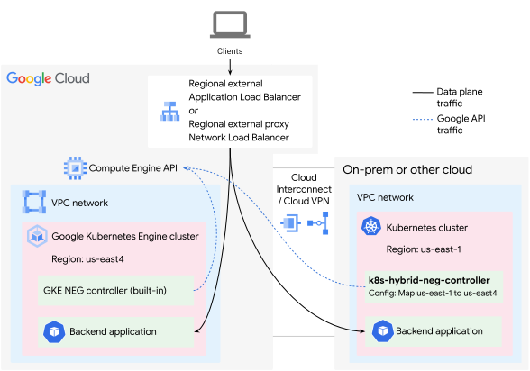

The diagram below shows the Google Cloud resources you provision for this
architecture.

To provision the Google Cloud resources used in this architecture, follow the
steps in the document
[Set up a regional external Application Load Balancer with hybrid connectivity](https://cloud.google.com/load-balancing/docs/https/setting-up-reg-ext-https-hybrid).

For the environment outside Google Cloud, deploy `k8s-hybrid-neg-controller` to
your Kubernetes cluster, by following the steps in
[Deploy `k8s-hybrid-neg-controller` outside Google Cloud](deploy-off-gcp.md).

## Cross-region internal load balancing

The
[cross-region internal Application Load Balancer](https://cloud.google.com/load-balancing/docs/l7-internal)
and
[cross-region internal proxy Network Load Balancer](https://cloud.google.com/load-balancing/docs/tcp/internal-proxy)
enable internet traffic to reach your backends in one region. The
[Application Load Balancer](https://cloud.google.com/load-balancing/docs/application-load-balancer)
enables Layer-7 load balancing, while the
[proxy Network Load Balancer](https://cloud.google.com/load-balancing/docs/proxy-network-load-balancer)
enables Layer-4 load balancing.

Using `k8s-hybrid-neg-controller`, you can load balance across backends on both
GKE clusters on Google Cloud and Kubernetes clusters running on-prem or on other
clouds. See the diagram below for an architecture overview.

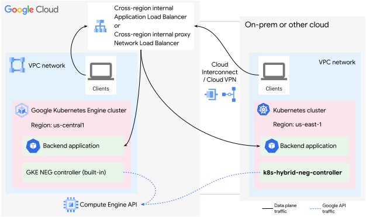

The diagram below shows the Google Cloud resources you provision for this
architecture.

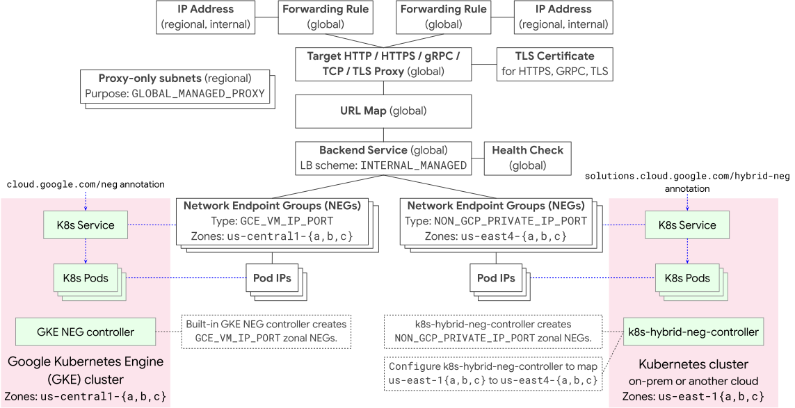

To provision the Google Cloud resources used in this architecture, follow the
steps in the document
[Set up a cross-region internal Application Load Balancer with hybrid connectivity](https://cloud.google.com/load-balancing/docs/l7-internal/setting-up-l7-cross-reg-hybrid).

For the environment outside Google Cloud, deploy `k8s-hybrid-neg-controller` to
your Kubernetes cluster, by following the steps in
[Deploy `k8s-hybrid-neg-controller` outside Google Cloud](deploy-off-gcp.md).

## Regional internal load balancing

The
[regional internal Application Load Balancer](https://cloud.google.com/load-balancing/docs/l7-internal)
and
[regional internal proxy Network Load Balancer](https://cloud.google.com/load-balancing/docs/tcp/internal-proxy)
enable internet traffic to reach your backends in one region. The
[Application Load Balancer](https://cloud.google.com/load-balancing/docs/application-load-balancer)
enables Layer-7 load balancing, while the
[proxy Network Load Balancer](https://cloud.google.com/load-balancing/docs/proxy-network-load-balancer)
enables Layer-4 load balancing.

Using `k8s-hybrid-neg-controller`, you can load balance across backends on both
GKE clusters on Google Cloud and Kubernetes clusters running on-prem or on other
clouds. See the diagram below for an architecture overview.

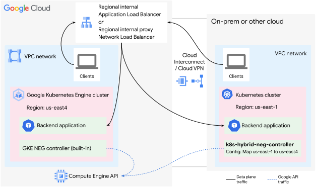

The diagram below shows the Google Cloud resources you provision for this
architecture.

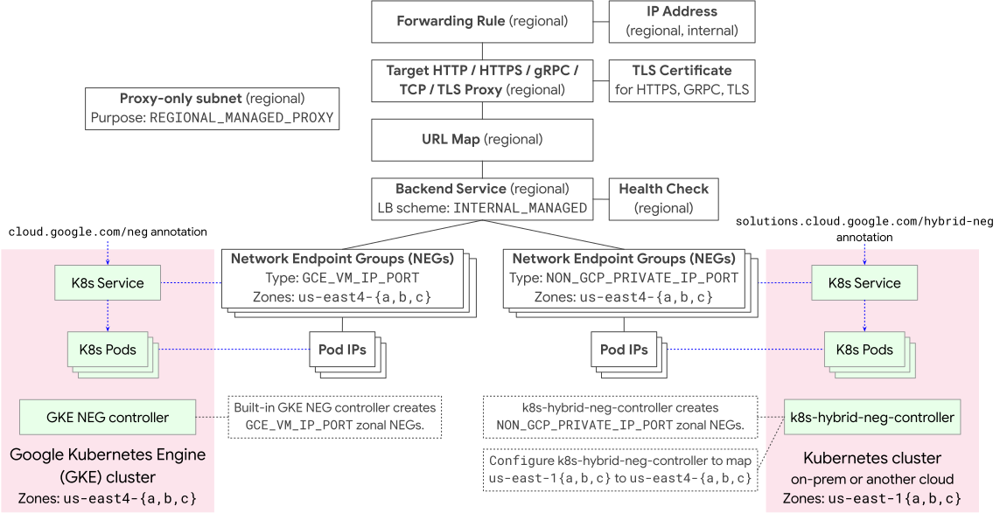

To provision the Google Cloud resources used in this architecture, follow the
steps in the document
[Set up a regional internal Application Load Balancer with hybrid connectivity](https://cloud.google.com/load-balancing/docs/l7-internal/setting-up-int-https-hybrid).

For the environment outside Google Cloud, deploy `k8s-hybrid-neg-controller` to
your Kubernetes cluster, by following the steps in
[Deploy `k8s-hybrid-neg-controller` outside Google Cloud](deploy-off-gcp.md).

## Cloud Service Mesh traffic routing

The
[managed Traffic Director xDS control plane](https://cloud.google.com/service-mesh/docs/managed-control-plane-overview#new-managed-control-plane)
enables traffic routing based on request header/metadata matching and
percentage-based traffic splitting to workloads deployed across multiple
regions.

Using `k8s-hybrid-neg-controller`, you can configure traffic routing and traffic
splitting across workloads deployed to both GKE clusters on Google Cloud and
Kubernetes clusters running on-prem or on other clouds. See the diagram below
for an architecture overview.

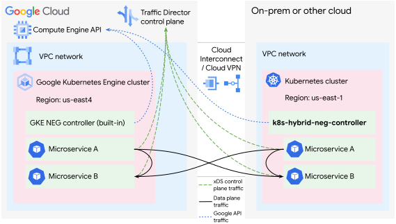

The diagram below shows the Google Cloud resources you provision for this
architecture.

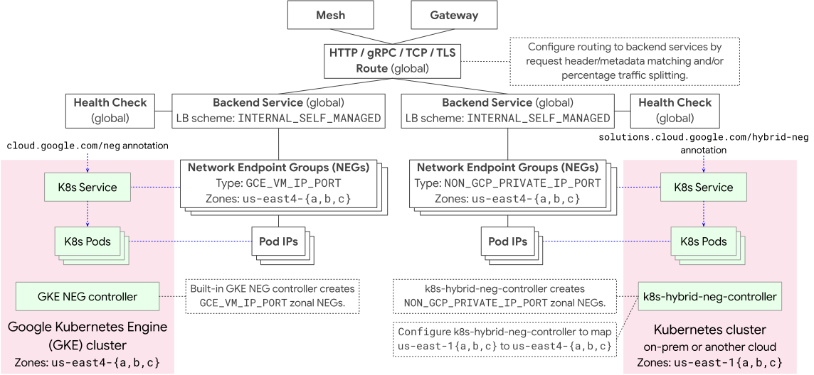

For further details on the Network Services API resources (Mesh, Gateway,
{HTTP,GRPC,TCP,TLS}Route) referenced in the diagram above, see the document
[Cloud Service Mesh service routing APIs overview](https://cloud.google.com/service-mesh/docs/service-routing/service-routing-overview).

For the environment outside Google Cloud, deploy `k8s-hybrid-neg-controller` to
your Kubernetes cluster, by following the steps in
[Deploy `k8s-hybrid-neg-controller` outside Google Cloud](deploy-off-gcp.md).

## Cloud Service Mesh locality-aware load balancing

The
[managed Traffic Director xDS control plane](https://cloud.google.com/service-mesh/docs/managed-control-plane-overview#new-managed-control-plane)
enables client-side locality-aware load balancing of traffic to workloads
deployed across multiple regions.

Using `k8s-hybrid-neg-controller`, you can configure locality-aware load
balancing across workloads deployed to both GKE clusters on Google Cloud and
Kubernetes clusters running on-prem or on other clouds. See the diagram below
for an architecture overview.

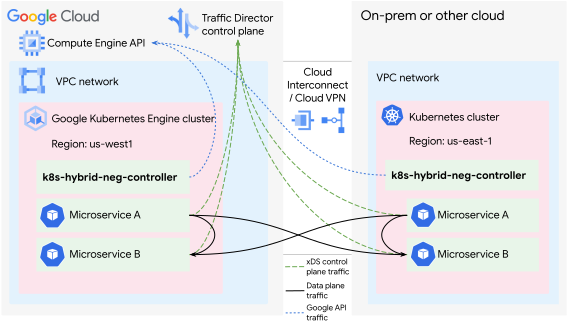

The diagram below shows the Google Cloud resources you provision for this
architecture.

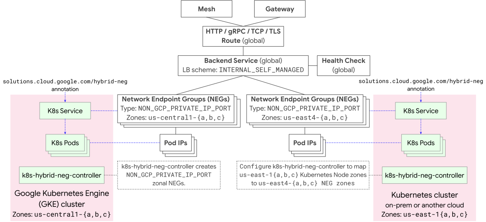

For further details on the Network Services API resources (Mesh, Gateway,
{HTTP,GRPC,TCP,TLS}Route) referenced in the diagram above, see the document
[Cloud Service Mesh service routing APIs overview](https://cloud.google.com/service-mesh/docs/service-routing/service-routing-overview).

For deploying `k8s-hybrid-neg-controller` to a GKE cluster running on Google
Cloud, follow the steps in
[Deploy the hybrid NEG controller to GKE](deploy-gke.md#deploy-the-hybrid-neg-controller).

For the environment outside Google Cloud, deploy `k8s-hybrid-neg-controller` to
your Kubernetes cluster by following the steps in
[Deploy `k8s-hybrid-neg-controller` outside Google Cloud](deploy-off-gcp.md).

## Cloud Service Mesh off Google Cloud

The
[managed Traffic Director xDS control plane](https://cloud.google.com/service-mesh/docs/managed-control-plane-overview#new-managed-control-plane)
enables traffic routing, traffic splitting, and client-side load balancing of
traffic between workloads that are deployed outside Google Cloud.

Using `k8s-hybrid-neg-controller`, you can configure traffic routing, traffic
splitting, and client-side load balancing across workloads deployed to
Kubernetes clusters running outside Google Cloud. These Kubernetes clusters can
run on-prem and on other clouds. The workloads require access to the Traffic
Director xDS control plane endpoint (`trafficdirector.googleapis.com:443`),
either via
[Private Google Access](https://cloud.google.com/vpc/docs/private-google-access)
(recommended), or via the public internet. See the diagram below for an
architecture overview.

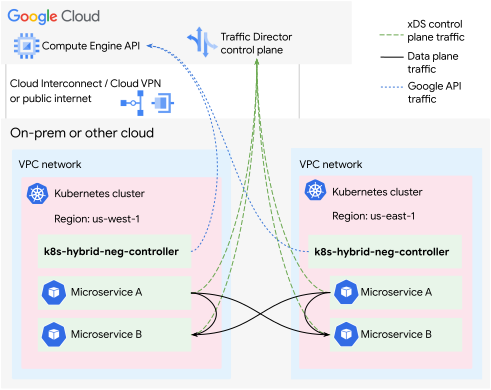

For the environments outside Google Cloud, deploy `k8s-hybrid-neg-controller` to
your Kubernetes clusters by following the steps in
[Deploy `k8s-hybrid-neg-controller` outside Google Cloud](deploy-off-gcp.md).
