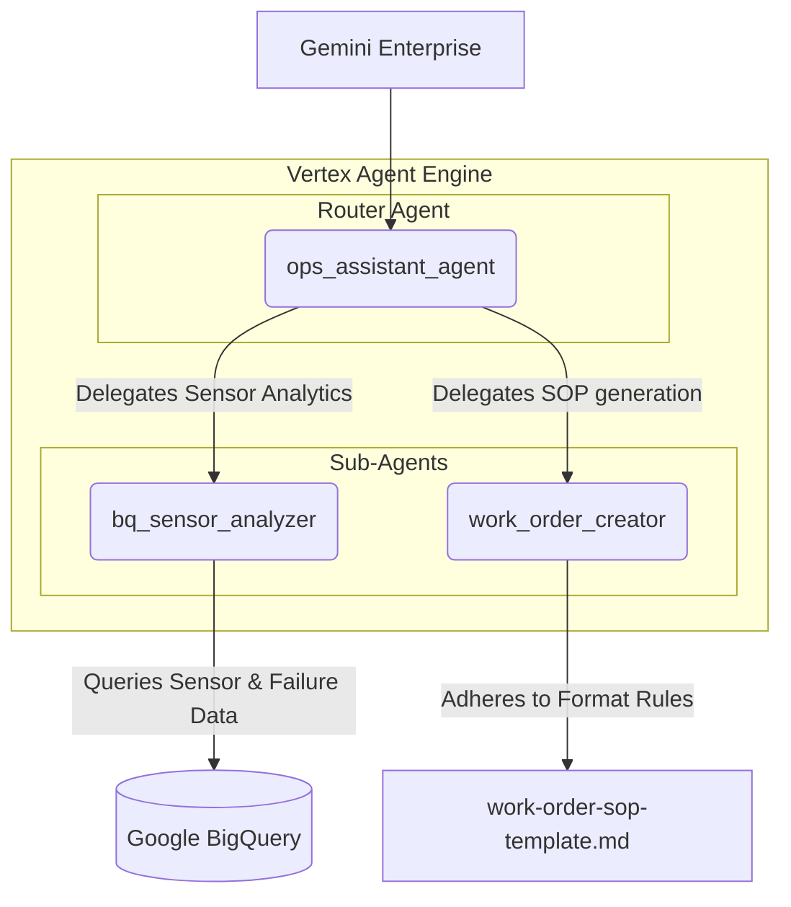

# Ops Assistant Agent (Manufacturing Operations)

The Ops Assistant Agent is an ADK-based set of agents for manufacturing
environments to monitor asset health, conduct root cause analysis, and generate
structured work orders.

## Architecture

The application uses the **Multi-Agent Routing** pattern with a top-level router
agent that delegates tasks to specialized sub-agents.



### Agents

- **`ops_assistant_agent` (Top-Level)**: A router agent that coordinates root
  cause conversations and delegates tasks.
- **`bq_sensor_analyzer` (Sub-Agent)**: Reads and analyzes sensor data from
  BigQuery. It is instructed to check current sensor readings and
  cross-reference with a `historical_failures` table to identify similarities
  and possible root causes.
- **`work_order_creator` (Sub-Agent)**: Responsible for generating detailed and
  formatted work orders that are in strict compliance with the
  [ops_assistant_agent/work-order-sop-template.md](ops_assistant_agent/work-order-sop-template.md).

---

## Technical Implementation Details

### Routing

The top level router agent processes the incoming conversation and orchestrates
the flow:

1.  Checks anomalies in sensor data via `bq_sensor_analyzer`.
1.  Guides discussions on asset failures and conducts interactive root cause
    analysis.
1.  Once the issue is identified, it delegates creation of compliance work
    orders to `work_order_creator`.

### Sensor Data and Failures Analysis

The sensor analyzer dynamic queries fully qualified tables in BigQuery. It
utilizes:

- `ASSET_DATASET` and `ASSET_TABLE` environment variables to determine where
  readings are stored.
- A `historical_failures` table in the same dataset to contrast current
  anomalies with past failures data.

### Work Order Format

Generated work orders strictly follow the template format (in this case
[ops_assistant_agent/work-order-sop-template.md](ops_assistant_agent/work-order-sop-template.md)):

- Status and Priority assignments.
- Asset Information metadata.
- Root cause supporting metrics.
- Details of Required Actions.

---

## 🚀 Getting Started

A step-by-step guide to configuring, running, and deploying the Ops Assistant
Agent.

### 1. Prerequisites

Before you begin, make sure your environment is set up with the following
requirements:

- **Python**: Version `>=3.10` and `<3.13`.
- **Google Cloud CLI**: Installed and authenticated via `gcloud auth login`.
- **Google Cloud Project**: An active GCP project with required services
  enabled. You can enable them via the GCP Web Console or by running this single
  gcloud command:

    ```bash
    gcloud services enable \
      aiplatform.googleapis.com \
      discoveryengine.googleapis.com \
      bigquery.googleapis.com
    ```

- **uv**: A fast Python package and project manager. Install it via:

    ```bash
    curl -LsSf https://astral.sh/uv/install.sh | sh
    ```

### 2. Installation & Dependency Resolution

To set up your virtual environment and download dependencies, run `uv sync` in
the root directory of the project:

```bash
# Sync project and resolve virtual environment dependencies
uv sync
```

> [!NOTE] Dependencies are declared and managed in `pyproject.toml` and pinned
> in the lockfile `uv.lock`.

### 3. Environment Configuration (.env)

Copy the environmental template to your project root:

```bash
cp .env.example .env
```

Open the newly created `.env` file and configure the required parameters:

- **`GOOGLE_CLOUD_PROJECT`**: Your active Google Cloud Project ID.
- **`GOOGLE_CLOUD_LOCATION`**: Your preferred Google Cloud region (e.g.,
  `us-central1`).
- **`GOOGLE_CLOUD_STORAGE_BUCKET`**: A GCS bucket (e.g.,
  `gs://your-staging-bucket`) used for staging reasoning engine builds during
  Vertex AI Agent Engine deployment.
- **`ASSET_DATASET`**: The dataset ID in BigQuery. Use underscores
  (`mfg_assets`) rather than hyphens, as hyphens will trigger SQL syntax errors
  when standard queries are run.
- **`ASSET_TABLE`**: The sensor reading table in BigQuery
  (`vertex_high_pressure_coolant_pump`).
- **`HISTORICAL_FAILURES_TABLE`**: The table documenting past failure history
  (`historical_failures`).

### 4. Database Seeding & Permissions setup

Before running or deploying the agents, you must seed the BigQuery dataset and
grant the necessary IAM access permissions:

1.  **Seed Database Tables**: Run the preparation script. It automatically loads
    the mock sensor CSV data from the `deployment/` folder into your specified
    BigQuery region and dataset:

```bash
uv run deployment/prepare_dataset.py
```

1.  **Grant IAM Permissions**: Execute the permissions script to authorize the
    Vertex AI Agent Engine and Discovery Engine service accounts to execute
    queries and fetch from the BigQuery dataset:

```bash
bash deployment/grant_permissions.sh
```

### 5. Run the Agent Locally

To test and interact with the routing agent locally, start the interactive Agent
Development Kit (ADK) Web App:

```bash
uv run adk web
```

Open the local URL returned in your terminal to interact with the Ops Assistant
Agent through your web browser.

---

## ☁️ Deploying to Vertex AI Agent Engine

The project contains a Python deployment script to push your multi-agent
application to Vertex AI:

```bash
uv run deployment/deploy.py
```

The script will:

1.  Package your local code components.
1.  Create and deploy the agent as a Vertex AI Reasoning Engine.
1.  Once deployed, you will get a Resource name which you will use in the
    section below. You can also get this Resource name from the Cloud Console in
    the Vertex AI Agent Engine section.

## Running the Agent in Gemini Enterprise

1.  Create a new Gemini Enterprise App within your Cloud project.
1.  In the Agents section of that App, add a Custom Agent via Agent Engine. Name
    the app something like "Ops Assistant".
1.  Configure the Agent Engine reasoning engine Resource name from the previous
    step.
1.  Access the App through the Overview link for Gemini Enterprise app
1.  Now you can access the Ops Assistant Agent through the Gemini Enterprise App
    using the `@<AgentName>` syntax.
1.  Use the sample interactions in `deployment/sample-demo.webm` as a starting
    point for how to use the agent
