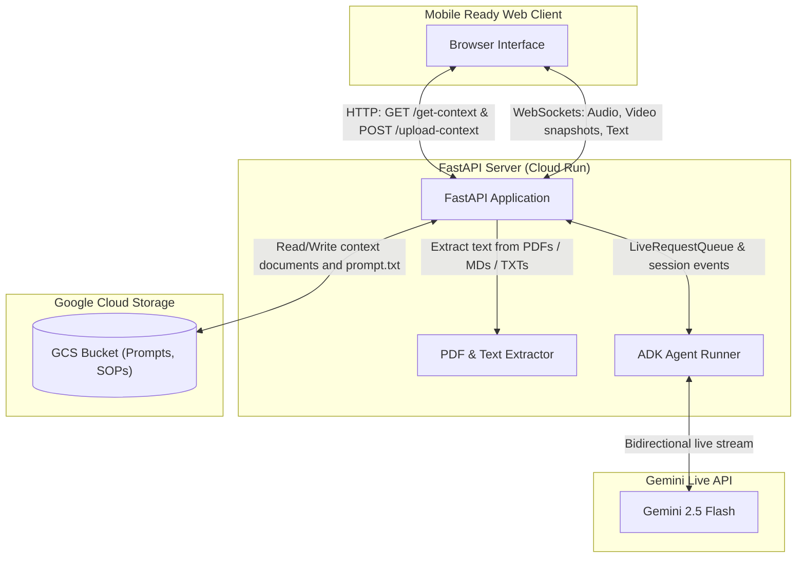

# Technician Assistant Agent

A detailed demonstration of a real-time, multimodal assistant designed for
technicians, built with Google's Agent Development Kit (ADK) and FastAPI. This
application showcases how a single, consolidated agent can handle both document
reading (manuals, procedures, contract etc.) and real-time visual analysis to
assist users in technical tasks.

## Overview

This project consolidates the functionalities of a multi-agent system into a
unified **Tech Assistant** agent capable of:

1.  **Document Reading**: Accessing reference documents stored in Google Cloud
    Storage (GCS).
1.  **Visual Analysis**: Processing live video stream frames to understand the
    user's physical context.
1.  **Multimodal Interaction**: Supporting text, audio, and image inputs with
    audio and text outputs.

## Features

- **Multimodal Agent**: A single agent for multiple tasks i.e. document reading
  and visual analysis.
- **Stateful Context**: Loads `prompt.txt` and reference files from a specified
  GCS bucket on startup to initialize agent behavior.
- **Context Modal Dialog**: A user interface popup allowing users to configure
  the agent's prompt, add files, and specify the GCS storage path dynamically.
- **Bidirectional Streaming**: Supports streaming of audio, text, and images via
  WebSockets.
- **Camera Switching**: Support for camera switching (front/back) on mobile
  devices with fallback for laptops.

## Architecture

The application bridges a web-based client with the Gemini Live API via a
FastAPI server using WebSockets.

### Component Diagram



### Data Flow

1.  **Initialization**: On startup, the backend lists and reads files from the
    GCS path defined by `GCS_STORAGE`. It reads `prompt.txt` as the primary
    instruction and appends the content of other files (PDFs, TXT, MD) as
    reference documents to the agent's instructions.
1.  **Session**: When the user clicks "Start Session", a WebSocket connection is
    established. The client sends real-time audio, text, or images.
1.  **Response**: The agent processes the inputs using its instructions and
    context documents, returning text and/or audio responses.

## Prerequisites

- Python 3.10 or higher
- **[uv](https://astral.sh/uv/)** for dependency management
- Google Cloud Project with Vertex AI enabled (or Gemini API key)
- A GCS bucket for storing context files.

**Note:** The GCS bucket should contain `prompt.txt` and reference documents
such as SOPs as files directly at the specified path. Do not use sub-folders.
You may use the samples from the `assets` directory of the source code as the
context files. Use the `prompt.txt` and `work-order.md` as the context files.

## Installation

1.  **Clone the repository** and navigate to the project directory.
1.  **Create a virtual environment** and install dependencies:

    ```bash
    uv sync
    ```

## Configuration

Create or update `app/.env` with the following environment variables. You can
copy the template from `app/.env.example`:

```env
# Choose your Live API platform
GOOGLE_GENAI_USE_VERTEXAI=TRUE

# For Vertex AI Live API
GOOGLE_CLOUD_PROJECT=your-project-id
GOOGLE_CLOUD_LOCATION=us-central1

# Model selection
DEMO_AGENT_MODEL=gemini-live-2.5-flash-native-audio

# Agent selection
DEMO_AGENT_TYPE=tech_assistant

# GCS Storage path for stateful context
GCS_STORAGE=gs://your-bucket-name/path
```

### GCS Bucket Setup

Ensure your bucket contains:

- `prompt.txt`: The main instructions for the agent.
- Other reference files (e.g., product manuals as PDFs or text files).

## Running the Application

Navigate to the `app` directory and start the server using `uv run`:

```bash
cd app
uv run uvicorn main:app --reload --host 0.0.0.0 --port 8000
```

Access the app at `http://localhost:8000`.

## Deployment

The application is configured to be built and deployed to **Google Cloud Run**.

### Deployment Prerequisites

- Authenticated with Google Cloud CLI
- Enabled Cloud Run, Artifact Registry, and Vertex AI in your GCP project
- Ensure the service account for Cloud Run has access to the GCS bucket and
  Vertex AI

### Deployment Steps

1.  **Authenticate with Google Cloud**:

    ```bash
    gcloud auth login
    gcloud config set project your-project-id
    ```

1.  **Configure Environment Variables**: The application reads standard dynamic
    environment variables. You must provision the standard environment variables
    listed inside `app/.env` for Cloud Run, see Configuration section above.
    - `GOOGLE_CLOUD_PROJECT`
    - `GOOGLE_CLOUD_LOCATION`
    - `GCS_STORAGE`
    - `DEMO_AGENT_TYPE=tech_assistant`
    - `DEMO_AGENT_MODEL=gemini-live-2.5-flash-native-audio`

1.  **Deploy the Application**: Deploy using the custom deployment script:

    ```bash
    ./deploy.sh
    ```

    Or deploy directly from source:

    ```bash
    gcloud run deploy --source .
    ```

1.  **Access the Application**: Access the application using the endpoint URL
    provided by the cloud run deployment. You may wish to configure IAP
    (Identity-Aware Proxy) to secure the application endpoint.

1.  **Start the Session**: Click the "Start Session" button on the application
    interface to start the session. Once the session starts, use the Video
    button to start a bidirectional audio-video session. Use the "Switch Camera"
    button to switch between front and back cameras.

1.  **Run the Demo**: You can then interact with the agent using voice and
    video. The agent will respond with voice and text. Use the sample video
    `sample-demo.mp4` from the `assets` directory as the script to familiarize
    yourself with the application.
