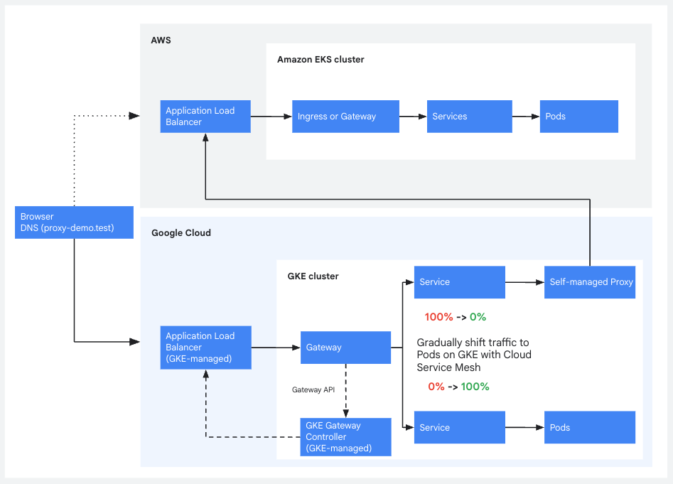

# Migrate live traffic from Amazon EKS to GKE using reverse proxies

This tutorial shows you how to migrate a live HTTP service from Amazon Elastic
Kubernetes Service (EKS) to Google Kubernetes Engine (GKE) while minimizing
downtime. You deploy a temporary NGINX reverse proxy in GKE to forward traffic
to EKS, then use Gateway API weights to shift traffic to GKE backends.

This tutorial takes approximately 45 minutes to complete.

## Overview



The migration follows these stages:

1.  Deploy the application to EKS.
1.  Start a continuous Locust load test that runs for the duration of the
    migration.
1.  Deploy the same application to GKE.
1.  Deploy a GKE Gateway, NGINX reverse proxy, and HTTPRoute that routes 100% of
    Gateway traffic to EKS through the proxy.
1.  Validate that EKS is still serving through the Gateway and proxy.
1.  Cut over `proxy-demo.test` to the GKE Gateway IP.
1.  Shift HTTPRoute traffic from 100% proxy to 100% GKE in increments, checking
    the Locust dashboard at each step.
1.  Decommission the proxy and review the Locust results.

## Objectives

- Deploy a containerized application to both Amazon EKS and GKE using Terraform.
- Use a GKE Gateway and HTTPRoute to control traffic distribution between two
  backends.
- Demonstrate a DNS cutover with minimal disruption using a containerized proxy
  and the Docker `--add-host` feature.
- Use an NGINX reverse proxy as a temporary bridge between clouds during traffic
  shifting.
- Validate the migration by monitoring a continuous Locust load test from start
  to finish.

## Costs

This tutorial uses billable components:

### AWS

- [Amazon EKS](https://aws.amazon.com/eks/pricing/)
- [Elastic Load Balancing](https://aws.amazon.com/elasticloadbalancing/pricing/)
- [Data transfer](https://aws.amazon.com/ec2/pricing/on-demand/#Data_Transfer)

### Google Cloud

- [Google Kubernetes Engine](https://cloud.google.com/kubernetes-engine/pricing)
- [Cloud Load Balancing](https://cloud.google.com/vpc/network-pricing#lb)
- [Cloud NAT](https://cloud.google.com/nat/pricing)
- [Cloud Router](https://cloud.google.com/network-connectivity/docs/router/pricing)
- [External IP addresses](https://cloud.google.com/vpc/network-pricing#ipaddress)
- [Network egress](https://cloud.google.com/vpc/network-pricing#internet_egress)

Use the
[Google Cloud Pricing Calculator](https://cloud.google.com/products/calculator)
to generate a cost estimate based on your projected usage.

To avoid continued charges, follow the instructions in [Clean up](#clean-up).

## Before you begin

1.  [Create a Google Cloud project](https://cloud.google.com/resource-manager/docs/creating-managing-projects)
    or select an existing project.

1.  [Enable billing](https://cloud.google.com/billing/docs/how-to/modify-project)
    for your Google Cloud project.

1.  [Enable the GKE, Compute Engine, and Cloud NAT APIs](https://console.cloud.google.com/flows/enableapi?apiid=container.googleapis.com,compute.googleapis.com,networkmanagement.googleapis.com).

### AWS permissions

Your AWS credentials need permissions to create and manage the following
resources:

- IAM Roles and Policies: For the EKS control plane and nodes
- VPC and Networking: VPC, subnets, security groups, and route tables
- EKS Cluster: The Kubernetes control plane and worker nodes

For demonstration purposes, the `AdministratorAccess` managed policy is
sufficient. In a production setting, always adhere to the principle of least
privilege.

### Google Cloud permissions

Ensure your user account or service account has the following IAM roles in your
Google Cloud project:

- Kubernetes Engine Admin (`roles/container.admin`): To create and manage the
  GKE cluster
- Compute Network Admin (`roles/compute.networkAdmin`): To manage VPC networks,
  Cloud NAT, and the GKE Gateway
- Service Account Admin (`roles/iam.serviceAccountAdmin`): To create service
  accounts for GKE nodes and other resources
- Project IAM Admin (`roles/resourcemanager.projectIamAdmin`): To grant IAM
  roles to service accounts

For demonstration purposes, the basic `Owner` role (`roles/owner`) is
sufficient. In a production setting, always adhere to the principle of least
privilege.

Install the following tools:

- [Docker](https://docs.docker.com/get-docker/) 29.1.5 or later
- [Terraform](https://developer.hashicorp.com/terraform/install) 1.11.1 or later
- [kubectl](https://kubernetes.io/docs/tasks/tools/) 1.34.5 or later
- [AWS CLI](https://docs.aws.amazon.com/cli/latest/userguide/getting-started-install.html)
  2.31.22 or later
- [Google Cloud CLI](https://cloud.google.com/sdk/docs/install) 561.0.0 or later
- [Python 3](https://www.python.org/downloads/) 3.13.12 or later

## Provision the source (EKS)

Provision the EKS cluster and deploy the application behind an Application Load
Balancer (ALB).

1.  Configure the AWS CLI with credentials that have permissions to create EKS
    clusters and IAM roles:

    ```sh
    aws configure
    ```

1.  Clone the repository and change the working directory:

    ```sh
    git clone --filter=blob:none --no-checkout https://github.com/GoogleCloudPlatform/cloud-solutions
    cd cloud-solutions
    git sparse-checkout set --cone projects/migrate-from-aws-to-google-cloud/eks-to-gke-proxy-migration
    git checkout
    cd projects/migrate-from-aws-to-google-cloud/eks-to-gke-proxy-migration
    ```

1.  Deploy the source environment:

    ```sh
    ./scripts/01-deploy-aws.sh
    ```

    The script provisions the following resources:
    - An EKS cluster
    - A Kubernetes Deployment and LoadBalancer Service

    <!--
        Disabling markdownlint MD046 because it interprets this note as a code
        block, and flags it for using indentation instead of code fences.
    -->
    <!-- markdownlint-disable MD046 -->

    !!! note "Local-only hostname"

        `proxy-demo.test` is a local-only hostname used throughout this tutorial
        as a stand-in for a real production domain. It is resolved within Docker
        containers using the `--add-host` feature, allowing you to test the
        migration without modifying your host's DNS settings.

    <!-- markdownlint-enable MD046 -->

    Example output:

    ```text
    ======================================================
    EKS deploy complete
    EKS_CLUSTER_NAME : proxy-demo-eks
    EKS_ALB_HOSTNAME : a12f33b-1732972728.us-west-1.elb.amazonaws.com
    EKS_ALB_IP       : 198.51.100.10
    ======================================================
    ```

    1.  Export the `EKS_ALB_IP` programmatically:

        ```sh
        export EKS_ALB_HOSTNAME=$(kubectl get svc proxy-demo -n app -o jsonpath='{.status.loadBalancer.ingress[0].hostname}')
        export EKS_ALB_IP=$(dig +short "${EKS_ALB_HOSTNAME}" | head -1)
        echo "EKS ALB IP: ${EKS_ALB_IP}"
        ```

    1.  Verify the application:

        ```sh
        curl -s -o /dev/null -w "%{http_code}\n" -H "Host: proxy-demo.test" http://${EKS_ALB_IP}/
        ```

    A `200` response confirms EKS is serving traffic.

### Start the load test and local proxy

Start a continuous load test against `http://proxy-demo.test` now, before
deploying anything to GKE. Locust stays running for the rest of the tutorial.
The dashboard gives you a live view of throughput, latency, and error rate as
you provision infrastructure, shift traffic, and decommission the proxy.

Use Docker Compose to run Locust and a local NGINX proxy to avoid modifying your
host's DNS settings.

1.  Start the load test and local UI proxy:

    ```sh
    export TARGET_IP=${EKS_ALB_IP}
    docker compose -f locust/docker-compose.yaml up -d --build
    ```

    Leave this running in the background.

1.  Open a browser at `http://localhost:8080`. You see the orange AWS page
    showing the cluster name and region.
1.  Open the Locust dashboard at `http://localhost:8089`. The test is already
    running.

1.  Wait two minutes for the test to stabilize, then note the baseline numbers
    from the dashboard. You compare against these at each stage of the
    migration.

    Example baseline values:

    - **Throughput:** ~23 req/s
    - **Median latency:** 70 ms
    - **P99 latency:** ~140 ms
    - **Error rate:** 0.00%

## Provision and configure your GKE environment

Provision a GKE Autopilot cluster and set up Cloud NAT so the proxy can reach
the EKS endpoint.

1.  Set your project ID and authenticate:

    ```sh
    export PROJECT_ID=YOUR_PROJECT_ID
    gcloud config set project $PROJECT_ID
    gcloud auth application-default login
    ```

    Replace `YOUR_PROJECT_ID` with your Google Cloud project ID.

1.  Deploy the GKE infrastructure:

    ```sh
    ./scripts/02-deploy-gcp.sh
    ```

    This step takes approximately 10 minutes. The script provisions the
    following resources:

    - VPC with auto subnets
    - GKE Autopilot cluster with Gateway API enabled
    - Cloud Router and Cloud NAT
    - Reserved regional static IP for NAT egress
    - Reserved global static IP for the GKE Gateway
    - Kubernetes ConfigMaps, Deployment, and ClusterIP Service with NEG
      annotation

    Example output:

    ```text
    ======================================================
    GKE deploy complete
    GKE_CLUSTER    : proxy-demo-gke
    GKE_GATEWAY_IP : 34.8.99.54
    NAT_IP         : 136.115.85.250
    ======================================================
    ```

## Migrate your workloads and shift traffic

In this stage, you shift traffic from EKS to GKE. The
[EKS to GKE migration guide](https://docs.cloud.google.com/architecture/migrate-amazon-eks-to-gke)
describes several approaches for traffic shifting, including:

- DNS routing policies
- Hybrid connectivity NEGs with Cloud Load Balancing
- A proxy with Cloud Service Mesh.

This guide uses a GKE Gateway with HTTPRoute, which provides
weighted traffic splitting.

### Deploy your workloads

The migration script deploys the GKE Gateway, NGINX proxy, and HTTPRoute. It
waits for the Gateway to reach `PROGRAMMED` status and the proxy pod rollout
before exiting. All traffic is initially routed 100% through the proxy to EKS.
GKE is in the path but not yet serving requests.

1.  Run the migration script:

    ```sh
    ./scripts/03-migrate.sh
    ```

    The script deploys the following resources:

    - GKE Gateway `proxy-demo-gateway` bound to the reserved static IP
    - NGINX proxy ConfigMap, Deployment, and ClusterIP Service with NEG
      annotation
    - HTTPRoute `proxy-demo-httproute` with 100% weight to the proxy and 0% to
      GKE

    Example output:

    ```text
    ======================================================
    Migration resources deployed

    Gateway IP   : 203.0.113.50
    Proxy target : a12f33b-1732972728.us-west-1.elb.amazonaws.com
    HTTPRoute    : 100% proxy / 0% GKE
    ======================================================
    ```

1.  Confirm the proxy pod is running and not in `CrashLoopBackOff`. A crash
    might mean `EKS_ALB_HOSTNAME` was empty or the Cloud NAT egress IP is not
    yet permitted by the EKS security group:

    ```sh
    kubectl get pods -n app -l app=eks-proxy
    ```

1.  Confirm the NEG annotation is registered on the proxy Service. The HTTPRoute
    weight splits do not work if the NEG endpoints are unhealthy:

    ```sh
    kubectl describe svc eks-proxy -n app
    ```

    Example output:

    ```text
    Annotations:  cloud.google.com/neg: {"exposed_ports":{"80":{}}}
                  cloud.google.com/neg-status: {"network_endpoint_groups":{"80":"k8s1-d583becf-app-eks-proxy-80-6fb2f3af"},"zones":["us-central1-c","us-central1-f"]}
    ...
    Events:
      Type    Reason  Age                From                   Message
      ----    ------  ----               ----                   -------
      Normal  Create  12m                neg-controller         Created NEG "k8s1-d583becf-app-eks-proxy-80-6fb2f3af"...
      Normal  SYNC    3s (x28 over 12m)  sc-gateway-controller  SYNC on app/eks-proxy was a success
    ```

### Validate your workloads and GKE environment

Confirm that requests routed through the Gateway and proxy are reaching EKS
before cutting over `proxy-demo.test`.

1.  Get the Gateway IP address from the Terraform output:

    ```sh
    export GKE_GATEWAY_IP=$(terraform -chdir=terraform/gcp output -raw gateway_ip)
    echo "GKE Gateway IP: ${GKE_GATEWAY_IP}"
    ```

    Example output:

    ```text
    GKE Gateway IP: 34.8.99.54
    ```

1.  Send a request to the Gateway IP with the expected Host header:

    ```sh
    curl -i -H "Host: proxy-demo.test" http://${GKE_GATEWAY_IP}/
    ```

    Example output:

    ```text
    HTTP/1.1 200 OK
    ...
    <body>
    <div class="label">Running on</div>
    <div class="provider">AWS</div>
    <div class="platform">Amazon EKS</div>
    </body>
    ```

    A `200` response with `AWS` as the provider confirms the GKE Gateway is
    routing traffic through the proxy to the EKS backend.

### Shift traffic from EKS to GKE

The shift happens in two stages. First, you cut over DNS so that
`proxy-demo.test` resolves to the GKE Gateway. The proxy still forwards
everything to EKS, so the response is identical. Then you use HTTPRoute weights
to move traffic from the proxy to the GKE backend in increments, checking the
Locust dashboard at each step.

#### DNS cutover

With the proxy validated, you now point `proxy-demo.test` at the GKE Gateway IP
instead of the EKS ALB. After this step, all traffic for `proxy-demo.test`
enters through Google Cloud.

The proxy is still forwarding 100% of requests to EKS, so the page content
doesn't change. What changes is the path: requests travel through the GKE
Gateway and proxy before reaching EKS. If something is wrong with that path,
like a missing NAT route or a blocked port, you find out now, while EKS is still
doing the actual serving.

In this tutorial you simulate the DNS cutover by restarting the local Docker
containers to point at the GKE Gateway IP.

1.  Restart the load test and proxy with the new target IP:

    ```sh
    export TARGET_IP=${GKE_GATEWAY_IP}
    docker compose -f locust/docker-compose.yaml up -d --force-recreate
    ```

1.  Reload `http://localhost:8080`. The page still shows orange. The requests
    are now going to the GKE Gateway, which routes 100% through the proxy to
    EKS.

1.  Check the Locust dashboard at `http://localhost:8089`. The cutover does not
    cause any errors. If you see a brief latency spike during the DNS cutover,
    that's normal. It settles within a few seconds.

> **Production DNS cutover process**
>
> In a production environment, you would update your DNS records instead of
> restarting a local proxy container. Keep in mind that
> [not all resolvers respect TTL values](https://sre.google/sre-book/load-balancing-frontend/),
> so plan for a propagation window:
>
> 1.  Lower the TTL on your `A` or `CNAME` record to a short value well in
>     advance of the cutover.
> 1.  Update the record in your DNS provider to point to the GKE Gateway IP.
> 1.  After propagation completes and all traffic arrives at the GKE Gateway,
>     proceed to traffic shifting.
>
> For more on DNS considerations during migration, see
> [Best practices for validating a migration plan](https://cloud.google.com/architecture/migration-to-google-cloud-best-practices).

#### Incremental traffic shifting

Update HTTPRoute weights to shift traffic from the proxy to the GKE backend. At
each step, `04-test-traffic.sh` applies the patch and runs 10 curl requests to
spot-check the split. After each shift, check the Locust dashboard to confirm
throughput and error rate are holding before moving to the next step.

If the error rate rises above 0% or latency increases significantly at any
point, stop and investigate before shifting more traffic.

> **Note:** GKE Gateway changes can take 30–60 seconds to propagate. If the
> traffic split doesn't match the weights, wait 30 seconds and run the script
> again.

1.  **80/20** — Shift 20% of traffic to GKE:

    ```sh
    ./scripts/04-test-traffic.sh 80 20
    ```

    Example output:

    ```text
    Applying Traffic Patch: EKS=80, GKE=20
    ---------------------------------------------------
    httproute.gateway.networking.k8s.io/proxy-demo-httproute patched (no change)

    Verifying Cluster Weights:
      eks-proxy: 80
      proxy-demo: 20

    Testing Live Traffic (10 requests):
    ---------------------------------------------------

    Step 3: Waiting for propagation...
    ---------------------------------------------------
    Polling for GKE traffic detection...
    Syncing: attempt 15/60...
    [OK] Detected traffic! Propagation in progress.

    Propagation window complete. Starting traffic test.
    Request 1: AWS
    Request 2: AWS
    Request 3: Google Cloud
    Request 4: AWS
    Request 5: AWS
    Request 6: AWS
    Request 7: AWS
    Request 8: AWS
    Request 9: Google Cloud
    Request 10: AWS
    ------------------------------------

    Visual Verification
    ---------------------------------------------------
    1. Open your browser to: http://localhost:8080
    2. Refresh 10 times: Orange = EKS (AWS), Blue = GKE (Google Cloud)
    ```

    > **Note:** Locust also driving traffic, so results vary.

1.  **50/50** — Shift to an even split:

    ```sh
    ./scripts/04-test-traffic.sh 50 50
    ```

    Expected result: ~5 `AWS` and ~5 `Google Cloud`. On the Locust dashboard,
    you might see a small change in median latency as the two backends have
    different response times.

1.  **20/80** — Shift the majority to GKE:

    ```sh
    ./scripts/04-test-traffic.sh 20 80
    ```

    Expected result: ~2 `AWS` and ~8 `Google Cloud`. Median latency on the
    dashboard might drop as more requests go directly to GKE without the proxy
    hop.

1.  **0/100** — Complete the cutover:

    ```sh
    ./scripts/04-test-traffic.sh 0 100
    ```

    Expected result:

    ```text
    Applying Traffic Patch: EKS=0, GKE=100
    ---------------------------------------------------
    httproute.gateway.networking.k8s.io/proxy-demo-httproute patched (no change)

    Verifying Cluster Weights:
      eks-proxy: 0
      proxy-demo: 100

    Testing Live Traffic (10 requests):
    ---------------------------------------------------

    Step 3: Waiting for propagation...
    ---------------------------------------------------
    Polling for GKE (Google Cloud) traffic detection...

    [OK] Detected traffic! Propagation in progress.

    Propagation window complete. Starting traffic test.
    Request 1: Google Cloud
    Request 2: Google Cloud
    Request 3: Google Cloud
    Request 4: Google Cloud
    Request 5: Google Cloud
    Request 6: Google Cloud
    Request 7: Google Cloud
    Request 8: Google Cloud
    Request 9: Google Cloud
    Request 10: Google Cloud
    ------------------------------------

    Visual Verification
    ---------------------------------------------------
    1. Open your browser to: http://localhost:8080
    2. Refresh 10 times: Orange = EKS (AWS), Blue = GKE (Google Cloud)
    ```

1.  Reload `http://localhost:8080`. Every reload shows the blue GKE page.

1.  Check the Locust dashboard at `http://localhost:8089`. Confirm the tests are
    steady before proceeding to decommission.

#### Monitor the shift in Google Cloud console

The Locust dashboard shows client-side metrics. For server-side visibility, you
can watch the transition in Cloud Monitoring.

1.  In the Google Cloud console, go to **Monitoring > Metrics Explorer**.

1.  Switch to the **PromQL** tab and paste the following query:

    ```promql
    sum by (backend_target_name) (
      increase(loadbalancing_googleapis_com:https_request_count{
        monitored_resource="https_lb_rule",
        backend_target_name=~".*proxy-demo.*|.*eks-proxy.*"
      }[1m])
    )
    ```

    The `eks-proxy` line descends and the `proxy-demo` line ascends as you shift
    weights.

### Decommission the source environment

With traffic on GKE, remove the proxy resources. They are no longer in the
traffic path.

1.  Verify the HTTPRoute sends 0% to the proxy:

    ```sh
    kubectl get httproute proxy-demo-httproute -n app -o yaml | \
      awk '/name:/ {name=$2} /weight:/ {print "  " name ": " $2}'
    ```

    Expected output:

    ```text
      eks-proxy: 0
      proxy-demo: 100
    ```

1.  Delete the proxy Deployment, Service, and ConfigMap:

    ```sh
    kubectl delete deployment eks-proxy -n app
    kubectl delete service eks-proxy -n app
    kubectl delete configmap eks-proxy-config -n app
    ```

1.  Confirm the proxy resources are removed:

    ```sh
    kubectl get deployment,service,configmap -n app
    ```

    The output shows only the `proxy-demo` Deployment and Service. No
    `eks-proxy` resources remain.

### Validate the migration

1.  Return to the terminal where you ran `docker compose` and stop the local
    containers:

    ```sh
    docker compose -f locust/docker-compose.yaml stop
    docker compose -f locust/docker-compose.yaml logs locust
    docker compose -f locust/docker-compose.yaml down
    ```

    You can view the final Locust test summary in your terminal output.

    Example output:

    ```text
    Type     Name        # reqs      # fails |    Avg     Min     Max     Med |   req/s  failures/s
    --------|-----------|-------|------------|-------|-------|-------|-------|--------|-----------
    GET      /            12840      0(0.00%) |     52      31    1700      38 |   18.61        0.00
    GET      /health       3210      0(0.00%) |     50      31    1439      38 |    4.86        0.00
    --------|-----------|-------|------------|-------|-------|-------|-------|--------|-----------
    Aggregated            16050      0(0.00%) |     52      31    1700      38 |   23.47        0.00
    ```

    The aggregate numbers cover the full migration window. In this run, the 0%
    error rate indicates that traffic was handled without interruption across
    all phases: DNS cutover, traffic shifting, and proxy decommission.

    The median latency in the aggregate, 38 ms, is lower than the EKS baseline,
    70 ms, because the later portion of the test ran against GKE directly. On
    the Locust dashboard's charts tab, you can see the latency drop as traffic
    shifted from the proxy path to GKE.

    The elevated maximum of 1700 ms results from GKE Autopilot's on-demand node
    scheduling. The first requests to a freshly scheduled pod wait for the node
    to provision. These outliers decrease after the cluster reaches a steady
    state.

#### Key performance comparison

Compare the dashboard's early baseline period, first 2–3 minutes, when EKS
served 100% of traffic, against the final period, after 0/100 cutover:

| Period       | Med   | Min   | Max     | req/s | Errors |
| ------------ | ----- | ----- | ------- | ----- | ------ |
| EKS baseline | 70 ms | 66 ms | 145 ms  | ~23.4 | 0%     |
| GKE final    | 38 ms | 31 ms | 1700 ms | ~23.4 | 0%     |

Your numbers vary depending on region, instance type, and network conditions.

#### What the numbers show

- **Latency:** Median response time dropped from 70 ms to 38 ms after the shift
  to GKE.
- **Stability:** The error rate remained at 0% throughout this run.
- **Tail latency:** The 1700 ms maximum reflects Autopilot cold-start node
  scheduling and is expected to decrease under sustained traffic.

## Clean up

To avoid incurring charges to your AWS and Google Cloud accounts, delete the
resources created in this tutorial. You can either delete the Google Cloud
project or destroy the individual resources.

1.  Destroy the AWS resources:

    ```sh
    terraform -chdir=terraform/aws destroy -auto-approve
    ```

1.  Destroy the Google Cloud resources:

    ```sh
    terraform -chdir=terraform/gcp destroy -auto-approve
    ```

## What's next

- Read the full
  [Migrate from Amazon EKS to GKE](https://docs.cloud.google.com/architecture/migrate-amazon-eks-to-gke)
  architecture guide for assessment, planning, and production migration
  strategies.
