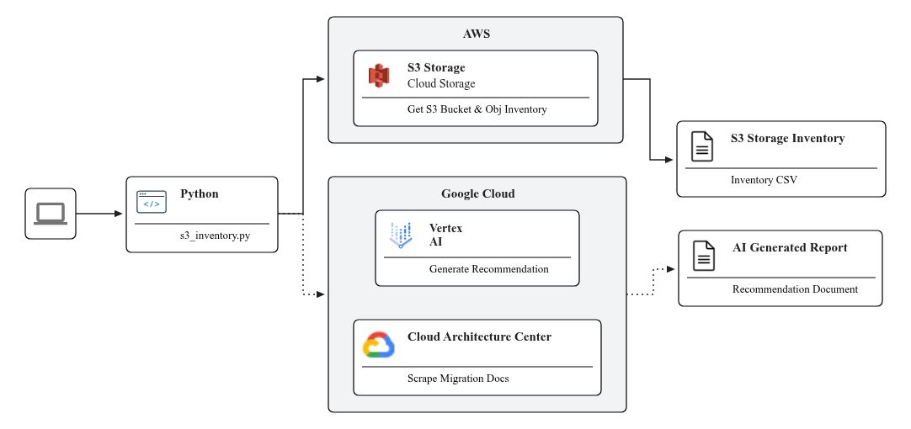

# S3 to Cloud Storage Migration Demo and Inventory

This document describes the high-level architecture of the Python application
used to generate Amazon S3 inventory reports for migration. The application has
a core function for fetching inventory data and an optional function for
enriching this data with contextual information from the Cloud Architect Center
[Migrate from Amazon S3 to Cloud Storage](https://cloud.google.com/architecture/migrate-amazon-s3-to-cloud-storage).

## Architecture

The diagram below visualizes the components and the flow of the application. The
optional functionality is clearly marked with a dotted line.


## Component Breakdown

The Python application is designed with modularity, allowing the optional AI
recommendation step to be included or skipped based on user configuration.

1.  **Amazon S3 (Data Source)**
    - **Role:** The primary data source. The application inventories S3 buckets
      and their objects.
    - **Data Points:** It gathers detailed configuration for each bucket (e.g.,
      encryption, versioning, lifecycle rules) and for each object (e.g., size,
      storage class, last modified date).

1.  **Python Application (Core Logic)**
    - **S3 Interaction (`utils.py`):** Uses the `boto3` library to communicate
      with the AWS SDK. It lists all buckets and their configurations, and for a
      specified bucket, lists all objects and their versions.
    - **Web Content Fetching (`web_fetch.py`):** Before generating
      recommendations, the application fetches external guidance from a Google
      Cloud Architecture Center URL using the `requests` library. This provides
      up-to-date context for the migration recommendations.
    - **AI Recommendation Engine (`gemini.py`):** This is an optional module,
      skipped if the `--no-gemini-recommendations` flag is used. It uses the
      `google-genai` library to connect to a Gemini model on Vertex AI. It sends
      the collected S3 inventory data and the fetched web content to the model
      to generate a migration plan.
    - **Orchestration (`s3_inventory.py`):** The main script that coordinates
      the entire process. It handles command-line arguments, calls the inventory
      functions, fetches web context, and triggers the AI recommendation
      generation.

1.  **Outputs**
    - **CSV Reports:** `bucket_inventory.csv` and
      `object_inventory_{bucket_name}.csv`. These files contain the raw
      inventory data and are always generated.
    - **Markdown Report (`migration_recommendations.md`):** An optional,
      AI-generated report that provides migration recommendations in a markdown
      table.

### Implementation Details

| Component          | Technology/Tool            | Interaction/Purpose                                 |
| :----------------- | :------------------------- | :-------------------------------------------------- |
| S3 Inventory       | Python (`boto3`, `pandas`) | Lists buckets/objects, gets configs, creates CSVs.  |
| Web Context        | Python (`requests`)        | Fetches migration guide from Google Cloud URL.      |
| AI Recommendations | Python (`google-genai`)    | Generates migration plan using Gemini on Vertex AI. |
| CLI Interface      | Python (`argparse`)        | Provides a command-line flag to skip AI features.   |
| Console Output     | Python (`rich`)            | Prints AI recommendations as formatted markdown.    |
| Configuration      | Python (`config.py`)       | Manages Gemini model name, prompt, and context URL. |

## Sourcing & Context

The guidance for this project is sourced from the Google Cloud Architecture
Center document:
[Migrate from Amazon S3 to Cloud Storage](https://cloud.google.com/architecture/migrate-amazon-s3-to-cloud-storage).

This script focuses on the **Assess** phase of the cloud migration framework:

### Key Inventory Data Points

The Gemini recommendations leverage the following key data points to create a
plan for migrating S3 artifacts :

- **Server-side encryption** and **IAM** settings.
- **Cost allocation tags** and **S3 Object Lock**.
- **Object versioning** and **Intelligent-Tiering**.
- **Aggregate statistics** like object size and count, which are used to
  estimate time and cost.

## Costs

This solution uses billable services from both AWS and Google Cloud. Please be
aware of the following potential costs:

- **AWS S3 CLI/Python SDK Calls:** The scripts and tools use S3 API calls like
  `ListAllMyBuckets`, `ListBucket`, `CreateBucket`, `PutObject`, etc. While
  these are relatively low-cost, they are billable. Review the
  [AWS S3 Pricing page](https://aws.amazon.com/s3/pricing/) for details on
  **Request and Data Retrieval** pricing.
- **Google Gemini Python SDK Calls (Vertex AI):** The inventory script can call
  the Gemini API to generate migration recommendations. This is a billable
  service on **Vertex AI**. Costs are typically based on the amount of data
  (tokens) sent to and received from the model. Review the
  [Vertex AI Pricing for Generative AI](https://cloud.google.com/vertex-ai/generative-ai/pricing)
  to estimate costs based on your usage.

## Prerequisites

### AWS Permissions

The full demo setup and cleanup requires the permissions listed in the bullet
points below.

If you only intend to run the `s3_inventory.py` script without the AI
recommendations based on inventory data, you can use the following minimum
permissions policy:

```json
{
    "Version": "2012-10-17",
    "Statement": [
        {
            "Effect": "Allow",
            "Action": [
                "s3:ListAllMyBuckets",
                "s3:GetBucketLocation",
                "s3:ListBucket"
            ],
            "Resource": "*"
        }
    ]
}
```

### (Optional) Create Sample Bucket and Data

The script found in the `s3-to-cloud-storage/scripts` files create AWS buckets
and objects for demo purposes.

- An AWS user account with permissions to create S3 buckets and manage IAM.
  While an admin user is simplest for this demo, it is not recommended for
  production environments. For a least-privilege setup, create an IAM policy
  with the following permissions and attach it to your user or role:
    - `s3:CreateBucket`
    - `s3:PutBucketTagging`
    - `s3:PutObject`
    - `s3:ListBucket`
    - `s3:ListAllMyBuckets`
    - `s3:GetBucketLocation`
- An AWS Access Key ID and AWS Secret Access Key for your user to run the AWS
  CLI.

### Google Cloud

- A Google Cloud project.
- The Google Cloud SDK (gcloud) or access to the Google Cloud Shell.
- To create and manage Storage Transfer Service jobs, your user account needs
  the `Storage Transfer Admin` role (`roles/storagetransfer.admin`).
- To use the Gemini recommendation feature, your user account needs the
  `Vertex AI User` role (`roles/aiplatform.user`).

### Local Environment

- Python 3.6+
- AWS CLI installed and configured.

## Setup

### Configure AWS CLI

First, ensure you have the AWS CLI installed and configured.

1.  [Install AWS CLI](https://docs.aws.amazon.com/cli/latest/userguide/getting-started-install.html)

1.  Verify AWS CLI version:

    ```sh
    aws --version
    ```

1.  Configure AWS Credentials:

    ```sh
    aws configure
    ```

    Provide your AWS Access Key ID, Secret Access Key, and default region using
    a role with the minimum defined roles listed above.

### (Optional) Create S3 Bucket and Upload Sample Files

The `scripts/setup-s3-demo.sh` script will create an S3 bucket, generate sample
files, and upload them.

1.  Navigate to the `scripts` directory:

    ```sh
    cd projects/migrate-from-aws-to-google-cloud/s3-to-cloud-storage/scripts
    ```

1.  Set the environment variables:

    ```sh
    export BUCKET_NAME="mmb-$(date +%s)"
    export AWS_REGION="us-east-2"
    export PROJECT_TAG="mmb"
    export COST_CENTER_TAG="1234"
    ```

1.  Run the script:

    ```sh
    ./setup-s3-demo.sh
    ```

    When prompted, enter `yes` to approve the creation of AWS resources.

### Install Python Requirements

The inventory script has Python dependencies.

1.  Navigate to the `python` directory:

    ```sh
    cd ../python
    ```

1.  Install the required libraries using pip:

    ```sh
    pip3 install virtualenv
    python3 -m venv <your-env>
    source <your-env>/bin/activate
    pip3 install -r requirements.txt
    ```

## Usage: S3 Inventory and Gemini Recommendations

The `s3_inventory.py` script generates an inventory of your S3 buckets and
objects.

### Set Environment Variables

Set the following environment variables to configure the Gemini client:

```sh
export GOOGLE_PROJECT_ID="your-gcp-project-id"
export GOOGLE_REGION="your-gcp-region"
```

### Run the script

To run the script, execute the following command from within the `python`
directory:

```sh
export REPORT_FILE_PATH=/path/to/reports
python s3_inventory.py
```

To run the script without generating Gemini recommendations (to avoid associated
API costs), use the `--no-gemini-recommendations` flag:

```sh
export REPORT_FILE_PATH=/path/to/reports
python s3_inventory.py --no-gemini-recommendations
```

The script generates CSV inventory files for your buckets and objects. If the
`--no-gemini-recommendations` flag is not used, it will also generate a
`migration_recommendations.md` file with an AI-powered summary.

## Configuration

The `python/config.py` file contains the configuration for the Gemini API. You
can modify this file to change the following settings:

- `GEMINI_RECOMMENDATION_PROMPT`: The prompt template for generating Gemini
  recommendations.
- `GEMINI_MODEL`: The Gemini model to use for generating recommendations.
- `GEMINI_USER_AGENT`: The user agent to use when making Gemini API calls.
- `EXTERNAL_CONTEXT_URL`: The URL to fetch external context from for Gemini
  recommendations.

## Cleanup

To clean up the AWS environment created by the `setup-s3-demo.sh` script, run
the `cleanup-s3-demo.sh` script from the `scripts` directory.

```sh

cd projects/migrate-from-aws-to-google-cloud/s3-to-cloud-storage/scripts

./cleanup-s3-demo.sh <your-bucket-name>

```

When prompted, enter `DELETE` to confirm the deletion of the S3 bucket and its
contents.
