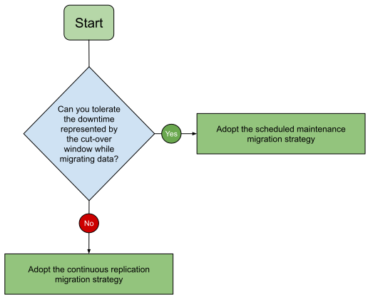
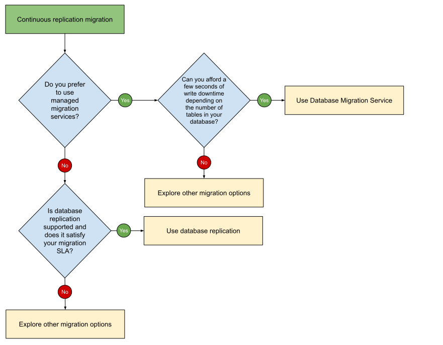

# Migrate from Azure to Google Cloud: Migrate Azure Database for MySQL to Cloud SQL for MySQL

Google Cloud provides tools, products, guidance, and professional services to
migrate from Azure Database for MySQL to Cloud SQL. This document discusses how
to design, implement, and validate a database migration from Azure Database for
MySQL to Cloud SQL.

This document is intended for cloud and database administrators who want details
about how to plan and implement a database migration project. It’s also intended
for decision-makers who are evaluating the opportunity to migrate and want an
example of what a migration might look like.

This document focuses on homogeneous migrations of Azure Database for MySQL to
Cloud SQL. A homogeneous database migration is a migration between the source
and target databases of the same database technology, regardless of the database
version. For example, you migrate from a MySQL based database instance in Azure
to another MySQL based database in Google Cloud.

Google Cloud provides Cloud SQL for MySQL, a fully managed relational database
service that allows users to deploy, manage, and scale MySQL databases without
the overhead of managing infrastructure. In this document, we focus on Cloud SQL
for MySQL as the target environment to migrate the Azure Database for MySQL to.

| Source                   | Destination         |
| :----------------------- | :------------------ |
| Azure Database for MySQL | Cloud SQL for MySQL |

For a comprehensive mapping between Azure and Google Cloud services, see
[compare AWS and Azure services to Google Cloud services](https://cloud.google.com/free/docs/aws-azure-gcp-service-comparison).

For this migration to Google Cloud, we recommend that you follow the migration
framework described in
[Migrate to Google Cloud: Get started](https://cloud.google.com/architecture/migration-to-gcp-getting-started).

The following diagram illustrates the path of your migration journey. For
migration scenarios, the Deploy phase is equivalent to performing a migration
process.

You might migrate from Azure Database for MySQL to Cloud SQL in a series of
iterations—for example, you might migrate some instances first and others later.
For each separate migration iteration, you follow the phases of the general
migration framework:

1.  Assess and discover your workloads and data.
1.  Plan and build a foundation on Google Cloud.
1.  Migrate your workloads and data to Google Cloud.
1.  Optimize your Google Cloud environment.

For more information about the phases of this framework, see
[Migrate to Google Cloud: Get started](https://cloud.google.com/architecture/migration-to-gcp-getting-started).

To design an effective migration plan, we recommend that you validate each step
of the plan, and ensure that you have a rollback strategy. To help you validate
your migration plan, see
[Migrate to Google Cloud: Best practices for validating a migration plan](https://cloud.google.com/architecture/migration-to-google-cloud-best-practices).

The workloads to migrate may be composed of resources of several kinds, such as:

- Compute resources
- Data and object storage
- Databases
- Messaging and streaming
- Identity management
- Operations
- Continuous integration and continuous deployment

This document focuses on migrating Azure Database for MySQL to Cloud SQL for
MySQL. For more information about migrating other kinds of resources, such as
compute resources and objects storage from Azure to Google Cloud, see the
[Migrate from Azure to Google Cloud document series](./README.md).

## Assess the source environment

In the assessment phase, you determine the requirements and dependencies of the
resources that you want to migrate from Azure Database for MySQL to Cloud SQL
for MySQL.

The assessment phase consists of the following tasks:

1.  Build a comprehensive inventory of your workloads.
1.  Catalog your workloads according to their properties and dependencies.
1.  Train and educate your teams about Google Cloud, including database best
    practices.
1.  Build experiments and proofs of concept on Google Cloud.
1.  Calculate the total cost of ownership (TCO) of the target environment.
1.  Decide on the order and priority of the workloads that you want to migrate.

The database assessment phase helps you answer questions regarding your database
version, size, platform, edition, dependencies and many more. It helps choose
the size and specifications of your target Cloud SQL instance that match the
source for similar performance needs. Pay special attention to disk size and
throughput, IOPS and number of vCPUs. Migrations might struggle or fail due to
incorrect target instance sizing. Incorrect sizing can lead to long migration
times, database performance problems, database errors and application
performance problems. When deciding on the Cloud SQL instance, keep in mind that
disk performance is based on the disk size and the number of vCPUs.

For more information about the assessment phase and these tasks, see
[Migrate to Google Cloud: Assess and discover your workloads](https://cloud.google.com/solutions/migration-to-gcp-assessing-and-discovering-your-workloads).
The following sections are based on information in that document.

### Build an inventory of your Azure Database for MySQL databases

To define the scope of your migration, you create an inventory and collect
information about your Azure Database for MySQL databases. Ideally, this should
be an automated process, because manual approaches are prone to error and can
lead to incorrect assumptions.

Azure Database for MySQL and Cloud SQL for MySQL might not have similar
features, instance specifications, or operation. Some functionalities might be
implemented differently or be unavailable. Some features are specific only to
Azure Database for MySQL. For example Azure’s auto-scaling feature is available
only in the Cloud SQL for MySQL Enterprise Plus edition.

Azure Database for MySQL has burstable compute configurations, designed to
handle workloads with variable CPU demands. In other areas, Cloud SQL for MySQL
employs features that are not available in Azure Database for MySQL like the 64
TB maximum storage size or MySQL version 5.6 support in the Enterprise edition.
Other areas of differences might include underlying infrastructure,
authentication and security, replication and backup.

Benchmarking can help you to better understand the workloads that are to be
migrated and contributes to defining the right architecture of the migration
target environment. Collecting information about performance is important to
help estimate the performance needs of the Google Cloud target environment.
Benchmarking concepts and tools are detailed in the Perform testing and
validation of the migration process, but they also apply to the inventory
building stage.

For more information about Azure Database for MySQL, see
[What is Azure Database for MySQL - Flexible Server?](https://learn.microsoft.com/en-us/azure/mysql/flexible-server/overview)

#### Performance assessment

Take baseline measurements on your source environment in production use.
Consider employing tools such as Benchmark Kit, DBT2 Benchmark Tool and SysBench
Benchmark Tool.

- Measure the size of your data, as well as your workload’s performance. How
  long do important queries or transactions take, on average? How long during
  peak times? This includes metrics such as:

    - Query response times: For common and critical queries.
    - Transactions per second (TPS): A measure of how many transactions your
      database can handle.
    - Resource utilization: CPU, memory, and disk I/O usage.
    - Latency: The time it takes for data to travel between points.

- Load testing: Simulate realistic user loads to assess how the database
  performs under stress.
- You document the benchmarking results for later comparison in the validate the
  migration before the cut-over step. The comparison helps you decide if the
  fidelity of your database migration is satisfactory and if you can switch your
  production workloads.

For more information about benchmarking, see
[MySQL Benchmark Tool](https://dev.mysql.com/downloads/benchmarks.html).

#### Tools for assessments

We recommend Google Cloud
[Migration Center](https://cloud.google.com/migration-center/docs/migration-center-overview)
for an initial full assessment of your current infrastructure and database
estate. With Migration Center you can perform a complete assessment of your
application and database landscape, including the technical fit of your database
for a Cloud SQL database migration. You receive Cloud SQL shape recommendations,
create a TCO report composed of servers and databases, and you can also set
preferred target Google Cloud configurations.

The database assessment with Migration Center is comprised of three main steps:

- Collect databases configuration via open source scripts or exports
- Assess database Technical Fit to Cloud SQL
- Generate a TCO report, including server grouping and migration preferences

For more information about assessing your Azure environment by using Migration
Center, see
[Import data from other cloud providers](https://cloud.google.com/migration-center/docs/import-data-cloud-providers).

Additionally, you can also use other tools that are more specialized database
assessments. For example, Database Migration Assessment tool (DMA) is an open
source data collector tool, backed by Google’s engineers, Professional Services,
and partners. It offers a complete and accurate database assessment, including
features in use, database code and database objects, for example: schemas,
tables, views, functions, triggers and stored procedures.

While DMA focuses specifically on database instances and is specialized on
assessments where the purpose is database modernization, having the target
database engine different than the source database engine, it can also be used
for homogeneous database migrations, within Google Cloud Migration Center.

For guidance about using the open-source data collector and assessment scripts,
see
[Google Cloud Database Migration Assessment](https://cloud.google.com/migration-center/docs/discover-and-import-databases).

Alternatively, you can also use other open-source data collector and diagnostic
scripts. These scripts can help you collect information about your database
workloads, features, and database diagnostic information, helping you build your
database inventory.

### Assess your deployment and administration process

After you build the inventories, we recommend that you assess your database
operational and deployment processes to determine how they need to be adapted to
facilitate your migration. These are a fundamental part of the practices that
prepare and maintain your production environment.

Consider how you complete the following tasks:

- **Define and enforce security policies for your instances:** For example, you
  might need to replace
  [Private Network Access with Virtual Network](https://learn.microsoft.com/en-us/azure/mysql/flexible-server/concepts-networking-vnet)
  and
  [Microsoft Entra authentication](https://learn.microsoft.com/en-us/azure/mysql/flexible-server/concepts-azure-ad-authentication).
  You can use Google IAM roles, VPC firewall rules, VPC Service Controls,
  Private Service Connect, and Cloud SQL Auth Proxy to control access to your
  Cloud SQL instances and constrain the data within a VPC or a group of VPCs.

- **Set up your network infrastructure.** Document how users and applications
  connect to your database instances. Build an inventory of existing subnets, IP
  ranges and types, firewall rules, private DNS names. Consider having similar
  or complementary network configurations of your Azure Virtual Network in
  Google Cloud. For more information about connecting to a Cloud SQL for MySQL
  instance, see
  [About connection options](https://cloud.google.com/sql/docs/mysql/connect-overview).

- **Define access control to your instances.** Consider configuring access to
  define who or what can access the instance. For more information about access
  control in Cloud SQL for MySQL, see
  [About access control](https://cloud.google.com/sql/docs/mysql/instance-access-control).

- **Define backup plans.** Create a reliable backup strategy on Cloud SQL that
  aligns with Azure’s backup capabilities. For more information about backup
  plans, see
  [Schedule Cloud SQL database backups](https://cloud.google.com/sql/docs/mysql/backup-recovery/scheduling-backups).

- **Define HA and business continuity plans.** We recommend using regional
  instances with zonal availability and cross-regional replicas for DR and read
  scaling purposes with Cloud SQL and considering using
  [Cloud SQL Enterprise Plus](https://cloud.google.com/sql/docs/editions-intro)
  edition to avoid unexpected failover delays.

- **Patch and configure your instances.** Your existing deployment tools might
  need to be updated. For example, you might be using Azure CLI to configure
  your instances. Your provisioning tools might need to be adapted to work with
  the gcloud command tool and the
  [Google Cloud Client Libraries](https://cloud.google.com/apis/docs/cloud-client-libraries).

- **Manage monitoring and alerting infrastructure.** Metric categories for your
  Azure source database instances provide observability during the migration
  process. Metric categories might include Azure Monitor and Azure Monitor
  workbooks.

### Complete the assessment

After you build the inventory of your Azure databases, complete the rest of the
activities of the assessment phase as described in
[Migrate to Google Cloud: Assess and discover your workloads](https://cloud.google.com/solutions/migration-to-gcp-assessing-and-discovering-your-workloads).

## Plan and build your foundation

In the plan and build phase, you provision and configure the infrastructure to
do the following:

- Support your workloads in your Google Cloud environment.
- Connect your Azure environment and your Google Cloud environment to complete
  the migration.

### Build your foundation on Google Cloud

The plan and build phase is composed of the following tasks:

1.  Build a resource hierarchy.
1.  Configure identity and access management.
1.  Set up billing.
1.  Set up network connectivity.
1.  Harden your security.
1.  Set up logging, monitoring, and alerting.

For more information about each of these tasks, see
[Migrate to Google Cloud: Build your foundation](https://cloud.google.com/architecture/migration-to-google-cloud-building-your-foundation).

### Monitoring and alerting

Use Google [Cloud Monitoring](https://cloud.google.com/monitoring), which
includes predefined dashboards for several Google Cloud products, including a
Cloud SQL monitoring dashboard. Alternatively, you can consider using
third-party monitoring solutions that are integrated with Google Cloud, like
Datadog and Splunk. For more information, see
[About database observability](https://cloud.google.com/sql/docs/sqlserver/observability).

###

## Migrate Azure Database for MySQL to Cloud SQL for MySQL

To migrate your instances, you do the following:

1.  [Choose the migration strategy: continuous replication or scheduled maintenance](#choose-the-migration-strategy).

1.  [Choose the migration tools](#choose-the-migration-tools), depending on your
    chosen strategy and requirements.

1.  [Define the migration plan and timeline](#define-the-migration-timeline) for
    each database migration, including preparation and execution tasks.

1.  [Define the preparation tasks](#define-the-preparation-tasks) that must be
    done to ensure the migration tool can work properly.

1.  [Define the execution tasks](#define-the-execution-tasks), which include
    work activities that implement the migration.

1.  [Define fallback scenarios](#define-fallback-scenarios) for each execution
    task.

1.  [Perform testing and validation](#perform-testing-and-validation), which can
    be done in a separate staging environment.

1.  [Perform the migration](#perform-the-migration).

1.  [Validate the migration before cut-over](#validate-the-migration-before-cut-over).
    This step involves validation of critical business transactions, including
    verifying that their performance respects your SLAs.

1.  [Perform the production cut-over](#perform-the-production-cut-over).

1.  [Clean up the source environment and configure the Cloud SQL instance](#cleanup-the-source-environment-and-configure-the-cloud-sql-instance).

1.  [Optimize your environment after migration](#optimize-your-environment-after-migration).

1.  [Update database production operations runbooks and support documentation](#update-database-production-operations-runbooks-and-support-documentation-to-align-with-the-cloud-sql-database-platform)
    to align with the Cloud SQL database platform.

Each phase is described in the following sections.

### Choose the migration strategy

At this step, you have enough information to evaluate and decide on one of the
following migration strategies that best suits your use case for each database:

- **Scheduled maintenance** (also called one-time migration or big-bang
  migration): Ideal if you can afford downtime. This option is relatively low in
  cost and complexity, because your workloads and services won’t require much
  refactoring. However, if the migration fails before completion, you have to
  restart the process, which prolongs the downtime. For more details, see
  [Scheduled maintenance.](https://cloud.google.com/architecture/migration-to-google-cloud-transferring-your-large-datasets#scheduled_maintenance)

- **Continuous replication** (also called online migration or trickle
  migration): For mission-critical databases that can't undergo any scheduled
  downtime, choose this option, which offers a lower risk of data loss and
  near-zero downtime. Because the efforts are split into several chunks, if a
  failure occurs, rollback and repeat takes less time. However, a relatively
  complex setup is required and takes more planning and time. For more details,
  see
  [Continuous replication](https://cloud.google.com/architecture/migration-to-google-cloud-transferring-your-large-datasets#continuous_replication).

Two variations of the continuous replication strategy are represented by Y
(writing and reading) and the Data-access microservice migration pattern. They
both are a form of continuous replication migration, duplicating data in both
source and destination instances. While they can offer zero downtime and high
flexibility when it comes to migration, they come with an additional complexity
given by the efforts to refactor the applications that connect to your database
instances. For more information about data migration strategies, see
[Migration to Google Cloud: Transferring your large datasets - Evaluating data migration approaches.](https://cloud.google.com/architecture/migration-to-google-cloud-transferring-your-large-datasets#data_migration_approaches)

The following diagram shows a flowchart based on example questions that you
might have when deciding the migration strategy for a single database:

The diagram can be summarized as follows:

#### Migrate from Azure Database for MySQL to Cloud SQL for MySQL path

**Can you afford the downtime represented by the cut-over window while migrating
data?** The cut-over window represents the time to take a backup of the
database, transfer it to Cloud SQL, restore it \- manually or using tools like
Database Migration Service, and then switch over your applications.

- If yes, adopt the **Scheduled Maintenance migration strategy**.
- If no, adopt the **Continuous Replication migration strategy**.

Strategies may vary for different databases located on the same instance and
usually a mix of them can produce optimal results. Small and infrequently used
databases can usually be migrated using the scheduled maintenance approach,
while for the mission-critical ones where having downtime is expensive, the best
fitting strategies usually involve continuous replication.

Usually, a migration is considered completed when the switch between the initial
source and the target instances takes place. Any replication (if used) is
stopped and all reads and writes are done on the target instance. Switching when
both instances are in sync means no data loss and minimal downtime.

When the decision is made to migrate all applications from one replica to
another, applications (and therefore customers) might have to wait (incurring
application downtime) at least as long as the replication lag lasts before using
the new database. In practice, the downtime might be higher because:

#### Database Instance

- Database queries can take a few seconds to complete. At the time of migration,
  in-flight queries might be aborted.
- The database has to be “warmed up” by filling up the cache if it has
  substantial buffer memory, especially in large databases.

#### TCP reconnections

- When applications establish a connection to the Google Cloud target database
  instance, they need to go through the process of connection initialization.
  This includes authentication, session setup, and possibly the negotiation of
  secure connections such as SSL and TLS handshakes.

#### Applications

- Applications might need to reinitialize internal resources, such as connection
  pools, caches, and other components, before they can fully connect to the
  database. This warm-up time can contribute to the initial lag.
- If an application was in the middle of processing transactions when it was
  stopped, it might need to recover or reestablish those sessions when it
  reconnects. Depending on how the application handles state and session
  recovery, this process can take some additional time.

#### Network Latency

- Applications stopped at source and restarted in Google Cloud might have a
  small lag until the connection to the Google Cloud database instance is
  established, depending on the network conditions, especially if the network
  paths need to be recalculated or if there is high network traffic.
- If the Google Cloud database is behind a load balancer, the load balancer
  might take a moment to route the incoming connection to the appropriate
  database instance.

#### DNS

- Network routes to the applications must be rerouted. Based on how DNS entries
  are set up this can take some time (tip: reduce TTL before migrations when
  updating DNS records).

For more information about data migration strategies and deployments, see
[Classification of database migrations](https://cloud.google.com/architecture/database-migration-concepts-principles-part-1#classification_of_database_migrations).

#### Minimize downtime and impact due to migration

Migration configurations that provide no application downtime require the most
complex setup. One has to balance the efforts needed for a complex migration
setup and deployment orchestrations against the perspective of having a
scheduled downtime, planned when its business impact is minimal. Have in mind
that there is always some impact associated with the migration process. For
example, replication processes involve some additional load on your source
instances and your applications might be affected by replication lag.

While managed migration services try to encapsulate that complexity, application
deployment patterns, infrastructure orchestration and custom migration
applications might also be involved to ensure a seamless migration and cut-over
of your applications.

Some common practices to minimize downtime impact:

- Find a time period for when downtime impacts minimally your workloads. For
  example: outside normal business hours, during weekends, or other scheduled
  maintenance windows.
- Find modules of your workloads for which the migration and production cut-over
  can be executed at different stages. Your applications might have different
  components that can be isolated, adapted and migrated earlier. For example:
  Frontends, CRM modules, backend services, reporting platforms. Such modules
  could have their own databases that can be scheduled for migration earlier in
  the process.
- Consider implementing a gradual, slower paced migration, having both the
  source and target instances as integral parts of your workloads. You might
  mitigate your migration impact if you can afford to have some latency on the
  target database by using incremental, batched data transfers and adapting part
  of your workloads to work with the stale data on the target instance.
- Consider refactoring your applications to support minimal migration impact.
  For example: adapt your applications to write to both source and target
  databases and therefore implement an application-level replication.

### Choose the migration tools

For a successful migration of your Azure Database for MySQL to Cloud SQL,
choosing the right tool for the migration is the most important aspect. Once the
migration strategy has been decided, it is time to review and decide.

There are many tools to migrate a database, each of them being optimized for
certain migration use cases. These usually depend on:

- migration strategy. For example: scheduled maintenance, continuous
  replication.
- source and target database engines and engine versions \- some tools may be
  specialized in same database engine migrations, while others can also handle
  migrations of different database engines.
- environments where the source and target instances are located \- you might
  choose different tools for dev/test, staging and production environments.
- database size \- the larger the database, the more time it takes to migrate
  the initial backup.
- special migration requirements like data transformations or database schema
  consolidation.
- database change frequency.
- migration scope \- tools specialized in migrating schema, data and users and
  logins.
- licensing and cost.
- availability to use managed services for migration.

Database migration systems encapsulate the complex logic of migration and offer
monitoring capabilities. They execute the data extraction from the source
databases, securely transport it from the source to the target databases and can
optionally modify the data during transit. We can list the advantages of using
database migration systems as follows:

- **Minimize downtime.** Downtime can be minimized by using the built-in
  replication capabilities of the migrated storage engines in an easy to manage,
  centralized way.

- **Ensure data integrity and security.** Migration systems can ensure that all
  data is securely and reliably transferred from the source to the destination
  database.

- **Provide uniform and consistent migration experience.** Different migration
  techniques and patterns can be abstracted in a consistent, common one-stop
  interface by using database migration executables that can be managed and
  monitored.

- **Offer resilient and proven migration models.** Database migrations are not
  happening often so chances are that using a tool developed by experts in this
  area brings huge benefits rather than trying to implement something custom
  made. Moreover, a cloud based migration system also comes with increased
  resiliency.

In the next sections, we explore the migration tools recommended depending on
the chosen migration strategy.

#### Tools for scheduled maintenance migrations

The following subsections describe the tools that can be used for one-time
migrations, along with their limitations and best practices.

For one-time migrations to Cloud SQL for MySQL we recommend using built-in
database engine backups.

##### Built-in database engine backups

When significant downtime is acceptable, and your source databases are
relatively static, you can use the database engine's built-in dump and load
(also sometimes called backup and restore) capabilities. Database engine backups
are usually readily available and straightforward to use.

Database engine backups have the following general limitations:

- Data might be unsecured if the backups are not properly managed.
- Built-in backups usually have limited monitoring capabilities.
- Effort is required to scale, if many databases are being migrated by using
  this tool.

As Azure SQL for MySQL is a managed service and access to the physical storage
is not allowed, logical backup and restore is the only option to use with
built-in engine backups. A logical backup is composed of a set of SQL statements
that can be executed to reproduce the original database object definitions and
table data. The
[mysqldump](https://dev.mysql.com/doc/refman/8.4/en/mysqldump.html) client
utility performs logical backups. The ideal database size for mysqldump is
usually under 10 GB, but there is no fixed limit. For big databases (several
TB), a faster way is to use the
[mydumper and myloader](https://github.com/mydumper/mydumper) tools.

Consider using the following options to speed up the backup and restore of large
databases:

- Use mysqldump with the **–extended-insert**: it enables using the multiple-row
  syntax of the insert command. This results in a smaller dump file and speeds
  up inserts when the file is reloaded.
- Use mysqldump with **–single-transaction** and **–quick** option to have a
  consistent state of the database at the time when the backup started without
  blocking any applications and to retrieve rows more efficiently.
- Perform the restore from a dump file stored on a Cloud Storage bucket that is
  close to your Cloud SQL instance.

- Disable Foreign Key Checks and Unique Checks at the time of restore by using
  the commands below. You can re-enable them after the restore completes.

    **SET FOREIGN_KEY_CHECKS=0;** **SET UNIQUE_CHECKS=0;**

- Consider increasing the **innodb_buffer_pool_size** during the restore process
  to allow more data to be cached in memory.
- Consider using the `mydumper` and `myloader` tools that can dump tables in
  separate threads, parallelizing your backup and restore process.

Database dumps and backups usually don't include MySQL user accounts. When
preparing to migrate, review all user accounts on the source instance. For
example, you can run the SHOW GRANTS command for each user to review the current
set of privileges and see if there are any that are restricted in Cloud SQL.
Similarly, the pt-show-grants tool from Percona can also list grants.

Restrictions on user privileges in Cloud SQL can affect migrations when
migrating database objects that have a DEFINER attribute. For example, a stored
procedure might have a super-privileged definer to run SQL commands like
changing a global variable that isn't allowed in Cloud SQL. For cases like this,
you might need to rewrite the stored procedure code or migrate non-table objects
like stored procedures as a separate migration step.

For further reading about limitations and best practices for importing and
exporting data with Cloud SQL for MySQL, see the following:

- [Best practices for importing and exporting data with Cloud SQL for MySQL](https://cloud.google.com/sql/docs/mysql/import-export#definer-clause)
- [Cloud SQL for MySQL Issues with importing and exporting data](https://cloud.google.com/sql/docs/mysql/known-issues#import-export)
- [Use mydumper and myloader](https://cloud.google.com/sql/docs/mysql/replication/custom-import-replication-from-external#use_mydumper_and_myloader)

##### File export and import

You can consider exporting the tables from your MySQL database to flat files,
which can then be imported into Cloud SQL for MySQL. To export data from your
Azure Database for MySQL instance, you can use tools like
[MySQL Workbench](https://www.mysql.com/products/workbench/) or
[Azure Data Factory with your MySQL database as a source](https://learn.microsoft.com/en-us/azure/data-factory/connector-azure-database-for-mysql?tabs=data-factory#azure-database-for-mysql-as-source)
and a Google Cloud Storage bucket as the target. Once the data is in flat files,
you can import it to Cloud SQL for MySQL.

For more information on importing data from files to Cloud SQL, see
[Import data from a CSV file to Cloud SQL for MySQL](https://cloud.google.com/sql/docs/mysql/import-export/import-export-csv).

#### Tools for continuous replication migrations

The following sections describe the tools that can be used for continuous
replication migrations, along with their limitations and common issues.

The preceding flowchart shows the following decision points:

- Do you prefer managed migration services?
    - If yes, can you afford a few seconds of write downtime depending on the
      number of tables in your database?
        - If yes, use Database Migration Service.
        - If no, explore other migration options.
    - If no, you must evaluate if database replication is supported and if it
      satisfies your migration SLA:
        - If yes, we recommend using built-in replication
        - If no, we recommend exploring other migration options.

The following sections describe the tools that can be used for continuous
replication migrations, along with their limitations and common issues.

##### Database Migration Service for continuous replication migration

Cloud SQL for MySQL supports replication from a MySQL source instance, including
Azure Database for MySQL. Continuous Database Migration Service migration jobs
can be promoted, which signals the replication to stop.

If you choose this tool, consider the following restrictions and best practices:

- Consider migrating from a read replica.
- Users need to be migrated manually.
- There might be brief write downtime, usually around 30 seconds required at the
  beginning of a migration.

For a full list of limitations, see
[Known limitations](https://cloud.google.com/database-migration/docs/mysql/known-limitations).

##### Database replication

Cloud SQL for MySQL supports replication from an Azure Database for MySQL source
instance. Database replication represents the ongoing process of copying and
distributing data from a database called the primary database to other databases
called replicas.

To replicate data to your Cloud SQL for MySQL target instance:

- Make the necessary configuration changes on the Azure Database for MySQL
  instance to act as a source such as turning on binary logging, creating a
  replication role and setting up permissions.
- Ensure that the target Cloud SQL for MySQL instance has network connectivity
  to your Azure source instance. Set up firewall rules to
  [allow incoming connections from the Cloud SQL for MySQL replica](https://cloud.google.com/sql/docs/mysql/replication/configure-replication-from-external#outgoing-ip).
- Create a source representation instance that represents the external server in
  Google Cloud. The source representation instance represents the external
  server to the Cloud SQL for MySQL target instance, which is configured as a
  replica. It's visible in the Google Cloud console and appears like a regular
  Cloud SQL instance, but it doesn't contain data, require configuration or
  maintenance, or affect billing.

For further reading about limitations and best practices for replicating data
from Azure Database for MySQL to Cloud SQL for MySQL, see the following:

- [About replicating from an external server](https://cloud.google.com/sql/docs/mysql/replication/external-server)
- [Configure Cloud SQL and the external server for replication](https://cloud.google.com/sql/docs/mysql/replication/configure-replication-from-external)
- [Use a managed import to set up replication from external databases](https://cloud.google.com/sql/docs/mysql/replication/managed-import-replication-from-external)
- [How to configure Azure Database for MySQL - Flexible Server data-out replication](https://learn.microsoft.com/en-us/azure/mysql/flexible-server/how-to-data-out-replication)

##### Third-party tools for continuous migration

You can decide to use a third-party tool to execute your database migration.
Choose one of the following recommendations, which you can use for most database
engines:

[Striim](https://www.striim.com/striim-for-google-cloud-sql/) is an end-to-end,
in-memory platform for collecting, filtering, transforming, enriching,
aggregating, analyzing, and delivering data in real time. It can handle large
data volumes, complex migrations.

- Advantages:

- Handles large data volumes and complex migrations.
- Preconfigured connection templates and no-code pipelines.
- Able to handle mission-critical, large databases that operate under heavy
  transactional load.
- Exactly-once delivery.

- Disadvantages:

- Not open source.
- Can become expensive, especially for long migrations.
- Some limitations in data definition language (DDL) operations propagation. For
  more information, see
  [Supported DDL operations](https://www.striim.com/docs/en/handling-schema-evolution.html#supported-ddl-operations)
  and
  [Schema evolution notes and limitations](https://www.striim.com/docs/en/handling-schema-evolution.html#schema-evolution-notes-and-limitations).

For more information about Striim, see
[Running Striim in the Google Cloud Platform](https://www.striim.com/docs/platform/en/running-striim-in-the-google-cloud-platform.html).

[Debezium](https://debezium.io/) is an open source distributed platform for CDC,
and can stream data changes to external subscribers:

- Advantages:

- Open source.
- Strong community support.
- Cost effective.
- Fine grained control on rows, tables or databases.
- Specialized for change capture in real time from database transaction logs.

- Challenges:

- Require specific experience with Kafka and ZooKeeper.
- At-least-once delivery of data changes, which means that you need duplicates
  handling.
- Manual monitoring setup using Grafana and Prometheus.
- No support for incremental batch replication.

For more information about using Debezium with Azure Database for MySQL, see
[CDC in Azure Database for MySQL – Flexible Server using Kafka, Debezium, and Azure Event Hubs](https://techcommunity.microsoft.com/t5/azure-database-for-mysql-blog/cdc-in-azure-database-for-mysql-flexible-server-using-kafka/ba-p/2780943)

[Fivetran](https://www.fivetran.com/) is an automated data movement platform for
moving data out of and across cloud data platforms.

- Advantages:
- Preconfigured connection templates and no-code pipelines.
- Propagates any schema changes from your source to the target database.
- Exactly-once delivery.

- Disadvantages:
- Not open source.
- Support for complex data transformation is limited.

For more information about Azure Database for MySQL migrations with Fivetran,
see
[Azure MySQL Database Setup Guide](https://fivetran.com/docs/connectors/databases/mysql/azure-setup-guide).

| Product  | Strengths                                                                                                                                                                                                                         | Constraints                                                                                                                                                                                                                                       |
| :------- | :-------------------------------------------------------------------------------------------------------------------------------------------------------------------------------------------------------------------------------- | :------------------------------------------------------------------------------------------------------------------------------------------------------------------------------------------------------------------------------------------------ |
| Striim   | Handles large data volumes and complex migrations. Preconfigured connection templates and no-code pipelines. Able to handle mission-critical, large databases that operate under heavy transactional load. Exactly-once delivery. | Not open source. Can become expensive, especially for long migrations. Some limitations in data definition language (DDL) operations propagation.                                                                                                 |
| Debezium | Open source. Strong community support. Cost effective. Fine grained control on rows, tables or databases. Specialized for change capture in real time from database transaction logs.                                             | Requires specific experience with Kafka and ZooKeeper. At-least-once delivery of data changes, which means that you need duplicates handling. Manual monitoring setup using Grafana and Prometheus. No support for incremental batch replication. |
| Fivetran | Preconfigured connection templates and no-code pipelines. Propagates any schema changes from your source to the target database. Exactly-once delivery.                                                                           | Not open source. Support for complex data transformation is limited.                                                                                                                                                                              |

### Define the migration timeline

During this step, you prepare a timeline for each database that is to be
migrated, with defined start and estimated end dates that contains all work
items that have to be performed to achieve a successful migration.

We recommend constructing a T-Minus plan per migration environment. This is a
plan that contains the tasks required to complete the migration project,
structured as a countdown schedule, along with the responsible groups and
estimated duration.

For more information about defining the migration timeline, see
[Define the migration timeline](https://cloud.google.com/architecture/migrate-aws-rds-to-cloudsql-for-sqlserver#define_the_migration_plan_and_timeline)**.**

### Define the preparation tasks

The preparation tasks refer to all the activities that you need to complete so
that a database fulfills the migration prerequisites. Without these, migration
can't take place or the database once migrated can be in an unusable state.

Consider the following prerequisite tasks depending on the migration tool you
choose:

#### Built-in database engine backups preparations

- Ensure that the account performing the backup has the SELECT privilege for
  dumped tables, SHOW VIEW for dumped views, TRIGGER for dumped triggers, and
  LOCK TABLES if the `--single-transaction` option isn't used.
- Ensure enough disk space on the machine where you are exporting the mysql dump
  file.
- You might need to create a Cloud Storage bucket. The bucket stores the
  database dump.

#### File export and import preparations

- Use MySQL Workbench to connect to your Azure Database for MySQL and to export
  data from your tables into CSV files. For more information about exporting
  table data from your Azure Database for MySQL, see
  [Import and export data by using MySQL Workbench](https://learn.microsoft.com/en-us/azure/mysql/flexible-server/concepts-migrate-import-export#import-and-export-data-by-using-mysql-workbench).
- Provision a Google Cloud Storage bucket in which you store the CSV files.

For more information, see
[Export and import using CSV files](https://cloud.google.com/sql/docs/mysql/import-export/import-export-csv).

#### Database Migration Service for continuous replication migration preparations

- You need to configure your source database before connecting to it. Review the
  migration jobs before implementing the jobs. For more information, see
  [Configure your source for MySQL](https://cloud.google.com/database-migration/docs/mysql/configure-source-database).

#### Database replication preparations

- Make sure that binary logging is enabled on the source instance and that they
  are retained for a long enough period to support the database migration. For
  more information about setting up your source Instance, see
  [Set up the external server for replication](https://cloud.google.com/sql/docs/mysql/replication/configure-replication-from-external#set_up_the_external_server_for_replication).
- Create a replication user account on the source instance and make sure it has
  replication privileges. Note: You might need to add the `REQUIRE SSL`
  directive if you require SSL for user connections.
- You might need to set the source server to read-only mode if you are using
  mysqldump during the initial data dump for your replica. Consider choosing a
  time when you can afford a period of write downtime. Alternatively, consider
  using
  [mydumper/myloader to export from your Azure Database for MySQL](https://learn.microsoft.com/en-us/azure/mysql/migrate/concepts-migrate-mydumper-myloader)
  source instances.
- Create a source representation instance that references the source Azure
  Database for MySQ server. It contains only the request data from the external
  server. For more information about the source representation instance, see
  [Set up a source representation instance](https://cloud.google.com/sql/docs/mysql/replication/configure-replication-from-external#setup-source-instance).
- Set up your target Cloud SQL instance as a replica. The Cloud SQL replica
  eventually contains the data from the external server. For more information
  about setting up Cloud SQL for MySQL as a replica, see
  [Set up a Cloud SQL replica](https://cloud.google.com/sql/docs/mysql/replication/configure-replication-from-external#setup-replica-instance).
- [Promote the target Cloud SQL replica](https://cloud.google.com/sql/docs/mysql/replication/configure-replication-from-external#promote_the_replica)
  once the cut-over decision is made.
- Ensure that the Cloud SQL replica has access to your primary database. This
  access can be achieved through the documented connectivity options. Check that
  your network and firewall settings are established so that the source Azure
  Database for MySQL instance and Cloud SQL replica have network connectivity.

#### Third-party tools for continuous migration preparations

For most third-party tools, you need to provision migration specific resources.
Upfront settings and configurations are usually required before using the tool.
Check the documentation from the third-party tool. For example, for Striim, you
need to use the Google Cloud Marketplace to begin. Then, to set up your
migration environment in Striim, you can use the Flow Designer to create and
change applications, or you can select a pre-existing template.

#### General preparation tasks

- Document the
  [server parameters](https://learn.microsoft.com/en-us/azure/mysql/flexible-server/concepts-server-parameters)
  of your Azure Database for MySQL source instance as you might need to apply
  them on your target instance before doing migration testing and validation.
- Choose the project and region of your target Cloud SQL instances carefully.
  Cloud SQL instances can't be migrated between Google Cloud projects and
  regions without data transfer.
- Migrate to a matching major version on Cloud SQL. For example, if your source
  uses MySQL 8.0.34 on Azure Database for MySQL, you should migrate to Cloud SQL
  for MySQL version 8.0.34.
- Consider migrating user information separately. Cloud SQL manages users using
  Google IAM. For more details about authentication, see
  [IAM authentication](https://cloud.google.com/sql/docs/mysql/iam-authentication).

For more information about Cloud SQL setup, see
[General best practices for Cloud SQL for MySQL](https://cloud.google.com/sql/docs/mysql/best-practices).

Depending on your scenario and criticality, you might need to implement a
fallback scenario, which usually includes reversing the direction of the
replication. In this case, you might need an additional replication mechanism
from Cloud SQL back to your source Azure Database for MySQL.

### Define the execution tasks

Execution tasks implement the migration work itself. The tasks depend on your
chosen migration tool, as described in the following subsections.

#### Built-in database engine backups execution

Depending on the size of your database, we recommend using mysqldump client
utility or the `mydumper` and `myloader` tools. You can perform a database
migration from Azure Database for MySQL to Cloud SQL for MySQL using mysql dump
files by performing the following steps:

1.  Create a VM that can connect to your source Azure Database for MySQL.
    Alternatively, you can use
    [Azure Command-Line Interface (CLI)](https://learn.microsoft.com/en-us/cli/azure/).
1.  Run [mysqldump](https://dev.mysql.com/doc/refman/8.4/en/mysqldump.html) or
    [mydumper](https://github.com/mydumper/mydumper) to backup your database.
1.  Follow the guidance from the
    [Import a SQL dump file to Cloud SQL for MySQL](https://cloud.google.com/sql/docs/mysql/import-export/import-export-sql#gcloud_1)
    documentation section.
1.  Connect your applications to the target Cloud SQL Instance.

#### File export and import execution

You can perform a database migration from Azure Database for MySQL to Cloud SQL
by using the BCP utility by performing the following steps:

1.  Connect to your Azure Database for MySQL using
    [MySQL Workbench](https://www.mysql.com/products/workbench/).
1.  Export data by using MySQL Workbench. In the left hand side Navigator pane,
    you can right click on the tables which you would like to export and then
    select Table Data Export Wizard. Follow the instructions from the Select
    data for export pane. Alternatively, you can select Data Export from the
    Navigator pane. You then select the schemas and tables you would like to
    export to files.
1.  Follow the guidance from the
    [Import data from a CSV file to Cloud SQL for MySQL](https://cloud.google.com/sql/docs/mysql/import-export/import-export-csv#import_data_from_a_csv_file_to)
    documentation section.

#### Database Migration Service migration jobs

Define and configure migration jobs in Database Migration Service to migrate
data from a source instance to the destination database. Migration jobs connect
to the source database instance through user-defined connection profiles.

Test all the prerequisites to ensure the job can run successfully. Choose a time
when your workloads can afford a small downtime for the migration and production
cut-over.

In Database Migration Service, the migration begins with the initial full backup
and load, followed by a continuous flow of changes from the source to the
destination database instance.

Database Migration Service requires a few seconds to get the read lock on all
the tables in your source Azure Database for MySQL instance that it needs to
perform the initial full dump in a consistent way. To achieve the read lock, it
might need a write downtime depending on the number of tables in your database,
with 1 second corresponding to 100 tables and 9 seconds corresponding to 10000
tables.

The migration process with Database Migration Service ends with the promotion
operation. Promoting a database instance disconnects the destination database
from the flow of changes coming from the source database, and then the now
standalone destination instance is promoted to a primary instance. This approach
is also sometimes called a production switch.

For more information about migration jobs in Database Migration Service, see the
following:

- [Review a migration job](https://cloud.google.com/database-migration/docs/mysql/review-migration-job#migration_job_statuses)
- [Manage migration jobs](https://cloud.google.com/database-migration/docs/mysql/migration-job-actions)
- [Promote a migration](https://cloud.google.com/database-migration/docs/mysql/promote-migration)

For a detailed migration setup process, see
[Migrate a database to Cloud SQL for MySQL by using Database Migration Service](https://cloud.google.com/database-migration/docs/mysql/quickstart).
In Database Migration Service, the migration is performed by starting and
running a migration job.

#### Database replication execution

To perform a database migration using MySQL engine built-in replication:

1.  On Google Cloud,
    [Set up a source representation instance](https://cloud.google.com/sql/docs/mysql/replication/configure-replication-from-external#setup-source-instance).
    The source representation instance references the external server and
    contains only the request data from the external server:
1.  Using Google Cloud Shell, create a source.json file providing information
    about your source Azure Database for MySQL instance. For more information,
    see
    [Create the request data](https://cloud.google.com/sql/docs/mysql/replication/configure-replication-from-external#create-source-request).
1.  Execute a **curl** command to create the source representation instance in
    Cloud SQL, providing the path to the json file that you created in the
    previous step.

1.  Set up a Cloud SQL replica:
1.  Using Google Cloud Shell, create a replica.json file providing information
    about your source Cloud SQL for MySQL instance that acts as a replica for
    the source database instance. For more information, see
    [Create the request data](https://cloud.google.com/sql/docs/mysql/replication/configure-replication-from-external#create-replica-request).
1.  Execute a **curl** command to create the Cloud SQL replica, providing the
    path to the json file that you created in the previous step.

1.  Write down the Cloud SQL replica's outgoing IP address. See
    [Get the Cloud SQL replica's outgoing IP address](https://cloud.google.com/sql/docs/mysql/replication/configure-replication-from-external#outgoing-ip).
1.  Ensure that you have network connectivity between your source Azure Database
    for MySQL and target Cloud SQL for MySQL replica instance:
1.  Ensure the necessary ports (MySQL default is 3306) are open on your VPC and
    Azure Virtual Network.
1.  Configure the source Azure Database instance to Allow incoming connections
    from the replica’s outgoing IP address from the previous step. Ensure that
    firewall rules allow the replica server IP address.
1.  Configure your source Azure Database instance:
1.  Make sure binary logging is on. You can run SHOW VARIABLES LIKE 'log_bin';
    to see the current value.
1.  Create a new replication role and set up permissions.

For more information about configuring your Azure Database instance as a
replication source, see
[Configure the source MySQL server](https://learn.microsoft.com/en-us/azure/mysql/flexible-server/how-to-data-out-replication?tabs=command-line#configure-the-source-mysql-server).

1.  Seed the Cloud SQL replica. You can seed your target Cloud SQL for MySQL
    replica in three ways. Follow the guidance from
    [Seed the Cloud SQL replica](https://cloud.google.com/sql/docs/mysql/replication/configure-replication-from-external#seed_the_replica).
1.  Connect to the Cloud SQL for MySQL replica and start the replication by
    following the guidance from
    [Configure the replica server to start Data-out replication](https://learn.microsoft.com/en-us/azure/mysql/flexible-server/how-to-data-out-replication?tabs=command-line#configure-the-replica-server-to-start-data-out-replication).
1.  Monitor the replication. Use the guidance from
    [Configure Cloud SQL and the external server for replication: Monitor Replication](https://cloud.google.com/sql/docs/mysql/replication/configure-replication-from-external#monitor_replication).
1.  Once the cut-over decision is made, stop writing on your source database
    instance, wait for all the changes to be replicated to the replica Cloud SQL
    Instances. This step is called the draining phase.
1.  Perform the switchover by
    [promoting the Cloud SQL for MySQL replica](https://cloud.google.com/sql/docs/mysql/replication/configure-replication-from-external#promote_the_replica).
1.  Connect your applications to the target Cloud SQL Instance.

For more information about using Database replication, see:

- [About replicating from an external server](https://cloud.google.com/sql/docs/mysql/replication/external-server)
- [Configure Cloud SQL and the external server for replication](https://cloud.google.com/sql/docs/mysql/replication/configure-replication-from-external)
- [How to configure Azure Database for MySQL - Flexible Server data-out replication](https://learn.microsoft.com/en-us/azure/mysql/flexible-server/how-to-data-out-replication)

#### Third-party tools for continuous migration execution

Define execution tasks for the third-party tool you've chosen.

### Define fallback scenarios

In case you are using database replication, you can set up reverse replication
to transfer new data from your new primary Cloud SQL for MySQL instance back to
your Azure Database for MySQL instance. In this way, you can keep your Azure
Database for MySQL up to date while you perform writes on the Cloud SQL
instance.

### Perform testing and validation

#### Data Validation Tool

For performing data validation, we recommend the
[Data Validation Tool](https://github.com/GoogleCloudPlatform/professional-services-data-validator).
Data Validation Tool is an open sourced Python CLI tool, backed by Google, that
provides an automated and repeatable solution for validation across different
environments.

DVT can help streamline the data validation process by offering customized,
multi-level validation functions to compare source and target databases on the
table, column, and row level. You can also add validation rules.

DVT covers many Google Cloud data sources, including AlloyDB, BigQuery, MySQL,
PostgreSQL, SQL Server, Cloud Spanner, JSON, and CSV files on Cloud Storage. It
can also be integrated with Cloud Functions and Cloud Run for event based
triggering and orchestration.

DVT supports the following types of validations:

- Schema level comparisons
- Column (including count, sum, avg, min, max, group by, and string length
  aggregations)
- Row (including hash and exact match in field comparisons)
- Custom query results comparison

For more information about the Data Validation Tool, see the
[Data Validation Tool repository](https://github.com/GoogleCloudPlatform/professional-services-data-validator).

### Perform the migration

The migration tasks include the activities to support the transfer from one
system to another. Migrations that follow a detailed step-by-step runbook
authored during development and testing phases are successful migrations.

Consider the following best practices for your data migration:

- Inform the involved teams whenever a plan step begins and finishes.
- If any of the steps take longer than expected, compare the time elapsed with
  the maximum amount of time allotted for that step. Issue regular intermediary
  updates to involved teams when this happens.
- If the time span is greater than the maximal amount of time reserved for each
  step in the plan, consider rolling back.
- Make “go or no-go” decisions for every step of the migration and cut-over
  plan.
- Consider rollback actions or alternative scenarios for each of the steps.

Perform the migration by following your
[defined execution tasks](#define-the-execution-tasks), and refer to the
documentation for your selected migration tool.

### Validate the migration before cut-over

This step represents the final testing and validation before the production
cut-over and it is usually performed in the production environment. In this
step, you might perform tasks such as:

**Database related final testing**: You execute data consistency checks and
schema verifications. You might use the same tools or automated tests from the
testing and validation step. You can also perform data sampling or random spot
checks to verify the consistency of complex data sets and business-critical
information. **Application functionality testing**: You perform isolated smoke
tests on critical applications to validate that they interact with the migrated
application. You can also simulate real-world scenarios by testing end-to-end
application workflows to ensure that all features behave as expected. **Security
and Access Control Validation**: You perform tests to confirm that user roles
and permissions have been correctly migrated to maintain appropriate access
controls. You validate that the correct group of users can access the target
databases and that various applications can connect to the database.
**Performance Benchmarking**: You measure query performance in the target
database and compare it against the baseline performance of the source database.
In this step, you can also execute custom load tests to verify that the target
database can handle peak traffic without issues.
[Standardized benchmark suites](https://benchant.com/blog/benchmarking-suites)
give you an objective perspective of your source and target database’s
performance. However, the expected success factors are subjective to your
migration.

If the database migration validation tests fail your set migration criteria,
consider the defined fallback scenarios. When considering a fallback scenario,
measure the impact of falling back against the effort of solving the discovered
migration issues such as prolonging the write downtime to investigate data
inconsistencies or trying different configurations of your target instance.

### Perform the production cut-over

The high-level production cut-over process can differ depending on your chosen
migration strategy. If you can have downtime on your workloads, then your
migration cut-over begins by stopping writes to your source database.

For continuous replication migrations, at a high level, production cut-over
includes the following:

- Stop writing to the source database.
- Drain the source.
- Stop the replication process.
- Deploy the applications that point to the new target database.

After the data has been migrated by using the chosen migration tool, you
validate the data in the target database. You confirm that the source database
and the target databases are in sync and the data in the target instance adheres
to your chosen migration success standards.

Once the data validation passes your criteria, you deploy the workloads that
have been refactored to use the new target instance. This is your application
level cut-over. You deploy the versions of your applications that point to the
new target database instance. The deployments can be performed through various
deployment strategies such as rolling updates,
[canary deployment](https://cloud.google.com/deploy/docs/deployment-strategies/canary),
or by using a blue-green deployment pattern. Some application downtime might be
incurred. For more information about deploying and testing your workloads, see
[Deploy to Compute Engine](https://cloud.google.com/build/docs/deploying-builds/deploy-compute-engine)
and
[Deploying to GKE](https://cloud.google.com/build/docs/deploying-builds/deploy-gke).

Follow the best practices for your production cut-over:

- Monitor your applications that work with the target database after the
  cut-over.
- Define a time period of monitoring to consider whether or not you need to
  implement your fallback plan.
- Note that your Cloud SQL instance might need a restart if you change some
  database flags.
- Consider that the effort of rolling back the migration might be greater than
  fixing issues that appear on the target environment.

### Cleanup the source environment and configure the Cloud SQL instance

After the cut-over is completed, you can delete the source databases. We
recommend performing the following important actions before the cleanup of your
source instance:

- Create a final backup of each source database. This provides you with an end
  state of the source databases, and it also might be required by data
  regulations.

- Collect the database parameter settings of your source instance.
  Alternatively, check that they match the ones you’ve gathered in the inventory
  building phase. Adjust the target instance parameters to match the ones from
  the source instance.

- Collect database statistics from the source instance and compare them to the
  ones in the target instance. If the statistics are not similar, it’s hard to
  compare the performance of the source instance and target instance.

In a fallback scenario, you might want to implement the replication of your
writes on the Cloud SQL instance back to your original source database. The
setup resembles the migration process but would run in reverse: the initial
source database would become the new target.

Besides the source environment cleanup, you must make the following critical
configurations for your Cloud SQL instances:

- Configure a maintenance window for your primary instance to control when
  disruptive updates can occur.
- Configure the storage on the instance so that you have at least 20% available
  space to accommodate any critical database maintenance operations that Cloud
  SQL might perform. To receive an alert if available disk space gets lower than
  20%, create a metrics-based alerting policy for the disk utilization metric.

Don't start an administrative operation before the previous operation has
completed.

For more information about maintenance and best practices, see
[About maintenance on Cloud SQL instances](https://cloud.google.com/sql/docs/mysql/maintenance).

## Optimize your environment after migration

Optimization is the last phase of your migration. In this phase, you iterate on
optimization tasks until your target environment meets your optimization
requirements. The steps of each iteration are as follows:

1.  Assess your current environment, teams, and optimization loop.
1.  Establish your optimization requirements and goals.
1.  Optimize your environment and your teams.
1.  Tune the optimization loop.

You repeat this sequence until you've achieved your optimization goals.

For more information about optimizing your Google Cloud environment, see
[Migrate to Google Cloud: Optimize your environment](https://cloud.google.com/architecture/migration-to-google-cloud-optimizing-your-environment)
and
[Google Cloud Well-Architected Framework: Performance optimization](https://cloud.google.com/architecture/framework/performance-optimization).

### Establish your optimization requirements

Review the following optimization requirements for your Google Cloud environment
and choose the ones that best fit your workloads.

#### Increase reliability and availability of your database

With Cloud SQL, you can implement a high availability and disaster recovery
strategy that aligns with your recovery time objective (RTO) and recovery point
objective (RPO). To increase reliability and availability, consider the
following:

- In cases of read-heavy workloads, add read replicas to offload traffic from
  the primary instance.
- For mission critical workloads, use the high-availability configuration,
  replicas for regional failover, and a robust disaster recovery configuration.
- For less critical workloads, a mix of automated and on-demand backups can be
  sufficient.
- To prevent accidental removal of instances, use instance deletion protection.
- Consider using Cloud SQL Enterprise Plus edition to benefit from increased
  availability, log retention, and near-zero downtime planned maintenance. For
  more information about Cloud SQL Enterprise Plus, see
  [Introduction to Cloud SQL editions](https://cloud.google.com/sql/docs/editions-intro#edition-features)
  and
  [Near-zero downtime planned maintenance](https://cloud.google.com/sql/docs/mysql/maintenance).

For more information on increasing the reliability and availability of your
database, see the following:

- [Promote replicas for regional migration or disaster recovery](https://cloud.google.com/sql/docs/mysql/replication/cross-region-replicas)
- [Cloud SQL database disaster recovery](https://cloud.google.com/sql/docs/mysql/intro-to-cloud-sql-disaster-recovery)
- [About Cloud SQL backups](https://cloud.google.com/sql/docs/mysql/backup-recovery/backups)
- [Prevent deletion of an instance documentation](https://cloud.google.com/sql/docs/mysql/deletion-protection)

#### Increase the cost effectiveness of your database infrastructure

To have a positive economic impact, your workloads must use the available
resources and services efficiently. Consider the following options:

- Provide the database with the minimum required storage capacity by doing the
  following:
    - To scale storage capacity automatically as your data grows,
      [enable automatic storage increases](https://cloud.google.com/sql/docs/postgres/instance-settings#automatic-storage-increase-2ndgen).
      However, ensure that you configure your instances to have some buffer in
      peak workloads. Remember that database workloads tend to increase over
      time.
- Identify possible underutilized resources:
    - Rightsizing your Cloud SQL instances can reduce the infrastructure cost
      without adding additional risks to the capacity management strategy.
    - Cloud Monitoring provides predefined dashboards that help identify the
      health and capacity utilization of many Google Cloud components, including
      Cloud SQL. For details, see
      [Create and manage custom dashboards](https://cloud.google.com/monitoring/charts/dashboards#listing_all_dashboards).
- Identify instances that don't require high availability or disaster recovery
  configurations, and remove them from your infrastructure.
- Remove tables and objects that are no longer needed. You can store them in a
  full backup or an archival Cloud Storage bucket.
- Evaluate the most cost-effective storage type (SSD or HDD) for your use case.
    - For most use cases, SSD is the most efficient and cost-effective choice.
    - If your datasets are large (10 TB or more), latency-insensitive, or
      infrequently accessed, HDD might be more appropriate.
    - For details, see
      [Choose between SSD and HDD storage](https://cloud.google.com/sql/docs/mysql/choosing-ssd-hdd).
- Purchase [committed use discounts](https://cloud.google.com/sql/cud#pricing)
  for workloads with predictable resource needs.
- Use [Active Assist](https://cloud.google.com/solutions/active-assist) to get
  cost insights and recommendations.
- For more information and options, see
  [Cloud SQL cost optimization recommendations with Active Assist](https://cloud.google.com/blog/products/databases/reduce-cloud-sql-costs-with-optimizations-by-active-assist)

#### Increase the performance of your database infrastructure

Minor database-related performance issues frequently have the potential to
impact the entire operation. To maintain and increase your Cloud SQL instance
performance, consider the following guidelines:

- If you have a large number of database tables, they can affect instance
  performance and availability, and cause the instance to lose its SLA coverage.
- Ensure that your instance isn't constrained on memory or CPU.
    - For performance-intensive workloads, ensure that your instance has at
      least 60 GB of memory.
    - For slow database inserts, updates, or deletes, check the locations of the
      writer and database; sending data over long distances introduces latency.
- Improve query performance by using the predefined Query Insights dashboard in
  Cloud Monitoring (or similar database engine built-in features). Identify the
  most expensive commands and try to optimize them.
- Prevent database files from becoming unnecessarily large. Set
  [autogrow](https://docs.microsoft.com/en-us/troubleshoot/sql/admin/considerations-autogrow-autoshrink)
  in MBs rather than as a percentage, using increments appropriate to the
  requirement.
- Check reader and database location. Latency affects read performance more than
  write performance.
- Consider using Cloud SQL Enterprise Plus edition to benefit from increased
  machine configuration limits and data cache. For more information, see
  [Introduction to Cloud SQL editions](https://cloud.google.com/sql/docs/editions-intro#edition-features).

For more information about increasing performance, see
[Performance](https://cloud.google.com/sql/docs/mysql/diagnose-issues#performance)
in "Diagnose issues".

#### Increase database observability capabilities

Diagnosing and troubleshooting issues in applications that connect to database
instances can be challenging and time-consuming. For this reason, a centralized
place where all team members can see what's happening at the database and
instance level is essential. You can monitor Cloud SQL instances in the
following ways:

- Cloud SQL uses built-in memory custom agents to collect query telemetry.
    - Use
      [Cloud Monitoring](https://cloud.google.com/monitoring/docs/monitoring-overview)
      to collect measurements of your service and the Google Cloud resources
      that you use. [Cloud Monitoring](https://cloud.google.com/monitoring)
      includes predefined dashboards for several Google Cloud products,
      including a Cloud SQL monitoring dashboard.
    - You can create custom dashboards that help you monitor metrics and set up
      alert policies so that you can receive timely notifications.
    - Alternatively, you can consider using third-party monitoring solutions
      that are integrated with Google Cloud, such as Datadog and Splunk.
- [Cloud Logging](https://cloud.google.com/logging/docs/overview) collects
  logging data from common application components.
- [Cloud Trace](https://cloud.google.com/trace/docs/overview) collects latency
  data and executed query plans from applications to help you track how requests
  propagate through your application.
- [Database Center](https://cloud.google.com/database-center/docs/overview)
  provides an AI-assisted, centralized database fleet overview. You can monitor
  the health of your databases, availability configuration, data protection,
  security, and industry compliance.

### General Cloud SQL best practices and operational guidelines

Apply the best practices for Cloud SQL to configure and tune the database.

Some important Cloud SQL general recommendations are as follows:

- If you have large instances, we recommend that you split them into smaller
  instances, when possible.
- Configure storage to accommodate critical database maintenance. Ensure you
  have at least 20% available space to accommodate any critical database
  maintenance operations that Cloud SQL might perform.
- Having too many database tables can affect database upgrade time. Ideally, aim
  to have under 10,000 tables per instance.
- Choose the appropriate size for your instances to account for transaction
  (binary) log retention, especially for high write activity instances.

To be able to efficiently handle any database performance issues that you might
encounter, use the following guidelines until your issue is resolved:

**Scale up infrastructure**: Increase resources (such as disk throughput, vCPU,
and RAM). Depending on the urgency and your team's availability and experience,
vertically scaling your instance can resolve most performance issues. Later, you
can further investigate the root cause of the issue in a test environment and
consider options to eliminate it.

**Perform and schedule database maintenance operations**: Index defragmentation,
statistics updates, vacuum analyze, and reindex heavily updated tables. Check if
and when these maintenance operations were last performed, especially on the
affected objects (tables, indexes). Find out if there was a change from normal
database activities. For example, recently adding a new column or having lots of
updates on a table.

**Perform database tuning and optimization**: Are the tables in your database
properly structured? Do the columns have the correct data types? Is your data
model right for the type of workload? Investigate your
[slow queries](https://dev.mysql.com/doc/refman/8.0/en/slow-query-log.html) and
their execution plans. Are they using the available indexes? Check for index
scans, locks, and waits on other resources. Consider adding indexes to support
your critical queries. Eliminate non-critical indexes and foreign keys. Consider
rewriting complex queries and joins. The time it takes to resolve your issue
depends on the experience and availability of your team and can range from hours
to days.

**Scale out your reads**: Consider having read replicas. When scaling vertically
isn't sufficient for your needs, and database tuning and optimization measures
aren't helping, consider scaling horizontally. Routing read queries from your
applications to a read replica improves the overall performance of your database
workload. However, it might require additional effort to change your
applications to connect to the read replica.

**Database re-architecture**: Consider partitioning and indexing the database.
This operation requires significantly more effort than database tuning and
optimization, and it might involve a data migration, but it can be a long-term
fix. Sometimes, poor data model design can lead to performance issues, which can
be partially compensated by vertical scale-up. However, a proper data model is a
long-term fix. Consider partitioning your tables. Archive data that isn't needed
anymore, if possible. Normalize your database structure, but remember that
denormalizing can also improve performance.

**Database sharding**: You can scale out your writes by sharding your database.
Sharding is a complicated operation and involves re-architecting your database
and applications in a specific way and performing data migration. You split your
database instance in multiple smaller instances by using a specific partitioning
criteria. The criteria can be based on customer or subject. This option lets you
horizontally scale both your writes and reads. However, it increases the
complexity of your database and application workloads. It might also lead to
unbalanced shards called hotspots, which would outweigh the benefit of sharding.
Specifically for Cloud SQL for MySQL, make sure that your tables have a primary
or unique key. Cloud SQL uses row-based replication, which works best on tables
with primary or unique keys.

For more details, see
[General best practices](https://cloud.google.com/sql/docs/mysql/best-practices)
and
[Operational guidelines](https://cloud.google.com/sql/docs/mysql/operational-guidelines)
for Cloud SQL for MySQL.

## Update database production operations runbooks and support documentation to align with the Cloud SQL database platform

After migrating from Azure to Google Cloud, update production runbooks,
administration guides and support documentation to reflect Cloud SQL platform
specifics.

- **Connection Settings:** Document new connection strings, authentication, and
  network configurations.
- **Maintenance & Backups:** Include steps for automated backups, recovery, and
  maintenance windows in Cloud SQL.
- **Monitoring:** Update alert thresholds and monitoring to use Google Cloud’s
  Operations Suite.
- **Security:** Align policies with Cloud SQL's IAM roles and encryption
  options.
- **Incident Response:** Adapt troubleshooting and escalation protocols for
  Cloud SQL scenarios.
- **Integrations:** Document workflows for integrations with tools such as
  Dataflow or BigQuery.
- **Training:** Train teams on Cloud SQL features, tools, and APIs. Regular
  updates ensure efficiency, reliability, and team readiness post-migration.

## What’s next

- Learn when to
  [find help for your migrations](https://cloud.google.com/architecture/migration-to-gcp-getting-started#finding_help).
- Read about
  [migrating and modernizing Microsoft workloads on Google Cloud](https://cloud.google.com/windows).
- Learn how to
  [compare AWS and Azure services to Google Cloud](https://cloud.google.com/free/docs/aws-azure-gcp-service-comparison).
- Read about
  [other migration journeys to Google Cloud](https://cloud.google.com/architecture/migration-to-gcp-getting-started).

## Contributors

Author: [Alex Carciu](https://www.linkedin.com/in/alex-carciu) | Cloud Solutions
Architect

Other contributors:

- [Marco Ferrari](https://www.linkedin.com/in/ferrarimark) | Cloud Solutions
  Architect
- Ido Flatow | Cloud Solutions Architect
