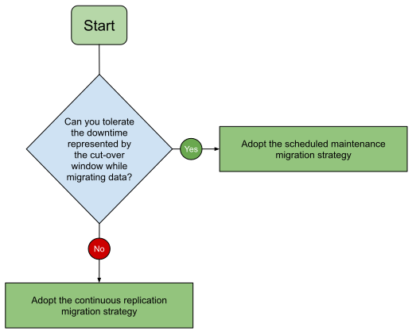
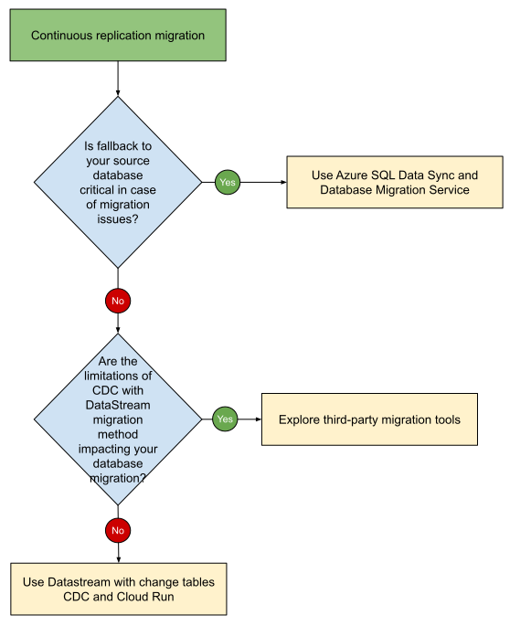

# Migrate from Azure to Google Cloud: Migrate Azure SQL Database to Cloud SQL for SQL Server

Google Cloud provides tools, products, guidance, and professional services to
migrate from Azure SQL Database to Cloud SQL. This document discusses how to
design, implement, and validate a database migration from Azure SQL Database to
Cloud SQL.

This document is for cloud and database administrators who want details about
how to plan and implement a database migration project. It’s also intended for
decision-makers who are evaluating the opportunity to migrate and want an
example of what a migration might look like.

This document focuses on homogeneous migrations of Azure SQL Database to Cloud
SQL. A homogeneous database migration is a migration between the source and
target databases of the same database technology, regardless of the database
version. For example, you migrate from a SQL Server based database instance in
Azure to another SQL Server based database in Google Cloud.

Google Cloud provides Cloud SQL for SQL Server, a fully managed relational
database service that allows users to deploy, manage, and scale SQL Server
databases without the overhead of managing infrastructure. In this document, we
focus on Cloud SQL for SQL Server as the target environment to migrate the Azure
SQL Database to.

| Source             | Destination              |
| :----------------- | :----------------------- |
| Azure SQL Database | Cloud SQL for SQL Server |

For a comprehensive mapping between Azure and Google Cloud services, see
[compare AWS and Azure services to Google Cloud services](https://cloud.google.com/free/docs/aws-azure-gcp-service-comparison).

For this migration to Google Cloud, we recommend that you follow the migration
framework described in
[Migrate to Google Cloud: Get started](https://cloud.google.com/architecture/migration-to-gcp-getting-started).

The following diagram illustrates the path of your migration journey. For
migration scenarios, the Deploy phase is equivalent to performing a migration
process.

You might migrate from Azure SQL Database to Cloud SQL in a series of
iterations—for example, you might migrate some instances first and others later.
For each separate migration iteration, you follow the phases of the general
migration framework:

1.  Assess and discover your workloads and data.
1.  Plan and build a foundation on Google Cloud.
1.  Migrate your workloads and data to Google Cloud.
1.  Optimize your Google Cloud environment.

For more information about the phases of this framework, see
[Migrate to Google Cloud: Get started](https://cloud.google.com/architecture/migration-to-gcp-getting-started).

To design an effective migration plan, we recommend that you validate each step
of the plan, and ensure that you have a rollback strategy. To help you validate
your migration plan, see
[Migrate to Google Cloud: Best practices for validating a migration plan](https://cloud.google.com/architecture/migration-to-google-cloud-best-practices).

The workloads to migrate may be composed of resources of several kinds, such as:

- Compute resources
- Data and object storage
- Databases
- Messaging and streaming
- Identity management
- Operations
- Continuous integration and continuous deployment

This document focuses on migrating Azure SQL Database to Cloud SQL. For more
information about migrating other kinds of resources, such as compute resources
and objects storage from Azure to Google Cloud, see the
[Migrate from Azure to Google Cloud document series](./README.md).

## Assess the source environment

In the assessment phase, you determine the requirements and dependencies of the
resources that you want to migrate from Azure SQL Database to Cloud SQL.

The assessment phase consists of the following tasks:

1.  Build a comprehensive inventory of your workloads.
1.  Catalog your workloads according to their properties and dependencies.
1.  Train and educate your teams about Google Cloud, including database best
    practices.
1.  Build experiments and proofs of concept on Google Cloud.
1.  Calculate the total cost of ownership (TCO) of the target environment.
1.  Decide on the order and priority of the workloads that you want to migrate.

The database assessment phase helps you answer questions regarding your database
version, size, platform, edition, dependencies and many more. It helps choose
the size and specifications of your target Cloud SQL instance that match the
source for similar performance needs. Pay special attention to disk size and
throughput, IOPS and number of vCPUs. Migrations might struggle or fail due to
incorrect target instance sizing. Incorrect sizing can lead to long migration
times, database performance problems, database errors and application
performance problems. When deciding on the Cloud SQL instance, consider your
database engine and version requirements, location requirements, recovery time
objective (RTO) and recovery point objective (RPO). Depending on your
requirements, consider choosing the database engine and version, Google Cloud
[region and zone](https://cloud.google.com/compute/docs/regions-zones), and
Cloud SQL edition. For more information about Cloud SQL editions, see
[Introduction to Cloud SQL editions](https://cloud.google.com/sql/docs/editions-intro).
Keep in mind that disk performance is based on the disk size and the number of
vCPUs.

For more information about the assessment phase and these tasks, see
[Migrate to Google Cloud: Assess and discover your workloads](https://cloud.google.com/solutions/migration-to-gcp-assessing-and-discovering-your-workloads).
The following sections are based on information in that document.

### Build an inventory of your Azure SQL Databases

To define the scope of your migration, you create an inventory and collect
information about your Azure SQL Databases. Ideally, this should be an automated
process, because manual approaches are prone to error and can lead to incorrect
assumptions.

Azure SQL Database and Cloud SQL for SQL Server might not have similar features,
instance specifications, or operation. Some functionalities might be implemented
differently or be unavailable. Please note that Azure SQL Database provides high
compatibility with the SQL Server database engine and is based on the latest
stable version of SQL Server, but it does not use a specific SQL Server engine
version. Some features are specific only to Azure SQL Database, for example the
built-in high availability logic to help protect against a single machine
failure and the auto-scale in the case of using the serverless model. Other
areas of differences might include underlying infrastructure, storage,
authentication and security, replication and backup.

To help you avoid potential issues and delays during the migration process, we
recommend that you evaluate how and if Azure SQL Database features map to the
similar important Cloud SQL for SQL Server features. The following table
summarizes this mapping:

| Topic                                        | Azure SQL Database                                                                                                                                                                                                                                                                                                                                                                      | Cloud SQL for SQL Server                                                                                                                                                                                                                         |
| :------------------------------------------- | :-------------------------------------------------------------------------------------------------------------------------------------------------------------------------------------------------------------------------------------------------------------------------------------------------------------------------------------------------------------------------------------- | :----------------------------------------------------------------------------------------------------------------------------------------------------------------------------------------------------------------------------------------------- |
| Version                                      | [Latest stable version of the Microsoft SQL Server database engine](https://learn.microsoft.com/en-us/azure/azure-sql/database/sql-database-paas-overview?view=azuresql#overview)                                                                                                                                                                                                       | [SQL Server 2017 to 2022](https://cloud.google.com/sql/docs/sqlserver/editions-intro#edition-features) [Standard, Enterprise, Express, and Web SQL Server editions](https://cloud.google.com/sql/docs/sqlserver/editions-intro#edition-features) |
| Deployment model                             | [Single databases](https://learn.microsoft.com/en-us/azure/azure-sql/database/single-database-overview?view=azuresql) [Elastic pools](https://learn.microsoft.com/en-us/azure/azure-sql/database/elastic-pool-overview?view=azuresql)                                                                                                                                                   | Instance with one or more [databases](https://cloud.google.com/sql/docs/sqlserver/create-manage-databases)                                                                                                                                       |
| Purchase model                               | [vCore purchasing model](https://learn.microsoft.com/en-us/azure/azure-sql/database/service-tiers-sql-database-vcore?view=azuresql) [DTU-based purchasing model](https://learn.microsoft.com/en-us/azure/azure-sql/database/service-tiers-dtu?view=azuresql)                                                                                                                            | [Pay-as-you-go](https://cloud.google.com/sql/docs/sqlserver/pricing#cloud-sql-pricing)                                                                                                                                                           |
| Service Tiers                                | [General Purpose, Business, Critical and Hyperscale](https://learn.microsoft.com/en-us/azure/azure-sql/database/service-tier-hyperscale?view=azuresql)                                                                                                                                                                                                                                  | [Enterprise and Enterprise Plus Editions](https://cloud.google.com/sql/docs/sqlserver/create-instance#choose-between-editions)                                                                                                                   |
| Compute Tiers                                | [Provisioned](https://learn.microsoft.com/en-us/azure/azure-sql/database/service-tiers-sql-database-vcore?view=azuresql#compute) and [serverless compute](https://learn.microsoft.com/en-us/azure/azure-sql/database/serverless-tier-overview?view=azuresql&tabs=general-purpose)                                                                                                       | [Fixed instance size](https://cloud.google.com/sql/docs/sqlserver/create-instance)                                                                                                                                                               |
| High Availability                            | [Local redundancy](https://learn.microsoft.com/en-us/azure/azure-sql/database/high-availability-sla-local-zone-redundancy?view=azuresql&tabs=azure-powershell#locally-redundant-availability) [Zone-redundancy](https://learn.microsoft.com/en-us/azure/azure-sql/database/high-availability-sla-local-zone-redundancy?view=azuresql&tabs=azure-powershell#zone-redundant-availability) | [HA through regional instances](https://cloud.google.com/sql/docs/sqlserver/high-availability#HA-configuration)                                                                                                                                  |
| Failover                                     | [Failover groups](https://learn.microsoft.com/en-us/azure/azure-sql/database/failover-group-sql-db?view=azuresql)                                                                                                                                                                                                                                                                       | [Failover to standby Instances](https://cloud.google.com/sql/docs/sqlserver/high-availability#failover-overview)                                                                                                                                 |
| Business continuity                          | [Geo-replication](https://learn.microsoft.com/en-us/azure/azure-sql/database/active-geo-replication-overview?view=azuresql)                                                                                                                                                                                                                                                             | [Cross-region replicas](https://cloud.google.com/sql/docs/sqlserver/replication/cross-region-replicas) [Cascadable replicas](https://cloud.google.com/sql/docs/sqlserver/replication/create-replica#cascading-read-replicas)                     |
| Backup                                       | [Automated backups in Azure SQL Database](https://learn.microsoft.com/en-us/azure/azure-sql/database/automated-backups-overview?view=azuresql)                                                                                                                                                                                                                                          | [On-Demand and Automatic Backups](https://cloud.google.com/sql/docs/sqlserver/backup-recovery/backing-up), with [custom locations](https://cloud.google.com/sql/docs/sqlserver/backup-recovery/backing-up#locationbackups)                       |
| Restore                                      | [Only from automated backups](https://learn.microsoft.com/en-us/azure/azure-sql/database/recovery-using-backups?view=azuresql&tabs=azure-portal)                                                                                                                                                                                                                                        | [Restore an instance from a backup](https://cloud.google.com/sql/docs/sqlserver/backup-recovery/restoring)                                                                                                                                       |
| Point in time restore (PITR) support         | [Yes](https://learn.microsoft.com/en-us/azure/azure-sql/database/recovery-using-backups?view=azuresql&tabs=azure-portal#point-in-time-restore)                                                                                                                                                                                                                                          | [Yes](https://cloud.google.com/sql/docs/sqlserver/backup-recovery/pitr)                                                                                                                                                                          |
| BACKUP command                               | No                                                                                                                                                                                                                                                                                                                                                                                      | Yes                                                                                                                                                                                                                                              |
| Export and Import                            | [BACPAC files](https://learn.microsoft.com/en-us/azure/azure-sql/database/database-export?view=azuresql) [Flat Files](https://learn.microsoft.com/en-us/sql/relational-databases/import-export/import-flat-file-wizard?view=azuresqldb-current)                                                                                                                                         | [BAK files (full and differential), Transaction log files](https://cloud.google.com/sql/docs/sqlserver/import-export/import-export-bak) [Bulk insert for importing data](https://cloud.google.com/sql/docs/sqlserver/import-export#bulk-insert)  |
| Server configuration options and trace flags | No                                                                                                                                                                                                                                                                                                                                                                                      | Yes. [Supported flags](https://cloud.google.com/sql/docs/sqlserver/flags#list-flags-sqlserver)                                                                                                                                                   |
| Maintenance                                  | [Maintenance windows](https://learn.microsoft.com/en-us/azure/azure-sql/database/maintenance-window?view=azuresql)                                                                                                                                                                                                                                                                      | [Maintenance windows](https://cloud.google.com/sql/docs/sqlserver/maintenance)                                                                                                                                                                   |
| Security Features                            | [Microsoft Entra authentication, TLS, Advanced Threat Protection](https://learn.microsoft.com/en-us/azure/azure-sql/database/secure-database-tutorial?view=azuresql)                                                                                                                                                                                                                    | [Access control](https://cloud.google.com/sql/docs/sqlserver/instance-access-control) [Connection options](https://cloud.google.com/sql/docs/sqlserver/connect-overview)                                                                         |
| Logins and users                             | [Microsoft Entra authentication only](https://learn.microsoft.com/en-us/azure/azure-sql/database/authentication-aad-overview?view=azuresql)                                                                                                                                                                                                                                             | [Built-in SQL Server Logins](https://cloud.google.com/sql/docs/sqlserver/users) [Windows Authentication with Managed Microsoft AD](https://cloud.google.com/sql/docs/sqlserver/ad)                                                               |
| Resource limits                              | [Resource limits for vCore model](https://learn.microsoft.com/en-us/azure/azure-sql/database/resource-limits-vcore-single-databases?view=azuresql) [Resource limits for the DTU model](https://learn.microsoft.com/en-us/azure/azure-sql/database/resource-limits-dtu-single-databases?view=azuresql)                                                                                   | [Quotas and limits](https://cloud.google.com/sql/docs/quotas)                                                                                                                                                                                    |
| SQL Syntax                                   | [Transact-SQL syntax with some differences](https://learn.microsoft.com/en-us/azure/azure-sql/database/transact-sql-tsql-differences-sql-server?view=azuresql)                                                                                                                                                                                                                          | [Transact-SQL](https://learn.microsoft.com/en-us/sql/t-sql/language-reference)                                                                                                                                                                   |
| Transactional replication support            | [As subscriber only](https://learn.microsoft.com/en-us/azure/azure-sql/database/replication-to-sql-database?view=azuresql)                                                                                                                                                                                                                                                              | [Yes](https://cloud.google.com/sql/docs/sqlserver/replication/configure-external-replica#implementing-transactional-replication)                                                                                                                 |
| Linked server support                        | No                                                                                                                                                                                                                                                                                                                                                                                      | [Yes](https://cloud.google.com/sql/docs/sqlserver/linked-servers)                                                                                                                                                                                |
| Cross-database transactions support          | No                                                                                                                                                                                                                                                                                                                                                                                      | Yes                                                                                                                                                                                                                                              |
| Distributed transactions support             | [Yes](https://learn.microsoft.com/en-us/azure/azure-sql/database/elastic-transactions-overview?view=azuresql)                                                                                                                                                                                                                                                                           | No                                                                                                                                                                                                                                               |
| SQL Server Agent support                     | No                                                                                                                                                                                                                                                                                                                                                                                      | Yes                                                                                                                                                                                                                                              |
| SQL Server Auditing support                  | [Yes](https://learn.microsoft.com/en-us/azure/azure-sql/database/auditing-overview?view=azuresql)                                                                                                                                                                                                                                                                                       | [Yes](https://cloud.google.com/sql/docs/sqlserver/audit-logging)                                                                                                                                                                                 |
| Query Store support                          | Yes                                                                                                                                                                                                                                                                                                                                                                                     | Yes                                                                                                                                                                                                                                              |

Some of the most important features of Azure SQL Database and how they map to
Cloud SQL for SQL Server are described below:

#### Purchasing models

Azure SQL Database offers two purchasing models that determine how you pay for
and scale your Azure SQL Database resource:

**vCore-based:** you choose the number of vCores, the amount of memory and the
size and speed of the storage, which maps easily to the Cloud SQL for SQL Server
target.

**DTU-based:** you choose a pre-packaged allocation of database resources that
are bundled together.

Because it’s difficult to determine exactly how much of each database resource
like CPU, memory and I/O you are using in the DTU model, it is complex to map a
fitting Cloud SQL for SQL Server target. However, a best practice is to use the
mapping rule from Microsoft’s
[Migrate Azure SQL Database from the DTU-based model to the vCore-based model](https://learn.microsoft.com/en-us/azure/azure-sql/database/migrate-dtu-to-vcore?view=azuresql&tabs=azure-portal#choose-the-vcore-service-tier-and-service-objective)
guide and start with a Cloud SQL for SQL Server target instance that is
similarly sized to an equivalent vCore-based model.

Once you create your initial target Cloud SQL instance and size it according to
the mapping rule, you perform benchmarking on both your source and targets and
decide if you need to scale your Cloud SQL target instance up or down.

#### Compute tiers

In Azure SQL, compute tiers define the performance characteristics and
capabilities of your SQL databases tailored to various workloads. The
vCore-based model of Azure SQL offers two different compute tiers: provisioned
and serverless compute.

Cloud SQL does not offer serverless compute in the same way, so you’ll need to
select a fixed instance size or consider scaling options like read replicas
depending on your use case. You determine the appropriate instance sizes of your
target Cloud SQL based on the historic usage patterns of your Azure SQL
Serverless instance and benchmarking.

#### Deployment models

Azure SQL offers two deployment models that allow you to choose the most
appropriate option based on your application's requirements, performance needs,
and management preferences:

**Single Database**: you deploy a standalone, isolated and fully managed
database.

**Elastic pool**: you deploy a collection of databases that together share
compute and storage resources to optimize costs. Ideally when their workloads
peaks do not overlap.

While there is no equivalent of elastic pools in Cloud SQL for SQL Server, you
can migrate an elastic pool to one target Cloud SQL instance. In case you are
using the eDTU model for your elastic pools, you can start with the same DTU to
v-Core mapping rule described above to size your target Cloud SQL instance.
Depending on your workloads and specific use cases you can try to optimize your
licensing costs. There are several strategies you might employ. For example,
depending on your database workload, you can
[disable simultaneous multithreading](https://cloud.google.com/sql/docs/sqlserver/create-instance#smt-create-instance)
which might reduce your licensing costs. Additionally, you might choose to use
SQL Server Standard or Web editions on Cloud SQL for SQL Server for further
licensing cost reductions, while Google Cloud infrastructure can support your HA
requirements.

Benchmarking can help you to better understand the workloads that are to be
migrated and contributes to defining the right architecture of the migration
target environment. Collecting information about performance is important to
help estimate the performance needs of the Google Cloud target environment.
Benchmarking concepts and tools are detailed in the Perform testing and
validation of the migration process, but they also apply to the inventory
building stage.

#### Performance assessment

Benchmarking can help you to better understand the workloads that are to be
migrated and contributes to defining the right architecture of the migration
target environment. Collecting information about performance is important to
help estimate the performance needs of the Google Cloud target environment.
Benchmarking concepts and tools are detailed in the Perform testing and
validation of the migration process, but they also apply to the inventory
building stage.

Take baseline measurements on your source environment in production use:

- Measure the size of your data, as well as your workload’s performance. How
  long do important queries or transactions take, on average? How long during
  peak times? This includes metrics such as:

    - Query response times: For common and critical queries.
    - Transactions per second (TPS): A measure of how many transactions your
      database can handle.
    - Resource utilization: CPU, memory, and disk I/O usage.
    - Latency: The time it takes for data to travel between points.

- Load testing: Simulate realistic user loads to assess how the database
  performs under stress.
- Consider performing benchmarks in the assessment phase. You can use open
  source industry-standard database benchmarking tools such as
  [HammerDB](https://www.hammerdb.com/about.html). It supports complex
  transactional and analytic workloads on multiple database engines (both
  TPROC-C and TPROC-H). For more information about benchmarking, see
  [Load testing SQL Server using HammerDB](https://cloud.google.com/compute/docs/tutorials/load-testing-sql-server-hammerdb).
- You document the benchmarking results for later comparison in the
  [validation of the migration before the cut-over](#validate-the-migration-before-cut-over)
  step. The comparison helps you decide if the fidelity of your database
  migration is satisfactory and if you can switch your production workloads.

#### Syntax and other features

Azure SQL Database uses Transact-SQL (T-SQL), the same query language used by
SQL Server. However, there are some syntax differences and limitations. Some
functionality and unique commands optimized for cloud environments are not
supported or behave differently on Cloud SQL for SQL Server. Any implementations
depending on incompatible features might need to be refactored or adapted. Some
of these differences include:

**Azure-specific DMVs and Dynamic Management Functions** such as
sys.dm_db_resource_stats, sys.dm_db_wait_stats, and sys.dm_exec_query_stats with
added metrics for resource usage and throttling information specific to Azure.

**Extended Events** for monitoring Azure-specific metrics or features may also
be missing or different.

**System Functions** in Azure SQL are optimized for cloud-specific
functionalities, such as sys.fn_my_permissions with specific resource
identifiers for cloud resources that are not supported in Cloud SQL for SQL
Server.

**SQL Server CLR** is not supported in Cloud SQL for SQL Server. You might have
to refactor workloads that use CLR when migrating to Cloud SQL for SQL Server
and potentially take them out from your database.

**Distributed transactions** are not supported in Cloud SQL for SQL Server. You
might have to refactor your workloads to account for distributed transactions
and partial failures using a two-phase commit protocol or the Saga pattern. For
more information about distributed transactions, see
[Interservice communication in a microservices setup](https://cloud.google.com/architecture/microservices-architecture-interservice-communication).

**Unsupported T-SQL Commands and features in Azure SQL** are available in Cloud
SQL for SQL Server such as `USE [database]`, BACKUP and RESTORE, SQL Agent jobs,
Cross-Database Queries, Linked Servers, Global Temporary Tables, Distributed
transactions handling and Transactional replication. For example, you can
replace certain Azure SQL features such as Elastic jobs with SQL Agent jobs.

You can use different tools to detect and address T-SQL differences, unsupported
features, and potential issues in migration from Azure SQL to SQL Server, such
as:

- [SQL Server Migration Assistant](https://learn.microsoft.com/en-us/sql/ssma/sql-server-migration-assistant)
- [Redgate SQL Compare](https://documentation.red-gate.com/sc/getting-more-from-sql-compare/deploying-to-microsoft-azure-sql-databases)

For more information about available features and syntax differences between
Azure SQL Database, Azure SQL Managed Instance and SQL Server, see:

- [Features comparison: Azure SQL Database and Azure SQL Managed Instance](https://learn.microsoft.com/en-us/azure/azure-sql/database/features-comparison?view=azuresql)
- [T-SQL differences between SQL Server and Azure SQL Database](https://learn.microsoft.com/en-us/azure/azure-sql/database/transact-sql-tsql-differences-sql-server?view=azuresql)

#### Tools for assessments

We recommend Google Cloud
[Migration Center](https://cloud.google.com/migration-center/docs/migration-center-overview)
for an initial full assessment of your current infrastructure and database
estate. With Migration Center you can perform a complete assessment of your
application and database landscape, including the technical fit of your database
for a Cloud SQL database migration. You receive Cloud SQL shape recommendations,
create a TCO report composed of servers and databases, and you can also set
preferred target Google Cloud configurations.

The database assessment with Migration Center is comprised of three main steps:

- Collect databases configuration via open source scripts or exports
- Assess database Technical Fit to Cloud SQL
- Generate a TCO report, including server grouping and migration preferences

For more information about assessing your Azure environment by using Migration
Center, see
[Import data from other cloud providers](https://cloud.google.com/migration-center/docs/import-data-cloud-providers).

Additionally, you can also use other tools that are more specialized database
assessments. For example, Database Migration Assessment tool (DMA) is an open
source data collector tool, backed by Google’s engineers, Professional Services,
and partners. It offers a complete and accurate database assessment, including
features in use, database code and database objects, for example: schemas,
tables, views, functions, triggers and stored procedures.

While DMA focuses specifically on database instances and is specialized on
assessments where the purpose is database modernization, having the target
database engine different than the source database engine, it can also be used
for homogeneous database migrations, within Google Cloud Migration Center.

For guidance about using the open-source data collector and assessment scripts,
see
[Google Cloud Database Migration Assessment](https://cloud.google.com/migration-center/docs/discover-and-import-databases).

Alternatively, you can also use other open-source data collector and diagnostic
scripts. These scripts can help you collect information about your database
workloads, features, and database diagnostic information, helping you build your
database inventory.

### Assess your deployment and administration process

After you build the inventories, we recommend that you assess your database
operational and deployment processes to determine how they need to be adapted to
facilitate your migration. These are a fundamental part of the practices that
prepare and maintain your production environment.

Consider how you complete the following tasks:

- **Define and enforce security policies for your instances**. If you’re
  planning on using Windows Authentication with Cloud SQL for SQL Server, you
  need to deploy
  [Managed Microsoft AD](https://cloud.google.com/managed-microsoft-ad/docs/overview)
  and connect to your existing Active Directory infrastructure or to migrate
  your Microsoft Entra ID. You can use VPC firewall rules, VPC Service Controls,
  Private Service Connect, and Cloud SQL Auth Proxy to control access to your
  Cloud SQL instances and constrain the data within a VPC or a group of VPCs.

- **Set up your network infrastructure.** Document how users and applications
  connect to your database instances. Build an inventory of existing subnets, IP
  ranges and types, firewall rules, private DNS names. Consider having similar
  or complementary network configurations of your Azure Virtual Network in
  Google Cloud. For more information about connecting to a Cloud SQL instance,
  see
  [About connection options](https://cloud.google.com/sql/docs/sqlserver/connect-overview).

- **Define access control to your instances.** Consider configuring access to
  define who or what can access the instance. For more information about access
  control in Cloud SQL for SQL Server, see
  [About access control](https://cloud.google.com/sql/docs/sqlserver/instance-access-control).

- **Define backup plans.** Create a reliable backup strategy on Cloud SQL that
  aligns with Azure SQL’s backup capabilities. Cloud SQL supports automatic
  daily backups and
  [point-in-time recovery (PITR)](https://cloud.google.com/sql/docs/sqlserver/backup-recovery/pitr)
  through transaction logs. We recommend scheduling regular backup exports to
  Google Cloud Storage for long-term retention to achieve cross-region
  redundancy. It’s a best practice to test the restoration process. For more
  information about backup plans, see
  [Configure backup plans for Microsoft SQL Server instances and databases](https://cloud.google.com/backup-disaster-recovery/docs/backup/back-up-sql-server).

- **Define HA and business continuity plans.** We recommend using regional
  instances with zonal availability and cross-regional replicas for DR and read
  scaling purposes with Cloud SQL. Azure SQL offers high availability with
  automatic failover capabilities through Always On Availability Groups, while
  at the time of writing this document, Cloud SQL uses a primary-replica setup
  based on regional instances. We recommend testing the Cloud SQL failover times
  and considering using
  [Cloud SQL Enterprise Plus](https://cloud.google.com/sql/docs/editions-intro)
  edition to avoid unexpected failover delays.

- **Patch and configure your instances.** Your existing deployment tools might
  need to be updated. For example, consider if you’re using additional settings
  for your Azure SQL Database like security rules and routes, TLS versions,
  collation, tempdb settings and instance time zone.

- **Manage encryption keys.** You use customer-managed encryption keys (CMEKs)
  in Cloud KMS with Cloud SQL. For more information about encryption keys, see
  [About customer-managed encryption keys](https://cloud.google.com/sql/docs/sqlserver/cmek).

- **Manage monitoring and alerting infrastructure.** Metric categories for your
  Azure source database instances provide observability during the migration
  process. Metric categories might include Azure Monitor, Azure Monitor SQL
  Insights for Azure SQL Database, and alerts for Azure SQL Database.

### Complete the assessment

After you build the inventory of your Azure databases, complete the rest of the
activities of the assessment phase as described in
[Migrate to Google Cloud: Assess and discover your workloads](https://cloud.google.com/solutions/migration-to-gcp-assessing-and-discovering-your-workloads).

## Plan and build your foundation

In the plan and build phase, you provision and configure the infrastructure to
do the following:

- Support your workloads in your Google Cloud environment.
- Connect your Azure environment and your Google Cloud environment to complete
  the migration.

### Build your foundation on Google Cloud

The plan and build phase is composed of the following tasks:

1.  Build a resource hierarchy.
1.  Configure identity and access management.
1.  Set up billing.
1.  Set up network connectivity.
1.  Harden your security.
1.  Set up logging, monitoring, and alerting.

For more information about each of these tasks, see
[Migrate to Google Cloud: Build your foundation](https://cloud.google.com/architecture/migration-to-google-cloud-building-your-foundation).

### Monitoring and alerting

Use Google [Cloud Monitoring](https://cloud.google.com/monitoring), which
includes predefined dashboards for several Google Cloud products, including a
Cloud SQL monitoring dashboard. Alternatively, you can consider using
third-party monitoring solutions that are integrated with Google Cloud, like
Datadog and Splunk. For more information, see
[About database observability](https://cloud.google.com/sql/docs/sqlserver/observability).

###

## Migrate Azure SQL Database to Cloud SQL for SQL Server

To migrate your instances, you do the following:

1.  [Choose the migration strategy: continuous replication or scheduled maintenance](#choose-the-migration-strategy).

1.  [Choose the migration tools](#choose-the-migration-tools), depending on your
    chosen strategy and requirements.

1.  [Define the migration plan and timeline](#define-the-migration-timeline) for
    each database migration, including preparation and execution tasks.

1.  [Define the preparation tasks](#define-the-preparation-tasks) that must be
    done to ensure the migration tool can work properly.

1.  [Define the execution tasks](#define-the-execution-tasks), which include
    work activities that implement the migration.

1.  [Define fallback scenarios](#define-fallback-scenarios) for each execution
    task.

1.  [Perform testing and validation](#perform-testing-and-validation), which can
    be done in a separate staging environment.

1.  [Perform the migration](#perform-the-migration).

1.  [Validate the migration before cut-over](#validate-the-migration-before-cut-over).
    This step involves validation of critical business transactions, including
    verifying that their performance respects your SLAs.

1.  [Perform the production cut-over](#perform-the-production-cut-over).

1.  [Clean up the source environment and configure the Cloud SQL instance](#cleanup-the-source-environment-and-configure-the-cloud-sql-instance).

1.  [Optimize your environment after migration](#optimize-your-environment-after-migration).

1.  [Update database production operations runbooks and support documentation](#update-database-production-operations-runbooks-and-support-documentation-to-align-with-the-cloud-sql-database-platform)
    to align with the Cloud SQL database platform.

Each phase is described in the following sections.

### Choose the migration strategy

At this step, you have enough information to evaluate and decide on one of the
following migration strategies that best suits your use case for each database:

- **Scheduled maintenance** (also called one-time migration or big-bang
  migration): Ideal if you can afford downtime. This option is relatively low in
  cost and complexity, because your workloads and services won’t require much
  refactoring. However, if the migration fails before completion, you have to
  restart the process, which prolongs the downtime. For more details, see
  [Scheduled maintenance.](https://cloud.google.com/architecture/migration-to-google-cloud-transferring-your-large-datasets#scheduled_maintenance)

- **Continuous replication** (also called online migration or trickle
  migration): For mission-critical databases that can't undergo any scheduled
  downtime, choose this option, which offers a lower risk of data loss and
  near-zero downtime. Because the efforts are split into several chunks, if a
  failure occurs, rollback and repeat takes less time. However, a relatively
  complex setup is required and takes more planning and time. For more details,
  see
  [Continuous replication](https://cloud.google.com/architecture/migration-to-google-cloud-transferring-your-large-datasets#continuous_replication).

Two variations of the continuous replication strategy are represented by Y
(writing and reading) and the Data-access microservice migration pattern. They
both are a form of continuous replication migration, duplicating data in both
source and destination instances. While they can offer zero downtime and high
flexibility when it comes to migration, they come with an additional complexity
given by the efforts to refactor the applications that connect to your database
instances. For more information about data migration strategies, see
[Migration to Google Cloud: Transferring your large datasets - Evaluating data migration approaches.](https://cloud.google.com/architecture/migration-to-google-cloud-transferring-your-large-datasets#data_migration_approaches)

The following diagram shows a flowchart based on example questions that you
might have when deciding the migration strategy for a single database:

The diagram can be summarized as follows:

#### Migrate from Azure SQL Database to Cloud SQL for SQL Server path

**Can you afford the downtime represented by the cut-over window while migrating
data?** The cut-over window represents the time to take a backup of the
database, transfer it to a Cloud Storage bucket, restore it \- manually or using
tools like Database Migration Service, and then switch over your applications.

- If yes, adopt the **Scheduled Maintenance migration strategy**.
- If no, adopt the **Continuous Replication migration strategy**.

Strategies may vary for different databases located on the same instance and
usually a mix of them can produce optimal results. Small and infrequently used
databases can usually be migrated using the scheduled maintenance approach,
while for the mission-critical ones where having downtime is expensive, the best
fitting strategies usually involve continuous replication.

Usually, a migration is considered completed when the switch between the initial
source and the target instances takes place. Any replication (if used) is
stopped and all reads and writes are done on the target instance. Switching when
both instances are in sync means no data loss and minimal downtime.

When the decision is made to migrate all applications from one replica to
another, applications (and therefore customers) might have to wait (incurring
application downtime) at least as long as the replication lag lasts before using
the new database. In practice, the downtime might be higher because:

##### Database Instance

- Database queries can take a few seconds to complete. At the time of migration,
  in-flight queries might be aborted.
- The database has to be “warmed up” by filling up the cache if it has
  substantial buffer memory, especially in large databases.

##### TCP reconnections

- When applications establish a connection to the Google Cloud target database
  instance, they need to go through the process of connection initialization.
  This includes the negotiation of secure connections through SSL and TLS
  handshakes, authentication and session setup.

##### Applications

- Applications might need to reinitialize internal resources, such as connection
  pools, caches, and other components, before they can fully connect to the
  database. This warm-up time can contribute to the initial lag.
- If an application was in the middle of processing transactions when it was
  stopped, it might need to recover or reestablish those sessions when it
  reconnects. Depending on how the application handles state and session
  recovery, this process can take some additional time.

##### Network Latency

- Applications stopped at source and restarted in Google Cloud might have a
  small lag until the connection to the Google Cloud database instance is
  established, depending on the network conditions, especially if the network
  paths need to be recalculated or if there is high network traffic.

##### DNS

- Network routes to the applications must be rerouted. Based on how DNS entries
  are set up this can take some time (tip: reduce TTL before migrations when
  updating DNS records).

For more information about data migration strategies and deployments, see
[Classification of database migrations](https://cloud.google.com/architecture/database-migration-concepts-principles-part-1#classification_of_database_migrations).

#### Minimize downtime and impact due to migration

Migration configurations that provide no application downtime require the most
complex setup. One has to balance the efforts needed for a complex migration
setup and deployment orchestrations against the perspective of having a
scheduled downtime, planned when its business impact is minimal. Keep in mind
that there is always some impact associated with the migration process. For
example, replication processes involve some additional load on your source
instances. Your workloads might be affected by the additional load on your
source instance. Similarly, read workloads might not be designed to handle the
stale or lagging data that can occur on the migration target.

While managed migration services try to encapsulate that complexity, application
deployment patterns, infrastructure orchestration and custom migration
applications might also be involved to ensure a seamless migration and cut-over
of your applications.

Some common practices to minimize downtime impact:

- Find a time period for when downtime impacts minimally your workloads. For
  example: outside normal business hours, during weekends, or other scheduled
  maintenance windows.
- Find modules of your workloads for which the migration and production cut-over
  can be executed at different stages. Your applications might have different
  components that can be isolated, adapted and migrated earlier. For example:
  Frontends, CRM modules, backend services, reporting platforms. Such modules
  could have their own databases that can be scheduled for migration earlier in
  the process.
- Consider implementing a gradual, slower paced migration, having both the
  source and target instances as integral parts of your workloads. You might
  mitigate your migration impact if you can afford to have some latency on the
  target database by using incremental, batched data transfers and adapting part
  of your workloads to work with the stale data on the target instance.
- Consider refactoring your applications to support minimal migration impact.
  For example: adapt your applications to write to both source and target
  databases and therefore implement an application-level replication.

### Choose the migration tools

For a successful migration of your Azure SQL Databases to Cloud SQL, choosing
the right tool for the migration is the most important aspect. Once the
migration strategy has been decided, it is time to review and decide.

There are many tools to migrate a database, each of them being optimized for
certain migration use cases. These usually depend on:

- migration strategy: scheduled maintenance, continuous replication.
- source and target database engines and engine versions \- some tools may be
  specialized in same database engine migrations, while others can also handle
  migrations of different database engines.
- environments where the source and target instances are located \- you might
  choose different tools for dev/test, staging and production environments. For
  example, backup and restore might fit development and testing environments as
  they can go through prolonged downtime, while staging and production
  environments are more inclined to be migrated through replication.
- database size \- the larger the database, the more time it takes to migrate
  the initial backup.
- data migration speed requirements: some tools can perform parallel data read
  and write operations. This can be useful especially when migrating mission
  critical large databases, when limited write downtime is crucial.
- special migration requirements like data transformations or database schema
  consolidation.
- database change frequency.
- migration scope \- tools specialized in migrating schema, data and users and
  logins.
- licensing and cost.
- availability to use migration systems for migration.

Database migration systems encapsulate the complex logic of migration and offer
monitoring capabilities. They execute the data extraction from the source
databases, securely transport it from the source to the target databases and can
optionally modify the data during transit. We can list the advantages of using
database migration systems as follows:

- **Minimize downtime.** Downtime can be minimized by using the built-in
  replication capabilities of the migrated storage engines in an easy to manage,
  centralized way.

- **Ensure data integrity and security.** Migration systems can ensure that all
  data is securely and reliably transferred from the source to the destination
  database.

- **Provide uniform and consistent migration experience.** Different migration
  techniques and patterns can be abstracted in a consistent, unified interface
  by using database migration executables that can be managed and monitored.

- **Offer resilient and proven migration models.** Database migrations are not
  happening often so chances are that using a tool developed by experts in this
  area brings huge benefits rather than trying to implement something custom
  made. Moreover, a cloud based migration system also comes with increased
  resiliency.

In the next sections, we explore the migration tools recommended depending on
the chosen migration strategy.

#### Tools for scheduled maintenance migrations

The following subsections describe the tools that can be used for one-time
migrations, along with their limitations and best practices.

For one-time migrations to Cloud SQL for SQL Server we recommend using the built
in data-tier application backup package also known as
[BACPAC (**Bac**kup **Pac**kage)](https://learn.microsoft.com/en-us/sql/relational-databases/data-tier-applications/data-tier-applications#bacpac)
files.

##### BACPAC files

Azure SQL Database supports exporting the schema and data of a database to
BACPAC files (.bacpac). A BACPAC file contains both the schema and data of a
database in a compressed format and is an ideal choice for archiving and for
database migrations to other platforms.

Note: Built-in backup exports are not supported in Azure SQL. Azure SQL uses a
different backup mechanism compared to traditional SQL Server backups.

There are multiple ways of exporting an Azure SQL Database database to a BACPAC
file. For example, using SQLPackage, and SQL Server Management Studio (SSMS).

We recommend using SQLPackage utility to export your database to a BACPAC file,
especially if your BACPAC file is in the range of hundreds of GB or larger. The
export includes by default all tables in the database. You can optionally
specify a subset of tables for which to export data. For more information about
exporting and Azure SQL databases to BACPAC files, see
[Import or export an Azure SQL Database](https://learn.microsoft.com/en-us/azure/azure-sql/database/database-import-export-azure-services-off?view=azuresql#export-a-database-using-sqlpackage).

You can perform a database migration from Azure SQL Database to Cloud SQL by
exporting the BACPAC files of your databases to the local storage of a runtime
environment with connectivity to your target Cloud SQL instance, and importing
it in Cloud SQL.

###### Limitations and best practices

- Do not perform writes on the source database during the export process.
  Alternatively, perform the BACPAC export from a transactionally consistent
  copy of the source database.
- The export and import operations might take a long time for larger databases.
- Although SQL Server Authentication logins are included in the BACPAC files,
  you need to reset their passwords and enable them. BACPAC files protect
  against the risks of exposing plain-text passwords during transfer by removing
  their passwords.

For a full list of limitations, see
[Export to a BACPAC file - Azure SQL Database and Azure SQL Managed Instance Limitations](https://learn.microsoft.com/en-us/azure/azure-sql/database/database-export?view=azuresql-mi#limitations)

As best practices, we recommend:

- Avoid long running times of the import and export operations as in such cases
  it might fail because of resource exhaustion. Long-running operations can
  consume significant system resources over time. If the source or destination
  system becomes resource-constrained (e.g., running out of memory or CPU), the
  operation may slow down or fail entirely. Moreover, cloud platforms and
  database systems often have predefined timeout settings to prevent operations
  from running indefinitely.
- If you want to speed up the export operations, consider running multiple
  export commands in parallel for subsets of tables, stopping both read and
  write activity during the export and increasing the performance (CPU and
  memory) of your source instance.
- We recommend exporting BACPAC files with
  [SqlPackage](https://learn.microsoft.com/en-us/sql/tools/sqlpackage/sqlpackage)
  to a runtime environment with local SSD for better performance.

For more information about BACPAC files and built-in backups, see
[Data-tier applications (DAC)](https://learn.microsoft.com/en-us/sql/relational-databases/data-tier-applications/data-tier-applications#bacpac)

##### File export and import

An alternative to BACPAC files is exporting the data from your source database
tables to files and importing them in your Cloud SQL target database. We
recommend this option if the number of tables in your database is not large and
you want to customize the set of tables that you migrate or if you want to
perform data transformations.

For more information about exporting data to files from Azure SQL Database, see
[Import and export data from SQL Server and Azure SQL Database](https://learn.microsoft.com/en-us/sql/relational-databases/import-export/overview-import-export?view=azuresqldb-current).

We recommend using the
[BCP (bulk copy program)](https://learn.microsoft.com/en-us/sql/tools/bcp-utility)
utility to export data from your source Azure SQL Database and import it into
Cloud SQL. For a detailed guide on how to export and import data using BCP, see
[Import and export bulk data using bcp (SQL Server)](https://learn.microsoft.com/en-us/sql/relational-databases/import-export/import-and-export-bulk-data-by-using-the-bcp-utility-sql-server?view=azuresqldb-current),
respectively
[Use the bcp utility for importing and exporting data](https://cloud.google.com/sql/docs/sqlserver/import-export#use_the_bcp_utility_for_importing_and_exporting_data).

###### Limitations for file export and import

For a complete list of limitations for import operations to Cloud SQL, see
[Known issues with importing and exporting data](https://cloud.google.com/sql/docs/sqlserver/known-issues#import-export).

#### Tools for continuous replication migrations

The following sections describe the tools that can be used for continuous
replication migrations, along with their limitations and common issues.

The preceding flowchart shows the following decision points:

- Is fallback to your source database critical in case of migration issues?
    - If yes, we recommend Azure SQL Data Sync and Database Migration Service.
    - If no, continue to the next decision.
- Are the change tables CDC method’s
  [known limitations](https://cloud.google.com/datastream/docs/sources-sqlserver#sqlserverknownlimitations)
  with DataStream impacting your database migration?
    - If no, we recommend using Datastream with change tables CDC and Cloud Run.
    - If yes, we recommend exploring third-party migration options.

##### Azure SQL Data Sync and Database Migration Service

**Azure SQL Data Sync** is an Azure service that allows you to synchronize data
between your Azure SQL Databases and external SQL Server instances on-premises
or in other clouds. Azure SQL Data Sync is suitable for scenarios where
near-real-time synchronization is sufficient and schema changes are infrequent.

You can use Azure SQL Data Sync to synchronize data from Azure SQL to a SQL
Server database deployed on a Compute Engine instance in Google Cloud. From
there, you can use Database Migration Service to
[migrate data from the SQL Server instance on Compute Engine to Cloud SQL](https://cloud.google.com/database-migration/docs/sqlserver/scenario-overview#supported-src-and-dest).

###### Limitations for Azure SQL Data Sync

Some limitations of using Azure SQL Data Sync to synchronize data from your
Azure SQL Database to an external SQL Server instance are:

- Data Sync uses data manipulation language (DML) triggers to track changes. It
  creates side tables for change tracking, which might affect the performance of
  your database workload.
- Azure SQL Data Sync works together with a
  [Data Sync Agent](https://www.microsoft.com/en-us/download/details.aspx?id=27693).
  The agent can be installed locally to any server that can communicate with it
  and the Compute Engine instance where the intermediary SQL Server instance is
  installed. It enables data synchronization between the source Azure SQL
  database and the intermediary SQL Server instance. The agent supports only
  Windows, running as a Windows service.
- The schema of the tables in the Azure SQL Database matches the schema in the
  Compute Engine SQL Server instance.
- Each table must have a primary key. If a table has an identity column, this
  must be the primary key.
- Schema changes aren't replicated.
- Truncating tables is not supported.
- Object names (databases, tables, columns) must not contain some characters
  (periods and brackets).
- Azure SQL Data Sync is not suitable for high-frequency, low-latency
  transactional replication.

For a full list of prerequisites and limitations, see
[General limitations](https://learn.microsoft.com/en-us/azure/azure-sql/database/sql-data-sync-data-sql-server-sql-database?view=azuresql#general-limitations).

##### Datastream with change data capture (CDC) and Cloud Run functions

You can use Datastream to track and replicate changes from your Azure SQL
Database to files such as Avro or JSON stored on a destination like Google Cloud
Storage. From Cloud Storage, you can import data into Cloud SQL for SQL Server
using Cloud Run functions with custom implementations.

###### Limitations for Datastream

- You need to enable CDC on your source Azure SQL database.
- CDC must be enabled for each table for which you want changes to be
  replicated.
- You must enable
  [snapshot isolation level](https://learn.microsoft.com/en-us/sql/t-sql/statements/alter-database-transact-sql-set-options?view=azuresqldb-current&preserve-view=true#b-enable-snapshot-isolation-on-a-database)
  on your Azure SQL database to ensure consistent data replication, which might
  have some performance impact on your source Azure SQL database.
- You must create a login and user on your source Azure SQL database for
  Datastream.

For more information about configuring Azure SQL Database to work together with
Datastream to replicate data and bulk insert to import data, see
[Configure an Azure SQL database](https://cloud.google.com/datastream/docs/configure-azure-sqlserver),
[Use bulk insert for importing data](https://cloud.google.com/sql/docs/sqlserver/import-export#bulk-insert)
and
[Change data capture (CDC) with Azure SQL Database](https://learn.microsoft.com/en-us/azure/azure-sql/database/change-data-capture-overview?view=azuresql).

If you need to scale, one alternative to using bulk insert is to use
[Dataflow to batch and publish data to Pub/Sub](https://cloud.google.com/dataflow/docs/guides/templates/provided/cloud-storage-to-pubsub)
and custom [Cloud Run](https://cloud.google.com/functions/docs/calling/pubsub)
implementation to write data from Pub/Sub to your Cloud SQL for SQL Server
destination.

##### Third-party tools for continuous migration

You can decide to use a third-party tool to execute your database migration.
Choose one of the following recommendations, which you can use for most database
engines:

[Striim](https://www.striim.com/striim-for-google-cloud-sql/) is an end-to-end,
in-memory platform for collecting, filtering, transforming, enriching,
aggregating, analyzing, and delivering data in real time. It can handle large
data volumes, complex migrations.

- Advantages:

- Handles large data volumes and complex migrations.
- Preconfigured connection templates and no-code pipelines.
- Able to handle mission-critical, large databases that operate under heavy
  transactional load.
- Exactly-once delivery.

- Disadvantages:

- Not open source.
- Can become expensive, especially for long migrations.
- Some limitations in data definition language (DDL) operations propagation. For
  more information, see
  [Supported DDL operations](https://www.striim.com/docs/en/handling-schema-evolution.html#supported-ddl-operations)
  and
  [Schema evolution notes and limitations](https://www.striim.com/docs/en/handling-schema-evolution.html#schema-evolution-notes-and-limitations).

For more information about Striim, see
[Running Striim in the Google Cloud Platform](https://www.striim.com/docs/platform/en/running-striim-in-the-google-cloud-platform.html).

[Debezium](https://debezium.io/) is an open source distributed platform for CDC,
and can stream data changes to external subscribers:

- Advantages:

- Open source.
- Strong community support.
- Cost effective.
- Fine grained control on rows, tables or databases.
- Specialized for change capture in real time from database transaction logs.

- Challenges:

- Require specific experience with Kafka and ZooKeeper.
- At-least-once delivery of data changes, which means that you need duplicates
  handling.
- Manual monitoring setup using Grafana and Prometheus.
- No support for incremental batch replication.

For more information about Debezium migrations, see
[Azure SQL / SQL Server Change Stream with Debezium](https://learn.microsoft.com/en-us/samples/azure-samples/azure-sql-db-change-stream-debezium/azure-sql--sql-server-change-stream-with-debezium/).

[Fivetran](https://www.fivetran.com/) is an automated data movement platform for
moving data out of and across cloud data platforms.

- Advantages:
- Preconfigured connection templates and no-code pipelines.
- Propagates any schema changes from your source to the target database.
- Exactly-once delivery.

- Disadvantages:
- Not open source.
- Support for complex data transformation is limited.

For more information about Azure SQL Database migrations with Fivetran, see
[Azure SQL Database Destination Setup Guide](https://fivetran.com/docs/destinations/sql-server/azure-setup-guide).

| Product  | Strengths                                                                                                                                                                                                                         | Constraints                                                                                                                                                                                                                                       |
| :------- | :-------------------------------------------------------------------------------------------------------------------------------------------------------------------------------------------------------------------------------- | :------------------------------------------------------------------------------------------------------------------------------------------------------------------------------------------------------------------------------------------------ |
| Striim   | Handles large data volumes and complex migrations. Preconfigured connection templates and no-code pipelines. Able to handle mission-critical, large databases that operate under heavy transactional load. Exactly-once delivery. | Not open source. Can become expensive, especially for long migrations. Some limitations in data definition language (DDL) operations propagation.                                                                                                 |
| Debezium | Open source. Strong community support. Cost effective. Fine grained control on rows, tables or databases. Specialized for change capture in real time from database transaction logs.                                             | Requires specific experience with Kafka and ZooKeeper. At-least-once delivery of data changes, which means that you need duplicates handling. Manual monitoring setup using Grafana and Prometheus. No support for incremental batch replication. |
| Fivetran | Preconfigured connection templates and no-code pipelines. Propagates any schema changes from your source to the target database. Exactly-once delivery.                                                                           | Not open source. Support for complex data transformation is limited.                                                                                                                                                                              |

### Define the migration timeline

During this step, you prepare a timeline for each database that is to be
migrated, with defined start and estimated end dates that contains all work
items that have to be performed to achieve a successful migration.

We recommend constructing a T-Minus plan per migration environment. This is a
plan that contains the tasks required to complete the migration project,
structured as a countdown schedule, along with the responsible groups and
estimated duration.

For more information about defining the migration timeline, see
[Define the migration timeline](https://cloud.google.com/architecture/migrate-aws-rds-to-cloudsql-for-sqlserver#define_the_migration_plan_and_timeline)**.**

### Define the preparation tasks

The preparation tasks refer to all the activities that you need to complete so
that a database fulfills the migration prerequisites. Without these, migration
can't take place or the database once migrated can be in an unusable state.

Consider the following prerequisite tasks depending on the migration tool you
choose:

#### BACPAC files preparation

- Decide on a suitable time to stop writing to your database while you are
  creating the BACPAC file. For more information about BACPAC exports, see
  [Export to a BACPAC file - Azure SQL Database and Azure SQL Managed Instance Considerations](https://learn.microsoft.com/en-us/azure/azure-sql/database/database-export?view=azuresql-mi#considerations).
- Create a runtime environment that has network connectivity to your Azure
  database with enough local disk space to execute the BACPAC export.

#### File export and import preparation

- Create a runtime environment that can connect to your Azure source and install
  SQL Server Management Studio and the BCP utility.

#### Azure SQL Data Sync and Database Migration Service preparation

- As Data Sync uses triggers to track changes, it might affect the performance
  of your database workload. Assess its impact and consider scaling your source
  Azure SQL Database while migration takes place.
- Provision an intermediary Google Compute Engine instance running Windows on
  which you install SQL Server to serve as your Azure SQL Data Sync replication
  member. For more information, see
  [Add a database on a SQL Server instance as a member to a sync group](https://learn.microsoft.com/en-us/azure/azure-sql/database/sql-data-sync-sql-server-configure?view=azuresql#add-on-prem).
- Download and install the
  [Data Sync Agent for SQL Data Sync](https://learn.microsoft.com/en-us/azure/azure-sql/database/sql-data-sync-agent-overview?view=azuresql)
  for the intermediary SQL Server instance on Google Compute Engine.
- You can use bi-dirrectional sync and replicate any writes performed on the
  intermediary SQL Server instance hosted Google Cloud Compute Engine to the
  source Azure SQL database. In this way, you can easily fall back from the
  intermediary SQL Server to your initial Azure SQL database in case of issues
  with the migration.

#### Datastream with change data capture (CDC) and Cloud Run functions preparation

- Create a login and user for Datastream. Assign it the db_owner and
  db_denydatawriter roles.
- Azure SQL Data Sync and Datastream with CDC require a primary key constraint
  on each replicated table. If you have any tables without primary keys,
  consider adding surrogate keys.
- Enable the snapshot isolation level to ensure replication data consistency.
- Create a Google Cloud Storage bucket and
  [configure it as the destination for Datastream](https://cloud.google.com/datastream/docs/destination-gcs).
- You might need to use a custom implementation with Dataflow to import data
  from the files on the Cloud Storage bucket into the Cloud SQL instance.

#### Third-party tools for continuous migration preparation

Define any preparation tasks for the third-party tool you've chosen. For
example, if you decide to use Striim, you need to create apps in your namespace,
and configure the CDC reader to connect to the Azure source. For details, see
[SQL Server setup in the Striim documentation](https://www.striim.com/docs/en/sql-server-cdc.html#sql-server-setup).

#### General preparation tasks

- If you are using Microsoft Entra authentication with your Azure database,
  consider transferring these accounts to
  [Managed Microsoft AD](https://cloud.google.com/security/products/managed-microsoft-ad/docs/overview)
  or to sql built-in accounts.
- Document the settings of your instance and database parameters as you might
  need to apply them on your target instance before doing migration testing and
  validation.
- Collect database statistics from the source instance and compare them to the
  ones in the target instance.
- Carefully choose the size and specifications of your target Cloud SQL instance
  to match the source for similar performance needs. Pay special attention to
  disk size and throughput, IOPS, and number of vCPUs. Incorrect sizing can lead
  to long migration times, database performance problems, database errors, and
  application performance problems.
- Consider setting a similar
  [database compatibility level](https://learn.microsoft.com/en-us/sql/t-sql/statements/alter-database-transact-sql-compatibility-level)
  for your target instance as the one on your source instance. The compatibility
  level setting should be the same to ensure the same engine functionality.
- If you are using the DTU purchase model, start with the DTU to vCore
  [mapping rule](https://learn.microsoft.com/en-us/azure/azure-sql/database/migrate-dtu-to-vcore?view=azuresql&tabs=azure-portal#choose-the-vcore-service-tier-and-service-objective).
  Perform benchmarks and scale your target instance accordingly.
- Keep in mind that with Azure SQL Database there are some differences with
  respect to SQL Server. For more information, see
  [Features comparison: Azure SQL Database and Azure SQL Managed Instance](https://learn.microsoft.com/en-us/azure/azure-sql/database/features-comparison?view=azuresql-db).
- Consider that on Cloud SQL, some SQL Server features that were not available
  in Azure SQL Database or implemented differently are available in Cloud SQL
  for SQL Server. For example: SQL Server Agent and SQL Server jobs replaces
  Elastic jobs in Azure SQL Database. SQL Server Linked servers are not
  available in Azure SQL Database, but they are available in Cloud SQL. For more
  information about supported SQL Server features in Cloud SQL, see
  [SQL Server feature support for Cloud SQL](https://cloud.google.com/sql/docs/sqlserver/features#sql_server_feature_support_for).
- You might need to adapt your database code as there are some
  [T-SQL differences between SQL Server and Azure SQL Database](https://learn.microsoft.com/en-us/azure/azure-sql/database/transact-sql-tsql-differences-sql-server?view=azuresql).
- In Cloud SQL for SQL Server you have to decide between
  [SQL Server editions (Enterprise, Standard, Web)](https://learn.microsoft.com/en-us/sql/sql-server/editions-and-components-of-sql-server-2022#sql-server-editions).
  Consider the differences between
  [Azure SQL Database, Azure SQL Managed Instance, and SQL Server](https://learn.microsoft.com/en-us/azure/azure-sql/azure-sql-iaas-vs-paas-what-is-overview?view=azuresql#comparison-table).

For more information about Cloud SQL setup, see
[General best practices for SQL Server](https://cloud.google.com/sql/docs/sqlserver/best-practices)
and
[Instance configuration options for SQL Server](https://cloud.google.com/sql/docs/sqlserver/instance-settings).

#### Azure SQL Database default transaction isolation level

The default transaction isolation level for the Azure database is read committed
snapshot isolation (RCSI), which uses row versioning to prevent readers from
blocking writers and vice versa. This ensures that transactions read the most
recently committed version of data without waiting for other transactions to
release locks, improving concurrency and performance. In contrast, the default
isolation level for SQL Server is read committed, which relies on locking and
may cause readers to wait for active write transactions to complete, potentially
reducing concurrency.

Switching from read committed snapshot to the read committed transaction
isolation level might lead to increased contention, deadlocks and performance
degradation due to higher locking. In such cases, we recommend conducting
thorough testing of your database workloads in a staging environment to assess
the impact on performance and application behavior.

Alternatively, you might change the transaction isolation level on your target
databases in Cloud SQL to match the default one of the source Azure database by
turning ON the **READ_COMMITTED_SNAPSHOT** database option for a user database
through the
[ALTER DATABASE](https://learn.microsoft.com/en-us/sql/t-sql/statements/alter-database-transact-sql-set-options#read_committed_snapshot--on--off-)
command. This operation changes the behavior of the default read committed
isolation level by using row versioning instead of locking for read operations.
SQL Server reads the last committed version of data from a snapshot, avoiding
the need to wait for other transactions' locks to release. This reduces
blocking, as readers do not block writers, and writers do not block readers.
However, this might lead to higher
[tempdb](https://learn.microsoft.com/en-us/sql/relational-databases/databases/tempdb-database)
usage, especially in systems with high transaction volume as SQL Server stores
row versions in tempdb to maintain snapshots.

For more information about SQL Server's transaction isolation levels, see
[Transaction locking and row versioning guide](https://learn.microsoft.com/en-us/sql/relational-databases/sql-server-transaction-locking-and-row-versioning-guide)
and
[SET TRANSACTION ISOLATION LEVEL (Transact-SQL)](https://learn.microsoft.com/en-us/sql/t-sql/statements/set-transaction-isolation-level-transact-sql).

### Define the execution tasks

Execution tasks implement the migration work itself. The tasks depend on your
chosen migration tool, as described in the following subsections.

#### BACPAC files execution

You can perform a database migration from Azure SQL Database to Cloud SQL
through BACPAC files by performing the following steps:

1.  Create a runtime environment in Azure from where you can connect to both
    your source and target instances. If you don't have direct connectivity to
    your target Cloud SQL instance, provision an Azure storage account and
    provision a runtime environment in Google Cloud that has connectivity to
    your target Cloud SQL instance.
1.  Stop writing to your Azure source database. This implies write downtime.
1.  Export the BACPAC files of your databases to the runtime environment by
    using SQLPackage or directly to Azure blob storage through the Azure portal.
    For more information about BACPAC export from an Azure database, see
    [Export to a BACPAC file - Azure SQL Database and Azure SQL Managed Instance](https://learn.microsoft.com/en-us/azure/azure-sql/database/database-export?view=azuresql).
1.  Use SqlPackage for importing data to your Cloud SQL instance. For step by
    step guidance on using SqlPackage to import data to a Cloud SQL instance,
    see
    [Use SqlPackage for importing and exporting data](https://cloud.google.com/sql/docs/sqlserver/import-export#use_sqlpackage_for_importing_and_exporting_data).
    Note: If you used an Azure storage account, transfer the BACPAC file to the
    runtime in Google Cloud. For more information on options of transferring
    data, see
    [Data transfer options](https://cloud.google.com/storage-transfer/docs/transfer-options).
1.  Reset the passwords for the SQL logins on the Cloud SQL instance.
1.  Perform database migration and validation.
1.  Connect your applications to the target Cloud SQL Instance.

#### File export and import execution

You can perform a database migration from Azure SQL Database to Cloud SQL by
using the BCP utility by performing the following steps:

1.  Create a runtime environment that can connect to your Azure source and
    install SQL Server Management Studio and the BCP utility.
1.  Run the
    [Generate Scripts Wizard](https://learn.microsoft.com/en-us/sql/ssms/scripting/generate-and-publish-scripts-wizard)
    from SQL Server Management Studio to export all the objects from your source
    database to scripts. Select the “Script entire database and all database
    objects” option from the wizard. Alternatively, you can select just the
    objects in the scope of your migration.
1.  Create a runtime environment that has connectivity to your Cloud SQL
    instance and where you can run SQL Server Management Studio and the bcp
    utility.
1.  Copy over the scripts generated at the previous step and deploy them against
    your target database to create the database schema and objects.
1.  Stop writing to your source database.
1.  Export table data from all your tables in the source database to files. Use
    the
    [bcp utility to export the data from a table to a file](https://learn.microsoft.com/en-us/sql/tools/bcp-utility).
    Repeat this step for all the tables in the migration scope.
1.  On the runtime environment that has connectivity to your Cloud SQL instance,
    run the
    [bcp utility to import data](https://cloud.google.com/sql/docs/sqlserver/import-export#import_1).
    Repeat this step for all the tables in the migration scope.
1.  Migrate SQL Server logins. For example, you can use
    [dbatools](https://dbatools.io/) to
    [copy](https://docs.dbatools.io/Copy-DbaLogin.html) and to
    [export](https://docs.dbatools.io/Export-DbaLogin.html) SQL Server logins.
1.  Perform database migration and validation.
1.  Connect your applications to the target Cloud SQL Instance.

#### Azure SQL Data Sync and Database Migration Service execution

To perform a database migration using Azure SQL Data Sync and Database Migration
Service:

1.  Provision a Windows based
    [SQL Server instance on a Google Compute Engine instance](https://cloud.google.com/compute/docs/instances/sql-server/creating-sql-server-instances).
1.  Ensure the necessary ports (SQL Server default is 1433) are open on your
    firewall to allow communication between Azure SQL and your GCE SQL Server
    instance.
1.  Install and configure the
    [Azure SQL Data Sync Agent](https://learn.microsoft.com/en-us/azure/azure-sql/database/sql-data-sync-agent-overview?view=azuresql)
    on the GCE instance. This agent will facilitate the communication between
    your source Azure SQL Database and the Compute Engine SQL Server instance.
1.  Set up Azure SQL Data Sync between the databases in Azure SQL Database and
    GCE SQL Server:
1.  Create sync group
1.  Add the GCE SQL Server as a Member
1.  Input the Agent Name. This has to be exactly the same as the name of your
    Sync Agent installed on the GCE SQL Server Instance.
1.  Configure which tables and columns you want to sync between the Azure SQL
    Database and the GCE SQL Server Instance.
1.  Link the Sync Agent to the Sync Group.
1.  You can start the initial synchronization. This will copy the data from your
    Azure SQL Database to the GCE SQL Server instance.
1.  Monitor the progress of the synchronization from the Azure portal under the
    Data Sync settings.
1.  Perform a cut-over to your GCE SQL Server instance. Make sure that you have
    bi-directional synchronization enables, so that your initial Azure SQL
    Database stays synchronized with the GCE SQL Server instance
1.  Switch your applications to use the GCE SQL Server instance.
1.  Use Database Migration Service to migrate from your GCE SQL Server instance
    to Cloud SQL for SQL Server as follows:
1.  Take full backups of your databases and upload them to Cloud Storage.
1.  Set up an automated process of backing up transaction logs and uploading
    them to Cloud Storage.
1.  Create a Database Migration Service migration job.
1.  Stop writing to your GCE SQL Server source instance and wait until the last
    transaction log backup is processed by Database Migration Service
1.  Promote the migration.
1.  Perform database migration and validation.
1.  Once the migration is complete, switch your applications to use the target
    Cloud SQL for SQL Server.
1.  Remove the Azure SQL Data Sync group and decommission the sync agent after
    verifying the successful migration.

For more information about using Azure SQL Data Sync and DMS to migrate your SQL
Server databases to Cloud SQL for SQL Server, see:

- [Set up SQL Data Sync between databases in Azure SQL Database and SQL Server](https://learn.microsoft.com/en-us/azure/azure-sql/database/sql-data-sync-sql-server-configure?view=azuresql)
- [Migrate your SQL Server databases to Cloud SQL for SQL Server](https://cloud.google.com/database-migration/docs/sqlserver/guide).

#### Datastream with change data capture (CDC) and Cloud Run execution

In order to implement a continuous database migration of your Azure SQL Database
to Cloud SQL for SQL Server through Datastream with change data capture (CDC)
and Cloud Run you perform the following tasks:

1.  Enable Change Tracking or CDC (Change Data Capture) on your Azure SQL
    Database. For more information about Change data capture (CDC) with Azure
    SQL Database, see
    [Enable CDC for Azure SQL Database](https://learn.microsoft.com/en-us/azure/azure-sql/database/change-data-capture-overview?view=azuresql#enable-cdc-for-azure-sql-database).
1.  Enable CDC and snapshot isolation level on the tables for which you need to
    capture changes. For information on how to enable CDC for individual tables,
    see
    [Enable CDC for a table](https://learn.microsoft.com/en-us/azure/azure-sql/database/change-data-capture-overview?view=azuresql#enable-cdc-for-a-table).
1.  Create a user for Datastream on your Azure SQL Database. Assign db_owner and
    db_denydatawriter roles to it. For more information, see
    [Configure an Azure SQL database](https://cloud.google.com/datastream/docs/configure-azure-sqlserver).
1.  Configure a Google Cloud Datastream source connection profile for SQL Server
    database. Follow the guidance from
    [Create a connection profile for SQL Server database](https://cloud.google.com/datastream/docs/create-connection-profiles#cp4sqlserverdb)
1.  Configure a Google Cloud Datastream destination connection profile. Follow
    the guidance from
    [Configure a Cloud Storage destination](https://cloud.google.com/datastream/docs/destination-gcs).
    Save changes as Avro or JSON files.
1.  Create a python Cloud Run instance and
    [mount a Cloud Storage volume](https://cloud.google.com/run/docs/configuring/services/cloud-storage-volume-mounts#mount-volume).
1.  Deploy the Cloud Run instance so that it gets triggered whenever a
    [new file is uploaded to the Cloud Storage Bucket](https://cloud.google.com/functions/docs/calling/storage)
    by Datastream. The Cloud Run service reads Avro or JSON files by using
    [python fastavro](https://fastavro.readthedocs.io/),
    [connects to your Cloud SQL instance](https://cloud.google.com/sql/docs/sqlserver/connect-connectors#python_1)
    and processes the uploaded files. Alternatively, you can use a time-based
    trigger and have a runtime that reads only the newly created files on the
    bucket.
1.  Monitor the Datastream throughput.
1.  Stop writing to the source database. Wait for all the changes to be
    streamed.
1.  Switch over to your Cloud SQL instance.
1.  Perform database migration and validation.
1.  Stop the Stream.

For more information about setting up Datastream with Azure SQL Database as a
source and , see:
[Datastream: Configure an Azure SQL database](https://cloud.google.com/datastream/docs/configure-azure-sqlserver).

As an alternative to Cloud Run, you can use Dataflow. For more information about
Dataflow, see
[Programming model for Apache Beam](https://cloud.google.com/dataflow/docs/concepts/beam-programming-model).

#### Third-party tools for continuous migration execution

Define execution tasks for the third-party tool you've chosen.

### Define fallback scenarios

In case you are using Azure SQL Data Sync and Database Migration Service, you
can fall back to your source Azure SQL Database from the intermediary GCE SQL
Server instance as you can configure bi-dirrectional replication. In this way,
you can keep your Azure SQL Database up to date while you perform writes on the
GCE SQL Server instance.

Once you migrate from the GCE SQL Server Instance to the target Cloud SQL
instance through Database Migration Service, you can set up transactional
replication from Cloud SQL to the GCE SQL Server instance. For more information
about replication to external instances, see
[Configure external replicas](https://cloud.google.com/sql/docs/sqlserver/replication/configure-external-replica).

### Perform testing and validation

The goals of this step are to test and validate the following:

- Successful migration of the data in the database.
- Integration with existing applications after they are switched to use the new
  target instance.

Define the key success factors, which are subjective to your migration. The
following are examples of subjective factors:

- Which data to migrate. For some workloads, it might not be necessary to
  migrate all of the data. You might not want to migrate data that is already
  aggregated, redundant, archived, or old. You might archive that data in a
  Cloud Storage bucket, as a backup.
- An acceptable percentage of data loss. This particularly applies to data used
  for analytics workloads, where losing part of the data does not affect general
  trends or performance of your workloads.
- Data quality and quantity criteria, which you can apply to your source
  environment and compare to the target environment after the migration.
- Performance criteria.

For testing, you should have access to both source and target databases and
perform the following tasks:

- Compare source and target schemas. Check if all tables and executables exist.
  Check row counts and compare data at the database level.
- Run custom data validation scripts.
- Test that the migrated data is also visible in the applications that switched
  to use the target database (migrated data is read through the application).
- Perform integration testing between the switched applications and the target
  database by testing various use cases. This testing includes both reading and
  writing data to the target databases through the applications so that the
  workloads fully support migrated data together with newly created data.
- Test the performance of the most used database queries to observe if there's
  any degradation due to misconfigurations or wrong sizing.

Ideally, all these migration test scenarios are automated and repeatable on any
source system.

#### Data Validation Tool

For performing data validation, we recommend the
[Data Validation Tool](https://github.com/GoogleCloudPlatform/professional-services-data-validator).
Data Validation Tool is an open sourced Python CLI tool, backed by Google, that
provides an automated and repeatable solution for validation across different
environments.

DVT can help streamline the data validation process by offering customized,
multi-level validation functions to compare source and target databases on the
table, column, and row level. You can also add validation rules.

DVT covers many Google Cloud data sources, including AlloyDB, BigQuery, MySQL,
PostgreSQL, SQL Server, Cloud Spanner, and JSON, and CSV files on Cloud Storage.
It can also be integrated with Cloud Functions and Cloud Run for event based
triggering and orchestration.

DVT supports the following types of validations:

- Schema level comparisons
- Column (including count, sum, avg, min, max, group by, and string length
  aggregations)
- Row (including hash and exact match in field comparisons)
- Custom query results comparison

For more information about the Data Validation Tool, see the
[Data Validation Tool repository](https://github.com/GoogleCloudPlatform/professional-services-data-validator).

### Perform the migration

The migration tasks include the activities to support the transfer from one
system to another. Migrations that follow a detailed step-by-step runbook
authored during development and testing phases are successful migrations.

Consider the following best practices for your data migration:

- Inform the involved teams whenever a plan step begins and finishes.
- If any of the steps take longer than expected, compare the time elapsed with
  the maximum amount of time allotted for that step. Issue regular intermediary
  updates to involved teams when this happens.
- If the time span is greater than the maximal amount of time reserved for each
  step in the plan, consider rolling back.
- Make “go or no-go” decisions for every step of the migration and cut-over
  plan.
- Consider rollback actions or alternative scenarios for each of the steps.

Perform the migration by following your
[defined execution tasks](#define-the-execution-tasks), and refer to the
documentation for your selected migration tool.

### Validate the migration before cut-over

This step represents the final testing and validation before the production
cut-over and it is usually performed in the production environment. In this
step, you might perform tasks such as:

**Database related final testing**: You execute data consistency checks and
schema verifications. You might use the same tools or automated tests from the
testing and validation step. You can also perform data sampling or random spot
checks to verify the consistency of complex data sets and business-critical
information. **Application functionality testing**: You perform isolated smoke
tests on critical applications to validate that they interact with the migrated
application. You can also simulate real-world scenarios by testing end-to-end
application workflows to ensure that all features behave as expected. **Security
and Access Control Validation**: You perform tests to confirm that user roles
and permissions have been correctly migrated to maintain appropriate access
controls. You validate that the correct group of users can access the target
databases and that various applications can connect to the database.
**Performance Benchmarking**: You measure query performance in the target
database and compare it against the baseline performance of the source database.
In this step, you can also execute custom load tests to verify that the target
database can handle peak traffic without issues.
[Standardized benchmark suites](https://benchant.com/blog/benchmarking-suites)
give you an objective perspective of your source and target database’s
performance. However, the expected success factors are subjective to your
migration.

If the database migration validation tests fail your set migration criteria,
consider the defined fallback scenarios. When considering a fallback scenario,
measure the impact of falling back against the effort of solving the discovered
migration issues such as prolonging the write downtime to investigate data
inconsistencies or trying different configurations of your target instance.

### Perform the production cut-over

The high-level production cut-over process can differ depending on your chosen
migration strategy. If you can have downtime on your workloads, then your
migration cut-over begins by stopping writes to your source database.

For continuous replication migrations, at a high level, production cut-over
includes the following:

- Stop writing to the source database.
- Close connections to the source databases.
- Wait until all remaining changes are transferred from the source to the target
  databases to ensure that all changes are captured. This process is also called
  draining.
- Stop the replication process.
- Perform the application cut-over.
- Resume writing to the target database through the applications.

After the data has been migrated by using the chosen migration tool, you
validate the data in the target database. You confirm that the source database
and the target databases are in sync and the data in the target instance adheres
to your chosen migration success standards.

Once the data validation passes your criteria, you deploy the workloads that
have been refactored to use the new target instance. This is your application
level cut-over. You deploy the versions of your applications that point to the
new target database instance. The deployments can be performed through various
deployment strategies such as rolling updates,
[canary deployment](https://cloud.google.com/deploy/docs/deployment-strategies/canary),
or by using a blue-green deployment pattern. Some application downtime might be
incurred. For more information about deploying and testing your workloads, see
[Deploy to Compute Engine](https://cloud.google.com/build/docs/deploying-builds/deploy-compute-engine)
and
[Deploying to GKE](https://cloud.google.com/build/docs/deploying-builds/deploy-gke).

Follow the best practices for your production cut-over:

- Monitor your applications that work with the target database after the
  cut-over.
- Define a time period of monitoring to consider whether or not you need to
  implement your fallback plan.
- Note that your Cloud SQL instance might need a restart if you change some
  database flags.
- Consider that the effort of rolling back the migration might be greater than
  fixing issues that appear on the target environment.

### Cleanup the source environment and configure the Cloud SQL instance

After the cut-over is completed, you can delete the source databases. We
recommend performing the following important actions before the cleanup of your
source instance:

- Make sure that replication from the initial source to the Cloud SQL source is
  stopped.

- Create a final backup of each source database. This provides you with an end
  state of the source databases, and it also might be required by data
  regulations.
- Delete any backup and BACPAC files you might have created.
- Consider shutting down and deleting any runtime environment you might have
  created to run export, import and synchronization utilities in Azure and
  Google Cloud.
- Collect the database parameter settings of your source instance.
  Alternatively, check that they match the ones you’ve gathered in the inventory
  building phase. Adjust the target instance parameters to match the ones from
  the source instance.

In a fallback scenario, you might want to implement the replication of your
writes on the Cloud SQL instance back to your original source database. The
setup resembles the migration process but would run in reverse: the initial
source database would become the new target.

For example, you can configure transactional replication from your primary Cloud
SQL instance to your Azure database. In this way, you replicate the writes
performed on the Cloud SQL instance after the cut-over is executed so that the
Azure database stays up-to-date with your new Cloud SQL instance primary. If you
need to roll back the database migration, you can fall back to your old source
instances with minimal data loss.

For more information about replicating from Cloud SQL for SQL Server to Azure
SQL Database, see:

- [Configure external replicas](https://cloud.google.com/sql/docs/sqlserver/replication/configure-external-replica)
- [Replication to Azure SQL Database](https://learn.microsoft.com/en-us/azure/azure-sql/database/replication-to-sql-database?view=azuresql)

## Optimize your environment after migration

Optimization is the last phase of your migration. In this phase, you iterate on
optimization tasks until your environment meets your optimization requirements.
The steps of this iteration are as follows:

1.  Assess your current environment and your teams.
1.  Establish your optimization requirements and goals.
1.  Optimize your environment and your teams.
1.  Tune your optimization process.

You repeat this sequence until you've achieved your optimization goals.

For more information about optimizing your Google Cloud environment, see
[Migration to Google Cloud: Optimizing your environment](https://cloud.google.com/architecture/migration-to-google-cloud-optimizing-your-environment)
and
[Performance optimization process](https://cloud.google.com/architecture/framework/performance-optimization/process).

### Establish your optimization requirements

Review the following optimization requirements for your Google Cloud environment
and choose the ones that best fit your workloads.

#### Increase reliability and availability of your database

With Cloud SQL, you can implement a high availability and disaster recovery
strategy that aligns with your RTO and RPO. To increase reliability and
availability, consider the following:

- In cases of read-heavy workloads, add read replicas to offload traffic from
  the primary instance.
- For mission critical workloads, use the high-availability configuration,
  replicas for regional failover, and a robust disaster recovery configuration.
- For less critical workloads, a mix of automated and on-demand backups can be
  sufficient.
- To prevent accidental removal of instances, use instance deletion protection.
- Enable
  [point-in-time recovery (PITR)](https://cloud.google.com/sql/docs/sqlserver/backup-recovery/pitr)
  for your Cloud SQL instance.
- Automate SQL database backups by using
  [maintenance plans](https://learn.microsoft.com/en-us/sql/relational-databases/maintenance-plans/maintenance-plans).

#### Increase the cost effectiveness of your database infrastructure

To have a positive economic impact, your workloads must use the available
resources and services efficiently. Consider the following options:

- Identify possible underutilized resources:
    - Rightsizing your Cloud SQL instances can reduce the infrastructure cost
      without adding additional risks to the capacity management strategy.
    - Cloud Monitoring provides predefined dashboards that help identify the
      health and capacity utilization of many Google Cloud components, including
      Cloud SQL. For details, see
      [Create and manage custom dashboards](https://cloud.google.com/monitoring/charts/dashboards#listing_all_dashboards).
- Identify instances that don't require high availability or disaster recovery
  configurations, and remove them from your infrastructure.
- Remove tables and objects that are no longer needed. You can store them in a
  full backup or an archival Cloud Storage bucket.
- Purchase [committed use discounts](https://cloud.google.com/sql/cud#pricing)
  for workloads with predictable resource needs.
- Use [Active Assist](https://cloud.google.com/solutions/active-assist) to get
  cost insights and recommendations.

For more information and options, see
[loud SQL cost optimization recommendations with Active Assist](https://cloud.google.com/blog/products/databases/reduce-cloud-sql-costs-with-optimizations-by-active-assist).

To reduce licensing costs, specifically for Cloud SQL for SQL Server, consider
the following:

- Evaluate if you use
  [SQL Server Enterprise edition features](https://learn.microsoft.com/en-us/sql/sql-server/editions-and-components-of-sql-server-2022)
  and if you can migrate to SQL Server Standard Edition edition. Cloud SQL
  provides built-in features that cover some gaps of SQL Server Standard
  edition, such as
  [High Availability](https://cloud.google.com/sql/docs/sqlserver/high-availability).
- Turn off
  [simultaneous multithreading (SMT)](https://cloud.google.com/sql/docs/sqlserver/create-instance#smt-create-instance),
  and then add 25% more cores. The additional cores might compensate for any
  performance impact from turning off SMT. This strategy can help reduce
  licensing costs, but it might impact your instance’s performance. We recommend
  that you perform load testing on your instance to ensure your SLAs are not
  affected.
- Consider a heterogeneous migration from Cloud SQL for SQL Server to Cloud SQL
  for PostgreSQL or AlloyDB, depending on your workload.

#### Increase the performance of your database infrastructure

Minor database-related performance issues frequently have the ability to impact
the entire operation. To maintain and increase your Cloud SQL instance
performance, consider the following guidelines:

- If you have a large number of database tables, they can affect instance
  performance and availability, and cause the instance to lose its SLA coverage.
- Ensure that your instance isn't constrained on memory or CPU.
- Use the
  [monitoring dashboards](https://cloud.google.com/sql/docs/mysql/admin-api/metrics)
  to verify your instance is not 100% utilized. We recommend keeping utilization
  under 90%.
- For slow database inserts, updates, or deletes, check the locations of the
  writer and database; sending data over long distances introduces latency.
- Improve query performance by using the predefined Query Insights dashboard in
  Cloud Monitoring (or similar database engine built-in features). Identify the
  most expensive commands and try to optimize them.
- Prevent database files from becoming unnecessarily large. Set
  [autogrow](https://docs.microsoft.com/en-us/troubleshoot/sql/admin/considerations-autogrow-autoshrink)
  in MBs rather than as a percentage, using increments appropriate to the
  requirement.
- Prevent data and index fragmentation. Set a schedule to rebuild your indexes
  in SQL Server, depending on how often your data changes.
- Change the
  [SQL Server engine specific settings](https://cloud.google.com/sql/docs/sqlserver/best-practices#sqlserver_settings)
  so that they work optimally for Cloud SQL.
- Many organizations using SQL Server rely on
  [Ola Hallengren's free database maintenance scripts for index and statistics maintenance](https://ola.hallengren.com/),
  which are widely recognized for their effectiveness and reliability.
- Update statistics regularly on Cloud SQL for SQL Server.
- Consider performing ETL operations on a read replica, because they might
  affect your instance’s cache.

For more information about increasing performance, see
[Performance](https://cloud.google.com/sql/docs/sqlserver/diagnose-issues#performance)
in “Diagnose issues”, and
[Cloud SQL - SQL Server Performance Analysis and Query Tuning](https://cloud.google.com/blog/products/databases/sql-server-performance-analysis-and-query-tuning).

#### Increase database observability capabilities

Diagnosing and troubleshooting issues in an application can be challenging and
time-consuming when a database is involved. For this reason, a centralized place
where all team members can see what’s happening at the database and instance
level is essential. You can monitor Cloud SQL instances in the following ways:

- Cloud SQL uses built-in memory custom agents to collect query telemetry.
    - Use
      [Cloud Monitoring](https://cloud.google.com/monitoring/docs/monitoring-overview)
      to collect measurements of your service and the Google Cloud resources
      that you use.
    - You can create custom dashboards that help you monitor metrics and set up
      alert policies so that you can receive timely notifications.
- [Cloud Logging](https://cloud.google.com/logging/docs/overview) collects
  logging data from common application components.
- [Cloud Trace](https://cloud.google.com/trace/docs/overview) collects latency
  data and executed query plans from applications to help you track how requests
  propagate through your application.
- [View and query logs](https://cloud.google.com/sql/docs/sqlserver/logging) for
  your Cloud SQL instance.
- Use [Database Center](https://cloud.google.com/database-center/docs/overview)
  for an AI-assisted, centralized database fleet overview. You can monitor the
  health of your databases, availability configuration, data protection,
  security, and industry compliance.

### General Cloud SQL best practices and operational guidelines

Apply the best practices for Cloud SQL to configure and tune the database.

Some important Cloud SQL general recommendations are as follows:

- Configure a maintenance window for your primary instance to control when
  disruptive updates can occur.
- Don't start an administrative operation before the previous operation has
  completed.
- Provide the database with the minimum required storage capacity.
    - To scale storage capacity automatically as your data grows,
      [enable automatic storage increases](https://cloud.google.com/sql/docs/sqlserver/instance-settings#automatic-storage-increase-2ndgen).
    - However, ensure that you configure your instances to have some buffer in
      peak workloads.
    - Remember that database workloads tend to increase over time.
- If you have large instances, we recommend that you split them into
  [smaller instances](https://cloud.google.com/sql/docs/sqlserver/best-practices#data-arch),
  when possible and the cost impact is not too high.
- Configure storage to accommodate critical database maintenance. Ensure you
  have at least 20% available space to accommodate any critical database
  maintenance operations that Cloud SQL might perform. To get alerted on
  available disk space falling below 20%, create a metrics-based alerting policy
  for the disk utilization metric.
- Having too many database tables can affect database upgrade time. Ideally, aim
  to have
  [under 10,000 tables per instance](https://cloud.google.com/sql/docs/sqlserver/best-practices#data-arch)
  as too many tables can impact database upgrade time.
- Choose the appropriate size for your instances to account for transaction
  (binary) log retention, especially for high write activity instances.

To be able to efficiently handle any database performance issues that you might
encounter, use the following guidelines until your issue is resolved:

**Scale up infrastructure**: Increase resources (such as disk throughput, vCPU,
and RAM). Depending on the urgency and your team’s availability and experience,
vertically scaling your instance can resolve most performance issues. Later, you
can further investigate the root cause of the issue in a test environment and
consider options to eliminate it.

**Perform and schedule database maintenance operations:** Index defragmentation,
statistics updates, and reindex heavily updated tables. Check if and when these
maintenance operations were last performed, especially on the affected objects
(tables, indexes). Find out if there was a change from normal database
activities. For example, recently adding a new column or having lots of updates
on a table.

**Perform database tuning and optimization:** Are the tables in your database
properly structured? Do the columns have the correct data types? Is your data
model right for the type of workload?
[Diagnose issues](https://cloud.google.com/sql/docs/sqlserver/diagnose-issues)
and investigate your
[slow queries](https://learn.microsoft.com/en-us/troubleshoot/sql/database-engine/performance/troubleshoot-slow-running-queries)
and their execution plans. Are they using the available indexes? Check for index
scans, locks, and waits on other resources. Consider adding indexes to support
your critical queries. Eliminate non-critical indexes and foreign keys. Consider
rewriting complex queries and joins. The time it takes to resolve your issue
depends on the experience and availability of your team and can range from hours
to days.

**Scale out your reads:** Consider having read replicas. When scaling vertically
isn’t sufficient for your needs, and database tuning and optimization measures
aren’t helping, consider scaling horizontally. Routing read queries from your
applications to a read replica improves the overall performance of your database
workload. However, it might require additional effort to change your
applications to connect to the read replica.

**Database re-architecture:** Partitioning and indexing. This operation requires
significantly more effort than database tuning and optimization, and it might
involve a data migration, but it represents a long-term fix. Sometimes, poor
data model design can lead to performance issues, which can be partially
compensated by vertical scale-up. However, a proper data model is a long-term
fix. Consider partitioning your tables. Archive data that isn't needed anymore,
if possible. Normalize your database structure, but remember that denormalizing
can also improve performance.

**Database sharding:** You can scale out your writes by sharding your database.
Sharding is a complicated operation and involves re-architecting your database
and applications in a specific way and performing data migration. You split your
database instance in multiple smaller instances by using a specific partitioning
criteria. The criteria can be based on customer or subject. This option lets you
horizontally scale both your writes and reads. However, it increases the
complexity of your database and application workloads. It might also lead to
unbalanced shards called hotspots, which would outweigh the benefit of sharding.

Specifically for Cloud SQL for SQL Server, consider the following best
practices:

- To update the SQL Server settings for optimal performance with Cloud SQL, see
  [SQL Server settings](https://cloud.google.com/sql/docs/sqlserver/best-practices#sqlserver_settings).
- Determine the capacity of the I/O subsystem before you deploy SQL Server.
- A disk size of 4 TB or greater provides more throughput and IOPS.
- Higher vCPU provides more IOPS and throughput. When using higher vCPU, monitor
  the database waits for parallelism, which might also increase.
- Turn off SMT, if performance is diminished in some situations. For example, if
  an application executes threads that become a bottleneck and the architecture
  of the CPU doesn’t handle this effectively.
- Set a schedule to reorganize or rebuild your indexes, depending on how often
  your data changes.
- Set an appropriate fill factor to reduce fragmentation. Monitor SQL Server for
  missing indexes that might offer improved performance.
- Prevent database files from becoming unnecessarily large. Set
  [autogrow](https://docs.microsoft.com/en-us/troubleshoot/sql/admin/considerations-autogrow-autoshrink)
  in MBs rather than as a percentage, using increments appropriate to the
  requirement. Also, proactively manage the database growth before the autogrow
  threshold is reached.
- To scale storage capacity automatically,
  [enable automatic storage increases](https://cloud.google.com/sql/docs/sqlserver/instance-settings#automatic-storage-increase-2ndgen).
  Cloud SQL can add storage space if the database and the instance run out of
  space.
- Recursive hash joins or hash bailouts cause reduced performance in a server.
  If you see many hash warning events in a trace, update the statistics on the
  columns that are being joined. For more information, see
  [Hash Warning Event Class](https://learn.microsoft.com/en-us/sql/relational-databases/event-classes/hash-warning-event-class?view=sql-server-ver15).
- Ensure you understand the locale requirements, sorting order, and case and
  accent sensitivity of the data that you're working with. When you select
  collation for your server, database, column, or expression, you're assigning
  certain characteristics to your data.

For more details, see
[General best practices](https://cloud.google.com/sql/docs/sqlserver/best-practices)
and
[Operational guidelines](https://cloud.google.com/sql/docs/sqlserver/operational-guidelines)
for Cloud SQL for SQL Server.

## Update database production operations runbooks and support documentation to align with the Cloud SQL database platform

After migrating from Azure to Google Cloud, update production runbooks,
administration guides and support documentation to reflect Cloud SQL platform
specifics.

- **Connection Settings:** Document new connection strings, authentication, and
  network configurations.
- **Maintenance & Backups:** Include steps for automated backups, recovery, and
  maintenance windows in Cloud SQL.
- **Monitoring:** Update alert thresholds and monitoring to use Google Cloud’s
  Operations Suite.
- **Security:** Align policies with Cloud SQL's IAM roles and encryption
  options.
- **Incident Response:** Adapt troubleshooting and escalation protocols for
  Cloud SQL scenarios.
- **Integrations:** Document workflows for integrations with tools such as
  Dataflow or BigQuery.
- **Training:** Train teams on Cloud SQL features, tools, and APIs. Regular
  updates ensure efficiency, reliability, and team readiness post-migration.

## What’s next

- Learn when to
  [find help for your migrations](https://cloud.google.com/architecture/migration-to-gcp-getting-started#finding_help).
- Read about
  [migrating and modernizing Microsoft workloads on Google Cloud](https://cloud.google.com/windows).
- Learn how to
  [compare AWS and Azure services to Google Cloud](https://cloud.google.com/free/docs/aws-azure-gcp-service-comparison).
- Read about
  [other migration journeys to Google Cloud](https://cloud.google.com/architecture/migration-to-gcp-getting-started).

## Contributors

Author: [Alex Carciu](https://www.linkedin.com/in/alex-carciu) | Cloud Solutions
Architect

Other contributors:

- [Marco Ferrari](https://www.linkedin.com/in/ferrarimark) | Cloud Solutions
  Architect
- Ido Flatow | Cloud Solutions Architect
