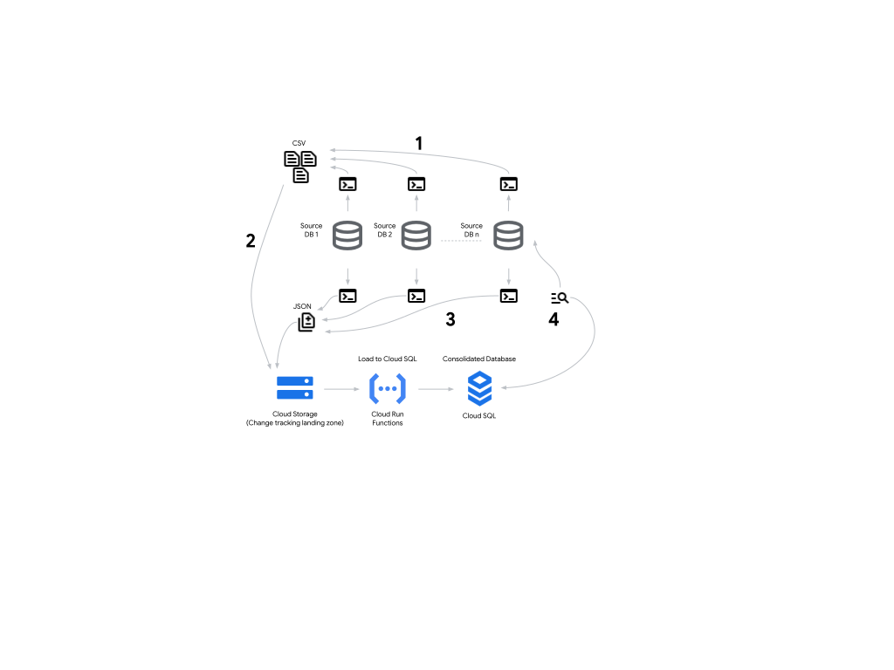

# Migrate from Azure to Google Cloud: Migrate SQL Server to Cloud SQL for PostgreSQL and AlloyDB for PostgreSQL

Google Cloud provides tools, products, guidance, and professional services to
migrate from Azure SQL Database and Azure SQL Managed Instance to Cloud SQL for
PostgreSQL and AlloyDB for PostgreSQL. This document discusses how to design,
implement, and validate a database migration from a SQL Server database
management system on Azure to a PostgreSQL database management system on Google
Cloud.

This document is intended for cloud and database administrators who want details
about how to plan and implement a database migration project. It’s also intended
for decision-makers who are evaluating the opportunity to migrate and want an
example of what a migration might look like.

This document focuses on heterogeneous migrations of Azure Database and Azure
SQL Managed Instance to Cloud SQL for PostgreSQL and AlloyDB for PostgreSQL. A
heterogeneous database migration is a migration where the source and target
databases utilize different database technology. For example, you migrate from a
SQL Server based database in Azure to a PostgreSQL based database in Google
Cloud.

Google Cloud provides Cloud SQL for PostgreSQL and AlloyDB for PostgreSQL, two
fully managed relational database services that allows users to deploy, manage,
and scale PostgreSQL databases without the overhead of managing infrastructure.
In this document, we focus on Cloud SQL for PostgreSQL and AlloyDB for
PostgreSQL as the target environment to migrate the Azure SQL Database and Azure
SQL Managed Instance to.

Migrating from Azure SQL Database and Azure SQL Managed Instance to Cloud SQL
and AlloyDB for PostgreSQL can provide increased flexibility, especially for
organizations looking to standardize on open-source technologies and avoid
vendor lock-in. PostgreSQL's support for modern data types, advanced querying
capabilities, and strong community ecosystem make it an attractive choice for
innovation and scalability. Additionally, Google Cloud’s managed database
services can offer improved performance, lower operational overhead, and
integration with other Google Cloud products such as BigQuery and Vertex AI.

| Source                     | Destination              |
| :------------------------- | :----------------------- |
| Azure SQL Database         | Cloud SQL for PostgreSQL |
| Azure SQL Database         | AlloyDB for PostgreSQL   |
| Azure SQL Managed Instance | Cloud SQL for PostgreSQL |
| Azure SQL Managed Instance | AlloyDB for PostgreSQL   |

For a comprehensive mapping between Azure and Google Cloud services, see
[compare AWS and Azure services to Google Cloud services](https://cloud.google.com/free/docs/aws-azure-gcp-service-comparison).

For this migration to Google Cloud, we recommend that you follow the migration
framework described in
[Migrate to Google Cloud: Get started](https://cloud.google.com/architecture/migration-to-gcp-getting-started).

The following diagram illustrates the path of your migration journey. For
migration scenarios, the Deploy phase is equivalent to performing a migration
process.


You might migrate from Azure SQL Database and Azure SQL Managed Instance to
Cloud SQL and AlloyDB in a series of iterations—for example, you might migrate
some instances first and others later. For each separate migration iteration,
you follow the phases of the general migration framework:

1.  Assess and discover your workloads and data.
1.  Plan and build a foundation on Google Cloud.
1.  Migrate your workloads and data to Google Cloud.
1.  Optimize your Google Cloud environment.

For more information about the phases of this framework, see
[Migrate to Google Cloud: Get started](https://cloud.google.com/architecture/migration-to-gcp-getting-started).

To design an effective migration plan, we recommend that you validate each step
of the plan, and ensure that you have a rollback strategy. To help you validate
your migration plan, see
[Migrate to Google Cloud: Best practices for validating a migration plan](https://cloud.google.com/architecture/migration-to-google-cloud-best-practices).

The workloads to migrate may be composed of resources of several kinds, such as:

- Compute resources
- Data and object storage
- Databases
- Messaging and streaming
- Identity management
- Operations
- Continuous integration and continuous deployment

This document focuses on migrating Azure Database and Azure SQL Managed Instance
to Cloud SQL for PostgreSQL and AlloyDB for PostgreSQL. For more information
about migrating other kinds of resources, such as compute resources and objects
storage from Azure to Google Cloud, see the
[Migrate from Azure to Google Cloud document series](./README.md).

## Assess the source environment

In the assessment phase, you determine the requirements and dependencies of the
resources that you want to migrate your Azure SQL databases to Cloud SQL and
AlloyDB

The assessment phase consists of the following tasks:

1.  Build a comprehensive inventory of your workloads.
1.  Catalog your workloads according to their properties and dependencies.
1.  Train and educate your teams about Google Cloud, including database best
    practices.
1.  Build experiments and proofs of concept on Google Cloud.
1.  Calculate the total cost of ownership (TCO) of the target environment.
1.  Decide on the order and priority of the workloads that you want to migrate.

The database assessment phase helps you answer questions regarding your database
version, size, platform, edition, dependencies and many more. It helps choose
the size and specifications of your target Cloud SQL instance that match the
source for similar performance needs. Pay special attention to disk size and
throughput, IOPS and number of vCPUs. Migrations might struggle or fail due to
incorrect target instance sizing. Incorrect sizing can lead to long migration
times, database performance problems, database errors and application
performance problems. When deciding on the Cloud SQL instance, consider your
database engine and version requirements, location requirements, recovery time
objective (RTO) and recovery point objective (RPO). Depending on your
requirements, consider choosing the database engine and version, Google Cloud
[region and zone](https://cloud.google.com/compute/docs/regions-zones), and
Cloud SQL edition. For more information about Cloud SQL editions, see
[Introduction to Cloud SQL editions](https://cloud.google.com/sql/docs/editions-intro).
Keep in mind that disk performance is based on the disk size and the number of
vCPUs.

For more information about the assessment phase and these tasks, see
[Migrate to Google Cloud: Assess and discover your workloads](https://cloud.google.com/solutions/migration-to-gcp-assessing-and-discovering-your-workloads).
The following sections are based on information in that document.

### Build an inventory of your Azure SQL Server based databases

All migrations start with the assessment. The goal of this step is to collect
information about the existing infrastructure to better understand the existing
environment, migration goals and the risks and opportunities.You create an
inventory and collect information about your Azure databases. Ideally, this
should be an automated process, because manual approaches are prone to error and
can lead to incorrect assumptions. There are many tools specialized on assessing
certain database engines and estimate the migration complexity depending on the
target database environment.

### Tools for assessments

For a general infrastructure inventory buildup and assessment, we recommend
[Google Cloud Migration Center](https://cloud.google.com/migration-center/docs/migration-center-overview).
With Migration Center, you can perform a assessment of your application and
database landscape, including the technical fit for a database migration to
Google Cloud. You receive size and configuration recommendations for each source
database, and create a total cost of ownership (TCO) report for servers and
databases.

For more information about assessing your Azure environment by using Migration
Center, see
[Import data from other cloud providers](https://cloud.google.com/migration-center/docs/import-data-cloud-providers).

#### Database Migration Assessment Tool (DMA)

A more specialized assessment tool is Database Migration Assessment Tool (DMA).

We recommend using DMA when migrating from Azure SQL Database and Azure SQL
Managed Instance to Cloud SQL for PostgreSQL and to AlloyDB for PostgreSQL.

DMA is an open source data collector tool, backed by Google’s engineers,
Professional Services, and partners. It offers a complete and accurate database
assessment, including features in use, database logic and database objects, for
example: schemas, tables, views, functions, triggers, and stored procedures. DMA
identifies which functions, triggers, or stored procedures might require manual
code refactoring. Each database is given a modernization score and the databases
are ranked from lowest to highest migration complexity.

DMA provides Google Cloud target database sizing recommendations and price
information, according to the characteristics of the analyzed workloads. It can
also recommend using schema conversion or migration tools like ISpirer or
Compilerworks.

To perform a database assessment process using the DMA collection script, follow
the steps described in the
[Discover and import databases section](https://cloud.google.com/migration-center/docs/discover-and-import-databases)
of the Migration Center documentation.

DMA classifies objects inside assessed databases in three categories, according
to the migration effort:

- Automated: no additional manual work is required.
- Partially Automated: some additional manual work might be required.
- Refactor: manual refactoring is required to convert these objects.

As part of the database assessment readout, DMA provides database migration
target recommendations. Depending on the type of source databases, their
workloads, number of transactions, and reads and writes, DMA provides an initial
Google Cloud database target recommendation for each database.

For information about open-source data collector and assessment scripts, see
[Google Cloud Database Migration Assessment](https://cloud.google.com/migration-center/docs/discover-and-import-databases).

#### Ispirer Assessment Wizard for Databases

Another tool that you can use for assessment is Ispirer Assessment Wizard for
Databases. Ispirer Assessment is designed to collect statistical information
about databases and applications and get a better understanding of the size of
the migration project. The tool provides a complete report on the number of
tables, the amount of data, the number of database objects and the number of
lines of code in each type of database object. It identifies potential
compatibility issues, data type mismatches and it offers detailed reports and
cost estimations, enabling an efficient database migration project planning.

For more information about assessing a SQL Server to PostgreSQL migration, see
[Ispirer Assessment Wizard for Databases guide](https://support.ispirer.com/guides/migration-assessment/databases-assessment-with-odbc).

### Identify and document the migration scope and affordable downtime

At this stage, you document essential information that influences your migration
strategy and tooling. By now, you can answer the following questions:

- How large are your database backups?
- How many tables are in your databases and how large are they?
- Where are the databases located (regions and zones), and what's their
  proximity to applications?
- How often does the data change?
- What is your data consistency model?
- What are the options for destination databases?
- How compatible are the source and destination databases?
- Is there data that can be compressed and archived, or is there data that
  doesn't need migration at all?
- What applications connect to your database?
- Do your databases have any upstream or downstream dependencies?

To define the migration scope, decide what data to keep and what to migrate.
Migrating all your databases might take considerable time and effort. Some data
might remain in your source database backups. For example, old logging tables or
archival data might not be needed. Alternatively, you might decide to move data
after the migration process, depending on your strategy and tools.

Determine how much downtime you can afford. What are the business impacts of
downtime? Are there periods of low database activity, during which there are
fewer users affected by downtime? If so, how long are such periods and when do
they occur? Consider having a partial write only downtime, while read-only
requests are still served.

### Assess the differences between your source and target database engines

SQL Server and PostgreSQL databases have some similar features, specifications,
and operation. However, there are also many functionalities that are implemented
differently or are unavailable. Azure SQL Server based databases provide high
compatibility with the SQL Server database engine and are based on the latest
stable version of SQL Server. Similarly, Cloud SQL for PostgreSQL and AlloyDB
for PostgreSQL provide high compatibility with PostgreSQL. Educate your team
about the differences in database technologies and their different
implementations. The following table summarizes the major differences between
the two database engines:

| Topic                  | SQL Server                                                                                                                              | PostgreSQL                                                                                                                                                         |
| :--------------------- | :-------------------------------------------------------------------------------------------------------------------------------------- | :----------------------------------------------------------------------------------------------------------------------------------------------------------------- |
| Licensing              | Proprietary licensing model (per-core or CAL). Free Developer Edition available.                                                        | Open-source and free to use (PostgreSQL License)                                                                                                                   |
| Editions               | Tiered edition model with varying features and costs                                                                                    | Single codebase with all features available                                                                                                                        |
| SQL Syntax             | Transact-SQL (T-SQL), a dialect of SQL with extensions                                                                                  | Adheres closely to the SQL standard. Extensions such as PL/pgSQL for procedural logic                                                                              |
| Data Types             | Support for common data types (integer, text, date, spatial types etc.) and some proprietary types such as UNIQUEIDENTIFIER             | Extensive, supports more advanced data types such as JSON/JSONB, custom types, arrays, HSTORE, and geometric data                                                  |
| Indexing               | Support for clustered, non-clustered, filtered indexes. Built-in full-text search and columnar store                                    | B-tree, hash, GIN, GiST, and BRIN indexes. Full-text search and columnar store supported via extensions                                                            |
| Concurrency model      | Supports both pessimistic (default) and optimistic concurrency control through MVCC. Lock contention in some high-concurrency scenarios | Optimistic concurrency control through MVCC is core to its architecture                                                                                            |
| Extensibility          | Supports CLR for custom functions, linked servers for cross-database queries                                                            | Extensible via FDWs and custom extensions                                                                                                                          |
| High Availability (HA) | Built-in features such as Always On Availability Groups, clustering, replication                                                        | Built-in: streaming replication, logical replication. Third-party solutions such as [Patroni](https://patroni.readthedocs.io/en/latest/index.html) for enhanced HA |
| Replication            | Transactional, snapshot, and merge replication                                                                                          | Logical and streaming replication. Extensible with community tools such as pglogical                                                                               |
| Monitoring Tools       | Built-in system views and Query Store                                                                                                   | extensions such as pg_stat_statements for query performance monitoring                                                                                             |
| Ecosystem              | Tightly integrated with the Microsoft ecosystem, including .NET and Azure platforms.                                                    | Widely supported by various programming languages, frameworks, and third-party tools.                                                                              |

For more information about differences between PostgreSQL and SQL Server, see:

- [PostgreSQL vs SQL Server: What are the key differences?](https://cloud.google.com/learn/postgresql-vs-sql)
- [Which database should I choose?](https://medium.com/google-cloud/which-database-should-i-choose-44be039179ea)

Moreover, some features are specific only to Azure and Google Cloud
infrastructures. For example the built-in high availability logic to help
protect against a single machine failure and the auto-scale in the case of using
the serverless model in Azure. Similarly, data cache and columnar engine are
features specific only to Google Cloud. Other areas of differences might include
underlying infrastructure, storage, authentication and security, replication and
backup.

To help you avoid potential issues and delays during the migration process, we
recommend that you evaluate how and if Azure SQL Server and Azure SQL Managed
Instance databases features your system requires map to the similar Cloud SQL
for PostgreSQL and AlloyDB for PostgreSQL features.

### Assess Database and Application Compatibility

Migrating to a different database engine might need re-architecting and changing
how your workloads interact with the data layer. Many times, you might need
application layer changes when migrating to a different database engine.

Applications that interact with the database through queries, object-relational
mapping (ORM) frameworks, or stored procedure calls, may require updates to
accommodate PostgreSQL specific syntax or features. For example, differences in
data types, such as SQL Server's DATETIME versus PostgreSQL's TIMESTAMP, can
lead to compatibility challenges during data migration. Areas to assess
application compatibility include:

- **Query Syntax:** Applications using SQL Server-specific T-SQL extensions need
  query rewrites for PostgreSQL compatibility.
- **ORMs and middleware:** ORM frameworks such as .NET Entity Framework or
  Hibernate ORM for Java, might require configuration or mapping adjustments for
  PostgreSQL's schema and query execution.
- **Connection Management:** Applications using SQL Server-specific ODBC or JDBC
  drivers need updated drivers and connection strings for PostgreSQL.
- **Transaction Handling:** Applications relying on SQL Server's implicit
  transaction or locking behavior may need changes to adapt to PostgreSQL's
  transaction model.
- **Error handling** needs validation to ensure seamless functionality.

Acknowledging the differences is a critical step of the assessment process.
After assessing compatibility, it is critical to plan and execute rigorous
testing. This includes:

- **Unit Testing**: To ensure individual queries, functions, and scripts work
  correctly in PostgreSQL.
- **Integration Testing**: To validate that applications can interact seamlessly
  with the new database.

### Performance assessment

In order to assess the performance of your source database along with the
applications that are interacting with it, you gather the metrics of your source
workloads. You then analyze and compare them to the ones of the target database
management system and the modernized applications that work together with it.
This is especially important when migrating between different database
management systems such as SQL Server and PostgreSQL and modernizing the
applications that interact with them.

Document baseline measurements on your source environment in production use:

- Measure the size of your data, as well as your workload’s performance. How
  long do important queries or business transactions take, on average? How long
  during peak times? This includes metrics such as:

    - Query response times: For common and critical queries.
    - Transactions per second (TPS): A measure of how many transactions your
      database can handle.
    - Resource utilization: CPU, memory, and disk I/O usage.
    - Latency: The time it takes for data to travel between points.

- Load testing: Simulate realistic user loads to assess how the database
  performs under stress.
- Application testing: Test your database’s performance along with the
  applications that connect to it. Changing the underlying database engine
  usually involves changing the applications’ connection libraries, which might
  use different resources for database connections, or different connection
  pooling techniques, leading to different performances.
- Consider performing benchmarks in the assessment phase. You can use open
  source industry-standard database benchmarking tools such as
  [HammerDB](https://www.hammerdb.com/about.html) and
  [Pgbench](https://www.postgresql.org/docs/current/pgbench.html) for
  PostgreSQL. It supports complex transactional and analytic workloads on
  multiple database engines (both TPROC-C and TPROC-H). For more information
  about benchmarking, see
  [Load testing SQL Server using HammerDB](https://cloud.google.com/compute/docs/tutorials/load-testing-sql-server-hammerdb).
- You document the metrics outcomes for later comparison in the validation of
  the migration before the cut-over step. The comparison helps you decide if the
  fidelity of your database migration is satisfactory and if you can switch your
  production workloads.

### Create a Proof of Concept (POC)

A Proof of Concept (POC) is a small-scale implementation of a planned migration
process that helps you assess the feasibility, effectiveness, and potential
challenges of migrating a database system.

The POC should help answer the following general migration questions:

- Are there any schema or data compatibility issues?
- Does the migration strategy and tooling work as intended?
- How long will the migration take for the given volume of data?

Define specific success criteria for the POC, such as migration read downtime
under 5 minutes, write downtime below 30 minutes and 3K transactions per second
throughput on the target database. You then define the scope of the POC and you
migrate your defined scope to a simulated target environment. Document findings,
challenges and solutions in your overall migration plan documentation.

We recommend creating a POC in case of heterogeneous database migrations for the
following reasons:

- **Feasibility assessment:** Because it is a scaled down dry run migration, it
  helps you quickly evaluate whether the migration is technically possible with
  your specific source schema, data types, and business logic. You uncover early
  in the migration plan challenges such as schema conflicts, data integrity
  issues, or compatibility problems between the source, target databases and
  application layers.

- **Estimate downtime and plan for rollback**: Minimizing downtime is crucial in
  most production environments. A POC helps you measure the time required for
  data transfer and application changes. It also helps you validate your
  fallback scenarios if issues arise during the migration.

- **Refine the migration planning:** You can evaluate different approaches for
  schema conversion and data migration. By addressing any issues that appear
  during the POC phase, you can avoid costly errors during the actual migration.

- **Confidence building and stakeholder buy-in**: A successful POC builds
  confidence in the migration plan and provides a demonstration of the benefits
  of the new database platform. This can help secure buy-in from stakeholders
  and justify the investment in the migration.

- **Estimate costs and optimization possibilities:** A POC can help you estimate
  the costs associated with the migration. By understanding the resource
  requirements, licensing fees, and any additional infrastructure or services
  needed, you can create a more accurate budget for the full migration project.

- **User Acceptance Testing**: A POC enables you to involve end users in the
  migration process and gather feedback. This feedback can be valuable in
  identifying usability issues, refining the migration plan, and ensuring a
  smooth transition for users.

You might iterate through several POCs, adjusting the target database size, the
migration strategy and tools until it fulfills your success criteria.

### Assess your deployment, administration and maintenance process

Migrating to a different database engine usually implies changing the tools used
for the administration and monitoring your databases and your deployment
process.

**Deployment and administration:** SQL Server benefits from a comprehensive
suite of GUI-based tools like
[SQL Server Management Studio (SSMS)](https://learn.microsoft.com/en-us/sql/ssms/sql-server-management-studio-ssms)
and
[Azure Data Studio](https://learn.microsoft.com/en-us/azure-data-studio/what-is-azure-data-studio),
which simplifies tasks such as database management, query execution, deploying
changes, and performance monitoring. Data, schema and code changes such as
Stored Procedures, Functions, and Triggers can be deployed through similar tools
or through T-SQL scripts in SSMS, SQLCMD, and Powershell. PostgreSQL relies on a
mix of command-line tools such as
[psql](https://www.postgresql.org/docs/current/app-psql.html),
[pg_ctl](https://www.postgresql.org/docs/current/app-pg-ctl.html), and
third-party GUI such as [pgAdmin](https://www.pgadmin.org/). You can also use
open-source tools such as [Liquibase](https://en.wikipedia.org/wiki/Liquibase)
that leverage versioned SQL scripts to apply changes in a controlled and
repeatable manner.

**Configuration and Tuning:** SQL Server features such as Query Store simplify
query optimization and troubleshooting. PostgreSQL requires more manual
configuration for optimization, often by editing the **postgresql.conf** file.
Note that in managed databases such as Cloud SQL for PostgreSQL and AlloyDB for
PostgreSQL, you configure your database settings by
[configuring database flags](https://cloud.google.com/sql/docs/postgres/flags)
through the gcloud CLI, Cloud Console, and Terraform.

**Maintenance:** SQL Server offers support for job scheduling and maintenance
tasks through
[SQL Server Agent](https://learn.microsoft.com/en-us/sql/ssms/agent/sql-server-agent).
For Azure SQL Databases,
[Elastic jobs for Azure SQL Database](https://learn.microsoft.com/en-us/azure/azure-sql/database/elastic-jobs-overview?view=azuresql)
offer similar functionality. Common maintenance tasks for SQL Server include
[index maintenance](https://learn.microsoft.com/en-us/sql/relational-databases/indexes/reorganize-and-rebuild-indexes),
[statistics update](https://learn.microsoft.com/en-us/sql/relational-databases/statistics/update-statistics)
and
[transaction log management](https://learn.microsoft.com/en-us/sql/relational-databases/sql-server-transaction-log-architecture-and-management-guide).
PostgreSQL relies more on command-line utilities, cron-based job schedulers, and
extensions for maintenance operations such as
[pg_cron](https://github.com/citusdata/pg_cron). Maintenance for PostgreSQL
databases includes
[vacuuming](https://www.postgresql.org/docs/current/sql-vacuum.html), which is a
database maintenance process that reclaims space occupied by dead tuples
(obsolete or deleted row versions) within tables and indexes, somewhat similar
to SQL Server’s
[ghost records cleanup process](https://learn.microsoft.com/en-us/sql/relational-databases/ghost-record-cleanup-process-guide),
[updating planner statistics](https://www.postgresql.org/docs/current/routine-vacuuming.html#VACUUM-FOR-STATISTICS),
and [reindexing](https://www.postgresql.org/docs/current/sql-reindex.html).

For more information about the assessment of your deployment and administration
process, see
[Migrate to Google Cloud: Assess and discover your workloads](https://cloud.google.com/architecture/migration-to-gcp-assessing-and-discovering-your-workloads),
especially the
[Assess your deployment and operational processes](https://cloud.google.com/architecture/migration-to-gcp-assessing-and-discovering-your-workloads#assess_your_deployment_and_operational_processes)
section.

### Complete the assessment

After you build the inventories from your Azure environment, complete the rest
of the activities of the assessment phase as described in
[Migrate to Google Cloud: Assess and discover your workloads](https://cloud.google.com/solutions/migration-to-gcp-assessing-and-discovering-your-workloads).

## Plan and build your foundation

In the plan and build phase, you provision and configure the infrastructure to
do the following:

- Support your workloads in your Google Cloud environment.
- Connect your Azure environment and your Google Cloud environment to complete
  the migration.

### Build your foundation on Google Cloud

The plan and build phase is composed of the following tasks:

1.  Build a resource hierarchy.
1.  Configure identity and access management.
1.  Set up billing.
1.  Set up network connectivity.
1.  Harden your security.
1.  Set up logging, monitoring, and alerting.

For more information about each of these tasks, see
[Migrate to Google Cloud: Build your foundation](https://cloud.google.com/architecture/migration-to-google-cloud-building-your-foundation).

### Identity and access management

Consider how you connect to your Azure databases. You might be using a mix of
SQL account based and Microsoft Entra authentication. You might need to map your
authentication methods from Azure SQL Managed Instance and Azure SQL Database to
[Cloud SQL built-in database authentication](https://cloud.google.com/sql/docs/postgres/built-in-authentication)
and
[IAM authentication](https://cloud.google.com/sql/docs/postgres/iam-authentication).

### Monitoring and alerting

Use Google [Cloud Monitoring](https://cloud.google.com/monitoring), which
includes predefined dashboards for several Google Cloud products, including a
Cloud SQL monitoring dashboard. Alternatively, you can consider using
third-party monitoring solutions that are integrated with Google Cloud, like
Datadog and Splunk. For more information about monitoring and alerting, see
[About database observability](https://cloud.google.com/sql/docs/sqlserver/observability)
and [Monitor instances](https://cloud.google.com/alloydb/docs/monitor-instance).

## Migrate Azure SQL Server databases to Cloud SQL for PostgreSQL and AlloyDB for PostgreSQL

For a successful heterogeneous database migration, we recommend that you follow
a proven, tested and successful migration framework. This helps reduce business
impact and leads to a successful database process and production cut-over.

A heterogeneous database migration framework can be structured as follows:

1.  [Choose the migration strategy](#choose-the-migration-strategy)

1.  [Choose the migration tools](#choose-your-migration-tools)

1.  [Schema and Code conversion and adaption](#schema-and-code-conversion-and-adaptation)

1.  [Data migration](#data-migration)

1.  [Define fallback scenarios](#define-fallback-scenarios)

1.  [Testing and validation objects, data and performance validation](#testing-and-validation-objects-data-and-performance-validation)

1.  [Security roles and groups](#security-roles-and-groups)

1.  [Application migration and modernization](#application-migration-and-modernization)

1.  [Perform the production cut-over](#perform-the-production-cut-over)

1.  [Post-migration cleanup and tuning](#post-migration-cleanup-and-tuning)

1.  [Update database production operations runbooks and support documentation](#update-database-production-operations-runbooks-and-support-documentation)

Each phase is described in the following sections.

### Migration Planning

For a successful database migration and production cut-over, we recommend that
you prepare a well-defined, comprehensive migration plan.

Database migrations are iterative processes, and first migrations are often
slower than the later ones. Usually, well-planned migrations run without issues,
but unplanned issues can still arise. We recommend that you always have a
rollback plan. As a best practice, follow the guidance from
[Migrate to Google Cloud: Best practices for validating a migration plan](https://cloud.google.com/architecture/migration-to-google-cloud-best-practices#migration_planning).

### Choose the migration strategy

After you complete the database assessment, you have enough information to
evaluate and decide on one of the following migration strategies that best suits
your use case:

- **Scheduled maintenance** (also called one-time migration): Ideal if you can
  afford downtime. This option is relatively low in cost and complexity.
  However, if the migration fails before completion, you have to restart the
  process, which prolongs the downtime. For more details, see
  [Scheduled maintenance.](https://cloud.google.com/architecture/migration-to-google-cloud-transferring-your-large-datasets#scheduled_maintenance)

- **Continuous replication** (also called trickle migration): Suited for
  mission-critical databases that can't undergo long scheduled downtimes. This
  option offers a lower risk of data loss and near-zero downtime. Because the
  efforts are split into several chunks, if a failure occurs, rollback and
  repeat takes less time. However, a relatively complex setup is required and
  takes more planning and time. For more details, see
  [Continuous replication](https://cloud.google.com/architecture/migration-to-google-cloud-transferring-your-large-datasets#continuous_replication).

Two variations of the continuous replication strategy are represented by Y
(writing and reading) and the Data-access microservice migration pattern. They
both are a form of continuous replication migration, duplicating data in both
source and destination instances. While they can offer zero downtime and high
flexibility when it comes to migration, they come with an additional complexity
given by the efforts to refactor the applications that connect to your database
instances. For more information about data migration strategies, see
[Migration to Google Cloud: Transferring your large datasets](https://cloud.google.com/architecture/migration-to-google-cloud-transferring-your-large-datasets#data_migration_approaches).

When deciding the strategy for migrating from Azure SQL database to Cloud SQL
for PostgreSQL and AlloyDB for PostgreSQL, you must answer one important
question: can you tolerate the downtime represented by the cut-over window while
migrating data? The cut-over window represents the time to take a backup of the
database, transfer it to the target Cloud SQL or AlloyDB instance, restore it to
the database that was created during the schema conversion step, and then switch
over your applications. If yes, adopt the scheduled maintenance migration
strategy. If not, adopt the continuous replication migration strategy.

Strategies may vary for different databases located on the same instance and
usually a mix of them can produce optimal results. Small and infrequently used
databases can usually be migrated using the scheduled maintenance approach,
while for the mission-critical ones where having downtime is unacceptable, the
best fitting strategies usually involve continuous replication.

Usually, a migration is considered completed when the switch between the initial
source and the target instances takes place. Any replication (if used) is
stopped and all reads and writes are done on the target instance. Switching when
both instances are in sync means no data loss and minimal downtime.

When the decision is made to migrate all applications from one replica to
another, applications (and therefore customers) might have to wait (incurring
application downtime) at least as long as the replication lag lasts before using
the new database. In practice, the downtime might be higher because:

#### Database Instance

- Database queries can take a few seconds to complete. At the time of migration,
  in-flight queries might be aborted.
- The database might need to be “warmed up” by filling up the cache if it has
  substantial buffer memory, especially in large databases.

#### TCP reconnections

- When applications establish a connection to the Google Cloud target database
  instance, they need to go through the process of connection initialization.

#### Applications

- Applications might need to reinitialize internal resources, such as connection
  pools, caches, and other components, before they can fully connect to the
  database. This warm-up time can contribute to the initial lag.

#### Network

- Applications must be able to reach the target database. This may involve
  setting up VPNs,
  [Virtual Private Cloud](https://cloud.google.com/vpc/docs/overview) (VPC)
  peering, or configuring firewalls.
- Applications stopped at source and restarted in Google Cloud might have a
  small lag until the connection to the Google Cloud database instance is
  established, depending on the network conditions, especially if the network
  paths need to be recalculated or if there is high network traffic.
- Monitor the network traffic to your source databases after application
  cut-over.

#### DNS

- Based on how DNS entries are set up, connectivity between clients and the
  target database instances can take some time. Reduce to minimum the DNS time
  to live records (TTL) before migration and make sure that your clients respect
  the TTL of the DNS records to update. Some clients might not respect DNS TTLs
  because they might employ overly aggressive client-side DNS records caching,
  or because of bugs in their implementation.

For more information about data migration strategies, see
[Classification of database migrations](https://cloud.google.com/architecture/database-migration-concepts-principles-part-1#classification_of_database_migrations).

#### Minimize downtime and impact due to migration

Migration configurations that provide no application downtime require the most
complex setup. One has to balance the efforts needed for a complex migration
setup and deployment orchestrations against the perspective of having a
scheduled downtime, planned when its business impact is minimal. Have in mind
that there is always some impact associated with the migration process. For
example, replication and change data capture (CDC) processes usually involve
some additional load on your source instances.

While managed migration services try to encapsulate that complexity, application
deployment patterns, infrastructure orchestration and custom migration
applications might also be involved to ensure a seamless migration and cut-over
of your applications.

Some common practices to minimize downtime impact:

- Find a time period for when downtime impacts minimally your workloads. For
  example: outside normal business hours, during weekends, or other scheduled
  maintenance windows.
- Find parts of your workloads for which the migration and production cut-over
  can be executed at different stages.
- Consider implementing a gradual, slower paced migration. For example, you
  might mitigate your migration impact if you can afford to have some latency on
  the target database by using incremental, batched data transfers and adapting
  part of your workloads to work with the stale data on the target instance or
  by introducing concepts like “pending data” in your workloads.
- If you need near-zero downtime, consider refactoring your applications to
  support minimal migration impact. For example: adapt your applications to
  write to both source and target databases and therefore implement an
  application-level replication. This option might bring the best benefits in
  terms of low downtime but it might require complex workloads refactoring and
  building a consistency monitoring mechanism.

### Choose your migration tools

In case of heterogeneous database migrations, third party tools play a much more
important role than for homogeneous migrations. Built-in tools provided by
database vendors lack the necessary conversion and transformation capabilities
to bridge the gaps of different database source and target systems efficiently
and reliably. In contrast, for performing homogeneous migrations, one can often
leverage built-in replication, backup and restore utilities, or built-in
clustering features.

There are many tools, each having their own specialities and scope. Some focus
on the initial backup, while others are specialized in streaming database
changes based on change data capture (CDC). These tools capture and replicate
changes made to the source database in near real-time, allowing for continuous
synchronization until the production cutover.

Most of the tools handle schema evolution, data transformations, and conflict
resolution, while a handful are more specialized for mission-critical workloads,
offering better performance through parallelization, distributed processing, and
robust error handling.

Some common evaluation criteria for choosing the migration tools:

- **Support:** Full support for your source and target databases.
- **Migration Strategy and:** Scheduled maintenance or continuous replication.
- **Features availability:**
    - Data transformation and schema conversion capabilities
    - Error handling and logging
    - Security features such as encryption in transit and at rest
    - Monitoring
- **Reliability and Resilience:** Data integrity checks, failover mechanisms,
  ability to resume interrupted transfers.
- **Performance:** Throughput, latency.
- **Cost:** Licensing models, implementation costs, ongoing maintenance.
- **Ease of use:** Configuration complexity, learning curve.
- **Vendor and community support:** Documentation, customer support, active
  community forums.
- **Specific Migration Scenarios:**
    - Consolidation and database rearchitecting.
    - Support for large objects or specific data types such as BLOBs, CLOBs,
      JSON.

For selecting your migration tool, choose the criteria that corresponds best to
your use case and perform an evaluation based on their importance. Remember that
most of the time, you might use a set of migration tools, each performing their
specialized activity such as schema and code conversion, initial load, data
migration, transformation, and validation.

### Schema and Code conversion and adaptation

In a heterogeneous database migration, the schema and conversion stage plays a
crucial role. The goal of this stage is to convert the schema structure and the
database code base of the source database into a format that is compatible with
the target database.

Schema and code conversion is usually performed in two stages:

- **Conversion:** You analyze the source schema and database code objects and
  you then convert and translate them to the dialect of the target database. The
  output is usually exported as files or deployment packages.
- **Import:** You deploy the converted objects on the target database.

#### Schema conversion

There are differences between the two database engines, which you need to cover
during the schema conversion step. PostgreSQL and SQL Server diverge in the
behavior and precision of their data types such as the datetime, timestamp and
money types, query language syntax, basic concepts such as users, schemas and
the relationships between each other, extensibility, and various feature
implementations such as in-memory structures and column stores.

During schema conversion, the goal is to ensure that the data models, tables,
relationships, and constraints in the source database are appropriately
translated and adapted to fit the requirements and specifications of the target
database. This process usually involves mapping data types, modifying table
structures and handling differences in constraints or indexing mechanisms.

#### Code conversion

The code conversion step is similar to the schema conversion step in the sense
that it deals with translating the existing source database code base such as
stored procedures, functions, triggers, views, and user-defined types to one
that the target database can understand. The objective of this step is to
maintain functionality, optimize performance, and adhere to the structural
nuances of the target database, ensuring a seamless transition from one database
system to another.

Code converting requires a deep understanding of both the source and target
database systems, encompassing divergent syntax, data types, and functionality.
Each line of code must be meticulously scrutinized and modified to align with
the intricacies of the new environment.

The syntax of the two database engines is in general similar, with a few slight
differences in syntax, features, and usage. Some of the most important
conceptual differences:

- **Stored Procedures vs. Functions**: SQL Server supports both stored
  procedures and functions, while PostgreSQL traditionally emphasizes functions.
  In SQL Server, stored procedures can return integer values as status codes,
  and can have output parameters, but they can also return a dataset. In
  PostgreSQL, you need to create a function with return type as TABLE to return
  a dataset.
- **Case Sensitivity:** By default, SQL Server is case-insensitive for
  identifiers, while PostgreSQL is case-sensitive unless explicitly handled.
- **Concurrency Control:** By default, SQL Server and Azure SQL Managed Instance
  employs a pessimistic concurrency control model through locking, while
  PostgreSQL has an optimistic concurrency control, using a multiversion model
  where reading doesn’t block writing and writing doesn’t block reading.
  However, Azure SQL Database by default uses the optimistic multiversion model
  through the default committed snapshot transaction isolation level.
- **Scheduling:** PostgreSQL doesn’t have a built-in job scheduler, while SQL
  Server uses SQL Server Agent. Repetitive tasks need external tools like cron,
  pgAgent, or pg_cron in PostgreSQL.

#### Conversion and adaption considerations

Because the process of schema and code conversion requires a deep understanding
of both source and target database systems, we recommend using established
migration tools to automate as much as possible the schema and code conversion
process. However, human intervention remains indispensable for resolving
intricate conversion issues that go beyond the capabilities of automated tools.
We recommend training your teams to understand both the source and target
engines to be able to verify the automated conversion process. Expertise in
database design and data modeling is beneficial, especially in case of
performing adaptations within the conversion process.

Additionally, it’s crucial to conduct thorough testing after you perform schema
and code conversion to validate the integrity of the migrated code and to ensure
that the applications function as intended on the target database. Allocate some
time for reviewing and testing queries, functions, procedures. The necessary
time to review and refactor depends on the complexity of the code. Testing might
include running procedures, functions and queries on the source system,
reviewing and documenting the returned results and performance metrics such as
execution time and IO, and then repeating the same process on the converted
target system to compare and validate outcomes.

#### Conversion tools

Selecting an appropriate schema and code conversion tool is crucial for a smooth
and efficient migration process, depending on your use case:

- If you prefer a Google-managed migration product that can connect directly to
  your source databases to extract the schema and objects information, and can
  leverage Gemini to help in schema and code conversion suggestions, we
  recommend using Database Migration Service.
- If you have complex source databases, with many diverse object types, and if
  you prefer to perform conversion starting from source database schema and
  objects scripts, we recommend looking into Ispirer SQLWays Wizard. You can
  also use Ispirer as a complementary tool together with Database Migration
  Service.
- If you prefer using free third party tools and your schema and code conversion
  use cases are not complex, you can use pgloader for schema and code
  conversion.

Each conversion tool is described in the following sections.

#### Database Migration Service for schema and code conversion from SQL Server to Cloud SQL for PostgreSQL and AlloyDB for PostgreSQL

Database Migration Service can help you convert SQL Server schema and database
code, and then migrate data from your SQL Server databases to Cloud SQL for
PostgreSQL and AlloyDB for PostgreSQL.

[Conversion workspaces](https://cloud.google.com/database-migration/docs/sqlserver-to-csql-pgsql/about-conversion-workspaces)
offer an interactive platform for converting schemas, tables, and other objects
from SQL Server to PostgreSQL syntax. Interactive conversion workspaces support
Gemini-assisted workflows, which provide code explanations and help resolve
conversion issues. With the interactive SQL editor, you can modify converted
PostgreSQL syntax to fix conversion issues or to adjust the target schema to
better fit your needs.

For more information about using Database Migration Service for schema and code
conversions in heterogeneous SQL Server database migrations, see:

- [Automated code and schema conversion](https://cloud.google.com/database-migration/docs/sqlserver-to-csql-pgsql/work-with-conversion-workspaces)
- [Convert SQL Server code and schema to PostgreSQL syntax](https://cloud.google.com/database-migration/docs/sqlserver-to-csql-pgsql/convert-sql)
- [Migrate your SQL Server database to Cloud SQL for PostgreSQL](https://cloud.google.com/database-migration/docs/sqlserver-to-csql-pgsql/guide)

#### Ispirer schema and code conversion

For SQL Server to PostgreSQL but also other source and destination combinations
you can use
[Ispirer SQLWays Wizard](https://www.ispirer.com/products/sqlways-database-migration).
It is a software solution designed to facilitate the migration of database
schemas across different database management systems, including Microsoft SQL
Server, MySQL, PostgreSQL, Oracle and others.

Source database tables with all related indexes and constraints are converted
into equivalent target database objects. Data types are also converted to the
target database compatible types and they can also be customized. Procedures or
functions written in different dialects like PL/SQL, T-SQL or PL/pgSQL are
converted to match the target database language. The Ispirer toolkit can also
extract SQL statements from application code and convert them separately. The
tool completes the whole migration process internally. For more information
about setting up and using Ispirer SQLWays Wizard to perform schema and code
conversion, see the
[Ispirer SQLWays Wizard](https://www.ispirer.com/products/sqlways-database-migration)
documentation and the
[Ispirer Toolkit FAQ](https://support.ispirer.com/knowledge-base/database-migration/ispirer-toolkit-faq)
section.

#### Other schema and code conversion tools

If you prefer using free third party tools and your schema and code conversion
use cases are not complex, you can use
[pgloader](https://pgloader.readthedocs.io/en/latest/) for schema and code
conversion. Pgloader is a robust data migration tool designed specifically for
converting and transferring data to PostgreSQL. It supports automatic discovery
of the schema, including build of the indexes, primary and foreign keys
constraints. For more information about SQL Server to PostgreSQL migrations
through pgloader, see
[SQL Server to PostgreSQL with pgloader](https://pgloader.readthedocs.io/en/latest/ref/mssql.html#ms-sql-to-postgres)
migrations.

### Data migration

Data migration is the step in which you migrate the data from the source
database to the target database. In the migration planning phase, you decided
about the migration strategy for each database. There are two ways in which you
can migrate data, depending on the criticality of your database and its downtime
tolerance:

- **Scheduled maintenance** (also called one-time migration or _big bang
  migration_): Ideal if you can afford downtime. This option is low in cost and
  complexity and usually easier to implement, but it involves significant
  downtime. We recommend choosing the simple approach for workloads with high
  tolerance for downtime. The main steps of scheduled maintenance migrations
  are:

1.  Stop writing to the source database.
1.  Take a backup of the source database.
1.  Apply schema and code conversions to your full backup.
1.  Load the backup into the target database.
1.  Connect your applications to the target database.
1.  Start writing to the new primary database.

- **Continuous replication** (also called online migration or _trickle
  migration_): For mission-critical databases that can't undergo significant
  downtime. It requires a relatively complex setup and takes more planning and
  effort, but it can deliver near-zero downtime database migrations. Database
  migrations performed through continuous replication usually involve two
  stages:

1.  **Initial load**: this stage handles the initial population of target
    database tables for migration and usually involves a single batch load that
    can be the full dump and load it into the target database, just like in the
    case of scheduled maintenance.

1.  **Change Data Capture (CDC)**: this stage deals with the synchronization of
    changes that occurred after the moment of the initial load phase dump. It
    identifies all the data changes like inserts, updates, deletes on the source
    database and it synchronizes them to the target database.

The main steps of a database migration performed through continuous replication
are:

1.  Perform steps 1 to 2 as in the **Scheduled maintenance** migration section.
1.  Resume writes on the source database.
1.  Apply schema and code conversions to your full backup.
1.  Perform the initial load in the target database.
1.  After the initial load is done, enable Change Data Capture (CDC) to
    replicate the ongoing changes from the source to the target database.
1.  Monitor the progress of the change data capture synchronization to the
    target database.
1.  When your workloads allow it, stop writing on your source database.
1.  Wait for all the changes to be replicated.
1.  Promote the target as your primary.
1.  Deploy your applications to work with the new primary.
1.  Resume writing to your target database.

#### SQL Server’s bulk copy program utility and the psql client

For scheduled maintenance or migrations where you can afford having write
downtime, consider using
[SQL Server’s bulk copy program (bcp) utility](https://learn.microsoft.com/en-us/sql/tools/bcp-utility)
to export the data from your source SQL Server database and the
[psql](https://www.postgresql.org/docs/current/app-psql.html) client to load the
data in the target PostgreSQL database.

The bcp utility bulk copies data between an instance of Microsoft SQL Server and
a data file in a user-specified format. We recommend deciding on a specific
field terminator such as the pipe character (**|**),
[creating a format](https://learn.microsoft.com/en-us/sql/relational-databases/import-export/create-a-format-file-sql-server?view=sql-server-ver16&tabs=xml)
file and
[using character format to export data](https://learn.microsoft.com/en-us/sql/relational-databases/import-export/use-character-format-to-import-or-export-data-sql-server).

Alternatively, you can use the gcloud or the REST API to
[import your custom CSV file format](https://cloud.google.com/sql/docs/postgres/import-export/import-export-csv#gcloud_1)
into a Cloud SQL for PostgreSQL source from a Google Cloud Storage bucket.

For more information about using the bcp utility to export data from your SQL
Server database, see
[bcp utility](https://learn.microsoft.com/en-us/sql/tools/bcp-utility). For
importing CSV data to an AlloyDB for PostgreSQL instance, see
[Import the CSV file to AlloyDB for PostgreSQL](https://cloud.google.com/alloydb/docs/import-csv-file#gcloud).

#### Striim

We recommend using Striim to perform a near-zero downtime database migration of
your SQL Server database to Cloud SQL for PostgreSQL and AlloyDB for PostgreSQL.
Striim is a third-party licensed product specialized in heterogeneous
migrations. It supports multiple source and target combinations, including SQL
Server to PostgreSQL and is fit for mission-critical databases, able to process
billions of events per minute. For more information about Striim, see
[Running Striim in the Google Cloud](https://www.striim.com/docs/platform/en/running-striim-in-the-google-cloud-platform.html).

One interesting aspect about Striim is that Striim provides good support for
migrating large tables by parallelizing read jobs and then consolidating the
data into a single table. For guidance on how to parallelize the load by
splitting data into chunks with Striim, see the
[Striim ParallelLoader](https://github.com/striim/Striim-InitialLoad-ParallelLoader)
repository and documentation.

#### Debezium

If you prefer open source tools, you can use Debezium for SQL Server to
PostgreSQL migrations. Debezium is a distributed, open-source platform that
specializes in capturing real-time changes made to your databases. It provides a
reliable and scalable way to handle data change events, so custom applications
can see and respond immediately to each row-level change in the source
databases. In case of a consuming application stopping or crashing, upon restart
it will start consuming the events where it left off so it misses nothing.

Debezium is integrated with [Apache Kafka](https://kafka.apache.org/) and
provides [Kafka Connect](https://kafka.apache.org/documentation.html#connect)
compatible connectors. It works by connecting and capturing row-level changes
that occur in the schemas of your SQL Server database. The connector produces
events in a standardized format for each data change operation and streams them
to Kafka topics. Finally, applications or connectors that subscribe to those
Kafka topics consume the change events and take appropriate actions, like
executing them in your target PostgreSQL database.

Depezium supports both phases such as the initial snapshot and the CDC part of a
heterogeneous database migration and you can also apply fine grain control and
select the rows, tables and databases for which you want Debezium to publish
data changes.

For more information about Debezium migrations from Azure, see
[Azure SQL / SQL Server Change Stream with Debezium](https://learn.microsoft.com/en-us/samples/azure-samples/azure-sql-db-change-stream-debezium/azure-sql--sql-server-change-stream-with-debezium/).

#### Custom migration setups

Other heterogeneous migration patterns include custom migration setups which are
useful especially when re-architecting and performing data consolidations,
distributions or re-distributions as part of your database migration project.

One example of a custom migration architecture might look similar to the figure
below.



The preceding figure shows the following custom migration configuration:

1.  **Database Extract:** The migration starts by performing an initial load
    through custom scripts that export data to CSV files on Cloud Storage.
1.  **Initial load:** Cloud Run functions perform the import of the CSV files
    into the target Cloud SQL instance. The initial data load can be performed
    at any time on-demand, whenever the migration needs to be restarted.
1.  **Change Tracking Pull:** Data changes in the source tables are pooled
    periodically through custom scripts and extracted to Cloud Storage as Json
    files. Cloud Run functions trigger, reading the data in the files,
    optionally performing transformations and aggregations, and then finally
    inserting the output into your target database.
1.  **Monitor Change Tracking:** You can implement a monitoring runtime that
    periodically checks the data consistency between the source and target
    databases according to your change data requirements.

Custom migration setups have the disadvantage that they can take some effort to
build and maintain and they can be data model specific. Moreover, you have to
maintain two parallel database systems. For example, if your schema changes
frequently, such operations need additional effort. However, the main advantages
of such migration setups are:

- **Flexible near-zero downtime:** For each source instance, you can choose the
  ideal time when to stop writing and switch to the target database.
- **Supporting longer running, gradual database migrations:** You can perform
  incremental migrations that span across longer periods of time.
- **Highly scalable and customizable:** You can scale the number of readers and
  writers or you can pool the source changes more often.
- **Recommended for data consolidation, distribution and re-architecting:** Many
  third party tools might not be able support specific use cases like data
  consolidation, or re-architecting.
- **Fallback support:** You have a robust option for performing fallback by
  using the same infrastructure in reverse after application cutover.

### Define fallback scenarios

Preparing a fallback from target to source databases especially for highly
critical database clients is a safety net in case the migration doesn’t go as
planned. However, fallback might require significant effort, especially in the
case of heterogeneous database migrations. As a best practice, don’t perform
switch over with your production environment until your test results are
satisfactory. Both the database migration and also the fallback scenario need
proper testing and not doing so you may experience a severe outage.

A fallback plan usually refers to rolling back the migration after you perform
the production cut-over, in case issues on the target database instance appear.
We recommend deciding whether to implement a fallback and understand the
consequences of not doing so. If you do decide to implement fallback, remember
that it must be treated as a full database migration, including planning and
testing.

Once you perform the switch and your applications start writing to the new
target database, you need a reliable way of replicating the changes back to your
source database. As built-in replication methods can’t be used because of
database engine differences, you have to rely on migration tools like Database
Migration Service and third party tools like Striim, Ispirer, and Debezium.
Alternatively, you can implement differential queries that must be designed and
prepared in the target database schemas.

As your source and target databases are different, implementing a simple
fallback strategy as pointing your applications to the source database might not
work. Instead, clients that originally connected to the source databases need to
be kept available, operational and ready to be deployed in a fallback.

In case of performing data consolidation or re-architecting as part of the
initial migration, falling back through reverse migration might require
additional effort and implementation to break down and distribute

### Testing and validation objects, data and performance validation

The goal of this step is to test if the migration of the data in the database is
successful but also if it integrates well with the existing applications after
they are switched to use the new target instance.

Start by defining the success factors of testing and validation. They are
subjective. For example, for some workloads it might not be necessary to migrate
the entire data. You might be ok with not migrating archived data or data older
than a number of years. It might suffice to have archive data in a backup stored
on a cloud storage bucket. Similarly, a certain percentage of data loss might be
acceptable. This applies especially to data used for analytics workloads, where
losing part of the data does not affect general trends or performance of your
workloads. Data that has been already aggregated and is redundant can sometimes
also be left outside and just be archived in the backup done before migration.
You can also define data quality and quantity criteria, apply them to your
source environment and also see if they are similar to the target environment
after the migration is completed.

An important part of the validation step is the validation of the database
migration process itself. For this purpose, we recommend always performing at
least one migration dry run exercise. A dry run implies performing the
full-scope database migration without switching any production workloads.

Unlike POCs which you perform early in the migration process, on a subset of the
migration scope with the purpose of validating the feasibility and approach of
the migration strategy before committing to a full migration, you perform dry
runs on the full set of data, usually right before the production cut-over to
simulate the actual migration process end-to-end as closely as possible, without
making it live. A dry run offers several advantages:

- It enables you to test that all objects and configurations are properly
  migrated.
- Helps in defining and executing your migration test cases.
- Offers insights into the time needed for the actual migration and downtime,
  allowing you to calibrate your timeline.
- Represents an occasion to test, validate and adapt the migration plan.
  Sometimes you can’t plan for everything in advance, so this is an excellent
  way to spot any gaps. Moreover, as you iterate through the migration runs, you
  might discover new bugs that were initially hidden.

We recommend automating as much as possible the migration testing and validation
scenarios and integrating them in your migration iterations. They should target
all three basic layers of your infrastructure: the target storage subsystem,
database and applications.

Testing implies having access to both source and target databases and performing
tasks like:

- Comparing source and target schemas to check if all tables and executables
  exist but also row count and even data comparison at the database, table and
  row level.
- Testing that the migrated data is also visible in the applications switched to
  use the target database (migrated data is read through the application).
- Execution of custom data validation scripts.
- Performing integration testing by switching a set of applications to work with
  the target database and performing various test cases. This includes both
  reading and writing data to the target databases through the applications so
  that the workloads fully support migrated data together with newly created
  data.
- Testing the performance of the most used database queries to observe if there
  is any degradation in comparison to the source database. The causes of
  degradations usually are misconfigurations or wrong target sizing.

For a quick validation of the objects on the source and target database, you can
consider running INFORMATION_SCHEMA queries, such as:

```sql
  SELECT * FROM information_schema.tables;
  SELECT * FROM information_schema.columns;
  SELECT * FROM information_schema.check_constraints;
  SELECT * FROM information_schema.routines;
```

#### Data Validation Tool

For performing data validation, we recommend the
[Data Validation Tool](https://github.com/GoogleCloudPlatform/professional-services-data-validator).
Data Validation Tool is an open sourced Python CLI tool, backed by Google, that
provides an automated and repeatable solution for validation across different
environments.

DVT can help streamline the data validation process by offering customized,
multi-level validation functions to compare source and target databases on the
table, column, and row level. You can also add validation rules.

DVT covers many Google Cloud data sources, including AlloyDB, BigQuery, MySQL,
PostgreSQL, SQL Server, Cloud Spanner, and JSON, and CSV files on Cloud Storage.
It can also be integrated with Cloud Run functions and Cloud Run for event based
triggering and orchestration.

DVT supports the following types of validations:

- Schema level comparisons
- Column (including count, sum, avg, min, max, group by, and string length
  aggregations)
- Row (including hash and exact match in field comparisons)
- Custom query results comparison

For more information about the Data Validation Tool, see the
[git repository](https://github.com/GoogleCloudPlatform/professional-services-data-validator)
and
[Data validation made easy with Google Cloud’s Data Validation Tool](https://medium.com/google-cloud/dvt-google-clouds-data-validation-tool-bac307779635).

#### Performance Validation

When it comes to performance, the applications together with your databases and
the underlying infrastructure should perform within your defined SLAs. Source
and target benchmarking is important because infrastructure and database engines
change in database migrations. In order to compare and properly size the target
Cloud SQL or AlloyDB instances, we recommend benchmarking your source instance
during the assessment phase. Then, using the results collected during the
assessment process, test the target database. Perform tests such as query
duration and job run times. Advanced testing such as query debugging and
reviewing execution plans might be useful.

Besides the difference between the database storage engines, the variety of
offerings in storage configurations may not easily map from the source to target
cloud environments. For example, it might be complex to compare Azure SQL
Database Business Critical and Hyperscale service tier to Cloud SQL for
PostgreSQL and AlloyDB for PostgreSQL vCPU models.

In the database benchmarking process, you take baseline measurements on your
source environment in production use by applying production-like sequences of
operations to the database instances. How long do important queries or
transactions take, on average? How long during peak times? You capture and
process metrics in order to measure and compare the relative performance of both
source and target systems, using relevant measurements like the ones observed
during peak loads. They help you decide if the fidelity of your database
migration is satisfactory.

If performing a baseline measurement of your application workload is too complex
or if you need standardized metrics such as throughput and transactions per
second to compare your source and target databases, consider using standardized
benchmarks such as TPC-C, TPC-E and TPC-H, referring to common OLTP and decision
support database workloads. Please consider profiling and testing your real
workload to be confident in production performance. For more information about
benchmark performance standards, see the Transaction Processing Performance
Council (TPC) official [page](https://www.tpc.org/information/benchmarks5.asp).

For information about other tools that can be used for testing, validation and
database benchmarking, see:

- [HammerDB](https://www.hammerdb.com/about.html) is a proven and popular open
  source database load testing and benchmarking tool. It supports complex
  transactional and analytic workloads based on industry standards on multiple
  database engines. It offers detailed and extensive documentation and benefits
  from a wide community of users. We recommend HammerDB for an easy and proven
  way to share and compare results across several database engines and storage
  configurations. For more information, see
  [Load testing SQL Server using HammerDB](https://cloud.google.com/compute/docs/tutorials/load-testing-sql-server-hammerdb).

- [pgbench](https://www.postgresql.org/docs/current/pgbench.html) is the
  built-in benchmarking tool that comes with PostgreSQL. It is designed to
  evaluate the performance of the database under simulated workloads by running
  a set of predefined simple SQL statements to measure throughput in terms of
  transactions per second (TPS) and can be customized using user-defined SQL
  scripts for more specific tests. pgbench supports options for varying scale,
  client connections, and thread counts, making it suitable for testing database
  scalability and concurrency. It is widely used for its ease of use,
  flexibility, and seamless integration with PostgreSQL installations.

- [DbUnit](http://www.dbunit.org/) is a popular open-source unit testing tool
  used to test relational database interactions in Java. Its advantages include
  ease of set up and use, support for multiple database engines (MySQL,
  PostgreSQL, SQL Server and others). The downside is that the test execution
  can be slow sometimes, depending on the size and complexity of the database.
  We recommend this tool when simplicity is important.

- [sysbench](https://github.com/akopytov/sysbench) is a versatile, open-source
  benchmarking tool designed for database systems and other performance testing
  scenarios such as CPU, memory, and I/O. While primarily used with MySQL, it
  can benchmark other databases, including SQL Server and PostgreSQL, by using
  appropriate drivers like ODBC. Sysbench allows users to simulate workloads
  such as read, write, and transactional operations, making it useful for stress
  testing and performance tuning. Its flexibility, simplicity, and
  cross-platform nature make it a popular choice for assessing both system and
  database performance.

### Security roles and groups

In order to ensure continuity of access and security, make sure you understand
the differences in identity and authentication between Cloud SQL for PostgreSQL,
AlloyDB for PostgreSQL and Azure SQL Database and Azure SQL Managed Instance.

Azure SQL Database and Azure SQL Managed Instance use:

- Microsoft Entra ID for centralized identity management
- SQL Server logins for server-level access
- SQL Server database users for database-specific access

In contrast, Cloud SQL for PostgreSQL and AlloyDB for PostgreSQL use:

- Google Cloud IAM-based access for Google Cloud roles and users
- PostgreSQL roles and users for database-level access

If you intend to retain your Microsoft Entra ID infrastructure, consider
[Federating Google Cloud with Microsoft Entra ID](https://cloud.google.com/architecture/identity/federating-gcp-with-azure-active-directory).
If you plan to migrate your Azure identity and security database configuration,
follow these guidelines:

1.  Analyze and document the existing groups roles and permissions, including
    Microsoft Entra ID users, identities and the SQL Server logins and users of
    your source system.

1.  Use the Azure Portal, Azure CLI or Microsoft Graph PowerShell SDK to export
    Microsoft Entra ID user and group details. For more information about
    extracting the list of users in Azure, see
    [Download a list of users in Azure portal](https://learn.microsoft.com/en-us/entra/identity/users/users-bulk-download),
    and
    [Get started with the Microsoft Graph PowerShell SDK](https://learn.microsoft.com/en-us/powershell/microsoftgraph/get-started).

1.  Extract SQL Server logins, database users and their respective permissions
    using PowerShell commands or tools such as [Dbatools](https://dbatools.io/)
    and
    [SQL scripts](https://learn.microsoft.com/en-us/troubleshoot/sql/database-engine/security/transfer-logins-passwords-between-instances).
    For example, the following query extracts object level permissions:

```sql
SELECT
   pr.principal_id,
   pr.name,
   pr.type_desc,
   pr.authentication_type_desc,
   pe.state_desc,
   pe.permission_name,
   s.name + '.' + o.name as ObjectName
FROM
   sys.database_principals AS pr
   INNER JOIN sys.database_permissions AS pe ON pe.grantee_principal_id = pr.principal_id
   INNER JOIN sys.objects AS o  ON pe.major_id = o.object_id
   INNER JOIN sys.schemas AS s ON o.schema_id = s.schema_id;
```

1.  Create Google Cloud Identity users in Google Cloud that correspond to the
    Entra ID users. Map Entra ID users to Google Cloud Identity users and grant
    appropriate roles. Create PostgreSQL roles for IAM Integration.

1.  Recreate Postgres users and roles and assign roles and permissions
    equivalent to the original environment. Translate built-in SQL Server roles
    to PostgreSQL roles, such as:

| SQL Server    | PostgreSQL                                                                |
| :------------ | :------------------------------------------------------------------------ |
| db_owner      | Role with ALL PRIVILEGES on a specific database                           |
| db_datareader | Role with SELECT privileges on all schemas and tables                     |
| db_datawriter | Role with INSERT, UPDATE, and DELETE privileges on all schemas and tables |
| public        | PUBLIC role                                                               |

1.  Test your target Google Cloud Identity and postgres users authentication and
    permissions. Keep in mind that for IAM database authentication, a user
    requires the cloudsql.instances.login permission to log in to an instance.
    To get this permission, grant the user or service account the predefined
    Cloud SQL instance user role or a custom role that bundles the permission.

For more information about Cloud SQL and AlloyDB authentication with IAM and
roles, see:

- [IAM authentication](https://cloud.google.com/sql/docs/postgres/iam-authentication#authentication_for)
  and
  [Manage IAM authentication](https://cloud.google.com/alloydb/docs/manage-iam-authn)
- [Log in using IAM database authentication](https://cloud.google.com/sql/docs/postgres/iam-logins)
- [Connect using an IAM account for AlloyDB](https://cloud.google.com/alloydb/docs/connect-iam)
- [Manage users with IAM database authentication](https://cloud.google.com/sql/docs/postgres/add-manage-iam-users)
- [Cloud SQL roles](https://cloud.google.com/sql/docs/postgres/iam-roles) and
  [IAM roles and permissions for AlloyDB](https://cloud.google.com/alloydb/docs/reference/iam-roles-permissions)

### Application migration and modernization

In case of heterogeneous database migrations, although the majority of the
effort is expected to be on the schema and code conversion as well as
transferring the data, your application conversion process might also pose
significant challenges and require extensive effort. It’s necessary to address
application modernization when migrating to Cloud SQL and AlloyDB. Data access
means might vary, and different workloads might access a single database using
different methods, such as a standardized data access layer (DAL) or via rest
API layers.

Consider gathering an overview of the general architecture of your workloads,
including information about:

- Upstream and downstream dependencies
- Tech stack
- Operating systems involved
- Functional and performance test suites
- CI/CD processes
- What are the main components of your applications that interact with the
  database?
- How is the database interaction performed?
- Are there plain SQL statements in the application?
- Is there a DAL or persistence framework used?

We recommend documenting any changes made to the application code during the
migration process.

#### Applications considerations

Consider adapting your applications to interact with PostgreSQL databases:

- Ensure you have the appropriate PostgreSQL client libraries and drivers
  installed and configured in your application environment. Depending on your
  workloads’ specific implementation, you might need to switch from using SQL
  Server specific data access libraries to ones compatible with PostgreSQL. For
  example, in the case of .net applications, [Npgsql](https://www.npgsql.org/)
  is an open source ADO.NET Data Provider for PostgreSQL.

- Adjust data type mappings in your application code to match PostgreSQL's data
  types. If you use an Object-Relational Mapper (ORM) like Entity Framework or
  Hibernate, verify its PostgreSQL compatibility and update the mappings or
  configuration for the data type changes. Verify the compatibility between your
  .net objects and PostgreSQL data types.

- SQL Server defaults to case-insensitive database identifiers, while PostgreSQL
  is case-sensitive. Address potential conflicts in your code and establish
  consistent casing conventions.

- Consider using PostgreSQL's array type where applicable because PostgreSQL has
  built-in support for arrays unlike SQL Server.

- Ensure that the applications behave correctly after migration. Test all
  aspects of the application that interact with the database, such as CRUD
  operations, data retrieval, and reporting.

#### Connectivity considerations

Consider how your applications connect to the Cloud SQL or AlloyDB instances:

- **Public vs Private:** Cloud SQL and AlloyDB instances can use public IPv4
  addresses and accept connections from specific external IP addresses or from a
  range of addresses called authorized external networks, or private IPs on a
  VPC. Using private IP addresses keeps traffic within a secured network and
  minimizes risk of interception.

- **Authorization and Authentication:** Update connection strings and
  configurations as needed. You can use standard PostgreSQL user-authentication
  techniques or you can consider using Google Cloud IAM for database
  authentication. Adjust connection pooling and connection management strategies
  for PostgreSQL. We recommend creating a standard class and library for
  PostgreSQL data access. For more information about connecting to Cloud SQL for
  PostgreSQL and AlloyDB for PostgreSQL, see
  [Manage database connections](https://cloud.google.com/sql/docs/postgres/manage-connections)
  and
  [Connection overview for AlloyDB](https://cloud.google.com/alloydb/docs/connection-overview).

- **Language Connectors:** The Cloud SQL and AlloyDB Language Connectors are
  libraries that provide encryption and Identity and Access Management
  (IAM)-based authorization when connecting to a Cloud SQL and AlloyDB instance.
  Currently, Cloud SQL and AlloyDB support several Language Connectors. For more
  information about Cloud SQL Language Connectors, see
  [Cloud SQL Language Connectors overview](https://cloud.google.com/sql/docs/postgres/language-connectors)
  and
  [AlloyDB Language Connectors overview](https://cloud.google.com/alloydb/docs/language-connectors-overview).

- **Auth Proxy:** Cloud SQL and AlloyDB offer a connector named Auth Proxy that
  provides secure access to your instances without a need for Authorized
  networks or for configuring SSL. It works by having a local client running in
  the local environment. Your application communicates with the Cloud SQL Auth
  Proxy client and the AlloyDB Auth Proxy client, which uses a secure tunnel to
  communicate with its companion process running on the server. When language
  connectors cannot be used, we recommend using the Auth proxy. For more
  information about Auth Proxy, see
  [About the Cloud SQL Auth Proxy](https://cloud.google.com/sql/docs/postgres/sql-proxy)
  and
  [About the AlloyDB Auth Proxy](https://cloud.google.com/alloydb/docs/auth-proxy/overview).

As part of heterogeneous database migrations, it’s essential to gather details
about the applications connecting to the database as often the efforts of
converting, refactoring or re-writing these applications is often overlooked.

#### SQL Server applications

Often alongside a SQL Server based database server, there are other SQL Server
specific workloads such as:

- **Azure SQL Database - Elastic Jobs and SQL Server Agent for Azure SQL Managed
  Instance** for scheduling and managing jobs, perform automation tasks, and
  ensure proper maintenance in a managed environment. There is no direct
  equivalent of a SQL Server Agent based scheduling mechanism in Cloud SQL for
  PostgreSQL and AlloyDB for PostgreSQL. However, you can use a combination of
  [Cloud Scheduler](https://cloud.google.com/scheduler/docs/overview) and
  [Cloud Run Functions](https://cloud.google.com/functions) or cron jobs
  deployed on a [Compute Engine](https://cloud.google.com/products/compute)
  instance.
- **SQL Server Integration Services (SSIS)** packages running on Azure-SSIS
  Integration Runtime under Azure Data Factory which is the Azure solution for
  data integration. You can continue to use SSIS packages on a Compute Engine
  server to load data into Cloud SQL and AlloyDB. We recommend refactoring your
  ETL/ELT packages to use
  [Dataflow](https://cloud.google.com/products/dataflow),
  [Data Fusion](https://cloud.google.com/data-fusion),
  [Cloud Composer](https://cloud.google.com/composer), or other Google Cloud
  Services.
- **SQL Server Reporting Services (SSRS)** hosted on Azure Virtual Machine (VM)
  running SQL Server with Reporting Services installed. Alternatively, you might
  have **Power BI Report Server** hosted on an Azure VM. You can use SSRS on a
  Compute Engine server, but you need to refactor the reports to reference
  objects in Cloud SQL and AlloyDB Postgres databases. Alternatively, consider
  refactoring your reporting stack to use
  [Looker](https://cloud.google.com/looker).
- **SQL Server Analysis Services (SSAS)** running on an Azure VM - continue to
  use SSAS Tabular and Multidimensional models on a Compute Engine server with
  data sourced from Cloud SQL and AlloyDB. Alternatively, consider using
  [BigQuery](https://cloud.google.com/bigquery) for OLAP reporting, which has
  good integration with
  [Cloud SQL](https://cloud.google.com/bigquery/docs/connect-to-sql) and
  [AlloyDB](https://cloud.google.com/bigquery/docs/connect-to-alloydb).
- **Azure Analysis Services (AAS) -** consider migrating to
  [BigQuery BI Engine](https://cloud.google.com/bigquery/docs/bi-engine-intro)
  and Looker.
- **SQL Server Master Data Services (MDS)** running on Azure VM - Continue to
  use SQL Server MDS on a Compute Engine server or explore using
  [Google Cloud Data Catalog](https://cloud.google.com/data-catalog/docs/concepts/overview).

### Perform the production cut-over

After you’ve validated the schema, database code, the data migration to your
target database and its performance together with the application conversion and
integration fulfill your chosen criteria, you are ready to perform the
production cutover.

The cut-over process itself depends on the migration path chosen. When choosing
scheduled maintenance migrations, you simply start reading and writing to the
target database by deploying your applications that connect to it. Writes to
your source are anyway stopped.

In case of migrating from SQL Server to Cloud SQL for PostgreSQL and AlloyDB for
PostgreSQL production cut-over means performing the following steps:

- Stop the writes to the source database. This implies a short downtime.
- Wait for the source database to be drained (all pending changes are
  transferred to the target database) and check the consistency of your source
  and destination databases.
- Pause the replication pipeline. This operation depends on the tool used.
- Switch the applications to connect to the target Cloud SQL and AlloyDB
  instances.
- Start writing to your target database through the converted applications.
- Optionally, start the reverse replication, from your new target database to
  the old source database.

Test thoroughly and repeatedly the cut-over process on both your test and
integration environments. Consider cutting-over only when the switched
applications against the new target database instance operate error-free and
their performance fulfills your chosen criteria. The goal is to ensure as much
as possible that once you cut-over, you don’t need to perform a migration
fallback, especially in the case of heterogeneous database migration, when
fallbacks are difficult to implement. However, you should still have a fallback
plan in place regardless of the database migration scenario, as problems might
appear not immediately but rather days or weeks after the cut-over is performed.
The plan might vary depending on your requirements, but you should treat the
fallback operation as a database migration itself, where the old source is the
new target. This implies planning, testing and validation.

Right after the cut-over, we recommend you to follow these best practices:

- Perform monitoring of your applications that work with the database after the
  cut-over.
- Keep monitoring for a period of time to decide if you don't need to fall back
  to the source environment. The time period depends on the complexity of your
  workloads. Have in mind that sometimes problems might arise not directly after
  the cut-over, but days or weeks after the migration is completed.
- In case of any issues, consider that the effort of rolling back the migration
  might be greater than fixing issues that appear on the target environment.

### Post-migration cleanup and tuning

After the cutover is completed, you must perform some important post database
migration actions before the decommissioning of your source database:

- Create a full backup of each source database before deleting. This is
  beneficial for both having an end state of the source databases but also might
  be required by data regulations.
- Decommission any database migration firewall rules you’ve created.
- Deny application traffic to the IPs of the old source database.
- Remove any database migration system user accounts on the target database. For
  example, Database Migration Service creates user accounts on both source and
  target databases.

Besides the source environment cleanup, there are certain critical
configurations that must be done for your Cloud SQL and AlloyDB instances:

- Configure a maintenance window for your primary instance to control when
  disruptive updates can occur.
- Don't start an administrative operation before the previous operation has
  completed.
- Configure the storage on the instance so that you have at least 20% available
  space to accommodate any critical database maintenance operations that Cloud
  SQL may perform. To get alerted on available disk space falling below 20%,
  create a metrics-based alerting policy for the disk utilization metric.
- Avoid CPU over-utilization. If needed, you can increase the number of CPUs for
  your instance.
- Keep in mind that your Cloud SQL and AlloyDB instance might need a restart
  when changing some database flags.

For more information about maintenance of Cloud SQL instances, see
[About maintenance on Cloud SQL instances](https://cloud.google.com/sql/docs/postgres/maintenance#management)
and
[Maintenance overview for AlloyDB](https://cloud.google.com/alloydb/docs/maintenance).

### Update database production operations runbooks and support documentation

After migrating from Azure SQL Database and Azure SQL Managed Instance to Cloud
SQL for PostgreSQL and AlloyDB for PostgreSQL, you need to perform a
comprehensive update to your production operations runbooks and support
documentation. These changes might include:

- **Connection and Authentication:** Adjust connection strings, authentication
  methods such as Google Cloud IAM and PostgreSQL users, and network
  configurations to reflect Cloud SQL's and AlloyDB's architecture.
- **Security:** Update security documentation to reflect Cloud SQL and AlloyDB
  security features, including encryption at rest and in transit, and IAM-based
  access control.
- **Maintenance and Scaling:** Document Cloud SQL and AlloyDB maintenance
  windows, vertical and horizontal scaling possibilities, and best practices for
  performance optimization such as autovacuum.
- **High Availability and Failover:** Document Cloud SQL and AlloyDB high
  availability configurations, failover mechanisms, and regional/zonal
  considerations. Consider the differences between the two managed services and
  how they are different from the database services in Azure.
- **Backup and Recovery:** Replace Azure SQL Server specific backup and recovery
  processes and maintenance plans with the Cloud SQL and AlloyDB automated
  backups, point-in-time recovery, and export/import procedures.
- **Disaster Recovery:** Update the DR plan to align with Google Cloud’s DR
  capabilities for Cloud SQL and AlloyDB, and integrate the new environment into
  the existing DR testing.
- **Monitoring and Logging:** Integrate Cloud SQL and AlloyDB monitoring tools
  (Cloud Monitoring, Cloud Logging, AlloyDB System Insights) into the monitoring
  dashboards and alerting systems. Update documentation on interpreting
  PostgreSQL logs and performance metrics.

## Optimize your environment after migration

Optimization is the last phase of your migration. In this phase, you iterate on
optimization tasks until your environment meets your optimization requirements.
The steps of this iteration are as follows:

1.  Assess your current environment and your teams.
1.  Establish your optimization requirements and goals.
1.  Optimize your environment and your teams.
1.  Tune your optimization process.

You repeat this sequence until you've achieved your optimization goals.

For more information about optimizing your Google Cloud environment, see
[Migration to Google Cloud: Optimizing your environment](https://cloud.google.com/architecture/migration-to-google-cloud-optimizing-your-environment)
and
[Performance optimization process](https://cloud.google.com/architecture/framework/performance-optimization/process).

### Establish your optimization requirements

Review the following optimization requirements for your Google Cloud environment
and choose the ones that best fit your workloads.

#### Increase reliability and availability of your database

With Cloud SQL, you can implement a high availability and disaster recovery
strategy that aligns with your recovery time objective (RTO) and recovery point
objective (RPO). To increase reliability and availability, consider the
following:

- In cases of read-heavy workloads, add read replicas to offload traffic from
  the primary instance.
- For mission critical workloads, use the high-availability configuration,
  replicas for regional failover, and a robust disaster recovery configuration.
- For less critical workloads, automated and on-demand backups can be
  sufficient.
- To prevent accidental removal of instances, use instance deletion protection.
- When migrating to Cloud SQL for PostgreSQL, consider using Cloud SQL
  Enterprise Plus edition to benefit from increased availability, log retention,
  and near-zero downtime planned maintenance. For more information about Cloud
  SQL Enterprise Plus, see
  [Introduction to Cloud SQL editions](https://cloud.google.com/sql/docs/editions-intro#edition-features)
  and
  [Near-zero downtime planned maintenance](https://cloud.google.com/sql/docs/postgres/maintenance#nearzero).

For more information on increasing the reliability and availability of your
database, see the following:

- [Promote replicas for regional migration or disaster recovery](https://cloud.google.com/sql/docs/postgres/replication/cross-region-replicas)
- [Cloud SQL database disaster recovery](https://cloud.google.com/sql/docs/postgres/intro-to-cloud-sql-disaster-recovery)
- [About Cloud SQL backups](https://cloud.google.com/sql/docs/postgres/backup-recovery/backups)
- [Prevent deletion of an instance documentation](https://cloud.google.com/sql/docs/postgres/deletion-protection)

When migrating to
[AlloyDB for PostgreSQL](https://cloud.google.com/alloydb/docs/maintenance),
configure backup plans and consider using the AlloyDB for PostgreSQL Auth Proxy.
Consider creating and working with secondary clusters for cross-region
replication.

For more information on increasing the reliability and availability of your
AlloyDB for PostgreSQL database, see the following documents:

- [AlloyDB for PostgreSQL under the hood: Business continuity](https://cloud.google.com/alloydb/docs/maintenance)
- [About the AlloyDB for PostgreSQL Auth proxy](https://cloud.google.com/alloydb/docs/auth-proxy/overview)
- [Work with cross-region replication](https://cloud.google.com/alloydb/docs/cross-region-replication/work-with-cross-region-replication)

#### Increase the cost effectiveness of your database infrastructure

To save costs, your workloads must use the available resources and services
efficiently. Consider the following options:

- Provide the database with the minimum required storage capacity.
    - To scale storage capacity automatically as your data grows,
      [enable automatic storage increases](https://cloud.google.com/sql/docs/mysql/instance-settings#automatic-storage-increase-2ndgen).
    - However, ensure that you configure your instances to have some buffer in
      peak workloads.
    - Remember that database workloads tend to increase over time.
- Identify possible underutilized resources.
    - Rightsizing your Cloud SQL instances can reduce the infrastructure cost
      without adding additional risks to the capacity management strategy.
    - Cloud Monitoring provides predefined dashboards that help identify the
      health and capacity utilization of many Google Cloud components, including
      Cloud SQL. For details, see
      [Create and manage custom dashboards](https://cloud.google.com/monitoring/charts/dashboards#listing_all_dashboards).
- Identify instances that don't require high availability or disaster recovery
  configurations, and remove them from your infrastructure.
- Remove tables and objects that are no longer needed. You can store them in a
  full backup or an archival Cloud Storage bucket.
- Purchase [committed use discounts](https://cloud.google.com/sql/cud#pricing)
  for workloads with predictable resource needs.
- Use [Active Assist](https://cloud.google.com/solutions/active-assist) to get
  cost insights and recommendations.

For more information and options, see
[Introducing Cloud SQL cost optimization recommendations with Active Assist](https://cloud.google.com/blog/products/databases/reduce-cloud-sql-costs-with-optimizations-by-active-assist).

When migrating to Cloud SQL for PostgreSQL, you can reduce overprovisioned
instances and identify idle Cloud SQL for PostgreSQL instances. For more
information on increasing the cost effectiveness of your Cloud SQL for
PostgreSQL database instance, see the following documents:

- [Enable automatic storage increases for Cloud SQL](https://cloud.google.com/sql/docs/postgres/instance-settings#automatic-storage-increase-2ndgen)
- [Identify idle Cloud SQL instances](https://cloud.google.com/sql/docs/postgres/recommender-sql-idle)
- [Reduce overprovisioned Cloud SQL instances](https://cloud.google.com/sql/docs/postgres/recommender-sql-overprovisioned)
- [Optimize queries with high memory usage](https://cloud.google.com/sql/docs/postgres/recommender-optimize-high-memory-queries)
- [Create and manage custom dashboards](https://cloud.google.com/monitoring/charts/dashboards#listing_all_dashboards)
- [Choose between SSD and HDD storage](https://cloud.google.com/sql/docs/postgres/choosing-ssd-hdd)
- [Committed use discounts](https://cloud.google.com/sql/cud#pricing)
- [Active Assist](https://cloud.google.com/solutions/active-assist)

When using
[AlloyDB for PostgreSQL](https://cloud.google.com/alloydb/docs/maintenance), you
can do the following to increase cost effectiveness:

- Use the columnar engine to efficiently perform certain analytical queries such
  as aggregation functions or table scans.
- Use cluster storage quota
  [recommender](https://cloud.google.com/recommender/docs/whatis-activeassist)
  for AlloyDB for PostgreSQL to detect clusters which are at risk of hitting the
  storage quota.

For more information on increasing the cost effectiveness of your
[AlloyDB for PostgreSQL](https://cloud.google.com/alloydb/docs/maintenance)
database infrastructure, see the following documentation sections:

- [About the AlloyDB for PostgreSQL columnar engine](https://cloud.google.com/alloydb/docs/columnar-engine/about)
- [Optimize underprovisioned AlloyDB for PostgreSQL clusters](https://cloud.google.com/alloydb/docs/recommender-optimize-underprovisioned-cluster)
- [Increase cluster storage quota for AlloyDB for PostgreSQL](https://cloud.google.com/alloydb/docs/recommender-increase-cluster-storage-quota)
- [Monitor active queries](https://cloud.google.com/alloydb/docs/monitor-active-queries)

#### Increase the performance of your database infrastructure

Minor database-related performance issues frequently have the potential to
impact the entire operation. To maintain and increase your Cloud SQL instance
performance, consider the following guidelines:

- If you have a large number of database tables, they can affect instance
  performance and availability, and cause the instance to lose its SLA coverage.
- Ensure that your instance isn't constrained on memory or CPU.
    - For performance-intensive workloads, ensure that your instance has at
      least 60 GB of memory.
    - For slow database inserts, updates, or deletes, check the locations of the
      writer and database; sending data over long distances introduces latency.
- Improve query performance by using the predefined Query Insights dashboard in
  Cloud Monitoring (or similar database engine built-in features). Identify the
  most expensive commands and try to optimize them.
- Check reader and database location. Latency affects read performance more than
  write performance.

When migrating to Cloud SQL for PostgreSQL, consider the following guidelines:

- Use caching to improve read performance. Inspect the various statistics from
  the
  [pg_stat_database](https://www.postgresql.org/docs/current/monitoring-stats.html#MONITORING-PG-STAT-DATABASE-VIEW)
  view. For example, the blks_hit / (blks_hit + blks_read) ratio should be
  greater than 99%. If this ratio isn't greater than 99%, consider increasing
  the size of your instance's RAM. For more information, see
  [PostgreSQL statistics collector](https://www.postgresql.org/docs/current/static/monitoring-stats.html).
- Reclaim space and prevent poor index performance. Depending on how often your
  data is changing, either set a schedule to run the VACUUM command on your
  Cloud SQL for PostgreSQL.
- Use Cloud SQL Enterprise Plus edition for increased machine configuration
  limits and data cache. For more information about Cloud SQL Enterprise Plus,
  see
  [Introduction to](https://cloud.google.com/sql/docs/editions-intro#edition-features)
  Cloud SQL
  [editions](https://cloud.google.com/sql/docs/editions-intro#edition-features).
- Consider migrating to
  [AlloyDB for PostgreSQL](https://cloud.google.com/alloydb/docs/maintenance)
  for full PostgreSQL compatibility, better transactional processing, and fast
  transactional analytics workloads supported on your processing database. You
  also get a recommendation for new indexes through the use of the index advisor
  feature.

For more information about increasing the performance of your Cloud SQL for
PostgreSQL database infrastructure, see Cloud SQL performance improvement
documentation for
[PostgreSQL](https://cloud.google.com/sql/docs/postgres/diagnose-issues#performance).

Consider the following guidelines to increase the performance of your AlloyDB
for PostgreSQL database instance:

- Use the
  [AlloyDB for PostgreSQL columnar engine](https://cloud.google.com/alloydb/docs/columnar-engine/about)
  to accelerate your analytical queries.
- Use the
  [index advisor](https://cloud.google.com/alloydb/docs/use-index-advisor) in
  [AlloyDB for PostgreSQL](https://cloud.google.com/alloydb/docs/maintenance).
  The index advisor tracks the queries that are regularly run against your
  database and it analyzes them periodically to recommend new indexes that can
  increase their performance.
- [Improve query performance by using Query Insights in AlloyDB for PostgreSQL](https://cloud.google.com/alloydb/docs/using-query-insights).

#### Increase database observability capabilities

Diagnosing and troubleshooting issues in an application can be challenging and
time-consuming when a database is involved. For this reason, a centralized place
where all team members can see what’s happening at the database and instance
level is essential. You can monitor Cloud SQL instances in the following ways:

- Cloud SQL uses built-in memory custom agents to collect query telemetry.
    - Use
      [Cloud Monitoring](https://cloud.google.com/monitoring/docs/monitoring-overview)
      to collect measurements of your service and the Google Cloud resources
      that you use.
    - You can create custom dashboards that help you monitor metrics and set up
      alert policies so that you can receive timely notifications.
- [Cloud Logging](https://cloud.google.com/logging/docs/overview) collects
  logging data from common application components.
- [Cloud Trace](https://cloud.google.com/trace/docs/overview) collects latency
  data and executed query plans from applications to help you track how requests
  propagate through your application.
- [View and query logs](https://cloud.google.com/sql/docs/sqlserver/logging) for
  your Cloud SQL instance.
- Use [Database Center](https://cloud.google.com/database-center/docs/overview)
  for an AI-assisted, centralized database fleet overview. You can monitor the
  health of your databases, availability configuration, data protection,
  security, and industry compliance.

For more information about increasing the observability of your database
infrastructure, see the following documentation sections:

- [Monitor Cloud SQL for PostgreSQL instances](https://cloud.google.com/sql/docs/postgres/monitor-instance)
- [Monitor instances with AlloyDB for PostgreSQL](https://cloud.google.com/alloydb/docs/monitor-instance)

### General Cloud SQL best practices and operational guidelines

Apply the best practices for Cloud SQL to configure and tune the database.

Some important Cloud SQL general recommendations are as follows:

- If you have large instances, we recommend that you split them into smaller
  instances, when possible.
- Configure storage to accommodate critical database maintenance. Ensure you
  have at least 20% available space to accommodate any critical database
  maintenance operations that Cloud SQL might perform.
- Having too many database tables can affect database upgrade time. Ideally, aim
  to have under 10,000 tables per instance.
- Choose the appropriate size for your instances to account for transaction
  (binary) log retention, especially for high write activity instances.

To be able to efficiently handle any database performance issues that you might
encounter, use the following guidelines until your issue is resolved:

**Scale up infrastructure**: Increase resources (such as disk throughput, vCPU,
and RAM). Depending on the urgency and your team's availability and experience,
vertically scaling your instance can resolve most performance issues. Later, you
can further investigate the root cause of the issue in a test environment and
consider options to eliminate it.

**Perform and schedule database maintenance operations**: Index defragmentation,
statistics updates, vacuum analyze, and reindex heavily updated tables. Check if
and when these maintenance operations were last performed, especially on the
affected objects (tables, indexes). Find out if there was a change from normal
database activities. For example, recently adding a new column or having lots of
updates on a table.

**Perform database tuning and optimization**: Are the tables in your database
properly structured? Do the columns have the correct data types? Is your data
model right for the type of workload? Investigate your
[slow queries](https://dev.mysql.com/doc/refman/8.0/en/slow-query-log.html) and
their execution plans. Are they using the available indexes? Check for index
scans, locks, and waits on other resources. Consider adding indexes to support
your critical queries. Eliminate non-critical indexes and foreign keys. Consider
rewriting complex queries and joins. The time it takes to resolve your issue
depends on the experience and availability of your team and can range from hours
to days.

**Scale out your reads**: Consider having read replicas. When scaling vertically
isn't sufficient for your needs, and database tuning and optimization measures
aren't helping, consider scaling horizontally. Routing read queries from your
applications to a read replica improves the overall performance of your database
workload. However, it might require additional effort to change your
applications to connect to the read replica.

**Database re-architecture**: Consider partitioning and indexing the database.
This operation requires significantly more effort than database tuning and
optimization, and it might involve a data migration, but it can be a long-term
fix. Sometimes, poor data model design can lead to performance issues, which can
be partially compensated by vertical scale-up. However, a proper data model is a
long-term fix. Consider partitioning your tables. Archive data that isn't needed
anymore, if possible. Normalize your database structure, but remember that
denormalizing can also improve performance.

**Database sharding**: You can scale out your writes by sharding your database.
Sharding is a complicated operation and involves re-architecting your database
and applications in a specific way and performing data migration. You split your
database instance in multiple smaller instances by using a specific partitioning
criteria. The criteria can be based on customer or subject. This option lets you
horizontally scale both your writes and reads. However, it increases the
complexity of your database and application workloads. It might also lead to
unbalanced shards called hotspots, which would outweigh the benefit of sharding.
Specifically for Cloud SQL for PostgreSQL, make sure that your tables have a
primary or unique key. Cloud SQL uses row-based replication, which works best on
tables with primary or unique keys.

Consider the following best practices when migrating from SQL Server to Cloud
SQL for PostgreSQL and AlloyDB for PostgreSQL

- SQL Server is a closed-source database product, usually licensed per-core or
  per-server, and the costs might be significant depending on the edition,
  version and scale of the deployment. PostgreSQL uses a permissive open-source
  license model, free to use, modify, and distribute, making it an ideal choice
  for companies that wish to reduce their database expenses without impacting
  features or performance. Consider that with PostgreSQL you can increase your
  database server’s CPU cores with no additional licensing fees.
- PostgreSQL is designed to be extensible, using extensions that can be
  installed and loaded at the database level and can work similarly to the
  features that are built in. Some extensions might require licensing. For more
  information about extensions, see
  [Configure PostgreSQL extensions](https://cloud.google.com/sql/docs/postgres/extensions).
- Consider configuring PostgreSQL parameters such as
  [work_mem](https://www.postgresql.org/docs/current/runtime-config-resource.html#GUC-WORK-MEM),
  [maintenance_work_mem](https://www.postgresql.org/docs/current/runtime-config-resource.html#GUC-MAINTENANCE-WORK-MEM),
  [shared_buffers](https://www.postgresql.org/docs/current/runtime-config-resource.html#GUC-SHARED-BUFFERS)
  for optimal workload performance.
- Consider enabling `autovacuum` for ongoing maintenance. Optimize the VACUUM
  operation by increasing system memory and the maintenance_work_mem parameter.
  Increasing system memory means that more tuples can be batched in each
  iteration.
- Consider that built-in PostgreSQL backups are different from SQL Server
  backups, and might be slower. The dump file is a list of commands that
  recreate the database from scratch, which might be slower than SQL Server but
  also more versatile, allowing you to backup and restore across different
  PostgreSQL versions. Moreover, you can choose to restore just the data or just
  one table. For more information about built-in PostgreSQL backups, see
  [pg_dump](https://www.postgresql.org/docs/current/app-pgdump.html) and
  [pg_restore](https://www.postgresql.org/docs/current/app-pgrestore.html).
- To offload traffic from the primary instance, add read replicas. You can also
  use a load balancer such as HAProxy to manage traffic to the replicas.
  However, avoid too many replicas as this hinders the VACUUM operation. For
  more information on using HAProxy, see the official
  [HAProxy](http://www.haproxy.org/) website.
- Consider using BigQuery for your analytical workloads. You can schedule
  automated transfers to BigQuery. For more information about transferring data
  to BigQuery with the BigQuery Data Transfer Service for PostgreSQL, see
  [PostgreSQL transfers](https://cloud.google.com/bigquery/docs/postgresql-transfer).
- When using
  [AlloyDB for PostgreSQL](https://cloud.google.com/alloydb/docs/maintenance),
  use the AlloyDB for PostgreSQL System Insights dashboard and audit logs. The
  AlloyDB for PostgreSQL System Insights dashboard displays metrics of the
  resources that you use, and lets you monitor them. For more details, see the
  guidelines from the
  [Monitor instances](https://cloud.google.com/alloydb/docs/monitor-instance)
  topic in the
  [AlloyDB for PostgreSQL](https://cloud.google.com/alloydb/docs/maintenance)
  documentation.
- Train developers and database administrators on PostgreSQL best practices and
  tools.

For more details, see the following resources:

- [General best practices section](https://cloud.google.com/sql/docs/postgres/best-practices)
  and
  [Operational Guidelines](https://cloud.google.com/sql/docs/postgres/operational-guidelines)
  for Cloud SQL for PostgreSQL
- [About maintenance](https://cloud.google.com/alloydb/docs/maintenance) and
  [Overview](https://cloud.google.com/alloydb/docs/overview) for AlloyDB for
  PostgreSQL

## What’s next

- Learn when to
  [find help for your migrations](https://cloud.google.com/architecture/migration-to-gcp-getting-started#finding_help).
- Read about
  [migrating and modernizing Microsoft workloads on Google Cloud](https://cloud.google.com/windows).
- Learn how to
  [compare AWS and Azure services to Google Cloud](https://cloud.google.com/free/docs/aws-azure-gcp-service-comparison).
- Read about
  [other migration journeys to Google Cloud](https://cloud.google.com/architecture/migration-to-gcp-getting-started).

## Contributors

Author: [Alex Carciu](https://www.linkedin.com/in/alex-carciu) | Cloud Solutions
Architect

Other contributors:

- [Marco Ferrari](https://www.linkedin.com/in/ferrarimark) | Cloud Solutions
  Architect
- Ido Flatow | Cloud Solutions Architect
