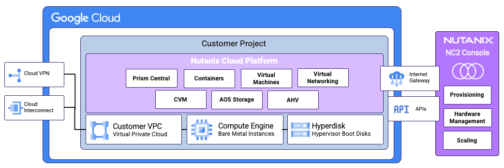
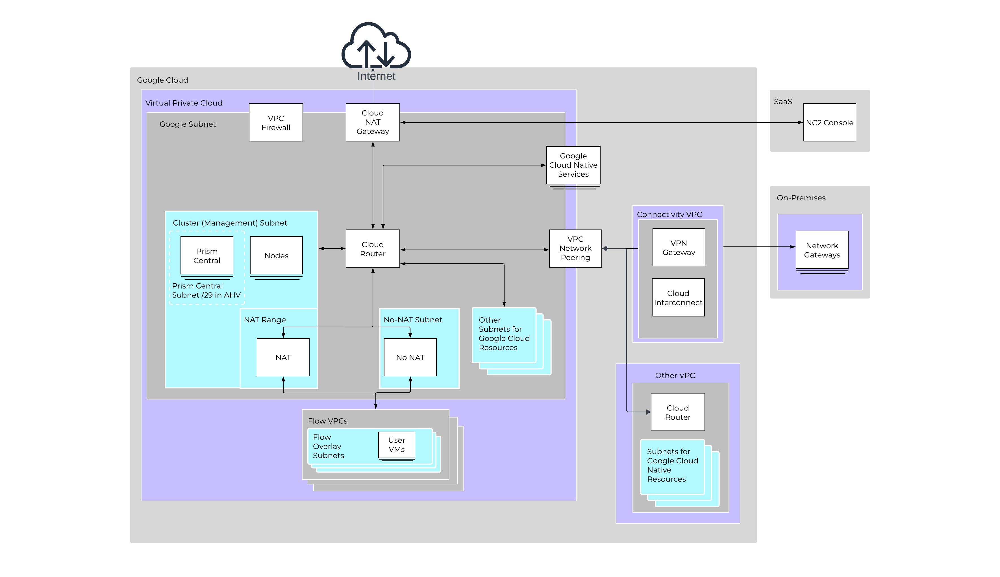

# Nutanix Cloud Clusters (NC2) on Google Cloud

Organizations are increasingly looking to migrate their on-premises virtualized
infrastructure to the public cloud to gain on-demand scalability and access to
powerful cloud services like Vertex AI and BigQuery. This hybrid multicloud
approach also helps shift IT spending from large capital expenditures to a more
predictable operational model. Nutanix Cloud Clusters (NC2) provides the ideal
foundation for this strategy.

NC2 delivers Nutanix's enterprise class data center software (virtualization,
storage, networking, management) via a SaaS console on to Google Cloud Compute
Engine (GCE) Bare metal instances in customer’s Projects and VPC.

NC2 on Google Cloud allows organizations to run their existing applications and
workloads on Google Cloud on the full Nutanix software stack, like they would
on-premises, eliminating the need for application refactoring or rearchitecting,
accelerating migration to the cloud. When combined with Nutanix deployments in
other locations such as data center, edge, and service provider, NC2 can also
provide a consistent operating model across public and private clouds,
simplifying operations and providing flexibility for applications to run where
they need to, when they need to.

Additionally, when migrating from legacy virtualization platforms to Nutanix,
organizations can take advantage of Nutanix's “Move” migration tool at no
additional cost to quickly and seamlessly migrate virtual machines into an NC2
on Google Cloud cluster.

This document is intended for cloud architects, cloud platform administrators,
Nutanix administrators, and virtualization engineers who are considering NC2 on
Google Cloud. The document is intended to provide high level technical
information and assumes that the reader is familiar with common cloud,
virtualization, storage and networking concepts.

## Components of the Nutanix Cloud Clusters with Google Cloud Solution

Nutanix Cloud Clusters (NC2) on Google Cloud integrates Nutanix Cloud Platform
(NCP) with the underlying Google Cloud infrastructure.

_Figure. High-level NC2 on Google Cloud architecture overview — NC2 Console,
Google Cloud VPC, GCE bare‑metal instances running Nutanix AHV, Controller VMs,
Prism Central, Flow Virtual Networking, and connectivity to Google Cloud
services and the NC2 Console._

The solution uses the components described in the following sections.

### Nutanix Cloud Clusters (NC2) Console

The NC2 console is a multicloud control plane used to deploy, manage, expand,
and shrink NC2 clusters in supported public clouds, including Google Cloud.

### Compute Engine bare metal instances

Google Compute Engine (GCE) provides
[bare metal instances](https://docs.cloud.google.com/compute/docs/instances/bare-metal-instances)
on which the NCP solution runs. These bare metal instances appear in the Google
Cloud Console like any other GCE instances and are distinct from the Google
[Bare Metal Solution](https://cloud.google.com/bare-metal/) (BMS). Running on
GCE bare metal simplifies networking integration, capacity planning and access
to other Google Cloud services.

### Nutanix AHV

[Nutanix AHV](https://portal.nutanix.com/page/documents/details?targetId=AHV-Admin-Guide:AHV-Admin-Guide)
is the only virtualization solution supported with NC2. It is a fully
functional, enterprise-ready KVM-based hypervisor that is integrated into NCP
for simplified deployment and management.

Nutanix AHV runs directly on the GCE bare metal instances, providing the
foundation for running VMs and other Nutanix services.

### Nutanix Controller VM (CVM)

The CVM runs the core Nutanix software-defined storage layer
[Nutanix AOS](https://www.nutanix.com/products/nutanix-cloud-infrastructure/distributed-storage)
and cluster-level control plane. Each AHV host has a CVM and uses the bare metal
local SSD to create the AOS storage layer for use by guest VMs and containers.

### Nutanix AOS Storage

The workload storage for NC2 comes from the locally attached
[Titanium SSD](https://docs.cloud.google.com/compute/docs/disks/local-ssd) (NVMe
disks) in the GCE bare metal instances. The CVMs run
[Nutanix AOS](https://www.nutanix.com/products/nutanix-cloud-infrastructure/distributed-storage)
and use the locally attached SSDs to resiliently persist the workload data and
provide a feature-rich set of enterprise data services such as snapshots,
replication, iSCSI presentation, and Container Storage Interface (CSI)
presentation. Each bare metal node also consumes a Google Cloud Hyperdisk volume
that is attached to the bare metal node to run Nutanix AHV.

### Prism Central

[Prism Central](https://portal.nutanix.com/page/documents/details?targetId=Prism-Central-Admin-Center-Guide:Prism-Central-Admin-Center-Guide)
is deployed on the created cluster (unless another Prism Central instance in the
same region is available) as a VM and provides the day-to-day management
interface for workloads on the NC2 instance and Day 2 operations, just as it
does for on-premises clusters.

### Nutanix Flow Virtual Networking

[Nutanix Flow Virtual Networking](https://portal.nutanix.com/page/documents/details?targetId=Nutanix-Flow-Virtual-Networking-Guide:Nutanix-Flow-Virtual-Networking-Guide)
(FVN) is mandatory for NC2 on Google Cloud deployments and is used to simplify
the creation, isolation, and management of software-defined networks for VMs.

### Connectivity

The NC2 cluster (hosts, CVMs, and Prism Central) must have connectivity to the
NC2 Console for management. This connectivity is automatically set up at
deployment and must not be blocked to ensure the normal operation of the
cluster.

## NC2 Console and Deploying Nutanix Cloud Clusters on Google Cloud

You can access the Nutanix Cloud Clusters (NC2) console with your existing
account at [my.nutanix.com](https://my.nutanix.com). You can use the console to
deploy NC2 on Google Cloud and manage tasks like health remediation and
expanding and condensing your clusters. For Day 2 operations, Prism Central can
also manage AOS and AHV upgrades for on-premises, remote or branch office, and
cloud-based Nutanix clusters.

_Figure. Nutanix Cloud Clusters Management: You can use the Nutanix Cloud
Clusters console to provision Nutanix clusters on Google Cloud and use Prism
Central to manage Google Cloud resources._

The NC2 Console connects to the Google Cloud Compute Engine APIs and uses
Service Accounts to orchestrate the building of the NC2 cluster and the ongoing
operations.

The NC2 console provides the following services:

- Obtaining and managing bare metal instances
- Ensuring that you create and use the correct IAM roles for deployment
- Creating virtual private cloud firewall rules to help secure your Google Cloud
  resources
- Monitoring the health of the physical hardware
- Managing node placement strategy and removing or adding nodes based on cluster
  health

You must maintain connectivity between the NC2 instance in Google Cloud and the
NC2 console at all times to ensure that the cluster runs smoothly.

The deployment process for Nutanix Cloud Clusters (NC2) on Google Cloud follows
these high level steps:

1.  Set up or access an active Google Cloud subscription and project.

1.  Configure the necessary Google Cloud APIs and create a Service Account with
    the required IAM roles and permissions.

1.  (Optional) Configure networking in Google Cloud, including a Virtual Private
    Cloud (VPC) and the necessary subnets, or use a VPC created automatically
    during cluster creation.

1.  Create a My Nutanix account and subscribe to the NC2 service.

1.  Add your Google Cloud account to an organization in the NC2 console.

1.  Create a Nutanix Cluster in a new or existing Google Cloud VPC using the NC2
    console.

The NC2 console fully automates the deployment of the NC2 cluster in Google
Cloud, and you can see its progress, including any issues, on the cluster
dashboard. For more information on how to deploy NC2 with Google Cloud, see the
[Nutanix Cloud Clusters on Google Cloud Deployment and User Guide](https://portal.nutanix.com/page/documents/details?targetId=Nutanix-Cloud-Clusters-Google-Cloud:Nutanix-Cloud-Clusters-Google-Cloud).

After you deploy it, an NC2 cluster operates similarly to other Nutanix
clusters:

- Use Nutanix Life Cycle Manager in Prism Central to manage the software life
  cycle on the NC2 cluster.

- Use Prism Central to manage workloads running on the cluster for an
  operational experience consistent with on-premises deployments.

- Use Nutanix Move to migrate VMs from existing environments (ESXi, Hyper-V, or
  on-premises AHV) to NC2 on Google Cloud.

- Manage all cluster hardware life cycle operations—deployment, expansion, and
  node replacements—through the NC2 console.

Unlike datacenter or edge-based Nutanix deployments, NC2 deployments can replace
faulty hardware, potentially in minutes, if the Nutanix software stack detects
an issue.

## Deployment Considerations for NC2 on Google Cloud

Ensure that you have
[sufficient quotas](https://docs.cloud.google.com/docs/quotas/view-manage) to
provision the Google Cloud components and have granted the NC2 console access to
your Google Cloud project.

Ensure that you have reserved sufficient Nutanix licensing entitlements for the
NC2 cluster you provision. For information on licensing NC2 and other Nutanix
products, see
[Nutanix Cloud Platform Software Options](https://www.nutanix.com/products/cloud-platform/software-options).

Sizing your NC2 solution is best completed by using the Nutanix Sizer tool under
the guidance of a Nutanix Systems Engineer or a qualified Nutanix Partner. For
information on the Google Cloud bare metal instances compatible, and which
regions have been qualified for use with NC2 see
[Planning for deployment](https://portal.nutanix.com/page/documents/details?targetId=Nutanix-Cloud-Clusters-Google-Cloud:nc2-clusters-google-cloud-plan-deployment-c.html).

For information about the Nutanix features, capabilities, and products that are
qualified and supported for NC2 on Google Cloud in the General Availability
release, see the
[Compatibility and Interoperability Matrix](https://portal.nutanix.com/page/compatibility-interoperability-matrix/nutanix-cloud-clusters/compatibility).

For the latest information on qualified Nutanix Technology Alliance Partner
software, see the
[Partner Software Validation page](https://portal.nutanix.com/page/compatibility-interoperability-matrix/software)
in the Compatibility and Interoperability Matrix. If you have another technology
to integrate with NC2 on Google Cloud, contact your Nutanix representative.

## NC2 High Availability and Fault Tolerance

Nutanix Cloud Clusters (NC2) clusters are inherently highly resilient. We
recommend sizing Nutanix clusters with n \+ 1 (replication factor 2\) or n \+ 2
(replication factor 3\) resilience so that they can accommodate node failures
without the overall cluster capacity dropping below the design requirement. If a
bare metal node fails, NC2 automatically provisions a new instance from Google
Cloud and adds it to the cluster to restore health and full capacity (n \+ 1 or
n \+ 2\) resilience within minutes.

To ensure high availability, Nutanix uses a placement strategy that distributes
the bare metal nodes across different Availability Domains in a Google Cloud
availability zone. This placement strategy maps to the Nutanix rack-awareness
feature, ensuring that data replicas are written to different Availability
Domains and allowing the cluster to tolerate a physical failure for both
replication factor 2 and 3 scenarios while maintaining data and service
availability.

For more information on planning a deployment, see the
[Nutanix Cloud Clusters on Google Cloud Deployment and User Guide](https://portal.nutanix.com/page/documents/details?targetId=Nutanix-Cloud-Clusters-Google-Cloud:Nutanix-Cloud-Clusters-Google-Cloud).
We recommend that you consult with Nutanix Hybrid Cloud Solutions Architects or
engage Nutanix Professional Services or a qualified Nutanix Services partner.

## Networking for NC2 on Google Cloud

You can deploy Nutanix Cloud Clusters (NC2) on Google Cloud into an existing
Google Cloud Virtual Private Cloud (VPC) and its subnets, or you can create a
VPC and subnets specifically for NC2 in a project at deployment. VMs and
containers running on the cluster can connect to the internet, native Google
Cloud services, and on-premises datacenters using WAN networking (virtual
private network, Google Cloud Router, Multiprotocol Label Switching).

NC2 on Google Cloud requires Nutanix Flow Virtual Networking and does not
support native VLAN-type networking. Flow Virtual Networking is a
software-defined networking solution that abstracts the underlying Google Cloud
network, providing a consistent networking model that works seamlessly with
on-premises Nutanix deployments. Flow Virtual Networking simplifies the
creation, isolation, and management of networks for user VMs. It requires Prism
Central as its control plane.

Flow Virtual Networking for NC2 on Google Cloud has the following capabilities:

- Flow Virtual Networking creates an overlay network for user VMs, allowing you
  to create virtual networks (VPCs) and subnets in Prism Central independent of
  the underlying Google Cloud network topology.

- Flow Virtual Networking provides a unified networking experience across
  on-premises and Google Cloud environments, simplifying hybrid connectivity and
  policy management.

- For communication between user VMs on different physical hosts, the overlay
  network uses Geneve encapsulation.

- User VMs can connect to external Google Cloud networks, the internet, and
  native Google Cloud services, such as Google Kubernetes Engine (GKE) and
  BigQuery.

- You can provision user VMs to a network regardless of network address
  translation (NAT). If you wish to use NAT external (to the NC2 cluster)
  connectivity, floating IP addresses can be assigned to facilitate inbound
  connectivity to VMs.

_Figure: Flow Virtual Networking for NC2 on Google Cloud Architecture Overview:
High-level overview of Flow Virtual Networking for the Nutanix Cloud Clusters on
Google Cloud solution._

### NC2 Network Diagram Component Descriptions

**Google Cloud** \- Represents the Google Cloud customer Project

**Virtual Private Cloud (VPC)** \- The Google Cloud VPC in which the NC2 cluster
is deployed hitherto referred to as the “The Cluster VPC”. This is distinct from
some of the other VPCs in the diagram that are Nutanix Flow VPCs within the
Nutanix Flow Virtual Networking (FVN or just Flow) overlay.

**Google Subnet** \- A native Google Cloud subnet as distinct from a Nutanix FVN
overlay subnet.

**VPC Firewall** \- A Google Cloud VPC firewall is a distributed, stateful,
virtual firewall that regulates traffic to and from your Compute Engine
instances and in and out of the NC2 cluster.

**Cloud NAT Gateway** \- The North / South network traffic internet ingress and
egress is via the Cloud NAT Gateway including the communications between the NC2
cluster and the NC2 Console.

**Google Cloud Native Services** \- Services can be accessed over the internet
or via one or more of the
[VPC Private Access Options](https://docs.cloud.google.com/vpc/docs/private-access-options).

**Cloud Router** \- The overall network traffic router for the Google Cloud VPC.

**Cluster (Management) Subnet** \- A Google Cloud native subnet within the
Cluster VPC in which the bare metal nodes are deployed, as well as Prism Central
and the NAT range.

**Nodes** \- Compute Engine bare metal instances, i.e. server hardware used as
“Nutanix Nodes”.

**Prism Central** \- The Nutanix multi-cluster control plane, required for the
first NC2 cluster in a Google Cloud region, subsequent clusters can use the
first Prism Central or can have their own.

**Prism Central Subnet** \- A /29 range within Cluster Management Subnet that’s
reserved for Prism Central VMs and VIP.

**NAT Range** \- A Secondary IP range within the Cluster Management (Google
Cloud) Subnet used for the FVN networking Transit VPC. It is used to assign SNAT
IPs to Flow VPCs and Floating IPs to VMs exposed to the Google Network.

**No-Nat Subnet** \- An IP subnet within the Google Cloud VPC used for the Flow
networking Transit VPC. This IP range is configured within the Nutanix NC2
Console at deployment.

Both of the above IP ranges need to be configured within the Nutanix NC2 Console
at deployment. If using an automatically created VPC the subnets will be created
by the NC2 Console. If deploying into an existing VPC, they will need to be
manually pre-created through the Google Cloud Console and then configured in the
NC2 Console.

**Flow VPCs** \- Flow VPCs are Virtual Private Clouds within the Flow Virtual
Networking (FVN) overlay networking that is mandatory when using NC2 on Google
Cloud (instead of using “VLAN” type networking). These Flow VPCs host the User
VM subnets within the NC2 solution.

**Other Subnets** **for Google Cloud resources** \- Subnets within “The Cluster
VPC” can host a range of other compute engine instances and other google cloud
services via Private Google Access (PGA), Private Service Access (PSA) or
Private Service Connect (PSC) into your VPC.

**VPC Network Peering \-** The Cluster VPC can be attached to other Google Cloud
VPCs via a VPC Peering. It can also connect back to on premises or edge
environments. It is recommended that connectivity to external, non google cloud
environments is via a dedicated “Connectivity VPC” in Google Cloud.

## Procurement and Licensing for NC2 on Google Cloud

You can procure the Nutanix Cloud Infrastructure (NCI) software licenses
Necessary to run on Google Cloud through the following channels:

- **Google Cloud Marketplace**: You can purchase Nutanix Software term licenses
  through the
  [Google Cloud Marketplace](https://console.cloud.google.com/marketplace/product/ntnx-prod-marketplace/ntnx-sw-licenses),
  potentially taking advantage of existing Google Cloud spend commitments.
- **Bring Your Own Licenses (BYOL)**: Bring existing Nutanix software
  entitlements used for on-premises deployments to NC2 on Google Cloud NC2 or
  purchase new Nutanix subscriptions through a Nutanix resale partner.
- **NC2 billing console**: Purchase overages and pay-as-you-go licensing through
  the NC2 billing console.

For more information on licensing NC2 and other Nutanix products, see
[Nutanix Cloud Platform Software Options](https://www.nutanix.com/products/cloud-platform/software-options).

## References

- [Google Cloud Marketplace listing](https://console.cloud.google.com/marketplace/product/ntnx-prod-marketplace/ntnx-sw-licenses)
- [Google Partner Page: Nutanix](https://cloud.google.com/find-a-partner/partner/nutanix-inc)
- NC2 on Google Cloud
  [Nutanix User Guide](https://portal.nutanix.com/page/documents/details?targetId=Nutanix-Cloud-Clusters-Google-Cloud:Nutanix-Cloud-Clusters-Google-Cloud)
- [Test Drive](https://cloud.nutanixtestdrive.com/login?type=nc2gcp) \-
  Experience NC2 on Google Cloud for yourself
- [Nutanix NC2 on Google Cloud Announcement Blog](http://nutanix.com/blog/announcing-nutanix-cloud-clusters-nc2-on-google-cloud)
- [Google Cloud Announcement Blog](https://urldefense.proofpoint.com/v2/url?u=https-3A__cloud.google.com_blog_topics_partners_nutanix-2Dnc2-2Dgenerally-2Davailable-2Dgoogle-2Dcloud&d=DwMFaQ&c=s883GpUCOChKOHiocYtGcg&r=NuyjJL7o-WqXBVvXhGEGy7vgNBdMUZkT0L_LWKRx_d8&m=8OqOfmpcA684UAMEhKr-H8HbHkfiy4IPj0S3qxcmoLiAJN6yFPDGqleWlUCLIZ0S&s=PVutNzHX1ttDVPhhpVxzxZc4AVIvrNBoxlxEIEYe910&e=)
- [Nutanix.com NC2 on Google Cloud page](https://www.nutanix.com/products/nutanix-cloud-clusters/google-cloud)
- [Hardware Spec Sheet](https://www.nutanix.com/products/hardware-platforms/specsheet?platformProvider=NC2%20on%20Google%20Cloud)
  \- Nutanix compatible Hardware Spec sheets including GCE bare metal
- [Getting Started with NC2 on Google Cloud video](https://youtu.be/i1WLeWV-16I?si=cpj_mOhJzRzcA2A-)
