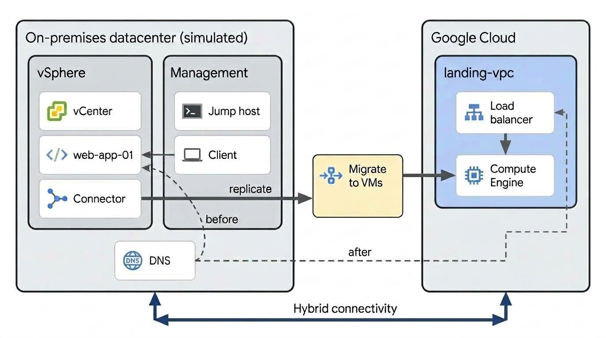

# Migrate VMware workload to Compute Engine using Cloud DNS cutover

Migrate an enterprise workload running on VMware vSphere to Compute Engine on
Google Cloud using
[Migrate to Virtual Machines](https://cloud.google.com/migrate/virtual-machines/docs/5.0)
(M2VM).

## Architecture

When you finish this guide, the migrated instance serves all traffic through an
external load balancer in the target project, and the source workload no longer
serves traffic:



To reach this state, you deploy the target landing zone with Terraform,
replicate the workload with Migrate to Virtual Machines, then shift traffic by
updating a Cloud DNS record. The source environment matches the one you built in
[Set up the source environment](../source/README.md).

## Prerequisites and requirements

Before you follow this guide, complete the following prerequisites:

1.  **Source environment running:** Complete all steps in
    [Set up the source environment](../source/README.md) to provision the
    vSphere source environment, deploy `linux-bastion`, and run `web-app-01`.
1.  **Create a target Google Cloud project (`TARGET_PROJECT_ID`):** A dedicated
    Google Cloud project for your destination landing zone.
1.  **Google Cloud CLI (gcloud):** Configured and authenticated on your local
    workstation.
1.  **Terraform:** Version 1.15.5 or later installed.

### Permissions

Ensure your account has the following Identity and Access Management (IAM)
roles:

- **In `TARGET_PROJECT_ID`:**
    - `roles/compute.admin`
    - `roles/vmmigration.admin`
    - `roles/iam.serviceAccountAdmin`
    - `roles/resourcemanager.projectIamAdmin`
    - `roles/serviceusage.serviceUsageAdmin`
    - `roles/orgpolicy.policyAdmin`
- **In `SOURCE_PROJECT_ID`:**
    - `roles/dns.admin` (Required to update the authoritative Cloud DNS A-record
      during traffic cutover)
    - `roles/compute.networkAdmin` (Required to establish Virtual Private Cloud
      (VPC) Network Peering from the source bastion network)

## Set up your environment

Authenticate your local workstation tools, load environment variables, and
verify that the source VMware workload is serving traffic before starting the
migration:

1.  Authenticate the Google Cloud CLI and set up Application Default Credentials
    (ADC) for Terraform:

    ```bash
    gcloud auth login
    gcloud auth application-default login
    ```

1.  Load your environment variables from `env.sh` (created in
    [Set up the environment](../source/README.md#set-up-the-environment)) and
    set the active `gcloud` project:

    ```bash
    source env.sh
    gcloud config set project ${TARGET_PROJECT_ID}
    ```

    Run `source env.sh` in any additional terminal window that you open while
    following this guide to load the environment variables into your shell
    session.

1.  Verify that the source VMware workload is healthy and serving traffic:

    ```bash
    curl "http://$(terraform -chdir=source/infra output -raw web_app_public_ip)"
    ```

    The command returns the response from the active VMware workload:

    ```json
    {"message": "Hello World"}
    ```

## Assess the source environment

Assess your source data center inventory and evaluate the Total Cost of
Ownership (TCO) for migrating to Compute Engine.

### Access the vSphere Client and inspect the source workload

Launch Google Chrome with isolated host resolver rules to access the vSphere
Client and inspect the source workload:

1.  Retrieve the administrator password for vCenter:

    ```bash
    gcloud vmware private-clouds vcenter credentials describe \
      --private-cloud=demo-pc-v2 \
      --location=${ZONE} \
      --project=${SOURCE_PROJECT_ID} \
      --username=CloudOwner@gve.local \
      --format="value(password)"
    ```

1.  Launch an isolated Google Chrome browser instance that routes requests for
    the vCenter fully qualified domain name (FQDN) to its external public IP:

    ```bash
    google-chrome \
      --user-data-dir="/tmp/vcenter-browser" \
      --host-resolver-rules="MAP $(terraform -chdir=source/infra output -raw vcenter_fqdn) $(terraform -chdir=source/infra output -raw vcenter_public_ip)" \
      --ignore-certificate-errors \
      "https://$(terraform -chdir=source/infra output -raw vcenter_fqdn)"
    ```

1.  In the browser window, click **LAUNCH VSPHERE CLIENT** and sign in:
    - **Username:** `CloudOwner@gve.local`
    - **Password:** Enter the password that you retrieved earlier.

1.  In the left navigation pane, select **Hosts and Clusters** and select the
    management cluster (`demo-pc-v2-mgmt`) or folder (`Workload VMs`).

1.  Select the **VMs** tab to inspect `web-app-01`. Note its provisioned
    hardware specifications:
    - **vCPU:** 2
    - **Memory:** 2 GB
    - **Provisioned Storage:** ~20 GB (0.02 TiB)
    - **IP Address:** 10.10.20.15

1.  Click the table **Export** icon in the VMs view, choose **Export to CSV**,
    and save `vsphere_inventory.csv` to your workstation. Keep this browser tab
    open for deploying the Migrate Connector later in this guide.

### Estimate TCO with Gemini in Migration Center

Evaluate the Total Cost of Ownership (TCO) for migrating your VMware workload to
Compute Engine using the Gemini-assisted Migration Center estimator:

#### Initialize Migration Center

1.  In the Google Cloud console for `TARGET_PROJECT_ID`, navigate to
    [Migration Center](https://console.cloud.google.com/migration/overview).
1.  Click **Get Started**.
1.  Configure the initial onboarding settings:
    - **Region:** `us-central1`
    - **Account:** Select **Add custom account** and enter `TEST`.
    - **Opportunity:** Select **Add custom opportunity** and enter `TEST`.
1.  Click **Next**, then click **Continue**.

#### Generate a quick TCO estimate

1.  On the Migration Center **Overview** page, locate the banner: _A first look
    at the new Gemini-assisted Migration Center_.
1.  Click **Try now** to navigate to the Gemini-assisted migration workspace.
    Alternatively, navigate directly to
    [Gemini-assisted migration](https://console.cloud.google.com/migration-ai).
1.  On the **Quick TCO estimator** tile, click **Open**.
1.  Click **Create new estimate**.
1.  Under **Basic details**:
    - **Estimate name:** `migrate-vmware-to-gce-estimate`
    - Click **Next**.
1.  Under **Source workload**, enter the specifications verified from the
    vSphere inventory:
    - **Provisioned VMs:** `1`
    - **Provisioned vCPU:** `2`
    - **Provisioned RAM (GB):** `2`
    - **Provisioned storage (TiB):** `0.02`
    - Click **Next**.
1.  Under **Compute Engine configuration**:
    - **Region:** `us-west2`
    - **Machine family:** `General-purpose`
    - **Machine series:** `E2`
    - **Disk family:** `PD Balanced`
    - Click **Next**.

#### Analyze with Gemini and export artifacts

1.  Review the generated estimate tabs: **Summary**, **Technical breakdown**,
    and **Pricing breakdown**.
1.  In the interactive Gemini chat panel, click one of the suggested prompt
    options:
    - _How can I optimize my cloud costs?_
    - _Explain the Committed Use Discount (CUD) plan details_
1.  Review Gemini's cost optimization recommendations and commitment discount
    breakdown.
1.  Click **Artifacts** in the top navigation bar.
1.  Click **Create Sheet**, then open the generated Google Sheet to review the
    detailed estimate offline.

## Deploy landing infrastructure

Deploy the destination landing zone, including the target VPC network, outbound
gateway, external load balancer, and hybrid network peering.

In this demo environment, Terraform establishes VPC Network Peering between
`landing-vpc` and `bastion-vpc` to simulate hybrid connectivity. In an
on-premises migration, connect your data center to Google Cloud using
[Cloud Interconnect](https://cloud.google.com/network-connectivity/docs/interconnect)
or
[Cloud VPN (HA VPN)](https://cloud.google.com/network-connectivity/docs/vpn/concepts/overview)
with [Cloud Router](https://cloud.google.com/network-connectivity/docs/router)
for dynamic BGP route exchange.

`landing-subnet` reuses `10.10.20.0/24`, the same CIDR as the source workload
segment, so `web-app-01` keeps its `10.10.20.15` address across the migration.
The instance group starts empty. You add the migrated instance to it after
cutover, so the load balancer serves no traffic until that step.

> [!WARNING]
>
> To allow the migrated BIOS workload to boot, receive an external IP address if
> needed, authenticate the Migrate Connector, and establish VPC Network Peering,
> this configuration modifies four organization policy constraints in the target
> project: `compute.vmExternalIpAccess`, `compute.requireShieldedVm`,
> `iam.disableServiceAccountKeyCreation`, and `compute.restrictVpcPeering`. Use
> a dedicated demo project, and restore the constraints when you finish.

1.  Source `env.sh` and apply the landing zone configuration:

    ```bash
    source env.sh
    terraform -chdir=dns-cutover/terraform init
    terraform -chdir=dns-cutover/terraform apply \
      -var="target_project_id=${TARGET_PROJECT_ID}" \
      -var="source_project_id=${SOURCE_PROJECT_ID}" \
      -var="region=${REGION}" \
      -var="zone=${ZONE}" \
      -auto-approve
    ```

## Deploy and register the Migrate Connector

Deploy the Migrate Connector appliance in vCenter and register it with Migrate
to Virtual Machines in `TARGET_PROJECT_ID`.

### Deploy the OVF template in vCenter

In the active vSphere Client browser session, deploy the Migrate Connector
appliance into the source vSphere environment:

1.  Display your Google Cloud compute public key, which you need for the next
    step:

    ```bash
    cat ~/.ssh/google_compute_engine.pub
    ```

1.  In the vSphere inventory pane, right-click the compute cluster
    (`demo-pc-v2-mgmt`) and select **Deploy OVF Template**.

1.  In the deployment wizard, select **URL** and enter the public Google Cloud
    Storage URL for the Migrate Connector OVA:

    ```text
    https://storage.googleapis.com/vmmigration-public-artifacts/migrate-connector-2-8-2977.ova
    ```

    Because Google Cloud VMware Engine (GCVE) communicates with Cloud Storage
    over Google's internal network backbone, vCenter streams the 1.1 GB
    appliance directly in approximately 20 to 30 seconds without uploading
    across your local workstation connection.

1.  Click **Next** and configure the deployment wizard settings:
    - **Virtual machine name:** `m2vm-connector`
    - **Folder:** `Workload VMs`
    - **Compute resource:** `demo-pc-v2-mgmt`
    - **Storage:** `vsanDatastore` (Thin Provision)
    - **Destination network:** `demo-workload`
    - **Public keys:** SSH public key from
      `cat ~/.ssh/google_compute_engine.pub`
    - **Google API address:** `Public`
    - **IP address:** `10.10.20.10`
    - **Netmask:** `255.255.255.0`
    - **Default gateway:** `10.10.20.1`
    - **DNS server:** `192.168.0.234`

1.  Click **NEXT** > **FINISH**. Monitor the **Recent Tasks** pane in vCenter
    until the import completes.

1.  In vCenter, right-click `m2vm-connector` and select **Power** > **Power
    On**. Verify network and SSH reachability through `linux-bastion`:

    ```bash
    source env.sh
    gcloud compute ssh linux-bastion \
      --zone="${ZONE}" \
      --project="${SOURCE_PROJECT_ID}" \
      --tunnel-through-iap \
      -- nc -zv -w 2 10.10.20.10 22
    ```

    Expected output:

    ```text
    Connection to 10.10.20.10 22 port [tcp/ssh] succeeded!
    Connection to compute.3564745781220135743 closed.
    ```

### Register the connector with Migrate to Virtual Machines

Register the connector appliance with Migrate to Virtual Machines and connect it
to vCenter so it can discover and replicate your source workloads:

1.  Initiate a password reset for `solution-user-01@gve.local` (GCVE creates
    solution user accounts dormant without initial passwords), wait until the
    operation completes, and generate an Application Default Credentials (ADC)
    access token:

    ```bash
    source env.sh
    gcloud vmware private-clouds vcenter credentials reset \
      --private-cloud=demo-pc-v2 \
      --location=${ZONE} \
      --project=${SOURCE_PROJECT_ID} \
      --username=solution-user-01@gve.local \
      --no-async

    VCENTER_PWD=$(gcloud vmware private-clouds vcenter credentials describe \
      --private-cloud=demo-pc-v2 \
      --location=${ZONE} \
      --project=${SOURCE_PROJECT_ID} \
      --username=solution-user-01@gve.local \
      --format="value(password)")
    M2VM_TOKEN=$(gcloud auth application-default print-access-token)

    echo "vCenter password: ${VCENTER_PWD}"
    echo "Access token:     ${M2VM_TOKEN}"
    ```

1.  Open a new terminal session and connect to `m2vm-connector` over SSH using
    `linux-bastion` as a proxy:

    ```bash
    source env.sh
    ssh -i ~/.ssh/google_compute_engine -o ProxyCommand="gcloud compute ssh linux-bastion --zone=${ZONE} --project=${SOURCE_PROJECT_ID} --tunnel-through-iap --command='nc %h %p'" admin@10.10.20.10
    ```

1.  In the appliance shell, start the registration CLI:

    ```bash
    m2vm register
    ```

1.  Provide the configuration parameters when prompted:
    - **vCenter host IP:** `192.168.0.2`
    - **vSphere thumbprint:** Verify and enter `Y`
    - **vCenter username:** `solution-user-01@gve.local`
    - **vCenter password:** Paste the value of `${VCENTER_PWD}` from the other
      terminal window where you ran the previous command.
    - **Google Cloud access token:** Paste the value of `${M2VM_TOKEN}` from the
      other terminal window where you ran the previous command.
    - **Target project:** Select your `TARGET_PROJECT_ID`.
    - **Region:** `us-west2`
    - **Source name:** `vsphere-source`
    - **Enter the KMS key:** Press Enter to use the default Google-managed
      encryption.
    - **Appliance service account:** Select `m2vm-connector-sa`

1.  Verify the connector registration:

    ```bash
    m2vm status
    ```

    Example output:

    ```text
    Appliance connectivity and health:
    Migrate Connector appliance health: Healthy
    Appliance version: 2.8.2977
    Proxy setting: not enabled
    DNS: 192.168.0.234
    Gateway: 10.10.20.1
    Google API connection type: Public
    Cloud APIs network connection: Reachable

    VM Migration service:
    Registered with VM Migration service: True
    Connectivity to VM Migration service: True
    Project: TARGET_PROJECT_ID
    Location: us-west2
    Source name: vsphere-source
    Data center connector name: vsphere-source-dybulw
    Migrate Connector service account: m2vm-connector-sa@TARGET_PROJECT_ID.iam.gserviceaccount.com

    On-Prem environment:
    vCenter address: 192.168.0.2
    vSphere user name is: solution-user-01@gve.local

    Max upload rate:
    Unlimited
    ```

1.  In the Google Cloud console, navigate to **Migrate to Virtual Machines** >
    **Sources**, and verify that `vsphere-source` reports a status of
    **Connected**.

> [!NOTE]
>
> If you ever re-run `m2vm register` on an existing appliance, such as to switch
> target projects or refresh expired credentials, Migrate to Virtual Machines
> generates a new connector UUID. You must delete any existing migration objects
> in the console and re-add them under **Sources** > **vsphere-source** > **Add
> migration**.

## Migrate and cutover

Migrate the workload to Compute Engine and execute the cutover. The cutover
includes a brief planned maintenance window while Migrate to Virtual Machines
shuts down the source VM for final delta replication.

### Replicate the workload to Compute Engine

Configure continuous disk replication from the VMware source VM to Compute
Engine in your target project. Complete all steps in this section in the Google
Cloud console:

1.  Navigate to **Migrate to Virtual Machines** > **Sources**.
1.  Select `web-app-01` and click **Add migration** > **VM migration** >
    **Confirm**.
1.  Navigate back to the **Migrating VMs** tab, select `web-app-01`, and click
    **Edit target details**:
    - **General** tab:
        - **Target project:** Select `${TARGET_PROJECT_ID}`
        - **Target VM name:** `web-app-01`
        - **Zone:** Select `${ZONE}` (`us-west2-a`)
    - **Machine configuration** tab:
        - **Machine configuration** section:
            - **Series:** `E2`
            - **Machine type:** `e2-medium`
        - **Management** section:
            - **On host maintenance:** `Migrate VM instance`
            - **Automatic restart:** `On`
    - **Networking** tab:
        - Edit the network interface:
            - **Network:** `landing-vpc`
            - **Subnetwork:** `landing-subnet`
            - **Internal IP:** Select **Custom** and enter `10.10.20.15`
            - **External IP:** `None`
    - **Additional configuration** tab:
        - **Service account:** Select
          `web-app-01-sa@${TARGET_PROJECT_ID}.iam.gserviceaccount.com`
1.  Click **Save**.
1.  Select `web-app-01` and click **Migration** > **Start replication**.
1.  Wait for replication status on the **Replication history** tab to show
    **Active (Idle)**.

### Test the migration with a test clone

Validate the migrated application and network connectivity in the target VPC
without affecting the active source workload by deploying a test clone:

1.  In the Google Cloud console, navigate to the **Migrating VMs** tab, select
    `web-app-01`, and click **Test-Clone**.
1.  Confirm the prompt and wait approximately 2 to 3 minutes until the status
    displays **Clone completed** (**Test-Clone Succeeded**).
1.  In your local terminal, verify that the cloned Compute Engine instance is
    running in the target project with its assigned internal IP (`10.10.20.15`):

    ```bash
    source env.sh
    gcloud compute instances list --project=${TARGET_PROJECT_ID}
    ```

1.  Verify private network reachability to the test clone by curling its
    internal IP from `demo-client`. Because `bastion-vpc` routes `10.10.20.0/24`
    across VPC peering to `landing-vpc`, this verifies the Compute Engine
    instance in `TARGET_PROJECT_ID`. The active source VM accepts external
    traffic only on its public IP:

    ```bash
    gcloud compute ssh demo-client \
      --zone=${ZONE} \
      --project=${SOURCE_PROJECT_ID} \
      --tunnel-through-iap \
      -- curl -s http://10.10.20.15/
    ```

    The command returns the response from the application running on the test
    clone:

    ```json
    {"message": "Hello World"}
    ```

1.  Delete the test-clone instance in Compute Engine to free the instance name
    and IP before cutover:

    ```bash
    gcloud compute instances delete web-app-01 \
      --zone=${ZONE} \
      --project=${TARGET_PROJECT_ID} \
      --quiet
    ```

### Execute workload cutover

Perform the final cutover by shutting down the source VM, executing a delta
synchronization, deploying the production Compute Engine instance, and switching
Cloud DNS traffic to the load balancer:

1.  Open a new terminal window, run `source env.sh`, and stream responses from
    `demo-client`:

    ```bash
    source env.sh
    gcloud compute ssh demo-client \
      --zone="${ZONE}" \
      --project="${SOURCE_PROJECT_ID}" \
      --tunnel-through-iap \
      -- tail -f /var/log/demo-watch.log
    ```

    The continuous watcher polls `www.vmware-demo.example.com` every two
    seconds. The output confirms that client traffic resolves to the source
    VMware workload's public IP:

    ```text
    18:16:38  www.vmware-demo.example.com -> 34.94.250.150   {"message": "Hello World"} (0.042s)
    18:16:40  www.vmware-demo.example.com -> 34.94.250.150   {"message": "Hello World"} (0.039s)
    18:16:43  www.vmware-demo.example.com -> 34.94.250.150   {"message": "Hello World"} (0.041s)
    ```

    Keep this terminal window open alongside your browser during cutover to
    monitor the traffic transition in real time.

1.  In the Google Cloud console, navigate to **Migrate to Virtual Machines** >
    **Migrating VMs**.
1.  Select `web-app-01`, click **Cut over**, and confirm the prompt.
1.  Wait approximately 2 to 4 minutes until the migration status displays
    **Cutover completed** (**Cutover succeeded**), and verify that `web-app-01`
    appears in Compute Engine with status **RUNNING**.
1.  In your initial terminal window (not the streaming window), attach
    `web-app-01` to the unmanaged instance group:

    ```bash
    gcloud compute instance-groups unmanaged add-instances web-app-group \
      --zone="${ZONE}" \
      --instances=web-app-01 \
      --project="${TARGET_PROJECT_ID}"
    ```

1.  Verify that the load balancer backend reports `HEALTHY`:

    ```bash
    gcloud compute backend-services get-health web-app-backend \
        --region=${REGION} \
        --project=${TARGET_PROJECT_ID} \
        --format="value(status.healthStatus[0].healthState)"
    ```

1.  Update the authoritative Cloud DNS A-record in the source project to the
    load balancer frontend IP:

    ```bash
    gcloud dns record-sets update www.vmware-demo.example.com. \
      --zone=vmware-demo-zone \
      --type=A \
      --ttl=10 \
      --rrdatas=$(terraform -chdir=dns-cutover/terraform output -raw lb_public_ip) \
      --project=${SOURCE_PROJECT_ID}
    ```

1.  In the streaming watcher terminal window, observe the planned cutover
    maintenance window and the subsequent transition to the load balancer IP:

    ```text
    ....
    20:55:37  www.vmware-demo.example.com -> 34.94.250.150   {"message": "Hello World"} (0.042s)
    20:55:39  www.vmware-demo.example.com -> 34.94.250.150   (no response)
    ...
    21:09:59  www.vmware-demo.example.com -> 34.20.130.98   {"message": "Hello World"} (0.012s)
    ...
    ```

    The period of `(no response)` reflects the planned maintenance window during
    which Migrate to Virtual Machines shuts down the source VM to ensure storage
    consistency during final delta replication. Because the DNS TTL is 10
    seconds, traffic resumes within seconds after the DNS record updates.

    For workloads that require a minimal-downtime cutover without a maintenance
    window, see the
    [Hybrid connectivity network endpoint groups overview](https://cloud.google.com/load-balancing/docs/negs/hybrid-neg-concepts).

## Decommission the source workload

The source environment still exists. Migrate to Virtual Machines stopped
`web-app-01` but did not delete it, and the Migrate Connector keeps running
until you remove it. Both continue to incur cost, so decommission them once you
finish validating the migration.

To remove the source environment, follow
[Clean up the source environment](../source/README.md#clean-up-the-source-environment).

Keep the source environment running if you plan to repeat the migration. To
rerun it, restore the source VM and start a new replication cycle rather than
rebuilding the vSphere environment.

## Optimize the migrated environment

To optimize your Compute Engine workloads after migration, see the following
Google Cloud guidance:

- **Observability and monitoring:** See the Cloud Architecture Center guide
  [Monitor everything](https://cloud.google.com/architecture/migration-to-google-cloud-optimizing-your-environment#monitor_everything),
  and deploy the
  [Google Cloud Ops Agent](https://cloud.google.com/monitoring/agent/ops-agent)
  for sub-minute memory, disk I/O, and application log collection.
- **Rightsizing:** See the Cloud Architecture Center guide
  [Reduce resource costs](https://cloud.google.com/architecture/migration-to-google-cloud-minimize-costs#reduce_costs),
  and use Active Assist to
  [apply machine type recommendations for VM instances](https://cloud.google.com/compute/docs/instances/apply-machine-type-recommendations-for-instances)
  after establishing baseline production traffic.
- **Discounts and commitments:** See
  [Cost management in Google Cloud](https://cloud.google.com/architecture/migration-to-google-cloud-optimizing-your-environment#cost_management),
  and review options for
  [Committed use discounts (CUDs)](https://cloud.google.com/compute/docs/instances/signing-up-committed-use-discounts)
  and automatic
  [Sustained use discounts (SUDs)](https://cloud.google.com/compute/docs/sustained-use-discounts).

## Clean up target landing infrastructure

Destroy the target landing infrastructure when testing is complete:

1.  Remove `web-app-01` from the unmanaged instance group:

    ```bash
    source env.sh
    gcloud compute instance-groups unmanaged remove-instances web-app-group \
      --zone=${ZONE} \
      --instances=web-app-01 \
      --project=${TARGET_PROJECT_ID} \
      --quiet
    ```

1.  Delete the cutover VM instance:

    ```bash
    gcloud compute instances delete web-app-01 \
      --zone=${ZONE} \
      --project=${TARGET_PROJECT_ID} \
      --quiet
    ```

1.  Destroy the landing infrastructure using Terraform:

    ```bash
    terraform -chdir=dns-cutover/terraform destroy \
      -var="target_project_id=${TARGET_PROJECT_ID}" \
      -var="source_project_id=${SOURCE_PROJECT_ID}" \
      -var="region=${REGION}" \
      -var="zone=${ZONE}" \
      -auto-approve
    ```

1.  After tearing down the target environment, tear down the source private
    cloud and networking by completing the steps in
    [Clean up the source environment](../source/README.md#clean-up-the-source-environment).
