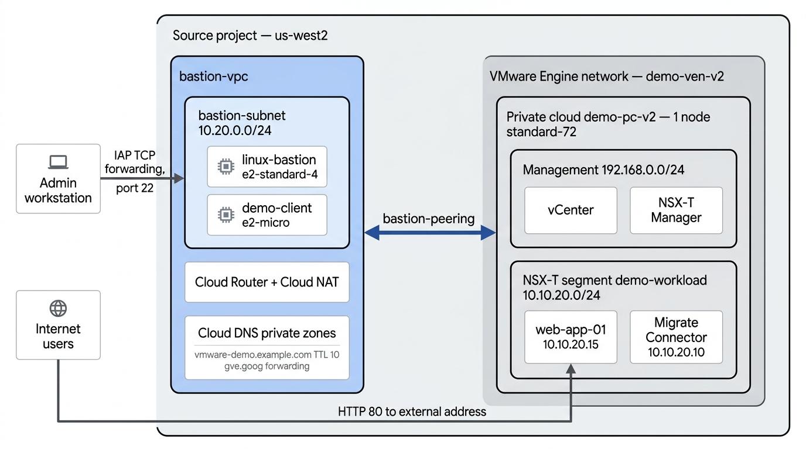
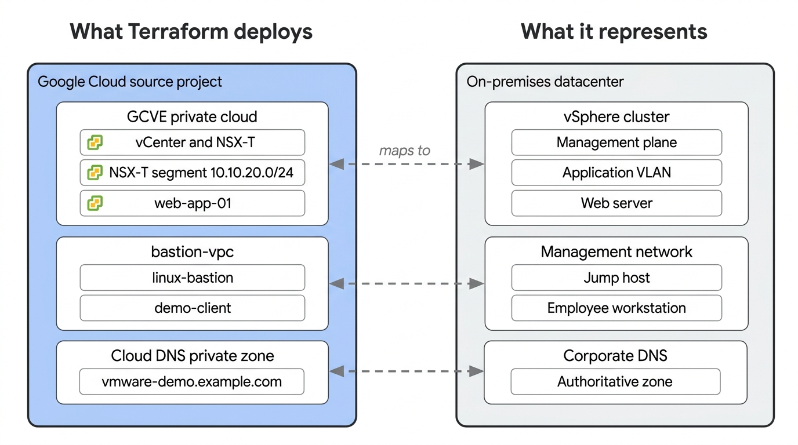

# Set up the source environment (mock on-premises data center)

Deploy a single-node
[Google Cloud VMware Engine](https://cloud.google.com/vmware-engine/docs) (GCVE)
private cloud to create a mock on-premises data center. This environment
includes a VMware NSX-T overlay network, a Linux jump host for management
access, a continuous DNS watcher client (`demo-client`), private Cloud DNS, and
a sample NGINX workload (`web-app-01`).

## Architecture

Terraform deploys the following infrastructure in the source project. The
migration guide adds the Migrate Connector to the workload segment later:



This environment stands in for a traditional on-premises data center. The
migration guide refers to the components by their on-premises names, so use the
following mapping to translate between them:



## Prerequisites and requirements

Before provisioning the source environment, verify that you have the following:

- **Google Cloud project (`SOURCE_PROJECT_ID`):** A dedicated project with
  billing enabled.
- **Google Cloud VMware Engine quota:** Minimum quota for **1 node** of type
  `standard-72` in your target zone, such as `us-west2-a`.
- **Google Cloud CLI (gcloud):** Configured and authenticated on your local
  workstation.
- **Terraform:** Version 1.15.5 or later installed.

### Permissions

Ensure your account has the following Identity and Access Management (IAM) roles
in `SOURCE_PROJECT_ID`:

- `roles/vmwareengine.admin`
- `roles/compute.admin`
- `roles/dns.admin`
- `roles/serviceusage.serviceUsageAdmin`
- `roles/resourcemanager.projectIamAdmin`
- `roles/iam.roleAdmin` (Terraform creates a custom role that lets the bastion
  read vCenter and NSX-T credentials)
- `roles/orgpolicy.policyAdmin`
- `roles/compute.osLoginExternalUser` (Required when authenticating from an
  external organization or domain)

## Provision the source infrastructure

Enable the required Google Cloud APIs and deploy the GCVE private cloud, Virtual
Private Cloud (VPC) network, jump host, and demo client using Terraform.

### Set up the environment

1.  Clone the repository with sparse checkout and navigate to the project root
    directory:

    ```bash
    git clone --filter=blob:none --no-checkout https://github.com/GoogleCloudPlatform/cloud-solutions.git
    cd cloud-solutions
    git sparse-checkout set --cone projects/migrate-vmware-to-gce
    git checkout
    cd projects/migrate-vmware-to-gce
    ```

    If you already cloned the repository, navigate to the project directory:

    ```bash
    cd projects/migrate-vmware-to-gce
    ```

1.  Authenticate the Google Cloud CLI and set up Application Default Credentials
    (ADC) for Terraform:

    ```bash
    gcloud auth login
    gcloud auth application-default login
    ```

1.  Set the environment variables for your source and target projects:

    ```bash
    export SOURCE_PROJECT_ID="<your-source-project-id>"
    export TARGET_PROJECT_ID="<your-target-project-id>"
    export REGION="us-west2"
    export ZONE="us-west2-a"
    ```

1.  Write the variables to `env.sh`, load them into your shell session, and
    configure the default `gcloud` project:

    ```bash
    {
      echo "export SOURCE_PROJECT_ID=\"${SOURCE_PROJECT_ID}\""
      echo "export TARGET_PROJECT_ID=\"${TARGET_PROJECT_ID}\""
      echo "export REGION=\"${REGION}\""
      echo "export ZONE=\"${ZONE}\""
    } > env.sh

    source env.sh
    gcloud config set project ${SOURCE_PROJECT_ID}
    ```

    Run `source env.sh` in any additional terminal window that you open while
    following this guide to load the environment variables into your shell
    session.

1.  Enable the required Google Cloud services in your source project:

    ```bash
    gcloud services enable \
      vmwareengine.googleapis.com \
      compute.googleapis.com \
      dns.googleapis.com \
      iam.googleapis.com \
      orgpolicy.googleapis.com \
      --project=${SOURCE_PROJECT_ID}
    ```

### Deploy the private cloud and networking

Deploy the base VMware Engine infrastructure, bastion VPC, and Cloud DNS
policies:

1.  Apply the configuration:

    ```bash
    terraform -chdir=source/infra init
    terraform -chdir=source/infra apply \
      -var="source_project_id=${SOURCE_PROJECT_ID}" \
      -var="region=${REGION}" \
      -var="zone=${ZONE}" \
      -auto-approve
    ```

    Provisioning a single-node `TIME_LIMITED` GCVE private cloud typically takes
    between 2 and 3 hours.

## Provision the sample workload

Deploy the NSX-T overlay segment, publish an Ubuntu cloud image to the vCenter
Content Library, and clone `web-app-01`.

> [!WARNING]
>
> Applying this configuration stores vCenter and NSX-T administrative
> credentials in plain text in `terraform.tfstate`. Treat the state file as
> sensitive data, do not commit it to version control, and delete local state
> copies when you decommission the environment.

Deploy from `linux-bastion`, which connects directly to private `.gve.goog`
endpoints through VPC peering:

1.  Copy the workload configuration and infrastructure state to `linux-bastion`:

    ```bash
    gcloud compute ssh linux-bastion \
      --zone="${ZONE}" \
      --project="${SOURCE_PROJECT_ID}" \
      --tunnel-through-iap \
      --command="mkdir -p ~/single-tier-workload ~/infra"

    gcloud compute scp source/single-tier-workload/*.tf source/single-tier-workload/.terraform.lock.hcl \
      linux-bastion:~/single-tier-workload/ \
      --zone="${ZONE}" \
      --project="${SOURCE_PROJECT_ID}" \
      --tunnel-through-iap

    gcloud compute scp source/infra/terraform.tfstate \
      linux-bastion:~/infra/terraform.tfstate \
      --zone="${ZONE}" \
      --project="${SOURCE_PROJECT_ID}" \
      --tunnel-through-iap
    ```

1.  Initialize, apply, and sync the state file back:

    ```bash
    gcloud compute ssh linux-bastion \
      --zone="${ZONE}" \
      --project="${SOURCE_PROJECT_ID}" \
      --tunnel-through-iap \
      --command="cd ~/single-tier-workload && terraform init && terraform apply -auto-approve"

    gcloud compute scp \
      linux-bastion:~/single-tier-workload/terraform.tfstate \
      source/single-tier-workload/terraform.tfstate \
      --zone="${ZONE}" \
      --project="${SOURCE_PROJECT_ID}" \
      --tunnel-through-iap
    ```

    Terraform pauses after creating the NSX-T segment to allow vCenter to
    synchronize the new network into its inventory.

    Allow 60 to 90 seconds after apply completes for cloud-init to install and
    configure NGINX.

1.  Verify the web application responds over HTTP:

    ```bash
    until curl -s --connect-timeout 2 "http://$(terraform -chdir=source/infra output -raw web_app_public_ip)"; do
      echo "Waiting for Nginx to respond (~60-90s for initial boot)..."
      sleep 20
    done
    ```

    Output:

    ```json
    {"message": "Hello World"}
    ```

## Next steps

Proceed to the cutover migration guide to replicate and migrate the workload to
Compute Engine:

- [Migrate VMware workload to Compute Engine using Cloud DNS cutover](../dns-cutover/README.md)

## Clean up the source environment

> [!IMPORTANT]
>
> If you deployed the Migrate Connector (`migrate-connector-*` or
> `m2vm-connector`) in vCenter, you must power off and delete the VM in the
> vSphere Client before running `terraform destroy`. Otherwise, NSX-T holds a
> port attachment lock on the `demo-workload` segment and causes
> `terraform destroy` to time out after 20 minutes.

To tear down the source environment:

1.  In the vSphere Client, power off and delete the Migrate Connector VM
    (`migrate-connector-*` or `m2vm-connector`).

1.  Destroy the workload VM, content library, and NSX-T segment on
    `linux-bastion`:

    ```bash
    source env.sh
    gcloud compute ssh linux-bastion \
      --zone="${ZONE}" \
      --project="${SOURCE_PROJECT_ID}" \
      --tunnel-through-iap \
      -- "cd ~/single-tier-workload && terraform destroy -auto-approve"
    ```

    Wait 3 to 5 minutes for NSX-T to release distributed virtual port attachment
    locks before destroying the private cloud.

1.  Destroy the GCVE private cloud, Linux jump host, demo client, external
    addresses, and networking:

    ```bash
    terraform -chdir=source/infra destroy \
      -var="source_project_id=${SOURCE_PROJECT_ID}" \
      -var="region=${REGION}" \
      -var="zone=${ZONE}" \
      -auto-approve
    ```

> [!NOTE]
>
> If Terraform reports `Error 400: RESOURCE_IS_REFERENCED` on an external
> address due to network policy eventual consistency, re-run the
> `terraform destroy` command to complete deletion.
>
> When GCVE deletes a private cloud, it places the cluster into a 15-minute
> `soft-deleted` state while wiping physical bare-metal nodes. Physical compute
> billing ceases immediately ($0/hr). If Terraform reports
> `Error 400: RESOURCE_IS_REFERENCED` when attempting to delete
> `google_vmwareengine_network.this` during this background wipe window, you can
> remove the zero-cost network metadata from local state to complete teardown
> immediately:
>
> ```bash
> terraform -chdir=source/infra state rm google_vmwareengine_network.this
> ```

Destroying the stack soft-deletes the `gcveCredentialsReader_*` custom role.
Google keeps a deleted role ID reserved for 37 days, so reusing the same
`private_cloud_name` before then fails with `Error 409: role already exists`.
Either set a new `private_cloud_name`, which also rotates the role ID, or
restore the previous role:

```bash
gcloud iam roles undelete "gcveCredentialsReader_${PRIVATE_CLOUD_NAME//-/_}" \
  --project="${SOURCE_PROJECT_ID}"
```
