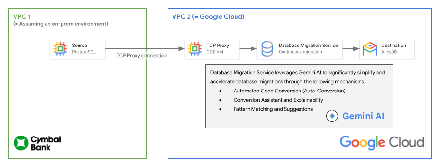

# Demo 1 - Migrate from PostgreSQL to Alloy DB using Database Migration Service

## Overview

In this lab, you will learn how to migrate a self-managed PostgreSQL database to
AlloyDB for PostgreSQL using Database Migration Service like the diagram below.



## Objectives

1.  Configure VPC Peering between source VPC and destination VPC
1.  Create a Database Migration Service Job to migrate the self-managed
  PostgreSQL database to Alloy DB for PostgreSQL cluster.
1.  After the migration completed, promote the Alloy DB cluster as Primary
    Database

## Prerequisite

* `Google Cloud Project` and an Account with `Editor` IAM Role

## Setup guide

1.  Clone "cloud-solutions" repo from Github with bellow command.

      ```shell
      git clone https://github.com/GoogleCloudPlatform/cloud-solutions.git
      ```

1.  Change directory to root of the lab you want to try like example command.

      ```shell
      cd cloud-solutions/projects/mmb-datacloud/phase1
      ```

1.  Deploy the lab environment using terraform command to Google Cloud Project.

      ```shell
      terraform apply
      ```

1.  Confirm that the lab environment correctly deployed with terraform command.

      ```shell
      terraform state list
      ```

      You will get a list of states like below.

      ```text
      data.google_compute_image.debian_image
      google_compute_firewall.vpc_1_allow_icmp_internal
      google_compute_firewall.vpc_1_allow_postgres_internal
      google_compute_firewall.vpc_1_allow_ssh
      google_compute_firewall.vpc_2_allow_icmp_internal
      google_compute_firewall.vpc_2_allow_ssh
      google_compute_instance.self_managed_postgres_vm
      google_compute_network.vpc_1
      google_compute_network.vpc_2
      google_compute_subnetwork.vpc_1_subnet
      google_compute_subnetwork.vpc_2_subnet
      google_project_service.apis["aiplatform.googleapis.com"]
      google_project_service.apis["alloydb.googleapis.com"]
      google_project_service.apis["cloudresourcemanager.googleapis.com"]
      google_project_service.apis["compute.googleapis.com"]
      google_project_service.apis["servicenetworking.googleapis.com"]
      ```

## Task 1. Migration Preparation

### Create a VPC Peering between VPC 1 and VPC 2

In this task, create a VPC peering between VPC 1 where the self-managed
PostgreSQL database deployed and VPC 2 where new Alloy DB Cluster will be
created.

1.  From the **Cloud Shell**, use below gcloud command to create a VPC Peering
    between VPC 1 to VPC 2

      ```shell
      gcloud compute networks peerings create vpc1-to-vpc2 \
         --network=vpc-1 \
         --peer-network=vpc-2 \
         --auto-create-routes
      ```

1.  Create another VPC Peering from VPC2 to VPC1

      ```shell
      gcloud compute networks peerings create vpc2-to-vpc1 \
         --network=vpc-2 \
         --peer-network=vpc-1 \
         --auto-create-routes
      ```

1.  Verify VPC Peering has been created correctly.

      ```shell
      gcloud compute networks peerings list --network=vpc-1
      gcloud compute networks peerings list --network=vpc-2
      ```

      Check that result of command shows similar output as below.

      ```text
      NAME          NETWORK  PEER_PROJECT                  PEER_NETWORK  STACK_TYPE  PEER_MTU  IMPORT_CUSTOM_ROUTES  EXPORT_CUSTOM_ROUTES  UPDATE_STRATEGY  STATE   STATE_DETAILS
      vpc1-to-vpc2  vpc-1    qwiklabs-gcp-00-0eaff2ed73b0  vpc-2         IPV4_ONLY             False                 False                 INDEPENDENT      ACTIVE  [2026-03-26T02:02:24.666-07:00]: Connected.
      NAME          NETWORK  PEER_PROJECT                  PEER_NETWORK  STACK_TYPE  PEER_MTU  IMPORT_CUSTOM_ROUTES  EXPORT_CUSTOM_ROUTES  UPDATE_STRATEGY  STATE   STATE_DETAILS
      vpc2-to-vpc1  vpc-2    qwiklabs-gcp-00-0eaff2ed73b0  vpc-1         IPV4_ONLY             False                 False                 INDEPENDENT      ACTIVE  [2026-03-26T02:02:24.666-07:00]: Connected.
      ```

### Enable Database Migration API

1.  In the **Google Cloud Console**, click the **search bar** or press **/** key
    and search `Database Migration` and click the **Database Migration** menu
    from **Search Result**.

1.  On the **Product details** page, click the **Enable** button to enable
    Database Migration API.

1.  After the API is enabled, search **Database Migration** again from the
   **search bar** and click the `Database Migration` from the **Search Result**.

1.  On **Database Migration** page,  click the **Migration jobs** menu from the
   **left menu bar** and click the **Create migration job** button.

## Task 2. Database Migration Service

### Create a migration job

1.  On **Create a Database Migration job** page’s 1st **Get started** step,
   please enter **Migration job name** as `self-managed-to-allydb`. **Migration
   Job ID** will automatically add the same as the job name.

1.  Choose `PostgreSQL` as **Source database engine** from **Source database
    engine list**.

1.  Choose `AlloyDB for PostgreSQL` as the destination database engine from
    **Destination database engine list**.

1.  Leave **Destination region** as `us-central1` and Migration job type as
   `Continuous` as automatically added value after choosing the source database
   engine.

1.  On **Before you continue, review the prerequisites** page, click the
   **Open** button to check the prerequisites for **PostgreSQL source** and
   **Connectivity**. After reading through the prerequisites click the **Save &
   continue** button to go to the next step.

### Define a source

1.  On the **Define your source** page, click the **Select source connection
    profile** combo box and click the **Create a connection profile** button.

1.  On **Create connection profile** section, please input `self-managed-cp` as
   **Connection profile name** and it will automatically populate same value at
   **Connection profile ID**.

1.  On the **Define connection configurations** section, click the **Define**
   button inside of the **PostgreSQL to PostgreSQL** box.

1.  Please keep the **PostgreSQL to PostgreSQL** page open and collect
    pre-configured values from the Cloud Shell environment using below commands.

    * Hostname or IP address

      ```shell
      gcloud compute instances describe self-managed-postgres-vm \
         --zone=us-central1-a \
         --format="value(networkInterfaces.networkIP)"
      ```

    * Port: `5432`
    * Username: `pgadmin`
    * Password: Check further steps

1.  The password of **pgadmin** user is generated inside of the
    self-managed-postgres-vm and can be figured out with the below command.

   ```shell
   gcloud compute ssh self-managed-postgres-vm \
      --zone=us-central1-a \
      --command='cat /var/log/pgadmin_password.log'
   ```

1.  You can get a similar output as below when executed the previous command.

   ```text
   gcloud compute ssh self-managed-postgres-vm --zone=us-central1-a --command='cat /var/log/pgadmin_password.log'
   pgadmin password: <RANDOM PASSWORD>
   ```

1.  Back to the **PostgreSQL to PostgreSQL** page and input the configuration
   with reference to what you discover from previous steps. And click **Save**
   button.

1.  Check the connection configurations from **Define connection
    configurations** page and click **Create** button.

1.  On "Define your source" page, check the **Select source connection profile**
   dropdown menu has selected `self-managed-cp` and click **Save & continue**

### Define a destination

1.  On **Define a destination** page, select **New cluster** from **Type of
   destination cluster** dropdown menu.

1.  On **Configure your cluster** page, Enter ** `managed-alloydb-cluster` at
    **Cluster ID** input box and click the **Generate** button to generate
    random password for **postgres** user. Select **PostgreSQL 16 compatible**
    from **database version** dropdown menu.

   >Note: Please make a copy of the password for further steps

1.  On the **Networking** section, change the **Network** value from `default`
   to `vpc-2` and leave the Automatic at the **Allocated IP range**. And click
   the **Confirm network setup** button from **Network setup confirmation
   required** section.

1.  After network setup completed, you can see the green notice box at
   **Networking** section that indicate **Private services access connection**
   created for `vpc-2` successfully.

1.  On **Configure your primary instance** page, check the **Instance ID**
   configured as `managed-alloydb-cluster-primary` and change **Zonal
   availability** from `Multiple zones` to `Single zone`.

1.  From the **Machine** section, change **Machine Type** to `2 vCPU, 16 GB` and
   leave other configurations as default.

1.  Click the **Save & continue** button below **Network Security** section.

1.  On **Create destination database?** popup window, click the **Create
   Destination & Continue** button to create an AlloyDB database. It will take 5
   ~ 10 mins to complete the creation task.

### Define connectivity method

1.  From the **Define connectivity method** section, choose `Proxy via
   cloud-hosted VM - TCP` option from the **Connectivity method** dropdown menu.

1.  From **Enter parameters for the Compute Engine VM** section, enter
   `tcp-proxy-vm` as name in **Compute Engine VM instance name** input box and
   choose `vpc-2-subnet` as **Subnetwork** where the instance will deployed. And
   click the **Continue** button.

1.  Middle of **Generate a script and run it** section, click the **View
    script** button.

1.  From the **View script** side panel, click the **Copy Icon** button at the
   top right corner of the codeblock.

1.  Save the file in **Cloud Shell** as **deploy-tcp-proxy.sh** file and execute
   the the script file to configure the TCP Proxy VM between VPC1 and VPC2.

1.  The execution of the script will yield results comparable to the example
    provided below. From the script output, ascertain and record the value
    corresponding to `INTERNAL_IP`.

   ```text
   WARNING: The option to deploy a container during VM creation using the container startup agent is deprecated. Use alternative services to run containers on your VMs. Learn more at https://cloud.google.com/compute/docs/containers/migrate-containers.
   Created [https://www.googleapis.com/compute/v1/projects/PROJECT_ID/zones/ZONE/instances/tcp-proxy-vm].
   WARNING: Some requests generated warnings:
   - You are creating a container VM. The option to deploy a container during VM instance creation that relies on a container startup agent will be discontinued. Use alternative services to run containers on your VMs. Learn more at https://cloud.google.com/compute/docs/containers/migrate-containers

   NAME: tcp-proxy-vm
   ZONE: us-central1-b
   MACHINE_TYPE: n1-standard-1
   PREEMPTIBLE:
   INTERNAL_IP: 10.20.0.2
   EXTERNAL_IP: 34.134.20.45
   STATUS: RUNNING
   Creating firewall...working..Created [https://www.googleapis.com/compute/v1/projects/PROJECT_ID/global/firewalls/tcp-proxy-vm-firewall].
   Creating firewall...done.
   NAME: tcp-proxy-vm-firewall
   NETWORK: vpc-2
   DIRECTION: INGRESS
   PRIORITY: 1000
   ALLOW: tcp:5432
   DENY:
   DISABLED: False
   networkInterfaces:
   - networkIP: 10.20.0.2
   ```

1.  Open the **Database migration job create** page again and click the
    **Continue** button from bottom of **Generate a script and run it** section.

1.  Enter the value of `INTERNAL_IP` in the **TCP Proxy private IP** input box
   and click the **Configure & continue** button.

### Configure migration databases

1.  From **Select objects to migrate** section, leave the default value `All
   databases` in **Database to migrate** and click the **Save & continue**
   button.

### Test and create migration job

1.  Review all the configurations from **Test and create your migration job**
   page and click the **Create & start job** button to start the migration.

1.  From the **Create & start migration job** popup window, click the **Create &
   start** button.

1.  On **Migration jobs** page, click `self-managed-to-alloydb` migration job
    from the list and check that `Status` is `Running` from job information
    section.

## Task 3. Verify a migration

1.  While the migration job is running, open another **Google Cloud Console**
   tab and search for `AlloyDB` and click the `AlloyDB for PostgreSQL` menu item
   from the search result.

1.  On AlloyDB for PostgreSQL page, click the `managed-alloydb-cluster`
   destination AlloyDB cluster from the **resource table** on the right side.

1.  On **AlloyDB cluster detail page**, click the **AlloyDB Studio** menu from
    the left side.

1.  Enter the values below in the **Log into your database** popup window. Click
    the **Authenticate** button to login.

   | Database | fraud\_detection |
   | :---- | :---- |
   | User | postgres |
   | Password | The password generated from previous **Define a destination** step. |

   > Note: If you lost the password while you created the Migration Job, you can
   > reset the password of postgres user by below gcloud command.

   ```shell
   gcloud alloydb users set-password postgres \
    --password='NEW PASSWORD' \
    --cluster=managed-alloydb-cluster \
    --region=us-central1
   ```

1.  On **SQL editor**, type `SELECT * FROM transactions LIMIT 100;` and
   (Win/Linux) Control + Enter or (Mac) Command + Enter to run the SQL command
   to check the migrated table and values.

1.  (Optional) Check the total size of the transactions table using the SQL
    command. Total table size will be approximately 846MB when the migration is
    completed.

   ```sql
   SELECT pg_size_pretty(pg_total_relation_size('transactions'));
   ```

## Task 4. Promote a migration

After verifying the migration, promote AlloyDB as your new primary database.

1.  Open **Database migration job** page that previously opened. Check all
   databases are **Running** status and `0 B` values on the **Replication
   delay** column. If all **Replication delay** values are `0 B` then click the
   **Promote** button at the top menu bar.

1.  On **Promote migration job?** popup window, click the **Promote** button.

1.  Check that the status of all databases are changed to **Completed** and show
   the **Migration promoted successfully** banner at the bottom of the page.

## Congratulations

You have successfully migrated from the self-managed PostgreSQL database to
fully managed AlloyDB for PostgreSQL service using Database Migration Service.
