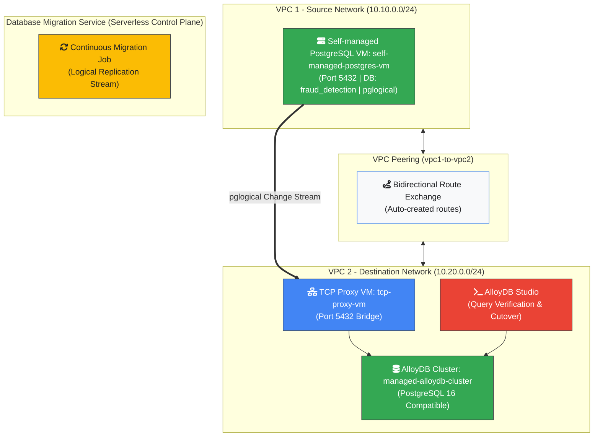

# Migrate from PostgreSQL to AlloyDB using Database Migration Service

## Overview

In this lab, you will migrate a self-managed PostgreSQL database to AlloyDB for
PostgreSQL using Google Cloud Database Migration Service (DMS).

### System Architecture



## Objectives

1.  Configure VPC Peering between source VPC `vpc-1` and destination VPC
    `vpc-2`.
1.  Create a Database Migration Service continuous migration job.
1.  Verify data replication in AlloyDB Studio.
1.  Promote AlloyDB cluster to primary.

## Setup & Verification

1.  In the **Cloud Shell**, verify that the lab environment is provisioned.

```bash
terraform state list
```

1.  Retrieve the PostgreSQL `pgadmin` user password from the VM logs.

```bash
gcloud compute ssh self-managed-postgres-vm --zone=us-central1-a --command="cat /var/log/pgadmin_password.log"
```

---

## Task 1. Migration Preparation

### Create VPC Peering between VPC 1 and VPC 2

1.  In **Cloud Shell**, run gcloud command to create VPC Peering from `vpc-1` to
    `vpc-2`.

```bash
gcloud compute networks peerings create vpc1-to-vpc2 --network=vpc-1 --peer-network=vpc-2 --auto-create-routes
```

1.  Create reverse VPC Peering from `vpc-2` to `vpc-1`.

```bash
gcloud compute networks peerings create vpc2-to-vpc1 --network=vpc-2 --peer-network=vpc-1 --auto-create-routes
```

1.  Verify VPC Peering status is active.

```bash
gcloud compute networks peerings list --network=vpc-1
gcloud compute networks peerings list --network=vpc-2
```

### Enable Database Migration API

1.  Search for `Database Migration` in **Google Cloud Console** and select
    **Database Migration**.
1.  Click **Enable** to activate the API.

---

## Task 2. Database Migration Service

### Create a Migration Job

1.  On **Database Migration** page, click **Migration jobs** in the left menu,
    then click **Create migration job**.
1.  Set **Migration job name** to `self-managed-to-alloydb`.
1.  Set **Source database engine** to `PostgreSQL`.
1.  Set **Destination database engine** to `AlloyDB for PostgreSQL`.
1.  Set **Migration job type** to `Continuous`.
1.  Click **Save & continue**.

### Define Source Connection

1.  Click **Select source connection profile** > **Create a connection
    profile**.
1.  Set **Connection profile name** to `self-managed-cp`.
1.  Select **PostgreSQL to PostgreSQL**.
1.  Retrieve the internal IP of `self-managed-postgres-vm`:

```bash
gcloud compute instances describe self-managed-postgres-vm --zone=us-central1-a --format="value(networkInterfaces.networkIP)"
```

1.  Enter connection configuration:

- Host / IP: Internal IP address of `self-managed-postgres-vm`
- Port: `5432`
- Username: `pgadmin`
- Password: Password retrieved from `/var/log/pgadmin_password.log`

1.  Click **Save**, then click **Create**.
1.  Select `self-managed-cp` and click **Save & continue**.

### Define Destination AlloyDB Cluster

1.  Set **Type of destination cluster** to `New cluster`.
1.  Set **Cluster ID** to `managed-alloydb-cluster`.
1.  Generate or input a password for `postgres` user.
1.  Set **Database version** to `PostgreSQL 16 compatible`.
1.  Set **Network** to `vpc-2`.
1.  Click **Confirm network setup**.
1.  Configure Primary Instance:

- Set **Instance ID** to `managed-alloydb-cluster-primary`.
- Set **Zonal availability** to `Single zone`.
- Set **Machine Type** to `2 vCPU, 16 GB`.

1.  Click **Save & continue** > **Create Destination & Continue**.

### Define Connectivity Method

1.  Select **Proxy via cloud-hosted VM - TCP**.
1.  Set **VM Name** to `tcp-proxy-vm`.
1.  Set **Subnetwork** to `vpc-2-subnet`.
1.  Click **Continue**.
1.  Click **View script**, copy the script, and execute it in **Cloud Shell**:

```bash
chmod +x deploy-tcp-proxy.sh
./deploy-tcp-proxy.sh
```

1.  Enter the `INTERNAL_IP` from script output into **TCP Proxy private IP**.
1.  Click **Configure & continue**.

### Start Migration Job

1.  Select `All databases`.
1.  Click **Save & continue**.
1.  Click **Create & start job**.

---

## Task 3. Verify Migration

1.  Navigate to **AlloyDB** > **AlloyDB Studio**.
1.  Authenticate using:

- Database: `fraud_detection`
- User: `postgres`
- Password: Your generated password

1.  Run verification query:

```sql
SELECT * FROM transactions LIMIT 100;
```

---

## Task 4. Promote Migration

1.  Return to **Migration jobs** page.
1.  Verify **Replication delay** is `0`.
1.  Click **Promote** from top action bar and confirm.
