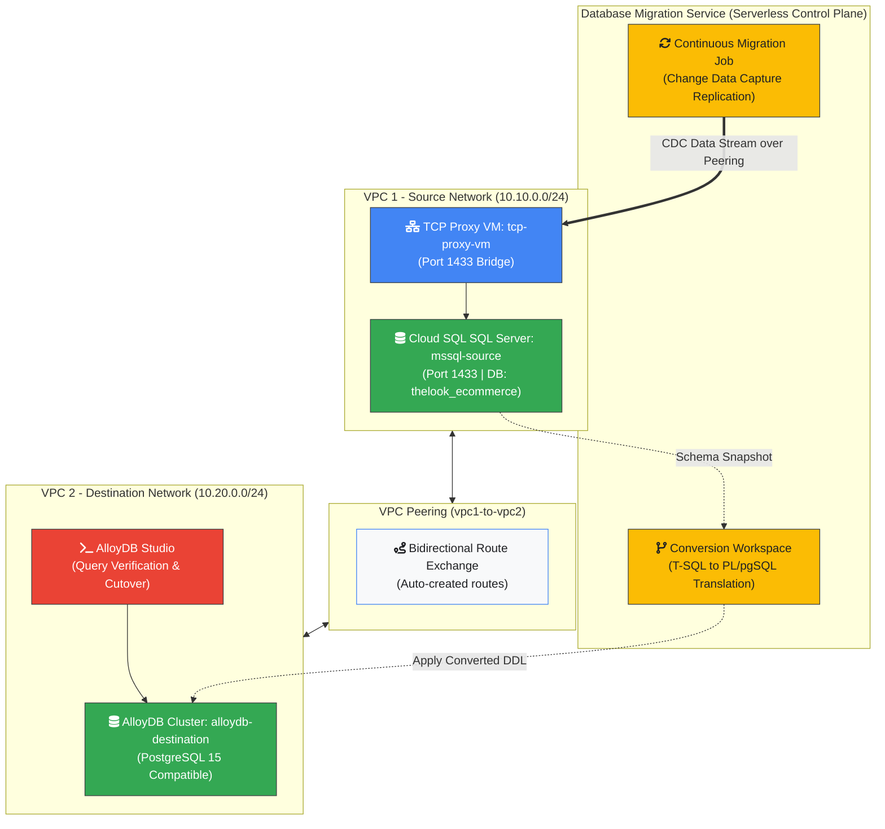

# Migrate from SQL Server to AlloyDB using Database Migration Service

## Overview

In this lab, you will learn how to migrate an enterprise Microsoft SQL Server
database (Cloud SQL for SQL Server) to **AlloyDB for PostgreSQL** using Google
Cloud **Database Migration Service (DMS)**.

Migrating across different database engines—known as a **heterogeneous
migration**—requires transforming both the database structures and stored
database logic (T-SQL to PL/pgSQL) before replicating data in real time with
minimal downtime.

### System Architecture

The following diagram illustrates the complete end-to-end lab architecture,
highlighting the network isolation across VPCs, Change Data Capture (CDC)
replication through Database Migration Service, and the proxy connectivity
bridge into AlloyDB:



## Objectives

1.  **VPC Networking:** Establish bidirectional VPC Peering between the source
    network (`vpc-1`) and destination network (`vpc-2`).
1.  **Schema & Code Conversion:** Utilize the DMS Conversion Workspace to
    automatically translate T-SQL schema definitions, data types, constraints,
    and stored procedures to PostgreSQL PL/pgSQL syntax.
1.  **Destination Provisioning:** Deploy a fully managed, high-performance
    **AlloyDB for PostgreSQL** cluster in `vpc-2` and apply the converted
    schema.
1.  **Continuous Replication:** Configure and launch a serverless DMS continuous
    migration job leveraging a TCP Proxy VM to stream Change Data Capture (CDC)
    events with near-zero downtime.
1.  **Data Validation & Cutover:** Verify table row counts and schema integrity
    in AlloyDB Studio, followed by promoting the AlloyDB cluster as the primary
    writable database.

## Prerequisites

- A **Google Cloud Project** with `Editor` IAM permissions.
- Basic familiarity with Google Cloud Console navigation, SQL Server (T-SQL),
  and PostgreSQL concepts.

---

## Task 1. Migration Preparation & Network Connectivity

In enterprise environments, source databases and target managed instances often
reside in isolated Virtual Private Clouds (VPCs). To allow DMS and proxy
services to communicate securely over private internal IPs without exposing
traffic to the public internet, you must configure **VPC Network Peering**.

### Step 1.1: Create Bidirectional VPC Peering between VPC 1 and VPC 2

1.  In **Cloud Shell**, establish the first peering link from `vpc-1` (source
    network) to `vpc-2` (target network).

```bash
gcloud compute networks peerings create vpc1-to-vpc2 --network=vpc-1 --peer-network=vpc-2 --auto-create-routes
```

1.  Create the complementary reverse peering link from `vpc-2` back to `vpc-1`.

```bash
gcloud compute networks peerings create vpc2-to-vpc1 --network=vpc-2 --peer-network=vpc-1 --auto-create-routes
```

1.  Confirm that both peering connections report an `ACTIVE` state.

```bash
gcloud compute networks peerings list --network=vpc-1
gcloud compute networks peerings list --network=vpc-2
```

_Explanation: Bidirectional route exchange allows resources in `vpc-2` (such as
the TCP proxy and DMS connectors) to route traffic directly to the private IP
address of `mssql-source` in `vpc-1`._

### Step 1.2: Enable the Database Migration Service API

1.  In the **Google Cloud Console** top search bar, search for
    `Database Migration` and select **Database Migration** from the results.
1.  Click **Enable** to activate the Database Migration API for your project.
1.  Once activated, select **Conversion workspaces** from the left navigation
    menu.

---

## Task 2. Schema and Code Conversion (T-SQL to PL/pgSQL)

Because Microsoft SQL Server and PostgreSQL handle data types, system functions,
primary keys, and procedural logic differently, heterogeneous migrations require
a **Conversion Workspace**. DMS parses the source SQL Server DDL and
automatically generates compatible PostgreSQL DDL.

### Step 2.1: Create a Conversion Workspace

1.  On the **Conversion workspaces** page, click **Set up Workspace**.
1.  Configure the workspace parameters:

- **Workspace name:** `mssql-to-alloydb-schema`
- **Source database engine:** `SQL Server`
- **Destination database engine:** `AlloyDB for PostgreSQL`
- **Destination region:** `us-central1`

1.  Click **Create & Continue**.

### Step 2.2: Define the Source Connection Profile

1.  On the **Define source connection** page, click **Create a connection
    profile**.
1.  Set **Connection profile name** to `mssql-source-cp`.
1.  Under **Connection configurations**, select **SQL Server to PostgreSQL**.
1.  In **Cloud Shell**, retrieve the private IP address of your source SQL
    Server instance.

```bash
gcloud sql instances describe mssql-source --format="value(ipAddresses[0].ipAddress)"
```

1.  Return to the console and enter the connection credentials:

- **Host / IP:** Enter the private IP address retrieved above (e.g.,
  `10.10.0.X`).
- **Port:** `1433`
- **Database:** `thelook_ecommerce`
- **Username:** `sqlserver`
- **Password:** Retrieve from the **Student Details Panel** under
  `SQL Server Password`.
- **Encryption type:** Select **None**.
- **Connectivity method:** Select **IP allowlist**.

> [!IMPORTANT]
> **Connection test warning:** Do not click **Test connection** (or ignore any
> connection timeout warnings). Direct connection tests will time out at this
> stage because the TCP Proxy VM (`tcp-proxy-vm`) is deployed in Step 3.3.
> Click **Create** directly to save the profile and continue.
>
> **Public IP list:** If the console displays a list of outgoing DMS public IP
> addresses after selecting "IP allowlist", you can safely ignore it. Traffic
> in this lab is routed privately via the TCP Proxy VM configured in Step 3.3.

1.  Click **Save**, then click **Create** to initialize the profile.
1.  Select `mssql-source-cp` from the list and click **Save & continue**.

### Step 2.3: Convert Schema Objects and Review DDL Translation

1.  Select the `thelook_ecommerce` database from the schema list.
1.  Click **Convert** to trigger the automated conversion engine.
1.  Once conversion completes, click the **Review and convert** tab to view the
    side-by-side DDL comparison:

- Observe how SQL Server types like `VARCHAR` or `DATETIME` are converted to
  PostgreSQL `TEXT` or `TIMESTAMP WITH TIME ZONE`.
- Check for any conversion warnings or action items under the **Issues** tab.

1.  Click **Apply to destination**.

### Step 2.4: Provision Target AlloyDB Cluster & Apply Converted Schema

Since the target AlloyDB cluster does not exist yet, DMS allows you to provision
an enterprise cluster directly from the conversion workflow.

1.  Under **Define a destination**, choose **New cluster**.
1.  Configure the AlloyDB cluster settings:

- **Cluster ID:** `alloydb-destination`
- **Database version:** `PostgreSQL 15 compatible` (or latest available)
- **Password:** Enter a secure password for the default `postgres` database user
  (e.g., `AlloyDBAdmin2026!`). _Make a note of this password._
- **Network:** Change from `default` to `vpc-2`.

1.  Click **Confirm network setup** to establish Private Services Access on
    `vpc-2`.
1.  Configure the Primary Instance:

- **Instance ID:** `alloydb-destination-primary`
- **Zonal availability:** `Single zone`
- **Machine Type:** `2 vCPU, 16 GB`

1.  Click **Create Destination & Continue**.
1.  _Wait 5–10 minutes for AlloyDB cluster creation._ Once provisioned, click
    **Apply** to execute the converted DDL scripts onto your new AlloyDB
    cluster.

---

## Task 3. Continuous Data Replication with Minimal Downtime

With the schema and tables established in AlloyDB, you can now launch a
**Continuous Migration Job**. DMS takes an initial data snapshot and
continuously streams ongoing changes (Change Data Capture) from SQL Server to
AlloyDB until cutover.

### Step 3.1: Create the Continuous Migration Job

1.  Navigate to **Database Migration** > **Migration jobs** from the left menu
    and click **Create migration job**.
1.  Set the migration parameters:

- **Migration job name:** `mssql-to-alloydb-data`
- **Source database engine:** `Microsoft SQL Server`
- **Destination database engine:** `AlloyDB for PostgreSQL`
- **Migration job type:** `Continuous`
- **Conversion Workspace:** Select `mssql-to-alloydb-schema` (created in Task
  2).

1.  Click **Save & continue**.

### Step 3.2: Select Source Profile and Destination Cluster

1.  For **Source**, select the `mssql-source-cp` connection profile. Click
    **Save & continue**.
1.  For **Destination**, select `alloydb-destination`. Click **Save &
    continue**.

### Step 3.3: Deploy TCP Proxy VM for Cross-VPC Connectivity

Because Cloud SQL SQL Server resides inside `vpc-1`'s Private Services Access
(PSA) network and GCP's VPC Peering is non-transitive (`vpc-2` $\rightarrow$ `vpc-1`
$\rightarrow$ `PSA`), DMS uses a small Compute Engine VM in `vpc-1`
(`vpc-1-subnet`) as a **TCP Proxy** to bridge 1-hop connectivity to SQL Server
over VPC Peering.

1.  Select **Proxy via cloud-hosted VM - TCP** as the connectivity method.
1.  Enter the VM configuration:

- **VM Name:** `tcp-proxy-vm`
- **Subnetwork:** `vpc-1-subnet`

1.  Click **Continue**.
1.  Click **View script** and copy the generated deployment script.
1.  In **Cloud Shell**, create a file named `deploy-tcp-proxy.sh`, paste the
    copied script into it, and save the file.
1.  Make the script executable and run it:

```bash
chmod +x deploy-tcp-proxy.sh
./deploy-tcp-proxy.sh
```

1.  Copy the `INTERNAL_IP` address outputted at the end of the script (e.g.,
    `10.10.0.X`).
1.  Paste the internal IP into the **TCP Proxy private IP** field in the console
    and click **Configure & continue**.

### Step 3.4: Select Migration Objects & Start Replication

1.  Select `thelook_ecommerce` under **Objects to migrate**.
1.  Click **Save & continue**.
1.  Review the summary details and click **Create & start job**.
1.  Confirm by clicking **Create & start**.
1.  Monitor the job status until it transitions from `Starting` to `Full dump`
    and finally to `Running` (Continuous replication phase). _(The initial
    `Full dump` snapshot phase takes approximately 2 to 4 minutes to
    complete.)_

---

## Task 4. Data Integrity & Schema Validation in AlloyDB Studio

Before performing cutover, validate that all tables, rows, and relationships
were correctly migrated from SQL Server into AlloyDB.

1.  Navigate to **AlloyDB** > **Clusters** in the Google Cloud Console and click
    `alloydb-destination`.
1.  Click **AlloyDB Studio** in the left menu.
1.  Authenticate with the following details:

- **Database:** `thelook_ecommerce` _(Created when applying the converted DDL
  in Task 2)_
- **User:** `postgres`
- **Password:** The password configured in Step 2.4 (e.g., `AlloyDBAdmin2026!`).

1.  Click **Authenticate**.
1.  In the SQL Editor, run query scans to verify row counts across the migrated
    tables:

```sql
SELECT COUNT(*) FROM users;
SELECT COUNT(*) FROM products;
SELECT COUNT(*) FROM orders;
SELECT COUNT(*) FROM order_items;
SELECT COUNT(*) FROM inventory_items;
SELECT COUNT(*) FROM distribution_centers;
SELECT COUNT(*) FROM events;
```

_Verification Check: Confirm that row counts match the source dataset (e.g.,
`events` contains 100,000 rows)._

---

## Task 5. Promote AlloyDB Cluster to Primary (Cutover)

Once continuous replication is verified and the replication latency reaches zero
seconds, you perform the final migration cutover by **promoting** the AlloyDB
instance.

1.  Navigate back to **Database Migration** > **Migration jobs**.
1.  Click `mssql-to-alloydb-data`.
1.  Check the **Replication delay** chart and verify that the delay is
    `0 seconds`.
1.  Click **Promote** on the top action bar.
1.  In the confirmation dialog, click **Promote**.
1.  Wait for the job status to update to `Completed`.

_Explanation: Promoting the migration job stops CDC replication, disconnects the
source SQL Server instance, and converts the AlloyDB cluster into a standalone,
fully writable primary database ready to serve production workloads._

---

## Congratulations

You have successfully executed a heterogeneous database modernization from
**Microsoft SQL Server to AlloyDB for PostgreSQL** using Google Cloud Database
Migration Service.

Key Milestones Achieved:

- Created cross-VPC networking via VPC Peering.
- Transformed T-SQL database logic and schema to PostgreSQL PL/pgSQL using DMS
  Conversion Workspaces.
- Established continuous Change Data Capture (CDC) streaming with a TCP Proxy VM
  bridge.
- Verified schema integrity using AlloyDB Studio and completed near-zero
  downtime cutover promotion.

---

## End Your Lab

When you have completed your lab, click **End** . Qwiklabs removes the resources
you have used and cleans the account for you.

You will be given an opportunity to rate the lab experience. Select the
applicable number of stars, type a comment, and then click **Submit** .

_Note: The number of stars indicates the following:_

- **1 star** = Very dissatisfied
- **2 stars** = Dissatisfied
- **3 stars** = Neutral
- **4 stars** = Satisfied
- **5 stars** = Very satisfied

You may close the dialog if you do not want to provide feedback.

---

## Additional Resources

- For more information about Google Cloud Training and Certification, see
  https://cloud.google.com/training/
- For more Google Cloud Platform Self-Paced Labs, see http://run.qwiklabs.com
- For feedback, suggestions, or corrections, please use the **Support** tab.
