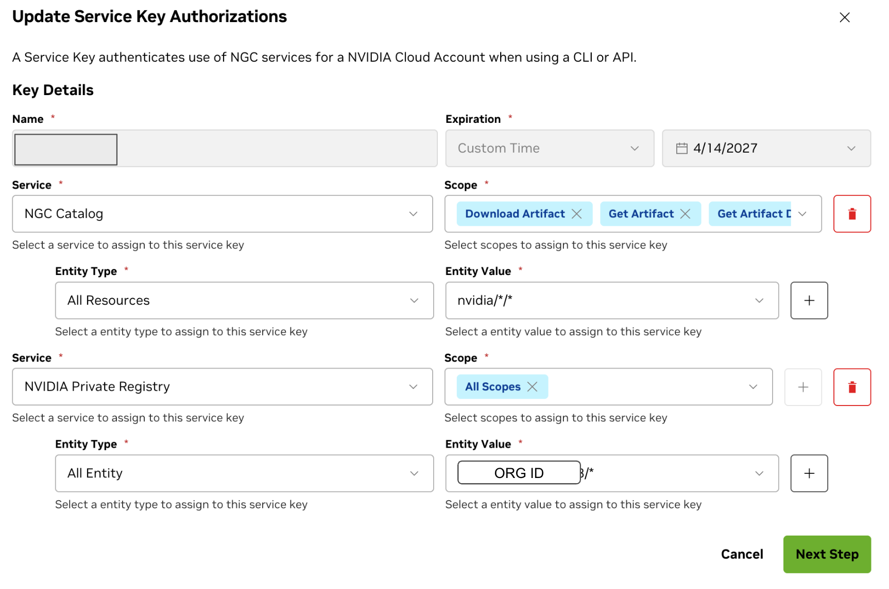
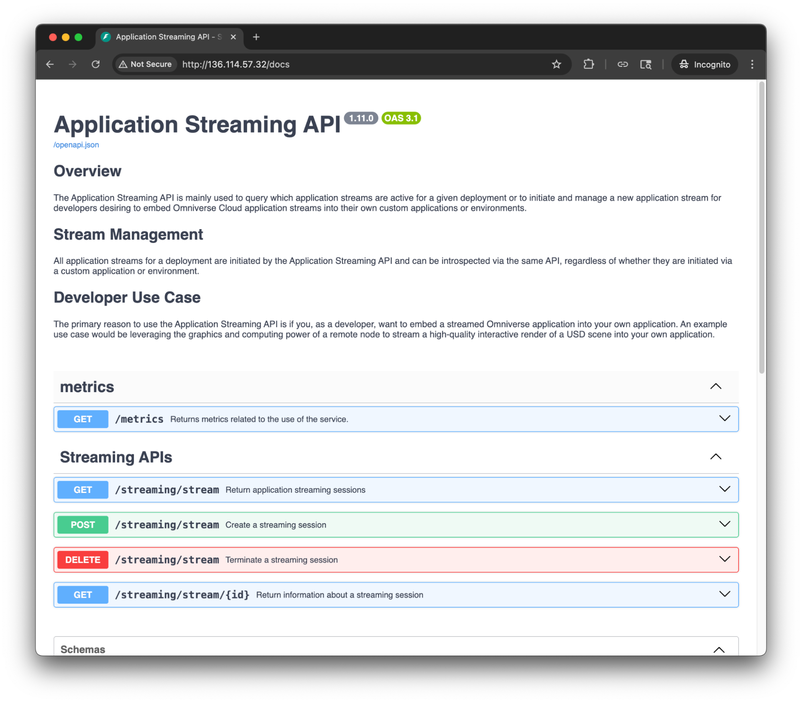
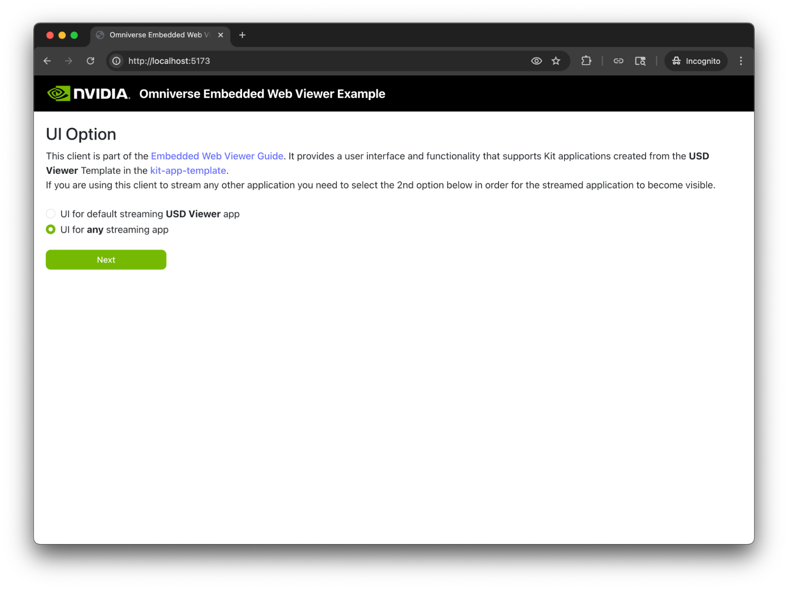
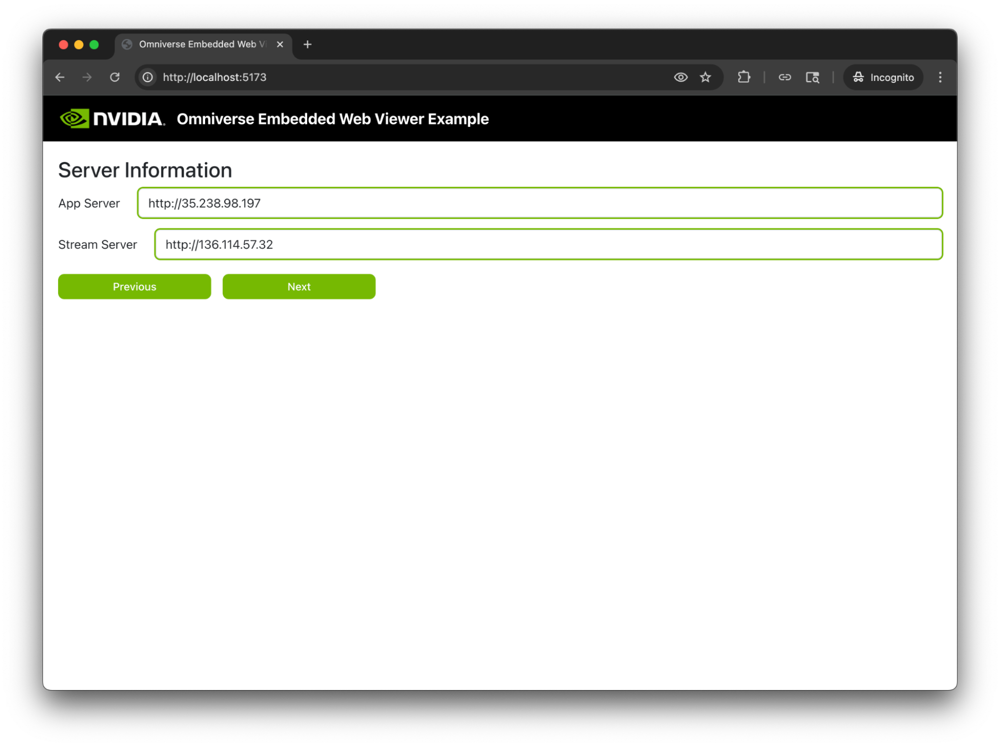
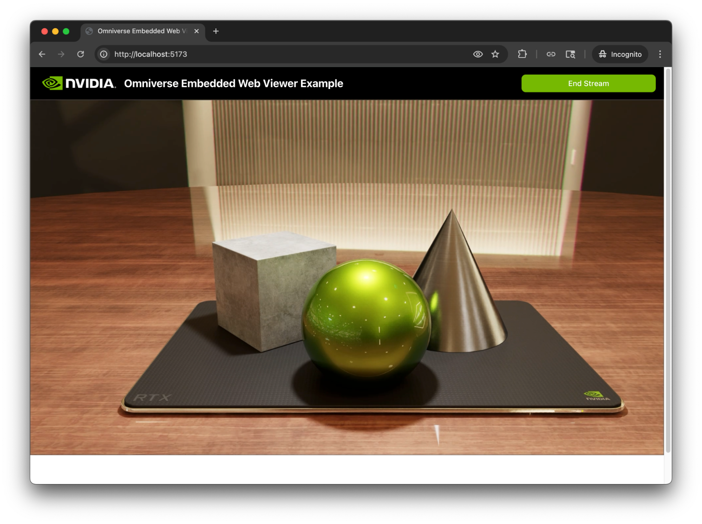
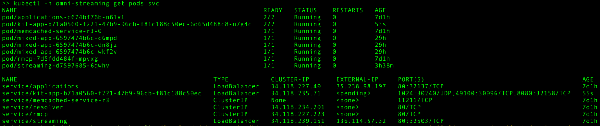

# Omniverse Kit App Streaming Setup with GKE

## Resources

* [Infrastructure & Setup — Kit App Streaming](https://docs.omniverse.nvidia.com/ovas/latest/deployments/infra/index.html)
* Manage the GPU Stack with the NVIDIA GPU Operator on Google Kubernetes Engine
(GKE)[link](https://cloud.google.com/kubernetes-engine/docs/how-to/gpu-operator#before_you_begin)

## Before you begin

* Ensure you have a default VPC in your project.
* Ensure you have account access to <https://ngc.nvidia.com>. Make sure you have
access with the following:
    * NGC catalog: downloading artifact and all resource "nvidia/*/*",.
      otherwise you cannot download the necessary package and create registry
      chart at ngc.
    * NVIDIA Private Registry access
* In your local terminal or Cloud Shell, install [NVIDIA GPU Cloud (NGC) CLI](https://org.ngc.nvidia.com/setup/installers/cli).
* Perform both google sdk login

```shell
gcloud auth login
gcloud auth application-default login
```

### Generate an API Key

At [https://org.ngc.nvidia.com/setup/api-keys](https://org.ngc.nvidia.com/setup/api-keys)
, create an API key with access for the following components:

* **NGC Catalog**
  NGC should have the following services
    Service: NGC Catalog
    Scope: Download Artifact, Get Artifact, Get Artifact Deployment
    Entity Type: All Resources
    Entity Value: nvidia/*/*
* **Secrets Manager**
* **Public API Endpoints**
* **Private Registry**
  NGC should have the following services
    Service: NVIDIA Private Registry
    Scope: All Scopes
    Entity Type: All Entity
    Entity Value: `<Organization ID>/*`



Use the api key for ngc login:

* Perform ngc login

```shell
ngc config set
```

### Determine Kit App Streaming version

Navigate to the [installation page](https://docs.omniverse.nvidia.com/ovas/latest/deployments/infra/installation.html)
for Kit App Streaming. At the top, you will see the **Latest Container
Release** . Note that version and set the `APP_VERSION` environment variable
to this version:

## Create a Standard GKE cluster

We create a standard cluster because:

1.  We need to customize the node types.
1.  We need to add 3 node pools (system-pool, memcached-pool, gpu-worker-pool).
1.  We need to add node labels to each pool.

**Note:** system-pool needs 3 nodes, not 1\.

### Define shell variables

In your local terminal or Cloud Shell, define variables for use in further steps:
Please check the latest version here:

* Kit app Steaming: <https://docs.omniverse.nvidia.com/ovas/latest/release-notes.html>
* GKE version (Rapid): <https://docs.cloud.google.com/kubernetes-engine/docs/release-notes>

```shell
export NGC_API_TOKEN="<your NGC token>"
export APP_VERSION="1.12.0"
export ZONE="us-central1-b"
export REGION="us-central1"
export PROJECT="<your GCP project>"
export CLUSTER_NAME="<your GKE cluster name>"
export USE_GKE_GCLOUD_AUTH_PLUGIN=True
export CLUSTER_VERSION="1.35.3-gke.1737000"
export CHANNEL="rapid"
```

### Create the cluster

Create a standard GKE cluster. This also creates default node pool, labelled `system-pool`:

```shell
gcloud beta container clusters create $CLUSTER_NAME \
  --project $PROJECT \
  --zone $ZONE \
  --no-enable-basic-auth \
  --release-channel $CHANNEL \
  --cluster-version $CLUSTER_VERSION \
  --machine-type "n2d-standard-4" \
  --image-type "UBUNTU_CONTAINERD" \
  --disk-type "pd-balanced" \
  --disk-size "100" \
  --node-labels "NodeGroup=system" \
  --metadata disable-legacy-endpoints=true \
  --num-nodes "1" \
  --enable-autoscaling \
  --min-nodes=1 \
  --max-nodes=3 \
  --enable-shielded-nodes \
  --shielded-integrity-monitoring \
  --no-shielded-secure-boot \
  --enable-l4-ilb-subsetting \
  --node-locations $ZONE
```

### Create the memcached pool

```shell
gcloud beta container node-pools create "memcached-pool" \
  --project $PROJECT \
  --cluster $CLUSTER_NAME \
  --zone $ZONE \
  --machine-type "c3-highmem-4" \
  --image-type "UBUNTU_CONTAINERD" \
  --disk-type "pd-balanced" \
  --disk-size "100" \
  --node-labels "NodeGroup=cache" \
  --num-nodes "1" \
  --shielded-integrity-monitoring \
  --no-shielded-secure-boot \
  --node-locations $ZONE
```

### Create the GPU node pool

```shell
gcloud beta container node-pools create "gpu-worker-pool" \
  --project $PROJECT \
  --cluster $CLUSTER_NAME \
  --zone $ZONE \
  --machine-type "g4-standard-48" \
  --accelerator "type=nvidia-rtx-pro-6000,count=1,gpu-driver-version=disabled" \
  --image-type "UBUNTU_CONTAINERD" \
  --disk-type "hyperdisk-balanced" \
  --ephemeral-storage-local-ssd count=4 \
  --disk-size "500" \
  --node-labels "NodeGroup=gpu,gke-no-default-nvidia-gpu-device-plugin=true" \
  --num-nodes "1" \
  --shielded-integrity-monitoring \
  --no-shielded-secure-boot \
  --node-locations $ZONE
```

To use DWS Flex mode for this node pool request, please add the following to
the above command:

```shell
--num-nodes "0" \
--flex-start \
--enable-autoscaling \
--reservation-affinity none \
```

### Connect to GKE cluster

In Cloud Shell, establish credentials so you can use `kubectl` on your new cluster:

```shell
gcloud container clusters get-credentials $CLUSTER_NAME \
  --zone $ZONE \
  --project $PROJECT
```

## Install NVIDIA GPU Operator

See to the [external documentation](https://cloud.google.com/kubernetes-engine/docs/how-to/gpu-operator#before_you_begin)
as reference, but note there are differences in how we install NVIDIA GPU
Operator on a cluster with G4 machines.

### Create the gpu-operator namespace

This namespace will contain all the resources necessary for GPU Operator.

```shell
kubectl create namespace gpu-operator
```

### Create resource quota

Create resource quota in the `gpu-operator` namespace by running this command:

```shell
kubectl apply -n gpu-operator -f - << EOF
apiVersion: v1
kind: ResourceQuota
metadata:
  name: gpu-operator-quota
spec:
  hard:
    pods: 100
  scopeSelector:
    matchExpressions:
    - operator: In
      scopeName: PriorityClass
      values:
        - system-node-critical
        - system-cluster-critical
EOF
```

### Set up Helm repository

Set up the Helm repository references on your deployment system. If you are not
using Cloud Shell, install Helm is required. In Cloud Shell run the following
commands:

```shell
helm repo add nvidia https://helm.ngc.nvidia.com/nvidia
helm repo add omniverse https://helm.ngc.nvidia.com/nvidia/omniverse/ \
  --username='$oauthtoken' \
  --password=$NGC_API_TOKEN
helm repo add fluxcd-community https://fluxcd-community.github.io/helm-charts
helm repo add prometheus-community https://prometheus-community.github.io/helm-charts
helm repo add bitnami https://charts.bitnami.com/bitnami
helm repo update
```

### Install GPU Operator resources

```shell
helm install gpu-operator -n gpu-operator \
  --create-namespace \
  nvidia/gpu-operator \
  --version=v26.3.0 \
  --set toolkit.installDir=/home/kubernetes/bin/nvidia \
  --set cdi.enabled=true \
  --set cdi.default=true \
  --set toolkit.env[0].name=CONTAINERD_CONFIG \
  --set toolkit.env[0].value=/etc/containerd/config.toml \
  --set toolkit.env[1].name=CONTAINERD_SOCKET \
  --set toolkit.env[1].value=/run/containerd/containerd.sock \
  --set toolkit.env[2].name=CONTAINERD_RUNTIME_CLASS \
  --set toolkit.env[2].value=nvidia \
  --set toolkit.env[3].name=CONTAINERD_SET_AS_DEFAULT \
  --set-string toolkit.env[3].value=true
```

### Daemonset for symbolic link creation

If the pods under `gpu-operator` namespace are failing with an error similar
to this, we have to create a symbolic link to that bin folder:

```shell
plugin type="ptp" failed (add): failed to find plugin "ptp" in path [/opt/cni/bin]
```

To do that at scale we are using a daemonset. Create a file called
`symlink-operator.yaml` containing the following:

```shell
apiVersion: apps/v1
kind: DaemonSet
metadata:
  name: cni-bin-symlink-creator
  namespace: gpu-operator # Or another appropriate namespace
spec:
  selector:
    matchLabels:
      k8s-app: cni-bin-symlink-creator
  template:
    metadata:
      labels:
        k8s-app: cni-bin-symlink-creator
    spec:
      nodeSelector:
        NodeGroup: gpu
      tolerations:
      - key: "nvidia.com/gpu"
        operator: "Exists"
        effect: "NoSchedule"
      initContainers:
      - name: setup-cni-link
        image: alpine # Small utility image
        command:
        - /bin/sh
        - -c
        - |
          set -e
          TARGET="/home/kubernetes/bin"
          LINK_DIR="/host/opt/cni"
          LINK_NAME="${LINK_DIR}/bin"

          if [ ! -e "${LINK_NAME}" ]; then
            mkdir -p "${LINK_DIR}"
            ln -s "${TARGET}" "${LINK_NAME}"
            echo "Symlink ${LINK_NAME} -> ${TARGET} created."
          else
            echo "Path ${LINK_NAME} already exists. No action taken."
          fi
          sleep 1
        securityContext:
          privileged: true
        volumeMounts:
        - name: host-root
          mountPath: /host
      containers:
      - name: pause
        image: k8s.gcr.io/pause:3.9 # Official minimal image
      volumes:
      - name: host-root
        hostPath:
          path: /
  updateStrategy:
    type: RollingUpdate
```

Apply the daemonset:

```shell
kubectl apply -f symlink-operator.yaml
```

### Verify GPU Operator is working

Once complete, you can verify GPU Operator is installed and working on your
cluster with the following command:

`kubectl -n gpu-operator get pods`

You should see a result similar to the following:

```shell
NAME                                                          READY   STATUS      RESTARTS   AGE
gpu-feature-discovery-rl44q                                   1/1     Running     0          115s
gpu-operator-84d7d7c545-qbz2j                                 1/1     Running     0          2m19s
gpu-operator-node-feature-discovery-gc-664cfcb6d9-dxmkr       1/1     Running     0          2m19s
gpu-operator-node-feature-discovery-master-6f97d7f876-gknrs   1/1     Running     0          2m19s
gpu-operator-node-feature-discovery-worker-4ctjp              1/1     Running     0          2m19s
gpu-operator-node-feature-discovery-worker-6w8m5              1/1     Running     0          2m19s
gpu-operator-node-feature-discovery-worker-g25qg              1/1     Running     0          2m19s
nvidia-container-toolkit-daemonset-dzfl2                      1/1     Running     0          115s
nvidia-cuda-validator-524p8                                   0/1     Completed   0          21s
nvidia-dcgm-exporter-tm87m                                    1/1     Running     0          115s
nvidia-device-plugin-daemonset-5lrjm                          1/1     Running     0          115s
nvidia-driver-daemonset-29ppr                                 1/1     Running     0          2m8s
nvidia-mig-manager-fl7d6                                      1/1     Running     0          10s
nvidia-operator-validator-xpjw4                               1/1     Running     0          115s
```

If any pods aren't marked `Running` or `Completed`, you can refer to NVIDIA's
GPU Operator [Troubleshooting documentation](https://docs.nvidia.com/datacenter/cloud-native/gpu-operator/25.3.2/troubleshooting.html).

## Install Omniverse streaming application

### Create namespace for Omniverse streaming

```shell
kubectl create namespace omni-streaming
```

### Create Image Registry pull secret

```shell
kubectl create secret -n omni-streaming docker-registry regcred \
    --docker-server=nvcr.io \
    --docker-username='$oauthtoken' \
    --docker-password=$NGC_API_TOKEN \
    --dry-run=client -o json | \
    kubectl apply -f -
```

## install of NVIDIA NGC

<https://org.ngc.nvidia.com/setup/installers/cli> offers the instruction on
 installing ngc which is needed for the next step:

### Download Helm resources

In Cloud Shell, create a directory to contain the App Streaming resources,
then download:
note: Make sure you do did the "ngc config set" command.

```shell
mkdir kit-app-streaming
cd kit-app-streaming
ngc registry resource download-version \
  "nvidia/omniverse/kit-appstreaming-resources:${APP_VERSION}"
cd kit-appstreaming-resources_v$APP_VERSION/resources
```

You can get the latest version at the top of the [docs](https://docs.omniverse.nvidia.com/ovas/latest/deployments/infra/installation.html).

### Install Memcached Service

**Note:** due to recent [changes](https://hub.docker.com/r/bitnami/memcached)
to the bitnami/memcached repo, we have to point the repo to `bitnamilegacy`
by modifying the file `helm/memcached/values.yml`. At the bottom of the file,
add the following:

```shell
image:
  repository: bitnamilegacy/memcached
  tag: 1.6.39-debian-12-r1
```

#### Deploy the memcached repository

```shell
helm upgrade --install \
  -n omni-streaming \
  -f helm/memcached/values.yml \
  memcached-service-r3 bitnami/memcached
```

### Install Flux Helm Controller and Flux Source Controller

```shell
kubectl create namespace flux-operators
helm upgrade --install \
  --namespace flux-operators \
  -f helm/flux2/values.yaml \
  --version=2.14.1 \
  fluxcd fluxcd-community/flux2
```

### Install Prometheus stack

```shell
helm pull prometheus-community/kube-prometheus-stack --untar
cd kube-prometheus-stack/charts/crds/crds/
kubectl apply -f . --server-side=true --force-conflicts
```

### Install Omniverse Resource Management Control Plane (RMCP)

#### Create user account secret

```shell
kubectl create secret -n omni-streaming generic ngc-omni-user \
  --from-literal=username='$oauthtoken' \
  --from-literal=password=$NGC_API_TOKEN \
  --dry-run=client -o json | kubectl apply -f -
```

#### Install Omniverse components

```shell
cd kit-appstreaming-resources_v1.12.0/resources
kubectl apply -f manifests/helm-repositories/ngc-omniverse.yaml \
  -n omni-streaming
```

**Note:** Due to a typo in the source config file, modify the file:

`kit-appstreaming-resources_v1.12.0/resources/helm/kit-appstreaming-rmcp/values.yaml`

* On line 26, change 'System' to 'system' (lower-case 's').

Then deploy the RMCP components:

Fetch the kit-appstreaming-rmcp

```shell
helm fetch https://helm.ngc.nvidia.com/nvidia/omniverse/charts/kit-appstreaming-rmcp-1.12.0.tgz --username='$oauthtoken' --password=< NGC personal KEY >
gunzip kit-appstreaming-rmcp-1.12.0.tgz
tar -xvf kit-appstreaming-rmcp-1.12.0.tar
```

```shell
helm upgrade --install \
  --namespace omni-streaming \
  -f helm/kit-appstreaming-rmcp/values.yaml \
  --version $APP_VERSION \
  rmcp kit-appstreaming-rmcp
```

### Install the Streaming Session Manager

Update the file `helm/kit-appstreaming-manager/values_generic.yaml` and change
the following:

```shell
backend_csp_args:
  enable_wss: false
  base_domain: ""
```

Save the file, and install the Helm chart:

```shell
helm fetch https://helm.ngc.nvidia.com/nvidia/omniverse/charts/kit-appstreaming-manager-1.12.0.tgz --username='$oauthtoken' --password=< NGC personal KEY >
gunzip kit-appstreaming-manager-1.12.0.tgz
tar -xvf kit-appstreaming-manager-1.12.0.tar
```

```shell
helm upgrade --install \
  --namespace omni-streaming \
  -f helm/kit-appstreaming-manager/values_generic.yaml \
  --version $APP_VERSION \
  streaming kit-appstreaming-manager
```

### Install Application and Profile Manager (AP)

The Applications and Profile Manager manages the available applications and
runtime profiles.

```shell
helm fetch https://helm.ngc.nvidia.com/nvidia/omniverse/charts/kit-appstreaming-applications-1.12.0.tgz --username='$oauthtoken' --password=< NGC personal KEY >
gunzip kit-appstreaming-applications-1.12.0.tgz
tar -xvf kit-appstreaming-applications-1.12.0.tar
```

```shell
helm upgrade --install \
  --namespace omni-streaming \
  -f helm/kit-appstreaming-applications/values.yaml \
  --version $APP_VERSION \
  applications kit-appstreaming-applications
```

## Update Appstreaming Session Helm chart

For GKE, we need to modify the default `kit-appstreaming-session` Helm chart to
include updated LoadBalancer service specifications to handle multiple protocols.

1.  The `kit-appstreaming-session` Helm chart is not included in the resources
downloaded earlier, so first pull the Helm chart from the NGC registry:

```shell
cd helm
mkdir kit-appstreaming-session && cd kit-appstreaming-session
helm fetch https://helm.ngc.nvidia.com/nvidia/omniverse/charts/kit-appstreaming-session-1.12.0.tgz \
  --username='$oauthtoken' \
  --password=<your NGC Key >
gunzip kit-appstreaming-session-1.12.0.tgz
tar -xvf kit-appstreaming-session-1.12.0.tar
```

1.  Extract the resulting archive and modify the file `templates/service.yaml`
to include the following lines at the top of the `spec:` section:

```shell
spec:
  loadBalancerClass: "networking.gke.io/l4-regional-external"
  externalTrafficPolicy: Local
  internalTrafficPolicy: Local
  type: {{ .Values.streamingKit.service.type }}
  ...
```

1.  Update `Chart.yaml` with a unique application version (changing both
`appVersion` and version `values`).

1.  Package the updated Helm chart:

   `helm package kit-appstreaming-session`

   An archive with your updated version is created in your current folder.

1.  Create a private entry in NGC for your updated Helm chart:

```shell
ngc registry chart create \
  [ORG_ID]/kit-appstreaming-session \
  --short-desc "custom session to handle LoadBalancer"
```

   Where `[ORG_ID]` is your NGC account organization ID.

1.  Push the artifact to your private NGC registry:

```shell
ngc registry chart push \
  --source kit-appstreaming-session-[APP_VERSION].tgz \
  [ORG_ID]/kit-appstreaming-session:[APP_VERSION]
```

   Where `[APP_VERSION]` is your updated Helm chart version.

1.  Navigate back to your original Helm resources directory, duplicate the file
 `manifests/helm-repositories/ngc-omniverse.yaml` then modify this new file:

   ```shell
   cd manifests/helm-repositories/
   cp ngc-omniverse.yaml ngc-omniverse-appstreaming-session.yaml
   ```

  Edit the new file and change the following values:

* `name: ngc-omniverse-kit-appstreaming-session`
* `url: https://helm.ngc.nvidia.com/[ORG_ID]`

1.  Apply the updated Helm repository to your deployment:

  ```shell
  kubectl -n omni-streaming apply \
    -f manifests/helm-repositories/ngc-omniverse-appstreaming-session.yaml
  ```

1.  In `resources/helm`, create a new directory called
`kit-appstreaming-session` to hold the updated `values.yaml` which contain
the following:

```shell
global:
  imagePullSecrets:
   - name: regcred

session:
  serviceConfig:
    root_path: ""
    prefix_url: "/session"

    # -- Flux release deployment timeout
    helm_flux_release_timeout: "5m"

  image:
    repository: "nvcr.io/[ORG_ID]/kit-appstreaming-session"
    pullPolicy: Always
    tag: [NEW_VERSION]

  affinity:
    nodeAffinity:
      requiredDuringSchedulingIgnoredDuringExecution:
        nodeSelectorTerms:
          - matchExpressions:
              - key: NodeGroup
                operator: In
                values:
                  - system

  nodeSelector:
    cloud.google.com/gke-gpu-partition-size: 1g.24gb

  monitoring:
    # -- Enables the creation of ServiceMonitor resource.
    enabled: true
    # -- Prometheus namespace.
    prometheusNamespace: "omni-streaming"
```

```shell
helm upgrade --install \
  --namespace omni-streaming \
  -f helm/kit-appstreaming-session/values.yaml \
  --version $APP_VERSION \
  applications omniverse/kit-appstreaming-session
```

## Install Omniverse sample application

Using NVIDIA's [documentation](https://docs.omniverse.nvidia.com/ovas/latest/deployments/apps/2_create_app_config.html)
as reference, install a sample application to test GKE functionality.

Move to the directory at the same level as `kit-app-streaming`, Create a
directory to store configuration files:

```shell
mkdir sample-application
cd sample-application
```

### Create an Application Custom Resource

In this new directory, create a file called `sample-application.yaml`
containing the following:

```shell
apiVersion: omniverse.nvidia.com/v1
kind: Application
metadata:
  name: usd-viewer
  labels:
    USD: "true"
    visualisation: "true"
spec:
  name: Omniverse USD Viewer
  description: View Universal Scene Description files.
```

Install the application:

```shell
kubectl apply -f sample-application.yaml -n omni-streaming
```

### Create an application version

Create a file called `application-version.yaml` containing the following:

```shell
apiVersion: omniverse.nvidia.com/v1
kind: ApplicationVersion
metadata:
  name: usd-viewer-[NEW_VERSION]
  labels:
    app: usd-viewer
    applicationName: usd-viewer
    version: '[NEW_VERSION]'
spec:
  helm_chart: ngc-omniverse-kit-appstreaming-session/kit-appstreaming-session
  helm_chart_version: '[NEW_VERSION]'
  container: nvcr.io/nvidia/omniverse/usd-viewer
  container_version: '107.3.1'
```

Install the application:

```shell
kubectl apply -f application-version.yaml -n omni-streaming
```

### Create an application profile

Create a file called `application-profile.yaml` containing the following:

```shell
apiVersion: omniverse.nvidia.com/v1
kind: ApplicationProfile
metadata:
  name: default
spec:
  name: default profile
  description: Updated memory and CPU settings.
  supportedApplications:
    - name: "usd-viewer"
      versions:
        - "*"
  chartMappings:
    container: streamingKit.image.repository
    container_version: streamingKit.image.tag
    name: streamingKit.name
  chartValues:
    global:
      imagePullSecrets:
        - name: regcred
    streamingKit:
      image:
        repository: nvcr.io/nvidia/omniverse/usd-viewer
        pullPolicy: Always
        tag: '107.3.1'
      sessionId: session_id
      name: kit-app
      service:
        type: "LoadBalancer"
        annotations:
          cloud.google.com/l4-rbs: "enabled"
      resources:
        limits:
          cpu: "4"
          memory: "30Gi"
          nvidia.com/gpu: "1"
        requests:
          nvidia.com/gpu: "1"
      env:
        - name: USD_PATH
          value: "'${omni.usd_viewer.samples}/samples_data/stage01.usd'"
```

Install the application:

```shell
kubectl apply -f application-profile.yaml -n omni-streaming
```

## Change services to LoadBalancers

By default, both applications and streaming services are created as `ClusterIP`
services. We need to switch this to `type:LoadBalancer`.

1.  Delete both ingress points:

```shell
kubectl -n omni-streaming delete ingress applications
kubectl -n omni-streaming delete ingress streaming
```

1.  Change `applications` and `streaming` services to `type:LoadBalancer`:

```shell
kubectl patch svc applications -n omni-streaming -p '{"spec": {"type": "LoadBalancer"}}'
kubectl patch svc streaming -n omni-streaming -p '{"spec": {"type": "LoadBalancer"}}'
```

1.  Confirm the services were changed, this is a sample output:

```shell
$ kubectl -n omni-streaming get svc
NAME                   TYPE           CLUSTER-IP       EXTERNAL-IP     PORT(S)        AGE
applications           LoadBalancer   34.118.227.40    35.238.98.197   80:32137/TCP   4m21s
memcached-service-r3   ClusterIP      None             <none>          11211/TCP      8m27s
resolver               ClusterIP      34.118.234.201   <none>          80/TCP         4m21s
rmcp                   ClusterIP      34.118.227.223   <none>          80/TCP         4m38s
streaming              LoadBalancer   34.118.239.151   34.58.95.51     80:30947/TCP   4m29s
```

1.  Test if the applications and streaming endpoints are working by navigating
to the following in a browser:

   [`http://[EXTERNAL-IP]/docs`](http://[EXTERNAL-IP]/docs)
   You should see an API usage page:

   

## Test the deployment

Use the NVIDIA [Web Viewer Sample](https://github.com/NVIDIA-Omniverse/web-viewer-sample)
to connect to the OKAS service:

Although the Cloud Shell offers localhost web preview, using a VM with external
IP / IAP tunnel to the machine is an good option.

```shell
gcloud compute instances create npm-server \
    --zone=us-central1-f \
    --machine-type=e2-medium
```

1.  Clone the repository to your local workstation:

   git clone [https://github.com/NVIDIA-Omniverse/web-viewer-sample.git](https://github.com/NVIDIA-Omniverse/web-viewer-sample.git)

1.  Follow the [instructions](https://github.com/NVIDIA-Omniverse/web-viewer-sample?tab=readme-ov-file#quick-start)
to build the application, paying close attention to the required dependencies.

1.  Modify the file stream.config.json and change the following:

   `"source": "stream",`
   `"appServer": "http://[APP_SERVER_IP]",`
   `"streamServer": "http://[STREAM_SERVER_IP]"`

   Both external IP addresses can be found via `kubectl -n omni-streaming get svc`.

1.  Run the Web Viewer:

   ```shell
   npm run dev
   ```

1.  In a local browser, navigate to [http://localhost:5173](http://localhost:5173)
    If using the VM, please replace the localhost with the external IP address

1.  You should see the Web Viewer UI:

   

1.  Select **UI for any streaming app**.

1.  Server Information should show the IP addresses of the App Server and Stream
Server:

   
   Click **Next**.

1.  Select **usd-viewer**, then **Next**.

1.  Select your custom version, click **Next**.

1.  Select **default**, click **Next**.

1.  You should see **Attempting to load stream…** In approximately two minutes,
the app should come up:

   

1.  You can check the status of the kit-app pod and LoadBalancer with:

```shell
  kubectl -n omni-streaming get pods,svc
```



* Click **End Stream** to close the stream. The pod and LoadBalancer will be
shut down.
